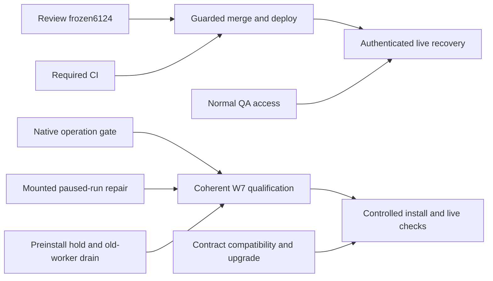
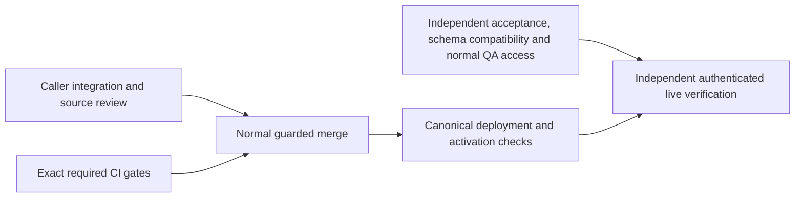

# Ship Verified System Workflow Outcomes

Resumed 2026-10-03 UTC. This is a partial release milestone within the existing full SupraOS agent-workflow project. All 33 project nodes, 16 behaviors, and supported execution surfaces remain in scope.

## CURRENT EXECUTION CHECKPOINT — 07:16 UTC

Active six-hour focus ends10:49:35 UTC. Root and three lanes finish the existing delivery paths; full33-node/16-behavior/supported-surface scope remains intact. Historical checkpoints below retain their original evidence limits.

| Step | Dependencies | Owner | Production caller / acceptance | Current state |
|---|---|---|---|---|
| S1 | None | Root + verifier | PR6124 triggerSystemWorkflow consumers; immutable source/composition review | Frozen4db478; scoped source/native/browser evidence retained |
| S2 | None | Prerequisites | Normal box-ci required security and build gates on4db478 | Both queued since01:27; observed normal FIFO rank7/8 of26 at07:12, progressing |
| S3 | None | Verifier | Normal QA owner and foreign-owner access; installed446 compatibility | Schema compatible; normal invitation unresolved |
| S4 | S1,S2 | Root | Unchanged guarded merge and canonical deployment | Pending required gates |
| S5 | S3,S4 | Verifier | Deployed original-run, permission, uncertainty and recovery journeys | Pending; public smoke does not substitute |
| H1 | None | Root + verifier | Homepage Collective actual canvas continues drawing at320/390/768/1200 | PR6146 dabbdaf9 frozen; final scoped types and independent browser pass |
| H2 | H1, required CI | Root + verifier | Guarded release then repeat deployed320 failure reproduction | Pending |
| C1 | None | Root + verifier | Existing Competitor Watch cron to durable card receipt | PR6066 successor7f18e0 published; seven runtime/test blobs unchanged; independent review/G11 pass; CI pending |
| C2 | C1, required CI | Root + verifier | Guarded release and active-worker attribution, natural recovery acceptance | Pending |
| W1 | None | Integration + verifier | Operation-bound claim/manual SQL and five admission callers | SQL333 gate, b87 handoff binding and a0d all19 touch controls pass in isolated direct PG; e937 receiver transport and final captured proof pending |
| W2 | None | Integration + verifier | Rerun paused-created response must not auto-execute | Paused rerun and Handoffs repairs mounted390/1440 pass; actual project-filter PostgREST proof passes; source identity SQLb87 native replay passes; actual receiver transport pending |
| W3 | None | Prerequisites + verifier | External preinstall hold, old-handler/direct-writer drain and faithful restore | Private proxy double30 passes; actual old-image isolated rehearsal and production controls unqualified |
| W4 | W1,W2,W3 | All lanes | Final coherent SQL/runtime/caller candidate, companions and recovery qualification | Not frozen for release yet |
| W5 | W4, required CI | Root + verifier | Controlled install/deploy/activation and authenticated live recovery | No production SQL installed |
| L1 | None | Root + verifier | submitEventAnchor reason3 through configured core_multi | PR6148 native23/86 and token audit pass; package VM compatibility/authorized upgrade/live proof pending; receiver held |

Shortest usable workflow release remains S1/S2 → S4 → S5, with S3 access joining at acceptance. CI evidence and normal access block that release; unrelated W7 schema work does not. W7 blockers are final combined/captured schema qualification, Handoffs and retrospective real PostgREST receiver/recovery proof, remaining manual/aggregate destinations, final schema companions, old-image operational qualification and contract compatibility. Owner and proof are explicit above. No task count is presented as a code-completion or effort percentage.

## Frozen capability

PR6124, current frozen commit `4db4788a2a410d826f3df280033c681973f99cdd` (original candidate `2e7d34c79b77ddbeb4fc74e14681de37c37d096a`): retain the original System Workflow when terminal persistence or a trigger response is uncertain; require durable completion evidence and avoid replacement execution. Existing voice, memory-promotion, Telegram, collaboration, coordinator-loop and checkpoint callers are the integration targets. No new SQL is introduced; fresh read-only installed migration446 compatibility has passed.

The observed production web and cron image now both carry `abc93d09fc21616dd69fe54675aada3d779a9da7`; public /api/version agrees. Main is `48335f35f68170ea78fe0e640bce74504ae687f7`. This upstream deployment contains the separately authored Build delivery-planning skill change; its full live planning journey is not verified here. These observations do not prove every service image. The independently reproduced delegation blocker permits one narrow successor: runtime repair `fb2cdc0f133e4a8f9df70b005f43eb2c2d43c9d7`, regression tests through `97c04df19a9719df3fa60ef92c8ba79052e4302d`, and coherent current-main merge candidate `5588b3c8b97590550865670a1624599f06851499`. The sole merge conflict was test setup; both existing #6030 tests and the held-delegation fixture are retained. Final published successor is `4db4788a2a410d826f3df280033c681973f99cdd`, a catalog-only child of5588. It repairs a separately reproduced stale writer-inventory failure, with no runtime/test/schema changes. It is frozen for required CI, not merged or deployed.

## Dependency path and lane ownership

| ID | What must become true | Dependencies | Production caller and integration owner | Owned files | Pass/fail proof |
|---|---|---|---|---|---|
| R1 | Changed paths retain originals and report held outcomes truthfully | None | Existing triggerSystemWorkflow callers; integration lane | Isolated integration evidence; only demonstrated blocker repairs | Actual caller map, preserved failure if any, source review and relevant immutable-source checks |
| R2 | Exact candidate passes both required gates | None | Existing box-ci jobs; prerequisites lane | CI evidence; no product edits | Security and production-build success on exact SHA, tested merge source recorded |
| R3 | Live verification is executable with legitimate access and compatible installed schema | None | Owner run-history APIs/UI and changed execution routes; independent verifier | Verification evidence and isolated tests | Installed catalog/ACL/index compatibility, normal QA invitation/session, concrete live acceptance matrix |
| R4 | Reviewed candidate is merged under existing controls | R1, R2 | merge-if-green.sh; root | Merge receipts | Exact-head normal guard succeeds; current-main composition reviewed |
| R5 | Merged behavior is deployed and available safely | R4 | Canonical app deployment; root | Deployment receipts | Running source identified and existing schema/capabilities compatible; no unsupported activation |
| R6 | Actual deployed behavior passes acceptance | R3, R5 | Owner run list/detail and actual execution callers; independent verifier | Browser/transport/recovery evidence | Positive, denied, failed, cancelled, uncertain-original and recovery behavior checked without duplicate effects or false success |

Round 1 runs R1/R2/R3 concurrently with no shared writable source. Round 2 is R4; round 3 R5; round 4 R6. The longest graph chain is R1 or R2 -> R4 -> R5 -> R6. R3 may dominate elapsed time because access is external; no duration estimate is implied. Installed compatibility is checked before unsafe activation, even though QA access can remain pending while ordinary deployment work proceeds.

## Current blockers by type

- Code: original `2e7d` held handoff throws after the specialist indicator starts, leaving actual Chat with a generic Stream error and no original reference. RED executor/consumer, actual Chat POST and Linux Chromium evidence is preserved. The successor repairs this caller and live/restored adapters. Independent Linux executor/hook/HuddleCard tests pass at390/1440; actual Chat POST retains the UUID and waiting_for_owner even when contribution/meeting writes fail, with no further model/delegate call. Saved-history API projection and actual Organization adapter plus mounted HuddleCard pass3/3 on97c; auth/DB are stubbed and this is not full live ChatView hydration. Exact merged5588 independent Linux browser/history7/7, Telegram HTTP/browser53/53 and actual held Chat POST1/1 now pass.

- Evidence/infrastructure: exact-head required CI failed with ENOSPC and four earlier test-suite failures requiring separate diagnosis. Capacity recovered. The ordinary CI service automatically superseded the original jobs when successor5588 was published; their partial and failed logs are preserved. The final4db478 contexts must qualify through the same normal queue; no queue priority, slot, budget or gate changes are authorized. Final4db478 successor requires its own exact-head required gates; preserve original failed logs and do not cancel unrelated qualification. Owner: prerequisites lane. Proof: both required contexts success, not scoped-test counts.
- Evidence: CLOSED: fresh installed migration446 compatibility passed through the existing authorized app-container connection, BEGIN READ ONLY and ROLLBACK. Columns, RLS, service grants and the unique original-run idempotency index are present. No rows inspected or writes performed. Owner: independent verifier.
- Access: dedicated QA wallet previously hit the normal invite-only gate. The user reports a signed-in Claude session, but the reachable CLI reports signed out; its session location is being clarified. A concrete normal invitation request has been sent to the owner; no self-sponsorship or auth bypass. Owner: verifier/root, then existing authorized member if needed. Proof: normal admitted signed session and owner/foreign-owner checks.
- Code, outside this frozen milestone: W7 postdispatch original-claim settlement and recovery remain unfinished. The implicated code is unchanged from this candidate baseline; it is not automatically a PR6124 blocker.
- Inherited product limitation: memory-promotion UI treats an explicit failed response as complete because it checks HTTP success. This is baseline behavior, distinct from PR6124's newly held uncertain outcomes. Record and repair in a following candidate; do not claim all truthful-outcome behavior finished.

PR6143 disk-admission protection remains independent; installation is not a newly invented gate for PR6124. No source, test, budget, permission or merge control is weakened.

## Progress states and checkpoint questions

Implemented: bounded caller repair plus narrowly reconciled writer inventory. Integrated: real delegation, Chat route, live hook, huddle, Organization adapter and specialist-events projection. Tested: exact merged5588 canonical Chat suite157/157, native PostgreSQL/PostgREST18/18 and changed-file types115 pass; targeted226pass/8skip with four macOS Chromium launch failures resolved by exact-source Linux replay; the failures are preserved. Independently reviewed: preserved original caller RED and successor green browser/native evidence; then exact4db478 catalog34/34 and direct scanner passed. Catalog correction maps four historical coordinator UPDATE rows to its two actual current sites. All unrelated2351 rows and all hazards/classifications are unchanged; strict E3 remains RED6104. Runtime qualification remains attributed to5588 and carries by identical blobs. Merged: no. Deployed: no. Verified live: no.

The usable capability moving closer is safe retention and truthful display of uncertain System Workflow originals. Schema compatibility and the demonstrated delegation caller gap have concrete proof; final merged-source qualification is not yet closed. Next blockers are exact successor CI (prerequisites), guarded merge/deployment (root), and normal authenticated live access (existing authorized member plus verifier). The CI lane continues this release path. While it waits, integration and verification resume the existing W7 settlement blocker on separate source; that successor will not change or restart PR6124 qualification.

Full completion remains all supported execution paths and all 16 behaviors deployed, activated where required, independently verified live, with tested recovery. Owner tests come after independent verification, never in place of it.

## Prepared next steps and fresh-machine evidence

Current source is PR6124 head4db478; local isolated author worktree is `/Users/joshuatobkin/qa-lanes/release-integration-6124-catalog-20261003`. Earlier runtime composition lives in `release-integration-6124-current-main-join-20261003`. Evidence root is `/Users/joshuatobkin/qa-evidence/resume-delivery-20261003`. On a new computer, clone `jtobkin/suprafx-platform`, fetch the PR head, use repository Node22 and AGENTS/CONTEXT instructions, and run normal release controls; local machine paths are evidence locations, not portable prerequisites.

Deployment inspection confirms the installed main poll, not the proposed SHA-pinned host patch. Verify actual web and cron image IDs/stamps after guarded merge; there is no qualified one-command image rollback. Revert through reviewed main remains the documented rollback path. Live acceptance preparation includes a normally signed, budgeted voice-router positive request, original durable run detail/UI and cross-owner denial. Deterministic cancellation/ACK-loss faults remain image-bound disposable tests, never customer fault injection. Normal QA session access is unresolved: the owner reports a valid Claude login, while this process has abnormal account/Keychain lookup and no supported messaging route.

Existing stacked PR6127 has a clean read-only merge tree against final4db478 and freshly confirmed installed pause/checkpoint columns and service grants. After6124 squash-merges, prepare a pause-only successor on the actual resulting main and qualify it exactly. Do not reintroduce the old base commits or claim live pause behavior from catalog checks.

## Existing W7 repair running alongside release qualification

This is unfinished agreed scope, separate from the frozen PR6124 release. Independent replay of the preserved3f5 source again fails both actual cron and owner-route postdispatch cases: an old result calls settlement after a newer claim is saved. The failed log is `verification/w7-postdispatch-3f5-independent-red.log`, SHA256 `8b97aaa7a11c2914736385179a49093d38fa5e09b3a670a7783e574a0d2c59be`. The failure is inherited and does not justify changing PR6124.

The next usable capability is safe completion of the original project task, including downstream work and recovery after a lost acknowledgement. Merely dropping all results or adding another non-atomic read is not acceptance.

| Step | Depends on | Owner and production integration | Owned source/evidence | Acceptance |
|---|---|---|---|---|
| W7-A | None | Integration: saved project execution claim | Own isolated successor; claim producers, orchestrator and additive schema source | Every execution retains an owner/plan/task/run-specific server claim; model/body fields cannot forge it; legacy attempts have explicit recovery policy |
| W7-B | W7-A | Integration: completion, failure and uncertain-outcome settlement | Same production lane; atomic settlement, durable receipt and recoverable effect delivery | Stale token cannot mutate a new attempt or emit completion effects; same token returns its original receipt; lost acknowledgement cannot duplicate effects |
| W7-C | W7-A contract; W7-B for final green | Independent verifier: cron, owner execute, runExecutionCycle and workspace actions | Separate test worktree and native/browser evidence | Real database races, concurrent claims, lost acknowledgements, postcommit recovery, normal positive path, denied/legacy/manual-action cases and all callers |
| W7-D | W7-B, W7-C | Root and existing schema-release owner | Immutable qualification, schema/drain/restore and release receipts | Independent review, required gates, safe schema-first installation, guarded merge/deployment, then authenticated live acceptance |

Contract design and independent test preparation can run together; runtime implementation and final native acceptance share explicit dependencies. No production SQL is authorized by this source-development step. The existing schema admission/drain/restore and QA-access prerequisites remain required for release. Shared verification-host capacity is checked before native/browser execution; no foreign jobs or containers are removed.

### W7 database milestone evidence (intermediate)

Independent PostgreSQL17.11/PostgREST14.18 replay passed9/9 on schema bytes SHA256 `4600bc689dbe39fcd99a4b94940bd775427d6d47f522574ebebcb8a0266325eb`. Log `verification/w7-native-first.log` SHA256 `c2ef47889376fdb03c3a84e1a4b4de12e169aa735597f40b87f968530ddfa24c` records zero skipped cases. The cases cover original claim, foreign-owner refusal, lost settlement acknowledgement, stale A versus newer B with B positive completion, historical A receipt after B, fanout intents, exclusive review, manual-action replay, and malformed input/effect-state controls. Fixtures use reduced plan tables, administrator-driven supersession and synthetic receiver evidence. This is not actual caller, receiver, UI or production acceptance. The expanded12-case overlay subsequently passed on unchanged4600bc, adding concurrent requests, unrelated-task conflict and anonymous/authenticated denial. A later independent manual stale-plan case then failed: a stale prepared plan was incorrectly admitted. Preserved RED log `verification/w7-manual-stale-4600-red.log`, SHA256 `be138d4db3c847761f8be84eb45f2be27ab8b7f6de126dd2b07d108104367793`. Successor46046a passed13/13: stale version refuses without changing saved costs, estimates or version; ordinary manual completion and historical receipt replay still work.

Runtime claim producers are being integrated in `/Users/joshuatobkin/qa-lanes/w7-claim-settlement-successor-20261003`; the worktree is deliberately nonpublishable while settlement and delivery remain incomplete. Root's `verification/w7-legacy-effect-inventory.md` enumerates the existing completion/failure destinations so the rewrite cannot silently omit useful behavior. Full scope and the frozen PR6124 candidate are unchanged.

### Current W7 qualification checkpoint

Forward SQL SHA256 `dae8357a42f3b177cf9003324c6c0995a076c764197329d7ad0d7d7e03393b5b` independently passed **15/15 PostgreSQL17.11/PostgREST14.18 cases**. Log `verification/w7-native-dae835-15.log`, SHA256 `ef6a4c97349ef39b8ff3a39f32b172c4d5fd2cff52f912d73991e5d911db7da3`; verifier SHA256 `f192583f25a4f8fc8373b9d8e63116346ab6473cfe6a2d33a7378ac1bf77cda7`. The new real execution-log receiver commits a keyed log row and delivered intent atomically; retry after a lost HTTP acknowledgement returns the same row without duplication. Foreign-owner manual requests are denied without writes. This closes one database receiver dependency, not every downstream destination.

Implemented: claim/settlement schema and one durable receiver in draft. Integrated: production caller and scheduler work remains active. Tested: the exact SQL stage has15 native passes; current runtime scoped tests still have13 passes/21 failures, primarily fixtures not yet adapted to the new settlement contract. Those results do not qualify runtime. Independently reviewed: database evidence and legacy-effect inventory; rollback draft review found incomplete drift checks, now assigned to prerequisites. Merged: no. Deployed: no. Verified live: no.

Next dependencies: integration owns preserving scheduler and downstream behavior plus exact original-claim caller wiring; verifier owns actual caller/manual-route and mounted UI acceptance against frozen runtime; prerequisites owns exact VERIFY/ROLLBACK and captured-schema rehearsals, including refusing retained data and catalog drift. Schema packet worktree: `/Users/joshuatobkin/qa-lanes/w7-schema-packet-prereq-20261003`. All development remains separate from frozen PR6124, whose two required contexts remain pending in the normal queue. Normal authenticated QA invitation remains unresolved; the owner identifies Claude's account as signed in, but this process cannot reach that session.

### Recovery integration findings and next coherent freeze

The scheduler SQL stage `923ebb834310931e3c3c61db2aaa568cb1af3cae2ed4a0fdb94d69fda5c2e46f` passed20/20 independent native cases after correcting a verifier-only SELECT omission. Preserved parser RED on predecessorb905 executed no test cases; neither failure is erased. The subsequent d8257b deadline stage passed21/21, proving stored deadline values, not locked expiry enforcement. Required next changes are being consolidated before another runtime+SQL qualification: canonical result digests across JSONB readback; strict handling of actual head-review errors/invalid verdicts; database-time recovery selection and locked expiry checks; and the manual route's awaited async error handling.

Independent actual manual-route replay found a lost-ACK exception escaped the normal HTTP500 handler because the route returned an async function without awaiting it. Three other cases passed: original action receipt after task replacement, version-conflict rebase, and owner denial. The narrow `return await` repair awaits replay on frozen source. Root's recovery audit is `verification/w7-jsonb-digest-recovery-audit.md`; native20 log SHA256 `010661c12eb653174bc176d9b2b5f49c5d1068c3e568f52b79a1957fa10e435b`; native21 log SHA256 `3dfe9b4bcd5b304253c2ce83c982b77032ad8c5df57b120b612a2a6265266558`.

The first schema packet fixture is reduced/authored, not captured production. Captured-schema replay remains a separate required gate. Rollback comparison now retains ownership and ACLs. Legacy output, approval, memory, learning, handoff and terminal destinations remain open until real receivers and recovery are implemented; queued intents alone are not delivered capability. No W7 merge, deployment or production installation has occurred.

### Latest receiver and recovery evidence — 2026-10-03

The SQL snapshot `2700d4d98ca1afa3090c90959d268f5227c38f05453265bc27dcc081af5bbcfe` passed **30/30 independent native PostgreSQL17.11/PostgREST14.18 cases**. This includes the original approval card surviving a lost acknowledgement without duplicate, foreign-owner denial, stale unknown-claim refusal, and rejection of a preexisting card with the wrong outcome_unknown flag. Log `verification/w7-native-2700d4-owner-review.log`, SHA256 `afff9a506e148ba7bb5c81a5ecd94cd4c9cc6e5d85ea4b6784c07eaca77e217d`. This exact snapshot predates the completed-claim marker repair and plan-finalization receiver; those changes require their own independent replay.

The raw-output receiver separately passed the 27-case native stage using canonical migration487 and the earlier effect ledger. The actual manual route and strict head-review helper passed nine focused checks; the actual settler-to-head-review overlay passed three unknown-verdict cases without provider replay. Approval classification has 22 unit cases and is integrated into both legacy and claimed-task paths, with explicit structured-output conversion. Actual caller/card verification remains pending. The actual cron-route fairness fixture passed with 22 older held outputs: fresh pending output progressed on the first tick and all held outputs received a recovery check within five ticks. Its database/receiver are mocked; final native fairness proof is still required.

The provisional d825 schema packet also passed against the full dated September29 captured schema: forward, VERIFY, empty rollback with owner/ACL/schema dump equality, reapply and VERIFY. This proves compatibility with that dated capture only. It does not establish current production compatibility or qualify later SQL changes. Final packet must include all current functions, columns and indexes, exercise receiver-versus-maintenance lock ordering, and repeat the captured-schema and refusal checks.

Current implementation focus: settlement can finish a plan before the legacy project route finalizes its project and execution-run rows. Integration owns an atomic core plan_finished receiver, while Telegram, chain, retrospective and other secondary destinations need separate durable intents and receiver proof. Root's legacy-effect inventory remains the scope checklist; unfinished secondary effects cannot be represented as delivered.

Current states: implemented — claim/settlement and three bounded receivers in evolving source; integrated — production settlement/cron wiring exists but full caller/finalization coverage is unfinished; tested — exact intermediate native and focused caller evidence above; independently reviewed — receiver binding, lock order and preserved failure repairs; merged — no W7 merge; deployed — no W7 deployment or schema installation; verified live — no W7 live acceptance. PR6124 remains independently frozen at4db478; both required GitHub contexts were freshly observed pending. Normal QA invitation and final authenticated acceptance remain open.

### Captured-type repair and learning delivery checkpoint

The earlier native36 plan-finalization result was insufficient: independent tests reproduced same-run snapshot drift and PostgreSQL42883 against the actual TEXT plan.project_id versus UUID project/run IDs. Parser and SQL NULL/JSON null failures in intermediate successors were also preserved. Frozen SQL `d6bdfc0e75502d33c676053cb23274c4151dcf60973bb91aaac45bc2ee535fb` now passes40/40 independent native cases with captured column types, including terminal snapshot/UUID guards and head-review exact fact recovery. Native log SHA256 `90c7e401dda7dcd6104231c9db29961a942ff96e85cb5ed24e4d76fab4382fce`.

Original agent-learning receiver `6927ceacd4` plus that ledger passed43/43 native cases, including lost ACK, conflict, foreign denial and late exact row reconciliation. Log SHA256 `35b6fd5bcc102a35ce7eb8a80b69b596ffe3b63c842fa5bd95deca22dd3f4085`. It is mounted in settlement and cron. Original estimation receiver `290f44ffca` is also mounted:15 focused tests and11-file scoped types pass; native acceptance remains pending. Integer target columns are respected; fractional values remain explicitly held, not rounded or declared delivered.

Owner-route no-count CAS failure was independently reproduced: a null update count allowed legacy project effects despite zero matched plan rows. Repaired route uses returned-row evidence and rereads current state; four handler tests pass with mocked auth/database. Real mounted UI and authenticated live proof remain separate.

Schema rollback negative-first evidence now covers orphan outcome/completion markers and keyed owner/head-review/learning rows; repaired provisional d825 packet passes14 refusal cases and dated captured-schema owner/ACL/schema-equal rollback/reapply. These companions cannot ship with final current SQL until repinned and fully replayed. Fresh production metadata read-only probe independently confirms plan.project_id TEXT, projects/runs UUID, and absent W7 tables/RPC/migration; no installation occurred.

Current mounted receiver coverage: execution log, raw output, owner review, head-review fact, core project/run finalization, agent learning and task estimation. Full legacy task/plan secondary destinations remain unfinished: skills, Kanban/downstream, chain/activity, nested broadcasts/memory/index/extraction, plan estimation/analysis/retrospectives, configured notifications and provenance. Root current coverage artifact is `verification/w7-delivery-coverage-root-current.md`. Descriptors are not delivery. Final runtime/caller/browser/schema qualification, required CI, guarded merge/deploy, normal QA access and independent live recovery acceptance remain open.

### Original memory and feed delivery checkpoint

Estimation receiver290f44ffca now has independent native47 evidence (log SHA25671a030e54599e6ba0e91bc883072f8b0e1514be77b907cd1958d2a7c05ca41c2). Mounted Mission Control page d11b9 passed real Linux Chromium at390/1440 widths with synthetic authentication/HTTP, including authoritative failed-terminal display; this is not authenticated production acceptance.

Root committed task global-memory receiver4c2ddec5f6 and task feed receiverf92fe1efae. Each passes12 focused recovery/binding tests and11-file scoped type checks. Integration owns immediate settlement, cron and architecture documentation; independent native and actual consumer/browser acceptance remain pending. Feed uses the original saved text/project link, a deterministic existing UUID primary key, and exact immutable-row readback; user read/bookmark/dismiss state is not rewritten. Legacy original task.type versus inferred learning type mismatch was identified for integration repair.

Provisional rollback now passes16 refusal cases including retained keyed global memory and conservative UUIDv8 estimation records; dated captured-schema roundtrip with the new locks preserves exact owner/ACL/schema equality. New feed orphan guard is in progress. Packet remains provisional d825, not final d6 qualification. Fresh read-only v4 target metadata confirms destination schemas; no W7 installation, merge, deployment or live acceptance is claimed. Normal QA invitation remains an access dependency.

### Frozen memory/feed qualification

Memory receiver native50 and feed receiver native53 independently pass on d6 SQL. Feed log SHA25624f6db1fedd0500821b48b4db1d11820f3410d89bc7a228c3deee06a602a2982. Actual settler9a72352f four focused controls and cron e3ca9d23 two controls pass with mocked receivers; native suites supply separate database evidence. Browser consumer checks remain in progress; no authenticated live acceptance. Provisional rollback now17 refusals with captured-schema equality/reapply; exact final packet remains unfinished. Next isolated receiver is public organization memory with captured shared-scope semantics; root owns module/tests, integration owns caller/cron/atlas, verifier owns native/audience/browser. Provenance dependency audit confirms security_events/council path needs separate original-identity recovery, not substitution with vms_hash_chain.

### Manual execution parity blocker

Independent actual route58db69e0 reproduced3 missing output/terminal effects; four existing controls stayed green. Narrow repair6f580e90 now passes7 handler cases including0/false output, original action replay and denied owner. Native positive readback remains required. Further code review exposed missing manual retry/exclusion/escalation, convergence and downstream dispatch. Root pure transition63c87b6d09 restores those plan transitions with10tests/11types; integration owns authenticated original-receipt route and guarded postcommit dispatch, verifier owns actual route/native/replay proof. This is required parity, not an optional new feature.

Separate failure-memory receiver25d0cd6a0f passes15tests/11types; original failure text/attempt/retry/department tag/empty agent fallback preserved. Its caller and native evidence remain pending. Provisional rollback19 refusals now cover all implemented memory/feed destinations. Prerequisites is preparing exact d6 companions and captured receiver execution while later runtime effects remain in progress. No release/deploy claim.

### Concurrent manual replay repair

Actual routea512a752 reproduced two simultaneous same-action requests both missing the initial receipt probe and both calling the next execution cycle. Preserved RED log SHA2561b2276c9a134d5407f56f0b1ab6949d68fb7bce0f4d6ae8148770928aff78a6d. Original SQLd6 returned the same receipt without identifying concurrent replay. Narrow successor SQL12e86cb28873310236ecc200fcb847664a68e4e8c9dc5e36c1129ca7b5e460b3 returns transient replayed:true on both receipt-hit paths; stored receipt remains unchanged. Route37cc6af0 strips the hint and skips repeated effects/events/downstream cycle. Independent replay/native qualification pending. Exact schema companions must follow this demonstrated repair; d6 results remain historical proof only.

Failure-memory native59 composite now passes; log SHA2567448a47039d7124f3ffbfe2d18f47642d3e6a9ee702e233a7c304ad820317e0e. Full aggregate failure broadcast and all other unfinished destinations remain required. No W7 merge/deployment/live claim.

### Manual receipt qualification and Kanban integration

SQL57b1104c passes62 independent native cases after the preserved manual completed-token failure on12e. Evidence: verification/w7-native-57b1104c-manual-marker.log, SHA256 a6a6271119ae61ba7e15f84cc90afdbcbec58ac6b49d452f9f8216997153c508. Actual owner-route event/replay controls pass10/10 on routefa5a798e/helperd73ada67/orchestratorc6de8f4f; verification/w7-manual-events-fa5a-d73a.log SHA25604978ad264fb49fb4389f7be5898b6e8c571e95a4d0763cae59f8060f9b1baf9. These handler tests mock RPC/receivers; native tests are separate, and neither proves live owner acceptance.

Current delivery dependency: complete original-claim Kanban updates and downstream dependency removal atomically. Root owns pure snapshot/patch helper; integration owns the SQL receiver, production settlement/cron callers and architecture documentation; verification owns independent native race/replay/cancellation and mounted browser acceptance. Downstream metadata must retain append-only mc_dependency_completions entries with exact original claimToken/runId, including partial dependency resolution. Focused helper tests pass20; final integrated/native/browser checks pending. The moving Kanban SQL is not covered by historical57b proof.

Prerequisites preserved exact12e companion packet in unmerged commit e7e15430e0; it must be repinned and requalified against the coherent successor. PR6124 exact4db required CI remains queued, last host disk33GiB; no queue controls changed. W7 remains unmerged, undeployed, and unverified live. Normal dedicated-QA invitation remains an access dependency: owner identifies Claude account j.tobkin@supra.com, but the reachable CLI still reports signed out; no credential or login changes made.

Kanban helper children e6ba56ca77 and51a8a0bed6 now retain dependency provenance and hold cancelled downstream or conflicting/partial mirror completion identities;26 focused tests and11-file scoped types pass. Independent real Chromium detected scalar0 output hidden by the existing Kanban truthiness guard; RED log verification/w7-kanban-scalar-output-mounted-red.log SHA256d0649d17e40b390b5f54a6e89f55e939f1ba01a9dd35d6b7daadf8e23aaf5a2e. Integration owns narrow UI repair and verifier owns unchanged390/1440 replay. Final target agent_tasks catalog/ACL/index and metadata-marker collision preflight is assigned to prerequisites; previous v6 catalog did not cover this table. No product release claimed.

Fresh bounded read-only installed agent_tasks preflight: PG17.6,24columns/10indexes/5constraints, RLS enabled and service-role CRUD. All three reserved completion marker-key counts are zero among161 rows; no row payloads collected. Receipt prerequisites/w7-agent-tasks-target-readonly-v1.json SHA256caded6ae66b09e5aeade5eee85bb4f25410372133305e7ef6b07f486e733715f. Fresh admission at installation remains required.

Independent Kanban scalar UI RED→GREEN: unchanged real Chromium fixture now passes at390/1440 on component b4fb2ab5, showing0,false and object output with no page errors. Green log verification/w7-kanban-scalar-output-b4fb-mounted-green.log SHA25601e46a8160b40127ab40c292ca430359e4648a0c4435dc7d8e780b304d094157. This is mounted fixture verification, not production acceptance. Frozen JS receiver3c1adb9354f4dab973ed702430c5b8b86dc89129c7487ee44bdf139ca29dacee passes17 mocked transport tests plus11-file scoped types; native SQL and actual callers remain independently pending.

Public handoff/checklist/delivery plan publication f57b883e02273441454c3b2898c25150d323c1b3 and private handoff commit4abf3181e56758a0c85cfa586b6ec6f408eb74ff verified byte-for-byte after secrets scan. Anonymous real Chromium handoff/checklist checks passed4/4 at390/1440. That publication predates the scalarUI green evidence in this paragraph; no product merge/deployment is represented by documentation publication.

Kanban native recovery RED preserved on frozen SQL e7f366: retained delivering effects returned delivering forever. Log verification/w7-native-e7f-kanban-delivering-red.log SHA256bf5587f408b31df7cc9c752770d11ba3369e034250eda9a668487554fb655535. Narrow successor3f352efa8a7cc7031211f43db81f018b1f4ac6c42a0d82d91209c4c18f86df80 admits delivering through the same locked atomic receiver and bounds all lock waits at2s; independent native replay pending. Runtime/UI unchanged. Cross-kind cron budget fairness is being independently tested before any scheduling change.

### Demonstrated recovery scheduling blocker

Independent actual-cron test on frozen f5b7bf69 reproduced permanent cross-kind starvation:20 queued execution-log intents at2s each exhausted the35s window on three successive GETs; Kanban was queried but never delivered. Preserved RED verification/w7-cron-crosskind-kanban-red.log SHA256ae610a976271247309e7d3bc554ea323d24ca5ecbba6292c42d5bd048109fa8a. This is actual handler execution with a fake clock and mocked storage, not production timing.

Integration owns narrow repair: globally bounded pending15/recovering5 candidate pages across the explicit supported-kind allowlist, ordered by durable recovery-check time; exact owner/claim/kind/item/state compare-and-swap touch before dispatch. Failed/zero-row touches must not authorize dispatch. Pending and recovering attempts must interleave so a slow fresh page cannot permanently starve held work. Existing35s budget and receiver authorization/idempotency remain unchanged. Verifier owns same starvation scenario, failed-CAS denial and held/fresh fairness acceptance; prerequisites owns exact new index and companion pins after freeze. Implementation/qualification pending.

### Native recovery repair and release queue evidence

Frozen SQL3f352efa baseline63/63 passes on private PG17.11/PostgREST14.18, including retained-delivering Kanban recovery. Log verification/w7-native-3f352efa-baseline63.log SHA256510f5810c8765d41b2e8cdbbe38da2b75b9588991ed879fb2ecafe8ea5d1b4c3. This adds one Kanban native case to prior baseline; adversarial concurrency/current-state tests remain required. Exact3f companions statically pin2tables/5indexes/16RPC, but are not final fair-cron successor proof.

Scheduler source review confirms effect-intents table is SELECT-only for service_role. Direct timestamp updates are therefore invalid; integration is adding a restricted exact-intent scheduling RPC with DB-clock timestamps instead of widening table permissions. Global pages retain pending20/recovery5 ceilings and interleave;35s execution budget unchanged. Final RPC/index inventory and native ACL/CAS/fairness qualification must follow the frozen successor.

PR6124 queue is live, not orphaned:03:43:23UTC read-only state showed exact4db jobs enqueued01:27:05UTC at FIFO positions40/41 of42, with39 older checks. Main47b and PR6112 builds occupy the two slots; recent completion/log updates prove progress. Evidence prerequisites/pr6124-queue-readonly-snapshot.json SHA2564e83543fd0be007ef53fe6b2176c0b6f2d6c7d86df75974c7f99947684ae3a6a. Scheduler chooses merge-main at job start, so initial queued main is not final composition evidence. No queue changes or gate bypass.

SQL3f expanded native67/67 green includes original mirror/downstream false output and prior history, stale run/output, forged owner/candidate, and concurrent same-claim receipt; log SHA25655c854cbceaa34d2b4311a3d14341658f3b1b73a2e51dac85e28a58e4b234c4f. Root test review found the malformed-history case reused a pre-mutation snapshot, so it proves stale-snapshot refusal before reaching history validation. Verifier is adding refreshed-before-image direct RPC cases with exact reason assertions; do not present67 as complete malformed-history/cancellation/race proof. Combined scheduler SQL will require its own frozen-source replay.

Frozen cron958 scheduler boundary RED: thrown scheduling transport error aborts GET and skips remaining effects; a36s scheduling call still starts delivery after35s cutoff. Independent preserved log SHA256b8244066992444c3062d8a3337459cce108b4066a7532aeeaaa530a79b253e87. Narrow cron0eb637f3c786f7f89470b44d10f2269c520aba1cf8631c6df3dd60fa9dfd2144 catches per-effect scheduling exceptions and rechecks deadline after touch. Root additional actual-handler scenario (34s query plus2s touch) passes on successor with no delivery; private verification/w7-cron-post-touch-budget-root-successor.log SHA25682cf416c3248d9cad3a213c060604852a4c86fb58c401a5b903dc3fb956a1099. Root did not reproduce originalRED because source repair landed before its test; verifier owns exact paired evidence. SQLfff schedulingRPC/native ACL and broader concurrency checks remain separate.

Coherent local WIP checkpoint f59e8604ff198a9ccc77b7d9b00e8c430b96edd8 preserves SQLfff/cron0eb and integrated Kanban; it is not qualified or published. Local GitHub DNS failed before push; root will use existing authenticated remote publication path. Actual manual Kanban route238 tests11 and automated settler516 tests5 pass with mocked receivers; atomic DB evidence remains separate.

Native SQLfff touch lock test is RED: a contended intent lock waited beyond2.5s and then succeeded when released, without a bounded lock timeout. Log verification/w7-native-fff-touch-focused.log SHA2563635b5706288ba1d73089d851f78dd25c5c73e1e152c46b488316ecbbf2941c2 (1failed/2passed/66skipped). Narrow repair and exact successor replay required; final packet repin waits.

Next required same-path skill attribution: root69f4f64333 implements captureMcSkillRoster(owner,agentId), resolved original pinned/ranked scope/id roster or explicit unavailable.11focusedtests/13-file types/diff pass. Integration owns pre-provider capture inside executeTaskViaAgent, both result returns and durable admission, followed by exact-original atomic counters+effect receipt. Reader is capability-registry.loadSkills. Lookup failure must not become an empty successful roster; no replay-time resolution or legacy non-idempotent fanout. Module alone is not integrated or delivered capability. Preserve prior frozen checkpoint while successor is built.

### Preserved GitHub source and native concurrency checkpoint

Exact unqualified WIP source f59e8604ff198a9ccc77b7d9b00e8c430b96edd8 is now preserved on GitHub at [wip/w7-mc-claim-settlement-20261003](https://github.com/jtobkin/suprafx-platform/tree/wip/w7-mc-claim-settlement-20261003). Commit-range secrets scan passed; verified bundle SHA25676aea0c5030213211cc83f8ed40af44bdea9abcc982da85c07c29e1f59c441dd, normal nonforce push and remote exact-SHA readback passed. This branch includes the prior coherent runtime checkpoint, not the later scheduler lock repair or skill-roster integration. It is not merged/deployed or final qualification. Local successor remains in qa-lanes/w7-claim-settlement-successor-20261003.

Frozen SQLc5c397e8406bac25ac30ac15413ca012f34bc898bda0942078b0b5d89f6b2631 now passes71 independent native cases on PG17.11/PostgREST14.18. Evidence verification/w7-native-c5c397-adversarial71.log SHA2567a20b6a3fad0ce6dff9e89b9722660eb24e2d04649e8b33b6d7c3c1753fcdcda. Added exact refreshed cancellation/history branches, touch cursor/CAS/role denials,2s lock bound, concurrent owner cancellation and phantom linked-card insertion. This closes the earlier stale-fixture coverage gap. Full final source packet/caller/CI/deploy/live acceptance remains required; skill counter receiver is a later successor, not covered by71.

Skill capture69f4 is now mounted in central executeTaskViaAgent before model dispatch and returned on success/failure, then retained in skill_outcome payload. Counter receiver and exact-original native/capability-reader checks remain in progress. The full project scope is unchanged.

### Skill outcome consumer and positive-path qualification

The existing capability reader now has focused consumer proof in test-only commit `cbe233627a`: four tests and twelve-file changed types pass. The real `buildCapabilityProfiles` reader uses owner-scoped per-agent counters, distinguishes absent counters from explicit zero, separates tenant/global skill identity, and excludes revoked/foreign-owner assignments. Database queries are mocked; this is consumer integration evidence, not native writer or live acceptance.

The integrated skill receiver froze as SQL `e58fd5831fde7fa70c38ac14304039cab8236a6b170756ccae4c58e3976017c5`. Independent PG17/PostgREST positive tests reproduced SQL42702: ambiguous `skill_id` prevented successful counter delivery (two failed/four passed refusal paths). Preserved evidence is `verification/w7-native-e58-skill-focused.log`. Narrow variable-rename successor `0ce8d63845d76f223bdba14e96400177421467efe3f0408fb7fe8b9259ed283c` is frozen for unchanged replay. No skill delivery claim is made before that replay. Receiver source now prevalidates the complete original roster, orders counter locks, preserves original settlement time with monotonic last-outcome time, and bounds lock waits at two seconds.

Code review also identified an actual resolver failure path: starting an asynchronous policy read before synchronously constructing another query could leave its rejection unowned. Integration reordered query construction; eight existing cost/prompt executor tests pass without hiding the resolver behind a new mock. Dedicated regression and independent review remain required.

Exact historical c5 schema companions passed forward/VERIFY, empty rollback with schema/owner/ACL equality, reapply and twenty-three refusal cases. This is reduced-fixture evidence, not final skill receiver compatibility. Fresh read-only target `agent_skill_stats` metadata confirms the expected primary key, constraints, RLS and ACL; zero rows is only a snapshot. The final packet must exercise the receiver on captured schema and require intact effect accounting: counters have no per-claim provenance, so missing ledgers cannot justify automatic counter subtraction. No schema installation is authorized by passing these intermediate tests alone.

Next dependencies: independent fixed-source native/caller proof (verification); exact final packet and captured-schema EXECUTE/admission/drain/restore proof (prerequisites); remaining legacy effect integrations (integration/root). PR6124 remains frozen separately in normal required CI. Reachable Claude CLI still reports signed out despite the owner's other signed-in session; ordinary QA invitation remains pending. No new merge, deployment or authenticated live verification.

Independent unchanged replay of SQL0ce8 now passes all eighty native PostgreSQL/PostgREST cases, including successful skill delivery, original-roster binding, lost acknowledgement, concurrent replay, denied roles, malformed rosters, monotonic original outcome times, reversed roster order and revised/unknown outcome refusal. Log `verification/w7-native-0ce8-adversarial80.log`, SHA256 `67d9d7b9467d9ec04fd9cd03c2a2c941c8a5aa5ea51f11fff8cd9daa8830c98b`. This resolves the preserved e58 ambiguity blocker. Prerequisites now owns exact0ce8 packet repin and actual captured-schema receiver execution. Verification owns actual producer/caller ordering and a newly suspected budget-denied/no-provider skill-failure attribution path; no product repair is admitted without reproduced evidence. Full source qualification remains open.

Actual frozen executor f386 -> settler qualification reproduced the suspected attribution defect: resolved roster plus denied budget made zero provider/HTTP calls yet admitted `skill_outcome`. Preserved verifier test SHA69ea8619 and `verification/w7-skill-budget-provider-red.log` SHA38bd834b. Integration owns a narrow successor saving positive provider-attempt evidence in the original result and enforcing that evidence in producer/receiver; unknown outcomes still cannot become definite failure. Native0ce80 remains valid stage proof, not final producer acceptance. Final schema repin follows the repaired exact source.

Documentation publication checkpoint: public commit `dfdfb1ec7cadf02cf216cde40fac0564e1ebd53d` and private handoff commit `7a209ff7593656da87124cbf2f674a4233141408` passed secrets scan and exact GitHub byte readback. Anonymous real Chromium rendered the public handoff/checklist at390/1440, four checks passed with current native80 and frozen PR6124 text. This publication predates confirmed producer budget-denial RED and its new successor; those remain local next-checkpoint evidence. No product release is implied by documentation publication.

### Actual dispatch boundary and captured-schema progress

Previous goal turn was progress: committed actual capability-reader tests, independently verified SQL80 and caller9, published handoff/checklist with anonymous Chromium4/4. This continuation also has new evidence, not a verified wait or repeated status.

Exact SQL11c980c53e59db601f60838eb6c78361f2d111b679a056870e9072ede2616e6a passes83 independent native cases, including false/missing/mismatched saved provider-attempt refusal. Log verification/w7-native-11c-attempt-guard83.log SHA256a230bb4c88d6b65a0adb431a4ff2f3b337c7d30fce394e617be83e8257b738bb. This is receiver proof; it cannot establish a producer recorded the actual dispatch truthfully.

Actual executeWithTools sanitizer rejection was independently RED on c429: zero HTTP, but providerAttempted:true and unknown classification. Log verification/w7-skill-tool-loop-predispatch-red.log SHA25670a3fe4322b94c611333c339ecee62460110ad7129179b05a4d6c184547675de. Narrow post-sanitizer source now passes the unchanged test and full caller overlay11/11 (orchestrator62adde/tool-loopa4bf7f, log verification/w7-skill-attempt-caller-62ad-full.log SHA256d0eac96f6e0362d349893d33239ba57fb93b7177c12ade1bc4b19c6334fc605f). Shared adapter and subscription dispatch boundaries are still being repaired/reviewed; final runtime freeze is pending. Separate queue-submission uncertainty from confirmed provider attempt so uncertain work stays held without fabricated skill counts. Root review: integration/w7-provider-boundary-review-root.md.

Prior exact0ce8 schema packet passed18RPC/7-index VERIFY, empty rollback owner/ACL/schema equality,23 refusal cases, dated Sep29 full schema roundtrip, and actual plan_finished/execution_log/skill_outcome positive and replay execution against captured types. No counter increments on replay. This closes stage compatibility evidence, not current installed admission or final11c qualification. Scratch database was removed and slot handed back to verification.

Read-only CI observation: exact PR6124 remains queued;36older jobs (previously39), live PR6110 gates/build processes, main47b checks successful,44GiB free. Required gates have not passed for PR6124; normal merge remains blocked by CI. No queue or release controls changed.

### Queue boundary qualification and coherent checkpoint preparation

Root test-only commit `322a10063e` adds six cases to the existing real subscription-completer suite: offline/invalid-intent/prompt-store refusal without submission; observation before an uncertain queue write acknowledgement; original completed-job recovery without new writes; and throwing observer isolation. Full suite101/101 and39-file changed types pass on exact temporary source overlay74da3a5d. The overlay was removed from root after testing; integration owns and receives the test commit. Database/transport are mocked here; no real queue job was submitted.

- `verification/w7-subscription-queue-observer-root.log`: SHA256 `e498527e820d4231cf4e91681f1d7c21fb3ced68a754f88a3874750c24353d2e`
- `verification/w7-subscription-queue-observer-root-types.log`: SHA256 `96b9cce6b3bf8d1f217fc33c4326853fc5ee4105a26edb152ba4673a8c5c2de8`

Independent final adapter/executor/resolver overlays15/15 pass on frozen orchestrator2b630056, tool-loop7eaab19a, adapter9dd02593 and subscription74da3a5d (log verification/w7-provider-boundary-final15.log SHA256300ace9de4df956fee47e735ac0047dcf7fe6d77f616ca72c7612900d2fabfd9). The queue helper was mocked in that adapter overlay; root's actual helper tests above complement it. Existing adapter/subscription regression batch131/131 and912-file integration types pass. Shared adapter has over1,000 transitive consumers in the depth-limited graph; these checks cover named paths, not all callers or production readiness.

Exact11c schema stage now passes18RPC/7-index VERIFY, exact empty rollback preserving an unrelated existing skill counter,24 refusal/lock cases, dated captured-schema roundtrip and actual captured-type delivery/replay. Independent companion review matches embedded VERIFY bytes, function pins/drops and lock ordering. A stale historical companion document was found and sent for correction; no production schema installation occurred.

Next: integration saves coherent successor source and current atlas, independent verifier checks affected mounted definite-failure/held UI on exact source, prerequisites reconciles final companion documentation and admission/drain/restore. Required CI and normal QA access remain release dependencies. None of these intermediate passes closes remaining original task/plan secondary effects or the full project scope.

### Published provider-boundary checkpoint and next assignment delivery

Coherent WIP commit `b7345940eed17f1735e934b81555ac072a20a207` is now published at [wip/w7-skill-provider-boundary-20261003](https://github.com/jtobkin/suprafx-platform/tree/wip/w7-skill-provider-boundary-20261003). Incremental secrets scan passed; bundle SHA256609db592cbb0d6da807f50943bdc355868d1b9e4d3e2a40be2ea0211dcc8c702; normal push and independent GitHub API exact-SHA readback passed. It includes runtime, tests and reviewed11c schema companions. It is not merged, deployed or full W7 completion.

Exact b734 owner execute handler6/6 distinguishes definite predispatch failure from uncertain held execution. Real mounted Mission Control Chromium390/1440 checks eight pending/held/delivered/failed-held interactions without page errors. Evidence: verification/w7-project-provider-outcome-route.log SHA25626e240ad209a70ce18e322d1f9effa95155cb2dc1d55b922346beec7ee935dc3; verification/w7-mc-provider-boundary-page.log SHA256537a200d870a1fd237842490882d3f2b2065b520fb130299b270e3fdb0a27515. Fixtures use synthetic authentication/storage/HTTP, not a deployed owner session.

Next same-path code work is on separate branch feat/w7-assignment-receipt-20261003. Integration owns target-task assignment execution-log receipt, producer split/server snapshot, immediate/cron wiring and atlas. Verification owns original target/name/type/agent, replay/concurrency and denied-owner proof. Root audits the separate assignment Tier2 chain dependency: hashchain, configured consensus queue/L1 anchor require independent receipts; ordinary error-swallowing wrappers cannot establish completion. Assignment has no legacy activity stamp; completion does.

Fresh read-only deployment audit shows live start-supraos SHA9310ffaf differs both from reviewed candidate f604d83d and the patch's expected original35bcecca. Existing live order replaces web before a10s cron stop, so W7 continuous admission/drain remains unqualified. Prerequisites owns fresh private preimage, reviewed hash-bound patch and isolated tests; live scripts/crontab/containers remain untouched. Source fixtures must never overwrite host scripts. A named locked release window, actual admission/reconciliation/drain and verified restoration remain required before activation.

### Assignment successor and release prerequisites checkpoint

- Independent actual-settler evidence reproduced old parent-task metadata in target assignment effects. Integration now separates assignment execution log from pending Tier2 chain receipt.
- Native assignment tests reproduced alternate-key duplicate started rows; first canonical-key fix then exposed SQL operator precedence failure. Both failures are preserved. Frozen SQL `364cb70932d71a55ac0748f68040d23a9da5594deef495d991569d996198a3b5` is undergoing independent replay; do not mark tested yet.
- Root reproduced duplicate consensus enqueue and fresh-BFT individual-anchor misrouting. Narrow fresh-mode guard has three scoped passing tests; queue idempotency and original chain destinations remain pending.
- Host patch source rebase `a3835f6005` passed independent composition review and 45 fake-command cases. It is not installed; operation-bound admission, drain, faithful restore and runtime proof remain required.
- Exact PR6124 gates are still pending in the normal CI queue. No merge or deployment claimed. Public handoff/checklist commit `dde0c693040b572c975ff697d5e252389cda2bcf` passed anonymous Chromium at 390 and 1440 pixels.

- Subsequent independent native result: SQL364cb709 passed focused5/5 and full85/85 on private PG17.11/PostgREST14.18. Log `verification/w7-assignment-364-native85.log` SHA256 `1ab874537c4d3637eb14f74bbbbe04d62c30bb17b9ba24a1940e5ec47f5a54f3`. Reassignment/stale-drift/caller verification is still running; this supersedes the pending initial native replay above, not live acceptance.
- Root fresh-mode guard committed `57ef3d4c24`, three focused tests and changed-file types16 pass; independent review pending.

- Independent fresh-mode guard review completed: verifier reran exact commit57ef3d4c24, 3/3 PASS, approved narrow source semantics; integration authorized successor cherry-pick.
- Additional SQL364 stale-state case FAILED: deleting the delivered started-log row then replay returned delivered from historical effect state. Evidence `verification/w7-assignment-364-readback-red.log` SHA prefix262c216c. Integration owns narrow current-readback repair, preserving historical receipt and never recreating deleted history. Prior85/85 does not cover this newly demonstrated blocker.
- Read-only target catalog confirms random queue UUID PK is its only uniqueness, no owner/position or attestation-intent uniqueness. Hash-chain position is bigint versus queue integer; validate range. Receipt `prerequisites/w7-assignment-chain-target-readonly-v1.json`, file SHA prefix24a00444, catalog prefixe4113ebf; no row payloads inspected.

## PAUSED at owner request — 2026-10-03T04:32:02.575449+00:00

All three agents report stopped with no owned process active. No new merge/deployment occurred. Checklist task-count closure is 4/33 (12.1%), leaving29/33 (87.9%). This is not effort, implementation, or end-to-end completion; all16 integrated live behavior gates remain open.

Latest assignment SQL69489f65a216775b49b10f00fc2fe03bb6c2aae5b9a7244e939f721f843cceb6 passes86/86 native tests, including missing delivered-row replay holding without recreation; log SHA ec0dab3de6808a889e00ba3cc6044ed69f27b6504e92c6739755c315bfe44ef8. Integration HEAD remainsb734 on feat/w7-assignment-receipt-20261003 with uncommitted source, types913 PASS and unit1 PASS. Remaining: distinct reassignment/stale drift/caller tests, atlas stale364/85 update, root57ef guard composition, companion repin, chain queue/anchor receipt, full release qualification.

Private GitHub handoff attachments Paused-W7-Assignment-Successor.patch and Paused-Consensus-Mode-Guard.patch preserve source changes. On a new computer fetch b734 branch, create an isolated branch at exactb734, inspect patches and use git apply --check before applying. These preserve unqualified source, not merge/deployment approval. Host rebase a3835f6005 remains in clean prereq lane; private preimage must stay private.

- Paused-W7-Assignment-Successor.patch SHA256 `a895e4e584bf20f1a4698a759a47346346909da6f989d07c314e184505f08e10`

- Paused-Consensus-Mode-Guard.patch SHA256 `d2166fef863cde4d933f304fedfde9417501aff7a96e38d0325f94cbebe3326a`

## Six-hour delivery run — 2026-10-03 04:49:35–10:49:35 UTC

Owner requested autonomous end-to-end execution with the existing three lanes. PR6124 stays frozen. Read-only broader-stack review found existing PR6121 and6053 exact-head dual-green, both tested against current main47b. Root normal guard dry-run6121 passed; independent exact-composition browser check remains in progress before merge. Neither is yet merged/deployed by this run.

W7 frozen f450 (assignment042 + reviewed fresh-mode guard) now has native88/88, actual settler1/1, focused4/4 and types916 passing. The next source stage binds chain/queue identities to original assignment and freezes routing at settlement; root helper6ba+06c retains projectless compatibility with13 focused tests, integration owns actual receiver/SQL/cron mounting. Helper alone is not completed capability. L1 current helper can label any resolved send result confirmed; new receiver must require actual original confirmation and hold uncertain outcomes without resend.

Release prerequisites now have exact W7 caller census and operation-bound admission contractbae22. Executable synthetic gate plus faithful restore rehearsal is next; no production data export/host mutation authorized by those fixtures.

## 2026-10-03 05:06 UTC — guarded release and recovery progress

PR6121 is merged through the unchanged normal guard at `3c6316f221822ef9c7989efe5ddcb7de06c07885` (04:58:38 UTC). Exact head `dcbacab2afbc69b72e7e6a47a4c2188adfe859fd` passed both required CI jobs against main47b and independent current-main composition tree `629d0514adb522a19a99222f543103d1e02f0a17`: 10 unit cases and real Chromium390/1440. This fixes AgentOrb callbacks surviving unmount. At05:01 the canonical host had fetched3c6316 and was automatically building; existing web remained healthy on47b and cron running on the same image. **Merged, not yet deployed or verified live.** The actual VMSShell avatar double-click journey remains separate from the component fixture. Receipts: `release-6121/merge.log`, `release-6121/deployment-observation-0501.json`, `verification/pr6121-current-main-admission.md`.

Existing mobile Organization Chat PR6053 is unchanged at `a4015eee37f43485e638e875ebe3768c3413fd0b`, with both required CI jobs passing against47b. Independent verification owns fresh post6121 composition and real ChatView mobile/desktop checks before root guarded merge. This is an existing release candidate, not a new feature lane. PR6124 remains frozen and its queue qualification is not restarted for unrelated main changes.

W7 f450 caller aggregate now passes27/27 across the actual automated settler, owner manual POST and cron sweep: original-token immediate delivery, replay without a second cycle/delivery, and exact touch-CAS prerequisite. Service boundaries are mocked; native SQL694 separately passes88/88. These qualify the intermediate checkpoint only. The evolving chain successor captures routing server-side under config row lock, uses original deterministic chain/queue identities, and requires retained immutable-row readback. Missing config holds explicitly, and saved disabled anchoring is separately reported skipped, never as an L1 delivery.

The new individual-L1 blocker is code/contract compatibility plus missing deployed evidence: TypeScript sends reason3, but both checked-in Move heartbeat contracts accept only0/1/2. The prior helper also reported any resolved transaction call as confirmed. No transaction was submitted during this investigation. Deployed module read attempts returned403 from both workstation proxy and Linux; that does not prove deployed bytecode matches source. Integration must hold the original L1 intent before sending until supported contract identity/capability is verified. No user-editable boolean can establish contract capability, and no fallback reason may silently change original semantics. Root owns this dependency investigation; source RED is `integration/w7-assignment-l1-reason3-contract-red.log`.

A synthetic PostgreSQL17 two-cluster admission/restore rehearsal passed transaction-lock waiting, new-admission pause, original-receipt readability, denied direct service INSERT and exact selected roles/membership/grantor/ACL/RLS/data catalog comparison after restore. Root review found two receipt labels overstated what the fixture exercised: archive digest difference is detection, not an invoked restore refusal; counting an unknown row is detection, not an invoked drain refusal. Prerequisites owns executable checked-restore/operator refusal cases next; the verifier owns independent review. Production gate mounting, direct writer exclusion, real handler reconciliation, faithful production backup and schema-first cutover remain open. No production schema was changed.

### Admission bootstrap ordering constraint

The W7 gate cannot protect the migration that creates it; existing live workers do not consult it. Pre-backup/schema safety therefore depends on independently qualified host/proxy admission closure plus full old web/cron/accepted-handler/direct-writer drainage. The new DB gate is post-schema/new-worker protection only. Prerequisites owns concrete captured-config/disposable-old-image rehearsal; integration owns gate mounting; verifier owns independent replay. Production installation stays held without that external barrier. No separate unreviewed gate migration or pretend preinstall RPC is introduced.

### 2026-10-03 05:36 UTC — current release dependencies

- PR6053 is deployed at exactef0b/image9123; authenticated Organization Chat acceptance is still pending normal QA access. PR6121 public live checks passed; its authenticated avatar journey is still pending.
- Independent live checks found a separate homepage320 canvas defect. Actual-component RED is preserved; PR6146 freezes exacte81df with a two-radius repair and independent real Chromium draw-loop recovery proof at four widths. Dependency path: required CI → guarded merge → deployment provenance → independent public browser replay. This does not reset frozen PR6124.
- W7 coherent chain/BFT stage00d98f is published; native8, actual-callers30, mountedMissionControl2sizes pass with documented fixture limits. Its operation-gate successor60404 is under independent native qualification. Gate checks must cover rerun and auto_start before their writes, in addition to cron/project/workspace paths.
- The real preinstall hold remains a separate prerequisite before gate-creating SQL. Five-path private proxy proof and exactoldimage accepted-handler/drain proof are required; synthetic restore alone cannot satisfy either.
- Reason3 contract repair has pinned offline native23/86 proof. Compiled package provenance, independent review, proper platform-admin upgrade, deployed module/event proof and L1 receiver activation remain outstanding. No onchain transaction has been sent.
