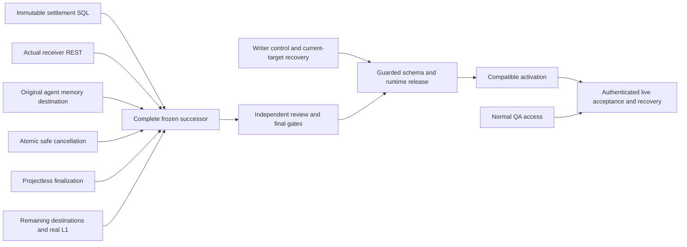
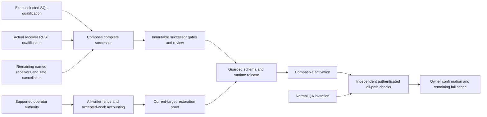
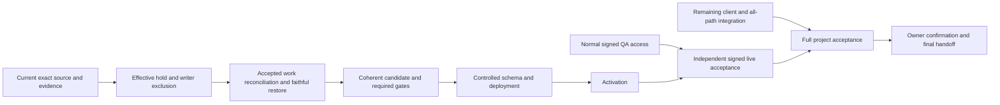
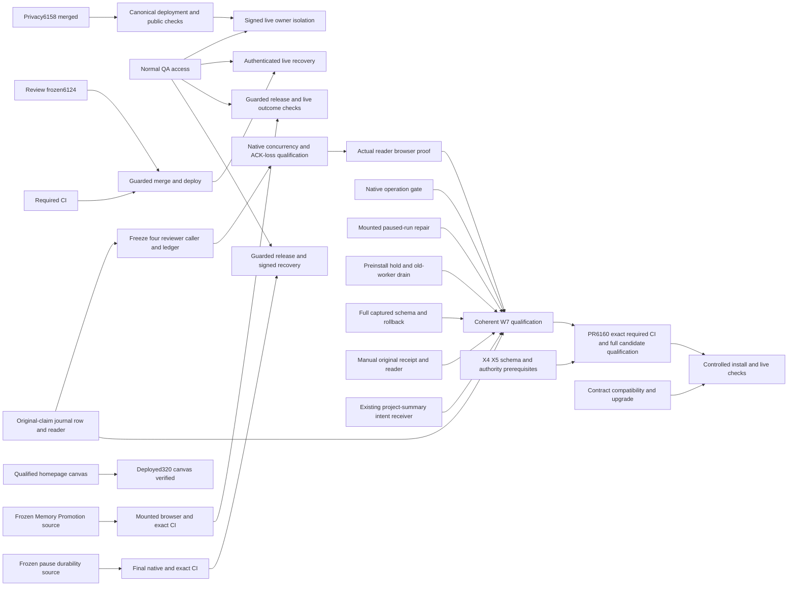
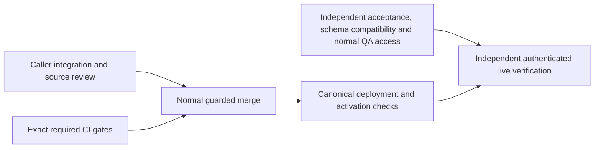

# Ship Verified System Workflow Outcomes

## Active delivery checkpoint — 2026-10-04 22:05 UTC

This checkpoint supersedes the historical pause/deadline below. Execution resumed at the owner's request. The new five-hour focus ends at **2026-10-04 23:57:35 UTC**; then implementation pauses and this handoff, checklist and dependency plan will be finalized for transfer. The full 33-node scope, 16 behaviors and 12 supported surfaces remain open; W7 is an intermediate release milestone. No percentage is inferred from scoped tests or task counts.

### Current delivery path

Qualify the existing MC effect receivers and settlement SQL; finish original destinations and safe cancellation; compose one complete immutable successor; pass independent review and required gates; install compatible schema/runtime under supported release controls; activate and independently verify authenticated behavior and recovery. iMessage remains deferred and WhatsApp excluded.

| Work | Implemented / integrated | Tested / reviewed | Merged / deployed / live |
| --- | --- | --- | --- |
| Existing MC receiver stack | Saved source `3e27866a5d880eaa32375a857ffa0ca67d0341c1` | Prior critical, plan and integration private REST proofs retained; full five-child captured-schema settlement SQL suite independently passes | Not a completed W7 release |
| Agent retrospective memory | Pushed `6951a00f3d020862a3b53c5b3f9b6eb02590ec56`; immediate settlement and cron callers wired | 48 focused tests and 30 changed-file type checks pass; source reviewed; captured PostgreSQL v4 passed all14 phases, public/mapped integrity and authority/rollback negatives; independent audit passed. Narrow VERIFY repair `d25f36b1454ff8a82080642944ac5a9c05174f99` is pushed. Actual parent-to-memory REST reached a product ACL RED: mapped service-role direct readback is denied. Original-bound readback repair2c3e4e996aafbab198c688fa2569dacf481e9b98 is pushed and independently source-reviewed;34 focused tests pass. Both the receiver and integrity gateway use the narrow RPC, without broad schema grants. Actual private parent-to-memory REST v4 passed ten cases, including original-route bound readback with mapped direct SELECT denied; independent audit passed (receipt7c2dd776). No installed live claim | Unmerged, undeployed, not verified live |
| Projectless finalization | Committed `301dfc3ed4edcae1251381a959efbc6a36723d6c`; explicit null project/run with original guards retained | 18-case native PASS, baseline refusal and rollback checks; all20 log pairs independently hash-verified and separate stopped-process check PASS | Unmerged, undeployed, not verified live |
| Failed-task and coordinator-adjustment REST qualification | Two actual-receiver fixtures on exact3e source | Both Linux v2 actual receiver REST contracts PASS and are independently audited; exact service-role checks, committed-ACK faults, original recovery, full inventory equality and cleanup are verified. Earlier v1 setup-only failure remains preserved | Evidence work, not a production release |
| Project cancellation | Pushed `6a6d82c58c`; actual Stop caller signs the observed plan/run/version and invokes a service-only atomic RPC | 10 route tests, changed types, independent source review and six synthetic mounted Chromium interactions at 390/1440 pass; captured-schema SQL and independent 16-phase receipt audit pass | Unmerged, undeployed, not verified live |

The retrospective receiver binds the original memory namespace and row identity before writing. Mapped-table generation checks prevent a revoked and recreated schema from silently redirecting an original operation. The later actual private PostgREST v4 proof establishes the tested original delivery and lost-acknowledgment cases; production behavior remains unverified.

The saved cancellation repair locks and checks the original plan, project and run together. It refuses active or uncertain task claims and reserved costs. Re-signing a lost-acknowledgment retry for original run A must recover A's receipt without cancelling a newer run B. A stale first request is refused. The actual page and route carry the observed run/version. Hindsight stays `held_unqualified`; this does not claim that every downstream effect is stopped or that active-work reconciliation is finished.

### Qualification state and blockers

The corrected selected-SQL positive fixtures 2/4/6 passed initial staging. An initial admission refusal during unrelated managed deployment is preserved. A later admitted suite reached a new RED: a supposed forged count in fixture 8 was actually the legitimate count. A separate native diagnostic pinned refusal 109 to that no-op negative. The independently reviewed repair uses the actual count plus one; it does not weaken the rejection. The complete immutable five-child suite has passed on an independently reviewed, owned Linux socket-only PostgreSQL 17.11 environment with unchanged roles, SQL, assertion ordering and resource floors. Independent review verified all 35 staged source hashes, all 81 downloaded output hashes/byte counts, 38 ordered phases and the five child receipts; the owned database stopped and a separate status check confirmed it. Result: `d771f442d8af181c6adba80417eaa7bb634aaeb929c88bed35ec7e0243c23295`. The historical f9 RED uses the preserved derived source; the exact original f9 bytes were not run.

The shared AWS test environment remains pending ownership reconciliation because the current 19 container identities differ from the earlier observation. No current container is deleted or modified. A bounded read-only search did not recover the original failed suite's native SSM command ID; `853995dc-f133-4132-b1a5-aa502dd04d4f` is only its last readback command. SQL-only Linux qualification does not replace real receiver REST or production acceptance.

Retrospective native run v2 proved PostgreSQL stores the fixed definer setting as `search_path=pg_catalog, public`. The prior VERIFY falsely expected no space. The exact repair still rejects SECURITY INVOKER and a public-only search path for both functions. The next failure was a synthetic claim missing the schema-required `claim_timestamp`; v3 added only that required value, then reached a mapped-memory integrity failure. Code review found the schema-filtered capture omits the global event trigger from source migration361. The v4 fixture restores that exact source prerequisite, strengthens VERIFY to check enabled event/public/mapped attestation triggers, and adds three disabled-trigger negatives. It passed all14 ordered phases and independent source/output/stop checks. Native receipt: `7a5c7f409931069768ae5431667931d90ee9d8867d7a0328401d8718e71634b2`. All earlier failures remain preserved. This does not establish actual receiver REST or installed production behavior.

The separate projectless native attempt `d9d886807ef252a9` passed: receipt `50feb8ed151f8c860c3433f7fe08ae09562d667ee24c177fb1a2bad6651b33ab`, exact manifest `49d15e65…`, 18 cases, intended baseline failure, positive/refusal/replay checks, idempotence and rollback protection. Independent review verified all20 stdout/stderr pairs and a separate remote status returned no server running. This is a private dated-schema SQL proof, not production behavior.

The REST fixtures check payload values, unsigned fixture identities and a held L1 route without external HTTP. They do not prove JWT authentication, signed-agent/system execution, settlement authorship or working L1 capability. Their wrappers separately check the private PostgREST `service_role` identity. Grok's broader claim that the role was never checked was rejected against those actual wrappers; its reporting-label corrections were accepted.

External release dependencies remain: normal QA invitation, supported control over all relevant writers and accepted work, current-target restoration proof, and Stripe Link configuration. None is treated as approved or complete. PR6160 remains open at `c3e23f9434780edde5aecf631ae0a6a356e18513`; its earlier passing gates do not qualify newer source. Latest observed production version is `21e10a310a6a4933ad24f7e86caad18765a177d6`; ancestry includes the earlier dashboard/workspace privacy fixes, but version observation is not new authenticated behavioral verification.

A terminal-event integration draft connects immediate settlement, cron recovery and the actual browser stream, with34 focused tests passing. Independent Linux Chromium checks at390/1440 pass: terminal state/update alone never fires completion, while the confirmed original receipt produces one callback and visible log. This is synthetic mounted behavior, not authenticated live acceptance. Native SQL qualification reached a fixture RED: one parameter was inferred both as text `claim_timestamp` and timestamp `settled_at`. Original result `e6a86345…` is preserved. An independently reviewed successor changes only the timestamp to its own sixth bind parameter; checks and product SQL are unchanged. The separate parameter-only successor passed20 native phases: result1b9e3cb8d1c045e95fe85a897dc823bac94a31c59865741d89d5fa3f875e16f6. Independent review verified all45 outputs, empty native stderr, exact SQL and stopped PostgreSQL; cleanupb69e182b is independently verified. This proves direct SQL against a seeded delivered parent, not original producer or installed behavior. A read-only audit found that planner-generated department assignments are not explicit broadcast-recipient authority; recipient integration remains open rather than inferred.


Both missing receiver REST qualifications now pass on the exact preserved3e product source. Failed-task native result: `04bcceb41392499b6d1fef1a6345bde85ea4a8e64960681e08a8937a320f0e47`; coordinator-adjustment: `fd1edcaf2f480a5db0e2a9f8fd33bc18b5a1e34bf47047fd2c33dc51236b53f0`. Each exercises actual production receivers through private PostgREST14.18, service-role identity, four lost-acknowledgment conditions, original chain/queue recovery and refusal cases. Native exit0, empty stderr, exact pre/post inventories, and owned scratch removal were independently verified. This closes receiver evidence dependencies, not production installation or authenticated live acceptance.

The current retrospective REST v2 source freeze is `90d0c89fac678e47fc201c8be85e9d15c23926b5185c9257a9cfe2693c89e66d`, based on pushed source229fb15c. It preserves all ten prior memory cases and adds actual projectless parent finalization plus committed-parent lost-acknowledgment replay. The native attempt returned RED before its memory lost-acknowledgment assertion: mapped schema readback denied `service_role`. Original result `19b8ee86d03617efb151dbb95dcb839861915a2a8fc48b584c9862f1d8f4c1b7` is preserved. Exact owned scratch cleanup passed (`923d86e9…`), with unchanged full Docker inventory. This is a proven REST-path ACL gap; direct PostgreSQL success does not close it.


### New work and dependency ownership at 22:05 UTC

- **Combined source:** pushed clean `feat/w7-estimation-retro-notification-composed-20261005` at **e9689db0a52fe690edfe5bb40b85b926affc138c**, local matching `qa-lanes/` folder. It combines estimator604ab, retrospective reader105c+2c3, and notification8fd64 atop04695b6ada.106 focused tests and66 changed-file type checks pass; independent production-seam review and secrets scan pass. Initial composition test-registration failure is preserved. This is a partial integrated candidate, not a completed W7 release.
- **Retrospective readback:** pushed repair `2c3e4e996aafbab198c688fa2569dacf481e9b98` adds original-bound readback to both receiver and integrity gateway, without broad mapped-schema SELECT grants.34 focused tests and changed types pass. Actual parent→memory REST v4 now passes all10 cases on private PostgreSQL/PostgREST: mapped direct SELECT is denied, original receiver/gateway reads succeed, original generation and revocation/replay/ACK-loss cases pass. Result **7c2dd776**, canonical native result397314de; independent audit and exact owned-scratch absence pass. Earlier REST RED19b8 remains preserved. This closes a demonstrated receiver ACL gap, not production installation or authentication.
- **Estimation:** pushed `604ab88d95390d0df8248cfda3d1426333bd619c`;59 scoped tests/32 changed types and independent source review pass. Original assignment preimage and fairness stamping passed25 private native phases /55 outputs: result **56b0a32394df67ad61c00407433af345b5dda9be73e16189f839e11f8d0dc34c**. Independent audit and owned cleanupae78f8e9 pass. An actual settlement→parent→sample→plan-closer REST successor is frozen at7092a3db and source-reviewed; it preserves original closer admission while waiting, checks four committed ACK-loss cases, tampering and no duplicate history. The first actual REST run returned REDd56d7bf0 at parent finalization: fixture omitted explicit projectId:null required by the projectless guard. A narrow v3 fixture7eb05ada preserves all ten cases and adds only the explicit null plus saved-parent assertion. Product unchanged; successor native pending.
- **Owner notification:** pushed `8fd64af7c043f8855449ba5a6c89e6e0cd15f530`;55 focused tests/32 changed types/source review pass. Immediate and cron callers now use original saved destination/one-use dispatch. Native v1 exposed a synthetic unsettled-row constraint error (REDf57fbc5a); separate fixture repairs only the row's phase/receipt consistency. Native v2 then exposed a wrapper socket-prefix mismatch (REDc5219179) before SQL assertions. Both failures remain preserved. The separately reviewed path-only wrapper v3 passes all16 direct SQL cases,23 phases and51 outputs: result191343ac40704bde44d09667ef915fe13d62205698a80cf9b4bbe3056af1b709. Independent audit and owned cleanup883acf17 pass. Actual receiver REST fixture7b7105b0 and wrapperb7167a22 are source-reviewed but unrun; configuration and provider are explicitly stubbed in that separate proof. Actual provider acceptance and live behavior remain open. Owner-manual intent is missing.
- **Frozen release composition:** exact **1c0e12c00717ff94572f64f821ab0663aeb54d28**, tree5292a6cf, in new draft [PR6189](https://github.com/jtobkin/suprafx-platform/pull/6189), based on frozen main5bd8d1f9ccd6d52cc6bf0c44ca83252d93a64f96. The clean pushed source preserves the current main privacy fixes byte-for-byte.114 affected tests,34 catalog tests and1051 changed-file type checks pass. Required CI and exact-candidate Linux privacy browser remain pending. Mac Chromium fails before assertions with MachPort SIGTRAP; that failure is retained. This candidate is partial: later completion of remaining destinations requires a new final freeze and its own required gates.
- **Release inventory:** the narrow catalog repair87e5cb00064b39d9fdb27799129026b25395d2dc and the frozen-main composition reconcile new writers conservatively. Root caught and repaired an incorrectly removed still-active finalizeRun identity even though the scanner passed. Catalog inventory now passes2639 checks; E3 recovery readiness remains RED6540. This is inventory consistency, not runtime fencing. Existing PR6160 c3e required checks passed, but those results do not qualify1c0.
- **Next real code gaps:** critical-failure parent finalization can freeze a snapshot containing pending siblings; simply removing its parent intent leaves an undrainable failed plan. A durable original drain must honestly terminate only unclaimed work, preserving active/uncertain claims. Remaining hindsight, analyzer memory/provenance, completion/failure broadcasts, legitimate department recipients, manual terminal intents, active cancellation and real L1 remain open. No guard is weakened to hide those gaps.

Portable evidence base is now saved in the private product repository at commit `316999ab481ab57c582dd45ee7e1f4be4378898f`, branch `docs/paused-workflow-handoff-20261002`, directory `docs/agent-run/evidence/five-hour-workflow-qualification-20261005/`. Its README and reconstruction tool restore615 original files from a hash-verified content-addressed archive; all276 transport files were remotely byte-verified and the reconstruction independently checked. This earlier snapshot excludes later terminal browser/REST receipts and current repairs; a final appendix will preserve those. Private product/evidence access requires normal collaborator access; these three plan documents remain public.

The next release remains blocked by incomplete original destinations and active-cancellation/L1 support, remaining actual-receiver and combined qualification and installed release prerequisites. No new W7 capability has been merged, deployed, activated or authenticated-live-verified in this focus run.

### Parallel ownership and next tasks

1. **Implementation/integration lane:** watch required CI on frozen1c0/PR6189, preserve the candidate, and map the next demonstrated blockers. Independent browser qualification proceeds on that exact source. Every unresolved writer remains blocked; passing catalog completeness is not E3 readiness.
2. **Prerequisites lane:** qualify the corrected actual estimation REST chain and the actual notification receiver/RPC chain on private owned infrastructure, preserve failures and prove cleanup. Production writer-control/current-target restoration prerequisites remain separate.
3. **Independent verification lane:** review exact source and fixture deltas, audit native receipts/output hashes, exercise applicable real mounted browser behavior and verify public plan access. Synthetic browser/REST tests are not authenticated live acceptance.
4. **Root:** independently review integration seams and fixes authored by the verification lane, adjudicate Grok findings against code, update the dependency plan and prepare portable final evidence. Grok supplements these lanes with read-only source/audit work; incomplete or incorrect audit claims are not counted as PASS.



### Current full-scope checklist — all 33 tracked items

These are capability states and remaining acceptance work, not effort percentages. Earlier source-qualified or historical complete labels do not mean full deployment or live acceptance.

| ID / work | Evidence state | Remaining work |
| --- | --- | --- |
| **P0 — Scope reconciliation and dependency plan** | Plan and scope reconciled; maintenance continues | Keep current evidence, dependencies and handoff aligned. |
| **B1 — Freeze trusted internal project execution** | Trusted project execution source qualified | Join real server/client/member authority and deployed acceptance. |
| **C1 — Finish client context and history isolation** | Claude loopback isolation scoped proof; other client paths open | Qualify native Codex/Grok, configuration/hooks and real authenticated transport. |
| **M1 — Complete member dashboard and read projections** | Member projection source and mounted browser evidence retained | Join actual producer/readers and installed authenticated behavior. |
| **W1 — Bound shared DataPackage fallback waits** | Bounded shared DataPackage source qualified | Compose and verify cancellation/cache behavior through deployed callers. |
| **B2 — Remove remaining private background producer inputs** | Narrow Competitor Watch slice deployed; full producer scope open | Remove remaining private inputs and verify active worker/card recovery. |
| **M2 — Join member result and internal message readers** | Classified member readers joined in scoped native/browser fixture | Prove current publication, revocation and real shared-chat transport. |
| **M3 — Qualify owner-only Realtime transport** | Owner-topic/metadata routing implemented; socket matrix scoped | Install ACLs, drain old broadcasters and qualify JWT expiry/revocation. |
| **J1 — Join server, clients and actual native authority** | Joined server/client native and browser source evidence | Close native client and deployed transport gaps before final join. |
| **W2 — Notification recipient authority and usable authoring** | Email/recipient authority source in held draft6138 | Schema-first release plus real authorized email and uncertain-send recovery. |
| **W3 — File operation namespace and destination authority** | Storage namespace and uncertainty source in held draft6132 | Install policy/schema and verify real owner, revocation and recovery boundaries. |
| **W4 — Named OAuth and raw API authority** | Named/raw API authority source in held draft6129 | Compose exact final source and qualify installed/provider behavior. |
| **W5 — Child workflow and bot creation authority** | Child/bot creation authority source in held draft6129 | Prove real allowed creation, denied targets and original-child recovery. |
| **X1 — Qualify every supported context entry** | Entry-point context/privacy map and scoped repairs | Qualify every supported surface, including background and System Workflow runs. |
| **A1 — Finish global attention and baseline source gaps** | Attention/Room/shelf/mail foundations; global cutover remains off | Close all16 behavior gaps for cadence, suppression, consent and context. |
| **R1 — Reconcile main, CI and exact release stack** | 1c0 frozen draft6189 required CI pending; c3e prior gates passed; privacy changes preserved; two earlier UI slices shipped | Qualify one complete successor after missing receiver integration. |
| **R2 — Installed schema, profile and release packet** | Installed profile read and source migration packets prepared | Reconcile current target ledger, source/schema/graph and guarded install packet. |
| **R3 — Writer/effect drain and faithful restore rehearsal** | Private stop/install/unknown recovery and dated restore proofs | Obtain supported all-writer fence, accepted-work accounting and current-target recovery. |
| **I1 — Compose and independently qualify final source** | 1c0 integrated/pushed draft6189;114 affected tests,34 catalog tests and1051 changed types pass; exact-candidate CI/browser pending; complete final source remains open | Finish integration, freeze one successor and pass its final gates. |
| **D1 — Gated merge and deploy verified code** | UI6179/6181 merged/deployed/public-browser verified | Guarded W7 and wider-stack schema/runtime release after prerequisites. |
| **D2 — Activate qualified workflows after compatible rollout** | Global/workflow activation not claimed | Activate only compatible qualified schema/runtime with tested recovery. |
| **P1 — Provider and real computer readiness** | Provider readiness incomplete; Stripe configuration external | Finish normal provider/account/real-computer setup and approved live inputs. |
| **V1 — Stable deployed all-path and 16 behavior acceptance** | All16 integrated/live acceptance behaviors remain open | Independently verify stable deployed journeys across all12 surfaces. |
| **U1 — Owner confirmation and final handoff** | Portable handoff maintained; final owner confirmation pending | Provide specific owner tests only after independent applicable verification. |
| **W6 — Atomic usage limits for scoped capability grants** | Atomic grant reservations source in held draft6129 | Prove installed concurrent use, revocation and original receipt recovery. |
| **W7 — Original-operation workflow effects** | Full selected SQL suite, projectless and retro direct SQL, safe idle cancellation source qualified; failed-task and adjustment actual REST independently qualified; retrospective actual REST and terminal/estimation native proofs pass; notification direct SQL16cases passes; actual estimation/notification REST and combined qualification pending | Finish remaining destinations, active cancellation and real L1; qualify combined source, release, activate and verify live. |
| **X2 — Confirm System Workflow durable terminal and pause receipts** | System Workflow pause and Memory Promotion partial fixes deployed | Qualify real admitted-owner pause/checkpoint/terminal recovery journeys. |
| **X3 — Refuse zero-row completion in scheduled and direct workflows** | Missing original terminal-row refusal has scoped native evidence | Verify scheduled and direct deployed paths retain truthful outcomes. |
| **X4 — Retain uncertain scheduled workflow attempts before another tick** | Scheduled original-attempt source preserved in held drafts | Install guarded occurrence schema and prove next-tick no-replay recovery. |
| **X5 — Qualify original scheduled approval continuation** | Bounded original approval continuation source qualified | Close remaining effectful graphs and real approval/uncertain-outcome acceptance. |
| **C2 — Bind project Git commands to exact workspace** | Project dispatch6118 and eligible-recipient6141 source qualified | Qualify mounted Realtime/relay, exact workspace commands and schema-first rollout. |
| **R3B — Stage runtime role before candidate schema extension** | Dormant minimal role source with scoped native ACL proof | Installed target ACL/pooler authority and guarded role rollout remain open. |
| **C2S — Install and verify project schema before server rollout** | Seven ordered project-schema packets rehearsed privately | Perform guarded installed-target schema rollout with live service-role verification. |

### Where to resume on another computer

Public plan repository: `jtobkin/supraos-workflow-plan`; the three linked documents remain the entry points. Product repository: private `jtobkin/suprafx-platform`, requiring normal collaborator access. Fetch exact source commits rather than assuming the current main branch contains unmerged work.

- Base receiver branch: `feat/w7-mc-critical-escalation-effect-20261004`, exact3e commit above; local `qa-lanes/w7-mc-task-failed-effect-20261004`.
- Retrospective branch: `feat/w7-plan-retro-agent-effect-20261005`, exact6951 commit above; local matching worktree. Main files: `lib/vms/workflows/mc-plan-retro-agent-effect.ts`, `plan-orchestrator.ts`, `app/api/cron/mc-coordinator/route.ts`, and `supabase/migrations/20261005100000_mc_plan_retro_agent_route*`.
- Projectless branch/worktree: `feat/w7-projectless-finalization-20261005` / `qa-lanes/w7-projectless-finalization-20261005`. Commit `301dfc3ed4edcae1251381a959efbc6a36723d6c` contains migration `20261004173518_mc_projectless_plan_finalization*`, the18-case fixture and scoped architecture notes; remote branch was independently read back at that exact commit; worktree is clean and retained because unmerged.
- Cancellation branch/worktree: `feat/w7-project-cancel-atomic-20261005` / matching local lane. Pushed commit `6a6d82c58c` contains the actual cancellation route, mounted Mission Control Stop caller, execution-run helper, ordered `20261005110000_mc_run_cancel_atomic*` SQL packet and tests. Native direct SQL and synthetic mounted browser interaction are independently verified; authenticated live behavior and actual deployed route remain pending.
- Retrospective VERIFY repair lane: `fix/w7-retro-verify-path-20261005`, based on `6951a00f`; pushed exact `d25f36b1454ff8a82080642944ac5a9c05174f99` contains the exact-format verifier repair plus attestation-prerequisite guards. Captured native qualification independently passes; actual receiver REST remains separate.
- Current R1 composition: local `qa-lanes/w7-r1-main-composition-20261005`, exact1c0 above, draftPR6189. Fetch the PR head explicitly if branch naming is unavailable: `git fetch origin pull/6189/head:review/w7-r1-6189`; verify HEAD equals the exact commit before checking out. Product seams live in `lib/vms/workflows/mc-*-effect.ts`, `plan-orchestrator.ts`, `app/api/cron/mc-coordinator/route.ts`, `components/vms/workflow/ParallelDashboard.tsx`, `supabase/migrations/20261004*` and `20261005*`; focused tests are under `tests/unit/`.
- Current local evidence: `/Users/joshuatobkin/qa-evidence/resume-delivery-20261005/` with `root`, `integration`, `sql`, `verification` and `grok` subdirectories. Current machine-readable plan: `/Users/joshuatobkin/qa-evidence/supraos-execution-plan-20261001/plan.json`. These current local artifacts are not yet all published; older portable evidence locations remain in the detailed history below.
- Do not edit/reset the shared dirty `suprafx-platform` checkout. Create an owned isolated worktree. Do not delete another agent's lane or any unmerged/dirty/running worktree.

The remaining full checklist below continues to apply, including all-path authority/privacy, System Workflows, providers, installed schema/runtime permissions, activation, recovery and owner confirmation after independent live verification.

---


## Historical checkpoint (superseded where noted above)

## Resumed execution — 2026-10-04 UTC

**Final implementation checkpoint for the 14:30:08–16:30:08 UTC focus window. Implementation and native qualification stopped by 16:03 UTC; the remaining window is reserved for publishing and independently checking this handoff. Work pauses no later than 16:30:08 UTC.** This current section supersedes historical checkpoints below. No implementation or completion percentage is inferred from test counts. The full project remains open.

### Overall goal and definition of finished

The goal is private, authorized, contextual and recoverable SupraOS agents across **33 plan nodes, 16 user behaviors and 12 supported execution surfaces**. W7 is the immediate partial delivery milestone; it is not the final wave or a replacement for the full scope.

The user behaviors include quiet suggestions, owner-voice drafts without implicit sending, visible shopping/browser work, approved calls, bounded initiative, Telegram takeover and handback, loose-end tracking, mail review and suppression, two-owner consent, unique inbound mailboxes, exact payment instruments and receipts, truthful history, relevant current and older memory, honest failure/uncertainty, quiet hours and cadence, and context-appropriate tone. iMessage remains deferred; WhatsApp remains excluded. Stripe Link configuration remains an external prerequisite.

Supported surfaces include personal chat; Telegram; mounted and legacy voice; headless execution; delegation; System Workflows; generic workflows and Routines; background Build loops; workspace plans, MC cron and organization tasks; scheduled research; Rooms; and shared/company/visiting audiences. Passing one chat path does not establish all-path acceptance.

Finished means the agreed behavior is integrated with named production callers, required gates pass on immutable source, independent review is complete, compatible schema/runtime are merged and deployed, necessary flags are activated, real authenticated browser/transport behavior is independently verified, and cancellation, failures, unknown outcomes and recovery are tested. Permissions, budgets, privacy and original operation identity must remain intact. A source helper, mocked test, synthetic database proof, deployment version or completed partial milestone alone does not satisfy that definition.

### What this session is delivering

The shortest delivery path remains: qualify the already integrated MC effect receivers, finish the remaining original destinations and safe cancellation, compose one coherent successor, pass its required gates, then perform guarded schema/runtime release and authenticated live verification. This two-hour window concentrates on closing qualification dependencies for existing source, preserving failure evidence, and making recovery possible from a different computer. It does not open unrelated product workstreams.

The frozen release candidate is [PR6160](https://github.com/jtobkin/suprafx-platform/pull/6160), **c3e23f9434780edde5aecf631ae0a6a356e18513**. Its security51/51 and build7/7 passed in the preceding window. It is still **unmerged, undeployed and unactivated**, with auto-merge off. No W7 production SQL is installed. Those gates do not qualify later source automatically.

The current composed receiver source is **3e27866a5d880eaa32375a857ffa0ca67d0341c1**, branch `feat/w7-mc-critical-escalation-effect-20261004`. Its Mac worktree is `qa-lanes/w7-mc-task-failed-effect-20261004`; it is clean and pushed. It includes completed-task, coordinator-adjustment, failed-task, plan-chain, integration-triggered and critical-escalation layers plus the narrow PL/pgSQL CASE parse repair. This is a preserved implementation snapshot, not the final W7 release candidate.

### Shipped capabilities and limits

These were shipped in the preceding window; no new production release is claimed merely because the current private qualification passes.

- **Dashboard owner/plan privacy:** [PR6179](https://github.com/jtobkin/suprafx-platform/pull/6179), candidate9b5b236b, merged/deployed **09f87ddf1b6e7a596df359358e558df61c2f21e4**. It resets private task state on owner changes, rejects stale callbacks and fences pending actions after unmount. Eight mounted tests, changed-file types, independent review, secret scan and final security/build gates passed. Independent Linux Chromium390/1440 checked the deployed public sign-in/refusal shell. Authenticated owner-switch acceptance is still pending normal QA access.
- **Actual workspace caller privacy:** [PR6181](https://github.com/jtobkin/suprafx-platform/pull/6181), candidate0171d7ad, merged/deployed **78902bc9af73d4b891096ee4b0cb15de38dd5081**. The page clears previous-owner project/plan state, ignores disposed polls/events and stops old loop continuation. Five failing regressions were retained before the repair; seven mounted tests, actual-page synthetic browser checks, review, types, secret scan and final gates passed. Independent deployed public Chromium390/1440 and anonymous401 checks passed. This does not cancel already-admitted server runs or prove authenticated owner-switch behavior.
- **Earlier partial workflow fixes:** PR6127 System Workflow pause and PR6149 Memory Promotion reporting were merged and observed as ancestors of the deployed baseline. Real admitted-owner pause/checkpoint/terminal and all-path acceptance remain open.

The merged clean idle root-owned dashboard/workspace worktrees were removed normally. Their pushed commits and portable evidence remain; folder removal is not lost work. Never remove another lane, a dirty/unmerged worktree, or a lane with a running process.

Latest production version-only readback at15:52 UTC is **9ee959f0e01c37b142a8e2b3bdfbbc21dcf8fc6d**. GitHub ancestry confirms both shipped privacy merges are included. This observation does not repeat their behavioral acceptance tests or claim authenticated live verification on that newer version. The current scope PRs were re-read at 2026-10-04T15:53:33.376882+00:00; the held heads below remain unmerged.

### Current qualification and recovery status

| Boundary | Exact receipt and result | What it establishes |
| --- | --- | --- |
| critical actual receiver REST | **PASS** `ddb78b69fb5b13f45d4210d081dc2a6183720cd9159a8a80c08112f3a7ce6a14` | Exact3e278 receiver over private PG17/PostgREST, original-ID fault/replay checks, actual service_role readback and owned cleanup; not production/live acceptance |
| integration actual receiver REST | **PASS** `50389c051d1efd002827f5b5820925dcc0bc71f13968def7d3c3936bd6b5303d` | Exact3e278 receiver over private PG17/PostgREST, original-ID fault/replay checks, actual service_role readback and owned cleanup; not production/live acceptance |
| plan actual receiver REST | **PASS** `4e3dc9bb7e24f11e3bf911ff233f030aed555249cf1d30208f5576cd963156de` | Exact3e278 receiver over private PG17/PostgREST, original-ID fault/replay checks, actual service_role readback and owned cleanup; not production/live acceptance |
| Selected settlement SQL | **FAILED / still pending**, receipt `164996cc94f46ff6182e6ad4cc6c31bd7b37b50bad037ad891daf37c1c5a4418`, original command `da7ddb27-8f45-48c6-b0d6-9c5501c16d54`; child2 fixture positive cases invalid under the finite retry policy, later children unrun | Exact forward/VERIFY, finite retry policy, forbidden authored kinds, binding negatives and rollback behavior are separate from saved-row receiver fixtures |

The first plan admission was refused because a managed deployment was active; no receiver ran from that consumed claim. The successful plan run used a separately reviewed new owner stage and fresh admission. The first SQL native attempt failed at child2 because a fixture seed ran after `SET LOCAL ROLE service_role`. Its corrected contract moves only the two seed/setup lines before that switch; the rejection still runs as service_role, and production ACLs are unchanged. All failed/refused evidence remains retained. The second SQL attempt reached a different fixture defect: failed positive cases2/4/6 default to noncritical/prior retries0 and propose failed/retries0, while exact3e278 requires the original exhausted critical transition2→3. The resulting terminal-binding rejection precedes the forbidden-routing oracle. The next repair must make those positive fixtures valid and retain every original negative; do not broaden the expected error regex or weaken SQL. No corrected-positive native PASS is claimed.

All eight owned staging paths are absent; the final read-only command `58dafd48-5091-4ec3-9d9e-a74068e38e95` returned Success/0, with zero QA containers, zero QA networks and 19 distinct running nonowned containers. Independent review matched those 19 IDs to the last owner-scoped cleanup. SQL original/v2/v3 cleanups are terminal, including last receipt `18edaf8317cc157a09a62433f02a53a9c8211064e74905090b6019468093d74b`. No qualification process remains active. The incomplete local `selected-sql-3e278-fixture-cases-v4/` is only a copied draft, not a frozen or qualified successor. A final local comparison found all 38 draft files identical to their v3 counterparts; it contains no unique repair to recover.

All contracts use dated synthetic schema and selected private PostgreSQL17/PostgREST fixtures. They do not establish installed production schema, signed authentication, live cron, provider execution, all-writer exclusion, or real L1 capability. Report each scope separately.

This window rebuilt **plan-chain and integration-triggered actual receiver fixtures on exact3e278**, and prepared and ran the **critical-escalation actual receiver fixture** with the actual receiver/BFT/L1 code and Supabase SDK. Contracts cover original claim identity, foreign owners, malformed inputs, saved-route integrity, conflicting rows, replay and committed acknowledgement loss. Queue INSERT acknowledgement loss is distinct from child FINISH acknowledgement loss and has its own saved-row/no-second-write checks. Original error/output bytes, Unicode/newlines/quotes, system/null actor, unsigned Tier2 behavior, ordered edges and projectless identity are preserved.

Source review also found and repaired a **verification-infrastructure blocker (G121)**: a SQL timeout or Node interrupt could enter cleanup despite an uncertain outcome. Four original failing no-host lifecycle cases are retained: SQL timeout, Node interrupt, cleanup timeout and cleanup interrupt. Separate lifecycle-v2 wrappers preserve uncertain owned resources and original reconciliation pointers. The same four cases pass on repaired wrappers; independent review and wrapper tests pass. Product3e278, SQL and fixture archive bytes were unchanged. Never execute the preserved original unsafe wrappers.

The first SQL upload ab890 and first critical upload679272 were source-only. SQL later ran from a distinct lifecycle-v2 stage59cd and failed in fixture setup; this failed native is preserved separately. New reviewed copy helpers copy only hash-verified immutable archive/helper bytes into a distinct owner-marked scratch and upload the repaired runner, avoiding a second large upload. They preserve old stages and require a fresh one-use native claim and admission. Root review additionally caught wrong command-ID attribution on a failed copy; five fake SSM cases now distinguish a known refusal, no-ID submission uncertainty, known-ID result uncertainty and interruption. A successful source copy is not a native PASS.

Earlier private proofs remain valid only within their scope: retry-CAS actual cron/SDK PATCH receipt **d2425b27** (four races); original COMMIT-ACK recovery **5a949eb0**; seven-argument head RPC **c207eaeeb**; adjustment SQL **5a7cfabd**; completed-task actual receiver REST **610284c3**. The original combined SQL run **ed85a21f-33c9-4690-8ecb-8ce674a5adde** failed parsing original f9 SQL before the repaired-policy child. Its logs and cleanup are preserved; no failed parent is relabelled PASS. Commitddcdb904, composed in3e278, repaired only the necessary CASE parentheses. The old f9 retry-policy RED now uses an explicitly labelled syntax-only derivative so the known policy defect can be exercised rather than hidden by the parser failure.

### What specifically blocks the next release

| Blocker | Kind / owner | Proof needed to close it |
| --- | --- | --- |
| Remaining named durable destinations, safe active cancellation and projectless finalization | Missing code / integration lane with root composition | Actual immediate/cron caller, deterministic original identity, integrated permission/failure/cancel/replay tests and independent review |
| Selected settlement SQL and actual receiver qualification | Fixture setup repair plus missing evidence / prerequisites, root admission and independent verifier | Exact-source terminal native receipts after both preserved SQL fixture seed-order and invalid-positive RED results; no product ACL change. Retain negative evidence, original-ID readback and owned cleanup |
| Supported operator authority, continuous all-writer exclusion and accepted-work accounting | Access/approval and evidence / existing platform Owner/Admin request | Supported admission/fence mechanism, accepted-work reconciliation, current-target backup and tested restoration; private fixtures do not grant authority |
| Normal dedicated QA invitation | Access / existing SupraOS member request | Ordinary invitation and authenticated browser access, without bypassing the invite gate |
| Complete coherent successor and final gates | Integration/evidence / root | Complete source frozen once, independent review and required security/build gates on that exact candidate |
| Compatible production install, activation and all-path acceptance | Deployment/evidence / release operator and independent verifier | Guarded schema-first rollout plus real allowed, denied, failure, cancellation, unknown-outcome and recovery journeys |

The dedicated QA wallet is `0x0ec7a8d19ce9418fcf871d94052580370f893a0b44f4964e9c52900de0f2555e`. Existing invitation/operator requests remain pending; do not ask for credentials, reuse another person's cookies, or interpret missing approval as granted. Stripe Link configuration is separately external. Local macOS account/certificate lookup and Chromium startup remain unreliable; use the approved Linux verification route and a normal authenticated account.

### What the user can do when this is finished

The complete release should let a normally admitted user start agent work from the supported chat, phone, workspace, background and System Workflow entry points; observe truthful progress; approve actions within their authority; pause or cancel safely; and recover interrupted or uncertain work without duplicate effects. Work and memory must stay scoped to the correct owner/project, with the same permission and recovery guarantees through immediate and scheduled execution. Browser takeover, authenticated transport and each supported destination must be exercised live where applicable. This window closes three private receiver qualification gaps toward that result; it does not activate those capabilities in production.

### Next tasks for the next session

1. **Reconcile terminal evidence first.** Read this checkpoint, all native receipts and cleanup/unknown pointers. Independently check exact commits and source hashes. Never resend an uncertain operation or reuse a consumed stage. Distinguish missing evidence from missing code.
2. **Repair and qualify the selected-SQL positive fixtures first.** In portable `contracts/selected-sql/fixture-order-v3-plan-contract.cjs`, make failed positive cases2/4/6 use original critical prior2→target3, then independently review the full fixture assumptions and rerun a new immutable packet. Preserve both earlier failures; do not relax the refusal oracle. Follow each terminal result above; preserve failed evidence and apply only demonstrated narrow repairs. Failed-task and coordinator-adjustment actual receiver REST remain separate missing contracts unless a later receipt explicitly closes them. SQL settlement authorship and synthetic saved-row receiver behavior are complementary proofs.
3. **Implement the next smallest missing destination: `plan_retro_agent`.** `mc-plan-finish-intents.ts` authors it, `plan-orchestrator.ts` supplies the terminal intent, and the immediate/cron receiver map lacks its destination. The original sink uses `getMemoryWriteRef(owner, "coordinator")`, its selected memory chunk table, owner, coordinator agent, exact retrospective text, learning category, project-retro source, score0.7, active status and original plan/project/status provenance. Preserve the admitted destination namespace and operation identity before writing. Existing global-retro memory is a separate receiver and must not be duplicated. The portable `next-integration-brief.md` has exact code locations, acceptance cases and ownership.
4. **Finish the remaining W7 scope while release prerequisites advance independently.** Reconcile `plan_terminal_event`, `plan_hindsight`, `plan_estimation`, `plan_analyzer` and its report memory/provenance, `plan_broadcast_provenance`, `plan_notification`, and remaining completion/failure broadcast destinations. `plan_broadcast_department` exists in the builder, but the current caller omits department IDs; do not invent recipients. Active cancellation must retain409/reservations until the original run is proven ended. Real L1 support and projectless finalization remain open.
5. **Compose, qualify, release and verify.** Freeze the complete successor; pass final gates on immutable source. Join supported authority, all-writer fencing, accepted-work accounting and current-target restoration before guarded installation. Merge/deploy/activate the authorized compatible release, independently exercise authenticated real browser/transport paths, then give the owner confirmation tests. Continue the other full-scope nodes; W7 is a milestone, not project completion.

### Parallel lanes and execution discipline

| Lane | Ownership | Required output |
| --- | --- | --- |
| Root Codex | Dependency plan, candidate composition, exclusive native admission, release decisions and publication | One truthful candidate/evidence record; concrete next blocker and proof |
| Integration Codex | Named production caller integration and source-bound actual receiver contracts | Exact pushed source, caller owner, acceptance test and immutable packet |
| Prerequisites Codex | SQL/schema contracts, bounded staging, release prerequisites and owned fixture lifecycle | Original command IDs, one-use admission, terminal receipt or retained unknown pointer |
| Independent Codex verifier | Source, packet, native and browser audit | Independent findings/evidence; no implementation-file edits or AWS mutations |
| Grok reviewers | Read-only trailing audit, caller tracing, test design and evidence reconciliation | Bounded concrete findings, each accepted or rejected against exact source |

Available capacity in this session is four concurrent Codex agents including root and up to four Grok workers. Historical job count is not concurrent capacity or completion progress. Give every component a named production caller, integration owner and true/false acceptance check. Finish existing delivery paths before opening unrelated work. Review each frozen packet as soon as ready; do not create a global review barrier. At most two distinct source uploads may overlap; native fixtures serialize only for the shared exclusive host. Unrelated improvements remain on separate branches. A demonstrated blocker repair preserves the failed evidence and gets independent review and affected-behavior verification. Never weaken tests, budgets, permissions or release controls.

Track **implemented, integrated, tested, independently reviewed, merged, deployed and verified live** separately. At each checkpoint name the usable capability, dependency closed, next blocker/owner/proof and whether work is closing the path or accumulating pieces.



### Portable evidence for this two-hour window

The frozen qualification packet is preserved at private commit **237fcd489a63bd94f1c5495db318d7b61a06a21f**, [two-hour qualification evidence](https://github.com/jtobkin/suprafx-platform/tree/237fcd489a63bd94f1c5495db318d7b61a06a21f/docs/agent-run/evidence/two-hour-workflow-qualification-20261004/). The199 transport files recover the exact179-file original packet, whose manifest SHA256 is **1f2b334ea8f3199f53340718969ab2c32db8480e51e3baff8cbd41518fedab6c**. Both the original and transport pass secret scanning; an independent local reconstruction matches original bytes. Remote publication bytes are checked against the199 uploaded files.

Large schema-file uploads hit transport timeout/401 while normal small requests remained authorized. The two distinct captured SQL files are therefore preserved as deterministic gzip/base64 chunks; this changes transport only. In the evidence clone, check out the exact commit above, enter `docs/agent-run/evidence/two-hour-workflow-qualification-20261004/`, read `TRANSPORT-README.md`, and run `python3 reconstruct.py /absolute/empty/output-directory`. It verifies chunk hashes, restores the two original SQL byte streams, copies the other listed files, and runs the original `verify-packet.py`. Then read the recovered `README.md`. Do not execute historical unsafe wrappers or a native fixture merely because reconstruction passes.

Independent audit, original successful AWS command readbacks, last SQL cleanup, final resource inventory and the prerequisite lane handoff are saved and byte-verified at private commit **69dc993e29269026874e3a76fb6c6791252a949b**, [two-hour closeout appendix](https://github.com/jtobkin/suprafx-platform/tree/69dc993e29269026874e3a76fb6c6791252a949b/docs/agent-run/evidence/two-hour-workflow-closeout-20261004/). This appendix has16 files and remains separate from the frozen qualification packet.

Public documentation is accessible without sign-in. Product source and detailed evidence are private and require ordinary collaborator/team access. The new packet includes exact dated **schema-only** capture/replay/roles, direct SQL contracts, actual receiver TypeScript/seeds/build scripts, lifecycle-v2 wrappers and failure tests. It does not contain a production backup, user rows, credentials, or deployment authority. Compiled bundles and compressed fixture archives are intentionally omitted with their hashes. `verify-packet.py` checks copied bytes and reconstructs original source-manifest hashes from the portable row projection. Secret-scanner findings in path-keyed hash manifests were resolved by a lossless projection, not by disabling the scanner.

Fresh-machine build paths can change source-map/manifest metadata. Rebuild with Node22 and the pinned production lockfile, compare imported source and generated hashes, independently review differences, freeze a new wrapper and obtain fresh admission. New bundle bytes do not inherit a previous native verdict. Wrapper builders retain some original Mac evidence paths and require explicit adaptation; simply running them on another computer is not promised to work. Read the packet README before reconstruction. Do not point synthetic contracts at production.

### Full-scope task checklist

This table retains all33 project nodes. “Source qualified” is a bounded implementation/test milestone, not deployed completion. The detailed historical task entries and private JSON retain exact files, commits and evidence. No effort or completion percentage is computed from these rows.

| Task | Current evidence/state | What closes the remaining work |
| --- | --- | --- |
| **P0 — Scope reconciliation and dependency plan** | Plan and scope reconciled; maintenance continues | Keep current evidence, dependencies and handoff aligned. |
| **B1 — Freeze trusted internal project execution** | Trusted project execution source qualified | Join real server/client/member authority and deployed acceptance. |
| **C1 — Finish client context and history isolation** | Claude loopback isolation scoped proof; other client paths open | Qualify native Codex/Grok, configuration/hooks and real authenticated transport. |
| **M1 — Complete member dashboard and read projections** | Member projection source and mounted browser evidence retained | Join actual producer/readers and installed authenticated behavior. |
| **W1 — Bound shared DataPackage fallback waits** | Bounded shared DataPackage source qualified | Compose and verify cancellation/cache behavior through deployed callers. |
| **B2 — Remove remaining private background producer inputs** | Narrow Competitor Watch slice deployed; full producer scope open | Remove remaining private inputs and verify active worker/card recovery. |
| **M2 — Join member result and internal message readers** | Classified member readers joined in scoped native/browser fixture | Prove current publication, revocation and real shared-chat transport. |
| **M3 — Qualify owner-only Realtime transport** | Owner-topic/metadata routing implemented; socket matrix scoped | Install ACLs, drain old broadcasters and qualify JWT expiry/revocation. |
| **J1 — Join server, clients and actual native authority** | Joined server/client native and browser source evidence | Close native client and deployed transport gaps before final join. |
| **W2 — Notification recipient authority and usable authoring** | Email/recipient authority source in held draft6138 | Schema-first release plus real authorized email and uncertain-send recovery. |
| **W3 — File operation namespace and destination authority** | Storage namespace and uncertainty source in held draft6132 | Install policy/schema and verify real owner, revocation and recovery boundaries. |
| **W4 — Named OAuth and raw API authority** | Named/raw API authority source in held draft6129 | Compose exact final source and qualify installed/provider behavior. |
| **W5 — Child workflow and bot creation authority** | Child/bot creation authority source in held draft6129 | Prove real allowed creation, denied targets and original-child recovery. |
| **X1 — Qualify every supported context entry** | Entry-point context/privacy map and scoped repairs | Qualify every supported surface, including background and System Workflow runs. |
| **A1 — Finish global attention and baseline source gaps** | Attention/Room/shelf/mail foundations; global cutover remains off | Close all16 behavior gaps for cadence, suppression, consent and context. |
| **R1 — Reconcile main, CI and exact release stack** | c3e required CI passed; three3e278 private REST receivers passed; two UI slices shipped | Qualify one complete successor after missing receiver integration. |
| **R2 — Installed schema, profile and release packet** | Installed profile read and source migration packets prepared | Reconcile current target ledger, source/schema/graph and guarded install packet. |
| **R3 — Writer/effect drain and faithful restore rehearsal** | Private stop/install/unknown recovery and dated restore proofs | Obtain supported all-writer fence, accepted-work accounting and current-target recovery. |
| **I1 — Compose and independently qualify final source** | c3e composed; later receiver source remains separate | Finish integration, freeze one successor and pass its final gates. |
| **D1 — Gated merge and deploy verified code** | UI6179/6181 merged/deployed/public-browser verified | Guarded W7 and wider-stack schema/runtime release after prerequisites. |
| **D2 — Activate qualified workflows after compatible rollout** | Global/workflow activation not claimed | Activate only compatible qualified schema/runtime with tested recovery. |
| **P1 — Provider and real computer readiness** | Provider readiness incomplete; Stripe configuration external | Finish normal provider/account/real-computer setup and approved live inputs. |
| **V1 — Stable deployed all-path and 16 behavior acceptance** | All16 integrated/live acceptance behaviors remain open | Independently verify stable deployed journeys across all12 surfaces. |
| **U1 — Owner confirmation and final handoff** | Portable handoff maintained; final owner confirmation pending | Provide specific owner tests only after independent applicable verification. |
| **W6 — Atomic usage limits for scoped capability grants** | Atomic grant reservations source in held draft6129 | Prove installed concurrent use, revocation and original receipt recovery. |
| **W7 — Bind workspace tool effects to original tool calls** | c3e CI passed; critical/integration/plan private REST PASS; selected SQL still RED | Finish receivers/cancellation/L1, safe cutover and authenticated all-path acceptance. |
| **X2 — Confirm System Workflow durable terminal and pause receipts** | System Workflow pause and Memory Promotion partial fixes deployed | Qualify real admitted-owner pause/checkpoint/terminal recovery journeys. |
| **X3 — Refuse zero-row completion in scheduled and direct workflows** | Missing original terminal-row refusal has scoped native evidence | Verify scheduled and direct deployed paths retain truthful outcomes. |
| **X4 — Retain uncertain scheduled workflow attempts before another tick** | Scheduled original-attempt source preserved in held drafts | Install guarded occurrence schema and prove next-tick no-replay recovery. |
| **X5 — Qualify original scheduled approval continuation** | Bounded original approval continuation source qualified | Close remaining effectful graphs and real approval/uncertain-outcome acceptance. |
| **C2 — Bind project Git commands to exact workspace** | Project dispatch6118 and eligible-recipient6141 source qualified | Qualify mounted Realtime/relay, exact workspace commands and schema-first rollout. |
| **R3B — Stage runtime role before candidate schema extension** | Dormant minimal role source with scoped native ACL proof | Installed target ACL/pooler authority and guarded role rollout remain open. |
| **C2S — Install and verify project schema before server rollout** | Seven ordered project-schema packets rehearsed privately | Perform guarded installed-target schema rollout with live service-role verification. |

**Identifier distinction:** project node A1 is global attention work; delivery-subgraph A1 is the existing operator-access prerequisite. They are separate namespaces. The graph above uses descriptive labels to avoid conflating them.

### Preserved wider release stacks

A fresh GitHub read at 2026-10-04T15:53:33.376882+00:00 confirms these branches remain open and unmerged. They are part of the full project scope, not newly opened workstreams. A non-null GitHub `merge_commit_sha` on an open PR is a preview merge, **not evidence of a completed merge**. Preserve each exact head and its stated prerequisites.

| PR | Purpose | Exact head | Current state |
| --- | --- | --- | --- |
| #6118 | Recover original reviewed project dispatch after missed relay broadcast | `d82464efd076c707760e0809f4aa3dccd0150bba` | Draft |
| #6141 | Select eligible relays before sealing project dispatch | `c8d5bbaaffb59115d78bf2ca5a29ea1c3e6a0b40` | Draft |
| #6122 | Add source-bound C2 preflight with verified database TLS | `6566c7f06fd94ffd8c22511238d6b3261501b3e7` | Draft |
| #6123 | Connect original scheduled approvals to owner decisions and safe continuation | `8415b13a51751928529a27d54b2b8490ff2bfa4f` | Draft |
| #6129 | Preserve workflow authority across actions and approved branches | `9c3c7bd4e6c4c6ba58d2fa69424424fa84c79365` | Draft |
| #6132 | Isolate workflow storage and retain uncertain writes | `2b68ff4d0dbeb15032cb7b03fa1cabd4ef406350` | Draft |
| #6138 | Bind workflow email to recipient authority and original recovery | `227de4f57e35cf111788f8bfca4e50a7d75342f5` | Draft |
| #6054 | Recover original scheduled workflow attempts before redispatch | `80e77f36f4cbdcaf580b1a8edd267adcc98f2090` | Draft |
| #6029 | Compose verified SupraOS agent workflows and recovery | `4fc3888904c9a7a5e87aa573c9150bffe68464b5` | Draft |
| #6160 | Preserve original workflow delivery with guarded release recovery | `c3e23f9434780edde5aecf631ae0a6a356e18513` | Open; release held |

The project-dispatch stack requires its ordered schema, authenticated mounted Realtime/relay and release-control proof. The scheduled workflow, capability, Storage and email stack requires schema-first activation, original-run/approval authority and real authenticated/provider boundaries. Existing scoped native/browser tests are preserved; they do not establish installed/live acceptance.

### Code structure and fresh-computer recovery

**Local absolute paths below identify this Mac only; a fresh computer should clone the named repositories and fetch the pinned branches/commits. No local worktree is required to recover pushed source.**

**Source repository:** private `jtobkin/suprafx-platform`. **Public documentation repository:** `jtobkin/supraos-workflow-plan`, branch `main`. Repository access is required for private source/evidence; the three public documents require no sign-in. A different GitHub account must first receive ordinary collaborator/team access from the repository owner. If a private clone returns 404 or permission denied, obtain that access; the public checklist does not grant private access. Clone using the new operator's own normal GitHub authentication; do not copy credentials from this machine.

For current source recovery on a **new machine in an empty parent directory**, authenticate to GitHub with the new operator's account and install Node22.11–22.x. These commands retrieve the latest composed receiver source; they do not install production schema or execute a native fixture:

```sh
git clone --filter=blob:none --single-branch --branch feat/w7-mc-critical-escalation-effect-20261004 https://github.com/jtobkin/suprafx-platform.git supraos-product
git -C supraos-product checkout --detach 3e27866a5d880eaa32375a857ffa0ca67d0341c1
git -C supraos-product rev-parse HEAD
git clone --filter=blob:none --single-branch --branch docs/paused-workflow-handoff-20261002 https://github.com/jtobkin/suprafx-platform.git supraos-evidence
git clone https://github.com/jtobkin/supraos-workflow-plan.git supraos-plan
node --version
(cd supraos-product && npm ci)
```

The private evidence branch contains the exact commits indexed below; check out the named evidence commit before interpreting its files. The current source history includes7bdf,2152 andfa939. To inspect an earlier layer without changing current source, use `git show <exact-commit>:<repo-path>` or a separate detached worktree. The frozen W7 candidatec3e23 is a different branch and must remain unchanged.

**Use the new two-hour packet for exact3e278 rebuilds.** Earlier portable packet5c494 builders are pinned to2152/7bdf and correctly reject newer SQL hashes. Preserve those historical pins. The current packet contains reviewed3e278 plan/integration/critical build entrypoints and the dated schema inputs previously absent from portable packets. Their wrapper paths require adaptation on a fresh machine. Failed-task and adjustment actual receiver REST are still separate missing fixtures. Never treat source publication as native or live acceptance.

For the frozen release candidate, fetch PR 6160 and verify exact HEAD `c3e23f9434780edde5aecf631ae0a6a356e18513`. Read repository `AGENTS.md`, `CONTEXT.md`, build protocol, architecture atlas and delegation guidance before editing. On the existing Mac, use an isolated worktree: its shared `/Users/joshuatobkin/suprafx-platform` checkout has unrelated staged work and must not be reset or cleaned. On a fresh computer, the new detached clone above is already isolated; this Mac-specific path is not a prerequisite.

| Area | Production code and evidence entry points |
| --- | --- |
| Workflow execution and recovery | `lib/vms/workflows/plan-orchestrator.ts`, `mc-*-effect.ts`, `app/api/workspace/plan/execute/route.ts`, `app/api/workspace/plan/route.ts`, `app/api/cron/mc-coordinator/route.ts` |
| Dashboard | `components/vms/workflow/ParallelDashboard.tsx`; mounted action-error and actual-browser regression tests under `tests/unit/parallel-dashboard-*` |
| W7 schema | `supabase/migrations/20261003120000_mc_task_claim_settlement.sql` and paired VERIFY/ROLLBACK; forward SHA `7af383e3`, VERIFY `4d45188d`, unchanged in c3e23 and not installed in production |
| New completed-task source | `lib/vms/workflows/mc-chain-task-{envelope,effect}.ts`; `20261004100000_mc_chain_task_recovery_cursor{,_VERIFY,_ROLLBACK}.sql`; original caller and output-evidence tests |
| Release controls | `scripts/qa/w7-operation-gate.py`, `w7-bootstrap-install.js`, `w7-proxy-hold.py`; corresponding `test-w7-*` regressions; `docs/agent-run/w7-operation-bound-release-admission.md` |
| Canonical local plan | `/Users/joshuatobkin/qa-evidence/supraos-execution-plan-20261001/plan.json`; current authority is `currentFocusRun`, `latestDeliveryCheckpoint`, `deliveryExecution`, `deliveryGraph` and task nodes. Dated observations are explicitly historical |
| Current evidence | `/Users/joshuatobkin/qa-evidence/resume-delivery-20261004/`; older native packets under `resume-delivery-20261003/{integration,prerequisites,verification}/` |
| Current local worktrees | `qa-lanes/w7-reviewed-release-repairs-20261004` (frozen c3e23); `qa-lanes/w7-plan-sql-case-parse-20261004` (clean pushedddcdb904, unmerged); `qa-lanes/w7-chain-task-effects-20261004` (frozen/pushed c8d1c44); `qa-lanes/w7-mc-coordinator-adjustment-effect-20261004` (frozen/pushed ff88); `qa-lanes/workspace-owner-scope-20261004` (removed after merged0171/PR6181; recover from78902/main); removed merged dashboard9b5 lane recovers from PR6179/main09f87; `qa-lanes/w7-mc-task-failed-effect-20261004` (pushedfa939 andf9a09, current clean pushed3e278 critical source plus ancestor parse repair; fa939/f9/2152/7bdf preserved in their branches); `qa-lanes/w7-dashboard-owner-scope-verification-20261004` (reviewed dashboard commit); private evidence lane `qa-lanes/w7-retry-cas-private-evidence-20261004` |
| Grok record | `qa-evidence/resume-delivery-20261004/grok-release-audits/dispatch-plan.json`, numbered dispatch/results and `root-dispositions-*.md`; a cut-off run is not an audit verdict |

Portable evidence lives on private branch **`docs/paused-workflow-handoff-20261002`**:

- Earlier receiver source (superseded for current3e278 rebuilds): **5c49434892cf33e4f714d0c5d1114ca66bc12909**, `docs/agent-run/evidence/mc-receiver-source-20261004/`.39 files were secret-scanned and remotely byte-verified;33 source files are listed in packet manifestf9828f9c. It contains exact fa939/2152/7bdf product and SQL source, native SQL contracts, actual plan/integration receiver REST TypeScript/seeds/bridges, and portable Node22 build entrypoints. Compiled bundles are withheld. Portable rebuild hashes may differ because of source-path metadata, so a regenerated bundle needs new pinning/review/native qualification; publication does not transfer runtime evidence. Failed-task actual receiver REST is explicitly not prepared.

- Retry-CAS source/failed attempts: commit **138bc49f4140ede31601be2ed68ab78977233589**. Successful native evidence and independent audits: **6d3bb4f1db67c1074d94180c3e29f1269a70efa5**. Find `docs/agent-run/evidence/w7-retry-cas-override-successor-20261004/` and read its manifest, lifecycle receipts and `NATIVE-RESULT.md`. Exact archive `5595f551`, runner `527afc00`, dispatcher `a2106e6f`, idle helper `5d3158bc`; consumed stage `4489d71c` must never be reused.
- Lost-COMMIT-ACK recovery: **05fff89f811a70fa21ed4abddea62604d3e1a416**, `docs/agent-run/evidence/hostprobe-recovery-qualification-20261004/`; exact archive and 17 files were scanned and byte-verified.
- Seven-argument PostgREST qualification: **030e10f2ae56bb462f203cd4bb5f8f0c1b4d3a68**, `docs/agent-run/evidence/f5-postgrest-qualification-20261004/`. Its fresh-computer addendum is in 05fff89f. Some original fixtures were withheld after scanner findings; listed hashes/pointers do not imply those omitted files are downloadable.
- Earlier composed source/evidence: commits `8226c0be`, `a47bdd9b`, `1591670b` and the dated index below. Archive `6587` records a failed attempt, not a PASS. Restore archive `8c25` remains unpublished after scanner findings; no exception was granted.

The private fixture host is identified in the checked-in dispatcher. Reuse reviewed resource limits, exact image/source pins, fresh admission, unique owner markers and one-use claims. The current-window result table and lifecycle receipts above are authoritative for active or disposed resources; older examples are historical. Unknown outcomes retain the original command ID and require readback, never an automatic second dispatch. Preserve running containers belonging to other owners. An ordinary managed deployment changed the serving image between this window's SQL failure and later receiver runs; compare each run's own before/after inventory rather than claiming the whole window kept one unchanged deployment.

After a verified merge, only the merging agent may remove its own clean, idle, merged worktree using normal `git worktree remove`. Never force removal, prune all worktrees or delete another lane. Unmerged or dirty lanes remain preserved.

### Checklist and handoff access

- [Detailed handoff](https://github.com/jtobkin/supraos-workflow-plan/blob/main/Ship-Verified-SupraOS-Agent-Workflows.md)
- [Checklist](https://github.com/jtobkin/supraos-workflow-plan/blob/main/SupraOS-Workflow-Plan-Checklist.md)
- [Dependency plan](https://github.com/jtobkin/supraos-workflow-plan/blob/main/Delivery-Path-Release-Plan.md)

Final public publication is checked by anonymous HTTPS byte comparison and an independent Linux Playwright run against the exact published commit. Receipts and screenshots are saved separately at closeout; their presence and result, not this planned procedure, establish verification. Local Chromium startup remains unqualified. Public documents require no sign-in; private source/evidence require collaborator access.

---
<!-- END CURRENT 2026-10-04 CHECKPOINT -->

## Historical checkpoints — superseded by the current section above

Implementation is paused at the owner-requested cutoff, recorded 2026-10-03T19:43:25.337791+00:00. The final 90-minute window began at 18:13:12 UTC and ended at 19:43:12 UTC on 2026-10-03. All owned host runs are terminal with verified cleanup; no uncertain remote command remains. Only documentation publication and access verification followed the pause. This is the current checkpoint; dated material below is retained history.

This is the authoritative current dependency plan. The detailed [handoff](https://github.com/jtobkin/supraos-workflow-plan/blob/main/Ship-Verified-SupraOS-Agent-Workflows.md) contains exact code/evidence locations and new-computer reconstruction commands. The public [checklist](https://github.com/jtobkin/supraos-workflow-plan/blob/main/SupraOS-Workflow-Plan-Checklist.md) records the same current status. All 33 project nodes, 16 behaviors and 12 surfaces remain in scope; no task count is a code/effort percentage.

## Current release and blocker summary

The nearest useful milestone is reliable original workspace-plan completion through manual, automated and MC cron callers, with durable journal/reviewer/memory outcomes and no duplicate effect or charge after lost acknowledgements. PR6160 remains frozen at `817061098742daec71dbb4198a5fd0d65d738d17`, remote branch `fix/w7-reviewer-release-20261003`; it is open, unmerged, undeployed and unactivated with auto-merge disabled. Required security51/build7 passed. It contains the inherited workflow stack; do not extract an incomplete reviewer-only release.

| Delivery dependency | Current proof | Remaining work |
|---|---|---|
| Earlier bounded privacy/pause/memory-promotion releases | PR6158/6127/6149 merged/deployed with stated native/public/browser checks | Normal signed owner/foreign-owner and recovery acceptance |
| W7 reviewer/memory/reader/packet qualification | Native reviewer52b3, five-memory97db, real saved-row reader browsera224 and exact817 packet26b9 PASS | Installed-target, full UI/authenticated behavior and remaining recovery cases |
| Reviewer aggregate/race and admission day | Budget01a01 and historical-admission52cd PASS | Historical timestamp is synthetic; elapsed midnight/hourly-window acceptance remains open |
| Actual cron recovery | Three preserved fixture failures; v4 source reviewed and local saved-output regression PASS | v4 nativeUNRUN; actual two GET ticks/no-resend proof still required |
| Restore fidelity | Dump/restore reached strict state equality and FAILED30ced9fa; cause unknown | Run reviewed diagnostic3c32/2e93 after fresh admission; inspect differing hashes and fix only demonstrated cause; strict fidelity requirement remains |
| Operator hold/stop/recovery | a0a/f121 source reviewed; f121 disabled until effective hold proof. Alternate readonly template1 connectivity passed | Continuous all-writer exclusion, accepted work reconciliation, qualified recovery and operation-bound controlled cutover |
| Observed sha7e image operator rehearsal | cb5/d7d8 source reviewed, UNRUN; image was observed this session | Fresh image/capacity/readback time budget in next session; not a live stop/drain proof |
| Signed live acceptance | Normal QA invitation/session still missing | Existing-member admission; real deployed owner/foreign-owner journeys, never an auth bypass |
| Full client/project/all-path scope | Canonical C1/C2 and X4/X5 preserved source/limited evidence | Supported clients, project schema/transport, broader effectful graphs, activation and full16-behavior acceptance |

The synthetic restore mismatch is an open recovery blocker. Private fixture success cannot establish production writer exclusion or a faithful backup under a live hold. No W7 SQL installation, production fence, writer stop, activation or signed live acceptance occurred in this final window.

## First resume round

1. Root verifies fresh branch/commit, required-gate observations, private evidence access and host capacity/ownership. Read the v4/diagnostic READMEs and preserved failures before dispatch.
2. Verification runs the already-reviewed cron v4 once. Required proof is the real two-tick GET path retaining the original lost-ACK claim with no extra provider attempt; local selector tests alone do not close it.
3. On explicit terminal host handoff, run the restore diagnostic once. Identify the actual differing components before proposing a repair. Preserve strict row/catalog/ACL/role equality and original receipt recovery.
4. In parallel, integration advances the effective hold/continuous writer-exclusion and recovery design through actual operator callers; prerequisites resolves normal access and platform authority. Do not treat readonly template1 connectivity or the local credential census as an exclusion mechanism.
5. Queue the reviewed current-image operator rehearsal only after fresh image/capacity admission and enough time for its existing complete command/readback bounds. Keep any uncertainty attached to the original invocation.

These steps close delivery dependencies; none by itself permits schema installation or closes the full project.

## Parallel lanes and execution limits

Root owns composition, the immutable release, host scheduling, final evidence and plan. Three helpers own (1) implementation and actual callers, (2) prerequisites/access/blockers and (3) independent review/native/browser/live verification. Assign non-overlapping files and a production caller/integration owner/acceptance test to each work item. Source preparation and review can proceed concurrently; only one private fixture owns the host at a time.

At pause, no host run or uncertain command remains active. The latest test queue closed at19:10 UTC to preserve terminal readback time. The next session must re-read code, current PR/CI/deploy state, source pins and host inventory before continuing. Do not resend an unknown original command or effect. A resuming root may schedule the already-authorized private checks after safe admission; normal platform authority and release controls still govern production actions.

Finish existing work along this path before opening another feature lane. Keep failed evidence; only demonstrated blockers change the release candidate. Preflight archive members, every inner expected hash, compiled/source manifests and nonroot bind-mount readability before transfer. Do not weaken assertions, budgets, permissions or cleanup. Report implemented, integrated, tested, reviewed, merged, deployed and verified-live states separately.

### Canonical project task inventory

These are the canonical node IDs from the machine-readable plan. After the pause, task states such as “active” mean unfinished work, not a running agent or command. A node marked complete closes only that named prerequisite, not its downstream deployed/live behavior. The release-specific dependency table uses separate local labels. Per-capability release stages and evidence remain controlling.

| ID | Task | Depends on | Current task state |
|---|---|---|---|
| P0 | Scope reconciliation and dependency plan | None | complete |
| B1 | Freeze trusted internal project execution | P0 | complete |
| C1 | Finish client context and history isolation | P0 | active |
| M1 | Complete member dashboard and read projections | P0 | complete |
| W1 | Bound shared DataPackage fallback waits | P0 | complete |
| B2 | Remove remaining private background producer inputs | B1 | review |
| M2 | Join member result and internal message readers | B1, M1 | review |
| M3 | Qualify owner-only Realtime transport | M1 | active |
| J1 | Join server, clients and actual native authority | B1, C1, M2, B2, C2 | review |
| W2 | Notification recipient authority and usable authoring | P0 | review |
| W3 | File operation namespace and destination authority | P0, W6 | review |
| W4 | Named OAuth and raw API authority | P0 | review |
| W5 | Child workflow and bot creation authority | P0 | review |
| X1 | Qualify every supported context entry | P0, X2, X3 | active |
| A1 | Finish global attention and baseline source gaps | P0 | active |
| R1 | Reconcile main, CI and exact release stack | P0 | active |
| R2 | Installed schema, profile and release packet | P0 | active |
| R3 | Writer/effect drain and faithful restore rehearsal | R2, R3B | active |
| I1 | Compose and independently qualify final source | J1, M3, W2, W3, W4, W5, X1, A1, W6, W7, X5 | active |
| D1 | Gated merge and deploy verified code | I1, R1, R2, C2S | active |
| D2 | Activate qualified workflows after compatible rollout | D1, R3 | waiting |
| P1 | Provider and real computer readiness | P0 | external |
| V1 | Stable deployed all-path and 16 behavior acceptance | D2, P1 | waiting |
| U1 | Owner confirmation and final handoff | V1 | waiting |
| W6 | Atomic usage limits for scoped capability grants | P0 | review |
| W7 | Bind workspace tool effects to original tool calls | W6 | active |
| X2 | Confirm System Workflow durable terminal and pause receipts | P0 | review |
| X3 | Refuse zero-row completion in scheduled and direct workflows | P0 | review |
| X4 | Retain uncertain scheduled workflow attempts before another tick | X3 | review |
| X5 | Qualify original scheduled approval continuation | X4, W6 | review |
| C2 | Bind project Git commands to exact workspace | C1 | active |
| R3B | Stage runtime role before candidate schema extension | R2 | active |
| C2S | Install and verify project schema before server rollout | R2, R3, C2 | waiting |

### Resume checklist and proof required

| Order / owner | Work remaining | What closes it |
|---|---|---|
| R0 — root | Read this current checkpoint, exact refs, preserved failures and manifests; inspect fresh PR/CI/deployment state and owned outstanding commands | Exact candidate/source, current host ownership and evidence availability reconciled; no blind rerun |
| R1 — integration + prerequisites | Complete effective hold observation and continuous all-writer exclusion, including web, cron, strategies, privileged DB backends and external holders | Operation-bound proof that admissions are denied after convergence, accepted work is reconciled and no relevant writer can restart or retain authority during the window |
| R2 — integration + independent verifier | Finish operator stop/reconcile and faithful target backup/restore under that hold | Tested normal, failure and unknown paths; exact original identities; protected dump/restore fidelity; no duplicate stop or lost durable receipt; held recovery remains possible |
| R3 — root + independent reviewer | Compose only required operator/schema/runtime repairs with the immutable release | Fresh composition review, no omitted caller/SQL packet, mandatory exact-candidate gates pass; failed evidence retained |
| R4 — authorized release owner | Controlled schema verification, normal guarded merge/deploy, compatible rollout and activation | Exact installed packet and serving image/source independently observed, rollback/roll-forward and hold release prerequisites satisfied |
| R5 — verifier; normal member provides QA access | Signed owner/foreign-owner, revocation, permission, failure, cancel, unknown outcome and recovery acceptance | Real deployed API/browser journeys and durable original receipts; no synthetic session substituted |
| R6 — separate C1/C2/X4/X5 owners | Complete remaining client context, project transport/schema and broader effectful workflow acceptance | Every supported production entry and required behavior independently live verified, with recovery tested |
| R7 — root | Reconcile the full 33-node/16-behavior scope and provide user confirmation tests | All required states closed by evidence; public checklist/plan/handoff current; owner testing confirms already independently verified behavior |



The fixture host, production change window and normal QA identity are distinct dependencies. More isolated test passes do not replace any of them. External approval/access requests remain pending until answered; continue only the independent work meanwhile.


## Retained operating rules and historical evidence

The snapshots below preserve earlier states and reasons. Any earlier heading saying “current” is current only at its dated checkpoint; the summary and graph above control the next session. Earlier paused/resumed times do not override this final pause.


Resumed 2026-10-03 UTC. This is a partial release milestone within the existing full SupraOS agent-workflow project. All 33 project nodes, 16 behaviors, and supported execution surfaces remain in scope.

## Execution improvement agreement — 2026-10-03

Owner-approved direction: keep the full project goals and improve time to a working, independently verified release. These are operating rules for the next execution run, not a claim that new CI automation or infrastructure has already been installed. The owner resumed implementation at13:04:35 UTC for eight hours, originally ending21:04:35 UTC. At18:13:12 UTC the owner revised the deadline: implementation pauses19:43:12 UTC, then publish the detailed portable handoff/checklist/plan. These rules govern the remaining active work.

### Sanity check of the proposed changes

| Proposal | Decision and evidence | Necessary refinement |
|---|---|---|
| Finish near-release work first | Adopt. PR6127 has required CI and now14 exact-source native assertions passing; PR6149 has a narrow reviewed successor after an omitted ratchet update. These are closer to delivery than another destination implementation. | Do not cancel either immutable qualification or serialize independent CI. Release each only when its own required gates and composition are qualified. A partial milestone never closes the full project. |
| Resolve QA access early | Adopt. The same normal invitation/session gap blocks signed acceptance across several already-deployed fixes. | Root owns one consolidated exact access request through the previously authorized existing-member route. Only a normal invitation/session and successful owner/foreign-owner access check close it. No bypass, fabricated invitation, implicit approval or repeated vague request. Work independent of access continues. |
| Stabilize and reuse verification tooling | Adopt. Exact6f encountered extraction and transfer setup failures; its eventual14PASS still ended with an inventory-guard failure. | Reuse pinned tools and immutable dependency artifacts, not dirty databases, credentials or stale acceptance. Every run gets isolated owned data, source hashes, resource admission, cleanup and outcome receipts. An active serving host is not an exclusive test host. |
| Preflight affected release controls before CI | Adopt. PR6149 fixed two UI exceptions but missed the exact-count test, causing a full-unit-tree failure after extensive passing work. | Include tests of the changed gate/allow-list contract as well as feature tests. Scoped preflight supplements all final required gates; it does not replace them. |
| One authoritative checklist | Adopt. Older machine-readable release fields contradicted newer checkpoint text and had to be reconciled. | Maintain one current state per capability, separate immutable historical evidence, and publish at meaningful checkpoints rather than after every poll. Documentation remains part of delivery, not a competing workstream. |

### Work limits and parallel lanes

Root is the release owner. PR6127 and PR6149 have merged and deployed; their signed live acceptance remains open. The current sole workflow release candidate is PR6160 exact817061098742daec71dbb4198a5fd0d65d738d17. Keep it immutable except demonstrated blockers, retain failures, and do not restart qualification merely because main advances. Operator and verification successors stay on separate branches until their demonstrated integration need is reviewed. Before merging, review current composition and exact required gates through the normal guard.

Use up to three helper lanes with non-overlapping files: (1) finish actual caller integration and narrow demonstrated repairs, (2) remove release prerequisites, access and infrastructure blockers, (3) independent source/real-path verification. Root handles composition, guarded release, acceptance evidence and the authoritative state. Agent orientation starts with a compact current-source/ownership/evidence packet and the required repository instructions; report a broken access path promptly and use the established working proxy/SSH recipes instead of repeatedly retrying known-broken defaults.

The already-started journal lane is preserved. It may finish a bounded integration/qualification task while release checks or external access are pending, but no additional receiver or feature lane opens until an existing delivery dependency closes. Verification remains independent of its implementer. Every task must name its production caller, integration owner, owned files, blocked-by IDs and binary acceptance proof. A component without a caller is folded into its integration task.

### Mandatory preflight and failure handling

Before submitting a candidate, the implementation owner checks the effective diff, actual caller, affected tests, changed gate contracts, required documentation, applicable types and secret scan. The independent reviewer confirms the evidence and source identity. For69bd this includes the exact267-entry ratchet,15 focused tests, zero new plain-language violations and unchanged qualified page/browser blobs. Carry earlier evidence only with explicit source parity and scope; all mandatory release gates still run on the exact candidate.

The verification owner qualifies the harness separately: pinned runtime and lock, network/proxy reachability, fresh disk/RAM admission, source transfer/readback hashes, required extensions, owned cleanup and bounded status polling. Stage receipts must distinguish setup failure, assertion failure, readback uncertainty and cleanup/inventory failure. Unknown remote commands retain their original identity and evidence; never blindly resend or delete uncertain active work.

Before transferring any packaged native/browser fixture, compare every inner wrapper expected-file hash with the exact archive member bytes and the staged source, check regular-member names/listing and compiled source-manifest inputs, then independently review any repair. Also verify that each nonroot container UID can traverse/read its exact bind-mounted fixture source paths; keep private schema/config/escrow protected and never repair this with a blanket permission change. Outer archive integrity alone does not establish that the archive contains the intended inner files. Preserve the first failing archive and receipt. This rule follows the preserved cron-focus setup failure acf340b4; v2 closes the packaging mismatch locally but still requires a native run.

After a repeated setup failure, stop blind reruns. Preserve full evidence, identify a falsifiable cause, make the smallest harness repair, independently review and test it locally where possible, then authorize one bounded replay. No larger budgets, removed assertions, skipped cases or relaxed release controls to manufacture green.

The earlier exact6f run retained14 passing assertions but failed its strict inventory guard during serving turnover. After fresh stable admission, an unchanged-source replay now passes14/14 and the whole fixture, including the original guard and cleanup. Receipt c109c01a and independent root review close this evidence blocker; normal guard merged9fac13:25:41. Exact9fac deployment is independently observed13:38/13:39; signed live recovery remains separate. No normal deployment was suspended, guard weakened or new capacity provisioned.

### Immediate dependency rounds on resume

| ID | Owner | Depends on | Deliverable and pass/fail proof |
|---|---|---|---|
| E1 | Root + verifier | Preserved exact6f receipt/logs | CLOSED: exact6f14/14 plus wholefixturePASS, strict inventory/cleanup verified; receipt c109c01a. Earlier failure remains preserved. |
| E2 | Prerequisites + root | Published9923; prior02df/69bd failures retained | CLOSED: exact9923 security51/build7PASS; actual email Chromium case unskippedPASS in requiredCI; fresh mainab52 composition reviewed. Earlier failures retained. |
| E3 | Root; existing member supplies access | Normal invitation/session | One consolidated QA access request/status and valid owner plus foreign-owner test access. Missing access remains external, not code-complete acceptance. |
| E4 | Root + independent verifier | E1 for6127, E2 for6149; each candidate's own required gates | Fresh composition, normal guarded merge, canonical deployment, exact serving source/image and independent applicable public/native/browser checks. Each release can advance independently. |
| E5 | Verifier | E3 and relevant E4 deployment | Signed original-run completion/held/failure/pause/recovery and denied/foreign-owner journeys on actual deployed source. Real browser checks where UI is involved; no stubbed test substitutes. |
| E6 | Integration + prerequisites reviewer | Existing journal draft; only spare capacity not needed by E1–E5 | Finish actual manual/automated/cron caller tests, final types, atlas, coherent VERIFY/ROLLBACK pins, native transport and owner-reader/browser proof. Four reviewer destinations remain explicitly pending; no full W7 release claim. |
| E7 | Root | Evidence change at any E step | Reconcile current plan/checklist/handoff, mark exact blocked dependency and owner, publish one coherent checkpoint and verify uploaded/public bytes. |

E1, E2 and E3 can proceed in parallel. E4 is per-candidate, not a barrier requiring both unrelated candidates. E5 requires legitimate access. E6 uses otherwise available implementation capacity and does not expand scope. The broader W7 exclusion/drain/backup/restore/schema/activation and L1 prerequisites remain mandatory in the existing graph.

### Checkpoints and efficiency measures

For each capability record implemented, integrated, tested, independently audited, merged, deployed, activated if required, and verified live separately. Every state includes exact source, evidence location and observation time. Root replaces contradictory current fields; older observations remain clearly historical. Do not call a stale observation current.

At a meaningful dependency closure or blocker change, answer: what user capability advanced; which dependency closed; what blocks release next; who owns it; what proves closure. Batch GitHub documentation publication at these checkpoints, pause or handoff, while continuing concise user progress updates. Publish once per coherent state, verify exact bytes/access, and preserve historical receipts. Product UI changes still require independent actual browser verification.

Track measured candidate-to-deployment and deployment-to-live-acceptance elapsed time; split time into implementation, CI queue/run, fixture setup/rework and external access. Count repeated setup failures and candidate resets by demonstrated cause. Record how many usable capabilities reached live acceptance. These are diagnostic flow measures, never code-completion percentages or equal-weight effort estimates. If a round closes no delivery dependency, root must explain and change the blocker strategy before opening more work. More agents, green isolated tests or larger documentation volume are not completion evidence.

The full33-node,16-behavior,12-surface scope and original definition of Finished remain unchanged. No tests, budgets, permissions, authority boundaries or release controls are weakened by this agreement.

## Historical execution checkpoint — 17:53 UTC

The prior six-hour focus and pause are historical. The owner resumed root plus three Sol6 lanes at13:04:35 UTC, then revised the implementation cutoff to19:43:12 UTC. Root and three lanes finish the existing delivery paths; full33-node/16-behavior/supported-surface scope remains intact. Historical checkpoints below retain their original evidence limits. The step IDs in this current release table and graph are local to this release plan; they are not the canonical33-node IDs in SupraOS-Workflow-Plan.json. In particular, the Competitor Watch CW1 row does not close canonical C1 client context isolation, and the W1/W2 rows here do not rename the broader behavior tasks.

| Step | Dependencies | Owner | Production caller / acceptance | Current state |
|---|---|---|---|---|
| S1 | None | Root + verifier | PR6124 triggerSystemWorkflow consumers; immutable source/composition review | Frozen4db478; scoped source/native/browser evidence retained |
| S2 | None | Prerequisites | Normal box-ci required security and build gates on4db478 | Closed: required security51/build7 pass on compositionaaa8419d/mainc246542b |
| S3 | None | Verifier | Normal QA owner and foreign-owner access; installed446 compatibility | Schema compatible; normal invitation unresolved |
| S4 | S1,S2 | Root | Unchanged guarded merge and canonical deployment | Closed: normal guard merged4a6; exact web/cron91ae deployment and public version verified08:19 |
| S5 | S3,S4 | Verifier | Deployed original-run, permission, uncertainty and recovery journeys | Pending; public smoke does not substitute |
| H1 | None | Root + verifier | Homepage Collective actual canvas continues drawing at320/390/768/1200 | PR6146 dabbdaf9 frozen; final scoped types and independent browser pass |
| H2 | H1, required CI | Root + verifier | Guarded release then repeat deployed320 failure reproduction | Closed for public canvas: a8cf deployed; independent320 live replay on descendant21ea PASS, continued drawing and no pageerrors |
| CW1 | None | Root + verifier | Existing Competitor Watch cron to durable card receipt | PR6066 7f18 security failed native-test child env types; build7 passed. Narrow reviewed test-only successor a5a91f07fc published; types16/G11 pass, production/assertions unchanged; exact security51/build7PASS; normal guard mergedfc8e11:28:42 |
| CW2 | CW1, required CI | Root + verifier | Guarded release and active-worker attribution, natural recovery acceptance | Guarded merge and canonical22d8 deployment complete; public version/unsigned cron401 PASS12:37. Authenticated worker/card recovery pending |
| MP | None; separate demonstrated follow-up | Root + verifier | Actual Memory Promotion POST/page only report confirmed completed workflows; failed/held original identity preserved | Parent4c P3C gate failed raw backend error copy. Narrow published8a42dbc fixed safe guidance, original ID/no-retry unchanged; root+verifier review, route8/types13/plain gate PASS. Prior browser18PASS+2baselineRED retains4c source; exact repaired browser18PASS+2baselineRED390/1440, sentinel/no-retry checks PASS. Exact8a full-unit gate found stale269vs267 count; narrow69bd ratchet+README only published, independent review/focused15/plain267zero-new/G11PASS; exact69bd requiredCI failed unchanged email-chaser immediate button count;53,995 other tests passed. Preserved full logd9183210. Published02df requiredCI failed one unrelated routines async hash readiness test; preserved loge9957dc. Narrow9923 one bounded existing wait reviewed, full31PASS; required security51/build7PASS; actual email ChromiumPASS in exactCI (log2151ebfa). Both private installers exit137 before Chromium, cleanupPASS, failures retained; no further private retry. Fresh mainab52 composition reviewed. Guarded mergeef86349d14:17:37 and exactcanonicaldeployment14:29/14:30 complete; publicversion/unsigned401PASS7b8bb2de; signed acceptance pendingnormalQA |
| P1 | None; frozen follow-up | Root + verifier | Exact original pause/checkpoint durable readback in engine/logger/trigger | CLOSED qualification: exact6f required51/7, native14/14 and strict wholefixturePASS13:22:51; independent review; normal guarded merge9fac13:25:41 |
| P2 | P1 and required CI for deployment; normal QA access for signed checks | Root + verifier | Canonical deploy then signed pause/original recovery | Exact9fac deployment independently confirmed13:38/13:39, healthy web/running cron/publicversion. Normal QA access blocks signed live recovery |
| W1 | None | Integration + verifier | Operation-bound claim/manual SQL and five admission callers | e937 actual receiver transport/ACK recovery passes; c736 touch20 project-summary source/native passes; final coherent qualification pending |
| W2 | None | Integration + verifier | Rerun paused-created response must not auto-execute | Paused rerun and Handoffs repairs mounted390/1440 pass; actual project-filter PostgREST proof passes; source identity SQLb87 native replay and actual e937 receiver transport pass |
| W3 | None | Prerequisites + verifier | External preinstall hold, old-handler/direct-writer drain and faithful restore | Real file-provider helper82b and actual-helper/Traefik fixture PASS:30held/reverted/read routes; propagation admitted7beforeconvergence. Operator stopped-observation a0a source published/reviewed,13 local testsPASS; private lifecycle setup failedcbb7 before operator actions on unavailable pinned app image; cleanupPASS, read-only inventory next. Census2d0191c6 finds web/cron/strategies exact shared authority among25 local containers, not external exclusion. Read-only DB capability6766cb6a shows non-superuser postgres and privileged platform backends; alternate recovery connectivity unproven. Continuous/old-handler/direct-writer production proof remains open |
| WP | Frozen e937 SQL available | Root + verifier | Exact VERIFY and safe rollback with retained history | Historical c9944/e937 reduced1+32 and full Sep29 captured schema pass. Current c736 companion0bc852, doc childabb067 published; reduced1+34 and full Sep29 dated-schema replay PASS; actual full dated capture receiver/outbox PASS11:31:32:4 memories/4 queued outbox rows, original-run/lost-ACK/refusal scenarios; receipt ed8ac6ee independently reviewed; no production installation |
| WM | Frozen f6 manual successor available | Integration + verifier | Signed manual terminal POST, original retrospective, actual Memory Flow owner reader | Published f6; source/focused56/types934 and actual native transport/ACK recovery pass; actual GET→mounted Memory Flow browser390/1440 PASS; mocked auth/DB, unstyled, signed HTTP/live remains pending |
| WB | Frozen f6 source available; native transport proof for acceptance | Integration + verifier | Existing plan_broadcast_global intent → original-run global project-summary memory, automated/manual callers and cron recovery | Published frozen4ae; prior b634 expected native RED and repaired native PASS, source review and actual-caller30 pass. Full captured companion and exact4ae fullcaptured receiver/outbox PASS; earlier setup failures preserved. Scoped actual f6 reader/browser PASS; other destinations remain pending |
| WJ | Frozen4ae baseline | Integration owns code; prerequisites reviews; verifier tests | Automated/manual/cron journal intent → original-claim journal row → owner GET/Conversations; lost ACK never resends; reviewer destinations explicitly pending | Published frozen a695;43 focused tests+3 companion checks+939 typesPASS; independent source reviewPASS. Native selected-schema PASS b64faa7c; actual saved row→real reader/GET mockedDB/auth→mounted unstyled Conversations390/1440PASS53d20a37. LostACK/original owner checksPASS. Actual VMS boundary/authFetch baselineRED b71db473 proves lateA row after B empty success. Fresh-main owner-tag/generation/abort repair independently source-reviewed; actualbrowser60b4e70bPASS with provenanceaddendumbfbfe470. PR6157 G11 evidence-checksum failurea84a preserved; identicalproduct clean-history6158bd21 exact-rangeG11PASS; exact required51/7PASS; guarded mergec7f79f25 at15:10:17, exactc7f79 web/cron/public denial checksPASS d30cbe2c; unsigned390/1440browserPASS66b344a8; sandbox and ownedcleanup verified. Fourreviewers implementing offa695 with original-effect durablecost/provider/policy/reaction receipts; no liveacceptance |
| JP | Required51/7 and independent browser/source review closed | Root + prerequisites | Existing Conversations owner-switch privacy; canonical deploy and public checks, then signed live owner isolation | PR6158 exactbd21 mergedc7f79f25 at15:10:17; exactc7f79 healthy web/runningcron same720592 image and publicversion/unsignedjournal401PASS d30cbe2c; unsigned390/1440browserPASS66b344a8; sandbox and ownedcleanup verified; signed QA access unresolved |
| WJR | WJ original journal proof; frozen reviewer source before host run | Integration builds/callers; prerequisites native/reader fixture; verifier audits | Four original reviewer intents → one policy and provider attempt each → atomic cost/result checkpoint → typed reaction → actual reader; no duplicate charge/send on ACK loss | Frozen817 required security51/build7 PASS. Full Oct3 captured reviewer matrix PASS52b3f5ab; real SQL/receiver, four reactions, duplicate race, ACK loss, legacy/provider/policy controls. Readback89823033 independently hash-verified, cleanupPASS; actual GET/Conversations real390/1440 Chromium PASSa224e4b9, source parity to817; synthetic auth/DB/unstyledshell and no signedlive claim. Prior setup/name23505 failures preserved. Memory nativePASS97db67c4: five actual receivers/five memories/outbox/lost insert ACK recovery, cleanup verified; prior seed23505 retained. Browser first archive-list setupfailure6d5f retained; corrected6f1997 independently preflighted, browserPASSa224e4b9 and cleanupverified. Budget/cap-race and historical-admission packages source-reviewed UNRUN; native cron and full UTC rollover remain pending. Exact817 current-packet captured roundtrip/history refusalPASS26b90838; isolated dated schema only. No install/deploy/live claim |
| W4 | W1,W2,W3,WP,WM,WB,WJ,WJR | All lanes | Final coherent SQL/runtime/caller candidate, companions and recovery qualification | Published PR6160 frozen8170610987; exact required security51/build7 PASS. Prior390927 failed evidence retained. Source freeze closed; native qualification, operator exclusion/drain/restore, controlled schema installation and activation remain open |
| W5 | W4, required CI | Root + verifier | Controlled install/deploy/activation and authenticated live recovery | No production SQL installed |
| L1 | None | Root + verifier | submitEventAnchor reason3 through configured core_multi | PR6148 required CI and native23/86 pass; source/artifacts merged e948 and deployed; public version and all five served bytes PASS. Actual package VM compatibility/authorized upgrade/live proof pending; receiver held |



At11:05, PR6127 security51 passed and production build is running; PR6066 security/build remain pending. PR6149 parent4c P3C failed; narrow independently reviewed8a successor is published for new CI and exact-page browser replay. Shared CI free13.2GiB remains below unchanged25GiB native floor. Current web/cron359c imageaf924 was observed healthy/running10:56. Reviewed full-schema diagnostic ended before receiver assertions: both root/table probes timeout, PG TCP passes, REST2processes/PG11activebackends; receiptcb53a73e and cleanup retained. Host is now handed to the repaired6149 browser replay, then reviewed colocated6f native qualification. Source implementation, review and required CI continue concurrently. No unrelated work is cancelled or deleted.

Shortest usable workflow release remains S1/S2 → S4 → S5, with S3 access joining at acceptance. Required CI and guarded merge are closed. Public browser load and canvas regressions pass; normal authenticated access and actual signed journeys block full milestone acceptance; unrelated W7 schema work does not. W7 blockers are final coherent/c736 captured qualification, signed/live Memory Flow owner acceptance, remaining destinations, old-image barrier and production operator qualification, and contract compatibility. Owner and proof are explicit above. No task count is presented as a code-completion or effort percentage.

## Historical frozen-candidate preparation (superseded by current checkpoint)

PR6124, current frozen commit `4db4788a2a410d826f3df280033c681973f99cdd` (original candidate `2e7d34c79b77ddbeb4fc74e14681de37c37d096a`): retain the original System Workflow when terminal persistence or a trigger response is uncertain; require durable completion evidence and avoid replacement execution. Existing voice, memory-promotion, Telegram, collaboration, coordinator-loop and checkpoint callers are the integration targets. No new SQL is introduced; fresh read-only installed migration446 compatibility has passed.

The observed production web and cron image now both carry `abc93d09fc21616dd69fe54675aada3d779a9da7`; public /api/version agrees. Main is `48335f35f68170ea78fe0e640bce74504ae687f7`. This upstream deployment contains the separately authored Build delivery-planning skill change; its full live planning journey is not verified here. These observations do not prove every service image. The independently reproduced delegation blocker permits one narrow successor: runtime repair `fb2cdc0f133e4a8f9df70b005f43eb2c2d43c9d7`, regression tests through `97c04df19a9719df3fa60ef92c8ba79052e4302d`, and coherent current-main merge candidate `5588b3c8b97590550865670a1624599f06851499`. The sole merge conflict was test setup; both existing #6030 tests and the held-delegation fixture are retained. Final published successor is `4db4788a2a410d826f3df280033c681973f99cdd`, a catalog-only child of5588. It repairs a separately reproduced stale writer-inventory failure, with no runtime/test/schema changes. It is frozen for required CI, not merged or deployed.

## Dependency path and lane ownership



| ID | What must become true | Dependencies | Production caller and integration owner | Owned files | Pass/fail proof |
|---|---|---|---|---|---|
| R1 | Changed paths retain originals and report held outcomes truthfully | None | Existing triggerSystemWorkflow callers; integration lane | Isolated integration evidence; only demonstrated blocker repairs | Actual caller map, preserved failure if any, source review and relevant immutable-source checks |
| R2 | Exact candidate passes both required gates | None | Existing box-ci jobs; prerequisites lane | CI evidence; no product edits | Security and production-build success on exact SHA, tested merge source recorded |
| R3 | Live verification is executable with legitimate access and compatible installed schema | None | Owner run-history APIs/UI and changed execution routes; independent verifier | Verification evidence and isolated tests | Installed catalog/ACL/index compatibility, normal QA invitation/session, concrete live acceptance matrix |
| R4 | Reviewed candidate is merged under existing controls | R1, R2 | merge-if-green.sh; root | Merge receipts | Exact-head normal guard succeeds; current-main composition reviewed |
| R5 | Merged behavior is deployed and available safely | R4 | Canonical app deployment; root | Deployment receipts | Running source identified and existing schema/capabilities compatible; no unsupported activation |
| R6 | Actual deployed behavior passes acceptance | R3, R5 | Owner run list/detail and actual execution callers; independent verifier | Browser/transport/recovery evidence | Positive, denied, failed, cancelled, uncertain-original and recovery behavior checked without duplicate effects or false success |

Round 1 runs R1/R2/R3 concurrently with no shared writable source. Round 2 is R4; round 3 R5; round 4 R6. The longest graph chain is R1 or R2 -> R4 -> R5 -> R6. R3 may dominate elapsed time because access is external; no duration estimate is implied. Installed compatibility is checked before unsafe activation, even though QA access can remain pending while ordinary deployment work proceeds.

## Current blockers by type

- Code: original `2e7d` held handoff throws after the specialist indicator starts, leaving actual Chat with a generic Stream error and no original reference. RED executor/consumer, actual Chat POST and Linux Chromium evidence is preserved. The successor repairs this caller and live/restored adapters. Independent Linux executor/hook/HuddleCard tests pass at390/1440; actual Chat POST retains the UUID and waiting_for_owner even when contribution/meeting writes fail, with no further model/delegate call. Saved-history API projection and actual Organization adapter plus mounted HuddleCard pass3/3 on97c; auth/DB are stubbed and this is not full live ChatView hydration. Exact merged5588 independent Linux browser/history7/7, Telegram HTTP/browser53/53 and actual held Chat POST1/1 now pass.

- Evidence/infrastructure: exact-head required CI failed with ENOSPC and four earlier test-suite failures requiring separate diagnosis. Capacity recovered. The ordinary CI service automatically superseded the original jobs when successor5588 was published; their partial and failed logs are preserved. The final4db478 contexts must qualify through the same normal queue; no queue priority, slot, budget or gate changes are authorized. Final4db478 successor requires its own exact-head required gates; preserve original failed logs and do not cancel unrelated qualification. Owner: prerequisites lane. Proof: both required contexts success, not scoped-test counts.
- Evidence: CLOSED: fresh installed migration446 compatibility passed through the existing authorized app-container connection, BEGIN READ ONLY and ROLLBACK. Columns, RLS, service grants and the unique original-run idempotency index are present. No rows inspected or writes performed. Owner: independent verifier.
- Access: dedicated QA wallet previously hit the normal invite-only gate. The user reports a signed-in Claude session, but the reachable CLI reports signed out; its session location is being clarified. A concrete normal invitation request has been sent to the owner; no self-sponsorship or auth bypass. Owner: verifier/root, then existing authorized member if needed. Proof: normal admitted signed session and owner/foreign-owner checks.
- Code, outside this frozen milestone: W7 postdispatch original-claim settlement and recovery remain unfinished. The implicated code is unchanged from this candidate baseline; it is not automatically a PR6124 blocker.
- Inherited product limitation: memory-promotion UI treats an explicit failed response as complete because it checks HTTP success. This is baseline behavior, distinct from PR6124's newly held uncertain outcomes. Record and repair in a following candidate; do not claim all truthful-outcome behavior finished.

PR6143 disk-admission protection remains independent; installation is not a newly invented gate for PR6124. No source, test, budget, permission or merge control is weakened.

## Progress states and checkpoint questions

Implemented: bounded caller repair plus narrowly reconciled writer inventory. Integrated: real delegation, Chat route, live hook, huddle, Organization adapter and specialist-events projection. Tested: exact merged5588 canonical Chat suite157/157, native PostgreSQL/PostgREST18/18 and changed-file types115 pass; targeted226pass/8skip with four macOS Chromium launch failures resolved by exact-source Linux replay; the failures are preserved. Independently reviewed: preserved original caller RED and successor green browser/native evidence; then exact4db478 catalog34/34 and direct scanner passed. Catalog correction maps four historical coordinator UPDATE rows to its two actual current sites. All unrelated2351 rows and all hazards/classifications are unchanged; strict E3 remains RED6104. Runtime qualification remains attributed to5588 and carries by identical blobs. Merged: no. Deployed: no. Verified live: no.

The usable capability moving closer is safe retention and truthful display of uncertain System Workflow originals. Schema compatibility and the demonstrated delegation caller gap have concrete proof; final merged-source qualification is not yet closed. Next blockers are exact successor CI (prerequisites), guarded merge/deployment (root), and normal authenticated live access (existing authorized member plus verifier). The CI lane continues this release path. While it waits, integration and verification resume the existing W7 settlement blocker on separate source; that successor will not change or restart PR6124 qualification.

Full completion remains all supported execution paths and all 16 behaviors deployed, activated where required, independently verified live, with tested recovery. Owner tests come after independent verification, never in place of it.

## Prepared next steps and fresh-machine evidence

Current source is the published PR6124 head4db4788a2a410d826f3df280033c681973f99cdd. The previously named local catalog worktree is no longer present; `qa-lanes/release-integration-6124-joined-tree-20261003` is only a source snapshot without Git metadata, not a registered worktree. Fetch the exact published PR commit for continuation. No snapshot or foreign lane was deleted during this checkpoint. Evidence root is `/Users/joshuatobkin/qa-evidence/resume-delivery-20261003`. On a new computer, clone `jtobkin/suprafx-platform`, fetch the PR head, use repository Node22 and AGENTS/CONTEXT instructions, and run normal release controls; local machine paths are evidence locations, not portable prerequisites.

Deployment inspection confirms the installed main poll, not the proposed SHA-pinned host patch. Verify actual web and cron image IDs/stamps after guarded merge; there is no qualified one-command image rollback. Revert through reviewed main remains the documented rollback path. Live acceptance preparation includes a normally signed, budgeted voice-router positive request, original durable run detail/UI and cross-owner denial. Deterministic cancellation/ACK-loss faults remain image-bound disposable tests, never customer fault injection. Normal QA session access is unresolved: the owner reports a valid Claude login, while this process has abnormal account/Keychain lookup and no supported messaging route.

Existing stacked PR6127 has a clean read-only merge tree against final4db478 and freshly confirmed installed pause/checkpoint columns and service grants. After6124 squash-merges, prepare a pause-only successor on the actual resulting main and qualify it exactly. Do not reintroduce the old base commits or claim live pause behavior from catalog checks.

## Existing W7 repair running alongside release qualification

This is unfinished agreed scope, separate from the frozen PR6124 release. Independent replay of the preserved3f5 source again fails both actual cron and owner-route postdispatch cases: an old result calls settlement after a newer claim is saved. The failed log is `verification/w7-postdispatch-3f5-independent-red.log`, SHA256 `8b97aaa7a11c2914736385179a49093d38fa5e09b3a670a7783e574a0d2c59be`. The failure is inherited and does not justify changing PR6124.

The next usable capability is safe completion of the original project task, including downstream work and recovery after a lost acknowledgement. Merely dropping all results or adding another non-atomic read is not acceptance.

| Step | Depends on | Owner and production integration | Owned source/evidence | Acceptance |
|---|---|---|---|---|
| W7-A | None | Integration: saved project execution claim | Own isolated successor; claim producers, orchestrator and additive schema source | Every execution retains an owner/plan/task/run-specific server claim; model/body fields cannot forge it; legacy attempts have explicit recovery policy |
| W7-B | W7-A | Integration: completion, failure and uncertain-outcome settlement | Same production lane; atomic settlement, durable receipt and recoverable effect delivery | Stale token cannot mutate a new attempt or emit completion effects; same token returns its original receipt; lost acknowledgement cannot duplicate effects |
| W7-C | W7-A contract; W7-B for final green | Independent verifier: cron, owner execute, runExecutionCycle and workspace actions | Separate test worktree and native/browser evidence | Real database races, concurrent claims, lost acknowledgements, postcommit recovery, normal positive path, denied/legacy/manual-action cases and all callers |
| W7-D | W7-B, W7-C | Root and existing schema-release owner | Immutable qualification, schema/drain/restore and release receipts | Independent review, required gates, safe schema-first installation, guarded merge/deployment, then authenticated live acceptance |

Contract design and independent test preparation can run together; runtime implementation and final native acceptance share explicit dependencies. No production SQL is authorized by this source-development step. The existing schema admission/drain/restore and QA-access prerequisites remain required for release. Shared verification-host capacity is checked before native/browser execution; no foreign jobs or containers are removed.

### W7 database milestone evidence (intermediate)

Independent PostgreSQL17.11/PostgREST14.18 replay passed9/9 on schema bytes SHA256 `4600bc689dbe39fcd99a4b94940bd775427d6d47f522574ebebcb8a0266325eb`. Log `verification/w7-native-first.log` SHA256 `c2ef47889376fdb03c3a84e1a4b4de12e169aa735597f40b87f968530ddfa24c` records zero skipped cases. The cases cover original claim, foreign-owner refusal, lost settlement acknowledgement, stale A versus newer B with B positive completion, historical A receipt after B, fanout intents, exclusive review, manual-action replay, and malformed input/effect-state controls. Fixtures use reduced plan tables, administrator-driven supersession and synthetic receiver evidence. This is not actual caller, receiver, UI or production acceptance. The expanded12-case overlay subsequently passed on unchanged4600bc, adding concurrent requests, unrelated-task conflict and anonymous/authenticated denial. A later independent manual stale-plan case then failed: a stale prepared plan was incorrectly admitted. Preserved RED log `verification/w7-manual-stale-4600-red.log`, SHA256 `be138d4db3c847761f8be84eb45f2be27ab8b7f6de126dd2b07d108104367793`. Successor46046a passed13/13: stale version refuses without changing saved costs, estimates or version; ordinary manual completion and historical receipt replay still work.

Runtime claim producers are being integrated in `/Users/joshuatobkin/qa-lanes/w7-claim-settlement-successor-20261003`; the worktree is deliberately nonpublishable while settlement and delivery remain incomplete. Root's `verification/w7-legacy-effect-inventory.md` enumerates the existing completion/failure destinations so the rewrite cannot silently omit useful behavior. Full scope and the frozen PR6124 candidate are unchanged.

### Current W7 qualification checkpoint

Forward SQL SHA256 `dae8357a42f3b177cf9003324c6c0995a076c764197329d7ad0d7d7e03393b5b` independently passed **15/15 PostgreSQL17.11/PostgREST14.18 cases**. Log `verification/w7-native-dae835-15.log`, SHA256 `ef6a4c97349ef39b8ff3a39f32b172c4d5fd2cff52f912d73991e5d911db7da3`; verifier SHA256 `f192583f25a4f8fc8373b9d8e63116346ab6473cfe6a2d33a7378ac1bf77cda7`. The new real execution-log receiver commits a keyed log row and delivered intent atomically; retry after a lost HTTP acknowledgement returns the same row without duplication. Foreign-owner manual requests are denied without writes. This closes one database receiver dependency, not every downstream destination.

Implemented: claim/settlement schema and one durable receiver in draft. Integrated: production caller and scheduler work remains active. Tested: the exact SQL stage has15 native passes; current runtime scoped tests still have13 passes/21 failures, primarily fixtures not yet adapted to the new settlement contract. Those results do not qualify runtime. Independently reviewed: database evidence and legacy-effect inventory; rollback draft review found incomplete drift checks, now assigned to prerequisites. Merged: no. Deployed: no. Verified live: no.

Next dependencies: integration owns preserving scheduler and downstream behavior plus exact original-claim caller wiring; verifier owns actual caller/manual-route and mounted UI acceptance against frozen runtime; prerequisites owns exact VERIFY/ROLLBACK and captured-schema rehearsals, including refusing retained data and catalog drift. Schema packet worktree: `/Users/joshuatobkin/qa-lanes/w7-schema-packet-prereq-20261003`. All development remains separate from frozen PR6124, whose two required contexts remain pending in the normal queue. Normal authenticated QA invitation remains unresolved; the owner identifies Claude's account as signed in, but this process cannot reach that session.

### Recovery integration findings and next coherent freeze

The scheduler SQL stage `923ebb834310931e3c3c61db2aaa568cb1af3cae2ed4a0fdb94d69fda5c2e46f` passed20/20 independent native cases after correcting a verifier-only SELECT omission. Preserved parser RED on predecessorb905 executed no test cases; neither failure is erased. The subsequent d8257b deadline stage passed21/21, proving stored deadline values, not locked expiry enforcement. Required next changes are being consolidated before another runtime+SQL qualification: canonical result digests across JSONB readback; strict handling of actual head-review errors/invalid verdicts; database-time recovery selection and locked expiry checks; and the manual route's awaited async error handling.

Independent actual manual-route replay found a lost-ACK exception escaped the normal HTTP500 handler because the route returned an async function without awaiting it. Three other cases passed: original action receipt after task replacement, version-conflict rebase, and owner denial. The narrow `return await` repair awaits replay on frozen source. Root's recovery audit is `verification/w7-jsonb-digest-recovery-audit.md`; native20 log SHA256 `010661c12eb653174bc176d9b2b5f49c5d1068c3e568f52b79a1957fa10e435b`; native21 log SHA256 `3dfe9b4bcd5b304253c2ce83c982b77032ad8c5df57b120b612a2a6265266558`.

The first schema packet fixture is reduced/authored, not captured production. Captured-schema replay remains a separate required gate. Rollback comparison now retains ownership and ACLs. Legacy output, approval, memory, learning, handoff and terminal destinations remain open until real receivers and recovery are implemented; queued intents alone are not delivered capability. No W7 merge, deployment or production installation has occurred.

### Latest receiver and recovery evidence — 2026-10-03

The SQL snapshot `2700d4d98ca1afa3090c90959d268f5227c38f05453265bc27dcc081af5bbcfe` passed **30/30 independent native PostgreSQL17.11/PostgREST14.18 cases**. This includes the original approval card surviving a lost acknowledgement without duplicate, foreign-owner denial, stale unknown-claim refusal, and rejection of a preexisting card with the wrong outcome_unknown flag. Log `verification/w7-native-2700d4-owner-review.log`, SHA256 `afff9a506e148ba7bb5c81a5ecd94cd4c9cc6e5d85ea4b6784c07eaca77e217d`. This exact snapshot predates the completed-claim marker repair and plan-finalization receiver; those changes require their own independent replay.

The raw-output receiver separately passed the 27-case native stage using canonical migration487 and the earlier effect ledger. The actual manual route and strict head-review helper passed nine focused checks; the actual settler-to-head-review overlay passed three unknown-verdict cases without provider replay. Approval classification has 22 unit cases and is integrated into both legacy and claimed-task paths, with explicit structured-output conversion. Actual caller/card verification remains pending. The actual cron-route fairness fixture passed with 22 older held outputs: fresh pending output progressed on the first tick and all held outputs received a recovery check within five ticks. Its database/receiver are mocked; final native fairness proof is still required.

The provisional d825 schema packet also passed against the full dated September29 captured schema: forward, VERIFY, empty rollback with owner/ACL/schema dump equality, reapply and VERIFY. This proves compatibility with that dated capture only. It does not establish current production compatibility or qualify later SQL changes. Final packet must include all current functions, columns and indexes, exercise receiver-versus-maintenance lock ordering, and repeat the captured-schema and refusal checks.

Current implementation focus: settlement can finish a plan before the legacy project route finalizes its project and execution-run rows. Integration owns an atomic core plan_finished receiver, while Telegram, chain, retrospective and other secondary destinations need separate durable intents and receiver proof. Root's legacy-effect inventory remains the scope checklist; unfinished secondary effects cannot be represented as delivered.

Current states: implemented — claim/settlement and three bounded receivers in evolving source; integrated — production settlement/cron wiring exists but full caller/finalization coverage is unfinished; tested — exact intermediate native and focused caller evidence above; independently reviewed — receiver binding, lock order and preserved failure repairs; merged — no W7 merge; deployed — no W7 deployment or schema installation; verified live — no W7 live acceptance. PR6124 remains independently frozen at4db478; both required GitHub contexts were freshly observed pending. Normal QA invitation and final authenticated acceptance remain open.

### Captured-type repair and learning delivery checkpoint

The earlier native36 plan-finalization result was insufficient: independent tests reproduced same-run snapshot drift and PostgreSQL42883 against the actual TEXT plan.project_id versus UUID project/run IDs. Parser and SQL NULL/JSON null failures in intermediate successors were also preserved. Frozen SQL `d6bdfc0e75502d33c676053cb23274c4151dcf60973bb91aaac45bc2ee535fb` now passes40/40 independent native cases with captured column types, including terminal snapshot/UUID guards and head-review exact fact recovery. Native log SHA256 `90c7e401dda7dcd6104231c9db29961a942ff96e85cb5ed24e4d76fab4382fce`.

Original agent-learning receiver `6927ceacd4` plus that ledger passed43/43 native cases, including lost ACK, conflict, foreign denial and late exact row reconciliation. Log SHA256 `35b6fd5bcc102a35ce7eb8a80b69b596ffe3b63c842fa5bd95deca22dd3f4085`. It is mounted in settlement and cron. Original estimation receiver `290f44ffca` is also mounted:15 focused tests and11-file scoped types pass; native acceptance remains pending. Integer target columns are respected; fractional values remain explicitly held, not rounded or declared delivered.

Owner-route no-count CAS failure was independently reproduced: a null update count allowed legacy project effects despite zero matched plan rows. Repaired route uses returned-row evidence and rereads current state; four handler tests pass with mocked auth/database. Real mounted UI and authenticated live proof remain separate.

Schema rollback negative-first evidence now covers orphan outcome/completion markers and keyed owner/head-review/learning rows; repaired provisional d825 packet passes14 refusal cases and dated captured-schema owner/ACL/schema-equal rollback/reapply. These companions cannot ship with final current SQL until repinned and fully replayed. Fresh production metadata read-only probe independently confirms plan.project_id TEXT, projects/runs UUID, and absent W7 tables/RPC/migration; no installation occurred.

Current mounted receiver coverage: execution log, raw output, owner review, head-review fact, core project/run finalization, agent learning and task estimation. Full legacy task/plan secondary destinations remain unfinished: skills, Kanban/downstream, chain/activity, nested broadcasts/memory/index/extraction, plan estimation/analysis/retrospectives, configured notifications and provenance. Root current coverage artifact is `verification/w7-delivery-coverage-root-current.md`. Descriptors are not delivery. Final runtime/caller/browser/schema qualification, required CI, guarded merge/deploy, normal QA access and independent live recovery acceptance remain open.

### Original memory and feed delivery checkpoint

Estimation receiver290f44ffca now has independent native47 evidence (log SHA25671a030e54599e6ba0e91bc883072f8b0e1514be77b907cd1958d2a7c05ca41c2). Mounted Mission Control page d11b9 passed real Linux Chromium at390/1440 widths with synthetic authentication/HTTP, including authoritative failed-terminal display; this is not authenticated production acceptance.

Root committed task global-memory receiver4c2ddec5f6 and task feed receiverf92fe1efae. Each passes12 focused recovery/binding tests and11-file scoped type checks. Integration owns immediate settlement, cron and architecture documentation; independent native and actual consumer/browser acceptance remain pending. Feed uses the original saved text/project link, a deterministic existing UUID primary key, and exact immutable-row readback; user read/bookmark/dismiss state is not rewritten. Legacy original task.type versus inferred learning type mismatch was identified for integration repair.

Provisional rollback now passes16 refusal cases including retained keyed global memory and conservative UUIDv8 estimation records; dated captured-schema roundtrip with the new locks preserves exact owner/ACL/schema equality. New feed orphan guard is in progress. Packet remains provisional d825, not final d6 qualification. Fresh read-only v4 target metadata confirms destination schemas; no W7 installation, merge, deployment or live acceptance is claimed. Normal QA invitation remains an access dependency.

### Frozen memory/feed qualification

Memory receiver native50 and feed receiver native53 independently pass on d6 SQL. Feed log SHA25624f6db1fedd0500821b48b4db1d11820f3410d89bc7a228c3deee06a602a2982. Actual settler9a72352f four focused controls and cron e3ca9d23 two controls pass with mocked receivers; native suites supply separate database evidence. Browser consumer checks remain in progress; no authenticated live acceptance. Provisional rollback now17 refusals with captured-schema equality/reapply; exact final packet remains unfinished. Next isolated receiver is public organization memory with captured shared-scope semantics; root owns module/tests, integration owns caller/cron/atlas, verifier owns native/audience/browser. Provenance dependency audit confirms security_events/council path needs separate original-identity recovery, not substitution with vms_hash_chain.

### Manual execution parity blocker

Independent actual route58db69e0 reproduced3 missing output/terminal effects; four existing controls stayed green. Narrow repair6f580e90 now passes7 handler cases including0/false output, original action replay and denied owner. Native positive readback remains required. Further code review exposed missing manual retry/exclusion/escalation, convergence and downstream dispatch. Root pure transition63c87b6d09 restores those plan transitions with10tests/11types; integration owns authenticated original-receipt route and guarded postcommit dispatch, verifier owns actual route/native/replay proof. This is required parity, not an optional new feature.

Separate failure-memory receiver25d0cd6a0f passes15tests/11types; original failure text/attempt/retry/department tag/empty agent fallback preserved. Its caller and native evidence remain pending. Provisional rollback19 refusals now cover all implemented memory/feed destinations. Prerequisites is preparing exact d6 companions and captured receiver execution while later runtime effects remain in progress. No release/deploy claim.

### Concurrent manual replay repair

Actual routea512a752 reproduced two simultaneous same-action requests both missing the initial receipt probe and both calling the next execution cycle. Preserved RED log SHA2561b2276c9a134d5407f56f0b1ab6949d68fb7bce0f4d6ae8148770928aff78a6d. Original SQLd6 returned the same receipt without identifying concurrent replay. Narrow successor SQL12e86cb28873310236ecc200fcb847664a68e4e8c9dc5e36c1129ca7b5e460b3 returns transient replayed:true on both receipt-hit paths; stored receipt remains unchanged. Route37cc6af0 strips the hint and skips repeated effects/events/downstream cycle. Independent replay/native qualification pending. Exact schema companions must follow this demonstrated repair; d6 results remain historical proof only.

Failure-memory native59 composite now passes; log SHA2567448a47039d7124f3ffbfe2d18f47642d3e6a9ee702e233a7c304ad820317e0e. Full aggregate failure broadcast and all other unfinished destinations remain required. No W7 merge/deployment/live claim.

### Manual receipt qualification and Kanban integration

SQL57b1104c passes62 independent native cases after the preserved manual completed-token failure on12e. Evidence: verification/w7-native-57b1104c-manual-marker.log, SHA256 a6a6271119ae61ba7e15f84cc90afdbcbec58ac6b49d452f9f8216997153c508. Actual owner-route event/replay controls pass10/10 on routefa5a798e/helperd73ada67/orchestratorc6de8f4f; verification/w7-manual-events-fa5a-d73a.log SHA25604978ad264fb49fb4389f7be5898b6e8c571e95a4d0763cae59f8060f9b1baf9. These handler tests mock RPC/receivers; native tests are separate, and neither proves live owner acceptance.

Current delivery dependency: complete original-claim Kanban updates and downstream dependency removal atomically. Root owns pure snapshot/patch helper; integration owns the SQL receiver, production settlement/cron callers and architecture documentation; verification owns independent native race/replay/cancellation and mounted browser acceptance. Downstream metadata must retain append-only mc_dependency_completions entries with exact original claimToken/runId, including partial dependency resolution. Focused helper tests pass20; final integrated/native/browser checks pending. The moving Kanban SQL is not covered by historical57b proof.

Prerequisites preserved exact12e companion packet in unmerged commit e7e15430e0; it must be repinned and requalified against the coherent successor. PR6124 exact4db required CI remains queued, last host disk33GiB; no queue controls changed. W7 remains unmerged, undeployed, and unverified live. Normal dedicated-QA invitation remains an access dependency: owner identifies Claude account j.tobkin@supra.com, but the reachable CLI still reports signed out; no credential or login changes made.

Kanban helper children e6ba56ca77 and51a8a0bed6 now retain dependency provenance and hold cancelled downstream or conflicting/partial mirror completion identities;26 focused tests and11-file scoped types pass. Independent real Chromium detected scalar0 output hidden by the existing Kanban truthiness guard; RED log verification/w7-kanban-scalar-output-mounted-red.log SHA256d0649d17e40b390b5f54a6e89f55e939f1ba01a9dd35d6b7daadf8e23aaf5a2e. Integration owns narrow UI repair and verifier owns unchanged390/1440 replay. Final target agent_tasks catalog/ACL/index and metadata-marker collision preflight is assigned to prerequisites; previous v6 catalog did not cover this table. No product release claimed.

Fresh bounded read-only installed agent_tasks preflight: PG17.6,24columns/10indexes/5constraints, RLS enabled and service-role CRUD. All three reserved completion marker-key counts are zero among161 rows; no row payloads collected. Receipt prerequisites/w7-agent-tasks-target-readonly-v1.json SHA256caded6ae66b09e5aeade5eee85bb4f25410372133305e7ef6b07f486e733715f. Fresh admission at installation remains required.

Independent Kanban scalar UI RED→GREEN: unchanged real Chromium fixture now passes at390/1440 on component b4fb2ab5, showing0,false and object output with no page errors. Green log verification/w7-kanban-scalar-output-b4fb-mounted-green.log SHA25601e46a8160b40127ab40c292ca430359e4648a0c4435dc7d8e780b304d094157. This is mounted fixture verification, not production acceptance. Frozen JS receiver3c1adb9354f4dab973ed702430c5b8b86dc89129c7487ee44bdf139ca29dacee passes17 mocked transport tests plus11-file scoped types; native SQL and actual callers remain independently pending.

Public handoff/checklist/delivery plan publication f57b883e02273441454c3b2898c25150d323c1b3 and private handoff commit4abf3181e56758a0c85cfa586b6ec6f408eb74ff verified byte-for-byte after secrets scan. Anonymous real Chromium handoff/checklist checks passed4/4 at390/1440. That publication predates the scalarUI green evidence in this paragraph; no product merge/deployment is represented by documentation publication.

Kanban native recovery RED preserved on frozen SQL e7f366: retained delivering effects returned delivering forever. Log verification/w7-native-e7f-kanban-delivering-red.log SHA256bf5587f408b31df7cc9c752770d11ba3369e034250eda9a668487554fb655535. Narrow successor3f352efa8a7cc7031211f43db81f018b1f4ac6c42a0d82d91209c4c18f86df80 admits delivering through the same locked atomic receiver and bounds all lock waits at2s; independent native replay pending. Runtime/UI unchanged. Cross-kind cron budget fairness is being independently tested before any scheduling change.

### Demonstrated recovery scheduling blocker

Independent actual-cron test on frozen f5b7bf69 reproduced permanent cross-kind starvation:20 queued execution-log intents at2s each exhausted the35s window on three successive GETs; Kanban was queried but never delivered. Preserved RED verification/w7-cron-crosskind-kanban-red.log SHA256ae610a976271247309e7d3bc554ea323d24ca5ecbba6292c42d5bd048109fa8a. This is actual handler execution with a fake clock and mocked storage, not production timing.

Integration owns narrow repair: globally bounded pending15/recovering5 candidate pages across the explicit supported-kind allowlist, ordered by durable recovery-check time; exact owner/claim/kind/item/state compare-and-swap touch before dispatch. Failed/zero-row touches must not authorize dispatch. Pending and recovering attempts must interleave so a slow fresh page cannot permanently starve held work. Existing35s budget and receiver authorization/idempotency remain unchanged. Verifier owns same starvation scenario, failed-CAS denial and held/fresh fairness acceptance; prerequisites owns exact new index and companion pins after freeze. Implementation/qualification pending.

### Native recovery repair and release queue evidence

Frozen SQL3f352efa baseline63/63 passes on private PG17.11/PostgREST14.18, including retained-delivering Kanban recovery. Log verification/w7-native-3f352efa-baseline63.log SHA256510f5810c8765d41b2e8cdbbe38da2b75b9588991ed879fb2ecafe8ea5d1b4c3. This adds one Kanban native case to prior baseline; adversarial concurrency/current-state tests remain required. Exact3f companions statically pin2tables/5indexes/16RPC, but are not final fair-cron successor proof.

Scheduler source review confirms effect-intents table is SELECT-only for service_role. Direct timestamp updates are therefore invalid; integration is adding a restricted exact-intent scheduling RPC with DB-clock timestamps instead of widening table permissions. Global pages retain pending20/recovery5 ceilings and interleave;35s execution budget unchanged. Final RPC/index inventory and native ACL/CAS/fairness qualification must follow the frozen successor.

PR6124 queue is live, not orphaned:03:43:23UTC read-only state showed exact4db jobs enqueued01:27:05UTC at FIFO positions40/41 of42, with39 older checks. Main47b and PR6112 builds occupy the two slots; recent completion/log updates prove progress. Evidence prerequisites/pr6124-queue-readonly-snapshot.json SHA2564e83543fd0be007ef53fe6b2176c0b6f2d6c7d86df75974c7f99947684ae3a6a. Scheduler chooses merge-main at job start, so initial queued main is not final composition evidence. No queue changes or gate bypass.

SQL3f expanded native67/67 green includes original mirror/downstream false output and prior history, stale run/output, forged owner/candidate, and concurrent same-claim receipt; log SHA25655c854cbceaa34d2b4311a3d14341658f3b1b73a2e51dac85e28a58e4b234c4f. Root test review found the malformed-history case reused a pre-mutation snapshot, so it proves stale-snapshot refusal before reaching history validation. Verifier is adding refreshed-before-image direct RPC cases with exact reason assertions; do not present67 as complete malformed-history/cancellation/race proof. Combined scheduler SQL will require its own frozen-source replay.

Frozen cron958 scheduler boundary RED: thrown scheduling transport error aborts GET and skips remaining effects; a36s scheduling call still starts delivery after35s cutoff. Independent preserved log SHA256b8244066992444c3062d8a3337459cce108b4066a7532aeeaaa530a79b253e87. Narrow cron0eb637f3c786f7f89470b44d10f2269c520aba1cf8631c6df3dd60fa9dfd2144 catches per-effect scheduling exceptions and rechecks deadline after touch. Root additional actual-handler scenario (34s query plus2s touch) passes on successor with no delivery; private verification/w7-cron-post-touch-budget-root-successor.log SHA25682cf416c3248d9cad3a213c060604852a4c86fb58c401a5b903dc3fb956a1099. Root did not reproduce originalRED because source repair landed before its test; verifier owns exact paired evidence. SQLfff schedulingRPC/native ACL and broader concurrency checks remain separate.

Coherent local WIP checkpoint f59e8604ff198a9ccc77b7d9b00e8c430b96edd8 preserves SQLfff/cron0eb and integrated Kanban; it is not qualified or published. Local GitHub DNS failed before push; root will use existing authenticated remote publication path. Actual manual Kanban route238 tests11 and automated settler516 tests5 pass with mocked receivers; atomic DB evidence remains separate.

Native SQLfff touch lock test is RED: a contended intent lock waited beyond2.5s and then succeeded when released, without a bounded lock timeout. Log verification/w7-native-fff-touch-focused.log SHA2563635b5706288ba1d73089d851f78dd25c5c73e1e152c46b488316ecbbf2941c2 (1failed/2passed/66skipped). Narrow repair and exact successor replay required; final packet repin waits.

Next required same-path skill attribution: root69f4f64333 implements captureMcSkillRoster(owner,agentId), resolved original pinned/ranked scope/id roster or explicit unavailable.11focusedtests/13-file types/diff pass. Integration owns pre-provider capture inside executeTaskViaAgent, both result returns and durable admission, followed by exact-original atomic counters+effect receipt. Reader is capability-registry.loadSkills. Lookup failure must not become an empty successful roster; no replay-time resolution or legacy non-idempotent fanout. Module alone is not integrated or delivered capability. Preserve prior frozen checkpoint while successor is built.

### Preserved GitHub source and native concurrency checkpoint

Exact unqualified WIP source f59e8604ff198a9ccc77b7d9b00e8c430b96edd8 is now preserved on GitHub at [wip/w7-mc-claim-settlement-20261003](https://github.com/jtobkin/suprafx-platform/tree/wip/w7-mc-claim-settlement-20261003). Commit-range secrets scan passed; verified bundle SHA25676aea0c5030213211cc83f8ed40af44bdea9abcc982da85c07c29e1f59c441dd, normal nonforce push and remote exact-SHA readback passed. This branch includes the prior coherent runtime checkpoint, not the later scheduler lock repair or skill-roster integration. It is not merged/deployed or final qualification. Local successor remains in qa-lanes/w7-claim-settlement-successor-20261003.

Frozen SQLc5c397e8406bac25ac30ac15413ca012f34bc898bda0942078b0b5d89f6b2631 now passes71 independent native cases on PG17.11/PostgREST14.18. Evidence verification/w7-native-c5c397-adversarial71.log SHA2567a20b6a3fad0ce6dff9e89b9722660eb24e2d04649e8b33b6d7c3c1753fcdcda. Added exact refreshed cancellation/history branches, touch cursor/CAS/role denials,2s lock bound, concurrent owner cancellation and phantom linked-card insertion. This closes the earlier stale-fixture coverage gap. Full final source packet/caller/CI/deploy/live acceptance remains required; skill counter receiver is a later successor, not covered by71.

Skill capture69f4 is now mounted in central executeTaskViaAgent before model dispatch and returned on success/failure, then retained in skill_outcome payload. Counter receiver and exact-original native/capability-reader checks remain in progress. The full project scope is unchanged.

### Skill outcome consumer and positive-path qualification

The existing capability reader now has focused consumer proof in test-only commit `cbe233627a`: four tests and twelve-file changed types pass. The real `buildCapabilityProfiles` reader uses owner-scoped per-agent counters, distinguishes absent counters from explicit zero, separates tenant/global skill identity, and excludes revoked/foreign-owner assignments. Database queries are mocked; this is consumer integration evidence, not native writer or live acceptance.

The integrated skill receiver froze as SQL `e58fd5831fde7fa70c38ac14304039cab8236a6b170756ccae4c58e3976017c5`. Independent PG17/PostgREST positive tests reproduced SQL42702: ambiguous `skill_id` prevented successful counter delivery (two failed/four passed refusal paths). Preserved evidence is `verification/w7-native-e58-skill-focused.log`. Narrow variable-rename successor `0ce8d63845d76f223bdba14e96400177421467efe3f0408fb7fe8b9259ed283c` is frozen for unchanged replay. No skill delivery claim is made before that replay. Receiver source now prevalidates the complete original roster, orders counter locks, preserves original settlement time with monotonic last-outcome time, and bounds lock waits at two seconds.

Code review also identified an actual resolver failure path: starting an asynchronous policy read before synchronously constructing another query could leave its rejection unowned. Integration reordered query construction; eight existing cost/prompt executor tests pass without hiding the resolver behind a new mock. Dedicated regression and independent review remain required.

Exact historical c5 schema companions passed forward/VERIFY, empty rollback with schema/owner/ACL equality, reapply and twenty-three refusal cases. This is reduced-fixture evidence, not final skill receiver compatibility. Fresh read-only target `agent_skill_stats` metadata confirms the expected primary key, constraints, RLS and ACL; zero rows is only a snapshot. The final packet must exercise the receiver on captured schema and require intact effect accounting: counters have no per-claim provenance, so missing ledgers cannot justify automatic counter subtraction. No schema installation is authorized by passing these intermediate tests alone.

Next dependencies: independent fixed-source native/caller proof (verification); exact final packet and captured-schema EXECUTE/admission/drain/restore proof (prerequisites); remaining legacy effect integrations (integration/root). PR6124 remains frozen separately in normal required CI. Reachable Claude CLI still reports signed out despite the owner's other signed-in session; ordinary QA invitation remains pending. No new merge, deployment or authenticated live verification.

Independent unchanged replay of SQL0ce8 now passes all eighty native PostgreSQL/PostgREST cases, including successful skill delivery, original-roster binding, lost acknowledgement, concurrent replay, denied roles, malformed rosters, monotonic original outcome times, reversed roster order and revised/unknown outcome refusal. Log `verification/w7-native-0ce8-adversarial80.log`, SHA256 `67d9d7b9467d9ec04fd9cd03c2a2c941c8a5aa5ea51f11fff8cd9daa8830c98b`. This resolves the preserved e58 ambiguity blocker. Prerequisites now owns exact0ce8 packet repin and actual captured-schema receiver execution. Verification owns actual producer/caller ordering and a newly suspected budget-denied/no-provider skill-failure attribution path; no product repair is admitted without reproduced evidence. Full source qualification remains open.

Actual frozen executor f386 -> settler qualification reproduced the suspected attribution defect: resolved roster plus denied budget made zero provider/HTTP calls yet admitted `skill_outcome`. Preserved verifier test SHA69ea8619 and `verification/w7-skill-budget-provider-red.log` SHA38bd834b. Integration owns a narrow successor saving positive provider-attempt evidence in the original result and enforcing that evidence in producer/receiver; unknown outcomes still cannot become definite failure. Native0ce80 remains valid stage proof, not final producer acceptance. Final schema repin follows the repaired exact source.

Documentation publication checkpoint: public commit `dfdfb1ec7cadf02cf216cde40fac0564e1ebd53d` and private handoff commit `7a209ff7593656da87124cbf2f674a4233141408` passed secrets scan and exact GitHub byte readback. Anonymous real Chromium rendered the public handoff/checklist at390/1440, four checks passed with current native80 and frozen PR6124 text. This publication predates confirmed producer budget-denial RED and its new successor; those remain local next-checkpoint evidence. No product release is implied by documentation publication.

### Actual dispatch boundary and captured-schema progress

Previous goal turn was progress: committed actual capability-reader tests, independently verified SQL80 and caller9, published handoff/checklist with anonymous Chromium4/4. This continuation also has new evidence, not a verified wait or repeated status.

Exact SQL11c980c53e59db601f60838eb6c78361f2d111b679a056870e9072ede2616e6a passes83 independent native cases, including false/missing/mismatched saved provider-attempt refusal. Log verification/w7-native-11c-attempt-guard83.log SHA256a230bb4c88d6b65a0adb431a4ff2f3b337c7d30fce394e617be83e8257b738bb. This is receiver proof; it cannot establish a producer recorded the actual dispatch truthfully.

Actual executeWithTools sanitizer rejection was independently RED on c429: zero HTTP, but providerAttempted:true and unknown classification. Log verification/w7-skill-tool-loop-predispatch-red.log SHA25670a3fe4322b94c611333c339ecee62460110ad7129179b05a4d6c184547675de. Narrow post-sanitizer source now passes the unchanged test and full caller overlay11/11 (orchestrator62adde/tool-loopa4bf7f, log verification/w7-skill-attempt-caller-62ad-full.log SHA256d0eac96f6e0362d349893d33239ba57fb93b7177c12ade1bc4b19c6334fc605f). Shared adapter and subscription dispatch boundaries are still being repaired/reviewed; final runtime freeze is pending. Separate queue-submission uncertainty from confirmed provider attempt so uncertain work stays held without fabricated skill counts. Root review: integration/w7-provider-boundary-review-root.md.

Prior exact0ce8 schema packet passed18RPC/7-index VERIFY, empty rollback owner/ACL/schema equality,23 refusal cases, dated Sep29 full schema roundtrip, and actual plan_finished/execution_log/skill_outcome positive and replay execution against captured types. No counter increments on replay. This closes stage compatibility evidence, not current installed admission or final11c qualification. Scratch database was removed and slot handed back to verification.

Read-only CI observation: exact PR6124 remains queued;36older jobs (previously39), live PR6110 gates/build processes, main47b checks successful,44GiB free. Required gates have not passed for PR6124; normal merge remains blocked by CI. No queue or release controls changed.

### Queue boundary qualification and coherent checkpoint preparation

Root test-only commit `322a10063e` adds six cases to the existing real subscription-completer suite: offline/invalid-intent/prompt-store refusal without submission; observation before an uncertain queue write acknowledgement; original completed-job recovery without new writes; and throwing observer isolation. Full suite101/101 and39-file changed types pass on exact temporary source overlay74da3a5d. The overlay was removed from root after testing; integration owns and receives the test commit. Database/transport are mocked here; no real queue job was submitted.

- `verification/w7-subscription-queue-observer-root.log`: SHA256 `e498527e820d4231cf4e91681f1d7c21fb3ced68a754f88a3874750c24353d2e`
- `verification/w7-subscription-queue-observer-root-types.log`: SHA256 `96b9cce6b3bf8d1f217fc33c4326853fc5ee4105a26edb152ba4673a8c5c2de8`

Independent final adapter/executor/resolver overlays15/15 pass on frozen orchestrator2b630056, tool-loop7eaab19a, adapter9dd02593 and subscription74da3a5d (log verification/w7-provider-boundary-final15.log SHA256300ace9de4df956fee47e735ac0047dcf7fe6d77f616ca72c7612900d2fabfd9). The queue helper was mocked in that adapter overlay; root's actual helper tests above complement it. Existing adapter/subscription regression batch131/131 and912-file integration types pass. Shared adapter has over1,000 transitive consumers in the depth-limited graph; these checks cover named paths, not all callers or production readiness.

Exact11c schema stage now passes18RPC/7-index VERIFY, exact empty rollback preserving an unrelated existing skill counter,24 refusal/lock cases, dated captured-schema roundtrip and actual captured-type delivery/replay. Independent companion review matches embedded VERIFY bytes, function pins/drops and lock ordering. A stale historical companion document was found and sent for correction; no production schema installation occurred.

Next: integration saves coherent successor source and current atlas, independent verifier checks affected mounted definite-failure/held UI on exact source, prerequisites reconciles final companion documentation and admission/drain/restore. Required CI and normal QA access remain release dependencies. None of these intermediate passes closes remaining original task/plan secondary effects or the full project scope.

### Published provider-boundary checkpoint and next assignment delivery

Coherent WIP commit `b7345940eed17f1735e934b81555ac072a20a207` is now published at [wip/w7-skill-provider-boundary-20261003](https://github.com/jtobkin/suprafx-platform/tree/wip/w7-skill-provider-boundary-20261003). Incremental secrets scan passed; bundle SHA256609db592cbb0d6da807f50943bdc355868d1b9e4d3e2a40be2ea0211dcc8c702; normal push and independent GitHub API exact-SHA readback passed. It includes runtime, tests and reviewed11c schema companions. It is not merged, deployed or full W7 completion.

Exact b734 owner execute handler6/6 distinguishes definite predispatch failure from uncertain held execution. Real mounted Mission Control Chromium390/1440 checks eight pending/held/delivered/failed-held interactions without page errors. Evidence: verification/w7-project-provider-outcome-route.log SHA25626e240ad209a70ce18e322d1f9effa95155cb2dc1d55b922346beec7ee935dc3; verification/w7-mc-provider-boundary-page.log SHA256537a200d870a1fd237842490882d3f2b2065b520fb130299b270e3fdb0a27515. Fixtures use synthetic authentication/storage/HTTP, not a deployed owner session.

Next same-path code work is on separate branch feat/w7-assignment-receipt-20261003. Integration owns target-task assignment execution-log receipt, producer split/server snapshot, immediate/cron wiring and atlas. Verification owns original target/name/type/agent, replay/concurrency and denied-owner proof. Root audits the separate assignment Tier2 chain dependency: hashchain, configured consensus queue/L1 anchor require independent receipts; ordinary error-swallowing wrappers cannot establish completion. Assignment has no legacy activity stamp; completion does.

Fresh read-only deployment audit shows live start-supraos SHA9310ffaf differs both from reviewed candidate f604d83d and the patch's expected original35bcecca. Existing live order replaces web before a10s cron stop, so W7 continuous admission/drain remains unqualified. Prerequisites owns fresh private preimage, reviewed hash-bound patch and isolated tests; live scripts/crontab/containers remain untouched. Source fixtures must never overwrite host scripts. A named locked release window, actual admission/reconciliation/drain and verified restoration remain required before activation.

### Assignment successor and release prerequisites checkpoint

- Independent actual-settler evidence reproduced old parent-task metadata in target assignment effects. Integration now separates assignment execution log from pending Tier2 chain receipt.
- Native assignment tests reproduced alternate-key duplicate started rows; first canonical-key fix then exposed SQL operator precedence failure. Both failures are preserved. Frozen SQL `364cb70932d71a55ac0748f68040d23a9da5594deef495d991569d996198a3b5` is undergoing independent replay; do not mark tested yet.
- Root reproduced duplicate consensus enqueue and fresh-BFT individual-anchor misrouting. Narrow fresh-mode guard has three scoped passing tests; queue idempotency and original chain destinations remain pending.
- Host patch source rebase `a3835f6005` passed independent composition review and 45 fake-command cases. It is not installed; operation-bound admission, drain, faithful restore and runtime proof remain required.
- Exact PR6124 gates are still pending in the normal CI queue. No merge or deployment claimed. Public handoff/checklist commit `dde0c693040b572c975ff697d5e252389cda2bcf` passed anonymous Chromium at 390 and 1440 pixels.

- Subsequent independent native result: SQL364cb709 passed focused5/5 and full85/85 on private PG17.11/PostgREST14.18. Log `verification/w7-assignment-364-native85.log` SHA256 `1ab874537c4d3637eb14f74bbbbe04d62c30bb17b9ba24a1940e5ec47f5a54f3`. Reassignment/stale-drift/caller verification is still running; this supersedes the pending initial native replay above, not live acceptance.
- Root fresh-mode guard committed `57ef3d4c24`, three focused tests and changed-file types16 pass; independent review pending.

- Independent fresh-mode guard review completed: verifier reran exact commit57ef3d4c24, 3/3 PASS, approved narrow source semantics; integration authorized successor cherry-pick.
- Additional SQL364 stale-state case FAILED: deleting the delivered started-log row then replay returned delivered from historical effect state. Evidence `verification/w7-assignment-364-readback-red.log` SHA prefix262c216c. Integration owns narrow current-readback repair, preserving historical receipt and never recreating deleted history. Prior85/85 does not cover this newly demonstrated blocker.
- Read-only target catalog confirms random queue UUID PK is its only uniqueness, no owner/position or attestation-intent uniqueness. Hash-chain position is bigint versus queue integer; validate range. Receipt `prerequisites/w7-assignment-chain-target-readonly-v1.json`, file SHA prefix24a00444, catalog prefixe4113ebf; no row payloads inspected.

## PAUSED at owner request — 2026-10-03T04:32:02.575449+00:00

All three agents report stopped with no owned process active. No new merge/deployment occurred. Checklist task-count closure is 4/33 (12.1%), leaving29/33 (87.9%). This is not effort, implementation, or end-to-end completion; all16 integrated live behavior gates remain open.

Latest assignment SQL69489f65a216775b49b10f00fc2fe03bb6c2aae5b9a7244e939f721f843cceb6 passes86/86 native tests, including missing delivered-row replay holding without recreation; log SHA ec0dab3de6808a889e00ba3cc6044ed69f27b6504e92c6739755c315bfe44ef8. Integration HEAD remainsb734 on feat/w7-assignment-receipt-20261003 with uncommitted source, types913 PASS and unit1 PASS. Remaining: distinct reassignment/stale drift/caller tests, atlas stale364/85 update, root57ef guard composition, companion repin, chain queue/anchor receipt, full release qualification.

Private GitHub handoff attachments Paused-W7-Assignment-Successor.patch and Paused-Consensus-Mode-Guard.patch preserve source changes. On a new computer fetch b734 branch, create an isolated branch at exactb734, inspect patches and use git apply --check before applying. These preserve unqualified source, not merge/deployment approval. Host rebase a3835f6005 remains in clean prereq lane; private preimage must stay private.

- Paused-W7-Assignment-Successor.patch SHA256 `a895e4e584bf20f1a4698a759a47346346909da6f989d07c314e184505f08e10`

- Paused-Consensus-Mode-Guard.patch SHA256 `d2166fef863cde4d933f304fedfde9417501aff7a96e38d0325f94cbebe3326a`

## Six-hour delivery run — 2026-10-03 04:49:35–10:49:35 UTC

Owner requested autonomous end-to-end execution with the existing three lanes. PR6124 stays frozen. Read-only broader-stack review found existing PR6121 and6053 exact-head dual-green, both tested against current main47b. Root normal guard dry-run6121 passed; independent exact-composition browser check remains in progress before merge. Neither is yet merged/deployed by this run.

W7 frozen f450 (assignment042 + reviewed fresh-mode guard) now has native88/88, actual settler1/1, focused4/4 and types916 passing. The next source stage binds chain/queue identities to original assignment and freezes routing at settlement; root helper6ba+06c retains projectless compatibility with13 focused tests, integration owns actual receiver/SQL/cron mounting. Helper alone is not completed capability. L1 current helper can label any resolved send result confirmed; new receiver must require actual original confirmation and hold uncertain outcomes without resend.

Release prerequisites now have exact W7 caller census and operation-bound admission contractbae22. Executable synthetic gate plus faithful restore rehearsal is next; no production data export/host mutation authorized by those fixtures.


## 2026-10-03 05:06 UTC — guarded release and recovery progress

PR6121 is merged through the unchanged normal guard at `3c6316f221822ef9c7989efe5ddcb7de06c07885` (04:58:38 UTC). Exact head `dcbacab2afbc69b72e7e6a47a4c2188adfe859fd` passed both required CI jobs against main47b and independent current-main composition tree `629d0514adb522a19a99222f543103d1e02f0a17`: 10 unit cases and real Chromium390/1440. This fixes AgentOrb callbacks surviving unmount. At05:01 the canonical host had fetched3c6316 and was automatically building; existing web remained healthy on47b and cron running on the same image. **Merged, not yet deployed or verified live.** The actual VMSShell avatar double-click journey remains separate from the component fixture. Receipts: `release-6121/merge.log`, `release-6121/deployment-observation-0501.json`, `verification/pr6121-current-main-admission.md`.

Existing mobile Organization Chat PR6053 is unchanged at `a4015eee37f43485e638e875ebe3768c3413fd0b`, with both required CI jobs passing against47b. Independent verification owns fresh post6121 composition and real ChatView mobile/desktop checks before root guarded merge. This is an existing release candidate, not a new feature lane. PR6124 remains frozen and its queue qualification is not restarted for unrelated main changes.

W7 f450 caller aggregate now passes27/27 across the actual automated settler, owner manual POST and cron sweep: original-token immediate delivery, replay without a second cycle/delivery, and exact touch-CAS prerequisite. Service boundaries are mocked; native SQL694 separately passes88/88. These qualify the intermediate checkpoint only. The evolving chain successor captures routing server-side under config row lock, uses original deterministic chain/queue identities, and requires retained immutable-row readback. Missing config holds explicitly, and saved disabled anchoring is separately reported skipped, never as an L1 delivery.

The new individual-L1 blocker is code/contract compatibility plus missing deployed evidence: TypeScript sends reason3, but both checked-in Move heartbeat contracts accept only0/1/2. The prior helper also reported any resolved transaction call as confirmed. No transaction was submitted during this investigation. Deployed module read attempts returned403 from both workstation proxy and Linux; that does not prove deployed bytecode matches source. Integration must hold the original L1 intent before sending until supported contract identity/capability is verified. No user-editable boolean can establish contract capability, and no fallback reason may silently change original semantics. Root owns this dependency investigation; source RED is `integration/w7-assignment-l1-reason3-contract-red.log`.

A synthetic PostgreSQL17 two-cluster admission/restore rehearsal passed transaction-lock waiting, new-admission pause, original-receipt readability, denied direct service INSERT and exact selected roles/membership/grantor/ACL/RLS/data catalog comparison after restore. Root review found two receipt labels overstated what the fixture exercised: archive digest difference is detection, not an invoked restore refusal; counting an unknown row is detection, not an invoked drain refusal. Prerequisites owns executable checked-restore/operator refusal cases next; the verifier owns independent review. Production gate mounting, direct writer exclusion, real handler reconciliation, faithful production backup and schema-first cutover remain open. No production schema was changed.


### Admission bootstrap ordering constraint

The W7 gate cannot protect the migration that creates it; existing live workers do not consult it. Pre-backup/schema safety therefore depends on independently qualified host/proxy admission closure plus full old web/cron/accepted-handler/direct-writer drainage. The new DB gate is post-schema/new-worker protection only. Prerequisites owns concrete captured-config/disposable-old-image rehearsal; integration owns gate mounting; verifier owns independent replay. Production installation stays held without that external barrier. No separate unreviewed gate migration or pretend preinstall RPC is introduced.


### 2026-10-03 05:36 UTC — current release dependencies

- PR6053 is deployed at exactef0b/image9123; authenticated Organization Chat acceptance is still pending normal QA access. PR6121 public live checks passed; its authenticated avatar journey is still pending.
- Independent live checks found a separate homepage320 canvas defect. Actual-component RED is preserved; PR6146 freezes exacte81df with a two-radius repair and independent real Chromium draw-loop recovery proof at four widths. Dependency path: required CI → guarded merge → deployment provenance → independent public browser replay. This does not reset frozen PR6124.
- W7 coherent chain/BFT stage00d98f is published; native8, actual-callers30, mountedMissionControl2sizes pass with documented fixture limits. Its operation-gate successor60404 is under independent native qualification. Gate checks must cover rerun and auto_start before their writes, in addition to cron/project/workspace paths.
- The real preinstall hold remains a separate prerequisite before gate-creating SQL. Five-path private proxy proof and exactoldimage accepted-handler/drain proof are required; synthetic restore alone cannot satisfy either.
- Reason3 contract repair has pinned offline native23/86 proof. Compiled package provenance, independent review, proper platform-admin upgrade, deployed module/event proof and L1 receiver activation remain outstanding. No onchain transaction has been sent.

### Current delivery checkpoint — 08:32 UTC (supersedes earlier pending states)

- PR6124 is deployed: canonical web and cron both stamp merge `4a6dd13360d56913e3dbcc323c83cdd7d25860d3` on identical image `sha256:91ae8b181a0b6d2d5e072e294660e339b1b66d446ccd46944441a8585a97c2e5`. Web is healthy; public normal-TLS version agrees. Three unsigned requests to System Workflow list/detail and voice-router return401 with unchanged version before/after. Evidence: `release-6124/deployment-observation-081939.json` and public-auth-denials receipt. These API checks do not establish real-browser or authenticated-owner acceptance.
- Existing pause follow-up PR6127 now targets main at frozen `6f72840eca57045b8808823b03d1981b1f00422a`. Its clean cherry-pick onto4a6 is7d2b; a metadata-only ancestry merge preserves the original remote branch without force, with exactly the same full tree. Eight-file GitHub diff contains only pause follow-up. Independent source review, scoped25 tests and changed types21 pass; one pre-existing opt-in browser case skipped. Historical native32/browser142 remain attributed to original00cb, not promoted to this successor. Final required CI/native/browser replay, merge and deployment remain pending. Lane: `qa-lanes/system-workflow-pause-after6124-root-20261003`; remote `qa/system-workflow-pause-receipts-20261002`.
- Full Sep29 captured-schema companion rehearsal passes exact e937 forwarda0d/VERIFY4f224/ROLLBACK2b80: restore captured roles/schema, forward/verify, pristine rollback, full schema-owner-ACL equality and reapply. Receipt `prerequisites/w7-dated-packet-ssm-07258d7b892b455b.json`, SHA c0a744bfcfb5e1951c555ac20dce6cf93720bc6e962aa6bb521737fed0af0a66. This is a dated capture, not current production data or installation.
- Actual automated e937 receivers now pass private PG17.6/PostgREST14.18/Node22 transport with committed insert-ACK recovery, original rows and captured memory trigger/outbox. Baseline receipt SHA acfe64fc258fe353fbd4f49741dca9b695f171fb67863e120200a48209bfdd15; v2 committed finish-ACK/later-run original receipt passes SHA b8ed49abeb055ab603ba7e008e81e77baddf4f7ac9a0abd35e16507ecd7a4a10. Narrow reduced-fixture missing column/ACL fixes and earlier failures are retained. No production receiver source was changed for those fixes.
- Manual retrospective `f6ccfd39a3cec3f49e9a6e673b9a3e414d3bc375` is published at `feat/w7-manual-retro-20261003`. Independent private native transport passes original actions with/without optional saved attestation, lost finish/insert ACK, later-run immutable receipt and wrong actor/hash refusal; two original memory rows and captured outbox pass. Receipt SHA112fa74c3538bbaac9024cb0e90ae5d403ac66cda0dcbbb7512671ef39356217. This is not a signed HTTP or deployed-owner journey.
- Existing project-summary intent now has a real global-memory receiver, original server-stamped name/tasks, automated/manual callers and fair cron recovery on separate frozen `4ae09b0a1d796be6646abaef74755c02c7b2479c` (SQLc736016f). Source review found and repaired manual-token stamping and falsely credited human work. Root independent actual-caller30 passes with mocked service boundaries. Private native transport now passes manual/failed/mixed automated contributor cases, lost ACK, later-run original receipt, wrong actor/hash refusal and four deterministic rows: receipt SHA212d5fe3039d0b8091e707f1e0b74499d2054a9f53f2da09d70a4a3060cb0493. A fixture-only sorted-order failure is retained. Selected memory trigger was loaded but this broadcast run did not assert outbox; no full-schema/live claim. Independent historical b634 RED and refreshed companion packet are next. Lane `qa-lanes/w7-plan-broadcast-global-successor-20261003`; branch `feat/w7-plan-broadcast-global-20261003` is not yet published. Journal, department digests, provenance and other remaining destinations stay pending.
- Old-image accepted-handler/drain proof remains open. Current deployed91ae image and compiled-host metadata are freshly captured; a bounded read-only process diagnostic for the owned private container is independently approved. The45-second warmup and8-second authenticated handler budget are unchanged. No serving container is instrumented. Linux browser admission remains below the unchanged25GiB free-disk floor; no foreign files are deleted. Normal QA invitation remains an access blocker.

Next delivery dependencies: public deployed browser replay and admitted-owner acceptance for6124; unchanged final gates for6127/6146/6066; c736 exact companion/native qualification plus old-worker barrier before any W7 installation. All merges continue through normal guards. No W7 schema or contract upgrade is live.
