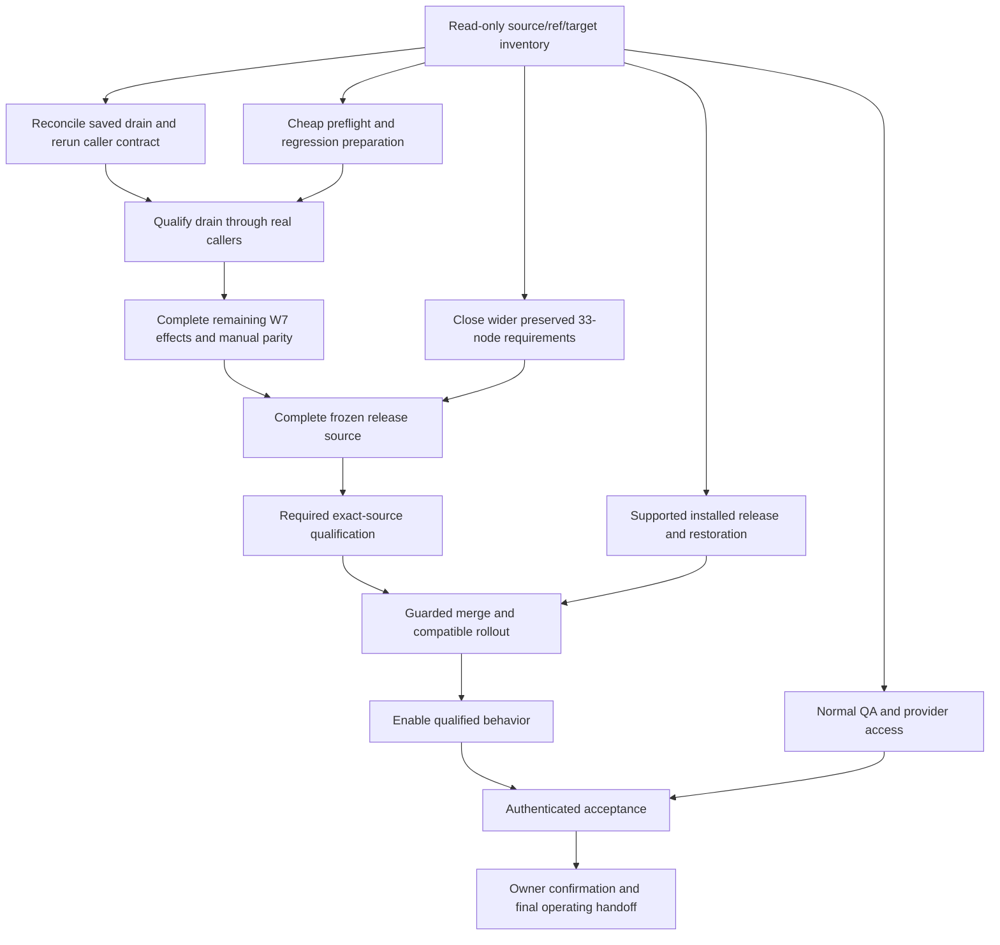

# Ship Verified System Workflow Outcomes

[Handoff](Ship-Verified-SupraOS-Agent-Workflows.md) · [Checklist](SupraOS-Workflow-Plan-Checklist.md) · [Dependency plan](Delivery-Path-Release-Plan.md) · [Evidence index](Evidence-Index.md) · [Canonical record](workflow-plan.json) · [Repository instructions](AGENTS.md)

Delivery strategy revision: **2026-10-05T08:55:00Z**. Canonical record SHA-256: `54606c547ffc5ba3508f01eed5fe35d52d7ea7462dbb2f6821f4f8d91e46d1fc`.

**Execution state:** PAUSED. OWNER PAUSE at 2026-10-05 ~08:55Z (the second pause of the day; the first was ~04:47Z): all six lanes are stopped, their work is committed and pushed, nothing is running, and nothing from this project was merged after PR #6196. W7 (candidate `ac4819095585eed003eb0c510b0a8c8608d5e73f`, PR #6196) is MERGED, DEPLOYED and ACTIVATED on production but NOT verified live (1 of 3 behaviours); the milestone is NOT complete. The active checkpoint is PRODUCTION STABILISATION. NEXT ACTION on resume: ship hotfix PR #6199 — apply packet `20261005232000_mc_rerun_unsent_anchor_hold` to production BEFORE the merge, then merge with `scripts/ci/box-ci/merge-if-green.sh 6199` once both box-ci checks are green on the current head. Production code is main `e2093866c1` (the W7 squash `55a12f0da9` from PR #6196 plus the unrelated PR #6172); `https://supraos.ai/api/version` re-read anonymously at 08:46Z reports `e2093866c1`. Main has since moved to `a2e04e9a42` (unrelated PR #6059 from another session, merged 08:37Z, not yet live at 08:46Z). Production database: the 24 W7 packets were applied and verified 06:03–06:10Z (ledger 691 → 715); the ledger read 735 at 08:34Z because the separate Agent Run session installed 16 packets of its own. That session's three "after-live" packets (`20260929010002`, `20260929080000`, `20261001000000`) are NOT installed and must not be installed until PR #6168's build is live. The pre-install backup (5.4 GB, counts match) is on the web host, NOT restore-tested; keep it until live acceptance passes. SCHEDULED-WORKFLOW INCIDENT: the release carried a new once-only scheduler (an "occurrence claim" path) that holds every due workflow while the switch `WORKFLOW_SCHEDULED_OCCURRENCE_CUTOVER` is unset. It was unset on production, so all 534 scheduled workflows were paused from 06:24Z to 07:57Z. The owner chose to turn the switch on (set in the production settings store and applied 07:57Z under the deploy lock) and said the missed runs need NOT be re-run. Since then, to 08:34Z: 85 scheduled runs, 0 workflows with more than one occurrence (once-only holds, 0 duplicates), but 55 of 85 runs failed (65%; about 2% the day before). 27 of the failures are waiting for a new per-action permission grant that the same release introduced: every API / Gmail / Calendar / send-email / file / bot step now needs an explicit grant (`lib/vms/workflows/execution-engine.ts` ~3604-3617), previously un-gated — an owner decision. The three sibling switches (`WORKFLOW_SCHEDULED_TERMINAL_APPROVAL_CUTOVER`, `WORKFLOW_SCHEDULED_APPROVAL_CONTINUATION_CUTOVER`, `WORKFLOW_SCHEDULED_OWNER_STATUS_READ`) are unset. The scheduler is ACTIVATED by owner choice but NOT qualified per its cutover checklist (`docs/agent-run/scheduled-workflow-cutover-checklist-20261001.md`). The verdict on file says leave the switch ON (it fails safe; off pauses everything); a duplicate slot is the only reason to turn it off. Root cause of the miss: the deploy-safety review checked only the Mission Control files for new environment switches, not the whole diff. One test project is stuck on production (project `43470d88`, plan `13fe1f43`, "W7 live test", status running; its final task cannot settle); it should self-heal within a minute of the hotfix going live, and the coordinator logs "terminal plan chain is not bound to settled plan" every minute until then. Mission Control admission was left OPEN on purpose. EIGHT FAULTS found live or by audit: (1) The final task of every agent-run plan cannot settle, so the plan stays `running`. Cause: `buildMcPlanFinishIntents` (`lib/vms/workflows/mc-plan-finish-intents.ts:61`) never sent `taskId`; `settle_mc_task_v1` requires it (`supabase/migrations/20261005230000_mc_critical_failure_drain.sql:541`). FIXED in PR #6199 (not merged). (2) Re-execute is dead for every project: L1-anchor effects always end `held_unknown`, six effect kinds have no receiver and stay pending, and `rerun_mc_plan_v1` (migration `20261005231000` ~129-133) refuses unless every effect is delivered; pre-release plans are refused `unproven_legacy`. FIXED in PR #6199 by packet `20261005232000` (not merged, packet not applied); pre-release plans still refused — owner decision 3. (3) The critical-failure drain cannot fire for Mission Control projects: `app/api/projects/route.ts:305` writes an empty critical path. Fix = PR #6198 (owner decision 2). (4) Any task failure on a projects-route plan wedges it: "invalid target task transition" (migration `20261005230000`:274-281; `plan-orchestrator.ts` ~869-883 retries the same preferred agent). NOT fixed, NO lane yet. (5) An unknown-outcome task can never be resolved (the resolve route writes directly, the guard rejects → 503); per-task Stop returns 500; cancel refuses while a task runs; review / outputs / Settings pause-complete-fail are silent no-ops. WIP on `claude/w7-guarded-owner-controls-20261005`. (6) Delete project fails or orphans a running plan; one rejected write aborts the whole coordinator tick. WIP on `claude/w7-delete-and-tick-isolation-20261005`. (7) Scheduled path: a run killed by a restart, a crash between claim and start, Run-now, a human-approval step (needs the unset switches) or a cancelled interval slot each stop that ONE workflow's schedule for good; for-each steps fail on a repeated target; workflow delete returns 500. WIP on `claude/scheduled-occurrence-live-fixes-20261005` (untested). (8) Planner screen (`/vms/mission-control/new`): a malformed planner answer produced a launchable 0-task plan and the review panel did not follow the selected plan. WIP on `claude/planner-zero-task-plan-20261005` (unverified). Live acceptance: 1 of 3 behaviours. C PASS (Re-execute on a pre-release plan refused, nothing created). B (lost-acknowledgment rerun) is blocked until PR #6199 is live. A (critical-failure drain) is not drivable from any control until PR #6198 plus an owner "mark failed" control exist. PRs and branches (all pushed; heads re-read from the remote at 08:46Z): [Hotfix: final task settles + Re-execute unblocked] PR #6199 `claude/w7-final-task-settle-fix-20261005` @ `dfebdab30a` — OPEN, not merged. Packet `20261005232000_mc_rerun_unsent_anchor_hold` is FINAL — apply to production BEFORE merge. Build box: 25/25 packets verified as non-superuser, native 27/27, rollback + reapply match. box-ci was green at the earlier head `420a71db33`; at the current head both box-ci checks were still PENDING when read at 08:46Z. Not done: scoped vitest at this head, conflict check against #6168. [Follow-ups: schema snapshot refresh, sweep fix, manifest re-pin] PR #6197 `claude/w7-followups-20261005` @ `1de6f98ed2` — OPEN. box-ci GREEN (both checks success, re-read 08:46Z), independently reviewed. Mergeable. The snapshot must be refreshed again after packet `20261005232000` is applied. [Mission Control plans get a critical path] PR #6198 `claude/w7-mc-critical-path-20261005` @ `19d4d01eae` — OPEN. box-ci GREEN (re-read 08:46Z). OWNER DECISION (changes behaviour). [Owner controls (resolve / stop / review / outputs / settings)] `claude/w7-guarded-owner-controls-20261005` @ `f7999b06ee`, no PR — WIP. Packet `20261005233000_mc_unknown_task_owner_resolution` drafted and verified on the build box (8/8 native). TypeScript written but NOT type-checked, no unit tests, UI not done. "I'll handle it" → closed as skipped is a behaviour choice needing sign-off. [Delete project + coordinator tick isolation] `claude/w7-delete-and-tick-isolation-20261005` @ `a9e41aee05`, no PR, stacked on #6197 — WIP. 19 tests pass, browser check PASS. Left: dependent vitest, changed-types, writers catalog, duplicate-migration check, merge main, open PR. [Scheduled workflows fixes] `claude/scheduled-occurrence-live-fixes-20261005` @ `d3eb84cefe`, no PR — WIP, untested, nothing reproduced on a real database. Do NOT apply its packet `20261005235000`. [Production-shape end-to-end harness (S1–S9)] `claude/w7-prod-shape-e2e-20261005` @ `f146740999`, no PR — Works. On main all scenarios fail; on the fix S1–S3 and the Workspace drain pass. [Planner 0-task plan + panel] `claude/planner-zero-task-plan-20261005` @ `689cbe8d72`, no PR — WIP committed by the root at pause: unverified, tests not run, no browser check. [Evidence (private)] `docs/w7-resume-evidence-20261005` @ `b11636b366` — Install log, acceptance screenshot, audit, end-to-end results, flag-on verdict. [Other session] PR #6168 Agent Run `codex/agent-run-release-composition-20261004` @ `9a0624083f` — OPEN, NOT merged, paused by the owner. Merge hold is LIFTED ("merges open"). It conflicts with W7 files; whoever resumes it re-merges main. Reserved migration versions: `20261005232000` (PR #6199, final), `20261005233000` (owner controls), `20261005234000` (delete/tick, unused so far), `20261005235000` (scheduled; do not apply). The Agent Run release uses nothing above `20261003021000`. Always re-check for collisions against main AND the production ledger. FIVE OWNER DECISIONS waiting: (1) Grants: every integration step in a scheduled workflow now needs a per-action grant that expires in 1–24 hours, so existing Gmail/Calendar/API workflows fail each run and file a card in Settings → Grants. Options: restore the pre-release un-gated behaviour for owner-authored scheduled workflows; make grants standing; or keep it and tell users. (2) PR #6198: Mission Control plans get a critical path — a third failure on the main chain fails the project and drains unstarted work instead of skipping the task. (3) Pre-release projects (39) cannot be re-executed: recommended "Adopt this project" signed receipt (new packet); stopgap "Duplicate as a new project" (no packet); plus plain-English refusal wording per status. (4) Owner controls: is "I'll handle it" on an unknown-outcome task = closed as skipped? Should an owner "Mark failed" be final (no automatic retry)? (5) Scheduled approval steps: turn on the three remaining switches, or keep human-approval steps unsupported in scheduled workflows for now? SEVEN-STEP EXECUTION PLAN: Step 1 — Verify state (read-only): `/api/version`; `scripts/ci/box-ci/status.sh` for #6197 #6198 #6199 #6168; whether main moved past `e2093866c1` (it has: `a2e04e9a42` at 08:46Z); the production ledger count and whether `20261005232000` is present (expect absent); the stuck plan's status; the scheduler watch queries from `scheduled-flag-on-verdict.md` (stalled occurrences, failure rate, duplicates — a duplicate slot is the ONLY reason to turn the switch off). Step 2 — Ship the hotfix PR #6199: merge origin/main in if main moved; run scoped vitest, `node scripts/check-changed-types.mjs`, `node scripts/check-private-ai-recovery-writers.mjs`, and `scripts/checks/duplicate-migration-numbers.mjs` against the merge base; run the production-shape harness on the head (expect S1–S3 pass and Re-execute "created"); wait for both box-ci statuses = success on the CURRENT head. Then, in order: apply packet `20261005232000_mc_rerun_unsent_anchor_hold` to production with `scripts/apply-migration.mjs` (expect APPLIED AND VERIFIED; on an alarm or UNKNOWN stop and reconcile by reading, do not retry) → `scripts/ci/box-ci/merge-if-green.sh 6199` → watch the deploy log on the web host for `live: <sha> health 200` → confirm the stuck plan `13fe1f43` becomes completed and the coordinator error stops. Step 3 — Live acceptance B (signed-in owner, real browser): on project `43470d88` ("W7 live test") click Re-execute → Start new run, reload the tab immediately, expect "A re-execution request needs confirmation…" and the button "Check re-execution"; click it. Pass = one row in `vms_mc_run_rerun_receipts` for that action, same run id, one new `vms_execution_runs` row, the new run completes. Screenshot. Step 4 — Merge PR #6197, then refresh `supabase/schema/public-*.txt` again for packet `20261005232000`, removing any now-stale BASELINE entry in `tests/unit/queried-tables-exist.test.ts`. Step 5 — Finish the paused lanes in parallel, each as its own PR with box-ci green, an independent review, real-database proof on the build box and, for UI, a real-browser check: (a) owner controls incl. packet `20261005233000` and fault 4 (task failure wedges a projects-route plan — it has no owner yet); (b) delete + tick isolation (rebase onto main after #6197 merges); (c) scheduled-workflow stalls, for-each, delete — reproduce on a real database first; (d) planner screen; (e) land the production-shape harness as a required pre-release check and add scenarios for every fault. Apply each packet to production before the code that needs it. Step 6 — After the owner decisions: PR #6198, then live acceptance A (critical failure with an unstarted sibling → sibling drained, plan failed, never completed); the legacy Re-execute option; grants. Step 7 — Clean up: remove the production backup and its tool folder; delete merged lane folders (only your own, `git worktree remove` without --force); then continue scope: remaining W7 effects/manual parity, active cancellation, real L1 anchoring, rerun-init pending/unknown recovery (design note `docs/agent-run/mc-rerun-init-recovery-design.md` on #6197), coordinator sweep run-id check, the runtime role (5 unmapped owner schemas — owner decision), Stripe Link (owner external), normal QA invite. Full scope stays 33 tasks / 16 behaviours / 12 surfaces; iMessage deferred, WhatsApp excluded. Stage truth: implemented yes; integrated yes; tested — pre-release suites passed but were insufficient; independently reviewed yes (the review missed the live faults and the new environment switch); merged yes (`55a12f0da9`, PR #6196); deployed yes; activated yes; verified live NO — 1 of 3 behaviours (C). The W7 milestone is NOT complete. Release rules learned 2026-10-05 (recorded under EP11): grep the WHOLE diff for new `process.env` reads and write down what the code does when each is unset in production; after every deploy compare before/after rates of high-volume background jobs (rows per 15 minutes), not just "cron returned 200"; acceptance must drive the real server path on a real database with production-shaped data, including the last step of each flow. Owner standing instruction for this run: "automerge and automigrate as needed" (it does not bypass permissions, approvals, release gates or resource limits). Evidence: private `jtobkin/suprafx-platform` branch `docs/w7-resume-evidence-20261005` @ `b11636b366` (install log, acceptance screenshot, live-controls audit, end-to-end results, scheduler flag-on verdict). The resume prompt for the next session is in the pause handoff below (sanitised); the unsanitised prompt is in the private memory repo as `PROMPT-2026-10-05-resume-w7-stabilization.md`. History, kept as it happened: first cut `3214f4849e` got RED required CI at ~05:00Z and was replaced by `ac48190955` (required CI GREEN 05:36Z, independent trailing audit PASS 5/5); production install 06:03–06:10Z (24/24 packets applied and verified); merged 06:11:22Z → main `55a12f0da9b09052d0bfa186f747654a60f3a931`; deployed 06:24:35Z; live acceptance 06:35–07:45Z found the first two faults. This is a partial-W7 milestone that is itself not yet verified live; full W7 scope and the other tasks remain open.

**Scope:** all 33 tasks, 16 behavior families and 12 supported surfaces remain required. W7 is an intermediate milestone. iMessage is deferred; WhatsApp is excluded.

**Current delivery checkpoint:** **PRODUCTION STABILISATION (paused).** OWNER PAUSE at 2026-10-05 ~08:55Z (the second pause of the day; the first was ~04:47Z): all six lanes are stopped, their work is committed and pushed, nothing is running, and nothing from this project was merged after PR #6196. Candidate `ac4819095585eed003eb0c510b0a8c8608d5e73f` (tree `49bf08e3354a115783635eebfa4801dfa953bb6c`, PR [#6196](https://github.com/jtobkin/suprafx-platform/pull/6196)) is **merged, deployed and activated on production, but NOT verified live — 1 of 3 behaviours. The milestone is not complete**. **Next action.** NEXT ACTION on resume: ship hotfix PR #6199 — apply packet `20261005232000_mc_rerun_unsent_anchor_hold` to production BEFORE the merge, then merge with `scripts/ci/box-ci/merge-if-green.sh 6199` once both box-ci checks are green on the current head. **Production now.** Production code is main `e2093866c1` (the W7 squash `55a12f0da9` from PR #6196 plus the unrelated PR #6172); `https://supraos.ai/api/version` re-read anonymously at 08:46Z reports `e2093866c1`. Main has since moved to `a2e04e9a42` (unrelated PR #6059 from another session, merged 08:37Z, not yet live at 08:46Z). Production database: the 24 W7 packets were applied and verified 06:03–06:10Z (ledger 691 → 715); the ledger read 735 at 08:34Z because the separate Agent Run session installed 16 packets of its own. That session's three "after-live" packets (`20260929010002`, `20260929080000`, `20261001000000`) are NOT installed and must not be installed until PR #6168's build is live. The pre-install backup (5.4 GB, counts match) is on the web host, NOT restore-tested; keep it until live acceptance passes. One test project is stuck on production (project `43470d88`, plan `13fe1f43`, "W7 live test", status running; its final task cannot settle); it should self-heal within a minute of the hotfix going live, and the coordinator logs "terminal plan chain is not bound to settled plan" every minute until then. Mission Control admission was left OPEN on purpose. **Scheduled-workflow incident.** SCHEDULED-WORKFLOW INCIDENT: the release carried a new once-only scheduler (an "occurrence claim" path) that holds every due workflow while the switch `WORKFLOW_SCHEDULED_OCCURRENCE_CUTOVER` is unset. It was unset on production, so all 534 scheduled workflows were paused from 06:24Z to 07:57Z. The owner chose to turn the switch on (set in the production settings store and applied 07:57Z under the deploy lock) and said the missed runs need NOT be re-run. Since then, to 08:34Z: 85 scheduled runs, 0 workflows with more than one occurrence (once-only holds, 0 duplicates), but 55 of 85 runs failed (65%; about 2% the day before). 27 of the failures are waiting for a new per-action permission grant that the same release introduced: every API / Gmail / Calendar / send-email / file / bot step now needs an explicit grant (`lib/vms/workflows/execution-engine.ts` ~3604-3617), previously un-gated — an owner decision. The three sibling switches (`WORKFLOW_SCHEDULED_TERMINAL_APPROVAL_CUTOVER`, `WORKFLOW_SCHEDULED_APPROVAL_CONTINUATION_CUTOVER`, `WORKFLOW_SCHEDULED_OWNER_STATUS_READ`) are unset. The scheduler is ACTIVATED by owner choice but NOT qualified per its cutover checklist (`docs/agent-run/scheduled-workflow-cutover-checklist-20261001.md`). The verdict on file says leave the switch ON (it fails safe; off pauses everything); a duplicate slot is the only reason to turn it off. Root cause of the miss: the deploy-safety review checked only the Mission Control files for new environment switches, not the whole diff. **Eight faults.** EIGHT FAULTS found live or by audit: (1) The final task of every agent-run plan cannot settle, so the plan stays `running`. Cause: `buildMcPlanFinishIntents` (`lib/vms/workflows/mc-plan-finish-intents.ts:61`) never sent `taskId`; `settle_mc_task_v1` requires it (`supabase/migrations/20261005230000_mc_critical_failure_drain.sql:541`). FIXED in PR #6199 (not merged). (2) Re-execute is dead for every project: L1-anchor effects always end `held_unknown`, six effect kinds have no receiver and stay pending, and `rerun_mc_plan_v1` (migration `20261005231000` ~129-133) refuses unless every effect is delivered; pre-release plans are refused `unproven_legacy`. FIXED in PR #6199 by packet `20261005232000` (not merged, packet not applied); pre-release plans still refused — owner decision 3. (3) The critical-failure drain cannot fire for Mission Control projects: `app/api/projects/route.ts:305` writes an empty critical path. Fix = PR #6198 (owner decision 2). (4) Any task failure on a projects-route plan wedges it: "invalid target task transition" (migration `20261005230000`:274-281; `plan-orchestrator.ts` ~869-883 retries the same preferred agent). NOT fixed, NO lane yet. (5) An unknown-outcome task can never be resolved (the resolve route writes directly, the guard rejects → 503); per-task Stop returns 500; cancel refuses while a task runs; review / outputs / Settings pause-complete-fail are silent no-ops. WIP on `claude/w7-guarded-owner-controls-20261005`. (6) Delete project fails or orphans a running plan; one rejected write aborts the whole coordinator tick. WIP on `claude/w7-delete-and-tick-isolation-20261005`. (7) Scheduled path: a run killed by a restart, a crash between claim and start, Run-now, a human-approval step (needs the unset switches) or a cancelled interval slot each stop that ONE workflow's schedule for good; for-each steps fail on a repeated target; workflow delete returns 500. WIP on `claude/scheduled-occurrence-live-fixes-20261005` (untested). (8) Planner screen (`/vms/mission-control/new`): a malformed planner answer produced a launchable 0-task plan and the review panel did not follow the selected plan. WIP on `claude/planner-zero-task-plan-20261005` (unverified). **Live acceptance.** Live acceptance: 1 of 3 behaviours. C PASS (Re-execute on a pre-release plan refused, nothing created). B (lost-acknowledgment rerun) is blocked until PR #6199 is live. A (critical-failure drain) is not drivable from any control until PR #6198 plus an owner "mark failed" control exist. **PRs and branches.** PRs and branches (all pushed; heads re-read from the remote at 08:46Z): [Hotfix: final task settles + Re-execute unblocked] PR #6199 `claude/w7-final-task-settle-fix-20261005` @ `dfebdab30a` — OPEN, not merged. Packet `20261005232000_mc_rerun_unsent_anchor_hold` is FINAL — apply to production BEFORE merge. Build box: 25/25 packets verified as non-superuser, native 27/27, rollback + reapply match. box-ci was green at the earlier head `420a71db33`; at the current head both box-ci checks were still PENDING when read at 08:46Z. Not done: scoped vitest at this head, conflict check against #6168. [Follow-ups: schema snapshot refresh, sweep fix, manifest re-pin] PR #6197 `claude/w7-followups-20261005` @ `1de6f98ed2` — OPEN. box-ci GREEN (both checks success, re-read 08:46Z), independently reviewed. Mergeable. The snapshot must be refreshed again after packet `20261005232000` is applied. [Mission Control plans get a critical path] PR #6198 `claude/w7-mc-critical-path-20261005` @ `19d4d01eae` — OPEN. box-ci GREEN (re-read 08:46Z). OWNER DECISION (changes behaviour). [Owner controls (resolve / stop / review / outputs / settings)] `claude/w7-guarded-owner-controls-20261005` @ `f7999b06ee`, no PR — WIP. Packet `20261005233000_mc_unknown_task_owner_resolution` drafted and verified on the build box (8/8 native). TypeScript written but NOT type-checked, no unit tests, UI not done. "I'll handle it" → closed as skipped is a behaviour choice needing sign-off. [Delete project + coordinator tick isolation] `claude/w7-delete-and-tick-isolation-20261005` @ `a9e41aee05`, no PR, stacked on #6197 — WIP. 19 tests pass, browser check PASS. Left: dependent vitest, changed-types, writers catalog, duplicate-migration check, merge main, open PR. [Scheduled workflows fixes] `claude/scheduled-occurrence-live-fixes-20261005` @ `d3eb84cefe`, no PR — WIP, untested, nothing reproduced on a real database. Do NOT apply its packet `20261005235000`. [Production-shape end-to-end harness (S1–S9)] `claude/w7-prod-shape-e2e-20261005` @ `f146740999`, no PR — Works. On main all scenarios fail; on the fix S1–S3 and the Workspace drain pass. [Planner 0-task plan + panel] `claude/planner-zero-task-plan-20261005` @ `689cbe8d72`, no PR — WIP committed by the root at pause: unverified, tests not run, no browser check. [Evidence (private)] `docs/w7-resume-evidence-20261005` @ `b11636b366` — Install log, acceptance screenshot, audit, end-to-end results, flag-on verdict. [Other session] PR #6168 Agent Run `codex/agent-run-release-composition-20261004` @ `9a0624083f` — OPEN, NOT merged, paused by the owner. Merge hold is LIFTED ("merges open"). It conflicts with W7 files; whoever resumes it re-merges main. **Migrations.** Reserved migration versions: `20261005232000` (PR #6199, final), `20261005233000` (owner controls), `20261005234000` (delete/tick, unused so far), `20261005235000` (scheduled; do not apply). The Agent Run release uses nothing above `20261003021000`. Always re-check for collisions against main AND the production ledger. **Owner decisions.** FIVE OWNER DECISIONS waiting: (1) Grants: every integration step in a scheduled workflow now needs a per-action grant that expires in 1–24 hours, so existing Gmail/Calendar/API workflows fail each run and file a card in Settings → Grants. Options: restore the pre-release un-gated behaviour for owner-authored scheduled workflows; make grants standing; or keep it and tell users. (2) PR #6198: Mission Control plans get a critical path — a third failure on the main chain fails the project and drains unstarted work instead of skipping the task. (3) Pre-release projects (39) cannot be re-executed: recommended "Adopt this project" signed receipt (new packet); stopgap "Duplicate as a new project" (no packet); plus plain-English refusal wording per status. (4) Owner controls: is "I'll handle it" on an unknown-outcome task = closed as skipped? Should an owner "Mark failed" be final (no automatic retry)? (5) Scheduled approval steps: turn on the three remaining switches, or keep human-approval steps unsupported in scheduled workflows for now? **Order from here.** SEVEN-STEP EXECUTION PLAN: Step 1 — Verify state (read-only): `/api/version`; `scripts/ci/box-ci/status.sh` for #6197 #6198 #6199 #6168; whether main moved past `e2093866c1` (it has: `a2e04e9a42` at 08:46Z); the production ledger count and whether `20261005232000` is present (expect absent); the stuck plan's status; the scheduler watch queries from `scheduled-flag-on-verdict.md` (stalled occurrences, failure rate, duplicates — a duplicate slot is the ONLY reason to turn the switch off). Step 2 — Ship the hotfix PR #6199: merge origin/main in if main moved; run scoped vitest, `node scripts/check-changed-types.mjs`, `node scripts/check-private-ai-recovery-writers.mjs`, and `scripts/checks/duplicate-migration-numbers.mjs` against the merge base; run the production-shape harness on the head (expect S1–S3 pass and Re-execute "created"); wait for both box-ci statuses = success on the CURRENT head. Then, in order: apply packet `20261005232000_mc_rerun_unsent_anchor_hold` to production with `scripts/apply-migration.mjs` (expect APPLIED AND VERIFIED; on an alarm or UNKNOWN stop and reconcile by reading, do not retry) → `scripts/ci/box-ci/merge-if-green.sh 6199` → watch the deploy log on the web host for `live: <sha> health 200` → confirm the stuck plan `13fe1f43` becomes completed and the coordinator error stops. Step 3 — Live acceptance B (signed-in owner, real browser): on project `43470d88` ("W7 live test") click Re-execute → Start new run, reload the tab immediately, expect "A re-execution request needs confirmation…" and the button "Check re-execution"; click it. Pass = one row in `vms_mc_run_rerun_receipts` for that action, same run id, one new `vms_execution_runs` row, the new run completes. Screenshot. Step 4 — Merge PR #6197, then refresh `supabase/schema/public-*.txt` again for packet `20261005232000`, removing any now-stale BASELINE entry in `tests/unit/queried-tables-exist.test.ts`. Step 5 — Finish the paused lanes in parallel, each as its own PR with box-ci green, an independent review, real-database proof on the build box and, for UI, a real-browser check: (a) owner controls incl. packet `20261005233000` and fault 4 (task failure wedges a projects-route plan — it has no owner yet); (b) delete + tick isolation (rebase onto main after #6197 merges); (c) scheduled-workflow stalls, for-each, delete — reproduce on a real database first; (d) planner screen; (e) land the production-shape harness as a required pre-release check and add scenarios for every fault. Apply each packet to production before the code that needs it. Step 6 — After the owner decisions: PR #6198, then live acceptance A (critical failure with an unstarted sibling → sibling drained, plan failed, never completed); the legacy Re-execute option; grants. Step 7 — Clean up: remove the production backup and its tool folder; delete merged lane folders (only your own, `git worktree remove` without --force); then continue scope: remaining W7 effects/manual parity, active cancellation, real L1 anchoring, rerun-init pending/unknown recovery (design note `docs/agent-run/mc-rerun-init-recovery-design.md` on #6197), coordinator sweep run-id check, the runtime role (5 unmapped owner schemas — owner decision), Stripe Link (owner external), normal QA invite. Full scope stays 33 tasks / 16 behaviours / 12 surfaces; iMessage deferred, WhatsApp excluded. **Stage truth.** Stage truth: implemented yes; integrated yes; tested — pre-release suites passed but were insufficient; independently reviewed yes (the review missed the live faults and the new environment switch); merged yes (`55a12f0da9`, PR #6196); deployed yes; activated yes; verified live NO — 1 of 3 behaviours (C). The W7 milestone is NOT complete. **Lesson.** Release rules learned 2026-10-05 (recorded under EP11): grep the WHOLE diff for new `process.env` reads and write down what the code does when each is unset in production; after every deploy compare before/after rates of high-volume background jobs (rows per 15 minutes), not just "cron returned 200"; acceptance must drive the real server path on a real database with production-shaped data, including the last step of each flow. **Evidence.** private `jtobkin/suprafx-platform` branch `docs/w7-resume-evidence-20261005` @ `b11636b366` (install log, acceptance screenshot, live-controls audit, end-to-end results, scheduler flag-on verdict). Qualification before the merge, kept as recorded: box-ci on `ac48190955` observed 05:36Z — security-gates SUCCESS (51 steps; macOS Native Land not run), production-build SUCCESS (7 steps); independent trailing audit PASS on all 5 checks (fix diff; native 26/26; ordered 24/24 packets applied and verified as non-superuser; browser 46/46 + 2/2 F1; scoped unit 924 passed / 7 skipped / 0 failed on the second run). Those suites passed and were insufficient: none drove the real server path with production-shaped data

**Current candidate record:** `ac4819095585eed003eb0c510b0a8c8608d5e73f`, tree `49bf08e3354a115783635eebfa4801dfa953bb6c`. Security: box-ci/security-gates SUCCESS on ac48190955 (51 steps; macOS Native Land not run). Previous head 3214f4849e: FAILURE (whole unit tree 2 failed / 55,609 passed / 374 skipped across 4,508 files; scoped changed-file TypeScript check 5 errors); build: box-ci/production-build SUCCESS on ac48190955 (7 steps). Previous head 3214f4849e: ERROR (not built because security gates failed); macOS Native Land: Not run (not part of box-ci). Merged: True; deployed: True; activated: True; verified live: False. Scope: Composed W7 failure-drain/rerun candidate (partial W7; full scope open). Frozen candidate ac48190955 = 3214f4849e + fix commit 867a5f2114 + clean merge of origin/main 7a10b7a3fc; required CI GREEN and independent trailing audit PASS 5/5 at that commit. Squash-merged 2026-10-05 06:11:22Z as main 55a12f0da9b09052d0bfa186f747654a60f3a931 (PR #6196); production schema installed 06:03–06:10Z (24/24 packets applied and verified); deployed 06:24:35Z; activated. `verified live: False` here means NOT verified live and the milestone NOT complete: 1 of 3 behaviours passed (C); B waits for hotfix PR #6199; A waits for PR #6198 plus an owner "mark failed" control. Eight faults are open (two fixed in the unmerged hotfix). The release also carried a once-only scheduler whose unset switch paused all 534 scheduled workflows 06:24–07:57Z; the owner turned it on; it is activated but not qualified per its cutover checklist. OWNER PAUSE at ~08:55Z: nothing from this project merged after #6196. Not part of this candidate: hotfix PR #6199 @ dfebdab30a, PR #6198 @ 19d4d01eae (owner decision), follow-up PR #6197 @ 1de6f98ed2, and five unmerged work branches. Observed: 2026-10-05T08:55:00Z. Update this canonical candidate record after changes; never infer status from historical receipts.

**Dated recovery baseline:** strict E3 was RED with 6,540 blockers at the prior closeout. These observations are not permission to skip fresh release checks.

Private portable evidence: `04795ddf0c18af8d40960ea29993fbf93535f5de` (2,291 restored files / 957 objects / 1,036 remotely verified transport files). Archive predates final CI; retain its original state. Baseline public handoff: `84f9f20b9fdfd33762b7e881da40980ed57349d4`. Historical documents are preserved under [history](history/20261005-before-delivery-rewrite/); historical statuses are not current authority.


## Status 2026-10-05 ~08:55Z — OWNER PAUSE: W7 is live but NOT verified (1 of 3); production stabilisation is next; ship hotfix #6199 first (read this first)

The section below this one describes the earlier pause at ~02:04Z and is kept as dated history. This section is the current state.

**Pause.** OWNER PAUSE at 2026-10-05 ~08:55Z (the second pause of the day; the first was ~04:47Z): all six lanes are stopped, their work is committed and pushed, nothing is running, and nothing from this project was merged after PR #6196. Two unrelated PRs from other sessions did reach main after it (#6172 at 07:44Z, which is live, and #6059 at 08:37Z, which was not yet live at 08:46Z).

**Where W7 stands.** Merged, deployed and activated on production, but **NOT verified live — 1 of 3 behaviours**. The milestone is not complete. The active checkpoint is **production stabilisation**.

**Next action.** NEXT ACTION on resume: ship hotfix PR #6199 — apply packet `20261005232000_mc_rerun_unsent_anchor_hold` to production BEFORE the merge, then merge with `scripts/ci/box-ci/merge-if-green.sh 6199` once both box-ci checks are green on the current head.

**Production now.** Production code is main `e2093866c1` (the W7 squash `55a12f0da9` from PR #6196 plus the unrelated PR #6172); `https://supraos.ai/api/version` re-read anonymously at 08:46Z reports `e2093866c1`. Main has since moved to `a2e04e9a42` (unrelated PR #6059 from another session, merged 08:37Z, not yet live at 08:46Z). Production database: the 24 W7 packets were applied and verified 06:03–06:10Z (ledger 691 → 715); the ledger read 735 at 08:34Z because the separate Agent Run session installed 16 packets of its own. That session's three "after-live" packets (`20260929010002`, `20260929080000`, `20261001000000`) are NOT installed and must not be installed until PR #6168's build is live. The pre-install backup (5.4 GB, counts match) is on the web host, NOT restore-tested; keep it until live acceptance passes. One test project is stuck on production (project `43470d88`, plan `13fe1f43`, "W7 live test", status running; its final task cannot settle); it should self-heal within a minute of the hotfix going live, and the coordinator logs "terminal plan chain is not bound to settled plan" every minute until then. Mission Control admission was left OPEN on purpose.

**The scheduled-workflow incident.**

- The release carried a new once-only scheduler that holds all due work while a switch (`WORKFLOW_SCHEDULED_OCCURRENCE_CUTOVER`) is unset. It was unset on production.
- All 534 scheduled workflows were paused from 06:24Z to 07:57Z.
- The owner chose to turn the switch on. Missed work is NOT re-run.
- Since then (to 08:34Z): once-only holds — 0 duplicates in 85 runs. But 55 of 85 runs failed; 27 of them are waiting for a new per-action permission grant introduced by the same release (owner decision 1).
- The scheduler is activated by owner choice, NOT qualified per its cutover checklist. Known stalls are fault 7 below. The verdict on file says leave the switch ON; a duplicate slot is the only reason to turn it off.
- **Root cause of the miss:** the deploy-safety review checked only the Mission Control files for new environment switches, not the whole diff.

**The eight faults.**

| # | Found | Fault | State |
| --- | --- | --- | --- |
| 1 | LIVE | The final task of every agent-run plan cannot settle, so the plan stays `running`. Cause: `buildMcPlanFinishIntents` (`lib/vms/workflows/mc-plan-finish-intents.ts:61`) never sent `taskId`; `settle_mc_task_v1` requires it (`supabase/migrations/20261005230000_mc_critical_failure_drain.sql:541`). | FIXED in PR #6199 (not merged) |
| 2 | LIVE | Re-execute is dead for every project: L1-anchor effects always end `held_unknown`, six effect kinds have no receiver and stay pending, and `rerun_mc_plan_v1` (migration `20261005231000` ~129-133) refuses unless every effect is delivered; pre-release plans are refused `unproven_legacy`. | FIXED in PR #6199 by packet `20261005232000` (not merged, packet not applied); pre-release plans still refused — owner decision 3 |
| 3 | Audit | The critical-failure drain cannot fire for Mission Control projects: `app/api/projects/route.ts:305` writes an empty critical path. | Fix = PR #6198 (owner decision 2) |
| 4 | Audit | Any task failure on a projects-route plan wedges it: "invalid target task transition" (migration `20261005230000`:274-281; `plan-orchestrator.ts` ~869-883 retries the same preferred agent). | NOT fixed, NO lane yet |
| 5 | Audit | An unknown-outcome task can never be resolved (the resolve route writes directly, the guard rejects → 503); per-task Stop returns 500; cancel refuses while a task runs; review / outputs / Settings pause-complete-fail are silent no-ops. | WIP on `claude/w7-guarded-owner-controls-20261005` |
| 6 | Audit | Delete project fails or orphans a running plan; one rejected write aborts the whole coordinator tick. | WIP on `claude/w7-delete-and-tick-isolation-20261005` |
| 7 | Audit | Scheduled path: a run killed by a restart, a crash between claim and start, Run-now, a human-approval step (needs the unset switches) or a cancelled interval slot each stop that ONE workflow's schedule for good; for-each steps fail on a repeated target; workflow delete returns 500. | WIP on `claude/scheduled-occurrence-live-fixes-20261005` (untested) |
| 8 | LIVE | Planner screen (`/vms/mission-control/new`): a malformed planner answer produced a launchable 0-task plan and the review panel did not follow the selected plan. | WIP on `claude/planner-zero-task-plan-20261005` (unverified) |

**Live acceptance.** Live acceptance: 1 of 3 behaviours. C PASS (Re-execute on a pre-release plan refused, nothing created). B (lost-acknowledgment rerun) is blocked until PR #6199 is live. A (critical-failure drain) is not drivable from any control until PR #6198 plus an owner "mark failed" control exist.

**PRs and branches** (all pushed; heads and states re-read from the remote at 08:46Z).

| What | PR / branch @ head | State |
| --- | --- | --- |
| Hotfix: final task settles + Re-execute unblocked | PR #6199 `claude/w7-final-task-settle-fix-20261005` @ `dfebdab30a` | OPEN, not merged. Packet `20261005232000_mc_rerun_unsent_anchor_hold` is FINAL — apply to production BEFORE merge. Build box: 25/25 packets verified as non-superuser, native 27/27, rollback + reapply match. box-ci was green at the earlier head `420a71db33`; at the current head both box-ci checks were still PENDING when read at 08:46Z. Not done: scoped vitest at this head, conflict check against #6168. |
| Follow-ups: schema snapshot refresh, sweep fix, manifest re-pin | PR #6197 `claude/w7-followups-20261005` @ `1de6f98ed2` | OPEN. box-ci GREEN (both checks success, re-read 08:46Z), independently reviewed. Mergeable. The snapshot must be refreshed again after packet `20261005232000` is applied. |
| Mission Control plans get a critical path | PR #6198 `claude/w7-mc-critical-path-20261005` @ `19d4d01eae` | OPEN. box-ci GREEN (re-read 08:46Z). OWNER DECISION (changes behaviour). |
| Owner controls (resolve / stop / review / outputs / settings) | `claude/w7-guarded-owner-controls-20261005` @ `f7999b06ee`, no PR | WIP. Packet `20261005233000_mc_unknown_task_owner_resolution` drafted and verified on the build box (8/8 native). TypeScript written but NOT type-checked, no unit tests, UI not done. "I'll handle it" → closed as skipped is a behaviour choice needing sign-off. |
| Delete project + coordinator tick isolation | `claude/w7-delete-and-tick-isolation-20261005` @ `a9e41aee05`, no PR, stacked on #6197 | WIP. 19 tests pass, browser check PASS. Left: dependent vitest, changed-types, writers catalog, duplicate-migration check, merge main, open PR. |
| Scheduled workflows fixes | `claude/scheduled-occurrence-live-fixes-20261005` @ `d3eb84cefe`, no PR | WIP, untested, nothing reproduced on a real database. Do NOT apply its packet `20261005235000`. |
| Production-shape end-to-end harness (S1–S9) | `claude/w7-prod-shape-e2e-20261005` @ `f146740999`, no PR | Works. On main all scenarios fail; on the fix S1–S3 and the Workspace drain pass. |
| Planner 0-task plan + panel | `claude/planner-zero-task-plan-20261005` @ `689cbe8d72`, no PR | WIP committed by the root at pause: unverified, tests not run, no browser check. |
| Evidence (private) | `docs/w7-resume-evidence-20261005` @ `b11636b366` | Install log, acceptance screenshot, audit, end-to-end results, flag-on verdict. |
| Other session | PR #6168 Agent Run `codex/agent-run-release-composition-20261004` @ `9a0624083f` | OPEN, NOT merged, paused by the owner. Merge hold is LIFTED ("merges open"). It conflicts with W7 files; whoever resumes it re-merges main. |

**Migrations.** Reserved migration versions: `20261005232000` (PR #6199, final), `20261005233000` (owner controls), `20261005234000` (delete/tick, unused so far), `20261005235000` (scheduled; do not apply). The Agent Run release uses nothing above `20261003021000`. Always re-check for collisions against main AND the production ledger.

**Five owner decisions waiting.**

1. Grants: every integration step in a scheduled workflow now needs a per-action grant that expires in 1–24 hours, so existing Gmail/Calendar/API workflows fail each run and file a card in Settings → Grants. Options: restore the pre-release un-gated behaviour for owner-authored scheduled workflows; make grants standing; or keep it and tell users.
2. PR #6198: Mission Control plans get a critical path — a third failure on the main chain fails the project and drains unstarted work instead of skipping the task.
3. Pre-release projects (39) cannot be re-executed: recommended "Adopt this project" signed receipt (new packet); stopgap "Duplicate as a new project" (no packet); plus plain-English refusal wording per status.
4. Owner controls: is "I'll handle it" on an unknown-outcome task = closed as skipped? Should an owner "Mark failed" be final (no automatic retry)?
5. Scheduled approval steps: turn on the three remaining switches, or keep human-approval steps unsupported in scheduled workflows for now?

**Seven-step execution plan.**

1. Verify state (read-only): `/api/version`; `scripts/ci/box-ci/status.sh` for #6197 #6198 #6199 #6168; whether main moved past `e2093866c1` (it has: `a2e04e9a42` at 08:46Z); the production ledger count and whether `20261005232000` is present (expect absent); the stuck plan's status; the scheduler watch queries from `scheduled-flag-on-verdict.md` (stalled occurrences, failure rate, duplicates — a duplicate slot is the ONLY reason to turn the switch off).
2. Ship the hotfix PR #6199: merge origin/main in if main moved; run scoped vitest, `node scripts/check-changed-types.mjs`, `node scripts/check-private-ai-recovery-writers.mjs`, and `scripts/checks/duplicate-migration-numbers.mjs` against the merge base; run the production-shape harness on the head (expect S1–S3 pass and Re-execute "created"); wait for both box-ci statuses = success on the CURRENT head. Then, in order: apply packet `20261005232000_mc_rerun_unsent_anchor_hold` to production with `scripts/apply-migration.mjs` (expect APPLIED AND VERIFIED; on an alarm or UNKNOWN stop and reconcile by reading, do not retry) → `scripts/ci/box-ci/merge-if-green.sh 6199` → watch the deploy log on the web host for `live: <sha> health 200` → confirm the stuck plan `13fe1f43` becomes completed and the coordinator error stops.
3. Live acceptance B (signed-in owner, real browser): on project `43470d88` ("W7 live test") click Re-execute → Start new run, reload the tab immediately, expect "A re-execution request needs confirmation…" and the button "Check re-execution"; click it. Pass = one row in `vms_mc_run_rerun_receipts` for that action, same run id, one new `vms_execution_runs` row, the new run completes. Screenshot.
4. Merge PR #6197, then refresh `supabase/schema/public-*.txt` again for packet `20261005232000`, removing any now-stale BASELINE entry in `tests/unit/queried-tables-exist.test.ts`.
5. Finish the paused lanes in parallel, each as its own PR with box-ci green, an independent review, real-database proof on the build box and, for UI, a real-browser check: (a) owner controls incl. packet `20261005233000` and fault 4 (task failure wedges a projects-route plan — it has no owner yet); (b) delete + tick isolation (rebase onto main after #6197 merges); (c) scheduled-workflow stalls, for-each, delete — reproduce on a real database first; (d) planner screen; (e) land the production-shape harness as a required pre-release check and add scenarios for every fault. Apply each packet to production before the code that needs it.
6. After the owner decisions: PR #6198, then live acceptance A (critical failure with an unstarted sibling → sibling drained, plan failed, never completed); the legacy Re-execute option; grants.
7. Clean up: remove the production backup and its tool folder; delete merged lane folders (only your own, `git worktree remove` without --force); then continue scope: remaining W7 effects/manual parity, active cancellation, real L1 anchoring, rerun-init pending/unknown recovery (design note `docs/agent-run/mc-rerun-init-recovery-design.md` on #6197), coordinator sweep run-id check, the runtime role (5 unmapped owner schemas — owner decision), Stripe Link (owner external), normal QA invite. Full scope stays 33 tasks / 16 behaviours / 12 surfaces; iMessage deferred, WhatsApp excluded.

**Release rules learned today (EP11).** Release rules learned 2026-10-05 (recorded under EP11): grep the WHOLE diff for new `process.env` reads and write down what the code does when each is unset in production; after every deploy compare before/after rates of high-volume background jobs (rows per 15 minutes), not just "cron returned 200"; acceptance must drive the real server path on a real database with production-shaped data, including the last step of each flow.

**Evidence.** private `jtobkin/suprafx-platform` branch `docs/w7-resume-evidence-20261005` @ `b11636b366` (install log, acceptance screenshot, live-controls audit, end-to-end results, scheduler flag-on verdict).

| Stage | State now |
| --- | --- |
| Implemented | Yes, with eight known faults; two fixed in the unmerged hotfix |
| Integrated | Candidate yes; hotfix, follow-ups and fix branches no |
| Tested | Pre-release suites passed but were insufficient; production-shape harness now exists (not yet on main) |
| Independently reviewed | Candidate yes (missed the live faults and the scheduler switch); hotfix at current head no |
| Merged | Yes, main `55a12f0da9` (PR #6196); nothing from this project since |
| Deployed | Yes; production code is main `e2093866c1` |
| Activated | Yes; scheduler switch turned on 07:57Z by owner choice |
| Verified live | NO — 1 of 3 passed (C); B waits for #6199; A waits for #6198 plus a "mark failed" control |

### Resume prompt for the next session (sanitised)

This is the prompt to paste into a new session. It is sanitised for this public repository: the settings-store location, host file paths and full project/plan identifiers are removed or shortened. The unsanitised prompt is in the private memory repo as `PROMPT-2026-10-05-resume-w7-stabilization.md`.

Resume the SupraOS Agent Workflows project (W7 milestone: Mission Control critical-failure drain with safe rerun recovery) from the saved handoff. You are on a new computer with no session context. W7 was installed, merged and deployed on 2026-10-05, and live testing then found real faults. Your job is to STABILISE production first, then finish live acceptance, then continue scope. Ground yourself in code and evidence before changing anything. Treat this as authorization to resume implementation, testing, integration, production migrations from committed files, and supported merge/deployment when all required controls pass (owner standing instruction for this run: "automerge and automigrate as needed"). Do not bypass permissions, approvals, release gates or resource limits; if a tool call is denied, hand the exact command to the owner to run and continue with other work. Run independent lanes in parallel with exclusive files. Answer the owner in plain English, under 50 words, bullets, ending with a TLDR line.

#### 0. State at pause (verified 2026-10-05 ~08:35–08:55Z; re-verify everything)

Production (https://supraos.ai, private repo jtobkin/suprafx-platform):

- Code live = main `e2093866c1` (W7 squash `55a12f0da9` from PR #6196, plus #6172). Check `curl -s https://supraos.ai/api/version`.
- Database: the 24 W7 packets were applied and verified 06:03–06:10Z (ledger 691 → 715; list in `scripts/qa/w7-packets-20261005.txt`). Ledger was 735 at 08:34Z because the Agent Run session installed 16 of its own packets. Its 3 "after-live" packets (`20260929010002`, `20260929080000`, `20261001000000`) are NOT installed and must not be installed by anyone until PR #6168's build is live.
- Backup taken before the install: on the web host (5.4 GB, counts match, NOT restore-tested; made with the tool's `--min-free-gib 60` because the host had 60.4 GB free). Keep it until live acceptance passes, then remove it and its tool folder.
- Scheduler switch: `WORKFLOW_SCHEDULED_OCCURRENCE_CUTOVER=1` was created in the production settings store and applied 07:57Z (the web host's environment-refresh and restart scripts, under the deploy lock). Reason: the release replaced the scheduler with a once-only "occurrence claim" path that holds every due workflow while the switch is unset; all 534 scheduled workflows were paused 06:24–07:57Z. The owner chose to turn it on and said missed runs need NOT be re-run. The three sibling switches (`WORKFLOW_SCHEDULED_TERMINAL_APPROVAL_CUTOVER`, `WORKFLOW_SCHEDULED_APPROVAL_CONTINUATION_CUTOVER`, `WORKFLOW_SCHEDULED_OWNER_STATUS_READ`) are unset. Do not read the environment-refresh script (the permission classifier refuses; running it is fine).
- Since the switch went on (to 08:34Z): 85 scheduled runs, 0 workflows with more than one occurrence (once-only holds), but 55 failed (65%; yesterday ~2%). 27 of the failures say "Workflow API permission is waiting for your review in Settings → Grants": the release made every API / Gmail / Calendar / send-email / file / bot step need an explicit per-action grant (`lib/vms/workflows/execution-engine.ts` ~3604-3617), previously un-gated. OWNER DECISION NEEDED (see section 4).
- Mission Control: one test project is stuck on production — project `43470d88`, plan `13fe1f43`, "W7 live test", status running, final task task-2 cannot settle. It should self-heal within a minute of the hotfix going live. mc-coordinator logs "terminal plan chain is not bound to settled plan" every minute until then. Mission Control admission was left OPEN on purpose.

Faults found live or by audit (W7 is NOT verified live):

| # | Found | Fault | State |
| --- | --- | --- | --- |
| 1 | LIVE | The final task of every agent-run plan cannot settle, so the plan stays `running`. Cause: `buildMcPlanFinishIntents` (`lib/vms/workflows/mc-plan-finish-intents.ts:61`) never sent `taskId`; `settle_mc_task_v1` requires it (`supabase/migrations/20261005230000_mc_critical_failure_drain.sql:541`). | FIXED in PR #6199 (not merged) |
| 2 | LIVE | Re-execute is dead for every project: L1-anchor effects always end `held_unknown`, six effect kinds have no receiver and stay pending, and `rerun_mc_plan_v1` (migration `20261005231000` ~129-133) refuses unless every effect is delivered; pre-release plans are refused `unproven_legacy`. | FIXED in PR #6199 by packet `20261005232000` (not merged, packet not applied); pre-release plans still refused — owner decision 3 |
| 3 | Audit | The critical-failure drain cannot fire for Mission Control projects: `app/api/projects/route.ts:305` writes an empty critical path. | Fix = PR #6198 (owner decision 2) |
| 4 | Audit | Any task failure on a projects-route plan wedges it: "invalid target task transition" (migration `20261005230000`:274-281; `plan-orchestrator.ts` ~869-883 retries the same preferred agent). | NOT fixed, NO lane yet |
| 5 | Audit | An unknown-outcome task can never be resolved (the resolve route writes directly, the guard rejects → 503); per-task Stop returns 500; cancel refuses while a task runs; review / outputs / Settings pause-complete-fail are silent no-ops. | WIP on `claude/w7-guarded-owner-controls-20261005` |
| 6 | Audit | Delete project fails or orphans a running plan; one rejected write aborts the whole coordinator tick. | WIP on `claude/w7-delete-and-tick-isolation-20261005` |
| 7 | Audit | Scheduled path: a run killed by a restart, a crash between claim and start, Run-now, a human-approval step (needs the unset switches) or a cancelled interval slot each stop that ONE workflow's schedule for good; for-each steps fail on a repeated target; workflow delete returns 500. | WIP on `claude/scheduled-occurrence-live-fixes-20261005` (untested) |
| 8 | LIVE | Planner screen (`/vms/mission-control/new`): a malformed planner answer produced a launchable 0-task plan and the review panel did not follow the selected plan. | WIP on `claude/planner-zero-task-plan-20261005` (unverified) |

Live acceptance so far: C PASS (Re-execute on a pre-release plan refused, nothing created). B (lost-acknowledgment rerun) blocked until #6199 is live. A (critical-failure drain) not drivable from any control until #6198 plus an owner "mark failed" control exist.

Open PRs and branches (all pushed; nothing merged after #6196):

| What | PR / branch @ head | State |
| --- | --- | --- |
| Hotfix: final task settles + Re-execute unblocked | PR #6199 `claude/w7-final-task-settle-fix-20261005` @ `dfebdab30a` | OPEN, not merged. Packet `20261005232000_mc_rerun_unsent_anchor_hold` is FINAL — apply to production BEFORE merge. Build box: 25/25 packets verified as non-superuser, native 27/27, rollback + reapply match. box-ci was green at the earlier head `420a71db33`; at the current head both box-ci checks were still PENDING when read at 08:46Z. Not done: scoped vitest at this head, conflict check against #6168. |
| Follow-ups: schema snapshot refresh, sweep fix, manifest re-pin | PR #6197 `claude/w7-followups-20261005` @ `1de6f98ed2` | OPEN. box-ci GREEN (both checks success, re-read 08:46Z), independently reviewed. Mergeable. The snapshot must be refreshed again after packet `20261005232000` is applied. |
| Mission Control plans get a critical path | PR #6198 `claude/w7-mc-critical-path-20261005` @ `19d4d01eae` | OPEN. box-ci GREEN (re-read 08:46Z). OWNER DECISION (changes behaviour). |
| Owner controls (resolve / stop / review / outputs / settings) | `claude/w7-guarded-owner-controls-20261005` @ `f7999b06ee`, no PR | WIP. Packet `20261005233000_mc_unknown_task_owner_resolution` drafted and verified on the build box (8/8 native). TypeScript written but NOT type-checked, no unit tests, UI not done. "I'll handle it" → closed as skipped is a behaviour choice needing sign-off. |
| Delete project + coordinator tick isolation | `claude/w7-delete-and-tick-isolation-20261005` @ `a9e41aee05`, no PR, stacked on #6197 | WIP. 19 tests pass, browser check PASS. Left: dependent vitest, changed-types, writers catalog, duplicate-migration check, merge main, open PR. |
| Scheduled workflows fixes | `claude/scheduled-occurrence-live-fixes-20261005` @ `d3eb84cefe`, no PR | WIP, untested, nothing reproduced on a real database. Do NOT apply its packet `20261005235000`. |
| Production-shape end-to-end harness (S1–S9) | `claude/w7-prod-shape-e2e-20261005` @ `f146740999`, no PR | Works. On main all scenarios fail; on the fix S1–S3 and the Workspace drain pass. |
| Planner 0-task plan + panel | `claude/planner-zero-task-plan-20261005` @ `689cbe8d72`, no PR | WIP committed by the root at pause: unverified, tests not run, no browser check. |
| Evidence (private) | `docs/w7-resume-evidence-20261005` @ `b11636b366` | Install log, acceptance screenshot, audit, end-to-end results, flag-on verdict. |
| Other session | PR #6168 Agent Run `codex/agent-run-release-composition-20261004` @ `9a0624083f` | OPEN, NOT merged, paused by the owner. Merge hold is LIFTED ("merges open"). It conflicts with W7 files; whoever resumes it re-merges main. |

Reserved migration versions: `20261005232000` (PR #6199, final), `20261005233000` (owner controls), `20261005234000` (delete/tick, unused so far), `20261005235000` (scheduled; do not apply). The Agent Run release uses nothing above `20261003021000`. Always re-check for collisions against main AND the production ledger.

#### 1. Read these, in order

1. Public plan (anonymous): https://github.com/jtobkin/supraos-workflow-plan — `Ship-Verified-SupraOS-Agent-Workflows.md` ("Status" first), `SupraOS-Workflow-Plan-Checklist.md`, `Delivery-Path-Release-Plan.md`, `Evidence-Index.md`, `workflow-plan.json`, `AGENTS.md`.
2. Private evidence: branch `docs/w7-resume-evidence-20261005`, folder `docs/agent-run/evidence/w7-resume-20261005/` — `live/verify/live-controls-audit.md` (28 direct plan writers, 17 now rejected), `live/verify/prod-shape-e2e/RESULTS.md`, `live/verify/scheduled-flag-on-verdict.md` (watch queries and the turn-off condition), `live/verify/trailing-ac48190955/RESULTS.md` (how the build-box harness is run), `live/install/prod-apply-ac48190955.log`, `live/acceptance/`.
3. PR bodies of #6199, #6197, #6198.
4. Product repo rules: `AGENTS.md` → `CONTEXT.md` (Critical Rules, Build & Deploy, Build Safety) → `docs/AI_BUILD_PROTOCOL.md` → `docs/runbooks/db-migrations.md` → `supabase/migrations/README.md`; for the scheduler: `docs/agent-run/scheduled-workflow-cutover-checklist-20261001.md`. Never run a full local next build. Merge ONLY with `scripts/ci/box-ci/merge-if-green.sh <pr>`; never `--auto` / `--admin`.
5. If the owner's private memory repo is available: `HANDOFF-2026-10-05-w7-failure-drain-claude-takeover.md` and `FINDING-2026-10-05-a-cutover-flag-missed-in-deploy-safety-paused-all-workflows.md`.

#### 2. Fresh-computer setup

```
git clone https://github.com/jtobkin/supraos-workflow-plan.git supraos-plan
python3 supraos-plan/scripts/render_plan.py --check
git clone --filter=blob:none https://github.com/jtobkin/suprafx-platform.git supraos-product
cd supraos-product
git fetch origin main docs/w7-resume-evidence-20261005 claude/w7-final-task-settle-fix-20261005 claude/w7-followups-20261005 claude/w7-mc-critical-path-20261005 claude/w7-guarded-owner-controls-20261005 claude/w7-delete-and-tick-isolation-20261005 claude/scheduled-occurrence-live-fixes-20261005 claude/w7-prod-shape-e2e-20261005 claude/planner-zero-task-plan-20261005
git worktree add ../w7-hotfix origin/claude/w7-final-task-settle-fix-20261005
cd ../w7-hotfix && npm ci
```

Node 22 is the supported version. Production database reads/writes need the owner database connection setting (`scripts/apply-migration.mjs` reads it from the environment or an approved local environment file; never paste it into documents or chat). The build box is reached only from a machine that holds its key; it has a version-17 database clone of the production schema with the packets and the native contract runner; use your own scratch database, one process at a time, and clean up (this run left file-only scratch folders on the build box). The web host is reached over the owner's saved connection. Old local checkout paths are provenance, not requirements. Do not reset or clean anyone else's checkout.

#### 3. Execution plan (shortest path to a healthy production)

1. Verify state (read-only): `/api/version`; `scripts/ci/box-ci/status.sh` for #6197 #6198 #6199 #6168; whether main moved past `e2093866c1` (it has: `a2e04e9a42` at 08:46Z); the production ledger count and whether `20261005232000` is present (expect absent); the stuck plan's status; the scheduler watch queries from `scheduled-flag-on-verdict.md` (stalled occurrences, failure rate, duplicates — a duplicate slot is the ONLY reason to turn the switch off).
2. Ship the hotfix PR #6199: merge origin/main in if main moved; run scoped vitest, `node scripts/check-changed-types.mjs`, `node scripts/check-private-ai-recovery-writers.mjs`, and `scripts/checks/duplicate-migration-numbers.mjs` against the merge base; run the production-shape harness on the head (expect S1–S3 pass and Re-execute "created"); wait for both box-ci statuses = success on the CURRENT head. Then, in order: apply packet `20261005232000_mc_rerun_unsent_anchor_hold` to production with `scripts/apply-migration.mjs` (expect APPLIED AND VERIFIED; on an alarm or UNKNOWN stop and reconcile by reading, do not retry) → `scripts/ci/box-ci/merge-if-green.sh 6199` → watch the deploy log on the web host for `live: <sha> health 200` → confirm the stuck plan `13fe1f43` becomes completed and the coordinator error stops.
3. Live acceptance B (signed-in owner, real browser): on project `43470d88` ("W7 live test") click Re-execute → Start new run, reload the tab immediately, expect "A re-execution request needs confirmation…" and the button "Check re-execution"; click it. Pass = one row in `vms_mc_run_rerun_receipts` for that action, same run id, one new `vms_execution_runs` row, the new run completes. Screenshot.
4. Merge PR #6197, then refresh `supabase/schema/public-*.txt` again for packet `20261005232000`, removing any now-stale BASELINE entry in `tests/unit/queried-tables-exist.test.ts`.
5. Finish the paused lanes in parallel, each as its own PR with box-ci green, an independent review, real-database proof on the build box and, for UI, a real-browser check: (a) owner controls incl. packet `20261005233000` and fault 4 (task failure wedges a projects-route plan — it has no owner yet); (b) delete + tick isolation (rebase onto main after #6197 merges); (c) scheduled-workflow stalls, for-each, delete — reproduce on a real database first; (d) planner screen; (e) land the production-shape harness as a required pre-release check and add scenarios for every fault. Apply each packet to production before the code that needs it.
6. After the owner decisions: PR #6198, then live acceptance A (critical failure with an unstarted sibling → sibling drained, plan failed, never completed); the legacy Re-execute option; grants.
7. Clean up: remove the production backup and its tool folder; delete merged lane folders (only your own, `git worktree remove` without --force); then continue scope: remaining W7 effects/manual parity, active cancellation, real L1 anchoring, rerun-init pending/unknown recovery (design note `docs/agent-run/mc-rerun-init-recovery-design.md` on #6197), coordinator sweep run-id check, the runtime role (5 unmapped owner schemas — owner decision), Stripe Link (owner external), normal QA invite. Full scope stays 33 tasks / 16 behaviours / 12 surfaces; iMessage deferred, WhatsApp excluded.

Release rule learned today (apply to every merge): grep the WHOLE diff for new `process.env` reads and write down what the code does when each is unset in production; after every deploy compare before/after rates of high-volume background jobs (rows per 15 minutes), not just "cron returned 200"; acceptance must drive the real server path on a real database with production-shaped data, including the last step of each flow.

#### 4. Owner decisions waiting (ask once, keep working on everything else)

1. Grants: every integration step in a scheduled workflow now needs a per-action grant that expires in 1–24 hours, so existing Gmail/Calendar/API workflows fail each run and file a card in Settings → Grants. Options: restore the pre-release un-gated behaviour for owner-authored scheduled workflows; make grants standing; or keep it and tell users.
2. PR #6198: Mission Control plans get a critical path — a third failure on the main chain fails the project and drains unstarted work instead of skipping the task.
3. Pre-release projects (39) cannot be re-executed: recommended "Adopt this project" signed receipt (new packet); stopgap "Duplicate as a new project" (no packet); plus plain-English refusal wording per status.
4. Owner controls: is "I'll handle it" on an unknown-outcome task = closed as skipped? Should an owner "Mark failed" be final (no automatic retry)?
5. Scheduled approval steps: turn on the three remaining switches, or keep human-approval steps unsupported in scheduled workflows for now?

#### 5. Documentation duty (EP08)

After each milestone update `workflow-plan.json` in the plan repo (executionState, activeCheckpoint, productCandidate, candidateSummary, metrics, tasks[W7] stages/remaining, pauseHandoff — replace the single status section, do not add another), serialise with `json.dumps(d, indent=1, ensure_ascii=False) + "\n"`, run `python3 scripts/render_plan.py` then `--check`, gitleaks (history and `--no-git`), commit record + generated views together, push, verify remote bytes (raw sha256 equals local) and anonymous HTTP 200. Public repo: no secrets, wallet addresses, database URLs or host addresses. Report implemented / integrated / tested / reviewed / merged / deployed / activated / verified live separately; W7 is merged, deployed and activated but NOT verified live (1 of 3 behaviours). Write memory handoffs as files in the private memory repo with a one-line index pointer.

## Current pause handoff — start here on a new computer

**Read order:** this pause checkpoint → [full checklist](SupraOS-Workflow-Plan-Checklist.md) → [dependency plan](Delivery-Path-Release-Plan.md) → private evidence README → product `AGENTS.md`, `CONTEXT.md`, build protocol and architecture. Public `workflow-plan.json` is the current status authority. Older documents, worktree paths and test counts are dated evidence, not instructions to repeat completed work.

### What this session is trying to deliver

Deliver SupraOS workflows and project execution that use the right owner's context and permissions, preserve original operation identity across retries and recovery, and report truthful results across all supported entry points. The immediate useful milestone is **failure drain with safe rerun recovery**: when a critical task fails, unstarted work can stop safely, active or uncertain work stays accounted for, terminal effects wait for truthful closure, and retrying a lost rerun response recovers the original operation rather than creating another run. This is a partial W7 milestone. All 33 task contracts, 16 behavior families and 12 supported surfaces still define full completion.

### Exact saved source and ownership

All three branches below live in **private `jtobkin/suprafx-platform`**, share the `ad2ee680464217fd1b00883bf7ea9fc917ed3140` baseline and were pushed and read back at pause. No branch was merged, deployed or activated. They must be reconciled into one coherent candidate; do not deploy one independently or assume a passing baseline gate covers a successor.

| Lane / previous owner | GitHub branch | Exact saved commit | State |
| --- | --- | --- | --- |
| Server/SQL failure drain — `/root/catalog_blocker` | `fix/w7-critical-failure-drain-20261005` | `48751b50252cb66555d0b427a47930d1bc68adb9` | Two committed changes; final tree `f4b577e5665be167e594662155afa9c99e4d6214`; final native contract unrun |
| Client integration — `/root` | `fix/w7-rerun-request-binding-20261005` | `2dc7e3809278e071b9183cdbe53062d88e297b7d` | Seven committed files; tree `72234a6a142f559ef37fe67124fece2a5508cf58`; scoped mounted browser evidence |
| Runtime prerequisite — `/root/native_closeout` | `codex/w7-runtime-binding-refresh-20261005` | `82b010441ad1a82e66368585f7ddd68d5cfc9103` | Eleven committed files; actual helper/bridge private native proof; target role installation pending |

`/root/closeout_audit` independently checked evidence and mounted browser behavior. Agent names describe previous ownership only: assign fresh available owners before resuming. Local lane folders remain under `/Users/joshuatobkin/qa-lanes/` with the same names as their purpose; all are unmerged and retained. The shared `/Users/joshuatobkin/suprafx-platform` checkout contains unrelated staged work; do not reset, clean, or use it as an integration scratch directory.

### What changed in the paused run

1. **Server/SQL failure drain:** strict all-terminal closure; SQL-positive initial task birth provenance; safe drain of positively unstarted siblings; preservation of original active-result/manual replay; closing-claim parent authorship; atomic action-bound rerun and once-only initialization; run-bound execution admission; deferred receipt-bound run replacement; forward/VERIFY/guarded rollback packets. Unknown original admissions remain immutable and legacy/no-provenance tasks stay held. Active cancellation is still incomplete.
2. **Actual callers:** project execution, workspace execution/manual actions, coordinator recovery and initialization use the revised drain/rerun boundary. The server, new SQL and client request contract must be qualified together. Pre-save department-share and assignment-log effects during initialization can remain uncertain on interruption; durable unknown blocks retry/provider admission. This is an explicit remaining boundary, not an all-effects atomicity claim.
3. **Mounted rerun recovery:** persist a wallet/project-scoped action before POST; reuse its original plan/run/version after reload or lost acknowledgment; refuse dispatch if persistence is unavailable/corrupt; prevent duplicate click/automatic execution; retain unknown responses; clear only the matching authoritative response; execute only a ready current original run. Wallet/project navigation clears stale local UI state. Recovery remains accessible when timeline data is missing, and mobile controls no longer overlap.
4. **Runtime binding:** restored and integrated the saved owner-runtime identity design into the real owner database helper and coordination bridge. Configuration changes across awaited BEGIN/identity/role setup and pre-COMMIT are refused. This source does not install the runtime database role or prove hosted pooler compatibility.
5. **Release feasibility:** independently reviewed read-only target censuses distinguish missing installed W7 schema/role from existing dependencies. A concrete role reconciliation plan reuses saved B0 SQL and names the missing caller bindings and ACL/policy proof. Release operator evidence producers still need integration.

### Evidence: what passed and what did not

| Capability | Evidence retained | Boundary still open |
| --- | --- | --- |
| Failure drain and atomic rerun source | 92 caller tests / seven files and 58-file scoped types before final small hardening; independent four-file 66-test run on final `48751b50`; final pinned G11 over both commits PASS | Complete final SQL/source review, source-bound native bundle, all 26 ordered native cases, later-trigger coinstallation, rollback/reapply and actual combined execution have NOT run |
| Catalog / schema preflight | 34 catalog tests before the final three hazard entries; add-only catalog command's built-in reconciliation PASS; final catalog 2,656 writers / 5,181 hazards; earlier schema/migration checks PASS | Last standalone scanner RED preserved; final standalone rerun not started at pause. Strict E3 remains unresolved: last printed readiness RED 6,568 before three additions. This is not a current clean E3 result |
| Mounted rerun client | 12 helper tests; earlier 46-test/four-file regression and 19-file types; independent real Linux Chromium at 390/1440: prior 32-case base, eight affected navigation/storage repairs, final six recovery/layout cases PASS with screenshots inspected | Test sets cover different source revisions; do not add them into one exact-candidate pass count. Final UI type/regression gate after the last CSS/button patch and combined release/browser/live gates remain open |
| Runtime identity helper and bridge | 47 focused tests, 28 bridge tests, 23-file types; independent source review; exact `82b01044` actual helper/bridge private PostgreSQL v2: all 19 cases PASS, including configuration drift and withheld committed acknowledgment | Private schema/admission fixtures and cached pinned dependencies; not hosted role/ACL/pooler, production, exact lockfile installation or final combined gate proof |
| Read-only installed target | Two separately reviewed repeatable-read snapshots: selected W7 36 functions / eight tables / 15 migration entries absent; runtime role absent; 11 dependency relations present; selected 12 B0 tables and five function bodies compatible | Selected metadata only; not complete schema/ACL/default privileges, a shared snapshot, backup/restore, writer exclusion or live acceptance |

Preserve failures: mounted-browser v3 stale wallet modal RED; mobile overlap screenshots; runtime native v1 HBA setup rejection before product assertions; initial source/fixture/catalog REDs; native caller bundle refusal for ignored generated indexes; G11 wrapper's network download failure. Repairs and later passes do not erase those records. Runtime v1's owned scratch was deliberately retained with no owned Docker resources; v2 scratch/resources were removed and independently checked. Inventory proof is terminal observations, not continuous monitoring.

Key exact review hashes and relative paths are indexed in the private evidence packet. Examples: runtime final independent terminal `e10bcc25d94b1d80bf86addb69b8fe843a20a219b82cba6fbfc07ec9ad172d39`; UI final recovery/layout review `e6b6c8ffec9da521aeb0ecc183cb3623c0bdaeebdbac6104a3832885754ca456`; independent pause inventory `cc3edb2c387a97b13dd39dd0cad817a8b52335f2ca3b54fdbfb2e56b7972b9d7`. These are SHA-256 receipt hashes, not Git commits.

### Where the new code and evidence live

- Drain and finalization: `lib/vms/workflows/plan-orchestrator.ts`, `execution-plan.ts`, `mc-manual-transition.ts`, `mc-owner-manual-action.ts`, plus the actual project/workspace/coordinator route callers. Inspect `git diff ad2ee680...48751b50` for the full committed file list before assigning ownership.
- New authority SQL: `supabase/migrations/20261005230000_mc_critical_failure_drain{,_VERIFY,_ROLLBACK}.sql` and `20261005231000_mc_run_rerun_atomic{,_VERIFY,_ROLLBACK}.sql`. Forward, verifier and rollback files coexist: never install a glob as migration order.
- Native drain fixture: `tests/fixtures/mc-critical-failure-drain/`, including `build-native-callers.mjs` and 26-case ordered contract/oracle. Draft actual-caller bundle `native-callers-next.cjs`, SHA-256 `b63dfe4f3c8c4d1f9967b1a55d88c4c0c2f96807a49dce3c64bef1115b2938fa`, still needs a manifest bound to exact committed source blobs and independent review before dispatch.
- Client: `app/vms/mission-control/[projectId]/page.tsx`, `project.css`; `lib/vms/workflows/mc-rerun-request.ts`, `timeline-types.ts`, `timeline-assembler.ts`; `tests/unit/mc-rerun-request.test.ts`; `docs/agent-run/mc-rerun-request-recovery.md`.
- Runtime: `lib/db-as-owner.ts`, `lib/owner-db-runtime-binding.ts`, `lib/supraos-build/coordination-mcp-x1-bridge.ts`, relay coordination route and the committed bridge implementation/tests. `git show --stat 82b01044` gives the exact eleven-file map.
- Current local evidence: `/Users/joshuatobkin/qa-evidence/workflow-execution-20261005-0101/` has `run.json`, `progress.json`, `root/`, `release/`, `verification/`; `/Users/joshuatobkin/qa-evidence/workflow-plan-rewrite-20261005/implementation/failure-drain/` has source/fixture logs and `user-pause-handoff.md`. Local paths identify provenance, not a requirement to have this Mac.
- Private runtime closeout: `release/runtime-binding/native-terminal-summary-final.json`; `release/runtime-role-reconciliation-plan.md`; independent draft wrapper review `release/drain-rerun-wrapper-draft-independent-review.json`.
- Draft native runner: `verification/drain-rerun-native-v1/`. It is UNFROZEN, unbundled and unexecuted; placeholder refusal must remain. Existing budgets: 16 GiB memory/50 GiB storage floor, 2,400-second outer bound, owned scratch and one-use admission. Reuse and finish it rather than starting a new harness.

### First five tasks after an explicit resume

1. **Root: verify and join the saved source without rebuilding it.** Fetch all three exact branches, compare commits, read this packet and current repository instructions. Assign exclusive files to three lanes. Decide the smallest failure-drain/rerun release manifest while retaining full W7/project scope. Freeze the combined source only when its coherent caller/SQL/UI contract is ready.
2. **Implementation lane: close the narrow remaining drain qualification preparation.** Explicitly seed `triggered_by='user_initial'` in the fixture instead of depending on a schema default; independently review final terminal-snapshot/run-replacement guards; rerun affected cheap checks; bind actual caller bundle inputs to committed blobs. Preserve all expected rejections and held unknowns. Source edits require a new exact successor pin.
3. **Independent verification lane: finish and qualify the existing immutable packet.** Review the reviewer-owned runner independently; full ordered later-trigger coinstallation, 26 contract cases, both lock orders/concurrency, committed ACK loss, populated rollback refusal clone, empty rollback and reapply. Then qualify the joined client/server real caller path and mounted browser recovery. Preserve failed evidence and make only narrow demonstrated repairs.
4. **Prerequisite lane in parallel: close actual release dependencies.** Implement/mount accepted-work/all-writer/backup evidence producers in the existing operation gate, reconcile runtime role packet bindings and current target ACL/default privileges/policies, prove guarded restore and pooler behavior, obtain normal QA access. Each step needs an owner and exact acceptance proof. Do not wait for Stripe to do independent implementation/qualification; do not infer release permission from a missing reply.
5. **Root: required gates and guarded delivery.** Once code and feasibility are proven, independently review one frozen candidate, pass required checks on that exact source, use supported PR merge/installation/deployment/activation, then independently verify authenticated behavior and recovery on the deployed revision. Only then offer concrete owner tests. If an external dependency still blocks release, keep its exact request current and close eligible remaining scope without declaring the milestone or project complete.

### Blockers and plain-language access guidance

**Missing code/integration:** final drain fixture/source manifest and native package; remaining W7 effects/manual parity/active cancellation/L1; release operation gate producers; final three-branch composition. **Missing evidence:** full current-target role/ACL/pooler/restore proof; exact combined native/browser/CI; installed/live journeys. **Access/provider:** normal invite-only QA access and Stripe Link configuration remain unresolved.

The earlier administrator question was too broad. A non-superuser `postgres` account is normal on managed Supabase; do not seek or invent unrestricted superuser access. The observed privileged/managed sessions are not proof that they were actively writing. The practical need is an authorized, supported way to prevent conflicting writes during this specific rollout and restore safely if necessary. First inspect existing release controls and normal project-management/backup access, then make the smallest concrete request. The owner did not know which administrator/ticket to name, and no approval was granted by that answer. CLI/token absence in one observed process is not proof that every browser/account lacks access.

`scripts/qa/w7-operation-gate.py` still refuses around its continuous-hold and accepted-work/all-writer/backup boundaries; do not remove those refusals to ship. The preserved eight-file `62b77ad2fdaef5057409ac71d16f6e0b94171c97` runtime packet contains **B0 only**, not B1. Restore/reconcile its proven B0 SQL and bind actual current callers first; retain the separate gate-six successor and default-ACL/policy work. Its verifier does not independently census `pg_default_acl`.

### Fresh-machine recovery and safe restart

The plan repository is public and requires no sign-in. Product code and detailed evidence require normal access to private `jtobkin/suprafx-platform`; do not copy credentials into any document.

```sh
git clone https://github.com/jtobkin/supraos-workflow-plan.git supraos-plan
python3 supraos-plan/scripts/render_plan.py --check
git clone --filter=blob:none https://github.com/jtobkin/suprafx-platform.git supraos-product
git -C supraos-product fetch origin fix/w7-critical-failure-drain-20261005 fix/w7-rerun-request-binding-20261005 codex/w7-runtime-binding-refresh-20261005
git -C supraos-product show --no-patch 48751b50252cb66555d0b427a47930d1bc68adb9
git -C supraos-product show --no-patch 2dc7e3809278e071b9183cdbe53062d88e297b7d
git -C supraos-product show --no-patch 82b010441ad1a82e66368585f7ddd68d5cfc9103
git -C supraos-product worktree add -b resume/w7-drain-review ../supraos-w7-drain 48751b50252cb66555d0b427a47930d1bc68adb9
```

Choose a fresh unused branch/folder; the example does not merge the other lanes automatically. Restore evidence from the private packet instructions below into a new directory; reconstruction verifies bytes and must not execute archived launchers. Use supported Node 22, lockfile dependencies, Python 3, pinned Gitleaks 8.28 and working Linux Chromium/Playwright. macOS Chromium startup failed in this session; Linux browser evidence is available. Read current resource/release controls before native allocation. Do not run a full Mac Next build or blindly replay old one-use host claims. Older packet timestamps and local paths are historical. Nobody needs to recreate this Mac's absolute paths to read the code or plan.

### Working method and pause state

Root orchestrates; one lane owns shared implementation files, one resolves release prerequisites, and one independently reviews/tests the same delivery path. Additional agents get bounded dependencies with exclusive files; agent count is not a speed metric. Freeze one candidate, preserve failed evidence, run cheap preflight before native allocation, reuse valid evidence by its exact inputs, and keep required final gates on final source. A helper needs a named production caller, integration owner and acceptance test. Keep all 13 permanent principles below in future handoffs.

All product lanes are paused. No qualification or deployment is scheduled to restart automatically. Source folders are retained because they are unmerged. After a future merge, only the merging owner may remove its own clean idle worktree with ordinary `git worktree remove`; no force or blanket prune. Session success here is portable, truthful preservation—not release completion.


## Portable private evidence for this pause

The new immutable packet is saved in private `jtobkin/suprafx-platform` on branch `docs/workflow-pause-evidence-20261005-0101`, commit **`74fd979aa5c0237076ca3547eb5acb8366a26d73`**:

[Open the exact private recovery packet](https://github.com/jtobkin/suprafx-platform/tree/74fd979aa5c0237076ca3547eb5acb8366a26d73/docs/agent-run/evidence/workflow-pause-20261005-0101) · [README and recovery instructions](https://github.com/jtobkin/suprafx-platform/blob/74fd979aa5c0237076ca3547eb5acb8366a26d73/docs/agent-run/evidence/workflow-pause-20261005-0101/README.md).

It preserves **406 original files / 319 distinct content objects, zero omissions**, across `workflow-execution-20261005-0101` and `workflow-plan-rewrite-20261005/implementation`. Manifest SHA-256: `4c9281938bd4ad3877d80febd84594241af71a7a6cfb7e253cd488cf10d92419`. Local reconstruction and independent comparison of every frozen original passed. Pinned plaintext scans include expanded source archives; nine exact nonsecret findings were independently adjudicated, not broadly excluded. Encoding is transport, not encryption. This archive-only branch does not contain a new product release or alter previous immutable packets.

From a normally authenticated private product clone, with unused output names:

```sh
git fetch origin refs/heads/docs/workflow-pause-evidence-20261005-0101
git rev-parse FETCH_HEAD
# Confirm the result is exactly 74fd979aa5c0237076ca3547eb5acb8366a26d73.
git archive --format=tar --output=workflow-pause-evidence.tar 74fd979aa5c0237076ca3547eb5acb8366a26d73
mkdir workflow-pause-evidence
tar -xf workflow-pause-evidence.tar -C workflow-pause-evidence
python3 workflow-pause-evidence/docs/agent-run/evidence/workflow-pause-20261005-0101/reconstruct.py
# Optional extraction: substitute a NEW, non-existing absolute output directory.
python3 workflow-pause-evidence/docs/agent-run/evidence/workflow-pause-20261005-0101/reconstruct.py --output /absolute/path/to/new-empty-recovery-directory
```

Read the recovered `run.json`, `progress.json`, `root/pause-source-record.json`, each lane's pause handoff, runtime final summary and reviewer pause inventory. Reconstruction verifies hashes and does not execute archived qualification launchers. Earlier 316999/04795 evidence packets below remain historical dependencies for already completed slices; the new packet supplements rather than overwrites them. Final publication/readback and anonymous document-browser receipts are stored separately to avoid rewriting immutable evidence around its own commit hash.


## Permanent execution principles

These rules must remain in every future handoff, checklist and plan. Update their canonical entries rather than deleting them during a status refresh.

**EP01 — One delivery path and one accountable owner.** Root owns the smallest useful complete capability within the unchanged full scope. Every proposed task names the production caller, integration owner, owned files, true blockers and a binary acceptance check. Missing evidence, access or approval is not automatically missing code.

**EP02 — Finish failure drain before another effect workstream.** The immediate implementation priority is the critical-failure drain and truthful terminal-parent contract. One lane owns its shared orchestration, manual and SQL files. Finish its actual callers, recovery and receipt tests before opening another effect destination, unless that destination directly unblocks the same contract.

**EP03 — Three lanes on the same release path.** Root orchestrates; implementation owns code and caller integration; prerequisites owns release control, schema, restoration and QA access; verification independently reviews and tests. At most one writer owns a shared file set. Additional Codex or Grok work is bounded to a named dependency; read-only audits do not count as implementation or a PASS without adjudication.

**EP04 — Establish release feasibility early.** Before spending another long qualification run, identify the exact installed target, schema/roles, supported all-writer and accepted-work controls, restoration method and normal QA access. Send concrete authorized requests early with owner, exact ask and proof required. Record previous requests to avoid repeating them. Continue independent work while waiting; never interpret silence as permission.

**EP05 — Reuse a maintained qualification harness.** Reuse existing SQL/REST fixtures, pinned runtime, cleanup and ACK-loss infrastructure. Extend the proven harness for the next regression; do not start a new test platform. Run fixture type checks, parser/load, required schema-shape checks and no-host launcher checks before native allocation. Preserve permissions, timeouts, memory/resource ceilings and rejection assertions.

**EP06 — Reuse evidence only within its proven scope.** Maintain a source/import/schema/config/command manifest for each receipt. Classify each source change and rerun affected contracts; retain unchanged scoped evidence with explicit parity proof. Unit, native, synthetic-browser, authenticated-provider, coinstallation and live evidence are distinct. Full required gates must pass on the exact final candidate; prior partial gates never qualify later source.

**EP07 — Freeze a coherent candidate.** Preserve ad2 as a passed partial checkpoint. New code belongs on an isolated successor branch. During qualification admit only demonstrated release-blocker repairs: preserve the failed evidence, apply a narrow repair, independently review and verify affected behavior. Unrelated main advances do not cancel a valid run; reconcile actual conflicts/required freshness explicitly.

**EP08 — Generate documents from one record.** workflow-plan.json is the current documentation source. Update it, run python3 scripts/render_plan.py and python3 scripts/render_plan.py --check, and publish the record, generator and all generated views together. Do not hand-edit generated status or append another conflicting current checkpoint. Publish at dependency closure, blocker change, pause or handoff; keep routine logs in evidence.

**EP09 — Preserve full scope and truthful status.** Retain all 33 IDs, all 16 behavior families and all 12 surfaces. Track implemented, integrated, tested, independently reviewed, merged, deployed, activated and verified live separately with evidence. A qualified partial milestone does not close full scope. Never infer code or effort percentages from task/acceptance counts; the earlier 65% conversational estimate is not a release metric.

**EP10 — Measure delivery and diagnose wasted work.** Record candidate freeze, required-gate result, deployment and first independent live acceptance timestamps. Report elapsed candidate-to-release and deployment-to-live time; separate implementation, fixture/setup, CI, access and review waits. Track demonstrated candidate resets and setup failures. Leave unavailable metrics unknown; do not manufacture a baseline.

**EP11 — Require real-path independent acceptance.** Test permissions, failure, cancellation, worker death, recovery and uncertain outcomes through named callers. Any UI-dependent change requires independent real browser/Playwright checks. Never weaken tests, safety controls, grants or release gates. Owner tests are confirmation after independent live verification. Lesson from the W7 release (2026-10-05): acceptance must drive the real server path against a real database with production-shaped data before release; fixture-only contract cases plus mocked-boundary browser cases are not proof. Both passed in full while two defects reached production. Two release rules from the same day, applied to every merge: (1) grep the WHOLE diff for new `process.env` reads and write down what the code does when each is unset in production — a deploy-safety review that checked only the Mission Control files missed a switch whose unset state paused all 534 scheduled workflows for 93 minutes; (2) after every deploy compare before/after rates of high-volume background jobs (rows per 15 minutes), not just "cron returned 200". Acceptance must also include the last step of each flow.

**EP12 — Preserve work and safe recovery.** Reuse the original run/claim/effect/operation ledger. Never replay uncertain provider effects, fabricate receipts or broaden authority to make tests pass. Do not replay archived launchers or consumed claims; qualify fresh source/host admission. Do not reset the shared dirty checkout. Only the merging owner removes its own merged, clean, idle worktree using ordinary git worktree remove; never force or blanket-prune.

**EP13 — Carry these rules into every handoff.** Every generated handoff, checklist and plan must include all EP01–EP13 rules and links to the canonical record and AGENTS.md. A documentation handoff is incomplete if the renderer check fails, required tasks/evidence disappear, remote bytes differ, or anonymous browser access/rendering is unverified. These are project working instructions; they do not install a runtime policy in SupraOS Build or override higher-priority instructions.

## Parallel lanes and work limits

| Lane | Accountable work | May run now / after resume | Ownership boundary |
| --- | --- | --- | --- |
| Root | Scope, candidate, integration decisions, documentation and release coordination | Verify exact baseline and assign owners; resolve blockers | Does not silently replace another lane's source |
| Implementation | Failure drain, real automated/manual callers, recovery and truthful parent receipts | First implementation priority; one shared-file owner | Orchestrator, transition helpers and additive authority SQL owned together |
| Prerequisites | Writer/accepted-work controls, schema/roles, restoration, normal QA/provider access | In parallel from the first round | Own release packets and access records; coordinate shared source changes |
| Independent verification | Red regression, cheap preflight, source review, SQL/REST and applicable browser checks | Prepare alongside implementation; qualify immutable source afterward | No concurrent edits to implementation files; preserve failed evidence |

Start with root plus these three lanes where capacity permits. More agents get bounded independent subtasks only when they remove a dependency; they do not create extra feature streams. Grok can trace code/design tests or audit when its connector permits; read-only output is not an implementation. If a requested model is unavailable, disclose and record the fallback or capacity blocker.

Rounds below show dependency eligibility, not unlimited concurrency or duration estimates. Reconcile file ownership, CPU/memory/native host limits and access before dispatch. Keep one high-impact code slice in progress; finish failure drain before opening the next effect. BROADER is a preserved backlog umbrella, not permission to start all its tasks at once.


## Parallel ownership and dependency graph



| Step | Depends on | Owner | Makes true / acceptance | Task coverage / owned files | Blocker category |
| --- | --- | --- | --- | --- | --- |
| RESUME | None | Root | Read-only source/ref/target inventory: Compare exact source refs and current deployment/ledger with dated evidence; assign named owners before edits | All33; No product files | Status and dependency reconciliation |
| DRAIN | RESUME | Implementation | Reconcile saved drain and rerun caller contract: Saved48751b50 server/SQL and2dc7e380 client joined; explicit fixture seed and exact committed caller manifest independently reviewed; final shared-file owners assigned | W7,X2,X3; plan-orchestrator.ts; execution-plan.ts; mc-manual-transition.ts; mc-owner-manual-action.ts; additive SQL; related tests | Remaining integration and fixture/source binding; implementation already saved |
| PREREQ | RESUME | Prerequisites | Supported installed release and restoration: Current target, roles/schema, all writers and accepted work accounted for; guarded installation and faithful restore proven | R2,R3,R3B,C2S; Owned release packet/evidence only; coordinate any product-file edits | Missing release producer code, installed evidence and normal access/approval |
| QA | RESUME | Prerequisites | Normal QA and provider access: Normal invitation, owner/foreign-owner sessions and approved provider/computer inputs available; Stripe limitation explicit | P1,V1; Access/request records; never credentials | External access/provider |
| VERIFY | RESUME | Independent verifier | Cheap preflight and regression preparation: Reuse paused native runner and actual-caller bundle; source/blob manifests, final SQL review and cheap preflight complete without weakening budgets | W7,R1,I1; Independent fixture/audit files; read-only implementation files | Evidence |
| DRAINQUAL | DRAIN, VERIFY | Independent verifier | Qualify drain through real callers: Independent SQL/REST and applicable browser proof with original identity, active/unknown hold and no duplicate effects | W7,X2,X3; Qualification evidence; fixture patches reviewed separately | Evidence |
| EFFECTS | DRAINQUAL | Implementation | Complete remaining W7 effects and manual parity: Every remaining destination below has a real caller, authority and passing recovery contract; active cancellation and L1 qualified | W7; One owner for orchestrator/coordinator/intent files; exclusive delegated receiver files | Missing code/integration |
| BROADER | RESUME | Root assigns bounded lanes | Close wider preserved 33-node requirements: Every remaining task contract resolved in dependency order; no new off-path workstream; safe independent items use spare capacity only | B1,C1,M1,W1,B2,M2,M3,J1,W2,W3,W4,W5,X1,A1,W6,X2,X3,X4,X5,C2; Assign exact file ownership before dispatch; shared-file work serialized | Mixed code/evidence/access |
| FINALJOIN | EFFECTS, BROADER | Root and integration | Complete frozen release source: Full intended release manifest composed, independently reviewed, exact source frozen and scoped proof reconciled | I1,R1; Owned release branch and composition evidence | Integration |
| FINALGATES | FINALJOIN | Independent verifier | Required exact-source qualification: Required CI plus affected native/transport/browser contracts pass on immutable final source | R1,I1; Evidence only; demonstrated repairs loop through review | Evidence |
| DEPLOY | FINALGATES, PREREQ | Authorized release owner | Guarded merge and compatible rollout: Required checks, schema/runtime/role compatibility, writer controls, restoration and deployment identity recorded | D1,R2,R3,R3B,C2S; Supported release controls only | Release prerequisites |
| ACTIVATE | DEPLOY | Authorized release owner | Enable qualified behavior: Only compatible qualified capabilities enabled with tested rollback and recovery | D2; Approved activation controls | Rollout |
| LIVE | ACTIVATE, QA | Independent verifier | Authenticated acceptance: All16 behavior families across applicable12 surfaces plus permission/failure/cancel/recovery/uncertainty pass on stable deployed identity | V1,X1,A1; Acceptance evidence, real browser and approved inputs | Live evidence |
| OWNER | LIVE | Root and owner | Owner confirmation and final operating handoff: Specific owner tests provided after independent proof; confirmation and truthful operating/recovery docs recorded | U1,P0; Documentation and owner confirmation | Owner confirmation |

Dependency rounds: 1: RESUME; 2: DRAIN, PREREQ, QA, VERIFY, BROADER; 3: DRAINQUAL; 4: EFFECTS; 5: FINALJOIN; 6: FINALGATES; 7: DEPLOY; 8: ACTIVATE; 9: LIVE; 10: OWNER.

The longest edge-count path is not an effort estimate. Release prerequisites can dominate elapsed time despite a shorter graph path. W7 may ship as a separately qualified milestone only with an explicit release manifest and its required gates; full project completion still requires every task/behavior/surface.


## Reuse before writing code

Missing deployment or live evidence does not mean the implementation is absent. Verify source and authority before extending these assets.

| Existing component | Source / location | Proven scope | What NOT to rebuild |
| --- | --- | --- | --- |
| Partial release baseline | `ad2ee680464217fd1b00883bf7ea9fc917ed3140`; `PR6190; feat/w7-guard-manual-notification-compose-20261005` | Required security51/build7 PASS, source reviewed; Native Land not run | Branch from exact candidate; do not rebuild or discard its passing source merely because main advanced. Full W7 remains open. |
| Original operation ledger and receivers | `ad2ee680464217fd1b00883bf7ea9fc917ed3140`; `lib/vms/workflows/mc-*-effect.ts; claim/effect SQL; actual settler and coordinator` | Original finalization, retry/replay guards, terminal events, retro, estimation and notification have scoped evidence | Extend existing ledger and receiver contracts. Do not introduce another scheduler, effect queue or memory writer. |
| Task admission guard | `cb727d09f964d461942b06aca4bbee0047a2d719`; `20261005220000_mc_task_claim_admission_guard*; fixtures/mc-claim-admission-guard` | 22 native phases/49 outputs PASS c566a19c | Guard is built. Missing work is failure drain/closure, not a replacement guard. |
| Manual notification | `a97bc98bd1cc40e3b3ba079b67d22ea1d2c112be`; `mc-owner-manual-action.ts and existing notification receiver` | 26 unit tests;15 actual manual SQL cases baeb5066; provider/config stubbed | Reuse notification intent after parent; actual TS caller has unit evidence only. Missing manual terminal/retro parity remains. |
| Retro original memory | `2c3e4e996aafbab198c688fa2569dacf481e9b98`; `Original-bound readback and mc-plan-retro-agent-effect.ts` | Exact1c0 import-closure REST af423ff2,10 cases/4 ACK faults | Preserve original public/mapped namespace; broad mapped SELECT remains denied. |
| Estimation and notification recovery | `604ab88d95390d0df8248cfda3d1426333bd619c / 8fd64af7c043f8855449ba5a6c89e6e0cd15f530`; `Actual settlement/cron → parent → original receivers` | Estimation eed6aa56 10 cases/4 ACK faults; notification c593b19b12 cases/2 faults | Reuse existing receiver/harness. Stubbed provider evidence is not real email/Telegram delivery. |
| Projectless and idle cancellation | `301dfc3ed4edcae1251381a959efbc6a36723d6c / 4f7d2ef29ab6a7bcb7613be79d92e96a00181012`; `Existing projectless finalization and cancellation routes` | Projectless18 native cases and scoped idle-cancel/native/browser evidence | Do not rebuild these slices; active cancellation and real L1 remain separate. |
| Wider held source | `PR6129 / PR6132 / PR6138 / PR6118 / PR6141`; `OAuth/child/limits; file authority; notification permissions; exact-workspace commands` | Preserved source/native/browser evidence in baseline task records | Fetch and inspect existing branches and latest dependencies. Do not infer missing code from an unmerged PR or missing live proof. |
| Qualification infrastructure | `Private evidence04795ddf0c18af8d40960ea29993fbf93535f5de`; `root/, sql/, integration/, verification/ reconstructed folders` | Frozen manifests, preserved RED runs, green receipts, cleanup and independent audits | Extract reusable preflight/harness behavior; never rerun archived launchers, consumed claims or stale host snapshots blindly. |

## Preserved failure-drain design contract

**Historical pre-implementation analysis at ad2, retained for design and regression fidelity. Do not reimplement this sequence blindly: the current pause checkpoint documents its committed successor and the remaining qualification steps.**

# Failure drain: re-grounded implementation boundary

Source: `ad2ee680464217fd1b00883bf7ea9fc917ed3140`, tree `d646dcd04525189171ee67fc83098667cac6d290`; clean read-only checkout. Binding hashes are in [source bindings](review/failure-drain-source-binding.json); the four pure-transition observations are in [regression output](review/failure-drain-pure-reproduction.json). These newly published read-only receipts postdate the private closeout archive and are not native acceptance. This supersedes provisional details in the earlier frozen next-task analysis; no product changes, database connections, provider calls or publication were performed.

Proposed implementation owner: `/root/catalog_blocker`, subject to explicit root assignment and current lane availability. `/root` retains integration/release ownership. Root AGENTS, CONTEXT critical/build rules, AI_BUILD_PROTOCOL closing gates, atlas reuse/workflow sections, DOC_MAINTENANCE and the AWS scheduled-work runbook were inspected. Any UI behavior change needs independent browser verification; new scheduling should reuse the existing coordinator.

## Reproduced defect and precise limit

`failure-drain-pure-reproduction.json` executes the actual `transitionMcManualTask` and `isPlanComplete` from ad2 using inert injected assignment/score dependencies. With a critical task at two prior retries and a pending, assigned, running, or blocked/outcomeUnknown sibling, each failure transition returns `plan.status=failed`, `finalized=true`, and `allTasksTerminal=false`. No new assignment occurs, but the sibling remains nonterminal. This is an executed pure-transition regression, not native SQL or end-to-end evidence.

The shared predicate at `execution-plan.ts:488` intentionally treats exhausted critical failure as complete. Claimed settlement (`plan-orchestrator.ts:2496`) and manual transition (`mc-manual-transition.ts:70`) therefore mark the plan failed. Their parent authors (`plan-orchestrator.ts:3247`, `mc-owner-manual-action.ts:110`) check terminal status rather than complete terminal task shape. The real SQL parent receiver at `20261004173518...sql:32–55` refuses that shape and holds the parent. Preserve its exact snapshot/version and all-terminal checks.

## Effective repository SQL, including additions

The earlier advice to preserve hypothetical dynamic `pg_get_functiondef` amendments needs correction: searches of the October 3–5 forward packets found no dynamic rewrite of these settlement routines. The last full definition of `settle_mc_task_v1` is **20261004150000**, after chain/task-failure/plan-chain/integration additions. `admit_mc_task_result_v1`, `list_due_mc_task_claims_v1` and the owner-manual wrapper remain defined in **20261003120000**. The finalization receiver is replaced in **20261004173518**; new-claim admission is replaced in **20261005220000**.

Later behavior is still essential: **20261005120000** introduces terminal event delivery/readback and timestamp/snapshot requirements; **20261005130000** adds `capture_mc_estimation_preimage_after_update` on plan task/assignment writes and `stamp_mc_estimation_intent_before_insert` on effect rows. The latter requires a settled claim whose final receipt version equals the current plan version and requires the terminal parent to exist before plan-estimation insertion. **20261005140000** adds notification binding/admission/result functions and the latest recovery cursor allowlist. These must be present in native rehearsals; a settlement-only fixture is insufficient.

**20261005110000 `cancel_mc_run_v1` is useful prior art, not a failure-drain substitute.** It holds the plan before project/run, refuses active/unknown claims and reserved/unknown journal costs, and writes a separate user-cancellation receipt. It requires a real run/project, changes run status to cancelled, and refuses active claims. Calling it for critical failure would introduce the wrong authority and outcome.

Repository definitions do not attest installed state. Before installation, compare a fresh read-only deployed function/trigger/ACL census to the expected source and retain drift evidence.

## Actual caller map and recovery caveats

- Project execute: `app/api/projects/[id]/execute/route.ts:247,298,319` → `claimTasksForExecution` → `settleClaimedExecutionTask`.
- Cron: `app/api/cron/mc-coordinator/route.ts:604,644,652` uses the same claim/settler. Its census at line 53 is running-only; its call to `recoverMcPlanClaims` at line 285 is additionally conditional on a running task with a claim token. Global effect recovery at line 175 does not recover task claims.
- Workspace execution: `plan-orchestrator.ts:4000 runExecutionCycle`, called by `app/api/workspace/plan/execute/route.ts:40,55`; it reads a running plan, claims assigned tasks and requires the postclaim plan still running before provider execution.
- Manual completion/failure: `app/api/workspace/plan/route.ts:187` and `.../execute/route.ts:50` call `settleOwnerManualAction`, which invokes `settle_mc_manual_task_v1`. Its replay probe comes before reading the current task. The wrapper delegates to the current `settle_mc_task_v1` after minting the claim in one transaction.
- Other paths to account for: coordinator lines 690–722 directly update terminal plan/project status; workspace plan route lines 215/250 fence edits of active/unknown attempts but `resume` writes running status; legacy `onTaskCompleted` still calls the shared predicate at lines 1259/1456. Searches found no production invocations of the legacy completion/failure exports in app/lib/core-extensions, so do not claim they are live callers without further evidence.

## Smallest safe implementation sequence

1. **Add failing contract coverage first.** Preserve the four pure regressions above and add actual automated/manual caller composition plus a captured-schema PostgreSQL case demonstrating parent refusal with a sibling. Do not change the receiver to make those fixtures pass.
2. **Keep running as the nonterminal drain state initially**, avoiding a new status/schema/UI enum. Persist an original-failure drain marker in the existing ledger, derived by SQL from the accepted original failure and bound to owner/plan/run/claim. Change terminal authorship to strict all-terminal shape. The current SQL claim guard already refuses further claims after exhausted critical failure, but explicitly fence manual new actions and scheduler assignment/retry promotion during drain. Same-action replay must remain readable.
3. **Drain only positively established unstarted siblings under the plan lock.** Add a dedicated bounded SQL operation or narrow validated settlement branch that derives exact eligible siblings from stored state; never accept arbitrary sibling rewrites in caller JSON. Preserve active claims, outputs, unknown markers and assignment history. Keep completed/skipped semantics distinct from actual failed provider work. Do not decide that token absence alone proves no dispatch for legacy rows.
4. **Use the actual closing claim as terminal authority when possible.** If the triggering failure transaction safely terminates all other work, it can author the parent. Otherwise allow original active results/reviews to settle without assigning retries or descendants; the last such accepted transaction authors the exact terminal parent/children once. SQL must independently derive terminality/status and serialize authorship. This fits existing `settled_at` and estimation-trigger contracts and avoids rebinding an old receipt to a newer snapshot.
5. **Only add asynchronous closure authority if needed.** A drain with no remaining real closing claim needs a separately designed durable closure receipt/time, consumer support and uniqueness scope, especially for projectless/null-run plans. Do not synthesize a task result or retimestamp the failure claim. Historical premature/held parents remain immutable; repairing them is explicit supersession work, not a reset to pending.
6. **Route coordinator direct finalization through the same authority**, or gate it away from claim-backed plans. Add manual `plan_terminal_event` through existing receivers using DB-minted identity and owner-manual provenance; avoid importing automated agent-learning/chain claims into human completion. Native trigger/receiver composition must prove insertion order and final version consistency.

## Unresolved authority requirements before claiming completion

The existing result admission binds the first admitted outcome/digest immutably (`20261003120000:285–289`). Recovery can admit `outcome_unknown` when no saved result exists (`plan-orchestrator.ts:3293–3297`); later successful data with another digest is then a mismatch. The generic due list excludes already settled unknowns and `review_unknown`. Therefore “accept the late original result” is valid only where its original admission still permits it. An authenticated, attempt-bound resolution protocol for already held unknowns has not been demonstrated here. It must either be implemented and proven separately or remain an explicit open hold; no automatic drain may manufacture terminality from it.

Positive proof that assigned/pending legacy work never dispatched, the cancellation representation for unstarted siblings, null-run closure uniqueness, and historical held-parent supersession require explicit contracts. They are design prerequisites, not reasons to weaken existing checks or seek blanket user permission for routine engineering.

## Required regression matrix

Native PostgreSQL: race claim/failure both lock orders, two simultaneous settlements, manual failure/claim, rollback after populated receipts, same result/action ACK loss, retry/critical-path malformed values, wrong owner/run/task/claim/version, caller-forged sibling edits, already unknown result, held head review, late matching/mismatched result, run restart and projectless state. Include estimation triggers, terminal event timestamp/readback, notification no-redispatch, and exact finalization snapshot. Assert one truthful parent, preserved claim/output/history, no new provider/assignment during drain and no terminal receipt while unknown.

Caller and browser gates: extend existing `mc-manual-transition`, `projects-execute-claim`, `plan-timeout-claim-recovery`, terminal event/stream/browser, finish-intent and notification suites. Verify the actual Mission Control/workspace draining/held state in Chromium. Check shared-file impact graph, scoped types, independent SQL/source review, catalog inventory with E3 still red, atlas notes, required CI and the separately authorized installation/release gates. A completed failure-drain slice is not all-W7 completion.


## Remaining effects after the drain

Preserve this inventory until each destination has its original identity, actual caller, integration owner and acceptance receipt: manual terminal events and retrospective parity; Hindsight original action/outcome; analyzer output and report memory/provenance; broadcast provenance; legitimate caller-saved department recipients; completion/failure umbrella broadcasts and legacy terminal fallback; safe active cancellation; real L1 execution. Existing notification/estimation/retro slices must be extended or qualified, not rebuilt. Planner assignments do not establish recipient consent. Unknown work remains held; do not manufacture terminality to deliver a notification.


## Release feasibility and external requests

| Dependency | Owner role | Exact request / proof | Work that continues meanwhile |
| --- | --- | --- | --- |
| Production writer and accepted-work control | Authorized release operator | Supported mechanism and target-bound inventory covering every writer, pending/active/unknown work and old broadcasters; faithful current-target restore evidence | Read code, prepare guarded packets and private rehearsals |
| Schema and runtime roles | Release/database operator | Fresh ledger/schema/function/ACL/pooler inventory; ordered forward/VERIFY/rollback compatibility | Compare already prepared packets; do not replay installed migrations |
| Normal authenticated QA | Existing member/account owner | Normal invite and owner/foreign-owner QA sessions; no credentials in handoff and no invite bypass | Synthetic/native negative tests and public browser checks |
| Stripe Link/provider/computer | Provider/account owner | Issued configuration status and normal approved setup/inputs | Reversible adapter tests; no unsolicited real effects |

These are outstanding categories, not claims that a new request has been sent. Inspect the prior request history before contacting anyone. Send messages only under the user's existing explicit authorization or a fresh applicable instruction. A release-feasibility finding should identify code, evidence, access or approval precisely; do not label unfinished code as an external blocker.


## Evidence reuse and qualification ladder

The complete five-child selected settlement SQL suite passes **38 ordered phases / 81 saved outputs** on exact preserved `3e27866a` source (receipt **d771f442**). Actual failed-task REST (**04bcceb4**) and coordinator-adjustment REST (**fd1edcaf**) pass with real private PostgREST `service_role` transport and committed-ACK recovery. Terminal direct SQL (**1b9e3cb8**), estimation direct SQL (**56b0a323**) and notification direct SQL are separately qualified. These are dated private schemas and synthetic identities, not production installation, JWT/signer, live cron or real L1 evidence.

Preserved failures include legitimate host-inventory refusal, malformed synthetic fixture rows, a timestamp bind-type conflict, and three `.status` assertions against an actual `Promise<void>` finalizer. Corrected fixtures inspect the durable original parent row/receipt and replay equality instead. A new real-TypeScript preflight catches all three old void-return mistakes and passes the corrected fixtures before another native allocation. Esbuild success alone was insufficient. No permissions, rejection assertions, resource floors or required gates were relaxed.

Native source, stage, one-use claim, terminal output, cleanup and independent audit are distinct receipts. Socket-only PostgreSQL and private internal Docker networks avoid production writes; no published fixture ports. Consumed or uncertain attempts are never replayed. Stopped owned scratch retained for later exact cleanup is listed in the private lifecycle handoff. No blanket Docker cleanup, worktree pruning or deletion of another agent's folder occurred.

For each receipt record: exact source commit/tree and imported-file hashes; schema/role/config/runtime fingerprints; test command/version and input identity; positive/negative/recovery scope; outcome and failed evidence; cleanup; independent reviewer; invalidating changes. Mark reuse as scoped parity, never a new execution.

Run in this order when applicable: source/caller inspection → focused regression/types/fixture checks → SQL parse/load and no-host checks → bounded native SQL/REST → independent actual caller and browser review → required exact-source CI → guarded rollout → authenticated live acceptance and tested recovery. Setup failure is not product failure; preserve and diagnose it without weakening budgets. A passing lower step does not substitute for a higher one.

The existing manifests and private packet are the starting point. Consolidation means parameterizing proven harness components during needed work; it is not a separate harness rewrite project. Keep native runs within existing resource controls and distinct owned scratch. Preserve one-use attempt semantics.


## Delivery metrics

```json
{
  "candidateFreezeToDeployment": null,
  "deploymentToIndependentLiveAcceptance": null,
  "interpretation": "Unknown until recorded; gate PASS does not imply deployment",
  "lastQualifiedCandidate": "ac4819095585eed003eb0c510b0a8c8608d5e73f (required CI PASS observed 2026-10-05 05:36Z; independent trailing audit PASS 5/5); squash-merged 2026-10-05 06:11:22Z as main 55a12f0da9b09052d0bfa186f747654a60f3a931 and deployed 06:24:35Z. Before it: 3214f4849e3bb0517b60ee17821826918ee11147 frozen 2026-10-05T04:39:50Z, required CI RED \u2014 never qualified; ad2ee680464217fd1b00883bf7ea9fc917ed3140 was the previous commit with required CI PASS",
  "lastGateObservation": "2026-10-05 08:46Z (re-read for this record): `/api/version` reports e2093866c1; main is a2e04e9a42 (unrelated PR #6059 merged 08:37Z, not yet live); PRs #6199 #6197 #6198 #6168 all OPEN at heads dfebdab30a / 1de6f98ed2 / 19d4d01eae / 9a0624083f; box-ci on #6197 and #6198 success/success; box-ci on #6199's current head PENDING on both checks (it was green at the earlier head 420a71db33). 08:34Z (reported): since the scheduler switch went on at 07:57Z \u2014 85 scheduled runs, 0 workflows with more than one occurrence, 55 failed (27 waiting for a per-action grant); production ledger 735. 07:57Z: owner chose to turn the once-only scheduler switch on after all 534 scheduled workflows had been paused since 06:24Z. Before that \u2014 2026-10-05 06:46\u201306:58Z: live acceptance on production at 55a12f0da9 FOUND TWO DEFECTS \u2014 (1) the first post-release Mission Control project (2 tasks) cannot finish: its final task has output and a completed, approved claim receipt, but settle rejects the terminal transition with \"terminal plan chain is not bound to settled plan\" on every coordinator tick and the plan stays `running`; (2) re-execute is refused for every project (post-release plans: L1-anchor effects end `held_unknown`, rerun requires all `delivered`; pre-release plans: `unproven_legacy`). Behaviour A found not drivable from any production control. Before that \u2014 2026-10-05 ~06:35Z (reported, approximate): live behaviour C PASS on production at 55a12f0da9 (signed-in owner, real Chrome) \u2014 re-execute on a pre-install plan refused, plan unchanged, 0 rerun receipts, 39 plans. 06:31Z: `/api/version` reports 55a12f0da9. 06:24:35Z: deploy-main \"live: 55a12f0da health 200\". 06:11:22Z: merge-if-green.sh merged PR #6196. 06:03\u201306:10Z: 24/24 packets APPLIED AND VERIFIED on production (ledger 691 \u2192 715). Earlier: 05:36Z box-ci on ac48190955 GREEN (security-gates SUCCESS, 51 steps; production-build SUCCESS, 7 steps; macOS Native Land not run); ~05:00Z box-ci on 3214f4849e RED",
  "implementationPausedAt": "2026-10-05T02:04:00Z (approximate minute)",
  "activeRun": {
    "startedAt": "2026-10-05T01:01:15Z",
    "plannedEndAt": "2026-10-05T09:01:15Z",
    "state": "paused",
    "baselineCandidate": "ad2ee680464217fd1b00883bf7ea9fc917ed3140",
    "documentationCommit": "77d7faaa1a98638feaf123e0dc80d6d77d625b06",
    "lanes": {
      "implementation": "catalog_blocker",
      "releasePrerequisites": "native_closeout",
      "independentVerification": "closeout_audit",
      "integrationAndRecords": "root"
    },
    "nextMilestone": "Production stabilisation: ship hotfix PR #6199 (apply packet 20261005232000 before merge), then live acceptance B; partial W7 only.",
    "pausedAt": "2026-10-05T02:04:00Z",
    "pauseTimestampPrecision": "Approximate minute from user pause; pre-existing tests collected afterward without new qualification",
    "actualImplementationElapsed": "Approximately 63 minutes; planned eight hours superseded by explicit pause",
    "closeout": "Superseded: the run resumed at ~02:30Z, and again at ~05:00Z after a second owner pause at ~04:47Z. It installed, merged and deployed the W7 drain/rerun candidate on 2026-10-05 (merge 06:11:22Z, deploy 06:24:35Z); live acceptance is partial (1 of 3 behaviours). `pausedAt` and `actualImplementationElapsed` describe the first pause at ~02:04Z and are kept as history Third stop: OWNER PAUSE at ~08:55Z on 2026-10-05 (second owner pause of the day) \u2014 six lanes stopped, work pushed, nothing running, nothing from this project merged after #6196."
  },
  "lastDependencyClosed": "Production install, merge, deployment and activation of the W7 drain/rerun candidate: 24/24 packets applied and verified on production 06:03\u201306:10Z (read-back: ledger 715, 24/24 W7 versions, admission gate open, `settle_mc_task_v1` present, `vms_mc_plan_birth_guards` present with 0 rows, 10 `vms_mc` tables, 0 active plans); squash-merged 06:11:22Z \u2192 main 55a12f0da9b09052d0bfa186f747654a60f3a931; deployed 06:24:35Z (health 200; `/api/version` 55a12f0da9); active by construction. Sequencing with Agent Run PR #6168 resolved (W7 first). Live behaviour C of 3 passed. Nothing has closed since: live acceptance (06:46\u201306:58Z) opened two live defects instead of closing the milestone. 07:57Z: the once-only scheduler switch was turned on by owner choice, ending the 06:24\u201307:57Z pause of all 534 scheduled workflows (an incident repair, not a qualified cutover). No milestone dependency has closed since the deploy",
  "candidateFrozenAt": "2026-10-05T04:39:50Z",
  "resumedAt": "2026-10-05T02:30:00Z",
  "waits": {
    "implementationLane": "~93 min",
    "verificationLane": "~61 min",
    "prerequisitesLane": "~44 min",
    "rootComposition": "~40 min (two merges of a fast-moving main, two collisions)",
    "permissionBlocks": "None in the release steps. The permission blocks recorded earlier (restored-copy rehearsal on the AWS host; production apply; merge) did not recur: the session performed the install (06:03\u201306:10Z), the merge (06:11:22Z) and the deploy (06:24:35Z) itself under the owner's instruction \"automerge and automigrate as needed\". The restored-copy rehearsal was not run \u2014 the pre-install backup remains NOT restore-verified"
  },
  "ownerPauseAt": "2026-10-05T04:47Z (approximate)",
  "resumedAfterOwnerPauseAt": "2026-10-05T05:00Z (approximate)",
  "currentBlocker": "OWNER PAUSE (~08:55Z). W7 is merged, deployed and activated but NOT verified live (1 of 3 behaviours). Active checkpoint: production stabilisation. NEXT ACTION on resume: ship hotfix PR #6199 \u2014 apply packet `20261005232000_mc_rerun_unsent_anchor_hold` to production BEFORE the merge, then merge with `scripts/ci/box-ci/merge-if-green.sh 6199` once both box-ci checks are green on the current head. Category: live product faults plus owner decisions. Open faults: EIGHT FAULTS found live or by audit: (1) The final task of every agent-run plan cannot settle, so the plan stays `running`. Cause: `buildMcPlanFinishIntents` (`lib/vms/workflows/mc-plan-finish-intents.ts:61`) never sent `taskId`; `settle_mc_task_v1` requires it (`supabase/migrations/20261005230000_mc_critical_failure_drain.sql:541`). FIXED in PR #6199 (not merged). (2) Re-execute is dead for every project: L1-anchor effects always end `held_unknown`, six effect kinds have no receiver and stay pending, and `rerun_mc_plan_v1` (migration `20261005231000` ~129-133) refuses unless every effect is delivered; pre-release plans are refused `unproven_legacy`. FIXED in PR #6199 by packet `20261005232000` (not merged, packet not applied); pre-release plans still refused \u2014 owner decision 3. (3) The critical-failure drain cannot fire for Mission Control projects: `app/api/projects/route.ts:305` writes an empty critical path. Fix = PR #6198 (owner decision 2). (4) Any task failure on a projects-route plan wedges it: \"invalid target task transition\" (migration `20261005230000`:274-281; `plan-orchestrator.ts` ~869-883 retries the same preferred agent). NOT fixed, NO lane yet. (5) An unknown-outcome task can never be resolved (the resolve route writes directly, the guard rejects \u2192 503); per-task Stop returns 500; cancel refuses while a task runs; review / outputs / Settings pause-complete-fail are silent no-ops. WIP on `claude/w7-guarded-owner-controls-20261005`. (6) Delete project fails or orphans a running plan; one rejected write aborts the whole coordinator tick. WIP on `claude/w7-delete-and-tick-isolation-20261005`. (7) Scheduled path: a run killed by a restart, a crash between claim and start, Run-now, a human-approval step (needs the unset switches) or a cancelled interval slot each stop that ONE workflow's schedule for good; for-each steps fail on a repeated target; workflow delete returns 500. WIP on `claude/scheduled-occurrence-live-fixes-20261005` (untested). (8) Planner screen (`/vms/mission-control/new`): a malformed planner answer produced a launchable 0-task plan and the review panel did not follow the selected plan. WIP on `claude/planner-zero-task-plan-20261005` (unverified). Scheduled workflows: activated 07:57Z by owner choice, not qualified per the cutover checklist; 0 duplicates in 85 runs but 55 failed, 27 of them waiting for a per-action grant introduced by the same release. FIVE OWNER DECISIONS waiting: (1) Grants: every integration step in a scheduled workflow now needs a per-action grant that expires in 1\u201324 hours, so existing Gmail/Calendar/API workflows fail each run and file a card in Settings \u2192 Grants. Options: restore the pre-release un-gated behaviour for owner-authored scheduled workflows; make grants standing; or keep it and tell users. (2) PR #6198: Mission Control plans get a critical path \u2014 a third failure on the main chain fails the project and drains unstarted work instead of skipping the task. (3) Pre-release projects (39) cannot be re-executed: recommended \"Adopt this project\" signed receipt (new packet); stopgap \"Duplicate as a new project\" (no packet); plus plain-English refusal wording per status. (4) Owner controls: is \"I'll handle it\" on an unknown-outcome task = closed as skipped? Should an owner \"Mark failed\" be final (no automatic retry)? (5) Scheduled approval steps: turn on the three remaining switches, or keep human-approval steps unsupported in scheduled workflows for now? Proof needed for the hotfix: both box-ci checks green on the current head `dfebdab30a` (pending at 08:46Z), scoped vitest, the production-shape harness S1\u2013S3 passing, packet applied and verified on production, then on production the stuck plan `13fe1f43` completes and behaviour B passes with database read-back. Also open: fault 4 has no lane; the pre-install backup is not restore-tested; Agent Run PR #6168 is paused by the owner and conflicts with W7 files",
  "secondOwnerPauseAt": "2026-10-05T08:55Z (approximate)"
}
```

Record useful delivery milestones and wait categories. Compare actual elapsed times after enough data exists; do not promise speedup percentages from agent count.


## Full scope preservation

The [33-task checklist](SupraOS-Workflow-Plan-Checklist.md) carries every acceptance contract, source pointer and original dependency. The canonical record also preserves all 20 previous release slices and 16 prior delivery steps, labeled historical. Do not execute outdated slice states without current reconciliation.

## Updating and handing off this plan

1. Read this revision, the canonical record and product repository instructions before starting. Inspect existing code and receipts; distinguish missing code from missing proof/access.
2. Update `workflow-plan.json`: current evidence, task stages, actual blocker, named owner, next proof, exact candidate and timestamps. Retain historical baseline records and all task acceptance criteria.
3. Run `python3 scripts/render_plan.py`, then `python3 scripts/render_plan.py --check`. The check verifies scope, policy IDs, an acyclic graph and exact generated bytes. It does not verify product behavior.
4. Publish the record and generated files in one reviewed commit. Secret-scan plaintext before uploading evidence; encoding is not sanitization. Reuse the existing hash-manifest packaging and independent reconstruction checks.
5. Verify remote bytes and anonymous browser rendering for the three entry documents, all 33 checklist rows and the dependency graph. Record the publication/browser receipt separately; avoid a self-referential commit-hash rewrite loop.

Checkpoint report: **usable capability advanced; dependency closed; exact blocker and category; accountable owner; proof needed; next action; source/test/review/merge/deploy/activation/live state; elapsed delivery time**. Unknown timestamps remain unknown. Publish on meaningful dependency closure, blocker change, pause or handoff—not after every tool call.

The generator catches missing rules and stale generated views when run. `AGENTS.md` instructs future agents to run it; no runtime enforcement in SupraOS Build or mandatory GitHub branch protection has been installed by this documentation change.
