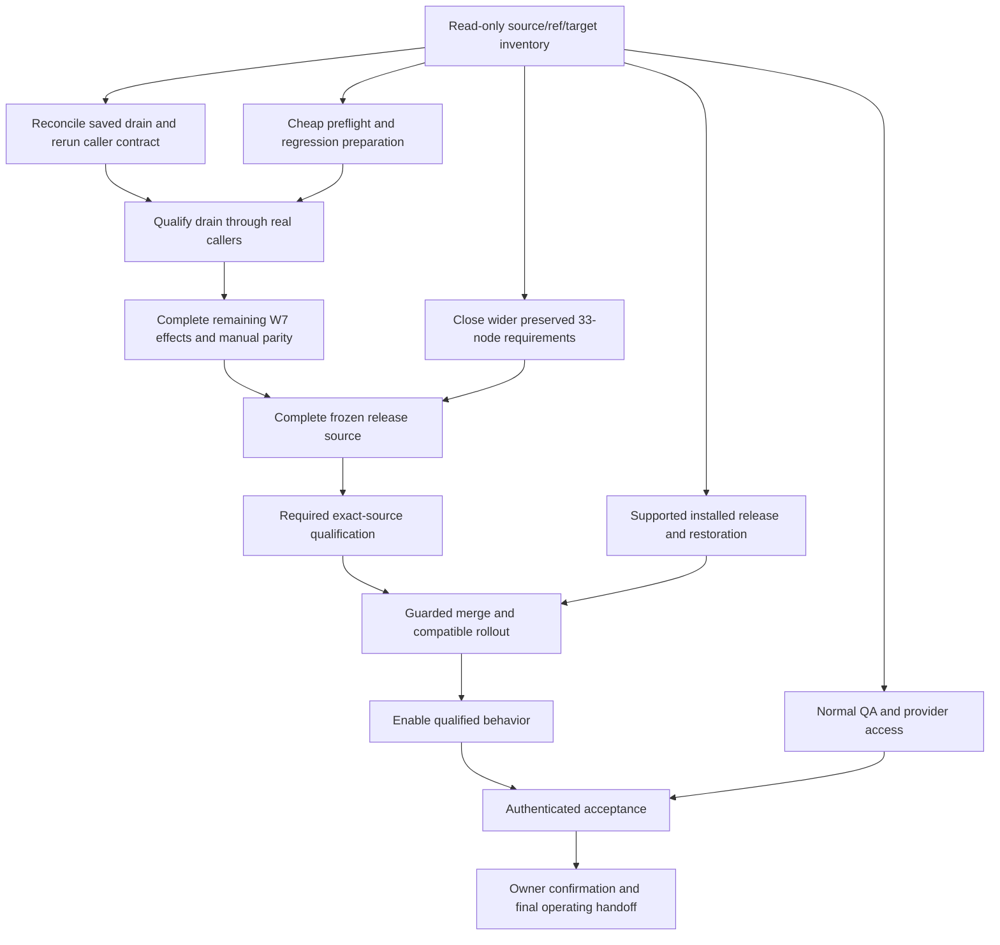

# Ship Verified System Workflow Outcomes

[Handoff](Ship-Verified-SupraOS-Agent-Workflows.md) · [Checklist](SupraOS-Workflow-Plan-Checklist.md) · [Dependency plan](Delivery-Path-Release-Plan.md) · [Evidence index](Evidence-Index.md) · [Canonical record](workflow-plan.json) · [Repository instructions](AGENTS.md)

Delivery strategy revision: **2026-10-06T03:25:18Z**. Canonical record SHA-256: `077607031a1fd1658cd3ad2342bbedfd66b1ba515a029f7a1a2e5d35c176e794`.

**Execution state:** RESUMED 2026-10-06 02:17Z (owner: "resume end to end"); lanes running. W7 (candidate `ac48190955`, PR #6196) and all 14 stabilisation PRs are MERGED, DEPLOYED and ACTIVATED; production code is main `0d25a537b4` (#6225 merged 03:21Z, not yet live at 03:22Z). W7 verified live: 3 of 3 behaviours observed on production — A (critical-failure drain) PASS 03:01Z 2026-10-06 WITH A FINALISATION GAP (the plan never finalises; fix packet `20261006020000` in progress), B PASS 17:36Z 2026-10-05, C PASS 06:35Z 2026-10-05. The milestone is still NOT accepted: the gap is open and the remaining W7 scope (effects/manual parity, active cancellation, real L1 anchoring, F2 recovery, runtime role) is unchanged. The three scheduled approval switches were turned on 03:09Z 2026-10-06 after a build-box rehearsal (X5 activated, not accepted). The runtime role (R3B) is NO-GO today. Five follow-up PRs are open and reviewed (#6226 #6227 #6229 #6230 #6233), merge order after #6225. PR states re-read from GitHub at 2026-10-06 03:22Z (#6225 MERGED 03:21:38Z → main `4c9208fc5f`; #6226 #6227 #6229 #6230 #6233 OPEN); `https://supraos.ai/api/version` re-read anonymously at 2026-10-06 03:22:03Z reports `0d25a537b4` (#6225 not yet live at that read). Live-test, switch, rehearsal and runtime-role figures are as reported in the private handoff at 03:01–03:10Z and were NOT re-read for this record..

**Scope:** all 33 tasks, 16 behavior families and 12 supported surfaces remain required. W7 is an intermediate milestone. iMessage is deferred; WhatsApp is excluded.

**Current delivery checkpoint:** **LIVE TEST A OBSERVED — W7 is 3 of 3 observed live, with a finalisation gap; NOT accepted.** Production code is main `0d25a537b4` (W7 #6196 + 14 stabilisation PRs). **A PASS with a finalisation gap** (2026-10-06 03:01Z, production, signed-in owner; project `bacf0dc8` "W7 drain test", born after #6198 so it carries a critical path of task-1 → task-2). Method: a temporary House Rule "always ask above $0.001" on all 35 active agents (set through the House Rules screen, removed afterwards; 0 left in the database) refused task-1 before dispatch — a pre-dispatch gate, not a real model failure. task-1 failed twice (two different agents); attempt 3 went to a shared-computer agent that BYPASSES the House Rules gate, ran ~4 minutes and ended `outcome_unknown`/blocked; the owner used Resolve → Retry (#6221, live); attempt 4 failed; retries reached 3; the `critical_failure_drain` and `critical_escalation` effects were delivered; task-2 was `skipped` with drain reason `critical_failure_unstarted`; the plan was never completed. **Gap (live):** the plan stays `running` for ever — the terminal-blocked rule (packet `20261005230000`, `mc_drain_terminal_blocked_v1`) still counts the settled unknown-outcome receipt after the owner resolved it; the coordinator skips draining plans, execute refuses, so nothing finalises; the same rule blocks Re-execute (active claim). Fix in progress: packet `20261006020000` on branch `claude/w7-owner-resolution-unblocks-20261006` plus a sanctioned finaliser; no PR yet. Evidence: private evidence lane, `live/acceptance/A-critical-drain-PASS-with-gap.md`. **B PASS** (2026-10-05 17:36Z — project `43470d88`: Re-execute → reload (lost reply) → "Check re-execution" → original run recovered, exactly 1 rerun receipt, no duplicate). **C PASS** (2026-10-05 06:35Z — Re-execute on a pre-release plan refused, nothing created; after #6207 it offers Duplicate / Adopt). Findings from live test A (2026-10-06): (1) shared-computer agents bypass House Rules (the pre-dispatch gate does not apply to them); (2) a skipped task renders as "planned" on the project screen — no drain wording; (3) an owner Stop on an unstarted critical task wedges the plan (retries 0 → 1, the task cannot fail again; design-lane finding). **Approval switches:** 2026-10-06 03:09:23Z: the three approval switches (`WORKFLOW_SCHEDULED_TERMINAL_APPROVAL_CUTOVER`, `WORKFLOW_SCHEDULED_APPROVAL_CONTINUATION_CUTOVER`, `WORKFLOW_SCHEDULED_OWNER_STATUS_READ`) were set to on in the production settings store and applied on the web host under the deploy lock (owner decision 02:25Z); both containers show all four scheduler switches on. Build-box rehearsal before the flip: GO — 13/13 + 78/78 + 7/7 contract cases, 29/29 packets, 7/7 two-tick drive (verdict file in the private evidence lane, `live/verify/scheduled-approval-switches-verdict.md`). Known limit: approvals already pending from BEFORE the flip stay held — the engine stamps the occurrence id only when the switch was on at run start — so their only exit is the workflow page "Release this run" control after 30 minutes. **Runtime role:** 2026-10-06 ~03:00Z rehearsal verdict: **NO-GO today** (private evidence lane, `live/verify/runtime-role-verdict.md`). The role packet refuses on the production shape (an existing `vms_agent_run_shelf` table; on PostgreSQL 16+ the implicit ADMIN membership of the postgres account cannot be revoked); a code blocker in the runtime binding (`lib/owner-db-runtime-binding.ts` membership test) would make every owner-database call fail with the switch on; one `FOR SHARE` read in `lib/vms-config.ts` needs UPDATE privilege. A renumbered packet (`20261006120000`) is prepared on branch `claude/runtime-role-packet-20261006` @ `7c72542d29`, no PR. Needs first: a product PR for the binding and the read, an owner-created runtime credential, and re-mapping of the orphan owner schemas. Open PRs (all independently reviewed safe; merges held by the Agent Run session until its audit-fix #6225 landed — #6225 MERGED 2026-10-06 03:21:38Z → main `4c9208fc5f`; merge order after it): [#6226](https://github.com/jtobkin/suprafx-platform/pull/6226) grants: approved cards clear, chosen duration survives a reload, one card per request; [#6227](https://github.com/jtobkin/suprafx-platform/pull/6227) planner works on a phone + design for re-executing after an unknown outcome; [#6229](https://github.com/jtobkin/suprafx-platform/pull/6229) archived projects cannot run, counts and lists exclude them, no 0-task projects (review PASS); [#6230](https://github.com/jtobkin/suprafx-platform/pull/6230) production-shape end-to-end harness S1–S13 (review PASS; do NOT enable the box-ci step yet); [#6233](https://github.com/jtobkin/suprafx-platform/pull/6233) a task every agent has failed no longer waits for ever; a held task alerts the owner. **Next:** land packet `20261006020000` + finaliser (closes the gap, re-run A to prove the plan ends `failed`); merge the five open PRs after #6225 in review order; then the remaining W7 scope. PR states re-read from GitHub at 2026-10-06 03:22Z (#6225 MERGED 03:21:38Z → main `4c9208fc5f`; #6226 #6227 #6229 #6230 #6233 OPEN); `https://supraos.ai/api/version` re-read anonymously at 2026-10-06 03:22:03Z reports `0d25a537b4` (#6225 not yet live at that read). Live-test, switch, rehearsal and runtime-role figures are as reported in the private handoff at 03:01–03:10Z and were NOT re-read for this record.

**Current candidate record:** `ac4819095585eed003eb0c510b0a8c8608d5e73f`, tree `49bf08e3354a115783635eebfa4801dfa953bb6c`. Security: box-ci/security-gates SUCCESS on ac48190955 (51 steps; macOS Native Land not run). Previous head 3214f4849e: FAILURE (whole unit tree 2 failed / 55,609 passed / 374 skipped across 4,508 files; scoped changed-file TypeScript check 5 errors); build: box-ci/production-build SUCCESS on ac48190955 (7 steps). Previous head 3214f4849e: ERROR (not built because security gates failed); macOS Native Land: Not run (not part of box-ci). Merged: True; deployed: True; activated: True; verified live: yes — 3 of 3 behaviours observed on production (A 03:01Z 2026-10-06 with a finalisation gap, fix in progress; B and C 2026-10-05); milestone NOT accepted. Scope: Composed W7 failure-drain/rerun candidate (partial W7; full scope open). Frozen candidate ac48190955 = 3214f4849e + fix commit 867a5f2114 + clean merge of origin/main 7a10b7a3fc; required CI GREEN and independent trailing audit PASS 5/5 at that commit. Squash-merged 2026-10-05 06:11:22Z as main 55a12f0da9 (PR #6196); installed 06:03–06:10Z; deployed 06:24:35Z; activated. Stabilisation (same day, 12:59–22:23Z): 14 PRs merged via merge-if-green.sh with an independent review each; five extra packets installed (ledger 743); live = main 0d25a537b4. Verified live: 3 of 3 behaviours observed (A, the critical-failure drain, PASS 03:01Z 2026-10-06 but the plan never finalises — gap, fix packet `20261006020000` in progress; B PASS 17:36Z, C PASS 06:35Z 2026-10-05); the milestone is NOT accepted. The once-only scheduler switch is ON (since 07:57Z 2026-10-05); its three approval siblings were turned ON 03:09Z 2026-10-06 after a build-box rehearsal (owner decision 02:25Z).. Observed: 2026-10-06T03:25:18Z. Update this canonical candidate record after changes; never infer status from historical receipts.

**Dated recovery baseline:** strict E3 was RED with 6,540 blockers at the prior closeout. These observations are not permission to skip fresh release checks.

Private portable evidence: `04795ddf0c18af8d40960ea29993fbf93535f5de` (2,291 restored files / 957 objects / 1,036 remotely verified transport files). Archive predates final CI; retain its original state. Baseline public handoff: `84f9f20b9fdfd33762b7e881da40980ed57349d4`. Historical documents are preserved under [history](history/20261005-before-delivery-rewrite/); historical statuses are not current authority.


## Status 2026-10-06 ~03:25Z — live test A observed (3 of 3) with a finalisation gap; approval switches ON; runtime role NO-GO (read this first)

The run resumed at 02:17Z 2026-10-06 (owner: "resume end to end"). PR states re-read from GitHub at 2026-10-06 03:22Z (#6225 MERGED 03:21:38Z → main `4c9208fc5f`; #6226 #6227 #6229 #6230 #6233 OPEN); `https://supraos.ai/api/version` re-read anonymously at 2026-10-06 03:22:03Z reports `0d25a537b4` (#6225 not yet live at that read). Live-test, switch, rehearsal and runtime-role figures are as reported in the private handoff at 03:01–03:10Z and were NOT re-read for this record.

**Where W7 stands.** Implemented, integrated, tested, independently reviewed, merged, deployed and activated — **yes**. **Observed live — 3 of 3 behaviours**, but A was observed **with a finalisation gap**, so the milestone is **NOT accepted**.

| Stage | State now |
| --- | --- |
| Implemented | Yes — the drain/rerun milestone plus fixes for all eight faults of 2026-10-05; gap fix (packet `20261006020000` + finaliser) in progress, not merged |
| Integrated | Yes — 15 PRs on main; five follow-up PRs open (#6226 #6227 #6229 #6230 #6233) |
| Tested | Yes per PR; approval-switch rehearsal on the build box GO (13/13 + 78/78 + 7/7 contract, 29/29 packets, 7/7 two-tick drive) |
| Independently reviewed | Yes — each merged PR; the five open PRs are reviewed safe |
| Merged | Yes — last W7 merge #6221, main `0d25a537b4`; #6225 (audit fix, other session) merged 03:21Z → `4c9208fc5f` |
| Deployed | Yes — `/api/version` reports `0d25a537b4` at 03:22Z |
| Activated | Yes — no feature flag; critical path on for new projects; all four scheduler switches ON (approval siblings since 03:09:23Z) |
| Verified live | **3 of 3 OBSERVED; NOT accepted.** A PASS with gap 03:01Z 2026-10-06; B PASS 17:36Z, C PASS 06:35Z 2026-10-05 |

**Live acceptance A.** **A PASS with a finalisation gap** (2026-10-06 03:01Z, production, signed-in owner; project `bacf0dc8` "W7 drain test", born after #6198 so it carries a critical path of task-1 → task-2). Method: a temporary House Rule "always ask above $0.001" on all 35 active agents (set through the House Rules screen, removed afterwards; 0 left in the database) refused task-1 before dispatch — a pre-dispatch gate, not a real model failure. task-1 failed twice (two different agents); attempt 3 went to a shared-computer agent that BYPASSES the House Rules gate, ran ~4 minutes and ended `outcome_unknown`/blocked; the owner used Resolve → Retry (#6221, live); attempt 4 failed; retries reached 3; the `critical_failure_drain` and `critical_escalation` effects were delivered; task-2 was `skipped` with drain reason `critical_failure_unstarted`; the plan was never completed. **Gap (live):** the plan stays `running` for ever — the terminal-blocked rule (packet `20261005230000`, `mc_drain_terminal_blocked_v1`) still counts the settled unknown-outcome receipt after the owner resolved it; the coordinator skips draining plans, execute refuses, so nothing finalises; the same rule blocks Re-execute (active claim). Fix in progress: packet `20261006020000` on branch `claude/w7-owner-resolution-unblocks-20261006` plus a sanctioned finaliser; no PR yet. Evidence: private evidence lane, `live/acceptance/A-critical-drain-PASS-with-gap.md`.

**Findings.** Findings from live test A (2026-10-06): (1) shared-computer agents bypass House Rules (the pre-dispatch gate does not apply to them); (2) a skipped task renders as "planned" on the project screen — no drain wording; (3) an owner Stop on an unstarted critical task wedges the plan (retries 0 → 1, the task cannot fail again; design-lane finding).

**Scheduled approval switches (X5).** 2026-10-06 03:09:23Z: the three approval switches (`WORKFLOW_SCHEDULED_TERMINAL_APPROVAL_CUTOVER`, `WORKFLOW_SCHEDULED_APPROVAL_CONTINUATION_CUTOVER`, `WORKFLOW_SCHEDULED_OWNER_STATUS_READ`) were set to on in the production settings store and applied on the web host under the deploy lock (owner decision 02:25Z); both containers show all four scheduler switches on. Build-box rehearsal before the flip: GO — 13/13 + 78/78 + 7/7 contract cases, 29/29 packets, 7/7 two-tick drive (verdict file in the private evidence lane, `live/verify/scheduled-approval-switches-verdict.md`). Known limit: approvals already pending from BEFORE the flip stay held — the engine stamps the occurrence id only when the switch was on at run start — so their only exit is the workflow page "Release this run" control after 30 minutes.

**Runtime role (R3B).** 2026-10-06 ~03:00Z rehearsal verdict: **NO-GO today** (private evidence lane, `live/verify/runtime-role-verdict.md`). The role packet refuses on the production shape (an existing `vms_agent_run_shelf` table; on PostgreSQL 16+ the implicit ADMIN membership of the postgres account cannot be revoked); a code blocker in the runtime binding (`lib/owner-db-runtime-binding.ts` membership test) would make every owner-database call fail with the switch on; one `FOR SHARE` read in `lib/vms-config.ts` needs UPDATE privilege. A renumbered packet (`20261006120000`) is prepared on branch `claude/runtime-role-packet-20261006` @ `7c72542d29`, no PR. Needs first: a product PR for the binding and the read, an owner-created runtime credential, and re-mapping of the orphan owner schemas.

**Open PRs.** Open PRs (all independently reviewed safe; merges held by the Agent Run session until its audit-fix #6225 landed — #6225 MERGED 2026-10-06 03:21:38Z → main `4c9208fc5f`; merge order after it): [#6226](https://github.com/jtobkin/suprafx-platform/pull/6226) grants: approved cards clear, chosen duration survives a reload, one card per request; [#6227](https://github.com/jtobkin/suprafx-platform/pull/6227) planner works on a phone + design for re-executing after an unknown outcome; [#6229](https://github.com/jtobkin/suprafx-platform/pull/6229) archived projects cannot run, counts and lists exclude them, no 0-task projects (review PASS); [#6230](https://github.com/jtobkin/suprafx-platform/pull/6230) production-shape end-to-end harness S1–S13 (review PASS; do NOT enable the box-ci step yet); [#6233](https://github.com/jtobkin/suprafx-platform/pull/6233) a task every agent has failed no longer waits for ever; a held task alerts the owner.

**Lesson (EP11).** A live acceptance that needs a deterministic failure should use a pre-dispatch gate (a temporary House Rule) rather than real model failures; remove it afterwards and prove it is gone.

**What is left (priority order).**

1. **Close the finalisation gap** — packet `20261006020000` + a sanctioned finaliser; then re-run A on a fresh project and prove the plan ends `failed` and Re-execute is no longer blocked.
2. **Merge the five open PRs** after #6225, in review order; keep the end-to-end harness box-ci step proposed, not enabled.
3. **Fix the three findings** (shared-computer House Rules bypass; "planned" wording for a skipped task; owner Stop wedging an unstarted critical task).
4. **Scheduled approval acceptance** — drive one real human-approval step on production end-to-end; add approval scenarios to the harness.
5. **Runtime role** — product PR for the binding and the read, owner-created credential, orphan-schema re-mapping, then rehearse `20261006120000`.
6. **Remaining W7 scope** (unchanged): effects/manual parity, active cancellation, real L1 anchoring, F2 recovery, Stripe Link (owner), QA invite. Full project: 33 tasks, 16 behaviour families, 12 surfaces; iMessage deferred, WhatsApp excluded.
7. **Cleanup** — production pre-install backup and tool folder; merged lane folders (owner rule); build-box scratch.

Owner decisions answered 2026-10-06 02:25Z: turn on the three scheduled approval switches after qualification — done 03:09Z; install the runtime role after rehearsal — rehearsal said NO-GO, install not done.

## Status 2026-10-06 ~01:55Z — stabilisation COMPLETE; W7 live but NOT verified (2 of 3) — superseded by the 03:25Z section above

The sections below this one describe the earlier pauses (~08:55Z and ~02:04Z on 2026-10-05) and are kept as dated history. This section was the state at 01:55Z; the section above is current. PR states and merge commits re-read from GitHub at 2026-10-06 ~02:00Z; `https://supraos.ai/api/version` re-read anonymously at 2026-10-06 01:59:48Z reports `0d25a537b4` (= main). Ledger, switch and health figures are as reported in the private handoff at 01:55Z and were NOT re-read for this record.

**Where W7 stands.** Implemented, integrated, tested, independently reviewed, merged, deployed and activated — **yes**. **Verified live — NO: 2 of 3.** The milestone is **not complete**.

| Stage | State now |
| --- | --- |
| Implemented | Yes — the drain/rerun milestone plus fixes for all eight faults found on 2026-10-05 |
| Integrated | Yes — 15 PRs on main; end-to-end harness branch not yet (no PR) |
| Tested | Yes per PR — required box-ci checks green at each merge; five extra packets applied and verified on production |
| Independently reviewed | Yes — an independent review for each PR before merge |
| Merged | Yes — last merge #6221, main `0d25a537b4`, 22:23Z 2026-10-05 |
| Deployed | Yes — `/api/version` reports `0d25a537b4` |
| Activated | Yes — no feature flag; critical path on for new projects; once-only scheduler switch ON |
| Verified live | **NO — 2 of 3.** B PASS 17:36Z, C PASS 06:35Z (2026-10-05); A not run |

**Live acceptance.** Live acceptance on production, signed-in owner: **C PASS** (2026-10-05 06:35Z — Re-execute on a pre-release plan refused, nothing created; after #6207 it now offers Duplicate / Adopt). **B PASS** (2026-10-05 17:36Z — project `43470d88` "W7 live test": Re-execute → reload (lost reply) → "Check re-execution" → original run recovered, exactly 1 rerun receipt, no duplicate). **A NOT RUN** (critical-failure drain): needs a project created after #6198 whose critical task fails 3 times with an unstarted sibling; there is no deterministic way from the screen because per-task Stop is now final (no retry). Options: wait for a natural triple failure, or add a test-only owner action. Proof rows expected: a `critical_failure_drain` effect delivered; the sibling `skipped` with drain reason `critical_failure_unstarted`; the plan `failed`, never `completed`.

**Every PR merged in this run** (each independently reviewed, merged with `scripts/ci/box-ci/merge-if-green.sh`; states and commits re-read from GitHub 2026-10-06 ~02:00Z):

| PR | What it does | Merged (2026-10-05, UTC) | main commit |
| --- | --- | --- | --- |
| #6196 | W7 release: squash of the composed failure-drain/rerun candidate `ac48190955` | 06:11Z | `55a12f0da9` |
| #6199 | the final task of a plan settles again (finish intents now carry the task id) + packet `20261005232000` | 12:59Z | `c1513db29c` |
| #6197 | schema snapshot refresh; coordinator sweep skips drain-refused plans; manifest re-pin | 13:15Z | `7b28f6a41a` |
| #6198 | Mission Control plans get a critical path, so the drain can fire (owner said yes) | 13:15Z | `ec1e1132fe` |
| #6206 | workflow grants can last 1 hour / 24 hours / 1 week / 1 month / 1 year; one card per workflow + action | 17:43Z | `2e242177b3` |
| #6205 | safe Delete project (refuse or archive instead of orphaning a running plan); one bad plan no longer aborts the coordinator tick | 17:46Z | `aeebec0da0` |
| #6211 | planner: no 0-task launch; review panel follows the selected plan; long chat scrolls | 18:42Z | `38ef1efa84` |
| #6219 | grants: a `workflow:<id>` agent no longer crashes the default-permission lookup (regression from Agent Run #6168) | 19:07Z | `3f18ef481c` |
| #6213 | test and source record for packet `20261005239000` (the packet was already live) | 19:08Z | `0622e4ea36` |
| #6212 | scheduled workflows: stalls after restart / lost reply / Run-now / cancel fixed; for-each and delete fixed; pause banner + Release; packet `20261005235000` | 19:56Z | `2df2d3b0cc` |
| #6220 | an alert for an owner without Telegram is skipped and the run completes; coded errors with logged causes | 20:35Z | `9ab57850bd` |
| #6222 | a failed task retries with a different agent (the preferred agent no longer overrides the failed-agents list) | 21:06Z | `c7e4e9b150` |
| #6207 | older projects: Duplicate and Adopt (packet `20261006000700`) + plain-English refusal wording | 21:18Z | `9dcef69a69` |
| #6223 | alerts for owners not yet admitted (invite-required) no longer fail | 21:55Z | `e0d776651c` |
| #6221 | owner controls: resolve an unknown outcome, per-task Stop is final, review / outputs / settings work or say why (packet `20261006010000`) | 22:23Z | `0d25a537b4` |

**Production database.** Ledger **743**: the 24 W7 packets (06:03–06:10Z 2026-10-05) plus five extra packets from this run, all "APPLIED AND VERIFIED" via `scripts/apply-migration.mjs`. The Agent Run session installed 19 of its own. One packet from another session (`20261002050000_signals_pattern_ids_like`) is not installed by anyone (fails safe).

| Packet | Installed (UTC) |
| --- | --- |
| `20261005232000_mc_rerun_unsent_anchor_hold` | 2026-10-05 09:00Z |
| `20261005239000_mc_rerun_unadmitted_effect_hold` | 2026-10-05 14:41Z |
| `20261005235000_scheduled_occurrence_recovery` | 2026-10-05 19:55Z |
| `20261006000700_mc_legacy_plan_adoption` | 2026-10-05 21:17Z |
| `20261006010000_mc_unknown_task_owner_resolution` | 2026-10-05 22:22Z |

**Scheduler.** The once-only scheduler switch (`WORKFLOW_SCHEDULED_OCCURRENCE_CUTOVER`) is ON in the production settings store, applied on the web host under its deploy lock. Its three approval siblings are still unset, so human-approval steps in scheduled workflows stay unsupported (owner decision).

**Health.** Health in the hour before 01:55Z on 2026-10-06 (reported, not re-read here): 167 scheduled runs completed, 34 failed; 0 duplicate slots; 0 stalled occurrences; 0 Mission Control plans running. The remaining failures are owners' own model keys (30 × "No usable API key for anthropic", 2 × credit balance), not platform faults.

**Two production incidents found and fixed during the run.**

(1) **Scheduled workflows paused 06:24–07:57Z on 2026-10-05.** The W7 release carried a once-only scheduler that holds all due work while its switch (`WORKFLOW_SCHEDULED_OCCURRENCE_CUTOVER`) is unset; it was unset in production, so all 534 scheduled workflows stopped for 93 minutes. The deploy-safety review missed it because it checked only the Mission Control files for new switches, not the whole diff. Fixed by the owner turning the switch on at 07:57Z (missed runs not re-run); remaining scheduler stalls fixed by #6212.

(2) **Telegram "Liq Warning" alerts failing from 13:15Z to ~22:08Z on 2026-10-05.** A regression from the Agent Run release (#6168): first the permission lookup crashed on workflow-style agent ids, then alerts for owners not yet admitted failed when their settings were read. A catch-all error code hid both causes. Fixed by #6219, #6220 and #6223; 0 alert failures in the 15 minutes after the last fix.

**What is left (priority order).**

1. **Live acceptance A** — the critical-failure drain (above).
2. **End-to-end harness PR.** Open the PR for the production-shape end-to-end harness, branch `claude/w7-prod-shape-e2e-20261005` @ `080907ff6b` (scenarios S1–S9, `scripts/qa/w7-prod-shape-e2e/`, `run.sh`, runs on the build box; no PR yet, verified 02:00Z): merge main first, add a scenario for every fault found on 2026-10-05, and propose (do not enable) it as a required pre-release check.
3. **Follow-ups found in review** (not blockers):
- A task that EVERY agent has failed stays `ready` forever (owners with a single agent) — needs skip or escalate.
- An archived project with an approved or paused plan can still be executed by direct link (the execute route ignores the archive flag).
- "Active projects" count includes archived projects.
- A held task re-queues forever with no owner alert (coordinator).
- Grants picker resets to 1 hour after reloading a half-saved approval; the approved card stays and the count does not change.
- Creating a project accepts empty workflow steps (no server-side 0-task guard).
- Voice-capture planning can return a 0-task plan.
- Planner chat box is squashed at 390 px wide once a plan appears.
- Re-execute after an unknown outcome is still refused (the plan finishes or stops but cannot be re-run).
- Two concurrent runs can create two grant cards.
- A Telegram kill-switch-locked owner with no chat id is now skipped (confirm intended).
4. **Owner decisions still open:**
1. The three sibling scheduler switches (`WORKFLOW_SCHEDULED_TERMINAL_APPROVAL_CUTOVER`, `WORKFLOW_SCHEDULED_APPROVAL_CONTINUATION_CUTOVER`, `WORKFLOW_SCHEDULED_OWNER_STATUS_READ`) are still unset, so human-approval steps in scheduled workflows stay unsupported. Turn them on, or keep approval steps unsupported?
2. Should "Telegram not set up" ever fail a run? (Now: the alert is skipped and the run completes.)
3. The `supra_owner_runtime` role (5 owner schemas are not mapped).
5. **Remaining W7 scope: remaining effects and manual parity; safe active cancellation; real L1 anchoring (anchors always end `held_unknown`; the capability is unverified); F2 rerun-init pending/unknown recovery (design note `docs/agent-run/mc-rerun-init-recovery-design.md`); the runtime role; Stripe Link (owner, external); QA invite. Full project: 33 tasks, 16 behaviour families, 12 surfaces; iMessage deferred, WhatsApp excluded.**
6. **Cleanup: remove the pre-install production backup (5.4 GB, counts matched, never restore-tested) and its tool folder from the web host; delete merged lane folders (owner rule: `git worktree remove`, no --force, clean and idle, own lanes only; keep the end-to-end harness lane until its PR merges); remove leftover file-only scratch folders from this run on the build box.**

Owner decisions answered during the run: critical path for Mission Control plans — yes (#6198); grants — longer durations up to 1 year (#6206); pre-release projects — Duplicate and Adopt (#6207); owner controls — resolve an unknown outcome, per-task Stop is final (#6221).

**Where the code and evidence are.** Product repo: private `jtobkin/suprafx-platform`, branch `main` — everything above is in it. Key code: `lib/vms/workflows/` (plan-orchestrator.ts, mc-*-effect.ts, mc-plan-finish-intents.ts, mc-rerun-request.ts, mc-owner-manual-action.ts, execution-engine.ts, workflow-telegram-notice.ts, scheduled-*.ts); `app/api/projects/**` (create, execute, rerun, duplicate, adopt, resolve, tasks/[taskId]/stop); `app/api/cron/mc-coordinator/route.ts`; `app/api/cron/workflow-triggers/route.ts`; `app/vms/mission-control/**`; `components/vms/workflow/ScheduleHoldBanner.tsx`; `lib/vms/agent-grants.ts`; `lib/db-as-owner.ts`; `supabase/migrations/2026100*`. Docs in the product repo: `docs/agent-run/RELEASE-W7-*.md`, `docs/agent-run/mc-rerun-request-recovery.md`, `docs/agent-run/mc-rerun-init-recovery-design.md` (F2), `docs/agent-run/scheduled-workflow-cutover-checklist-20261001.md`. Evidence (private): branch `docs/w7-resume-evidence-20261005` @ `9ec3ab950d` (pushed 2026-10-06 01:59Z: production install logs for the five extra packets, live test B PASS, rerun-effects proof, delete / grants / planner / legacy-rerun screenshots; earlier commit `b11636b366` has the W7 install log, live-controls audit, end-to-end results and scheduler flag-on verdict), folder `docs/agent-run/evidence/w7-resume-20261005/`. End-to-end harness: branch `claude/w7-prod-shape-e2e-20261005` @ `080907ff6b` (no PR). Public plan: this repository (`workflow-plan.json` → `python3 scripts/render_plan.py`).

**Release rules learned (EP11).** Grep the WHOLE diff for new environment reads and know each one's unset behaviour in production; compare background-job rates before and after each deploy; drive the real server path on a real database with production-shaped data, including the last step of each flow; a catch-all error code must log the underlying cause; packets editing the same function must be versioned above the newest packet that pins that function.

### Resume prompt for the next session (sanitised)

This is the prompt to paste into a new session. It is sanitised for this public repository: database connection strings, host addresses, settings-store paths and full identifiers are removed or shortened. The unsanitised prompt is `PROMPT-2026-10-06-resume-w7-after-stabilization.md` in the owner's private memory repo.

Resume the SupraOS Agent Workflows project (W7: Mission Control critical-failure drain with safe rerun recovery) on this computer. W7 is merged, installed and live, and the stabilisation fixes are all merged. Ground yourself in evidence before changing anything. Treat this as authorization for implementation, testing, production migrations from committed files, and merge/deploy through the supported path when all checks pass ("automerge and automigrate as needed"). Do not bypass permissions, approvals, release gates or resource limits; if a tool call is denied, give the owner the exact command to run and continue with other work. Use several parallel agents with exclusive files, and an independent reviewer for every PR before merge. Answer in plain English, under 50 words, bullets, ending with a TLDR line.

1. Read first: the owner's private memory repo → its index → the W7 stabilisation handoff of 2026-10-06 (state, every PR, where all code and evidence lives, what is left, traps). If memory is unreachable: this public plan (`Ship-Verified-SupraOS-Agent-Workflows.md`, this status section). Product repo: private `jtobkin/suprafx-platform` — `AGENTS.md` → `CONTEXT.md` → `docs/AI_BUILD_PROTOCOL.md` → `docs/runbooks/db-migrations.md`. Merge ONLY with `scripts/ci/box-ci/merge-if-green.sh <pr>`; never a full local production build.
2. Re-verify (read-only): `curl -s https://supraos.ai/api/version` (expect main ≥ `0d25a537b4`); `git log --oneline -5 origin/main`; production ledger count (743 at handoff) and the five extra packets (`20261005232000`, `20261005239000`, `20261005235000`, `20261006000700`, `20261006010000`) present; scheduled-workflow health — failures in the last hour by error, 0 duplicate slots (`select workflow_id, slot_key, count(*) from vms_scheduled_workflow_occurrences group by 1,2 having count(*)>1`), stalled occurrences older than 45 minutes; open PRs from branches `claude/w7-*`. Production database access needs the owner database connection setting from the approved local environment file (TLS required); never paste it anywhere.
3. Work, in parallel lanes:
   a. Update this public plan repo (record `workflow-plan.json`, serialise with `json.dumps(d, indent=1, ensure_ascii=False)+"\n"`, `python3 scripts/render_plan.py` then `--check`, secret scan, push, verify raw sha256 + anonymous 200) after each milestone. Sanitise (no addresses, database URLs, host addresses or settings-store paths).
   b. (Done 2026-10-06 01:59Z: the local-only evidence was committed to the private evidence branch `docs/w7-resume-evidence-20261005` @ `9ec3ab950d`.)
   c. Live acceptance A (drain) on production — design the least-risk way to make a critical task fail 3 times with an unstarted sibling on a project created after #6198, run it, prove the rows (drain effect delivered; sibling skipped with reason `critical_failure_unstarted`; plan failed, never completed), screenshot or text evidence.
   d. Open the PR for the end-to-end harness branch `claude/w7-prod-shape-e2e-20261005` (merge main first), add scenarios for every fault found on 2026-10-05, propose (do not enable) a box-ci step.
   e. Follow-ups, highest user impact first: a task every agent failed stays ready forever; an archived project is still executable by direct link; a held task re-queues forever with no alert; server-side 0-task guard.
4. Ask the owner once, then keep working: the three sibling scheduler switches (approval steps in scheduled workflows); the `supra_owner_runtime` role.
5. After each milestone: update the memory handoff (one-line index pointer) and this public plan. Delete merged lane folders you own (`git worktree remove`, no --force).

## Current pause handoff — start here on a new computer

**Read order:** this pause checkpoint → [full checklist](SupraOS-Workflow-Plan-Checklist.md) → [dependency plan](Delivery-Path-Release-Plan.md) → private evidence README → product `AGENTS.md`, `CONTEXT.md`, build protocol and architecture. Public `workflow-plan.json` is the current status authority. Older documents, worktree paths and test counts are dated evidence, not instructions to repeat completed work.

### What this session is trying to deliver

Deliver SupraOS workflows and project execution that use the right owner's context and permissions, preserve original operation identity across retries and recovery, and report truthful results across all supported entry points. The immediate useful milestone is **failure drain with safe rerun recovery**: when a critical task fails, unstarted work can stop safely, active or uncertain work stays accounted for, terminal effects wait for truthful closure, and retrying a lost rerun response recovers the original operation rather than creating another run. This is a partial W7 milestone. All 33 task contracts, 16 behavior families and 12 supported surfaces still define full completion.

### Exact saved source and ownership

All three branches below live in **private `jtobkin/suprafx-platform`**, share the `ad2ee680464217fd1b00883bf7ea9fc917ed3140` baseline and were pushed and read back at pause. No branch was merged, deployed or activated. They must be reconciled into one coherent candidate; do not deploy one independently or assume a passing baseline gate covers a successor.

| Lane / previous owner | GitHub branch | Exact saved commit | State |
| --- | --- | --- | --- |
| Server/SQL failure drain — `/root/catalog_blocker` | `fix/w7-critical-failure-drain-20261005` | `48751b50252cb66555d0b427a47930d1bc68adb9` | Two committed changes; final tree `f4b577e5665be167e594662155afa9c99e4d6214`; final native contract unrun |
| Client integration — `/root` | `fix/w7-rerun-request-binding-20261005` | `2dc7e3809278e071b9183cdbe53062d88e297b7d` | Seven committed files; tree `72234a6a142f559ef37fe67124fece2a5508cf58`; scoped mounted browser evidence |
| Runtime prerequisite — `/root/native_closeout` | `codex/w7-runtime-binding-refresh-20261005` | `82b010441ad1a82e66368585f7ddd68d5cfc9103` | Eleven committed files; actual helper/bridge private native proof; target role installation pending |

`/root/closeout_audit` independently checked evidence and mounted browser behavior. Agent names describe previous ownership only: assign fresh available owners before resuming. Local lane folders remain under `/Users/joshuatobkin/qa-lanes/` with the same names as their purpose; all are unmerged and retained. The shared `/Users/joshuatobkin/suprafx-platform` checkout contains unrelated staged work; do not reset, clean, or use it as an integration scratch directory.

### What changed in the paused run

1. **Server/SQL failure drain:** strict all-terminal closure; SQL-positive initial task birth provenance; safe drain of positively unstarted siblings; preservation of original active-result/manual replay; closing-claim parent authorship; atomic action-bound rerun and once-only initialization; run-bound execution admission; deferred receipt-bound run replacement; forward/VERIFY/guarded rollback packets. Unknown original admissions remain immutable and legacy/no-provenance tasks stay held. Active cancellation is still incomplete.
2. **Actual callers:** project execution, workspace execution/manual actions, coordinator recovery and initialization use the revised drain/rerun boundary. The server, new SQL and client request contract must be qualified together. Pre-save department-share and assignment-log effects during initialization can remain uncertain on interruption; durable unknown blocks retry/provider admission. This is an explicit remaining boundary, not an all-effects atomicity claim.
3. **Mounted rerun recovery:** persist a wallet/project-scoped action before POST; reuse its original plan/run/version after reload or lost acknowledgment; refuse dispatch if persistence is unavailable/corrupt; prevent duplicate click/automatic execution; retain unknown responses; clear only the matching authoritative response; execute only a ready current original run. Wallet/project navigation clears stale local UI state. Recovery remains accessible when timeline data is missing, and mobile controls no longer overlap.
4. **Runtime binding:** restored and integrated the saved owner-runtime identity design into the real owner database helper and coordination bridge. Configuration changes across awaited BEGIN/identity/role setup and pre-COMMIT are refused. This source does not install the runtime database role or prove hosted pooler compatibility.
5. **Release feasibility:** independently reviewed read-only target censuses distinguish missing installed W7 schema/role from existing dependencies. A concrete role reconciliation plan reuses saved B0 SQL and names the missing caller bindings and ACL/policy proof. Release operator evidence producers still need integration.

### Evidence: what passed and what did not

| Capability | Evidence retained | Boundary still open |
| --- | --- | --- |
| Failure drain and atomic rerun source | 92 caller tests / seven files and 58-file scoped types before final small hardening; independent four-file 66-test run on final `48751b50`; final pinned G11 over both commits PASS | Complete final SQL/source review, source-bound native bundle, all 26 ordered native cases, later-trigger coinstallation, rollback/reapply and actual combined execution have NOT run |
| Catalog / schema preflight | 34 catalog tests before the final three hazard entries; add-only catalog command's built-in reconciliation PASS; final catalog 2,656 writers / 5,181 hazards; earlier schema/migration checks PASS | Last standalone scanner RED preserved; final standalone rerun not started at pause. Strict E3 remains unresolved: last printed readiness RED 6,568 before three additions. This is not a current clean E3 result |
| Mounted rerun client | 12 helper tests; earlier 46-test/four-file regression and 19-file types; independent real Linux Chromium at 390/1440: prior 32-case base, eight affected navigation/storage repairs, final six recovery/layout cases PASS with screenshots inspected | Test sets cover different source revisions; do not add them into one exact-candidate pass count. Final UI type/regression gate after the last CSS/button patch and combined release/browser/live gates remain open |
| Runtime identity helper and bridge | 47 focused tests, 28 bridge tests, 23-file types; independent source review; exact `82b01044` actual helper/bridge private PostgreSQL v2: all 19 cases PASS, including configuration drift and withheld committed acknowledgment | Private schema/admission fixtures and cached pinned dependencies; not hosted role/ACL/pooler, production, exact lockfile installation or final combined gate proof |
| Read-only installed target | Two separately reviewed repeatable-read snapshots: selected W7 36 functions / eight tables / 15 migration entries absent; runtime role absent; 11 dependency relations present; selected 12 B0 tables and five function bodies compatible | Selected metadata only; not complete schema/ACL/default privileges, a shared snapshot, backup/restore, writer exclusion or live acceptance |

Preserve failures: mounted-browser v3 stale wallet modal RED; mobile overlap screenshots; runtime native v1 HBA setup rejection before product assertions; initial source/fixture/catalog REDs; native caller bundle refusal for ignored generated indexes; G11 wrapper's network download failure. Repairs and later passes do not erase those records. Runtime v1's owned scratch was deliberately retained with no owned Docker resources; v2 scratch/resources were removed and independently checked. Inventory proof is terminal observations, not continuous monitoring.

Key exact review hashes and relative paths are indexed in the private evidence packet. Examples: runtime final independent terminal `e10bcc25d94b1d80bf86addb69b8fe843a20a219b82cba6fbfc07ec9ad172d39`; UI final recovery/layout review `e6b6c8ffec9da521aeb0ecc183cb3623c0bdaeebdbac6104a3832885754ca456`; independent pause inventory `cc3edb2c387a97b13dd39dd0cad817a8b52335f2ca3b54fdbfb2e56b7972b9d7`. These are SHA-256 receipt hashes, not Git commits.

### Where the new code and evidence live

- Drain and finalization: `lib/vms/workflows/plan-orchestrator.ts`, `execution-plan.ts`, `mc-manual-transition.ts`, `mc-owner-manual-action.ts`, plus the actual project/workspace/coordinator route callers. Inspect `git diff ad2ee680...48751b50` for the full committed file list before assigning ownership.
- New authority SQL: `supabase/migrations/20261005230000_mc_critical_failure_drain{,_VERIFY,_ROLLBACK}.sql` and `20261005231000_mc_run_rerun_atomic{,_VERIFY,_ROLLBACK}.sql`. Forward, verifier and rollback files coexist: never install a glob as migration order.
- Native drain fixture: `tests/fixtures/mc-critical-failure-drain/`, including `build-native-callers.mjs` and 26-case ordered contract/oracle. Draft actual-caller bundle `native-callers-next.cjs`, SHA-256 `b63dfe4f3c8c4d1f9967b1a55d88c4c0c2f96807a49dce3c64bef1115b2938fa`, still needs a manifest bound to exact committed source blobs and independent review before dispatch.
- Client: `app/vms/mission-control/[projectId]/page.tsx`, `project.css`; `lib/vms/workflows/mc-rerun-request.ts`, `timeline-types.ts`, `timeline-assembler.ts`; `tests/unit/mc-rerun-request.test.ts`; `docs/agent-run/mc-rerun-request-recovery.md`.
- Runtime: `lib/db-as-owner.ts`, `lib/owner-db-runtime-binding.ts`, `lib/supraos-build/coordination-mcp-x1-bridge.ts`, relay coordination route and the committed bridge implementation/tests. `git show --stat 82b01044` gives the exact eleven-file map.
- Current local evidence: `/Users/joshuatobkin/qa-evidence/workflow-execution-20261005-0101/` has `run.json`, `progress.json`, `root/`, `release/`, `verification/`; `/Users/joshuatobkin/qa-evidence/workflow-plan-rewrite-20261005/implementation/failure-drain/` has source/fixture logs and `user-pause-handoff.md`. Local paths identify provenance, not a requirement to have this Mac.
- Private runtime closeout: `release/runtime-binding/native-terminal-summary-final.json`; `release/runtime-role-reconciliation-plan.md`; independent draft wrapper review `release/drain-rerun-wrapper-draft-independent-review.json`.
- Draft native runner: `verification/drain-rerun-native-v1/`. It is UNFROZEN, unbundled and unexecuted; placeholder refusal must remain. Existing budgets: 16 GiB memory/50 GiB storage floor, 2,400-second outer bound, owned scratch and one-use admission. Reuse and finish it rather than starting a new harness.

### First five tasks after an explicit resume

1. **Root: verify and join the saved source without rebuilding it.** Fetch all three exact branches, compare commits, read this packet and current repository instructions. Assign exclusive files to three lanes. Decide the smallest failure-drain/rerun release manifest while retaining full W7/project scope. Freeze the combined source only when its coherent caller/SQL/UI contract is ready.
2. **Implementation lane: close the narrow remaining drain qualification preparation.** Explicitly seed `triggered_by='user_initial'` in the fixture instead of depending on a schema default; independently review final terminal-snapshot/run-replacement guards; rerun affected cheap checks; bind actual caller bundle inputs to committed blobs. Preserve all expected rejections and held unknowns. Source edits require a new exact successor pin.
3. **Independent verification lane: finish and qualify the existing immutable packet.** Review the reviewer-owned runner independently; full ordered later-trigger coinstallation, 26 contract cases, both lock orders/concurrency, committed ACK loss, populated rollback refusal clone, empty rollback and reapply. Then qualify the joined client/server real caller path and mounted browser recovery. Preserve failed evidence and make only narrow demonstrated repairs.
4. **Prerequisite lane in parallel: close actual release dependencies.** Implement/mount accepted-work/all-writer/backup evidence producers in the existing operation gate, reconcile runtime role packet bindings and current target ACL/default privileges/policies, prove guarded restore and pooler behavior, obtain normal QA access. Each step needs an owner and exact acceptance proof. Do not wait for Stripe to do independent implementation/qualification; do not infer release permission from a missing reply.
5. **Root: required gates and guarded delivery.** Once code and feasibility are proven, independently review one frozen candidate, pass required checks on that exact source, use supported PR merge/installation/deployment/activation, then independently verify authenticated behavior and recovery on the deployed revision. Only then offer concrete owner tests. If an external dependency still blocks release, keep its exact request current and close eligible remaining scope without declaring the milestone or project complete.

### Blockers and plain-language access guidance

**Missing code/integration:** final drain fixture/source manifest and native package; remaining W7 effects/manual parity/active cancellation/L1; release operation gate producers; final three-branch composition. **Missing evidence:** full current-target role/ACL/pooler/restore proof; exact combined native/browser/CI; installed/live journeys. **Access/provider:** normal invite-only QA access and Stripe Link configuration remain unresolved.

The earlier administrator question was too broad. A non-superuser `postgres` account is normal on managed Supabase; do not seek or invent unrestricted superuser access. The observed privileged/managed sessions are not proof that they were actively writing. The practical need is an authorized, supported way to prevent conflicting writes during this specific rollout and restore safely if necessary. First inspect existing release controls and normal project-management/backup access, then make the smallest concrete request. The owner did not know which administrator/ticket to name, and no approval was granted by that answer. CLI/token absence in one observed process is not proof that every browser/account lacks access.

`scripts/qa/w7-operation-gate.py` still refuses around its continuous-hold and accepted-work/all-writer/backup boundaries; do not remove those refusals to ship. The preserved eight-file `62b77ad2fdaef5057409ac71d16f6e0b94171c97` runtime packet contains **B0 only**, not B1. Restore/reconcile its proven B0 SQL and bind actual current callers first; retain the separate gate-six successor and default-ACL/policy work. Its verifier does not independently census `pg_default_acl`.

### Fresh-machine recovery and safe restart

The plan repository is public and requires no sign-in. Product code and detailed evidence require normal access to private `jtobkin/suprafx-platform`; do not copy credentials into any document.

```sh
git clone https://github.com/jtobkin/supraos-workflow-plan.git supraos-plan
python3 supraos-plan/scripts/render_plan.py --check
git clone --filter=blob:none https://github.com/jtobkin/suprafx-platform.git supraos-product
git -C supraos-product fetch origin fix/w7-critical-failure-drain-20261005 fix/w7-rerun-request-binding-20261005 codex/w7-runtime-binding-refresh-20261005
git -C supraos-product show --no-patch 48751b50252cb66555d0b427a47930d1bc68adb9
git -C supraos-product show --no-patch 2dc7e3809278e071b9183cdbe53062d88e297b7d
git -C supraos-product show --no-patch 82b010441ad1a82e66368585f7ddd68d5cfc9103
git -C supraos-product worktree add -b resume/w7-drain-review ../supraos-w7-drain 48751b50252cb66555d0b427a47930d1bc68adb9
```

Choose a fresh unused branch/folder; the example does not merge the other lanes automatically. Restore evidence from the private packet instructions below into a new directory; reconstruction verifies bytes and must not execute archived launchers. Use supported Node 22, lockfile dependencies, Python 3, pinned Gitleaks 8.28 and working Linux Chromium/Playwright. macOS Chromium startup failed in this session; Linux browser evidence is available. Read current resource/release controls before native allocation. Do not run a full Mac Next build or blindly replay old one-use host claims. Older packet timestamps and local paths are historical. Nobody needs to recreate this Mac's absolute paths to read the code or plan.

### Working method and pause state

Root orchestrates; one lane owns shared implementation files, one resolves release prerequisites, and one independently reviews/tests the same delivery path. Additional agents get bounded dependencies with exclusive files; agent count is not a speed metric. Freeze one candidate, preserve failed evidence, run cheap preflight before native allocation, reuse valid evidence by its exact inputs, and keep required final gates on final source. A helper needs a named production caller, integration owner and acceptance test. Keep all 13 permanent principles below in future handoffs.

All product lanes are paused. No qualification or deployment is scheduled to restart automatically. Source folders are retained because they are unmerged. After a future merge, only the merging owner may remove its own clean idle worktree with ordinary `git worktree remove`; no force or blanket prune. Session success here is portable, truthful preservation—not release completion.


## Portable private evidence for this pause

The new immutable packet is saved in private `jtobkin/suprafx-platform` on branch `docs/workflow-pause-evidence-20261005-0101`, commit **`74fd979aa5c0237076ca3547eb5acb8366a26d73`**:

[Open the exact private recovery packet](https://github.com/jtobkin/suprafx-platform/tree/74fd979aa5c0237076ca3547eb5acb8366a26d73/docs/agent-run/evidence/workflow-pause-20261005-0101) · [README and recovery instructions](https://github.com/jtobkin/suprafx-platform/blob/74fd979aa5c0237076ca3547eb5acb8366a26d73/docs/agent-run/evidence/workflow-pause-20261005-0101/README.md).

It preserves **406 original files / 319 distinct content objects, zero omissions**, across `workflow-execution-20261005-0101` and `workflow-plan-rewrite-20261005/implementation`. Manifest SHA-256: `4c9281938bd4ad3877d80febd84594241af71a7a6cfb7e253cd488cf10d92419`. Local reconstruction and independent comparison of every frozen original passed. Pinned plaintext scans include expanded source archives; nine exact nonsecret findings were independently adjudicated, not broadly excluded. Encoding is transport, not encryption. This archive-only branch does not contain a new product release or alter previous immutable packets.

From a normally authenticated private product clone, with unused output names:

```sh
git fetch origin refs/heads/docs/workflow-pause-evidence-20261005-0101
git rev-parse FETCH_HEAD
# Confirm the result is exactly 74fd979aa5c0237076ca3547eb5acb8366a26d73.
git archive --format=tar --output=workflow-pause-evidence.tar 74fd979aa5c0237076ca3547eb5acb8366a26d73
mkdir workflow-pause-evidence
tar -xf workflow-pause-evidence.tar -C workflow-pause-evidence
python3 workflow-pause-evidence/docs/agent-run/evidence/workflow-pause-20261005-0101/reconstruct.py
# Optional extraction: substitute a NEW, non-existing absolute output directory.
python3 workflow-pause-evidence/docs/agent-run/evidence/workflow-pause-20261005-0101/reconstruct.py --output /absolute/path/to/new-empty-recovery-directory
```

Read the recovered `run.json`, `progress.json`, `root/pause-source-record.json`, each lane's pause handoff, runtime final summary and reviewer pause inventory. Reconstruction verifies hashes and does not execute archived qualification launchers. Earlier 316999/04795 evidence packets below remain historical dependencies for already completed slices; the new packet supplements rather than overwrites them. Final publication/readback and anonymous document-browser receipts are stored separately to avoid rewriting immutable evidence around its own commit hash.


## Permanent execution principles

These rules must remain in every future handoff, checklist and plan. Update their canonical entries rather than deleting them during a status refresh.

**EP01 — One delivery path and one accountable owner.** Root owns the smallest useful complete capability within the unchanged full scope. Every proposed task names the production caller, integration owner, owned files, true blockers and a binary acceptance check. Missing evidence, access or approval is not automatically missing code.

**EP02 — Finish failure drain before another effect workstream.** The immediate implementation priority is the critical-failure drain and truthful terminal-parent contract. One lane owns its shared orchestration, manual and SQL files. Finish its actual callers, recovery and receipt tests before opening another effect destination, unless that destination directly unblocks the same contract.

**EP03 — Three lanes on the same release path.** Root orchestrates; implementation owns code and caller integration; prerequisites owns release control, schema, restoration and QA access; verification independently reviews and tests. At most one writer owns a shared file set. Additional Codex or Grok work is bounded to a named dependency; read-only audits do not count as implementation or a PASS without adjudication.

**EP04 — Establish release feasibility early.** Before spending another long qualification run, identify the exact installed target, schema/roles, supported all-writer and accepted-work controls, restoration method and normal QA access. Send concrete authorized requests early with owner, exact ask and proof required. Record previous requests to avoid repeating them. Continue independent work while waiting; never interpret silence as permission.

**EP05 — Reuse a maintained qualification harness.** Reuse existing SQL/REST fixtures, pinned runtime, cleanup and ACK-loss infrastructure. Extend the proven harness for the next regression; do not start a new test platform. Run fixture type checks, parser/load, required schema-shape checks and no-host launcher checks before native allocation. Preserve permissions, timeouts, memory/resource ceilings and rejection assertions.

**EP06 — Reuse evidence only within its proven scope.** Maintain a source/import/schema/config/command manifest for each receipt. Classify each source change and rerun affected contracts; retain unchanged scoped evidence with explicit parity proof. Unit, native, synthetic-browser, authenticated-provider, coinstallation and live evidence are distinct. Full required gates must pass on the exact final candidate; prior partial gates never qualify later source.

**EP07 — Freeze a coherent candidate.** Preserve ad2 as a passed partial checkpoint. New code belongs on an isolated successor branch. During qualification admit only demonstrated release-blocker repairs: preserve the failed evidence, apply a narrow repair, independently review and verify affected behavior. Unrelated main advances do not cancel a valid run; reconcile actual conflicts/required freshness explicitly.

**EP08 — Generate documents from one record.** workflow-plan.json is the current documentation source. Update it, run python3 scripts/render_plan.py and python3 scripts/render_plan.py --check, and publish the record, generator and all generated views together. Do not hand-edit generated status or append another conflicting current checkpoint. Publish at dependency closure, blocker change, pause or handoff; keep routine logs in evidence.

**EP09 — Preserve full scope and truthful status.** Retain all 33 IDs, all 16 behavior families and all 12 surfaces. Track implemented, integrated, tested, independently reviewed, merged, deployed, activated and verified live separately with evidence. A qualified partial milestone does not close full scope. Never infer code or effort percentages from task/acceptance counts; the earlier 65% conversational estimate is not a release metric.

**EP10 — Measure delivery and diagnose wasted work.** Record candidate freeze, required-gate result, deployment and first independent live acceptance timestamps. Report elapsed candidate-to-release and deployment-to-live time; separate implementation, fixture/setup, CI, access and review waits. Track demonstrated candidate resets and setup failures. Leave unavailable metrics unknown; do not manufacture a baseline.

**EP11 — Require real-path independent acceptance.** Test permissions, failure, cancellation, worker death, recovery and uncertain outcomes through named callers. Any UI-dependent change requires independent real browser/Playwright checks. Never weaken tests, safety controls, grants or release gates. Owner tests are confirmation after independent live verification. Lesson from the W7 release (2026-10-05): acceptance must drive the real server path against a real database with production-shaped data before release; fixture-only contract cases plus mocked-boundary browser cases are not proof. Both passed in full while two defects reached production. Two release rules from the same day, applied to every merge: (1) grep the WHOLE diff for new `process.env` reads and write down what the code does when each is unset in production — a deploy-safety review that checked only the Mission Control files missed a switch whose unset state paused all 534 scheduled workflows for 93 minutes; (2) after every deploy compare before/after rates of high-volume background jobs (rows per 15 minutes), not just "cron returned 200". Acceptance must also include the last step of each flow. Two more rules from the 2026-10-05 stabilisation: (3) a catch-all error code must log the underlying cause — one code (`notice_unavailable`) hid two different root causes behind a ~9-hour Telegram alert outage; add the logging first, then fix; (4) packets that edit the same database function must be versioned above the newest packet that pins that function's body — a later pinning packet makes the VERIFY of earlier ones fail once the body changes, so renumber new packets above it and install in version order. Lesson from live test A (2026-10-06): when a live acceptance needs a deterministic failure, use a pre-dispatch gate (for example a temporary House Rule that refuses the task before dispatch) rather than waiting for real model failures — it is repeatable, cheap and leaves no provider side effects; remove the gate afterwards and prove it is gone.

**EP12 — Preserve work and safe recovery.** Reuse the original run/claim/effect/operation ledger. Never replay uncertain provider effects, fabricate receipts or broaden authority to make tests pass. Do not replay archived launchers or consumed claims; qualify fresh source/host admission. Do not reset the shared dirty checkout. Only the merging owner removes its own merged, clean, idle worktree using ordinary git worktree remove; never force or blanket-prune.

**EP13 — Carry these rules into every handoff.** Every generated handoff, checklist and plan must include all EP01–EP13 rules and links to the canonical record and AGENTS.md. A documentation handoff is incomplete if the renderer check fails, required tasks/evidence disappear, remote bytes differ, or anonymous browser access/rendering is unverified. These are project working instructions; they do not install a runtime policy in SupraOS Build or override higher-priority instructions.

## Parallel lanes and work limits

| Lane | Accountable work | May run now / after resume | Ownership boundary |
| --- | --- | --- | --- |
| Root | Scope, candidate, integration decisions, documentation and release coordination | Verify exact baseline and assign owners; resolve blockers | Does not silently replace another lane's source |
| Implementation | Failure drain, real automated/manual callers, recovery and truthful parent receipts | First implementation priority; one shared-file owner | Orchestrator, transition helpers and additive authority SQL owned together |
| Prerequisites | Writer/accepted-work controls, schema/roles, restoration, normal QA/provider access | In parallel from the first round | Own release packets and access records; coordinate shared source changes |
| Independent verification | Red regression, cheap preflight, source review, SQL/REST and applicable browser checks | Prepare alongside implementation; qualify immutable source afterward | No concurrent edits to implementation files; preserve failed evidence |

Start with root plus these three lanes where capacity permits. More agents get bounded independent subtasks only when they remove a dependency; they do not create extra feature streams. Grok can trace code/design tests or audit when its connector permits; read-only output is not an implementation. If a requested model is unavailable, disclose and record the fallback or capacity blocker.

Rounds below show dependency eligibility, not unlimited concurrency or duration estimates. Reconcile file ownership, CPU/memory/native host limits and access before dispatch. Keep one high-impact code slice in progress; finish failure drain before opening the next effect. BROADER is a preserved backlog umbrella, not permission to start all its tasks at once.


## Parallel ownership and dependency graph



| Step | Depends on | Owner | Makes true / acceptance | Task coverage / owned files | Blocker category |
| --- | --- | --- | --- | --- | --- |
| RESUME | None | Root | Read-only source/ref/target inventory: Compare exact source refs and current deployment/ledger with dated evidence; assign named owners before edits | All33; No product files | Status and dependency reconciliation |
| DRAIN | RESUME | Implementation | Reconcile saved drain and rerun caller contract: Saved48751b50 server/SQL and2dc7e380 client joined; explicit fixture seed and exact committed caller manifest independently reviewed; final shared-file owners assigned | W7,X2,X3; plan-orchestrator.ts; execution-plan.ts; mc-manual-transition.ts; mc-owner-manual-action.ts; additive SQL; related tests | Remaining integration and fixture/source binding; implementation already saved |
| PREREQ | RESUME | Prerequisites | Supported installed release and restoration: Current target, roles/schema, all writers and accepted work accounted for; guarded installation and faithful restore proven | R2,R3,R3B,C2S; Owned release packet/evidence only; coordinate any product-file edits | Missing release producer code, installed evidence and normal access/approval |
| QA | RESUME | Prerequisites | Normal QA and provider access: Normal invitation, owner/foreign-owner sessions and approved provider/computer inputs available; Stripe limitation explicit | P1,V1; Access/request records; never credentials | External access/provider |
| VERIFY | RESUME | Independent verifier | Cheap preflight and regression preparation: Reuse paused native runner and actual-caller bundle; source/blob manifests, final SQL review and cheap preflight complete without weakening budgets | W7,R1,I1; Independent fixture/audit files; read-only implementation files | Evidence |
| DRAINQUAL | DRAIN, VERIFY | Independent verifier | Qualify drain through real callers: Independent SQL/REST and applicable browser proof with original identity, active/unknown hold and no duplicate effects | W7,X2,X3; Qualification evidence; fixture patches reviewed separately | Evidence |
| EFFECTS | DRAINQUAL | Implementation | Complete remaining W7 effects and manual parity: Every remaining destination below has a real caller, authority and passing recovery contract; active cancellation and L1 qualified | W7; One owner for orchestrator/coordinator/intent files; exclusive delegated receiver files | Missing code/integration |
| BROADER | RESUME | Root assigns bounded lanes | Close wider preserved 33-node requirements: Every remaining task contract resolved in dependency order; no new off-path workstream; safe independent items use spare capacity only | B1,C1,M1,W1,B2,M2,M3,J1,W2,W3,W4,W5,X1,A1,W6,X2,X3,X4,X5,C2; Assign exact file ownership before dispatch; shared-file work serialized | Mixed code/evidence/access |
| FINALJOIN | EFFECTS, BROADER | Root and integration | Complete frozen release source: Full intended release manifest composed, independently reviewed, exact source frozen and scoped proof reconciled | I1,R1; Owned release branch and composition evidence | Integration |
| FINALGATES | FINALJOIN | Independent verifier | Required exact-source qualification: Required CI plus affected native/transport/browser contracts pass on immutable final source | R1,I1; Evidence only; demonstrated repairs loop through review | Evidence |
| DEPLOY | FINALGATES, PREREQ | Authorized release owner | Guarded merge and compatible rollout: Required checks, schema/runtime/role compatibility, writer controls, restoration and deployment identity recorded | D1,R2,R3,R3B,C2S; Supported release controls only | Release prerequisites |
| ACTIVATE | DEPLOY | Authorized release owner | Enable qualified behavior: Only compatible qualified capabilities enabled with tested rollback and recovery | D2; Approved activation controls | Rollout |
| LIVE | ACTIVATE, QA | Independent verifier | Authenticated acceptance: All16 behavior families across applicable12 surfaces plus permission/failure/cancel/recovery/uncertainty pass on stable deployed identity | V1,X1,A1; Acceptance evidence, real browser and approved inputs | Live evidence |
| OWNER | LIVE | Root and owner | Owner confirmation and final operating handoff: Specific owner tests provided after independent proof; confirmation and truthful operating/recovery docs recorded | U1,P0; Documentation and owner confirmation | Owner confirmation |

Dependency rounds: 1: RESUME; 2: DRAIN, PREREQ, QA, VERIFY, BROADER; 3: DRAINQUAL; 4: EFFECTS; 5: FINALJOIN; 6: FINALGATES; 7: DEPLOY; 8: ACTIVATE; 9: LIVE; 10: OWNER.

The longest edge-count path is not an effort estimate. Release prerequisites can dominate elapsed time despite a shorter graph path. W7 may ship as a separately qualified milestone only with an explicit release manifest and its required gates; full project completion still requires every task/behavior/surface.


## Reuse before writing code

Missing deployment or live evidence does not mean the implementation is absent. Verify source and authority before extending these assets.

| Existing component | Source / location | Proven scope | What NOT to rebuild |
| --- | --- | --- | --- |
| Partial release baseline | `ad2ee680464217fd1b00883bf7ea9fc917ed3140`; `PR6190; feat/w7-guard-manual-notification-compose-20261005` | Required security51/build7 PASS, source reviewed; Native Land not run | Branch from exact candidate; do not rebuild or discard its passing source merely because main advanced. Full W7 remains open. |
| Original operation ledger and receivers | `ad2ee680464217fd1b00883bf7ea9fc917ed3140`; `lib/vms/workflows/mc-*-effect.ts; claim/effect SQL; actual settler and coordinator` | Original finalization, retry/replay guards, terminal events, retro, estimation and notification have scoped evidence | Extend existing ledger and receiver contracts. Do not introduce another scheduler, effect queue or memory writer. |
| Task admission guard | `cb727d09f964d461942b06aca4bbee0047a2d719`; `20261005220000_mc_task_claim_admission_guard*; fixtures/mc-claim-admission-guard` | 22 native phases/49 outputs PASS c566a19c | Guard is built. Missing work is failure drain/closure, not a replacement guard. |
| Manual notification | `a97bc98bd1cc40e3b3ba079b67d22ea1d2c112be`; `mc-owner-manual-action.ts and existing notification receiver` | 26 unit tests;15 actual manual SQL cases baeb5066; provider/config stubbed | Reuse notification intent after parent; actual TS caller has unit evidence only. Missing manual terminal/retro parity remains. |
| Retro original memory | `2c3e4e996aafbab198c688fa2569dacf481e9b98`; `Original-bound readback and mc-plan-retro-agent-effect.ts` | Exact1c0 import-closure REST af423ff2,10 cases/4 ACK faults | Preserve original public/mapped namespace; broad mapped SELECT remains denied. |
| Estimation and notification recovery | `604ab88d95390d0df8248cfda3d1426333bd619c / 8fd64af7c043f8855449ba5a6c89e6e0cd15f530`; `Actual settlement/cron → parent → original receivers` | Estimation eed6aa56 10 cases/4 ACK faults; notification c593b19b12 cases/2 faults | Reuse existing receiver/harness. Stubbed provider evidence is not real email/Telegram delivery. |
| Projectless and idle cancellation | `301dfc3ed4edcae1251381a959efbc6a36723d6c / 4f7d2ef29ab6a7bcb7613be79d92e96a00181012`; `Existing projectless finalization and cancellation routes` | Projectless18 native cases and scoped idle-cancel/native/browser evidence | Do not rebuild these slices; active cancellation and real L1 remain separate. |
| Wider held source | `PR6129 / PR6132 / PR6138 / PR6118 / PR6141`; `OAuth/child/limits; file authority; notification permissions; exact-workspace commands` | Preserved source/native/browser evidence in baseline task records | Fetch and inspect existing branches and latest dependencies. Do not infer missing code from an unmerged PR or missing live proof. |
| Qualification infrastructure | `Private evidence04795ddf0c18af8d40960ea29993fbf93535f5de`; `root/, sql/, integration/, verification/ reconstructed folders` | Frozen manifests, preserved RED runs, green receipts, cleanup and independent audits | Extract reusable preflight/harness behavior; never rerun archived launchers, consumed claims or stale host snapshots blindly. |

## Preserved failure-drain design contract

**Historical pre-implementation analysis at ad2, retained for design and regression fidelity. Do not reimplement this sequence blindly: the current pause checkpoint documents its committed successor and the remaining qualification steps.**

# Failure drain: re-grounded implementation boundary

Source: `ad2ee680464217fd1b00883bf7ea9fc917ed3140`, tree `d646dcd04525189171ee67fc83098667cac6d290`; clean read-only checkout. Binding hashes are in [source bindings](review/failure-drain-source-binding.json); the four pure-transition observations are in [regression output](review/failure-drain-pure-reproduction.json). These newly published read-only receipts postdate the private closeout archive and are not native acceptance. This supersedes provisional details in the earlier frozen next-task analysis; no product changes, database connections, provider calls or publication were performed.

Proposed implementation owner: `/root/catalog_blocker`, subject to explicit root assignment and current lane availability. `/root` retains integration/release ownership. Root AGENTS, CONTEXT critical/build rules, AI_BUILD_PROTOCOL closing gates, atlas reuse/workflow sections, DOC_MAINTENANCE and the AWS scheduled-work runbook were inspected. Any UI behavior change needs independent browser verification; new scheduling should reuse the existing coordinator.

## Reproduced defect and precise limit

`failure-drain-pure-reproduction.json` executes the actual `transitionMcManualTask` and `isPlanComplete` from ad2 using inert injected assignment/score dependencies. With a critical task at two prior retries and a pending, assigned, running, or blocked/outcomeUnknown sibling, each failure transition returns `plan.status=failed`, `finalized=true`, and `allTasksTerminal=false`. No new assignment occurs, but the sibling remains nonterminal. This is an executed pure-transition regression, not native SQL or end-to-end evidence.

The shared predicate at `execution-plan.ts:488` intentionally treats exhausted critical failure as complete. Claimed settlement (`plan-orchestrator.ts:2496`) and manual transition (`mc-manual-transition.ts:70`) therefore mark the plan failed. Their parent authors (`plan-orchestrator.ts:3247`, `mc-owner-manual-action.ts:110`) check terminal status rather than complete terminal task shape. The real SQL parent receiver at `20261004173518...sql:32–55` refuses that shape and holds the parent. Preserve its exact snapshot/version and all-terminal checks.

## Effective repository SQL, including additions

The earlier advice to preserve hypothetical dynamic `pg_get_functiondef` amendments needs correction: searches of the October 3–5 forward packets found no dynamic rewrite of these settlement routines. The last full definition of `settle_mc_task_v1` is **20261004150000**, after chain/task-failure/plan-chain/integration additions. `admit_mc_task_result_v1`, `list_due_mc_task_claims_v1` and the owner-manual wrapper remain defined in **20261003120000**. The finalization receiver is replaced in **20261004173518**; new-claim admission is replaced in **20261005220000**.

Later behavior is still essential: **20261005120000** introduces terminal event delivery/readback and timestamp/snapshot requirements; **20261005130000** adds `capture_mc_estimation_preimage_after_update` on plan task/assignment writes and `stamp_mc_estimation_intent_before_insert` on effect rows. The latter requires a settled claim whose final receipt version equals the current plan version and requires the terminal parent to exist before plan-estimation insertion. **20261005140000** adds notification binding/admission/result functions and the latest recovery cursor allowlist. These must be present in native rehearsals; a settlement-only fixture is insufficient.

**20261005110000 `cancel_mc_run_v1` is useful prior art, not a failure-drain substitute.** It holds the plan before project/run, refuses active/unknown claims and reserved/unknown journal costs, and writes a separate user-cancellation receipt. It requires a real run/project, changes run status to cancelled, and refuses active claims. Calling it for critical failure would introduce the wrong authority and outcome.

Repository definitions do not attest installed state. Before installation, compare a fresh read-only deployed function/trigger/ACL census to the expected source and retain drift evidence.

## Actual caller map and recovery caveats

- Project execute: `app/api/projects/[id]/execute/route.ts:247,298,319` → `claimTasksForExecution` → `settleClaimedExecutionTask`.
- Cron: `app/api/cron/mc-coordinator/route.ts:604,644,652` uses the same claim/settler. Its census at line 53 is running-only; its call to `recoverMcPlanClaims` at line 285 is additionally conditional on a running task with a claim token. Global effect recovery at line 175 does not recover task claims.
- Workspace execution: `plan-orchestrator.ts:4000 runExecutionCycle`, called by `app/api/workspace/plan/execute/route.ts:40,55`; it reads a running plan, claims assigned tasks and requires the postclaim plan still running before provider execution.
- Manual completion/failure: `app/api/workspace/plan/route.ts:187` and `.../execute/route.ts:50` call `settleOwnerManualAction`, which invokes `settle_mc_manual_task_v1`. Its replay probe comes before reading the current task. The wrapper delegates to the current `settle_mc_task_v1` after minting the claim in one transaction.
- Other paths to account for: coordinator lines 690–722 directly update terminal plan/project status; workspace plan route lines 215/250 fence edits of active/unknown attempts but `resume` writes running status; legacy `onTaskCompleted` still calls the shared predicate at lines 1259/1456. Searches found no production invocations of the legacy completion/failure exports in app/lib/core-extensions, so do not claim they are live callers without further evidence.

## Smallest safe implementation sequence

1. **Add failing contract coverage first.** Preserve the four pure regressions above and add actual automated/manual caller composition plus a captured-schema PostgreSQL case demonstrating parent refusal with a sibling. Do not change the receiver to make those fixtures pass.
2. **Keep running as the nonterminal drain state initially**, avoiding a new status/schema/UI enum. Persist an original-failure drain marker in the existing ledger, derived by SQL from the accepted original failure and bound to owner/plan/run/claim. Change terminal authorship to strict all-terminal shape. The current SQL claim guard already refuses further claims after exhausted critical failure, but explicitly fence manual new actions and scheduler assignment/retry promotion during drain. Same-action replay must remain readable.
3. **Drain only positively established unstarted siblings under the plan lock.** Add a dedicated bounded SQL operation or narrow validated settlement branch that derives exact eligible siblings from stored state; never accept arbitrary sibling rewrites in caller JSON. Preserve active claims, outputs, unknown markers and assignment history. Keep completed/skipped semantics distinct from actual failed provider work. Do not decide that token absence alone proves no dispatch for legacy rows.
4. **Use the actual closing claim as terminal authority when possible.** If the triggering failure transaction safely terminates all other work, it can author the parent. Otherwise allow original active results/reviews to settle without assigning retries or descendants; the last such accepted transaction authors the exact terminal parent/children once. SQL must independently derive terminality/status and serialize authorship. This fits existing `settled_at` and estimation-trigger contracts and avoids rebinding an old receipt to a newer snapshot.
5. **Only add asynchronous closure authority if needed.** A drain with no remaining real closing claim needs a separately designed durable closure receipt/time, consumer support and uniqueness scope, especially for projectless/null-run plans. Do not synthesize a task result or retimestamp the failure claim. Historical premature/held parents remain immutable; repairing them is explicit supersession work, not a reset to pending.
6. **Route coordinator direct finalization through the same authority**, or gate it away from claim-backed plans. Add manual `plan_terminal_event` through existing receivers using DB-minted identity and owner-manual provenance; avoid importing automated agent-learning/chain claims into human completion. Native trigger/receiver composition must prove insertion order and final version consistency.

## Unresolved authority requirements before claiming completion

The existing result admission binds the first admitted outcome/digest immutably (`20261003120000:285–289`). Recovery can admit `outcome_unknown` when no saved result exists (`plan-orchestrator.ts:3293–3297`); later successful data with another digest is then a mismatch. The generic due list excludes already settled unknowns and `review_unknown`. Therefore “accept the late original result” is valid only where its original admission still permits it. An authenticated, attempt-bound resolution protocol for already held unknowns has not been demonstrated here. It must either be implemented and proven separately or remain an explicit open hold; no automatic drain may manufacture terminality from it.

Positive proof that assigned/pending legacy work never dispatched, the cancellation representation for unstarted siblings, null-run closure uniqueness, and historical held-parent supersession require explicit contracts. They are design prerequisites, not reasons to weaken existing checks or seek blanket user permission for routine engineering.

## Required regression matrix

Native PostgreSQL: race claim/failure both lock orders, two simultaneous settlements, manual failure/claim, rollback after populated receipts, same result/action ACK loss, retry/critical-path malformed values, wrong owner/run/task/claim/version, caller-forged sibling edits, already unknown result, held head review, late matching/mismatched result, run restart and projectless state. Include estimation triggers, terminal event timestamp/readback, notification no-redispatch, and exact finalization snapshot. Assert one truthful parent, preserved claim/output/history, no new provider/assignment during drain and no terminal receipt while unknown.

Caller and browser gates: extend existing `mc-manual-transition`, `projects-execute-claim`, `plan-timeout-claim-recovery`, terminal event/stream/browser, finish-intent and notification suites. Verify the actual Mission Control/workspace draining/held state in Chromium. Check shared-file impact graph, scoped types, independent SQL/source review, catalog inventory with E3 still red, atlas notes, required CI and the separately authorized installation/release gates. A completed failure-drain slice is not all-W7 completion.


## Remaining effects after the drain

Preserve this inventory until each destination has its original identity, actual caller, integration owner and acceptance receipt: manual terminal events and retrospective parity; Hindsight original action/outcome; analyzer output and report memory/provenance; broadcast provenance; legitimate caller-saved department recipients; completion/failure umbrella broadcasts and legacy terminal fallback; safe active cancellation; real L1 execution. Existing notification/estimation/retro slices must be extended or qualified, not rebuilt. Planner assignments do not establish recipient consent. Unknown work remains held; do not manufacture terminality to deliver a notification.


## Release feasibility and external requests

| Dependency | Owner role | Exact request / proof | Work that continues meanwhile |
| --- | --- | --- | --- |
| Production writer and accepted-work control | Authorized release operator | Supported mechanism and target-bound inventory covering every writer, pending/active/unknown work and old broadcasters; faithful current-target restore evidence | Read code, prepare guarded packets and private rehearsals |
| Schema and runtime roles | Release/database operator | Fresh ledger/schema/function/ACL/pooler inventory; ordered forward/VERIFY/rollback compatibility | Compare already prepared packets; do not replay installed migrations |
| Normal authenticated QA | Existing member/account owner | Normal invite and owner/foreign-owner QA sessions; no credentials in handoff and no invite bypass | Synthetic/native negative tests and public browser checks |
| Stripe Link/provider/computer | Provider/account owner | Issued configuration status and normal approved setup/inputs | Reversible adapter tests; no unsolicited real effects |

These are outstanding categories, not claims that a new request has been sent. Inspect the prior request history before contacting anyone. Send messages only under the user's existing explicit authorization or a fresh applicable instruction. A release-feasibility finding should identify code, evidence, access or approval precisely; do not label unfinished code as an external blocker.


## Evidence reuse and qualification ladder

The complete five-child selected settlement SQL suite passes **38 ordered phases / 81 saved outputs** on exact preserved `3e27866a` source (receipt **d771f442**). Actual failed-task REST (**04bcceb4**) and coordinator-adjustment REST (**fd1edcaf**) pass with real private PostgREST `service_role` transport and committed-ACK recovery. Terminal direct SQL (**1b9e3cb8**), estimation direct SQL (**56b0a323**) and notification direct SQL are separately qualified. These are dated private schemas and synthetic identities, not production installation, JWT/signer, live cron or real L1 evidence.

Preserved failures include legitimate host-inventory refusal, malformed synthetic fixture rows, a timestamp bind-type conflict, and three `.status` assertions against an actual `Promise<void>` finalizer. Corrected fixtures inspect the durable original parent row/receipt and replay equality instead. A new real-TypeScript preflight catches all three old void-return mistakes and passes the corrected fixtures before another native allocation. Esbuild success alone was insufficient. No permissions, rejection assertions, resource floors or required gates were relaxed.

Native source, stage, one-use claim, terminal output, cleanup and independent audit are distinct receipts. Socket-only PostgreSQL and private internal Docker networks avoid production writes; no published fixture ports. Consumed or uncertain attempts are never replayed. Stopped owned scratch retained for later exact cleanup is listed in the private lifecycle handoff. No blanket Docker cleanup, worktree pruning or deletion of another agent's folder occurred.

For each receipt record: exact source commit/tree and imported-file hashes; schema/role/config/runtime fingerprints; test command/version and input identity; positive/negative/recovery scope; outcome and failed evidence; cleanup; independent reviewer; invalidating changes. Mark reuse as scoped parity, never a new execution.

Run in this order when applicable: source/caller inspection → focused regression/types/fixture checks → SQL parse/load and no-host checks → bounded native SQL/REST → independent actual caller and browser review → required exact-source CI → guarded rollout → authenticated live acceptance and tested recovery. Setup failure is not product failure; preserve and diagnose it without weakening budgets. A passing lower step does not substitute for a higher one.

The existing manifests and private packet are the starting point. Consolidation means parameterizing proven harness components during needed work; it is not a separate harness rewrite project. Keep native runs within existing resource controls and distinct owned scratch. Preserve one-use attempt semantics.


## Delivery metrics

```json
{
  "candidateFreezeToDeployment": "~1 h 45 min for the qualified candidate (ac48190955 required CI PASS observed 05:36Z \u2192 deployed 06:24:35Z, 2026-10-05); the earlier frozen 3214f4849e (04:39:50Z) never deployed. Measured from recorded timestamps; not a baseline.",
  "deploymentToIndependentLiveAcceptance": "~20 h 37 min from deployment (06:24:35Z 2026-10-05) to the third behaviour observed live (A, 03:01Z 2026-10-06); first behaviour (C) ~11 min after deploy; second (B) ~11 h 12 min. A was observed with a finalisation gap, so this is deployment-to-observation, not deployment-to-acceptance.",
  "interpretation": "Elapsed times above are recorded from timestamps in this record; a gate PASS does not imply deployment, and an observed behaviour with an open gap does not imply acceptance.",
  "lastQualifiedCandidate": "ac4819095585eed003eb0c510b0a8c8608d5e73f (required CI PASS observed 2026-10-05 05:36Z; independent trailing audit PASS 5/5); squash-merged 2026-10-05 06:11:22Z as main 55a12f0da9b09052d0bfa186f747654a60f3a931 and deployed 06:24:35Z. Before it: 3214f4849e3bb0517b60ee17821826918ee11147 frozen 2026-10-05T04:39:50Z, required CI RED \u2014 never qualified; ad2ee680464217fd1b00883bf7ea9fc917ed3140 was the previous commit with required CI PASS",
  "lastGateObservation": "PR states re-read from GitHub at 2026-10-06 03:22Z (#6225 MERGED 03:21:38Z \u2192 main `4c9208fc5f`; #6226 #6227 #6229 #6230 #6233 OPEN); `https://supraos.ai/api/version` re-read anonymously at 2026-10-06 03:22:03Z reports `0d25a537b4` (#6225 not yet live at that read). Live-test, switch, rehearsal and runtime-role figures are as reported in the private handoff at 03:01\u201303:10Z and were NOT re-read for this record. Earlier (2026-10-06 ~02:00Z): all 15 PRs #6196 #6197 #6198 #6199 #6205 #6206 #6207 #6211 #6212 #6213 #6219 #6220 #6221 #6222 #6223 MERGED; Agent Run PR #6168 MERGED (main `8e028e3964`). Ledger 743 and the scheduler switch were reported at 01:55Z and not re-read. Build-box rehearsal for the approval switches: 13/13 + 78/78 + 7/7 contract, 29/29 packets, 7/7 two-tick drive (reported 03:09Z).",
  "implementationPausedAt": "2026-10-05T02:04:00Z (approximate minute)",
  "activeRun": {
    "startedAt": "2026-10-05T01:01:15Z",
    "plannedEndAt": "2026-10-05T09:01:15Z",
    "state": "resumed 2026-10-06 02:17Z; lanes running (gap fix, open-PR merges after #6225, e2e harness PR open)",
    "baselineCandidate": "ad2ee680464217fd1b00883bf7ea9fc917ed3140",
    "documentationCommit": "77d7faaa1a98638feaf123e0dc80d6d77d625b06",
    "lanes": {
      "implementation": "catalog_blocker",
      "releasePrerequisites": "native_closeout",
      "independentVerification": "closeout_audit",
      "integrationAndRecords": "root"
    },
    "nextMilestone": "Close the W7 finalisation gap (packet 20261006020000 + finaliser) and re-run A to prove the plan ends `failed`; merge #6226 #6227 #6229 #6230 #6233 after #6225; then remaining W7 scope. Partial W7 only.",
    "pausedAt": "2026-10-05T02:04:00Z",
    "pauseTimestampPrecision": "Approximate minute from user pause; pre-existing tests collected afterward without new qualification",
    "actualImplementationElapsed": "Approximately 63 minutes; planned eight hours superseded by explicit pause",
    "closeout": "Superseded: the run resumed at ~02:30Z, and again at ~05:00Z after a second owner pause at ~04:47Z. It installed, merged and deployed the W7 drain/rerun candidate on 2026-10-05 (merge 06:11:22Z, deploy 06:24:35Z); live acceptance is partial (1 of 3 behaviours). `pausedAt` and `actualImplementationElapsed` describe the first pause at ~02:04Z and are kept as history Third stop: OWNER PAUSE at ~08:55Z on 2026-10-05 (second owner pause of the day) \u2014 six lanes stopped, work pushed, nothing running, nothing from this project merged after #6196. Resumed after the second pause and ran production stabilisation 2026-10-05 09:00Z \u2192 22:23Z: 14 fix PRs merged, five extra packets installed (ledger 743), live acceptance B PASS 17:36Z; state verified and handed off 2026-10-06 01:55Z. W7 verified live 2 of 3. Resumed 2026-10-06 02:17Z: live test A observed 03:01Z (3 of 3 behaviours now observed; finalisation gap found); approval switches on 03:09Z; runtime role NO-GO; five follow-up PRs open and reviewed."
  },
  "lastDependencyClosed": "Live acceptance A observed on production 2026-10-06 03:01Z (drain effect delivered, sibling skipped with `critical_failure_unstarted`, plan never completed) and the three scheduled approval switches turned on 03:09Z after a GO rehearsal. Before that: Production stabilisation of W7 (2026-10-05 09:00Z \u2192 22:23Z): all eight faults found live or by audit are fixed, merged and live; five extra packets applied and verified (`20261005232000_mc_rerun_unsent_anchor_hold` (2026-10-05 09:00Z); `20261005239000_mc_rerun_unadmitted_effect_hold` (2026-10-05 14:41Z); `20261005235000_scheduled_occurrence_recovery` (2026-10-05 19:55Z); `20261006000700_mc_legacy_plan_adoption` (2026-10-05 21:17Z); `20261006010000_mc_unknown_task_owner_resolution` (2026-10-05 22:22Z)); live acceptance B PASS 17:36Z (lost-acknowledgment rerun recovered, exactly 1 receipt). Last merge #6221 22:23:13Z \u2192 main `0d25a537b4`, live. The milestone dependency still open is live acceptance A.",
  "candidateFrozenAt": "2026-10-05T04:39:50Z",
  "resumedAt": "2026-10-05T02:30:00Z",
  "waits": {
    "implementationLane": "~93 min",
    "verificationLane": "~61 min",
    "prerequisitesLane": "~44 min",
    "rootComposition": "~40 min (two merges of a fast-moving main, two collisions)",
    "permissionBlocks": "None in the release steps. The permission blocks recorded earlier (restored-copy rehearsal on the AWS host; production apply; merge) did not recur: the session performed the install (06:03\u201306:10Z), the merge (06:11:22Z) and the deploy (06:24:35Z) itself under the owner's instruction \"automerge and automigrate as needed\". The restored-copy rehearsal was not run \u2014 the pre-install backup remains NOT restore-verified"
  },
  "ownerPauseAt": "2026-10-05T04:47Z (approximate)",
  "resumedAfterOwnerPauseAt": "2026-10-05T05:00Z (approximate)",
  "currentBlocker": "W7 finalisation gap: after live test A the plan stays `running` because the terminal-blocked rule counts the settled unknown-outcome receipt even after the owner resolved it; no finaliser runs and Re-execute is blocked. Category: missing code (packet `20261006020000` + finaliser in progress on `claude/w7-owner-resolution-unblocks-20261006`, no PR). Secondary: five reviewed PRs waiting on merge order after #6225 (merged 03:21Z); runtime role NO-GO (code blocker + owner credential + orphan-schema mapping).",
  "secondOwnerPauseAt": "2026-10-05T08:55Z (approximate)",
  "stabilisationCompletedAt": "2026-10-05T22:23:13Z (last fix PR #6221 merged; state re-verified 2026-10-06 01:55Z)",
  "productionIncidents": [
    {
      "window": "2026-10-05 06:24\u201307:57Z",
      "what": "All 534 scheduled workflows paused: the once-only scheduler switch was unset in production; missed by the deploy-safety review (checked only Mission Control files).",
      "fix": "Owner turned the switch on 07:57Z; remaining scheduler stalls fixed by #6212."
    },
    {
      "window": "2026-10-05 13:15Z \u2013 ~22:08Z",
      "what": "Telegram \"Liq Warning\" alerts failing \u2014 regression from Agent Run release #6168: a crash in the permission lookup for workflow-style agent ids, then a failed settings read for owners not yet admitted; one catch-all error code hid both causes.",
      "fix": "#6219, #6220, #6223; 0 alert failures in the 15 minutes after."
    }
  ],
  "resumedAfterHandoffAt": "2026-10-06T02:17Z",
  "liveAcceptanceAObservedAt": "2026-10-06T03:01Z",
  "approvalSwitchesOnAt": "2026-10-06T03:09:23Z"
}
```

Record useful delivery milestones and wait categories. Compare actual elapsed times after enough data exists; do not promise speedup percentages from agent count.


## Full scope preservation

The [33-task checklist](SupraOS-Workflow-Plan-Checklist.md) carries every acceptance contract, source pointer and original dependency. The canonical record also preserves all 20 previous release slices and 16 prior delivery steps, labeled historical. Do not execute outdated slice states without current reconciliation.

## Updating and handing off this plan

1. Read this revision, the canonical record and product repository instructions before starting. Inspect existing code and receipts; distinguish missing code from missing proof/access.
2. Update `workflow-plan.json`: current evidence, task stages, actual blocker, named owner, next proof, exact candidate and timestamps. Retain historical baseline records and all task acceptance criteria.
3. Run `python3 scripts/render_plan.py`, then `python3 scripts/render_plan.py --check`. The check verifies scope, policy IDs, an acyclic graph and exact generated bytes. It does not verify product behavior.
4. Publish the record and generated files in one reviewed commit. Secret-scan plaintext before uploading evidence; encoding is not sanitization. Reuse the existing hash-manifest packaging and independent reconstruction checks.
5. Verify remote bytes and anonymous browser rendering for the three entry documents, all 33 checklist rows and the dependency graph. Record the publication/browser receipt separately; avoid a self-referential commit-hash rewrite loop.

Checkpoint report: **usable capability advanced; dependency closed; exact blocker and category; accountable owner; proof needed; next action; source/test/review/merge/deploy/activation/live state; elapsed delivery time**. Unknown timestamps remain unknown. Publish on meaningful dependency closure, blocker change, pause or handoff—not after every tool call.

The generator catches missing rules and stale generated views when run. `AGENTS.md` instructs future agents to run it; no runtime enforcement in SupraOS Build or mandatory GitHub branch protection has been installed by this documentation change.
