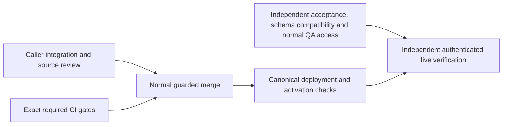

# Ship Verified System Workflow Outcomes

Resumed 2026-10-03 UTC. This is a partial release milestone within the existing full SupraOS agent-workflow project. All 33 project nodes, 16 behaviors, and supported execution surfaces remain in scope.

## Frozen capability

PR6124, commit `2e7d34c79b77ddbeb4fc74e14681de37c37d096a`: retain the original System Workflow when terminal persistence or a trigger response is uncertain; require durable completion evidence and avoid replacement execution. Existing voice, memory-promotion, Telegram, collaboration, coordinator-loop and checkpoint callers are the integration targets. No new SQL is introduced; fresh read-only installed migration446 compatibility has passed.

The last observed production web stamp was `e74e3a8961043483db9ceecc377dcfbc7f537b43`; main subsequently advanced to `48335f35f68170ea78fe0e640bce74504ae687f7`. These observations do not prove every service image. The independently reproduced delegation blocker permits one narrow successor: runtime repair `fb2cdc0f133e4a8f9df70b005f43eb2c2d43c9d7`, regression tests through `97c04df19a9719df3fa60ef92c8ba79052e4302d`, and coherent current-main merge candidate `5588b3c8b97590550865670a1624599f06851499`. The sole merge conflict was test setup; both existing #6030 tests and the held-delegation fixture are retained. This successor is published to PR6124 and frozen for required CI; it is not merged or deployed.

## Dependency path and lane ownership

| ID | What must become true | Dependencies | Production caller and integration owner | Owned files | Pass/fail proof |
|---|---|---|---|---|---|
| R1 | Changed paths retain originals and report held outcomes truthfully | None | Existing triggerSystemWorkflow callers; integration lane | Isolated integration evidence; only demonstrated blocker repairs | Actual caller map, preserved failure if any, source review and relevant immutable-source checks |
| R2 | Exact candidate passes both required gates | None | Existing box-ci jobs; prerequisites lane | CI evidence; no product edits | Security and production-build success on exact SHA, tested merge source recorded |
| R3 | Live verification is executable with legitimate access and compatible installed schema | None | Owner run-history APIs/UI and changed execution routes; independent verifier | Verification evidence and isolated tests | Installed catalog/ACL/index compatibility, normal QA invitation/session, concrete live acceptance matrix |
| R4 | Reviewed candidate is merged under existing controls | R1, R2 | merge-if-green.sh; root | Merge receipts | Exact-head normal guard succeeds; current-main composition reviewed |
| R5 | Merged behavior is deployed and available safely | R4 | Canonical app deployment; root | Deployment receipts | Running source identified and existing schema/capabilities compatible; no unsupported activation |
| R6 | Actual deployed behavior passes acceptance | R3, R5 | Owner run list/detail and actual execution callers; independent verifier | Browser/transport/recovery evidence | Positive, denied, failed, cancelled, uncertain-original and recovery behavior checked without duplicate effects or false success |

Round 1 runs R1/R2/R3 concurrently with no shared writable source. Round 2 is R4; round 3 R5; round 4 R6. The longest graph chain is R1 or R2 -> R4 -> R5 -> R6. R3 may dominate elapsed time because access is external; no duration estimate is implied. Installed compatibility is checked before unsafe activation, even though QA access can remain pending while ordinary deployment work proceeds.

## Current blockers by type

- Code: original `2e7d` held handoff throws after the specialist indicator starts, leaving actual Chat with a generic Stream error and no original reference. RED executor/consumer, actual Chat POST and Linux Chromium evidence is preserved. The successor repairs this caller and live/restored adapters. Independent Linux executor/hook/HuddleCard tests pass at390/1440; actual Chat POST retains the UUID and waiting_for_owner even when contribution/meeting writes fail, with no further model/delegate call. Saved-history API projection and actual Organization adapter plus mounted HuddleCard pass3/3 on97c; auth/DB are stubbed and this is not full live ChatView hydration. Exact merged5588 independent Linux browser/history7/7, Telegram HTTP/browser53/53 and actual held Chat POST1/1 now pass.

- Evidence/infrastructure: exact-head required CI failed with ENOSPC and four earlier test-suite failures requiring separate diagnosis. Capacity recovered. The ordinary CI service automatically superseded the original jobs when successor5588 was published; their partial and failed logs are preserved. Both successor contexts are queued against main48335f. Final successor requires its own exact-head required gates; preserve original failed logs and do not cancel unrelated qualification. Owner: prerequisites lane. Proof: both required contexts success, not scoped-test counts.
- Evidence: CLOSED: fresh installed migration446 compatibility passed through the existing authorized app-container connection, BEGIN READ ONLY and ROLLBACK. Columns, RLS, service grants and the unique original-run idempotency index are present. No rows inspected or writes performed. Owner: independent verifier.
- Access: dedicated QA wallet previously hit the normal invite-only gate. The user reports a signed-in Claude session, but the reachable CLI reports signed out; its session location is being clarified. A concrete normal invitation request has been sent to the owner; no self-sponsorship or auth bypass. Owner: verifier/root, then existing authorized member if needed. Proof: normal admitted signed session and owner/foreign-owner checks.
- Code, outside this frozen milestone: W7 postdispatch original-claim settlement and recovery remain unfinished. The implicated code is unchanged from this candidate baseline; it is not automatically a PR6124 blocker.
- Inherited product limitation: memory-promotion UI treats an explicit failed response as complete because it checks HTTP success. This is baseline behavior, distinct from PR6124's newly held uncertain outcomes. Record and repair in a following candidate; do not claim all truthful-outcome behavior finished.

PR6143 disk-admission protection remains independent; installation is not a newly invented gate for PR6124. No source, test, budget, permission or merge control is weakened.

## Progress states and checkpoint questions

Implemented: bounded successor repair. Integrated: real delegation, Chat route, live hook, huddle, Organization adapter and specialist-events projection. Tested: exact merged5588 canonical Chat suite157/157, native PostgreSQL/PostgREST18/18 and changed-file types115 pass; targeted226pass/8skip with four macOS Chromium launch failures resolved by exact-source Linux replay; the failures are preserved. Independently reviewed: original RED and successor green caller/browser evidence; final joined-source Linux browser replay passed. Merged: no. Deployed: no. Verified live: no.

The usable capability moving closer is safe retention and truthful display of uncertain System Workflow originals. Schema compatibility and the demonstrated delegation caller gap have concrete proof; final merged-source qualification is not yet closed. Next blockers are exact successor CI (prerequisites), guarded merge/deployment (root), and normal authenticated live access (existing authorized member plus verifier). All three lanes finish this path; no additional feature stream is opened.

Full completion remains all supported execution paths and all 16 behaviors deployed, activated where required, independently verified live, with tested recovery. Owner tests come after independent verification, never in place of it.
