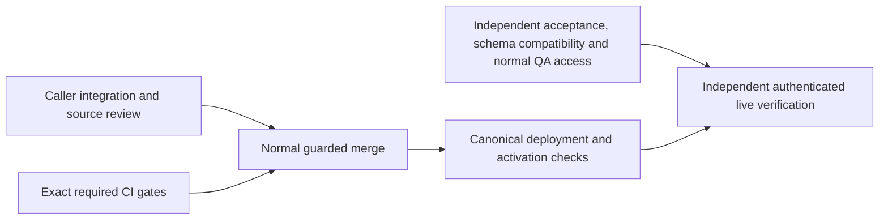

# Ship Verified System Workflow Outcomes

Resumed 2026-10-03 UTC. This is a partial release milestone within the existing full SupraOS agent-workflow project. All 33 project nodes, 16 behaviors, and supported execution surfaces remain in scope.

## Frozen capability

PR6124, commit `2e7d34c79b77ddbeb4fc74e14681de37c37d096a`: retain the original System Workflow when terminal persistence or a trigger response is uncertain; require durable completion evidence and avoid replacement execution. Existing voice, memory-promotion, Telegram, collaboration, coordinator-loop and checkpoint callers are the integration targets. No new SQL is introduced; compatibility with installed migration446 still requires evidence.

The current production web stamp and main are `e74e3a8961043483db9ceecc377dcfbc7f537b43`. The candidate is unmerged and not deployed. These observations do not prove every service image.

## Dependency path and lane ownership

| ID | What must become true | Dependencies | Production caller and integration owner | Owned files | Pass/fail proof |
|---|---|---|---|---|---|
| R1 | Changed paths retain originals and report held outcomes truthfully | None | Existing triggerSystemWorkflow callers; integration lane | Isolated integration evidence; only demonstrated blocker repairs | Actual caller map, preserved failure if any, source review and relevant immutable-source checks |
| R2 | Exact candidate passes both required gates | None | Existing box-ci jobs; prerequisites lane | CI evidence; no product edits | Security and production-build success on exact SHA, tested merge source recorded |
| R3 | Live verification is executable with legitimate access and compatible installed schema | None | Owner run-history APIs/UI and changed execution routes; independent verifier | Verification evidence and isolated tests | Installed catalog/ACL/index compatibility, normal QA invitation/session, concrete live acceptance matrix |
| R4 | Reviewed candidate is merged under existing controls | R1, R2 | merge-if-green.sh; root | Merge receipts | Exact-head normal guard succeeds; current-main composition reviewed |
| R5 | Merged behavior is deployed and available safely | R4 | Canonical app deployment; root | Deployment receipts | Running source identified and existing schema/capabilities compatible; no unsupported activation |
| R6 | Actual deployed behavior passes acceptance | R3, R5 | Owner run list/detail and actual execution callers; independent verifier | Browser/transport/recovery evidence | Positive, denied, failed, cancelled, uncertain-original and recovery behavior checked without duplicate effects or false success |

Round 1 runs R1/R2/R3 concurrently with no shared writable source. Round 2 is R4; round 3 R5; round 4 R6. The longest graph chain is R1 or R2 -> R4 -> R5 -> R6. R3 may dominate elapsed time because access is external; no duration estimate is implied. Installed compatibility is checked before unsafe activation, even though QA access can remain pending while ordinary deployment work proceeds.

## Current blockers by type

- Code: on the frozen candidate, held handoff throws after the specialist indicator starts, leaving the actual Chat consumer running with generic Stream error and no original reference. Independent executor/consumer tests and Linux Chromium at390/1440 reproduce it. The narrow repair must stop replacement work and preserve held status plus original identity through the actual hook, meeting/huddle and history projections. Root review caught new-status coercion to completed in those adapters; they must be qualified before publishing the successor.

- Evidence/infrastructure: exact-head required CI failed with ENOSPC and four earlier test-suite failures requiring separate diagnosis. Fresh verifier observation reports 81 GiB available; preserve failed logs and rerun the same candidate through normal CI. Owner: prerequisites lane. Proof: both required contexts success, not scoped-test counts.
- Evidence: CLOSED: fresh installed migration446 compatibility passed through the existing authorized app-container connection, BEGIN READ ONLY and ROLLBACK. Columns, RLS, service grants and the unique original-run idempotency index are present. No rows inspected or writes performed. Owner: independent verifier.
- Access: dedicated QA wallet previously hit the normal invite-only gate. Claude CLI was checked and is signed out. A concrete normal invitation request has been sent to the owner; no self-sponsorship or auth bypass. Owner: verifier/root, then existing authorized member if needed. Proof: normal admitted signed session and owner/foreign-owner checks.
- Code, outside this frozen milestone: W7 postdispatch original-claim settlement and recovery remain unfinished. The implicated code is unchanged from this candidate baseline; it is not automatically a PR6124 blocker.
- Inherited product limitation: memory-promotion UI treats an explicit failed response as complete because it checks HTTP success. This is baseline behavior, distinct from PR6124's newly held uncertain outcomes. Record and repair in a following candidate; do not claim all truthful-outcome behavior finished.

PR6143 disk-admission protection remains independent; installation is not a newly invented gate for PR6124. No source, test, budget, permission or merge control is weakened.

## Progress states and checkpoint questions

Implemented: yes, bounded candidate. Integrated: existing production callers under review. Tested: prior exact native/browser evidence exists; required CI failed from disk exhaustion and must pass. Independently reviewed: RED established in the actual delegation executor, stream consumer and mounted SpecialistPill at 390/1440. A narrow successor is being repaired and audited through Chat state, meeting/huddle and hydrated-history consumers. Merged: no. Deployed: no. Verified live: no.

The usable capability moving closer is safe retention and truthful display of uncertain System Workflow originals. The original candidate remains frozen while an isolated successor repairs the demonstrated caller gap; qualification of the original is not cancelled. Capacity availability has recovered and installed schema compatibility is proven; required qualification is not yet closed. Next blockers are the demonstrated delegation caller/display repair (integration plus independent verification), exact CI (prerequisites lane), and authenticated live access/evidence (verifier). All three lanes finish this same path; no additional feature stream is opened.

Full completion remains all supported execution paths and all 16 behaviors deployed, activated where required, independently verified live, with tested recovery. Owner tests come after independent verification, never in place of it.
