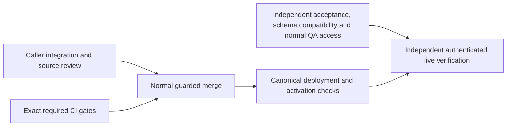

# Ship Verified System Workflow Outcomes

Resumed 2026-10-03 UTC. This is a partial release milestone within the existing full SupraOS agent-workflow project. All 33 project nodes, 16 behaviors, and supported execution surfaces remain in scope.

## Frozen capability

PR6124, current frozen commit `4db4788a2a410d826f3df280033c681973f99cdd` (original candidate `2e7d34c79b77ddbeb4fc74e14681de37c37d096a`): retain the original System Workflow when terminal persistence or a trigger response is uncertain; require durable completion evidence and avoid replacement execution. Existing voice, memory-promotion, Telegram, collaboration, coordinator-loop and checkpoint callers are the integration targets. No new SQL is introduced; fresh read-only installed migration446 compatibility has passed.

The observed production web and cron image now both carry `abc93d09fc21616dd69fe54675aada3d779a9da7`; public /api/version agrees. Main is `48335f35f68170ea78fe0e640bce74504ae687f7`. This upstream deployment contains the separately authored Build delivery-planning skill change; its full live planning journey is not verified here. These observations do not prove every service image. The independently reproduced delegation blocker permits one narrow successor: runtime repair `fb2cdc0f133e4a8f9df70b005f43eb2c2d43c9d7`, regression tests through `97c04df19a9719df3fa60ef92c8ba79052e4302d`, and coherent current-main merge candidate `5588b3c8b97590550865670a1624599f06851499`. The sole merge conflict was test setup; both existing #6030 tests and the held-delegation fixture are retained. Final published successor is `4db4788a2a410d826f3df280033c681973f99cdd`, a catalog-only child of5588. It repairs a separately reproduced stale writer-inventory failure, with no runtime/test/schema changes. It is frozen for required CI, not merged or deployed.

## Dependency path and lane ownership

| ID | What must become true | Dependencies | Production caller and integration owner | Owned files | Pass/fail proof |
|---|---|---|---|---|---|
| R1 | Changed paths retain originals and report held outcomes truthfully | None | Existing triggerSystemWorkflow callers; integration lane | Isolated integration evidence; only demonstrated blocker repairs | Actual caller map, preserved failure if any, source review and relevant immutable-source checks |
| R2 | Exact candidate passes both required gates | None | Existing box-ci jobs; prerequisites lane | CI evidence; no product edits | Security and production-build success on exact SHA, tested merge source recorded |
| R3 | Live verification is executable with legitimate access and compatible installed schema | None | Owner run-history APIs/UI and changed execution routes; independent verifier | Verification evidence and isolated tests | Installed catalog/ACL/index compatibility, normal QA invitation/session, concrete live acceptance matrix |
| R4 | Reviewed candidate is merged under existing controls | R1, R2 | merge-if-green.sh; root | Merge receipts | Exact-head normal guard succeeds; current-main composition reviewed |
| R5 | Merged behavior is deployed and available safely | R4 | Canonical app deployment; root | Deployment receipts | Running source identified and existing schema/capabilities compatible; no unsupported activation |
| R6 | Actual deployed behavior passes acceptance | R3, R5 | Owner run list/detail and actual execution callers; independent verifier | Browser/transport/recovery evidence | Positive, denied, failed, cancelled, uncertain-original and recovery behavior checked without duplicate effects or false success |

Round 1 runs R1/R2/R3 concurrently with no shared writable source. Round 2 is R4; round 3 R5; round 4 R6. The longest graph chain is R1 or R2 -> R4 -> R5 -> R6. R3 may dominate elapsed time because access is external; no duration estimate is implied. Installed compatibility is checked before unsafe activation, even though QA access can remain pending while ordinary deployment work proceeds.

## Current blockers by type

- Code: original `2e7d` held handoff throws after the specialist indicator starts, leaving actual Chat with a generic Stream error and no original reference. RED executor/consumer, actual Chat POST and Linux Chromium evidence is preserved. The successor repairs this caller and live/restored adapters. Independent Linux executor/hook/HuddleCard tests pass at390/1440; actual Chat POST retains the UUID and waiting_for_owner even when contribution/meeting writes fail, with no further model/delegate call. Saved-history API projection and actual Organization adapter plus mounted HuddleCard pass3/3 on97c; auth/DB are stubbed and this is not full live ChatView hydration. Exact merged5588 independent Linux browser/history7/7, Telegram HTTP/browser53/53 and actual held Chat POST1/1 now pass.

- Evidence/infrastructure: exact-head required CI failed with ENOSPC and four earlier test-suite failures requiring separate diagnosis. Capacity recovered. The ordinary CI service automatically superseded the original jobs when successor5588 was published; their partial and failed logs are preserved. The final4db478 contexts must qualify through the same normal queue; no queue priority, slot, budget or gate changes are authorized. Final4db478 successor requires its own exact-head required gates; preserve original failed logs and do not cancel unrelated qualification. Owner: prerequisites lane. Proof: both required contexts success, not scoped-test counts.
- Evidence: CLOSED: fresh installed migration446 compatibility passed through the existing authorized app-container connection, BEGIN READ ONLY and ROLLBACK. Columns, RLS, service grants and the unique original-run idempotency index are present. No rows inspected or writes performed. Owner: independent verifier.
- Access: dedicated QA wallet previously hit the normal invite-only gate. The user reports a signed-in Claude session, but the reachable CLI reports signed out; its session location is being clarified. A concrete normal invitation request has been sent to the owner; no self-sponsorship or auth bypass. Owner: verifier/root, then existing authorized member if needed. Proof: normal admitted signed session and owner/foreign-owner checks.
- Code, outside this frozen milestone: W7 postdispatch original-claim settlement and recovery remain unfinished. The implicated code is unchanged from this candidate baseline; it is not automatically a PR6124 blocker.
- Inherited product limitation: memory-promotion UI treats an explicit failed response as complete because it checks HTTP success. This is baseline behavior, distinct from PR6124's newly held uncertain outcomes. Record and repair in a following candidate; do not claim all truthful-outcome behavior finished.

PR6143 disk-admission protection remains independent; installation is not a newly invented gate for PR6124. No source, test, budget, permission or merge control is weakened.

## Progress states and checkpoint questions

Implemented: bounded caller repair plus narrowly reconciled writer inventory. Integrated: real delegation, Chat route, live hook, huddle, Organization adapter and specialist-events projection. Tested: exact merged5588 canonical Chat suite157/157, native PostgreSQL/PostgREST18/18 and changed-file types115 pass; targeted226pass/8skip with four macOS Chromium launch failures resolved by exact-source Linux replay; the failures are preserved. Independently reviewed: preserved original caller RED and successor green browser/native evidence; then exact4db478 catalog34/34 and direct scanner passed. Catalog correction maps four historical coordinator UPDATE rows to its two actual current sites. All unrelated2351 rows and all hazards/classifications are unchanged; strict E3 remains RED6104. Runtime qualification remains attributed to5588 and carries by identical blobs. Merged: no. Deployed: no. Verified live: no.

The usable capability moving closer is safe retention and truthful display of uncertain System Workflow originals. Schema compatibility and the demonstrated delegation caller gap have concrete proof; final merged-source qualification is not yet closed. Next blockers are exact successor CI (prerequisites), guarded merge/deployment (root), and normal authenticated live access (existing authorized member plus verifier). The CI lane continues this release path. While it waits, integration and verification resume the existing W7 settlement blocker on separate source; that successor will not change or restart PR6124 qualification.

Full completion remains all supported execution paths and all 16 behaviors deployed, activated where required, independently verified live, with tested recovery. Owner tests come after independent verification, never in place of it.

## Prepared next steps and fresh-machine evidence

Current source is PR6124 head4db478; local isolated author worktree is `/Users/joshuatobkin/qa-lanes/release-integration-6124-catalog-20261003`. Earlier runtime composition lives in `release-integration-6124-current-main-join-20261003`. Evidence root is `/Users/joshuatobkin/qa-evidence/resume-delivery-20261003`. On a new computer, clone `jtobkin/suprafx-platform`, fetch the PR head, use repository Node22 and AGENTS/CONTEXT instructions, and run normal release controls; local machine paths are evidence locations, not portable prerequisites.

Deployment inspection confirms the installed main poll, not the proposed SHA-pinned host patch. Verify actual web and cron image IDs/stamps after guarded merge; there is no qualified one-command image rollback. Revert through reviewed main remains the documented rollback path. Live acceptance preparation includes a normally signed, budgeted voice-router positive request, original durable run detail/UI and cross-owner denial. Deterministic cancellation/ACK-loss faults remain image-bound disposable tests, never customer fault injection. Normal QA session access is unresolved: the owner reports a valid Claude login, while this process has abnormal account/Keychain lookup and no supported messaging route.

Existing stacked PR6127 has a clean read-only merge tree against final4db478 and freshly confirmed installed pause/checkpoint columns and service grants. After6124 squash-merges, prepare a pause-only successor on the actual resulting main and qualify it exactly. Do not reintroduce the old base commits or claim live pause behavior from catalog checks.

## Existing W7 repair running alongside release qualification

This is unfinished agreed scope, separate from the frozen PR6124 release. Independent replay of the preserved3f5 source again fails both actual cron and owner-route postdispatch cases: an old result calls settlement after a newer claim is saved. The failed log is `verification/w7-postdispatch-3f5-independent-red.log`, SHA256 `8b97aaa7a11c2914736385179a49093d38fa5e09b3a670a7783e574a0d2c59be`. The failure is inherited and does not justify changing PR6124.

The next usable capability is safe completion of the original project task, including downstream work and recovery after a lost acknowledgement. Merely dropping all results or adding another non-atomic read is not acceptance.

| Step | Depends on | Owner and production integration | Owned source/evidence | Acceptance |
|---|---|---|---|---|
| W7-A | None | Integration: saved project execution claim | Own isolated successor; claim producers, orchestrator and additive schema source | Every execution retains an owner/plan/task/run-specific server claim; model/body fields cannot forge it; legacy attempts have explicit recovery policy |
| W7-B | W7-A | Integration: completion, failure and uncertain-outcome settlement | Same production lane; atomic settlement, durable receipt and recoverable effect delivery | Stale token cannot mutate a new attempt or emit completion effects; same token returns its original receipt; lost acknowledgement cannot duplicate effects |
| W7-C | W7-A contract; W7-B for final green | Independent verifier: cron, owner execute, runExecutionCycle and workspace actions | Separate test worktree and native/browser evidence | Real database races, concurrent claims, lost acknowledgements, postcommit recovery, normal positive path, denied/legacy/manual-action cases and all callers |
| W7-D | W7-B, W7-C | Root and existing schema-release owner | Immutable qualification, schema/drain/restore and release receipts | Independent review, required gates, safe schema-first installation, guarded merge/deployment, then authenticated live acceptance |

Contract design and independent test preparation can run together; runtime implementation and final native acceptance share explicit dependencies. No production SQL is authorized by this source-development step. The existing schema admission/drain/restore and QA-access prerequisites remain required for release. Shared verification-host capacity is checked before native/browser execution; no foreign jobs or containers are removed.

### W7 database milestone evidence (intermediate)

Independent PostgreSQL17.11/PostgREST14.18 replay passed9/9 on schema bytes SHA256 `4600bc689dbe39fcd99a4b94940bd775427d6d47f522574ebebcb8a0266325eb`. Log `verification/w7-native-first.log` SHA256 `c2ef47889376fdb03c3a84e1a4b4de12e169aa735597f40b87f968530ddfa24c` records zero skipped cases. The cases cover original claim, foreign-owner refusal, lost settlement acknowledgement, stale A versus newer B with B positive completion, historical A receipt after B, fanout intents, exclusive review, manual-action replay, and malformed input/effect-state controls. Fixtures use reduced plan tables, administrator-driven supersession and synthetic receiver evidence. This is not actual caller, receiver, UI or production acceptance. The expanded12-case overlay subsequently passed on unchanged4600bc, adding concurrent requests, unrelated-task conflict and anonymous/authenticated denial. A later independent manual stale-plan case then failed: a stale prepared plan was incorrectly admitted. Preserved RED log `verification/w7-manual-stale-4600-red.log`, SHA256 `be138d4db3c847761f8be84eb45f2be27ab8b7f6de126dd2b07d108104367793`. Successor46046a passed13/13: stale version refuses without changing saved costs, estimates or version; ordinary manual completion and historical receipt replay still work.

Runtime claim producers are being integrated in `/Users/joshuatobkin/qa-lanes/w7-claim-settlement-successor-20261003`; the worktree is deliberately nonpublishable while settlement and delivery remain incomplete. Root's `verification/w7-legacy-effect-inventory.md` enumerates the existing completion/failure destinations so the rewrite cannot silently omit useful behavior. Full scope and the frozen PR6124 candidate are unchanged.

### Current W7 qualification checkpoint

Forward SQL SHA256 `dae8357a42f3b177cf9003324c6c0995a076c764197329d7ad0d7d7e03393b5b` independently passed **15/15 PostgreSQL17.11/PostgREST14.18 cases**. Log `verification/w7-native-dae835-15.log`, SHA256 `ef6a4c97349ef39b8ff3a39f32b172c4d5fd2cff52f912d73991e5d911db7da3`; verifier SHA256 `f192583f25a4f8fc8373b9d8e63116346ab6473cfe6a2d33a7378ac1bf77cda7`. The new real execution-log receiver commits a keyed log row and delivered intent atomically; retry after a lost HTTP acknowledgement returns the same row without duplication. Foreign-owner manual requests are denied without writes. This closes one database receiver dependency, not every downstream destination.

Implemented: claim/settlement schema and one durable receiver in draft. Integrated: production caller and scheduler work remains active. Tested: the exact SQL stage has15 native passes; current runtime scoped tests still have13 passes/21 failures, primarily fixtures not yet adapted to the new settlement contract. Those results do not qualify runtime. Independently reviewed: database evidence and legacy-effect inventory; rollback draft review found incomplete drift checks, now assigned to prerequisites. Merged: no. Deployed: no. Verified live: no.

Next dependencies: integration owns preserving scheduler and downstream behavior plus exact original-claim caller wiring; verifier owns actual caller/manual-route and mounted UI acceptance against frozen runtime; prerequisites owns exact VERIFY/ROLLBACK and captured-schema rehearsals, including refusing retained data and catalog drift. Schema packet worktree: `/Users/joshuatobkin/qa-lanes/w7-schema-packet-prereq-20261003`. All development remains separate from frozen PR6124, whose two required contexts remain pending in the normal queue. Normal authenticated QA invitation remains unresolved; the owner identifies Claude's account as signed in, but this process cannot reach that session.

### Recovery integration findings and next coherent freeze

The scheduler SQL stage `923ebb834310931e3c3c61db2aaa568cb1af3cae2ed4a0fdb94d69fda5c2e46f` passed20/20 independent native cases after correcting a verifier-only SELECT omission. Preserved parser RED on predecessorb905 executed no test cases; neither failure is erased. The subsequent d8257b deadline stage passed21/21, proving stored deadline values, not locked expiry enforcement. Required next changes are being consolidated before another runtime+SQL qualification: canonical result digests across JSONB readback; strict handling of actual head-review errors/invalid verdicts; database-time recovery selection and locked expiry checks; and the manual route's awaited async error handling.

Independent actual manual-route replay found a lost-ACK exception escaped the normal HTTP500 handler because the route returned an async function without awaiting it. Three other cases passed: original action receipt after task replacement, version-conflict rebase, and owner denial. The narrow `return await` repair awaits replay on frozen source. Root's recovery audit is `verification/w7-jsonb-digest-recovery-audit.md`; native20 log SHA256 `010661c12eb653174bc176d9b2b5f49c5d1068c3e568f52b79a1957fa10e435b`; native21 log SHA256 `3dfe9b4bcd5b304253c2ce83c982b77032ad8c5df57b120b612a2a6265266558`.

The first schema packet fixture is reduced/authored, not captured production. Captured-schema replay remains a separate required gate. Rollback comparison now retains ownership and ACLs. Legacy output, approval, memory, learning, handoff and terminal destinations remain open until real receivers and recovery are implemented; queued intents alone are not delivered capability. No W7 merge, deployment or production installation has occurred.

### Latest receiver and recovery evidence — 2026-10-03

The SQL snapshot `2700d4d98ca1afa3090c90959d268f5227c38f05453265bc27dcc081af5bbcfe` passed **30/30 independent native PostgreSQL17.11/PostgREST14.18 cases**. This includes the original approval card surviving a lost acknowledgement without duplicate, foreign-owner denial, stale unknown-claim refusal, and rejection of a preexisting card with the wrong outcome_unknown flag. Log `verification/w7-native-2700d4-owner-review.log`, SHA256 `afff9a506e148ba7bb5c81a5ecd94cd4c9cc6e5d85ea4b6784c07eaca77e217d`. This exact snapshot predates the completed-claim marker repair and plan-finalization receiver; those changes require their own independent replay.

The raw-output receiver separately passed the 27-case native stage using canonical migration487 and the earlier effect ledger. The actual manual route and strict head-review helper passed nine focused checks; the actual settler-to-head-review overlay passed three unknown-verdict cases without provider replay. Approval classification has 22 unit cases and is integrated into both legacy and claimed-task paths, with explicit structured-output conversion. Actual caller/card verification remains pending. The actual cron-route fairness fixture passed with 22 older held outputs: fresh pending output progressed on the first tick and all held outputs received a recovery check within five ticks. Its database/receiver are mocked; final native fairness proof is still required.

The provisional d825 schema packet also passed against the full dated September29 captured schema: forward, VERIFY, empty rollback with owner/ACL/schema dump equality, reapply and VERIFY. This proves compatibility with that dated capture only. It does not establish current production compatibility or qualify later SQL changes. Final packet must include all current functions, columns and indexes, exercise receiver-versus-maintenance lock ordering, and repeat the captured-schema and refusal checks.

Current implementation focus: settlement can finish a plan before the legacy project route finalizes its project and execution-run rows. Integration owns an atomic core plan_finished receiver, while Telegram, chain, retrospective and other secondary destinations need separate durable intents and receiver proof. Root's legacy-effect inventory remains the scope checklist; unfinished secondary effects cannot be represented as delivered.

Current states: implemented — claim/settlement and three bounded receivers in evolving source; integrated — production settlement/cron wiring exists but full caller/finalization coverage is unfinished; tested — exact intermediate native and focused caller evidence above; independently reviewed — receiver binding, lock order and preserved failure repairs; merged — no W7 merge; deployed — no W7 deployment or schema installation; verified live — no W7 live acceptance. PR6124 remains independently frozen at4db478; both required GitHub contexts were freshly observed pending. Normal QA invitation and final authenticated acceptance remain open.

### Captured-type repair and learning delivery checkpoint

The earlier native36 plan-finalization result was insufficient: independent tests reproduced same-run snapshot drift and PostgreSQL42883 against the actual TEXT plan.project_id versus UUID project/run IDs. Parser and SQL NULL/JSON null failures in intermediate successors were also preserved. Frozen SQL `d6bdfc0e75502d33c676053cb23274c4151dcf60973bb91aaac45bc2ee535fb` now passes40/40 independent native cases with captured column types, including terminal snapshot/UUID guards and head-review exact fact recovery. Native log SHA256 `90c7e401dda7dcd6104231c9db29961a942ff96e85cb5ed24e4d76fab4382fce`.

Original agent-learning receiver `6927ceacd4` plus that ledger passed43/43 native cases, including lost ACK, conflict, foreign denial and late exact row reconciliation. Log SHA256 `35b6fd5bcc102a35ce7eb8a80b69b596ffe3b63c842fa5bd95deca22dd3f4085`. It is mounted in settlement and cron. Original estimation receiver `290f44ffca` is also mounted:15 focused tests and11-file scoped types pass; native acceptance remains pending. Integer target columns are respected; fractional values remain explicitly held, not rounded or declared delivered.

Owner-route no-count CAS failure was independently reproduced: a null update count allowed legacy project effects despite zero matched plan rows. Repaired route uses returned-row evidence and rereads current state; four handler tests pass with mocked auth/database. Real mounted UI and authenticated live proof remain separate.

Schema rollback negative-first evidence now covers orphan outcome/completion markers and keyed owner/head-review/learning rows; repaired provisional d825 packet passes14 refusal cases and dated captured-schema owner/ACL/schema-equal rollback/reapply. These companions cannot ship with final current SQL until repinned and fully replayed. Fresh production metadata read-only probe independently confirms plan.project_id TEXT, projects/runs UUID, and absent W7 tables/RPC/migration; no installation occurred.

Current mounted receiver coverage: execution log, raw output, owner review, head-review fact, core project/run finalization, agent learning and task estimation. Full legacy task/plan secondary destinations remain unfinished: skills, Kanban/downstream, chain/activity, nested broadcasts/memory/index/extraction, plan estimation/analysis/retrospectives, configured notifications and provenance. Root current coverage artifact is `verification/w7-delivery-coverage-root-current.md`. Descriptors are not delivery. Final runtime/caller/browser/schema qualification, required CI, guarded merge/deploy, normal QA access and independent live recovery acceptance remain open.
