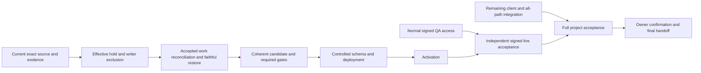

# Ship Verified SupraOS Agent Workflows

## Resumed execution — 2026-10-04 UTC

**Current checkpoint: 12:28 UTC. Execution is active until 14:14:41 UTC, when the owner requested a detailed handoff, updated plan/checklist and pause.** This section supersedes dated checkpoints below. It distinguishes source implementation, integration, tests, independent review, merge, deployment and live acceptance. No code-completion percentage is inferred from test or task counts.

### Overall goal and definition of finished

The goal is private, authorized, contextual and recoverable SupraOS agents across **33 plan nodes, 16 user behaviors and 12 supported execution surfaces**. W7 is the immediate partial delivery milestone; it is not the final wave or a replacement for the full scope.

The user behaviors include quiet suggestions, owner-voice drafts without implicit sending, visible shopping/browser work, approved calls, bounded initiative, Telegram takeover and handback, loose-end tracking, mail review and suppression, two-owner consent, unique inbound mailboxes, exact payment instruments and receipts, truthful history, relevant current and older memory, honest failure/uncertainty, quiet hours and cadence, and context-appropriate tone. iMessage remains deferred; WhatsApp remains excluded. Stripe Link configuration remains an external prerequisite.

Supported surfaces include personal chat; Telegram; mounted and legacy voice; headless execution; delegation; System Workflows; generic workflows and Routines; background Build loops; workspace plans, MC cron and organization tasks; scheduled research; Rooms; and shared/company/visiting audiences. Passing one chat path does not establish all-path acceptance.

Finished means the agreed behavior is integrated with named production callers, required gates pass on immutable source, independent review is complete, compatible schema/runtime are merged and deployed, necessary flags are activated, real authenticated browser/transport behavior is independently verified, and cancellation, failures, unknown outcomes and recovery are tested. Permissions, budgets, privacy and original operation identity must remain intact. A source helper, mocked test, synthetic database proof, deployment version or completed partial milestone alone does not satisfy that definition.

### Current release candidate

[PR 6160](https://github.com/jtobkin/suprafx-platform/pull/6160) is frozen at **c3e23f9434780edde5aecf631ae0a6a356e18513** on both `fix/w7-reviewer-release-20261003` and `fix/w7-reviewed-release-repairs-20261004`. It is open, unmerged, undeployed and unactivated. Auto-merge is off. No W7 production SQL has been installed.

**Both required CI contexts now pass:** security51/51 at10:25 and production-build7/7 at10:41. Security includes54,955 passing units (374 skipped), actual Chromium390/1440 and the previously timing-out PostgreSQL contract. Full logs and final receipt are published at private commit **1606c0136a992bd7442601c07294d3ff8cd6a30e**, `docs/agent-run/evidence/w7-c3e-ci-20261004/`; logs are deterministic gzip with raw SHA256 manifest. Security effective merge is `5f9be9ff8e7e0d4d9e2ee622f4e2e8bf60d34112`; build effective merge is `202d8b9bc06430327f7f1706b5383abe0b003639`. Both logs name main `8c2f14b378b830e993564a843db73a860c7f4715` and candidatec3e as parents. Their ephemeral commit IDs differ; original CI tree objects were already removed, so exact original tree identity was not directly observed. Local merge-tree reproduces `c35cb66f43dd264107d84524983b2493b9551939`. macOS Native Land was not run. No test budget, assertion or CI control was weakened.

**Independent partial release:** [PR6179](https://github.com/jtobkin/suprafx-platform/pull/6179), candidate **9b5b236b82e8cc9d276bc662094276d008bc3ddd**, is **merged as09f87ddf1b6e7a596df359358e558df61c2f21e4**. It contains only the dashboard owner/plan privacy repair, mounted/browser regressions and architecture entry; no W7 SQL/backend dependency. Eight mounted tests,13-file changed types, pinned secret scan and independent source review pass. Final security51/51 and build7/7 pass; real Chromium390/1440 passed in CI with synthetic auth/transport. Build effective merge18b1ad08 combines9b5 withmain7ec9. Root preserved both full logs and checked the intervening Desktop-menu change did not overlap these files. Canonical deployment09f87 was independently observed before/after public Linux Chromium390/1440 checks at11:51: ordinary sign-in, no overflow/page errors, anonymous plan401, settled screenshots visually inspected. Initial immediate screenshots were blank during entrance animation and are preserved without claiming visual PASS. Full CI and public browser evidence is portable at private commit016f9e0ff6e424d95169b82f9ab5a4232523ee04, `docs/agent-run/evidence/dashboard-owner-release-20261004/`. Its clean, idle, merged root-owned worktree was removed normally; pushed source and evidence remain. Authenticated owner-switch acceptance still requires a normal QA invitation.

**Caller integration repair:** [PR6181](https://github.com/jtobkin/suprafx-platform/pull/6181) is frozen at **0171d7ad6c775d102048c99e0e02209e1c93576f**, branch `fix/workspace-owner-scope-20261004`. Grok found the actual workspace page retained its project/plan and accepted late polling callbacks across wallet changes even after the child component was repaired. Root preserved five failing mounted cases, then keyed the page state by owner/project/workflow, disposed old polling/event responses, stopped old loop continuation and cleared delayed callbacks on unmount. Seven mounted cases,12-file changed types, pinned8.28 secret scan and independent Codex review pass. Linux Chromium renders the actual page at390/1440 with synthetic wallet/network/child seams and passes; an earlier harness-only mock failure is preserved. Final security51/51 passed12:03:27 (728s,10.2GiB peak;54,379 unit tests passed/194 skipped); build7/7 passed12:21:27 (1029s,20GiB peak within cap). Candidate0171 merged as **78902bc9af73d4b891096ee4b0cb15de38dd5081**. Build effective ec197c749981b00473970aedeb783138cfcf33ca includes main e5eb7147d0cf8166302094e189b059cb6159e5b2 plus0171; intervening subscription-limit fix did not overlap. Canonical deployment/public browser check is pending; authenticated owner-switch still needs normal QA invitation. This does not cancel already-admitted server runs or claim authenticated live owner-switch acceptance.

**Live baseline:** independent Linux Chromium at390/1440 passed on **bd3c16e3f6048b9a8de9ce44b45a97d1e4ccc870** at11:09: ordinary sign-in appears, no overflow/page errors, anonymous plan reads return401. This predates6179 and is not authenticated owner-switch acceptance. The initial old-harness attempt failed because its Playwright module was removed; the verified successor uses an existing retained module.

The latest candidate admits one demonstrated privacy repair: the mounted dashboard retained a previous owner's task state when the owner changed but the plan ID stayed the same. The component now remounts by owner/plan, drops late stream/poll callbacks and fences pending action continuation after unmount. Root independently reran eight mounted tests; changed-file types (994) and the secret gate pass. The expanded actual Chromium regression passed in Linux CI at widths 390 and 1440, including same-plan owner change, late callbacks and pending resume cancellation. It renders the actual component with synthetic auth/transport fixtures; it is not authenticated production acceptance. Local Chromium crashes before opening a page, so local browser success is not claimed.

The previous candidate **6c5497f27a5e0fef3dfade9b6e5e8d7cadad7c83** did not qualify: the unchanged PostgreSQL amendment contract exceeded its 180-second budget (213.012 seconds), and the build was stopped after security failed. Its 54,919 passing units, 374 skips and prior Chromium 390/1440 proof are preserved, but do not replace final gates. The same contract previously passed in 65.636 seconds. Shared-resource contention is a hypothesis, not a proven root cause. No test budget, assertion or CI control was weakened.

### What moved forward, and what remains open

| Capability | Implemented and integrated | Tests and independent review | Merge / deployment / live state |
| --- | --- | --- | --- |
| Operator recovery after a lost COMMIT acknowledgement | Actual guarded CLI retains original operation/target identity and observes PG errors through close | Private PG17 receipt `5a949eb0` proves UNKNOWN followed by same-operation readback, close, replay and owned cleanup; scoped operator checks pass | Included in c3e23; no production writer-fence or installation authority inferred |
| Head-review RPC | Actual orchestrator sends the declared seven arguments | Private PG17/PostgREST receipt `c207eaeeb` rejects the obsolete eighth argument and proves fixed call/replay with unchanged selected rows | Included in c3e23; authenticated production acceptance open |
| Manual edits and cron retry CAS | Authenticated PATCH uses durable manual handling; retry writes compare owner, status and version | **New private native PASS `d2425b27`: four races through actual GET route, Supabase SDK PATCH and PG17/PostgREST.** Root and verifier checked source parity, logs, original command IDs and cleanup | Included in c3e23; auth/unrelated receivers were stubbed in the fixture, so live cron and full provider execution remain open |
| Dashboard privacy and action refusal | Same-owner/plan action errors remain visible; owner/plan changes reset private state | Eight mounted tests, independent source review and actual Chromium qualification pass; authenticated live acceptance remains pending | PR6179 merged09f87 after both required CI contexts; canonical09f87 deployed and public shell/refusal browser checks pass; authenticated live acceptance open |
| Completed-task chain effects | Frozen separate commit `c8d1c44fcf7b47b1582705dd3b3003ddd1642fcc` wires original output evidence, chain/activity/BFT receivers and explicit L1 hold to settlement and cron | 26 focused tests, changed-file types (32 files), independent source review and exact secret scan pass; native stage passed; fresh native admission refused before any database fixture began because a managed deployment was active. Saved route is server-authored, not chosen by a retrying caller | Pushed branch `feat/w7-chain-task-effects-20261004`, unmerged; not admitted to c3e23 or activated |
| System Workflow pause and Memory Promotion reporting | Earlier scoped changes preserve original pause/checkpoint identity and report failed/held promotion truthfully | Historical source-bound tests retained; fresh GitHub state and public version checked at 10:16 UTC | PR 6127 merged `9fac151b`; PR 6149 merged `ef86349d`. Both are ancestors of observed web version `8c2f14b3`. Authenticated behavioral acceptance remains open |
| Production release controls | Guarded install/stop/recovery tools exist | Dated synthetic restore and private component evidence do not prove current production exclusion or recovery | Continuous all-writer fence, accepted-work accounting, current-target restore and operator authority remain unresolved |

The retry-CAS PASS receipt is **d2425b2768b39119f4799c039c77e30d21e38aad8eb9c96b416fad5c07403a51**. It covers claim/version, cancellation/version, status-only cancellation and owner-only races, requiring no stale overwrite or downstream dispatch after the comparison fails. Source hashes match c3e23; 35 packaged files were verified before and after the native run. Native command `b633e858-41ef-4629-840a-c1e965a1e4fe` and cleanup command `abfa5dde-4255-4c84-8777-bdbc63a78e0b` ended Success/0. Original 19 unrelated containers were preserved. This is a private selected-schema test, not production or signed authentication evidence.

Source parity and command/cleanup details are recorded in the published `retry-cas-native-root-review.json`, verifier audit, `receipts/native-9415fc75b0439407/receipt.json`, and `NATIVE-RESULT.md`; publication metadata alone does not establish those claims.

Its failed predecessors remain preserved: the first attempt was refused by admission before native execution; the second failed during npm installation because the derived package omitted the production PostCSS override. Cleanup receipts `c705b6e6` and `851878c3` retain the disposition. The successful successor restored the exact production override map without changing any of the 222 lock entries or product source. No failed attempt was silently relabeled or blindly resent.


**Adjustment receiver:** frozen, clean and pushed **ff88a400a7d94fa35f38270fe6c90b632e83684c**, branch `feat/w7-mc-coordinator-adjustment-effect-20261004`, adds `mc-coordinator-adjustment-{envelope,effect}.ts`, actual settlement/cron wiring and `20261004110000_mc_coordinator_adjustment_recovery{,_VERIFY,_ROLLBACK}.sql`. Its original sink is `logMcCoordinatorAdjustment`/`mc.coordinator_adjustment`, system/null actor and no activity row.18 focused tests,31-file changed types and independent source review pass. The network G11 downloader failed DNS; the official cached8.28.0 archive matched its pinned hash and the direct exact-commit scan passed. Private PG17 SQL qualification now PASS: receipt5a7cfabd6a7b2b24ac03627617ce381f36bf42801047f582498161eaeebb0bea, seven cases/four forbidden kinds/rollback disposition; native31539d14-87d3-4a87-9c98-57ae83f43818 and owned cleanup750138cf-2696-4d62-8aab-6b59a29db536 Success/0. This uses dated synthetic capture, not an installed target or live caller. An earlier SQL NULL-guard defect was preserved and narrowly fixed before the final freeze. Failed-task integration is now pushed atfa939; the next receiver is `plan_chain_log`. No new candidate is admitted to W7 until actual integration and qualification finish.

**Fixture lifecycle:** chain SQL immutable stage `80097646` completed190 archive chunks and five recorded setup/hash/owner steps, independently reviewed. Fresh admission command `fdb15229-de09-4fa3-bde3-9857b12e7325` then returned known refusal `managed_deploy_or_start_active`, before native dispatch or any Docker fixture. Its one-use claim is consumed; exact owned staging cleanup completed Success/0 with receiptf7edd347, matching all19 original full container IDs before/after. The attempt must not be blindly resent. A new attempt needs fresh stage/admission. The stage wrapper's original shell cleanup guard defect was caught before staging, preserved as source `ad2516e4`, and repaired to fail closed on a missing/wrong owner marker. Real shell negatives and independent source review pass on final dispatcher429fcda0. The historical successful retry-CAS dispatcher used the older cleanup pattern: its success remains scoped to the observed correct-owner cleanup and must not be reused as proof of wrong-owner refusal.

**Failed-task receiver:** **fa939a52490dcb7e1ecd7a0f05f234944501c93f**, branch `feat/w7-mc-task-failed-effect-20261004`, preserves original `mc.task_failed` Tier2 semantics, including unknown-agent fallback, empty project fallback, JS error truncation and no activity row. Actual automated settlement and cron are wired.19 focused tests,31-file changed types, independent source review and root pinned8.28 G11 pass. Native SQL contract source exists but remains UNRUN. A cron suite has43 passing cases and one macOS Chromium startup crash; do not relabel the whole suite as passing. The integration agent now uses a separate plan-chain branch in the same locked worktree because disk pressure ruled out another checkout; pushedfa939 remains immutable.

**Plan-chain receiver:** frozen and pushed **f9a09c98324cd93408c971f88981e6d3ee0ac408**, branch `feat/w7-mc-plan-chain-log-effect-20261004`, wires automated terminal settlement and cron to original `logMcPlanCompleted`/`logMcPlanFailed` semantics. Focused32/32,31-file types, independent source review and root pinned8.28 secret scan pass. Native contract remains UNRUN. **A subsequent Grok trailing audit found a demonstrated source blocker:** the settling task could inflate its caller-provided retry count. Root and integration confirmed it; f9a09 remains preserved and is not qualification-ready. First repair1f02 bound prior+1/error but still permitted a premature prior1→failed2 transition. Root found this remaining gap and independent review confirmed it. Final pushed repair **c83d2a0771f746dbddd416089df46bbbd78087dc**, branch `feat/w7-mc-plan-chain-log-repair-20261004`, also requires locked prior>=2 and original critical-path membership; independent source review and exact pinned8.28 secret scan pass. Native RED/GREEN and actual receiver REST remain UNRUN. Product SQL f9/1f02 is preserved in Git; earlier loose native-contract versionsa415/5e942 and manifestsbc8e/254b were overwritten before any native run and are not separately recoverable. Their review notes/hashes remain, but must not be described as preserved original files. Current final1399 contract is frozen before further edits; newly constructed RED evidence will be labeled as such. The old positive fixture1→2 was not production-reachable: real terminal exhaustion is prior2→3 because retry selection tests the prior count. Correcting that fixture preserves the original behavior; no acceptance assertion is weakened. Locked SQL stamps original nullable project, terminal task snapshot and original critical path; the receiver checks counts/status/error and claim binding. Legacy failed critical tasks with retries>=2 may end a plan while siblings remain pending; the repaired contract explicitly preserves that case and rejects forged critical paths, unexhausted/noncritical early failure, and completed-with-pending. Projectless chain logging does not wait for unrelated `plan_finished`; its separate projectless finalization limitation remains open. Earlier drafts that falsely required all tasks settled or finalization delivered are not the frozen source. Owner-manual actions do not emit this intent and remain unclaimed. Next integration is `integration_triggered`: preserve existing integrate child and >=2 completed/skipped blocking parents, bind original source claim and target, and mint deterministic identity before first append. Never retrofit identity to blindly rerun uncertain legacy work. The completion-broadcast umbrella still needs decomposition.

**Current private packets:** adjustment sourceff88 stage0d202 was consumed exactly once and completed nativePASS/owned cleanup as above. Completed-task actual receiver→PostgREST→PG17 packet is sealed at stage **ad468d3c09b500bfe64d7dcf486c085c0b9ff3f53789b0394a2346a60ed0e5d8**, token673d3cd264694357, expires14:06:55UTC.225+3+1 chunks and five Success/0 steps passed root and independent review; exact runnerc94f6b57/dispatcher746c3447/idleac5db7f7/archive35395753. Native completed PASS with receipt610284c36a114adbc5c5081177f904ab93453be6cbf021e934da778ff7262d9c, original command24fe48ec-259e-4277-8926-c89db7ecbda2 and cleanup2bc88f43-5050-4399-b4cf-fb8cfbb892bc Success/0. It proves actual c8d receiver over private REST, one retained chain row after committed finish ACK loss and zero replay inserts, malformed/conflicting/foreign-owner refusal, unsigned-system downgrade, actual service_role readback. The host slot is released. The wrapper verifies private service_role through an actual invoker RPC, internal network/no ports, foreign owner refusal, committed finish ACK loss, original readback and replay. No live cron/provider/auth claim. Unknown outcomes retain original resources and command IDs, never resend. Safe portable native receipts, full output, wrappers and source/build instructions are published at private commit **30460f3fd15d8c9f2a761ae6dd86c821ac3bd71d**, `docs/agent-run/evidence/mc-captured-native-20261004/` (27 files, normal secret scan and exact blob readback PASS). Large packet/compiled bundle publication remains withheld after35 secret-scanner findings (33 are source-manifest hash fields; two bundled-source findings independently classified as generated import aliases, not credential literals); the local staged packet remains unchanged.

**Local resource incident:** ENOSPC stopped source writes and two Grok audits. Root reclaimed1,448,185,856 bytes by byte-for-byte comparing the inactive expanded Trivy database with its retained compressed archive, then deleting only the verified duplicate cache file. Metadata, source and original evidence remain. GrokG89/G90 partial output is preserved and not counted as completed audit qualification; G89 has a bounded successor. No unmerged lane was deleted.

### Parallel ownership and the next delivery dependencies

| Lane | Current responsibility | Files/resources owned | Next proof |
| --- | --- | --- | --- |
| Root Codex | Frozen candidate, CI monitoring, composition decisions, evidence reconciliation and public documentation | Root W7 and independent dashboard release lanes, canonical plan and publication scripts | Terminal exact-candidate gates; independently checked evidence and truthful release state |
| Integration Codex | Finish automated `plan_chain_log` integration after pushed chain/adjustment/failed-task sources | Separate failed-task successor worktree; chainc8d and adjustmentff88 remain frozen/pushed | Frozen source, actual caller tests and native routing/rollback contract |
| Prerequisites Codex | Publish portable evidence and prepare bounded private qualification wrapper | Private packet/transport files; exclusive fixture-host slot only during an admitted run | Exact source/stage identity, one native invocation, original-ID readback and owned cleanup |
| Verification Codex | Independent source, stage, native and actual caller review | Review evidence; no edits to implementation-owned files | Positive/negative proof without relying on implementation assertions |
| Grok reviewers | Read-only trailing audits and bounded workhorse test design | No product edits; root persists results and dispositions | Concrete findings checked against exact code, not blanket audit approval |

Capacity is four concurrent Codex agents including root, plus up to four Grok workers through the available connector. Job history is not concurrent-worker count or acceptance count. Keep tasks on the same delivery path, use exclusive file ownership, and distinguish moving-draft review from frozen-source qualification. Grok findings are reviewed critically: useful routing and test gaps were accepted; claims contradicted by legacy behavior or newer source were rejected with reasons.

Independent paths now run in parallel:

1. **Candidate CI:** Both c3e23 contexts are complete. Dashboard PR6179 is deployed with public checks passed; observe merged workspace PR6181 canonical deployment, then independently verify live within available normal access. Admit only a demonstrated blocker repair, retain the failure, independently review and rerun affected behavior plus final required gates.
2. **Missing integration:** Qualify completed-task receivers frozen at c8d1c44. The original output serialization must survive JSONB key reordering; SQL must snapshot original consensus configuration and author only the applicable child. Failed-taskfa939 and plan-chainf9a09 are pushed; `integration_triggered` is next. For `coordinator_adjustment`: its original destination is `chain-actions.ts::logMcCoordinatorAdjustment` and hash-chain action `mc.coordinator_adjustment`, not the similarly named coordination-log helper. Preserve the original caller, saved route and deterministic recovery. Continue the remaining named durable effects and safe recovery afterward; this first receiver does not complete W7.
3. **Production prerequisites:** Obtain the supported all-writer exclusion mechanism and operator authority, reconcile accepted work, and prove current-target restoration. The existing request is unanswered. A private fixture pass or owner database URL is not that authority.
4. **Access prerequisites:** Obtain a normal QA invitation and a policy-compliant working authenticated browser. The dedicated QA wallet is recorded in the private/public historical access request. Do not bypass invite or browser policy. Existing Codex sign-in was observed, but bounded C1 probes still fail managed-policy startup before any provider request.
5. **Guarded release and live verification:** Join qualified source, schema, controls and access; perform authorized merge/install/deploy/activation; independently verify real positive, denied, failure, cancellation and uncertain-recovery journeys. Only then provide user confirmation tests.

The dependency graph retains all 33 nodes. W7's remaining scope includes additional durable effect receivers, original-run termination proof for safe active cancellation, and L1 capability verification. C1 still needs native Codex/Grok isolation proof; C2 project dispatch needs mounted Realtime/authenticated rollout; X4 scheduled uncertainty and X5 approved continuation remain uninstalled or incompletely qualified; Room cutover, JWT drain and Stripe readiness remain explicit. No missing scope is declared complete because a smaller milestone passed.

### Code structure and fresh-computer recovery

**Local absolute paths below identify this Mac only; a fresh computer should clone the named repositories and fetch the pinned branches/commits. No local worktree is required to recover pushed source.**

**Source repository:** private `jtobkin/suprafx-platform`. **Public documentation repository:** `jtobkin/supraos-workflow-plan`, branch `main`. Repository access is required for private source/evidence; the three public documents require no sign-in. Clone repositories using the new operator's own normal GitHub authentication; do not copy credentials from this machine.

For the current release, fetch PR 6160 or either named candidate branch and verify exact HEAD `c3e23f9434780edde5aecf631ae0a6a356e18513`. Read repository `AGENTS.md`, `CONTEXT.md`, build protocol, architecture atlas and delegation guidance before editing. Create an isolated worktree. The shared `/Users/joshuatobkin/suprafx-platform` checkout has unrelated staged work and must not be reset or cleaned.

| Area | Production code and evidence entry points |
| --- | --- |
| Workflow execution and recovery | `lib/vms/workflows/plan-orchestrator.ts`, `mc-*-effect.ts`, `app/api/workspace/plan/execute/route.ts`, `app/api/workspace/plan/route.ts`, `app/api/cron/mc-coordinator/route.ts` |
| Dashboard | `components/vms/workflow/ParallelDashboard.tsx`; mounted action-error and actual-browser regression tests under `tests/unit/parallel-dashboard-*` |
| W7 schema | `supabase/migrations/20261003120000_mc_task_claim_settlement.sql` and paired VERIFY/ROLLBACK; forward SHA `7af383e3`, VERIFY `4d45188d`, unchanged in c3e23 and not installed in production |
| New completed-task source | `lib/vms/workflows/mc-chain-task-{envelope,effect}.ts`; `20261004100000_mc_chain_task_recovery_cursor{,_VERIFY,_ROLLBACK}.sql`; original caller and output-evidence tests |
| Release controls | `scripts/qa/w7-operation-gate.py`, `w7-bootstrap-install.js`, `w7-proxy-hold.py`; corresponding `test-w7-*` regressions; `docs/agent-run/w7-operation-bound-release-admission.md` |
| Canonical local plan | `/Users/joshuatobkin/qa-evidence/supraos-execution-plan-20261001/plan.json`; current authority is `currentFocusRun`, `latestDeliveryCheckpoint`, `deliveryExecution`, `deliveryGraph` and task nodes. Dated observations are explicitly historical |
| Current evidence | `/Users/joshuatobkin/qa-evidence/resume-delivery-20261004/`; older native packets under `resume-delivery-20261003/{integration,prerequisites,verification}/` |
| Current local worktrees | `qa-lanes/w7-reviewed-release-repairs-20261004` (frozen c3e23); `qa-lanes/w7-chain-task-effects-20261004` (frozen/pushed c8d1c44); `qa-lanes/w7-mc-coordinator-adjustment-effect-20261004` (frozen/pushed ff88); `qa-lanes/workspace-owner-scope-20261004` (removed after merged0171/PR6181; recover from78902/main); removed merged dashboard9b5 lane recovers from PR6179/main09f87; `qa-lanes/w7-mc-task-failed-effect-20261004` (pushedfa939 andf9a09, current integration-triggered successor preparation); `qa-lanes/w7-dashboard-owner-scope-verification-20261004` (reviewed dashboard commit); private evidence lane `qa-lanes/w7-retry-cas-private-evidence-20261004` |
| Grok record | `qa-evidence/resume-delivery-20261004/grok-release-audits/dispatch-plan.json`, numbered dispatch/results and `root-dispositions-*.md`; a cut-off run is not an audit verdict |

Portable evidence lives on private branch **`docs/paused-workflow-handoff-20261002`**:

- Retry-CAS source/failed attempts: commit **138bc49f4140ede31601be2ed68ab78977233589**. Successful native evidence and independent audits: **6d3bb4f1db67c1074d94180c3e29f1269a70efa5**. Find `docs/agent-run/evidence/w7-retry-cas-override-successor-20261004/` and read its manifest, lifecycle receipts and `NATIVE-RESULT.md`. Exact archive `5595f551`, runner `527afc00`, dispatcher `a2106e6f`, idle helper `5d3158bc`; consumed stage `4489d71c` must never be reused.
- Lost-COMMIT-ACK recovery: **05fff89f811a70fa21ed4abddea62604d3e1a416**, `docs/agent-run/evidence/hostprobe-recovery-qualification-20261004/`; exact archive and 17 files were scanned and byte-verified.
- Seven-argument PostgREST qualification: **030e10f2ae56bb462f203cd4bb5f8f0c1b4d3a68**, `docs/agent-run/evidence/f5-postgrest-qualification-20261004/`. Its fresh-computer addendum is in 05fff89f. Some original fixtures were withheld after scanner findings; listed hashes/pointers do not imply those omitted files are downloadable.
- Earlier composed source/evidence: commits `8226c0be`, `a47bdd9b`, `1591670b` and the dated index below. Archive `6587` records a failed attempt, not a PASS. Restore archive `8c25` remains unpublished after scanner findings; no exception was granted.

The private fixture host is identified in the checked-in dispatcher. Reuse its reviewed resource limits, exact image/source pins, fresh admission, unique owner marker and one-use stage protocol. The completed retry-CAS run released its slot; the first chain fixture was refused before native work and its scratch was cleaned; the adjustment native run passed and owned cleanup completed. The separately reviewed receiver REST packet passed its one native invocation and owned cleanup. New runs require fresh reviewed source and stage; unknown outcomes retain the original command ID and use readback, never an automatic second dispatch. Preserve running containers belonging to other owners.

After a verified merge, only the merging agent may remove its own clean, idle, merged worktree using normal `git worktree remove`. Never force removal, prune all worktrees or delete another lane. Unmerged or dirty lanes remain preserved.

### Checklist and handoff access

- [Detailed handoff](https://github.com/jtobkin/supraos-workflow-plan/blob/main/Ship-Verified-SupraOS-Agent-Workflows.md)
- [Checklist](https://github.com/jtobkin/supraos-workflow-plan/blob/main/SupraOS-Workflow-Plan-Checklist.md)
- [Dependency plan](https://github.com/jtobkin/supraos-workflow-plan/blob/main/Delivery-Path-Release-Plan.md)

The preceding publication at public commit `e4123ff8964344120c91dbf53d9c4b40af941a49` was anonymously fetched over normal TLS and matched uploaded bytes for both exact commit and main. Each new publication must repeat that check. HTTP byte verification is not a claim of browser rendering. Current local Chromium startup is unavailable; independent Linux source fixtures and live public09f87 shell/refusal checks pass within their stated scopes; authenticated owner-switch acceptance remains pending.

---
<!-- END CURRENT 2026-10-04 CHECKPOINT -->

## Historical checkpoints — superseded by the current section above

## Resumed delivery checkpoint — 2026-10-03 UTC

Implementation is paused at the owner-requested cutoff, recorded 2026-10-03T19:43:25.337791+00:00. The final 90-minute window began at 18:13:12 UTC and ended at 19:43:12 UTC on 2026-10-03. All owned host runs are terminal with verified cleanup; no uncertain remote command remains. Only documentation publication and access verification followed the pause. This is the current checkpoint; dated material below is retained history.

### Start here on a new account or computer

The public [checklist](https://github.com/jtobkin/supraos-workflow-plan/blob/main/SupraOS-Workflow-Plan-Checklist.md), [dependency plan](https://github.com/jtobkin/supraos-workflow-plan/blob/main/Delivery-Path-Release-Plan.md) and [detailed handoff](https://github.com/jtobkin/supraos-workflow-plan/blob/main/Ship-Verified-SupraOS-Agent-Workflows.md) are the canonical navigation. They require no sign-in. The older Sites dashboard is not the authoritative latest state.

Application code is in **private** `jtobkin/suprafx-platform`. Its private documentation/evidence branch is `docs/paused-workflow-handoff-20261002`; the detailed documents and machine-readable plan live under `docs/agent-run/handoffs/`. Public documentation does not grant access to private code, CI, servers, secrets or a signed SupraOS account. Use the new account's normal repository and infrastructure permissions. Do not copy production environment files, session cookies, private keys or old database escrow into a new session.

### Goal and definition of finished

Deliver reliable SupraOS agent work across all agreed execution paths, including background runs and System Workflows. A user must be able to start useful work, see an honest durable result, approve the exact action where required, recover or cancel safely, and resume the original work without a duplicate external action or charge. Owner, project, workspace and audience boundaries must hold throughout.

The agreed scope remains **33 project nodes, 16 behaviors and 12 execution surfaces**. These are scope counts, not an estimate of code completion or remaining effort. A small deployed fix, an unactivated feature or a passing isolated fixture is progress only.

Finished means the agreed behavior is integrated into real production callers, passes the mandatory tests and independent review on immutable source, is merged and deployed through normal controls, is activated where required, and passes independent signed live acceptance with tested recovery. UI behavior requires an actual browser or Playwright check before requesting user confirmation. Positive, foreign-owner/revoked, failure, cancellation, lost acknowledgement, unknown outcome and recovery cases remain part of acceptance. Never remove tests, raise fixture budgets, bypass permissions or weaken release controls to make a run green.

The 12 surfaces are personal chat (full/fast/direct), Telegram, mounted/legacy voice, headless agent execution, delegation, coordination System Workflows, generic Workflows/Routines, Plan Graph/background Build, workspace plans/MC cron/organization tasks, scheduled research/competitors, Rooms manual/scheduled/huddle, and shared/company/visiting audiences. iMessage remains deferred; WhatsApp is excluded.

The 16 behavior families are quiet morning briefings; owner-voiced drafts without implicit sending; shopping/screenshots under grants; approved real calls; bounded initiative; same-computer takeover/handback/replay; loose-end tracking; mail retrieval/review/send/edit/snooze/ignore; two-owner consent/revocation/concurrency; unique mailbox and same-conversation inbound routing; exact payment instrument and receipt; truthful progress/history; bounded preferences/memory; honest provider/evidence/unknown stops; quiet hours/batching/cadence/urgency without duplicates; and context-appropriate tone/length.

### What was already shipped

These are earlier partial releases, not claims that all signed journeys are finished:

| Capability | Merged/deployed evidence | Remaining acceptance |
|---|---|---|
| Conversations owner-switch privacy repair, PR6158 | Merge `c7f79f2563febec1ac10befb6c33e0670cbd9ebe`; canonical deployment/public denial receipt `d30cbe2c`; unsigned deployed 390/1440 Chromium `66b344a8`; actual wallet-boundary fixture reproduced and repaired the late-owner response defect | Normal signed owner/foreign-owner switch on deployed app |
| Memory Promotion, PR6149 | Merge `ef86349dbda78e1d1e046dcd477dbe06f80f7e8a`; required security/build and actual email Chromium passed; canonical deployment/public checks `7b8bb2de` | Signed original-run promotion and owner isolation |
| Durable pause/recovery, PR6127 | Merge `9fac...`; exact-source native 14/14 and strict cleanup passed; deployment observed | Signed original-run pause/recovery |
| Competitor Watch, PR6066 | Guarded merge `fc8e...`; canonical `22d8...` deployment and public denial checks | Actual authenticated worker/card recovery |
| Other preserved partials | PR6124 System Workflow identity, PR6121 AgentOrb, PR6053 Mobile Chat, PR6146 canvas and PR6148 reason-3 server/artifact work | Each keeps its stated acceptance limits; reason-3 code deployment does not perform an L1 upgrade |

Later independent deployments have advanced serving main. The last bounded read-only image observation in this window was image `7e80809d2f1b9203cf69c155a9c36a902049d701524a88c7b159d69a70487765`, public build `8b6b3525a2d9db8b0b0409f5d0498aad4d76d523`. Re-read actual deployment state before acting; this is not the W7 candidate being live.

### Current release candidate and what blocks shipping it

[PR6160](https://github.com/jtobkin/suprafx-platform/pull/6160), remote branch `fix/w7-reviewer-release-20261003`, is frozen at **`817061098742daec71dbb4198a5fd0d65d738d17`**. The local composition branch is `fix/w7-release-blockers-root-20261003`, in `qa-lanes/w7-release-blockers-root-20261003`; do not confuse it with the remote branch. Required security passed all 51 steps and production build all 7 steps on the same reviewed composition. The security run recorded 4,404 files / 54,610 passing tests, with its existing skips visible. Passing these gates does not authorize premature schema installation.

The nearest useful release milestone is a completed workspace plan producing its durable owner journal, reviewer feedback and memory effects through real manual, automated and recovery callers, with the original claim retained across lost acknowledgements and no duplicate external attempt or charge. The schema/operator prerequisites are part of delivering that capability.

This candidate contains the inherited workflow stack, including scheduled continuation and exact-action authority. It is not a standalone four-reviewer patch. It remains unmerged, undeployed and unactivated. Auto-merge is not enabled. Do not substitute current main, cherry-pick an incomplete slice, or repeatedly restart qualification because unrelated main changes arrive. Only a demonstrated release blocker may change the candidate; retain the failure, repair narrowly, review independently and requalify affected behavior plus required final gates.

The immediate production blockers are an effective ingress hold; continuously enforced exclusion of every relevant writer; accepted-handler/effect reconciliation; a faithful protected backup and tested recovery on the actual installed target; one coherent operation-bound schema/runtime deployment and activation; and normal signed QA access. A local container census, alternate database connectivity, synthetic restore or a closed new DB gate alone does not prove these controls. Existing images do not call the new gate. Privileged database backends and external credential holders cannot be assumed excluded.

### Qualification evidence at this checkpoint

All native runs below used isolated owned containers and synthetic claims/provider responses against a dated captured schema. The relevant production source was pinned and parity checked; this does not make the fixtures live-owner acceptance.

| Proof | Result / receipt | Exact limit |
|---|---|---|
| Four reviewer destinations and durable original ledger | PASS `52b3f5ab`; saved readback `89823033` | Four authored reactions; same-claim race; lost reservation/checkpoint/reaction ACKs; legacy policy, provider uncertainty/invalid usage and House Rules denial. Fourteen loopback provider requests; no real customer/provider account |
| Five memory receivers | PASS `97db67c4` | Five memory rows and five queued attestation outbox rows; conversation source and lost-insert ACK recovery. Queued outbox is not external attestation delivery |
| Actual journal GET/reader/Conversations projection | PASS `a224e4b9`, real Chromium at390/1440 | Saved native rows and actual source; synthetic authentication/database transport/wallet and unstyled shell. Four comments visible; no overflow/errors/unexpected hosts. Not signed live or full production CSS |
| Exact817 forward/VERIFY/ROLLBACK packet | PASS `26b90838` | Full schema/owner/ACL roundtrip/reapply, direct SQL service/anon ACL checks (not HTTP anon JWT qualification), retained reviewer-history and operation-history rollback refusal. Isolated dated capture; no target installation |
| Aggregate budget and concurrent original reservations | PASS `01a01e20` | UUID+legacy aggregate0.6+0.6 is denied under cap1; two distinct originals race under cap0.000398, exactly one reserve. Dropped committed reserve ACK remains held with no provider call/resend |
| Historical admission-day accounting | PASS `52cd7edd` | Synthetic prior-day admission, actual current-clock checkpoint, dropped committed ACK, prior-day usage and unchanged current-day aggregate; replay unchanged/no extra provider. Not an elapsed midnight/hourly-window test |
| Alternate maintenance connection | PASS `7e6b14ad` | Read-only connection to template1 as existing postgres role; identity, rollback and close checked. Does not prove writer exclusion, privileged backend termination or recovery after a fence |
| Operator stop journal source | Published `f12125cc`;16 tests and independent review PASS | Actual CLI is still disabled until qualified effective hold and closed-generation proof. Three unsafe history/preexisting-stop baseline REDs retained; no production stop |

**Cron native acceptance remains open.** V1 failed on an inner packaged-file hash (`acf340b4`); v2 failed because nonroot Node could not read its runner (`5593423e`); v3 passed those setup steps but the focus helper refused the wrong synthetic original (`f6c3e215`) before any GET tick. The wrapper had selected the delivered review claim instead of the separate lost-reservation-ACK claim. Each failure and cleanup was preserved. V4 is independently source-reviewed and its local regression passes against the sealed `52b3` output/readback; it selects and validates `reserveAckLoss.claim` for both input and result, retaining the delivered claim for saved-row export. **V4 has not run natively.**

**Synthetic restore qualification failed and remains open.** The first run (`dab6246c`) stopped before dumping on an ambiguous PostgreSQL internal-char concatenation. The narrow explicit-cast successor reached successful globals/custom dump and single-transaction restore commands, then failed the unchanged original-row/catalog/ACL/role equality check (`30ced9fa`). The retained log does not identify the differing component; its cause is unknown. Receipt-first replay was not reached. Do not describe this as a passing restore or guess that it is merely ACL ordering.

The reviewed diagnostic successor retains the strict equality assertion and emits only bounded component names, before/after hashes and row counts into a fsynced journal and sealed stderr before refusing. Its local regression is2 RED against the preserved predecessor and2 GREEN against the successor; **the diagnostic successor is unrun**. It is the next restore test after fresh host admission, not an automatic retry of an uncertain operation.

Exact next-session fixture locations, relative to `qa-evidence/resume-delivery-20261003/`:

| Package | Frozen wrapper / dispatcher / archive | Next action |
|---|---|---|
| `verification/reviewer-cron-native-successor-v4/` | `d7a1e269` / `7b49f4d2` / `ca18eb32`; local regression `71b89f52` | One reviewed native run after fresh admission; preserve all prior failures; actual two GET ticks must prove no second provider attempt |
| `integration/private-memory-restore-diagnostic/` | `3c32d102` / `2e931e34` / `8c25ca50`; local regression `b432d5c1` | One diagnostic run, inspect exact differing hashes/components, then repair only a demonstrated cause; do not weaken fidelity equality |
| `integration/operator-stopped-current-image/` | `cb5ce2aa` / `d7d8a50f`; actual operator `699a7440` | Reviewed but unrun. Recheck current image/provenance and capacity; use a new window with enough time for bounded transfer, execution and readback. This tests a0a observation, not f121 live stop |

All host runs from this window have terminal outcomes and verified owned cleanup; no uncertain remote command was left running. The new-run queue closed at19:10 UTC to protect the requested pause. The operator rehearsal was not started because its existing complete transfer/readback bounds could extend beyond the window; no budget was shortened to force it in.

Earlier failures remain preserved: duplicate schema replay, duplicate active Guide name, duplicate project/run number, browser archive-list mismatch, cron inner-file mismatch, cron nonroot runner unreadability, and restore catalog type ambiguity. Repairs were narrow and reviewed; failed archives/receipts were not overwritten or called passing. The current candidate's runtime behavior did not change to accommodate these fixture repairs.

### Release stages remain separate

| Capability | Implemented / integrated | Tested / independently reviewed | Merged | Deployed | Verified live |
|---|---|---|---|---|---|
| Earlier privacy, memory promotion and pause fixes | Yes for their bounded repairs | Required gates and stated native/browser scopes passed | Yes | Yes, exact observations retained | Public/unsigned checks only where stated; signed recovery/owner acceptance still open |
| Frozen W7 candidate817 | Real manual/automated/cron callers wired; full operator release chain incomplete | Required CI and listed private native/browser scopes qualified; remaining recovery/operator cases explicit below | No | No | No |
| a0a stopped observation / f121 stop journal | Actual operator CLI mounted; f121 live stop intentionally disabled until effective hold proof | Source review and13/16 local tests respectively; current-image lifecycle rehearsal still unrun | No | No | No |
| C1 client context / C2 project command lines | Preserved source and named callers; remaining clients/transport/integration identified | Scoped evidence only, not all supported clients or installed transport | No for named pending candidates | No for named pending candidates | No full client/project acceptance |
| X4/X5 scheduled continuation | Preserved/inherited source; broader effectful paths still pending | Scoped source/native/browser evidence does not close all graphs or cutover | Held as part of coherent candidate | Uninstalled / inactive | No |

No new W7 production release is claimed by this checkpoint. Closing qualification dependencies advances readiness; it does not change any “merged”, “deployed” or “verified live” cell without its own evidence.

### Exact refs to recover

The current W7 release candidate and operator successors are separate, unmerged lines. Verify every fetched ref resolves to the listed commit before building or replaying evidence.

| Line | Local/source ref | Exact commit | What it contains |
| --- | --- | --- | --- |
| W7 release | Remote PR6160 head `fix/w7-reviewer-release-20261003`; local root composition branch `fix/w7-release-blockers-root-20261003` | `817061098742daec71dbb4198a5fd0d65d738d17` | Coherent W7 runtime, migration/VERIFY/ROLLBACK packet and named callers. Required security51/build7 passed on this frozen head; installation and signed live proof remain held. A stale local branch with the remote name may still point to earlier `390927`, so compare the fetched SHA. |
| W7 stopped observation | `feat/w7-operation-stopped-observation-20261004` | `a0a1988f23687ab2e6573e406d1d2ffb1094a443` | Operation-bound private DB credential escrow and read-only stopped-generation observation. Source-qualified, not activated. |
| W7 stop journal | `feat/w7-operation-stop-journal-20261004` | `f12125cc964ad7d6e3649c8ecd024fffdbd2330e` | Fsynced original web/cron stop journal and no-resend reconciliation in the same operator; actual live stop action stays disabled until an effective external hold can be proven. |
| Canonical C1 client isolation | `qa/project-claude-workspace-binding-20261002`; remote backup `backup/lane-20261003-1322/project-claude-workspace-binding-20261002` | `f6be94d91962c2d4b873eaad2c08f9b43290a599` | Trusted owner/session/project workspace separation in relay and Electron. Claude positive and native project proof are scoped; Codex/Grok, subscribed provider and deployed signed journey remain open. |
| Canonical C2 project commands | `release/reviewed-project-dispatch-20261002`, PR6118 | `d82464efd076c707760e0809f4aa3dccd0150bba` | Project Git command authority through producer, signed poll, execution admission, relay distribution and Electron resource paths; default off/uninstalled. |
| C2 eligible recipient successor | `feat/c2-recipient-eligible-20261003`, PR6141 | `c8d5bbaaffb59115d78bf2ca5a29ea1c3e6a0b40` | Additional canonical recipient/producer binding on C2; neither C2 branch is merged or deployed. |
| Canonical X4 scheduled uncertainty | `codex/x4-main-extraction-20261001`, historical draft PR6054 | `80e77f36f4cbdcaf580b1a8edd267adcc98f2090` | Durable original scheduled-attempt admission/recovery, default-held until schema and cutover qualification. |
| Canonical X5 approval continuation | `qa/x5-combined-acceptance-overlay-20261002`; remote `qa/workflow-authority-selected-release-20261002`, draft PR6129 | `9c3c7bd4e6c4c6ba58d2fa69424424fa84c79365` | Original approved bounded pure prefix/selected leaf and terminal Reject; broad effectful continuation and live cutover remain open. |

An older release-plan table used **local** labels C1/C2 for Competitor Watch cron/card delivery; this publication renames those rows CW1/CW2. They do **not** close canonical client C1/C2 above. The canonical IDs are defined in private `SupraOS-Workflow-Plan.json`; the release-specific labels are in the public `Delivery-Path-Release-Plan.md`.

### Production caller map

- W7 original-claim and reviewer chain: `app/api/workspace/plan/execute/route.ts` is the manual caller; `lib/vms/workflows/plan-orchestrator.ts` is automated; `app/api/cron/mc-coordinator/route.ts` is the recovery caller. `lib/vms/workflows/mc-plan-finish-intents.ts`, `mc-plan-broadcast-journal-effect.ts`, and the reviewer effect/receipt modules bind journal/reviewer work to the saved original claim. `app/api/agent-journal/route.ts` and `getJournalFeed` in `lib/vms/memory/agent-journal.ts` feed `app/vms/conversations/page.tsx`. Browser fixtures are not a live owner session.
- W7 operator: `scripts/qa/w7-operation-gate.py` is the actual CLI for read-only preparation/observation and the **disabled** journaled stop. `scripts/qa/test-w7-operation-gate.py` contains source fault tests. The private Traefik hold helper and its synthetic route fixture are in the retained release evidence; no continuously observed live hold or complete direct-writer exclusion exists yet.
- C1: `packages/supraos-relay/src/start.js`, `pty-session.js`, `project-execution-scope.js`; `electron/ipc/embedded-relay.ts`, `cli-relay-session.ts`, and `lib/supraos-build/cli-relay-worker.ts` carry client context. Preserve personal positive controls and reject unbound resumed command targets.
- C2: `app/api/vms/relay/project-workspace/consume/route.ts`, `observe/route.ts`, session Git and Land routes under `app/api/vms/relay/sessions/[id]/`, the relay Land/command producer and PUT, and Electron routing must agree on one exact owner/session/project/workspace. The C2 branch and recipient successor remain a schema-first, default-off release.
- X4: `app/api/cron/workflow-triggers/route.ts` and `lib/vms/workflows/execution-engine.ts` must retain an uncertain original scheduled attempt before another tick; review `docs/agent-run/scheduled-workflow-recovery-plan-20261001.md` with the SQL packet.
- X5: `app/api/approvals/route.ts`, `app/api/cron/workflow-triggers/route.ts`, `lib/vms/workflows/execution-engine.ts`, and `scheduled-approval-continuation.ts` bind the approved node, original run and selected leaf. Provider uncertainty cannot trigger another attempt.

Full project scope remains the original 33 nodes, 16 behaviors and 12 supported surfaces. A bounded source/native/browser PASS closes only its named part. W7 still needs continuous external hold, accepted-handler/direct-writer exclusion, faithful restore on the installed target, one coherent operation-bound schema/runtime installation, normal signed owner/foreign-owner acceptance and controlled activation. C1/C2 still need full real client/provider and deployed transport qualification. X4/X5 SQL/cutovers remain uninstalled and effectful graph cases open. Root's current checkpoint and exact required CI govern all merge decisions.


### Repository structure and local setup

Read `AGENTS.md`, then `CONTEXT.md`, `docs/AI_BUILD_PROTOCOL.md`, `docs/PLATFORM_ARCHITECTURE.md`, `docs/DOC_MAINTENANCE.md` and the delegation playbook in the exact checkout. Repository instructions can evolve after this handoff. The architecture atlas describes subsystem wiring and tables; the handoff records this release's evidence and outstanding work.

- `app/`: Next.js pages and production API/cron routes.
- `components/`: shared mounted React UI; `app/vms/conversations/page.tsx` is the reviewer/journal surface.
- `lib/vms/workflows/`: durable workflow engine, plan orchestration, admission, original effect receivers and recovery.
- `lib/vms/memory/`: journal/memory projection and reader logic.
- `packages/supraos-relay/` and `electron/`: cloud/desktop provider execution, client/project context and delivery packaging.
- `supabase/migrations/`: numbered forward/VERIFY/ROLLBACK packets; do not replay already installed packets.
- `scripts/qa/` and `scripts/ci/`: operator, native qualification and required release controls.
- `tests/unit/`: scoped source/caller/contract tests. Private native/browser packages live in the evidence locations listed below.
- `docs/agent-run/`: release plans, architecture notes, handoffs and portable evidence.

Frozen817 declares Node `>=22.11.0 <23`, has `package-lock.json` and no `packageManager` field. Use an approved Node22 environment and the exact lockfile; do not copy a different worktree's dependencies blindly. Root's changed-file type check used the existing6144MiB budget. `npm run build` can exhaust this Mac; use the repository's changed-types/scoped-test process locally and the required production build gate. A local typecheck or mock test never replaces a real browser or native acceptance check.

### Parallel execution and next dependency path

Root is the release and state owner. Use three helpers with non-overlapping owned files and one shared delivery path:

1. **Integration:** finish actual callers and narrow release-blocking repairs; every piece names its production caller, integration owner and acceptance test.
2. **Prerequisites:** close infrastructure, schema, access and release-control blockers; classify each as missing code, evidence, access or approval.
3. **Independent verification:** audit exact source and run real native/browser/live checks. The implementer does not supply the sole acceptance verdict.

The shortest remaining release path is: qualify effective hold and all-writer exclusion → reconcile accepted work and prove faithful recovery → compose the reviewed operator/runtime/schema candidate → required gates and controlled installation/deployment → activation → independent signed live owner/foreign-owner and recovery acceptance. Normal QA invitation work can proceed alongside operator work. C1/C2 client/project lines remain separate until they directly join this path; full project scope is retained.

One private fixture host is shared. Transfer/source preparation, code work and review run in parallel, but only one lane owns host mutation at a time. Every handoff requires terminal command receipts and owned cleanup or an explicit retained-unknown state. Keep the original command ID/owner scratch on uncertainty; do not resend an original effect, paid provider request, stop or restore because a response was lost. Preserve the existing 50 GiB disk / 16 GiB RAM admission floors and original container inventory.

Before transferring a fixture, check both outer archive integrity and every inner expected-file hash against the exact archived/staged bytes, source manifest and compiled inputs. Also preflight exact bind-mounted file modes for the nonroot container UID without widening permissions on private schema/config/escrow. The retained cron packaging and runner-readability failures demonstrated why an outer SHA alone is insufficient. Repair only the packaging discrepancy, independently review, then authorize one bounded replay.

Track every task separately as implemented, integrated, tested, independently reviewed, merged, deployed and verified live. At each checkpoint state the usable capability advanced, dependency closed, next blocker/owner/proof and whether work is finishing the current delivery path. Do not translate task counts into an effort percentage.

### Canonical project task inventory

These are the canonical node IDs from the machine-readable plan. After the pause, task states such as “active” mean unfinished work, not a running agent or command. A node marked complete closes only that named prerequisite, not its downstream deployed/live behavior. The release-specific dependency table uses separate local labels. Per-capability release stages and evidence remain controlling.

| ID | Task | Depends on | Current task state |
|---|---|---|---|
| P0 | Scope reconciliation and dependency plan | None | complete |
| B1 | Freeze trusted internal project execution | P0 | complete |
| C1 | Finish client context and history isolation | P0 | active |
| M1 | Complete member dashboard and read projections | P0 | complete |
| W1 | Bound shared DataPackage fallback waits | P0 | complete |
| B2 | Remove remaining private background producer inputs | B1 | review |
| M2 | Join member result and internal message readers | B1, M1 | review |
| M3 | Qualify owner-only Realtime transport | M1 | active |
| J1 | Join server, clients and actual native authority | B1, C1, M2, B2, C2 | review |
| W2 | Notification recipient authority and usable authoring | P0 | review |
| W3 | File operation namespace and destination authority | P0, W6 | review |
| W4 | Named OAuth and raw API authority | P0 | review |
| W5 | Child workflow and bot creation authority | P0 | review |
| X1 | Qualify every supported context entry | P0, X2, X3 | active |
| A1 | Finish global attention and baseline source gaps | P0 | active |
| R1 | Reconcile main, CI and exact release stack | P0 | active |
| R2 | Installed schema, profile and release packet | P0 | active |
| R3 | Writer/effect drain and faithful restore rehearsal | R2, R3B | active |
| I1 | Compose and independently qualify final source | J1, M3, W2, W3, W4, W5, X1, A1, W6, W7, X5 | active |
| D1 | Gated merge and deploy verified code | I1, R1, R2, C2S | active |
| D2 | Activate qualified workflows after compatible rollout | D1, R3 | waiting |
| P1 | Provider and real computer readiness | P0 | external |
| V1 | Stable deployed all-path and 16 behavior acceptance | D2, P1 | waiting |
| U1 | Owner confirmation and final handoff | V1 | waiting |
| W6 | Atomic usage limits for scoped capability grants | P0 | review |
| W7 | Bind workspace tool effects to original tool calls | W6 | active |
| X2 | Confirm System Workflow durable terminal and pause receipts | P0 | review |
| X3 | Refuse zero-row completion in scheduled and direct workflows | P0 | review |
| X4 | Retain uncertain scheduled workflow attempts before another tick | X3 | review |
| X5 | Qualify original scheduled approval continuation | X4, W6 | review |
| C2 | Bind project Git commands to exact workspace | C1 | active |
| R3B | Stage runtime role before candidate schema extension | R2 | active |
| C2S | Install and verify project schema before server rollout | R2, R3, C2 | waiting |

### Resume checklist and proof required

| Order / owner | Work remaining | What closes it |
|---|---|---|
| R0 — root | Read this current checkpoint, exact refs, preserved failures and manifests; inspect fresh PR/CI/deployment state and owned outstanding commands | Exact candidate/source, current host ownership and evidence availability reconciled; no blind rerun |
| R1 — integration + prerequisites | Complete effective hold observation and continuous all-writer exclusion, including web, cron, strategies, privileged DB backends and external holders | Operation-bound proof that admissions are denied after convergence, accepted work is reconciled and no relevant writer can restart or retain authority during the window |
| R2 — integration + independent verifier | Finish operator stop/reconcile and faithful target backup/restore under that hold | Tested normal, failure and unknown paths; exact original identities; protected dump/restore fidelity; no duplicate stop or lost durable receipt; held recovery remains possible |
| R3 — root + independent reviewer | Compose only required operator/schema/runtime repairs with the immutable release | Fresh composition review, no omitted caller/SQL packet, mandatory exact-candidate gates pass; failed evidence retained |
| R4 — authorized release owner | Controlled schema verification, normal guarded merge/deploy, compatible rollout and activation | Exact installed packet and serving image/source independently observed, rollback/roll-forward and hold release prerequisites satisfied |
| R5 — verifier; normal member provides QA access | Signed owner/foreign-owner, revocation, permission, failure, cancel, unknown outcome and recovery acceptance | Real deployed API/browser journeys and durable original receipts; no synthetic session substituted |
| R6 — separate C1/C2/X4/X5 owners | Complete remaining client context, project transport/schema and broader effectful workflow acceptance | Every supported production entry and required behavior independently live verified, with recovery tested |
| R7 — root | Reconcile the full 33-node/16-behavior scope and provide user confirmation tests | All required states closed by evidence; public checklist/plan/handoff current; owner testing confirms already independently verified behavior |



The fixture host, production change window and normal QA identity are distinct dependencies. More isolated test passes do not replace any of them. External approval/access requests remain pending until answered; continue only the independent work meanwhile.

### Access and external dependencies

- **Normal SupraOS QA admission:** an existing member must provide the normal invitation/session path for the dedicated QA identity and a separate foreign-owner control. The earlier request is still pending. The owner reported Claude signed into the app, but the reachable CLI was signed out; that report does not establish a usable authenticated test session. Do not invent an invitation, bypass the invite-only gate or ask anyone to paste credentials.
- **Production change/recovery authority:** existing credentials establish bounded read-only connectivity, not complete writer exclusion or power over privileged platform backends. A qualified hold/recovery mechanism and the appropriate existing platform operator are required before controlled cutover. No production fence, role change, backend termination, data restore or web/cron stop was performed by these private fixtures.
- **L1 compatibility/activation:** server code and artifact deployment for reason3 does not sign a Move package upgrade. Actual deployed-package VM compatibility, controlled platform-admin upgrade with registry preservation and live original/foreign/revoked/paused cases remain pending. The receiver stays held; no transaction was signed or submitted for this acceptance.
- **Provider/client readiness:** managed Codex context, Grok/native client paths and any still-pending external provider configuration remain explicit dependencies. The earlier Stripe Link configuration was reported waiting; do not mark it delivered without new evidence.

### Safe reconstruction commands

Use normal GitHub access and an empty directory. These commands inspect the frozen source; they do not run an installer or deploy anything:

```sh
git clone https://github.com/jtobkin/supraos-workflow-plan.git supraos-workflow-plan
git clone https://github.com/jtobkin/suprafx-platform.git suprafx-platform
cd suprafx-platform
git fetch origin refs/heads/fix/w7-reviewer-release-20261003
git rev-parse FETCH_HEAD
# Verify the printed commit is 817061098742daec71dbb4198a5fd0d65d738d17.
git worktree add --detach ../w7-817-inspection 817061098742daec71dbb4198a5fd0d65d738d17
git -C ../w7-817-inspection status --porcelain
git fetch origin refs/heads/docs/paused-workflow-handoff-20261002
```

If the remote branch has moved, inspect the documented immutable commit and reconcile the successor; do not assume a new head inherits these receipts. Create a new owned branch for any approved repair. Read local/global instructions before editing. Never delete another lane. After merging your own lane, remove its worktree only when the merge is confirmed against fresh main, its status is clean, and no process is running there; use `git worktree remove` without force.

### Preserved evidence and portability limits

The original local evidence root is `/Users/joshuatobkin/qa-evidence/resume-delivery-20261003/`; the canonical JSON is `/Users/joshuatobkin/qa-evidence/supraos-execution-plan-20261001/plan.json`. Worktrees are under `/Users/joshuatobkin/qa-lanes/`, primary repository `/Users/joshuatobkin/suprafx-platform`, verification tools `/Users/joshuatobkin/qa-tools/`. These paths are an inventory of the old computer, not files automatically available after a clone.

Portable reviewed evidence is saved in the private repository:

- [Qualified reviewer/five-memory receipts and sources](https://github.com/jtobkin/suprafx-platform/tree/3b03dc41010b58251211241bca97f904f39bbcc2/docs/agent-run/evidence/qualified-native-workflows-20261003): 37 byte-verified files, including exact original evidence and explicitly derived summaries; omitted raw inputs have hash/size/source pointers.
- [Exact packet, browser screenshots and maintenance connectivity](https://github.com/jtobkin/suprafx-platform/tree/92062601d77fac094af2fc21eb62fd875294f3d2/docs/agent-run/evidence/qualified-packet-browser-maintenance-20261003): 23 byte-verified files, including the actual 390/1440 PNGs. Directory and exact commit-range secret scans passed.
- [Final-window receipts and prepared next-run source](https://github.com/jtobkin/suprafx-platform/tree/43f0c90cbf19c6e4871e865efee1e42c40d49dd3/docs/agent-run/evidence/qualified-final-window-20261003):37 exact-byte-verified uploaded files, including budget/historical passes, cron/restore failures and the unrun cron v4/restore diagnostic wrappers, local tests and READMEs.35 payload files plus manifest/README;40 explicit local-only pointers. Directory and exact two-commit-range secret scans PASS. The metadata-only child synchronizes the completed diagnostic review; executable bytes are unchanged.

The private handoff directory also retains `Paused-W7-Assignment-Successor.patch` and `Paused-Consensus-Mode-Guard.patch`. These are historical recovery artifacts from older source, not patches to apply over817 or a fresh checkout. Current published branches and the exact source table take precedence.

Manifests distinguish exact originals, derived summaries and omitted local files. Original failed scans/logs remain retained; a clean derived upload is not a claim that its raw predecessor scan passed. Large raw captures, transport dispatchers and archives that are not uploaded require an authorized transfer or a new reviewed capture. Do not fabricate an original receipt from narrative, silently substitute a new capture, or copy credentials into GitHub.

The paused checkpoint below is historical. This update supersedes its execution status, not its preserved evidence or unfinished scope.

## Historical paused checkpoint — superseded by current update

Implementation paused at the owner-requested cutoff, **2026-10-02 19:36:59 UTC / 2026-10-03 03:36:59 Hong Kong**. Final documentation checkpoint: 2026-10-02T19:37:18.311500+00:00. The project is not complete. Resume only on a new owner instruction.

This public document is intended to let a new session on a new computer understand the work. It contains no credentials. Public access to this document does **not** grant access to the private application repository, databases, providers, deployment accounts or original workstation. Use the owner's normal authorized access for those resources.

## 1. Goal and scope

Make SupraOS agents consistently private, authorized, context-aware, recoverable and truthful across personal chat, Telegram, voice, delegation, background agents, project/workspace execution, scheduled research, Rooms, Routines and System Workflows.

Agents must use current preferences and relevant bounded memory, skills and lessons; protect private information across audiences; enforce exact permissions; retain original execution identities; recover without repeating uncertain effects; and report outcomes backed by durable evidence. iMessage is deferred; WhatsApp is excluded.

The sixteen behavior goals remain in scope:

1. Quiet morning suggestions, or intentional silence when appropriate.
2. Drafts in the owner's voice, including edit/ignore paths and no implicit send.
3. Visible shopping and screenshots under exact permissions and history.
4. Approved real calls with correct recipient, speech and truthful outcome.
5. Useful initiative without silently broadening authority.
6. The same real computer across Telegram takeover, owner control and handback, with replay refusal.
7. A loose-end shelf supporting add, finish, dismiss and later suppression.
8. Mail retrieval, review, send/edit/snooze/ignore and suppression.
9. Two-owner consent for sharing, including revocation and concurrency.
10. A unique mailbox and inbound messages returning to the same conversation.
11. Purchases bound to exact shop, item, amount, payment instrument and receipt.
12. Truthful completion marks backed by checked history and context.
13. Current preferences and bounded relevant older memory across all surfaces.
14. Honest stops for unavailable sites/providers, missing evidence and uncertain commits.
15. Quiet hours, batching, cadence and urgency without duplicate work.
16. Tone and length appropriate to actual task, calendar and support context.

A partial release is useful progress; it does not redefine these goals.

## 2. What shipped, and what that evidence does not prove

PR6034, workflow dispatch identity and checkpoint concurrency, merged through the normal required-check guard as `2e061a2ec14abf58b63c6f68c925fdfe5ecafd0f`. Deployment was observed on 2026-10-02 at15:12:49 UTC. It derives grant identity from trusted dispatch options, persists the original principal and guards checkpoint writes against stale timestamp/configuration/lease state. No new SQL was applied for that release.

Independent deployed Chromium checked public rendering at390/1440 and unsigned run-list/detail denial. A later deployed-main regression at `e74e3a8961043483db9ceecc377dcfbc7f537b43` passed the same public checks. **Authenticated owner, foreign-owner and recovery acceptance remains open.** A public page loading and unsigned401 do not prove authenticated workflow correctness.

Earlier recorded privacy and deadline releases include PR6032 and PR6062. Their exact historical limits are preserved in the repository handoff. Do not infer completion of every behavior from these component releases.

Latest release watch, **2026-10-02 19:20–19:22 UTC**: PR6053's build failed with recorded ENOSPC while its security gates were running; PR6107's two checks had failed; PR6066, PR6121 and PR6124 had genuine queued checks. PR6066 also reported a current-main merge conflict. None of those five exact heads was eligible for the normal guard. The CI queue had71 queued jobs and2 running, with4,224,036,864 bytes available on the work filesystem. The installed poller still checks memory only; the22GiB disk-admission guard remains source-only. Public `/api/version` reported web commit `e74e3a8961043483db9ceecc377dcfbc7f537b43` at19:21. That stamp is not an image hash or every-service proof. The configured direct SSH alias failed locally on UID501 lookup; the normal public read remained available. No service or queue was changed. A19:24 read-only merge-tree review classified6066 as one conflict in `docs/PLATFORM_ARCHITECTURE.md`: preserve both the main immutable-workflow-grant paragraph and the PR competitor-watch paragraph, plus other main additions. No runtime/test paths directly overlap; indirect integration review and successor CI are still required. The failed6053 build log was copied locally with a hash; neither candidate was modified. Recheck these time-bound observations before releasing.


## Final pre-pause snapshot — 2026-10-02 19:32 UTC

All seven watched heads (6053/6066/6107/6121/6124/6141/6143) remain exact and unmerged.6053 security now passes, but its production build remains failedENOSPC.6066 both required checks now report merge-conflict errors; the atlas-only diagnosis above applies.6107 both checks remain failed;6121/6124/6141 are queued.6143 remains draft with no required contexts yet, not a queued or passing release. No candidate is normal-guard ready. Public web stamp remains e74e3a; host work free space is2,601,758,720 bytes and the disk module is absent.

Six preserved source lanes are clean. The scoped Linux cwd process census is empty. Two local read-only Gitleaks-lookup shell processes were identified by their owning agent, then individually terminated with SIGTERM; both were confirmed exited. No test, CI job, service or container was stopped. The private canonical package contains `Timed-Pause-Final-State.json` and `Owned-Inspection-Cleanup.json`; the earlier snapshot intentionally preserves the pre-cleanup PIDs. Raw artifacts remain on the original workstation.

## Work completed during the timed run

The owner requested the 2.5-hour run at **2026-10-02 17:06:59 UTC**, with an implementation stop at **19:36:59 UTC**. PR6034's deployment happened before this window. The final release observation for this window recorded **no additional production deployment from these session lanes**; do not present the source work below as newly live capability.

| Delivery dependency | What advanced in this window | What remains |
| --- | --- | --- |
| Eligible project recipient | Actual producer repair qualified and published as draft PR6141; it no longer lets a newer incapable relay hide an eligible recipient. | Required gates, predecessor6118, schema/operator/client rollout and actual authenticated transport. |
| Original workflow tool execution | Existing trusted identity/provenance components were composed into actual supported callers and qualified on frozen9070. | Durable claim-bound settlement and owner-facing original-run recovery; full supported-path live acceptance. |
| Truthful uncertainty UI | Actual Chat SSE/Bubble and owner Mission Control waiting behavior exercised in real Chromium at390/1440; owner82ad independently replayed. | Fixtures use synthetic authority/provider inputs; no authenticated live or atomic-settlement claim. |
| CI infrastructure diagnosis | Real ENOSPC failures preserved; FIFO queue and actual jobs inspected; draft6143 adds tested disk admission to the actual poller. | Safe capacity recovery, exact required gates and reviewed host installation. No disk was reclaimed by the repair. |
| Portable continuation | W7 partial, diagnostic and browser source are Git-published; current public handoff/checklist and private evidence summaries identify exact hashes and dependencies. | The final checkpoint preserves remaining blockers; exact publication access is checked independently after upload. |

This progress closes specific source and evidence gaps. It does not support a percentage of full project completion.

## 3. Frozen release stack

Repository: [jtobkin/suprafx-platform](https://github.com/jtobkin/suprafx-platform), private. PR/source links require repository access.

| Candidate | Exact source | Purpose and status |
| --- | --- | --- |
| [PR6124](https://github.com/jtobkin/suprafx-platform/pull/6124) | `2e7d34c79b77ddbeb4fc74e14681de37c37d096a` | Original outcome holds; next no-new-SQL release milestone. Required CI pending at this checkpoint. |
| [PR6127](https://github.com/jtobkin/suprafx-platform/pull/6127) | `00cb9c8e9b97ea53b7e6c5c623579121a5b5705a` | Pause receipts; draft stacked after6124. |
| [PR6123](https://github.com/jtobkin/suprafx-platform/pull/6123) | `8415b13a51751928529a27d54b2b8490ff2bfa4f` | Original scheduled approvals, including a narrow demonstrated main-conflict repair. Draft; schema-first release prerequisites open. |
| [PR6129](https://github.com/jtobkin/suprafx-platform/pull/6129) | `9c3c7bd4e6c4c6ba58d2fa69424424fa84c79365` | Actual API/bot/child authority and approved selected pure continuation. Draft stacked on6123. |
| [PR6132](https://github.com/jtobkin/suprafx-platform/pull/6132) | `2b68ff4d0dbeb15032cb7b03fa1cabd4ef406350` | Owner-private workflow storage, exact operation permissions and uncertain upload recovery. Draft stacked on6129. |
| [PR6138](https://github.com/jtobkin/suprafx-platform/pull/6138) | `227de4f57e35cf111788f8bfca4e50a7d75342f5` | Ordinary email recipient authority, owner-only output destination and approval recovery. Draft stacked on6132; source qualified, required CI enqueued once. |
| [PR6141](https://github.com/jtobkin/suprafx-platform/pull/6141) | `c8d5bbaaffb59115d78bf2ca5a29ea1c3e6a0b40` | Eligible project recipient selection; qualified draft successor to6118. Required CI queued; inherited rollout prerequisites open. |
| [PR6118](https://github.com/jtobkin/suprafx-platform/pull/6118) | `d82464efd076c707760e0809f4aa3dccd0150bba` | Separate project dispatch/schema candidate. Not part of the workflow stack above. Seven project packets and operator/client rollout remain prerequisites. |

Additional release candidates from the private canonical checklist remain in scope:

| Candidate | Exact source | Recorded qualification and next gate |
| --- | --- | --- |
| [PR6053](https://github.com/jtobkin/suprafx-platform/pull/6053), mobile Organization Chat | `a4015eee37f43485e638e875ebe3768c3413fd0b` | 53 scoped checks including Chromium at1200/768/390/320 and independent source review; required build remains failedENOSPC; security gates passed before the final19:32 snapshot. No release or deployed acceptance. |
| [PR6066](https://github.com/jtobkin/suprafx-platform/pull/6066), Competitor Watch publication recovery | `742d8e57d6d8875ca9d6c63b9fdaad449576ae3e` | 11 focused/native checks, actual card Chromium390/1440 and independent review; both required checks now report the current-main merge conflict. Independent19:24 review found only an architecture-document conflict and no directly overlapping runtime/test paths. Retain both documented changes, correct stale browser-pending wording, then independently review the successor and pass its required gates. Deployed worker acceptance remains open. |
| [PR6107](https://github.com/jtobkin/suprafx-platform/pull/6107), opted-in owner DB runtime role | `2d325c60586827fc5fd55f10dbfcf5cd0ee02ff9` | Scoped source evidence exists; both required CI contexts failed with ENOSPC. Repair capacity and rerun exact source; no merge/deployment claim. |
| [PR6121](https://github.com/jtobkin/suprafx-platform/pull/6121), AgentOrb callback cleanup | `dcbacab2afbc69b72e7e6a47a4c2188adfe859fd` | 11 root checks including Chromium390/1440 and source review; required CI and deployed browser checks pending. |

These are unmerged, undeployed candidates.  Re-read live GitHub state before any release action: the table is a timestamped checkpoint, not permission to assume a check passed.

**Never merge a stacked PR into another frozen candidate branch.** Release the predecessor, retarget the successor to main, independently inspect any real conflict, and require the unchanged normal release gates.

## 4. Current email and storage work

Storage candidate6132 restricts actual file-read/file-write to the owner's private `vms-workflow-files` namespace and exact operation grants. Foreign owner/bucket, traversal/encoded aliases and oversized destinations refuse before Storage. W6 receipts bind admission to the original trusted principal. A lost upload reply or in-flight deadline holds an unknown outcome and stops downstream execution; it does not replay the upload. Permission approval does not execute the workflow. The actual Settings card wraps long destinations on phones.

Email candidate6138 resolves interpolated To/Cc/Bcc before exact W6 recipient admission. It passes the actual Gmail attempt callback, holds uncertain sends and stops downstream edges, while retaining existing scheduled-continuation behavior. Its actual owner Settings/API saves exact recipient permission without sending. Read-only status recovers an uncertain decision. Owner-only Resend output rejects a stale saved recipient override; this does not claim exactly-once Resend recovery.

Email source qualification:152 mixed PostgreSQL/PostgREST, unit, local Gmail SDK and mounted browser checks across11 suites. The final changed11-case approval suite was replayed on exact227de; other ten suites retain identical runtime/test blobs. A separate independent13-case run overlaps that set and must not be added as13 new unique tests. Final scoped types114, focused16 and pinned Gitleaks full publication range106 commits passed. Browser checks use actual mounted Settings at320/390/1440, actual Bcc visibility before and absence after account switch, committed database acknowledgment loss, application acknowledgment loss and every HTTP reply dropped after durable approval.

The socket-loss browser case observed multiple raw POST attempts from transport retransmission, but one application dispatch and one new durable grant. Status-only recovery did not issue another application decision. This is real local transport/database/browser evidence, **not** authenticated live Gmail or deployed wallet proof.

## 5. Immediate parallel lanes

The recipient-selection repair is now frozen and published as PR6141, exact `c8d5bbaaffb59115d78bf2ca5a29ea1c3e6a0b40`, on project predecessor6118. It filters connected project-capable relays before ordering and excludes null heartbeat/empty token entries. Ordinary dispatch remains unchanged; SQL retains final server-clock freshness and authorization. Runtime bytes are unchanged since2c40; the final commits add complete producer tests and a narrow test-only typing repair.

The final source has13/13 captured PostgreSQL/PostgREST controls,20/20 canonical tickPlan tests,52 affected types and a75-commit publication secret scan. The actual extracted deliverDispatch producer seals the original reviewed payload and recipient through real SQL before a synthetic Realtime acknowledgment. Denial and post-selection revocation cause no broadcast. These tests do not establish mounted Realtime or live project delivery. Source, schema, operator, client rollout and live acceptance are tracked separately.

W7 now has a complete selective source composition, but remains blocked for release. Runtime `9070a51d5236515429db08551473066f81d7d850` adds retained original execution identity and a target-independent input-provenance claim before the existing exact W6 target admission. It covers both generated registry and legacy MCP shim, supported Chat/headless/Routine callers, and saved project-task claim producers. Chat stops after an uncertain workflow result and replaces premature completion text. Headless execution reports failure; Routines do not re-offer an uncertain tool through AI fallback. Missing original identity holds instead of inventing a new attempt. Compatibility matters: authenticated callers with accepted submission identity or supported signed-request identity have different evidence from legacy API-key calls without an accepted original, which hold. Voice/viz direct tool allowlists do not advertise these W7 writes. The caller matrix in the private handoff distinguishes those unsupported paths from proven positive execution; do not claim universal W7 availability.

Qualification of those exact bytes: independent native registry/MCP30/30 and compatibility128/128, including real mounted Chromium; canonical Chat117/117; a real Chromium case at390/1440 consumes the actual route-produced failed SSE and shows the original reference without false completion or automatic retry. Chat authentication, provider and tool outcome are synthetic in that fixture. Native tests use real disposable PostgreSQL/PostgREST with a reduced schema and synthetic owner/grants. No live authenticated W7 acceptance is claimed. A crash after the outer provenance claim but before inner effect admission can safely hold an attempt that never produced an effect. The current retained-reference response is not proof of a complete owner-facing original-child lookup and recovery journey. Keep that recovery usability gap open alongside the settlement race. The test-only successor c1f passed651 affected types; full publication secret scanning passed.

A later review found a distinct **project-task settlement race**. An old execution result may arrive after a new executor claims the task. `onTaskFailed` and `onTaskCompleted` do not receive the executed claim identity; they can change the newer task, and completion emits some effects before durable plan settlement. A route reread is insufficient because another writer can win after the reread. Preserved actual cron and owner-route tests fail2/2. This defect also reproduces on exact PR6124, but its implicated production blobs are unchanged from that PR's main baseline and none of PR6124's changed runtime paths calls these handlers. It remains a full-project and W7 blocker; it does not by itself disqualify the separately scoped System Workflow release6124.

The safe partial pre-dispatch fix is frozen at `678d437c009f6cc071e858377551b125a9158a07`: if the saved claim cannot be verified before execution, neither dispatch nor task settlement runs. Focused5/5 route controls and651 affected types pass. Its changed owner waiting UI is now qualified by test-only `82ad9a1328f3b780ce4b3f8e1c25ffe467bc6c32`: actual mounted Mission Control and actual owner execute handler passed real Chromium at390/1440, independently replayed. A separate uncontested route control dispatches once. Authentication, database and provider inputs are synthetic; this is not live or durable-settlement proof. The new test passed10 affected types. The parallel diagnostic branch `3f5da6c261ae0a56ddd6e6dcb3114c7c675fa4f8` preserves the post-dispatch RED. It and partial678d are sibling branches from shared base7e70de93a9, not ancestor/successor; test-only82ad descends678d and does not contain the diagnostic RED test. Do not merge the branches blindly. These are blocked work-in-progress source, not qualified releases. Neither runtime branch is merged, deployed, activated, or authenticated-live verified. Test-only82ad is published as `wip/w7-settlement-blocked-browser-20261003`; its full publication-range secret scan covered118 commits.

Required next repair: a server-retained original claim token, owner-bound atomic settlement with idempotent receipts, and durable recovery for post-settlement effects. Cover cron, owner project execute, `runExecutionCycle`, and direct authenticated workspace plan actions. Unknown outcome, definite failure, successful completion, head-review revision and plan completion all need positive and superseded-claim tests. Do not claim that a new unused helper or an additional read closes the race.

## 6. Production blockers and exact next actions

1. Keep PR6141 and existing release candidates frozen. Close the demonstrated W7/project-task settlement dependency with claim-bound atomic persistence and recoverable post-commit effects; preserve all RED evidence. W7 caller/provenance composition already has scoped qualification, but settlement and full supported-caller live acceptance remain open.
2. Restore CI disk capacity safely; treat the admission repair as a parallel infrastructure candidate rather than a new product acceptance gate. PR6107 and PR6108 both failed their required contexts with ENOSPC. Automatic completed-job cleanup briefly frees space; subsequent jobs consume it again. The installed scheduler checks memory but not disk. The source repair is now [draft PR6143](https://github.com/jtobkin/suprafx-platform/pull/6143), exact `1db4ae74312863476cb79d7db6b73f9bb05ed186`, branch `fix/box-ci-disk-admission-20261003`. It checks the actual work filesystem before each admission, fails closed on an invalid probe, and logs low-space/recovery transitions. Pinned Node22 tests73/73, affected types10, independent review and full70-commit secret scan pass. A read-only probe as the actual boxci user refused a synthetic job with6.17GB available against22GiB required. **The repair is not installed and does not reclaim or reserve disk.** Preserve failures; recover capacity through verified disposable owned artifacts or an authorized host storage operation, then complete exact required gates and guarded installation. No retained worktree was deleted; no container, service configuration, budget, slot count, priority or existing queue entry was changed by this repair. Blind requeueing without capacity risks another infrastructure failure.
3. Release ready no-new-SQL candidates through `scripts/ci/box-ci/merge-if-green.sh`, observe the actual deployed commit, then independently verify relevant deployed behavior.
4. Build/qualify the actual workflow operation in the release operator. The current Money-specific operator does not install these workflow packets. An unused descriptor or a wrapper that merely reaches a refusal is not completion.
5. Establish verified target/CA, one continuous REST/direct-PostgreSQL/Docker/effect exclusion window, old web/cron/external invocation drainage and faithful backup/restore. Wrapper locks alone do not close direct privileged connections or raw Docker writers.
6. Apply only reviewed uninstalled packets, in the qualified operation/order, with same-target ledger/catalog/RLS/ACL/cache readback and compatible web/cron activation. Installed packets must never be replayed.
7. Obtain normal authenticated QA admission through an existing member. The QA wallet cannot sponsor itself; no bypass is authorized. Prior Claude CLI access was signed out. Do not request or paste credentials into chat.
8. Complete independently verified live positive/denied/revoked/failure/recovery journeys and the all-path16-behavior matrix. Provider configuration, including the pending Stripe configuration, remains an explicit external dependency.

Workflow candidate prerequisites include private bucket packet `20261001014500_workflow_files_bucket` plus five ordered workflow packets: `20261001020000_workflow_grant_atomic_admission`, `20261001110000_scheduled_workflow_occurrences`, `20261002100000_scheduled_terminal_approval`, `20261002120000_scheduled_approval_continuation`, and `20261002160000_scheduled_approved_selected_pure`, each with VERIFY. They were last recorded as uninstalled and were not installed in this session. Re-read the actual same-target migration ledger and catalog before applying any packet. W7 itself adds no SQL, but also depends on existing `001_schema_complete.sql`, `361_memory_attestation_outbox.sql` and `367_hash_chain_signature_v3.sql` hash-chain metadata, uniqueness and signing-history contracts. Actual installed catalog/ACL parity for those W7 prerequisites is not established by reduced native fixtures. The existing append path can retain unsigned records; a signed positive test does not mean every runtime record is signed. The project candidate has a separate seven-packet contract; consult its exact source and operator contract rather than combining lists blindly.

W6 is used by manual effects, so default-off scheduling does not make a schema-dependent image a transparent code-only release. Retained originals or grant receipts forbid destructive reverse SQL. Preserve history and a compatible hold-capable image. Never delete history, objects or files to force rollback to pass.

## First actions for the next session

1. Read this handoff and the public checklist, then authenticate normally to the private source repository. Fetch the exact recorded branches and verify hashes. Read repository instructions before editing; do not begin by rebasing every frozen candidate onto moving main.
2. Recheck current GitHub status, the actual deployed version, CI free space and active jobs. The measurements here are historical evidence, not live configuration. Preserve existing failed logs. Resolve CI capacity through an ownership-verified operation; do not delete retained worktrees, production data or running containers to force a check through.
3. Complete PR6143's normal release gates and install the reviewed CI source through `scripts/ci/box-ci/install.sh` only after reviewing its effects against the actual host. The installer copies the poller and library modules and restarts `box-ci.service`; preserve existing configuration and confirm active-job handling first. Verify installed source hashes, low-disk/probe-failure holds, normal queue admission after capacity recovers, and existing budgets/order. A web deployment does not install this host service. Keep this infrastructure repair parallel: do not add its installation as a new product release gate or restart unrelated qualification. A frozen product candidate that independently passes its existing required gates may use the unchanged normal guard.
4. Finish the smallest useful release: exact PR6124 under unchanged required gates, guarded merge, actual deployed commit observation and independent relevant browser/transport checks. Keep the separate MC settlement defect explicit. PR6127 follows after its predecessor and fresh qualification; do not merge it into a frozen feature branch.
5. In parallel, implement the W7 task-settlement repair against the preserved RED source. Preserve the original claim through durable settlement and put external/user-visible effects after committed authority, with recoverable delivery. A unique server claim token is the proposed design; a proven equivalent retained identity may be used if it satisfies the same concurrency and recovery invariants. Reuse existing qualified infrastructure where appropriate instead of adding an unmounted parallel ledger. Independently test every actual producer and old-result/new-claim race.
6. Continue the reviewed schema/operator path and normal QA/provider access prerequisites. Once installed and activated safely, execute the full live acceptance matrix. This includes authentic Telegram takeover, email/calls/purchases and background/System Workflow runs; local fixtures do not substitute for them.

The three parallel lanes should remain implementation/integration, deployment prerequisites, and independent review/verification for this same release path. Keep unrelated improvements outside the frozen candidate. Record each closed dependency and the exact evidence, not a completion percentage.

## Broader project work still required

The release stack above is only part of the full plan. The canonical private JSON tracks 33 dependency nodes and 16 behavior goals; node labels such as “complete” can describe a source component, so read its separate release stages before making a project claim.

| Workstream | Current boundary | What closes it |
| --- | --- | --- |
| C1 client context isolation | Reviewed project/personal workspace isolation and installed Claude loopback tests exist. Codex startup failed managed-preferences synchronization before reaching the test provider; Grok/native and real subscription paths remain unqualified. | Qualify managed configuration, real authenticated clients, resume identity, safe file tools, hooks/skills isolation and personal positive controls. Keep unqualified project execution disabled. |
| B1/B2, M1/M2 audience and background privacy | Component source and scoped checks exist; do not equate guarded pages with direct API or background producer coverage. | Compose exact source, verify all direct readers/producers and prove owner/member/private audience behavior on deployed paths. |
| M3 and J1 real transport | Captured native database and client fixtures cover bounded contracts. Synthetic broadcast acknowledgment is not mounted Realtime proof. | Exercise actual authenticated relay/Realtime enqueue, claim, result, reconnect and original-output recovery across cloud and desktop clients. |
| X1 and A1 every execution entry | Entry census and attention/context components remain incomplete as a joined release. | Prove preferences, bounded memory/skills/lessons, permission/audience, cancellation, truthful outcomes and recovery through each named production caller, including background and System Workflows. |
| R2/R3/R3B/C2S production readiness | Runtime-role, Docker and database observer components exist in separate candidates. The actual continuous workflow/project operation is not qualified. | Target/CA provenance, installed catalog/ACL checks, continuous direct-PG/REST/Docker/effect exclusion, drain, faithful restore, ordered schema and compatible rollout. |
| P1 provider/computer readiness | Stripe configuration is still pending. Mail/DNS, calls, real browser worker and Telegram takeover need actual configured acceptance. | Use approved inputs and normal account permissions to verify real provider effects and recovery; preserve originals and avoid duplicate calls, sends or purchases. |
| V1/U1 final acceptance | Full live matrix and owner confirmation are open. | Independently pass all supported paths and all sixteen behaviors, then give the owner precise confirmation tests with expected results and recovery instructions. |

These are retained scope, not optional follow-up improvements. A new session should use the canonical JSON and exact candidate source to determine what is code, evidence, access, approval or deployment work.

## 7. Code map and fresh-computer bootstrap

Start from authenticated Git access, not copied credentials:

```sh
git clone https://github.com/jtobkin/suprafx-platform.git
cd suprafx-platform
git fetch origin
# Example: inspect the frozen email candidate in an isolated checkout.
git worktree add --detach ../supraos-email-review 227de4f57e35cf111788f8bfca4e50a7d75342f5
cd ../supraos-email-review
git rev-parse HEAD
```

If an exact object is absent, fetch its recorded branch or PR head first and verify the full SHA. For the blocked W7 source, use:

```sh
git fetch origin wip/w7-settlement-blocked-partial-20261003
git worktree add --detach ../supraos-w7-review 678d437c009f6cc071e858377551b125a9158a07
# Separate diagnostic branch includes intentional failing regression tests.
git fetch origin wip/w7-settlement-blocked-red-20261003
```

Do not interpret a published WIP branch or intentionally failing regression as a deployable candidate. Do not substitute whatever main contains today. Read `AGENTS.md`, `CONTEXT.md`, `docs/AI_BUILD_PROTOCOL.md`, relevant `docs/PLATFORM_ARCHITECTURE.md` sections and `docs/DOC_MAINTENANCE.md` before editing. The atlas is large; use targeted sections and actual source callers. Use the recorded lockfile/dependency versions and Node22 (package engines require >=22.11.0 and <23); install with the repository’s pinned lockfile through `npm ci`, then use its local Vitest/Playwright binaries. Obtain PostgreSQL17.11/PostgREST14.18 and Playwright’s matching Chromium through normal package setup. Original workstation `node_modules` symlinks are not portable. Run native PostgreSQL fixtures as an unprivileged OS user with writable private scratch (`boxci` on the existing Linux verifier); `initdb` refuses root, even if SSH access uses root. Do not run native tests against production. In particular, do not perform an unrelated dependency upgrade.

| Area | Repository paths |
| --- | --- |
| Workflow runtime and original authority | `lib/vms/workflows/execution-engine.ts`; adjacent checkpoint, grants, scheduling and continuation modules |
| Exact ordinary email | `lib/vms/workflows/notification-recipients.ts`, `notification-grant-requests.ts`, `outcome-delivery.ts` |
| Permission API and mounted owner UI | `app/api/approvals/route.ts`; `app/vms/settings/grants/PendingRequestsSection.tsx`; page metadata in `lib/vms/page-registry.ts` |
| Workflow tool callers and pending identity integration | `core-extensions/workflows/src/tools/{execute_workflow,update_node}.ts`; `lib/vms/workflows/workspace-tools.ts`; `ToolContext.toolExecution`, `lib/harness/tool-execution-identity.ts`, `lib/harness/tool-provenance.ts`, `lib/extensions/tool-provenance.ts`, `lib/security/retained-chain-payload.ts`; inspect blocked W7 branch, not main |
| Project plan execution and settlement | `lib/vms/workflows/plan-orchestrator.ts`; `app/api/cron/mc-coordinator/route.ts`; `app/api/projects/[id]/execute/route.ts`; `app/api/workspace/plan/execute/route.ts` |
| Project dispatch producer | `lib/supraos-build/plan-coordinator.ts`, especially `deliverDispatch`, recipient selection and broadcast |
| Database authority | `supabase/migrations/`; use exact candidate forward/VERIFY packets and the reviewed operator contract |
| Required release guard/CI | `scripts/ci/box-ci/merge-if-green.sh`, `scripts/ci/box-ci/box-ci.mjs` and adjacent library/runner code |
| Current operator foundation | `scripts/qa/money-release-operator.py`; separate C2 candidates contain additional unmerged controls. Do not assume those exist on main. |
| Canonical status and handoff | Branch `docs/paused-workflow-handoff-20261002`, directory `docs/agent-run/handoffs/` |
| Executable regression suites | `tests/unit/*workflow*postgrest.test.ts`, scheduled-approval suites, project dispatch/recovery suites; inspect each test's native/browser opt-in environment |

Canonical private documents: `Ship-Verified-SupraOS-Agent-Workflows.md`, `SupraOS-Workflow-Plan-Checklist.md`, `SupraOS-Workflow-Plan.json`, `Workflow-Production-Operator-Release-Contract.md`, `Client-Isolation-Managed-Preferences-Blocker.md`, and `Signed-Owner-Workflow-Browser-Verification.md`. Older sections are historical; the newest checkpoint supersedes conflicting old status. Some historical component “complete” labels mean implementation only; consult separate release stages.

The canonical private [machine-readable plan](https://github.com/jtobkin/suprafx-platform/blob/docs/paused-workflow-handoff-20261002/docs/agent-run/handoffs/SupraOS-Workflow-Plan.json) contains all33 task IDs, dependency edges, named owners, source locations, acceptance criteria and separate release states. Its [operator contract](https://github.com/jtobkin/suprafx-platform/blob/docs/paused-workflow-handoff-20261002/docs/agent-run/handoffs/Workflow-Production-Operator-Release-Contract.md) explains the schema and activation prerequisites. Fetch the documentation branch explicitly; an existing local `origin/...` ref can be stale. Read the document's timestamp and `git rev-parse` of the freshly fetched ref before resuming.

Additional portable evidence summaries on that same private branch are `W7-Original-Claim-Settlement-Blocker.md`, `W7-Supported-Caller-Evidence.md`, `W7-Owner-Waiting-Browser-Evidence.md`, `CI-Disk-Capacity-Release-Blocker.md`, and `CI-Disk-Admission-Source-Evidence.md`, `Release-Watch-Timed-Pause.md`, and `PR6066-Conflict-Review.json`. These summaries preserve methods, limitations and hashes; raw logs/screenshots remain subject to the location limits below. Previous detailed checkpoint history is retained in Git, including private documentation commit `251015d4979f289db729f7e329e1ca5befce75fe`; it is historical evidence, not current task state.


## 8. Where evidence and data currently live

These original workstation paths are **locations, not portable dependencies**:

- Main Git object store/worktrees: `/Users/joshuatobkin/suprafx-platform` and `/Users/joshuatobkin/qa-lanes/`.
- Workflow release proof: `/Users/joshuatobkin/qa-evidence/pr6034-release-20261002/`.
- Email source publication and scan: `qa-evidence/w2-qualified-release-20261003/`; transport receipt `qa-evidence/w2-email-native-20261003/independent-receipt.md`; final browser receipt `qa-evidence/w2-independent-approval-20261003/final-227/receipt.md`.
- Storage proof: `qa-evidence/w3-selective-composition-20261003/` and `qa-evidence/w3-independent-acceptance-20261003/`.
- W7 baseline and composition: `qa-evidence/w7-tool-identity-red-20261003/receipt.md`, `qa-evidence/w7-source-audit-20261003.md`, and local diagnostic worktree `qa-lanes/w7-tool-original-admission-20261003/`. Frozen partial678d is published at `wip/w7-settlement-blocked-partial-20261003`; diagnostic3f5 at `wip/w7-settlement-blocked-red-20261003` in the private application repository. These branches were independently fetched/pushed with full publication-range secret scans (114/115 commits); neither has a release PR. Neither is release-qualified.
- W7 claim-settlement design and frozen bundle receipts: `qa-evidence/w7-settlement-20261003/settlement-blocker.md`; caller matrix `qa-evidence/w7-supported-callers-20261003.md`; exact PR6124 inherited-RED receipt `qa-evidence/x2-postdispatch-red-20261003/receipt.md`. Chat/browser evidence is `qa-evidence/w7-held-chat-browser-20261003/receipt.md`.
- Project recipient proof: `qa-evidence/c2-recipient-native-20261003/`; implementation worktree `qa-lanes/c2-recipient-eligible-20261003/`.
- Interactive plan source: `qa-evidence/supraos-execution-plan-20261001/index.html` and `plan.json`. Publication package: `qa-evidence/handoff-20261002/docs-package/`.
- CI capacity proof and source: `qa-evidence/w7-tool-identity-red-20261003/box-ci-disk-receipt.md` and `ci-queue-disk-readonly-20261003.md`; independent review `qa-evidence/box-ci-disk-admission-independent-review-20261003.md`; draft publication packet `qa-evidence/box-ci-disk-release-20261003/`. Candidate source is Git-published in PR6143.
- Timed stop receipt: `qa-evidence/pr6034-release-20261002/scheduled-pause.json`; ongoing coordination: `ROOT-CONTINUATION.md` beside it.

Git-published source is portable. Some raw screenshots/logs, incremental Git bundles and disposable verification checkouts are only on the original workstation or authorized Linux verification host. A new computer must obtain those through the owner's authorized artifact transfer or reproduce them from exact source; do not claim that a local path in this document is downloadable or already present. Published test source and receipt hashes identify what to reproduce. No production/customer data was exported into this public handoff.

Production data is separate from Git. The selected authorized Supabase project holds workflow definitions (`vms_workflows`), workflow results (`vms_workflow_run_results`), durable checkpoints (`vms_execution_checkpoints`), project plans (`vms_execution_plans`, including task claims and version), original hash-chain records (`vms_hash_chain`) and signing-key history. The pending migrations add grant-admission receipts, scheduled occurrence/continuation records and the private workflow Storage bucket. Project relay tables and completion queues live in the same source-defined data layer. Consult the exact migration/operator contract for installed versus pending tables; this list is a code map, not an installed-schema claim.

A new computer gets database and provider access through normal authorized account/configuration setup. Locate the selected project via the existing deployment configuration and verify its identity and certificate provenance; do not infer it from a similar hostname or this document. Production rows, credentials, wallet signing material, provider mail/payment data and customer files are not copied into Git or this handoff. Disposable native test databases contain synthetic fixtures and are not production backups. Existing production backup authority and a role/grant-faithful restore rehearsal remain open.

Native verification used PostgreSQL17.11, PostgREST14.18, cached real Chromium/Playwright and synthetic provider endpoints. The verification host has isolated checkouts under `/opt/box-ci/`; host identity/access comes from existing authorized configuration, not this public document. Retain pinned SSH host verification. Never disable TLS/host checks to regain access. Original macOS Chromium/account issues do not justify skipping browser acceptance.

Representative exact email suite invocation in an isolated checkout with those tools installed:

```sh
CI=1 PG_BIN=/usr/lib/postgresql/17/bin \
POSTGREST_BIN=/path/to/pinned/postgrest \
PLAYWRIGHT_BROWSERS_PATH=/path/to/browser/cache \
node node_modules/vitest/vitest.mjs run \
  tests/unit/workflow-notification-actual-caller-boundary.test.ts \
  tests/unit/workflow-notification-request-postgrest.test.ts --maxWorkers=1
```

Read each suite before running: missing opt-in variables may skip native tests. A green command with skipped required cases is not acceptance. Use scoped changed-types and tests; local full builds have caused memory exhaustion. Required hosted production build remains a separate gate.

## Preserved source and local work at handoff

| Work | Git-recoverable source | Original local lane |
| --- | --- | --- |
| W7 partial guard | `wip/w7-settlement-blocked-partial-20261003` at678d437c009f6cc071e858377551b125a9158a07 | `qa-lanes/w7-predispatch-claim-guard-20261003` |
| W7 diagnostic RED | `wip/w7-settlement-blocked-red-20261003` at3f5da6c261ae0a56ddd6e6dcb3114c7c675fa4f8 | `qa-lanes/w7-tool-original-admission-20261003` |
| W7 owner browser | `wip/w7-settlement-blocked-browser-20261003` at82ad9a1328f3b780ce4b3f8e1c25ffe467bc6c32 | `qa-lanes/w7-owner-waiting-browser-20261003` |
| W7 held Chat verification | Runtime9070a51d5236515429db08551473066f81d7d850 is in the published W7 history; local receipt remains separate | `qa-lanes/w7-held-chat-browser-20261003` detached checkout |
| CI admission fix | `fix/box-ci-disk-admission-20261003` at1db4ae74312863476cb79d7db6b73f9bb05ed186, PR6143 | `qa-lanes/box-ci-disk-admission-20261003` |
| Recipient selection | PR6141 atc8d5bbaaffb59115d78bf2ca5a29ea1c3e6a0b40 | `qa-lanes/c2-recipient-eligible-20261003` |

The final19:32 UTC inventory found these six local lanes clean. They remain unmerged and were retained; a clean folder is not permission to delete an unmerged lane. Relative workstation paths in this table are rooted at `/Users/joshuatobkin`. Their branches can be fetched on a new computer without copying the local worktree. The final process/queue snapshot belongs to `qa-evidence/final-timed-handoff-20261003/`; unrelated CI and production services are not owned by this session and must not be stopped as part of its pause.

## 9. Execution and cleanup rules

Keep one coherent candidate frozen. Change it only for a demonstrated release blocker; preserve the failure, narrowly repair it, independently review and verify affected behavior. Give parallel lanes clear file/checkout ownership. New work must close a named delivery dependency, not accumulate unused helpers.

Track implemented, integrated, tested, independently audited, merged, deployed and verified-live separately. Never turn acceptance counts into code-completion or effort percentages. Continue useful independent work while external approvals remain pending; elapsed time does not grant approval.

The merger removes only its own clean, idle, merged worktree using `git worktree remove` without `--force`. Confirm the PR is merged or HEAD is in fresh main, status is empty and no process runs there. Never delete another agent's folder or use blanket pruning. Preserve raw failed evidence and do not kill processes without verified ownership.

## 10. Definition of finished

Every supported execution path and all sixteen behaviors have sufficient positive, denied, revoked, failure and recovery evidence. Required CI passes on the exact released source. Necessary schemas and capabilities are safely installed and activated. Recovery/rollback is tested without deleting retained history. Actual deployed journeys work without privacy leaks, unauthorized actions, duplicate effects or unsupported success claims.

Only after independent live verification provide the owner specific confirmation tests and the final handoff. Missing provider configuration, normal QA access and release authority remain unfinished dependencies. The timed pause is a handoff boundary, not project completion.
