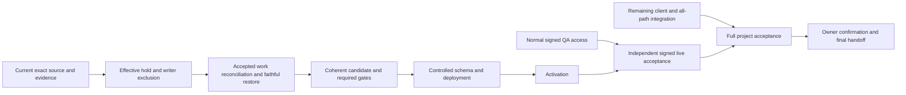

# Ship Verified SupraOS Agent Workflows

## Resumed execution — 2026-10-04 UTC

**Current checkpoint: 09:56 UTC.** The owner extended execution for another five hours at09:14:41 UTC; the new handoff/pause deadline is14:14:41 UTC. The owner briefly paused for reflection and then resumed execution with additional Grok delegation. The complete goal remains all33 plan nodes,16 behaviors and12 supported surfaces: private, authorized, contextual, recoverable and truthful agents. W7 is the immediate partial release milestone, not the definition of full completion.

### Candidate, evidence and delivery state

PR [6160](https://github.com/jtobkin/suprafx-platform/pull/6160) and repair branch `fix/w7-reviewed-release-repairs-20261004` now point to the same frozen, independently reviewed **c3e23f9434780edde5aecf631ae0a6a356e18513**. This successor adds only three dashboard files to6c: a mounted same-plan owner-switch regression demonstrated retained private task data; the repair resets all state by owner/plan, ignores late streams and fences pending actions on unmount. Root independently reran8 mounted tests PASS, changed-file types994 PASS, G11 PASS and Grok G62 scoped audit PASS. The expanded actual Chromium regression still needs Linux CI; local browser crashes before opening a page. Both required c3e contexts are queued. The preceding6c required box-ci contexts started at09:14 UTC and ended without qualification: security failed because the unchanged PostgreSQL amendment contract exceeded its180-second budget (213.012 seconds); build was stopped because security failed. No SQL/assertion failure was reported. The same contract previously passed in65.636 seconds. Both logs are sealed; shared resource contention is being investigated without raising the budget. Unit54,919 PASS/374 SKIP and the new Chromium dashboard390/1440 case PASS are preserved, but required final CI has not passed. The prior6c effective tested CI composition is451b06f539140c105131477537c9bcf0d4a025ab against main1d29ec0972c518d8c44e1d4feb81964128441d19. Fresh main is8c2f14b378b830e993564a843db73a860c7f4715; c3e composes without conflict (merge treec35cb66f43dd264107d84524983b2493b9551939), but its actual CI composition must be read from the new logs. The earlier3c21 security failure (1 failed,54,887 passed,374 skipped) and local successor failures are preserved. Repairs moved four stale catalog references without changing any of the2,580 writer classifications and replaced scanner-confusing buffer constructors without changing PG frame bytes. Exact6c549 catalog34 PASS; three actual pg.Client disconnect phases PASS; final commit-range G11 PASS. Parent2b045 has994 changed types and39 operator checks PASS; its UI/RPC tests passed and its catalog failure is repaired by6c549. Runtime/SQL ancestor817 remains unchanged. **No W7 merge, production SQL installation, deployment, activation or live acceptance is claimed.**

| Capability | Implemented / integrated | Tested / independently reviewed | Release state |
| --- | --- | --- | --- |
| Guarded operator recovery | Mounted CLI preserves original launch identity, observes pg errors through close, and refuses unproven absence |39 scoped operator tests PASS; independent source review PASS; actual private PG17 lost-COMMIT-ACK recovery PASS receipt5a949eb0 | Composedc3e23, unmerged; synthetic guard seam only |
| Head-review RPC | Actual orchestrator sends the declared seven arguments | Supabase serialization tests plus actual PG17/PostgREST14 selected-schema PASS c207eaeeb; old eighth argument rejected, fixed call works, full selected rows unchanged on replay | Composedc3e23; private native evidence published030e10f2 |
| Manual plan edits and cron retries | Authenticated PATCH uses existing durable manual handler; owner/status/version CAS prevents stale edits/retries | Actual-route regressions and scoped TS tests PASS; independent review PASS; four actual route/SDK/PG race cases and transport package independently source-reviewed; native install/run still UNRUN | Composedc3e23; live acceptance open |
| Dashboard action refusal | Keeps running plan visible while displaying an action failure | Plan-switch leakage reproduced and repaired;5 mounted tests and independent source review pass; actual Chromium test at390/1440 passed in the sealed CI log; overall security gate failed on a separate PG timeout | Composedc3e23; actual Chromium390/1440 case PASS; cross-owner retained-state repair is now committedc3e and independently mounted-tested; expanded Chromium qualification pending |
| Recovery after uncertain provider effects | Refuses unsafe cancellation/early settlement while original work may still run | Unsafe early-finalization proposal rejected; original identity/reservation retained | Missing safe termination/recovery proof and some effect receivers |
| Production release authority | Hard hold/install guards remain refusals | Dated synthetic restore/private tests do not prove a continuous production fence or current-target recovery | External authorization/access and implementation dependencies remain |

The new native receipt **5a949eb04530ea26cf47812c78ca06ef8aecb3559458dae997f3a90742c01eab** proves one controlled private test: relay withholds the COMMIT acknowledgement, first install returns UNKNOWN, same-operation readback recovers, close and fresh replay succeed. Relevant operator/installer source byte parity with6c549 operator/installer was independently hashed. No direct Docker send counter was instrumented; the no-resend conclusion uses stable original identity, relay evidence and reviewed code. Owned resources were cleaned up and the19 unrelated running containers preserved. This does not establish production writer exclusion or installation authority. The earlier original RED6d3 and setup-only failure13e6284b remain preserved; neither was retried blindly.

### Parallel delivery path and ownership

- **Integration Codex:** private retry-CAS first attempt refused before native and cleaned receiptc705b6e6; second attempt setup-only RED is owned by prerequisites. Building existing missing chain_task receivers and their actual producer/settler/cron callers in a separate lane. Original serialization must survive JSONB key reordering; G55 recomputation proposal is not accepted unchanged.
- **Prerequisites Codex:** sealed exact6c CI logs; diagnosing shared PostgreSQL contract timeout and host capacity; other heads hit the same timeout. c3e successor queued without a budget increase. Now owns private retry-CAS fixture override repair after deterministic npm setup RED.
- **Verification Codex:** G54 cross-owner retained dashboard data was reproduced in the mounted real component (5 PASS/1 FAIL). Narrow separate-lane repair resets scoped state and fences late callbacks;8 mounted tests and994 changed-file types PASS; expanded real Chromium regression pending on c3e CI. Only independently reviewed blocker fixes may enter the frozen successor.
- **Root:** reviews findings, composes demonstrated fixes, freezes exact candidate, tracks blockers, publishes the plan and performs independent evidence checks.
- **Grok:** four read-only slots, continuously supplied with distinct useful release-path tasks.Grok job history is recorded in the dispatch ledger; job totals are neither concurrent-worker counts nor acceptance counts. Current work covers actual DB race-test review, complete durable receiver dependency design and trailing source audits. Unsafe early-finalization and hash-chain-only completion proposals were rejected. Scope findings remain explicit; audit tools do not provide production browser or provider acceptance.

The dependency chain is: finish reviewed demonstrated repairs and missing integration → final immutable-source qualification → supported continuous writer fence, accepted-work accounting and current-target recovery → required candidate gates → guarded merge/install/deploy/activation → independent authenticated live behavior and recovery tests. Work continues on independent steps while external requests are pending. The refreshed dependency graph runs exact candidate CI, private retry-CAS qualification, missing receiver integration and external authority requests independently, then joins them at the guarded release and live-verification steps. Missing normal QA invitation and local browser startup policy remain access blockers. Linux CI passed the new action-error dashboard test at390/1440 on exact6c composition451b; the newly demonstrated cross-owner retained-state repair still needs its own Chromium qualification. The owner fence request is unanswered. A fresh read-only `codex login status` reports signed in, but both bounded C1 control/isolation probes still fail managed-policy startup before a fake-provider request. Sign-in alone does not resolve that prerequisite; no bypass was attempted. No user confirmation tests substitute for independent verification.

### Fresh-computer locations and access

- Source: private `jtobkin/suprafx-platform`; PR branch `fix/w7-reviewer-release-20261003` and repair branch `fix/w7-reviewed-release-repairs-20261004`, both exactc3e23f9434780edde5aecf631ae0a6a356e18513. Historical composition branch `fix/w7-qualified-operator-composition-20261004` remains3c21 and must not be mistaken for the candidate. Read AGENTS.md, CONTEXT.md, build protocol, atlas and delegation playbook before work. Use isolated lanes; never reset the dirty shared checkout.
- Host operator: `scripts/qa/w7-operation-gate.py`; installer: `scripts/qa/w7-bootstrap-install.js`; permanent tests: `scripts/qa/test-w7-operation-gate.py`, `test-w7-bootstrap-install-real-pg.cjs`, `test-w7-proxy-hold.py`; hold observer: `w7-proxy-hold.py`. Contract: `docs/agent-run/w7-operation-bound-release-admission.md`.
- Runtime: `lib/vms/workflows/`, `app/api/workspace/plan/execute/route.ts`, `app/api/cron/mc-coordinator/route.ts`; detailed journal/Conversations paths remain in the historical handoff below. SQL: `supabase/migrations/20261003120000_mc_task_claim_settlement{,_VERIFY,_ROLLBACK}.sql`. Forward7af383e3/VERIFY4d45188d are unchanged; not installed in production.
- Local canonical plan: `/Users/joshuatobkin/qa-evidence/supraos-execution-plan-20261001/plan.json`; root evidence: `qa-evidence/resume-delivery-20261004/`; lane sources/receipts: `qa-evidence/resume-delivery-20261003/{integration,prerequisites,verification}/`. Frozen root lane: `qa-lanes/w7-qualified-operator-composition-20261004`; root repair lane: `qa-lanes/w7-reviewed-release-repairs-20261004`; catalog repair lane: `qa-lanes/w7-catalog-owner-route-prerequisites-20261004`; prerequisite lane: `qa-lanes/w7-review-rpc-prerequisites-20261004`. All unmerged lanes remain preserved.
- Grok frozen read-only snapshot, per-file hashes and current dispatch plan: `qa-evidence/resume-delivery-20261004/grok-release-audits/`. Native RED/recovery/cleanup evidence: `integration/bootstrap-commit-ack-private/receipts/`. The original failure/readback/cleanup packet is now portable in private commit1591670bcbe18654f6e81fe5826e3e4b6ae5daf7 at docs/agent-run/evidence/pgwire-recovery-repair-20261004/:40 exact text records, G11 and remote byte verification PASS. The new PostgREST proof is published at private commit030e10f2ae56bb462f203cd4bb5f8f0c1b4d3a68, path `docs/agent-run/evidence/f5-postgrest-qualification-20261004/`. Read INDEX.md and PORTABLE-MANIFEST.json; the archive and scanner-flagged deterministic test fixture are explicitly excluded. Host-probe PASS packet and exact archive are now published at private commit **05fff89f811a70fa21ed4abddea62604d3e1a416**, prefix `docs/agent-run/evidence/hostprobe-recovery-qualification-20261004/`; all17 files and archive hashes verified, plaintext and archive contents secret-scanned. The same commit adds `f5-postgrest-qualification-20261004/FRESH-COMPUTER-ADDENDUM.md`, explaining exact source fetch and unavailable/excluded fixture limits. Current scanner-clean retry-CAS package is local at `qa-lanes/w7-retry-cas-private-evidence-20261004/docs/agent-run/evidence/w7-retry-cas-private-20261004/`, published and remotely byte-verified at private commit **a92fd94015cd0fbe272b606e9767250776cb2419**. Exact archive03f007c5, inner e4db3bb5, outer724ac6e0, idle5d3158bc and manifestb94e1c2c bind35 hashes,31 candidate source files and222 exact dependency records. The earlier archive3374ec1e/inner ef69199f/outer c80b predecessor remains under `qa-evidence/resume-delivery-20261004/integration/mc-retry-cas-private/`; do not stage it accidentally. Immutable stage60ed0bae was independently checked. One authorized run was refused before native by fresh idle admission (`managed_deploy_or_start_active`, count2), original command084d1c0c and readback15fd6967. Native CAS remains UNRUN. The one-use claim and refusal are retained. Exact owned scratch was subsequently removed after owner/no-run-file checks, cleanup receiptc705b6e6. A second stage1a107eff used fresh owner1edbe6da and passed immediate admission79180601. Its one native invocation then failed before product tests: derived package omitted the production `next.postcss` override, so unchanged lock postcss8.5.25 conflicted with dependency declaration8.4.31. Original native command8e5b640e, failure387bd727 and stderr3f6da556 are retained. Census27fc50cd proves zero owned containers/networks and19 unrelated running containers; exact owned transfer scratch is retained. Prerequisites owns a separate fixture-only successor preserving every dependency version and the full exact production override map. No native CAS PASS. Any later attempt requires independently reviewed new source, a new sealed stage and fresh admission; no automatic resend.
- Portable private evidence branch: `docs/paused-workflow-handoff-20261002`. Commit8226c0be contains32 complete text evidence/source records at `docs/agent-run/evidence/composed-workflow-qualification-20261004/`. Commita47bdd9b008559c99b08fc6a4132a3584347e475 contains three exact archived fixture inputs plus manifest at `docs/agent-run/evidence/exact-private-fixture-bundles-20261004/`, expanded-source scanned and remote byte-verified. Commit-ACK archive6587 is the failed6d3 source, not PASS. The restore archive8c25 was not published because its metadata triggered the scanner; no exception/bypass. Earlier commitsbd973991,616e9ff1,b5154072,f1b8c94f preserve preceding evidence with declared limits.
- Public canonical documents: [handoff](https://github.com/jtobkin/supraos-workflow-plan/blob/main/Ship-Verified-SupraOS-Agent-Workflows.md), [checklist](https://github.com/jtobkin/supraos-workflow-plan/blob/main/SupraOS-Workflow-Plan-Checklist.md), [dependency plan](https://github.com/jtobkin/supraos-workflow-plan/blob/main/Delivery-Path-Release-Plan.md). Private source/evidence requires repository access; public documents require no sign-in. Current publication is independently byte-checked after upload; browser rendering remains a separate unavailable gate.

---
<!-- END CURRENT 2026-10-04 CHECKPOINT -->

## Historical checkpoints — superseded by the current section above

## Resumed delivery checkpoint — 2026-10-03 UTC

Implementation is paused at the owner-requested cutoff, recorded 2026-10-03T19:43:25.337791+00:00. The final 90-minute window began at 18:13:12 UTC and ended at 19:43:12 UTC on 2026-10-03. All owned host runs are terminal with verified cleanup; no uncertain remote command remains. Only documentation publication and access verification followed the pause. This is the current checkpoint; dated material below is retained history.

### Start here on a new account or computer

The public [checklist](https://github.com/jtobkin/supraos-workflow-plan/blob/main/SupraOS-Workflow-Plan-Checklist.md), [dependency plan](https://github.com/jtobkin/supraos-workflow-plan/blob/main/Delivery-Path-Release-Plan.md) and [detailed handoff](https://github.com/jtobkin/supraos-workflow-plan/blob/main/Ship-Verified-SupraOS-Agent-Workflows.md) are the canonical navigation. They require no sign-in. The older Sites dashboard is not the authoritative latest state.

Application code is in **private** `jtobkin/suprafx-platform`. Its private documentation/evidence branch is `docs/paused-workflow-handoff-20261002`; the detailed documents and machine-readable plan live under `docs/agent-run/handoffs/`. Public documentation does not grant access to private code, CI, servers, secrets or a signed SupraOS account. Use the new account's normal repository and infrastructure permissions. Do not copy production environment files, session cookies, private keys or old database escrow into a new session.

### Goal and definition of finished

Deliver reliable SupraOS agent work across all agreed execution paths, including background runs and System Workflows. A user must be able to start useful work, see an honest durable result, approve the exact action where required, recover or cancel safely, and resume the original work without a duplicate external action or charge. Owner, project, workspace and audience boundaries must hold throughout.

The agreed scope remains **33 project nodes, 16 behaviors and 12 execution surfaces**. These are scope counts, not an estimate of code completion or remaining effort. A small deployed fix, an unactivated feature or a passing isolated fixture is progress only.

Finished means the agreed behavior is integrated into real production callers, passes the mandatory tests and independent review on immutable source, is merged and deployed through normal controls, is activated where required, and passes independent signed live acceptance with tested recovery. UI behavior requires an actual browser or Playwright check before requesting user confirmation. Positive, foreign-owner/revoked, failure, cancellation, lost acknowledgement, unknown outcome and recovery cases remain part of acceptance. Never remove tests, raise fixture budgets, bypass permissions or weaken release controls to make a run green.

The 12 surfaces are personal chat (full/fast/direct), Telegram, mounted/legacy voice, headless agent execution, delegation, coordination System Workflows, generic Workflows/Routines, Plan Graph/background Build, workspace plans/MC cron/organization tasks, scheduled research/competitors, Rooms manual/scheduled/huddle, and shared/company/visiting audiences. iMessage remains deferred; WhatsApp is excluded.

The 16 behavior families are quiet morning briefings; owner-voiced drafts without implicit sending; shopping/screenshots under grants; approved real calls; bounded initiative; same-computer takeover/handback/replay; loose-end tracking; mail retrieval/review/send/edit/snooze/ignore; two-owner consent/revocation/concurrency; unique mailbox and same-conversation inbound routing; exact payment instrument and receipt; truthful progress/history; bounded preferences/memory; honest provider/evidence/unknown stops; quiet hours/batching/cadence/urgency without duplicates; and context-appropriate tone/length.

### What was already shipped

These are earlier partial releases, not claims that all signed journeys are finished:

| Capability | Merged/deployed evidence | Remaining acceptance |
|---|---|---|
| Conversations owner-switch privacy repair, PR6158 | Merge `c7f79f2563febec1ac10befb6c33e0670cbd9ebe`; canonical deployment/public denial receipt `d30cbe2c`; unsigned deployed 390/1440 Chromium `66b344a8`; actual wallet-boundary fixture reproduced and repaired the late-owner response defect | Normal signed owner/foreign-owner switch on deployed app |
| Memory Promotion, PR6149 | Merge `ef86349dbda78e1d1e046dcd477dbe06f80f7e8a`; required security/build and actual email Chromium passed; canonical deployment/public checks `7b8bb2de` | Signed original-run promotion and owner isolation |
| Durable pause/recovery, PR6127 | Merge `9fac...`; exact-source native 14/14 and strict cleanup passed; deployment observed | Signed original-run pause/recovery |
| Competitor Watch, PR6066 | Guarded merge `fc8e...`; canonical `22d8...` deployment and public denial checks | Actual authenticated worker/card recovery |
| Other preserved partials | PR6124 System Workflow identity, PR6121 AgentOrb, PR6053 Mobile Chat, PR6146 canvas and PR6148 reason-3 server/artifact work | Each keeps its stated acceptance limits; reason-3 code deployment does not perform an L1 upgrade |

Later independent deployments have advanced serving main. The last bounded read-only image observation in this window was image `7e80809d2f1b9203cf69c155a9c36a902049d701524a88c7b159d69a70487765`, public build `8b6b3525a2d9db8b0b0409f5d0498aad4d76d523`. Re-read actual deployment state before acting; this is not the W7 candidate being live.

### Current release candidate and what blocks shipping it

[PR6160](https://github.com/jtobkin/suprafx-platform/pull/6160), remote branch `fix/w7-reviewer-release-20261003`, is frozen at **`817061098742daec71dbb4198a5fd0d65d738d17`**. The local composition branch is `fix/w7-release-blockers-root-20261003`, in `qa-lanes/w7-release-blockers-root-20261003`; do not confuse it with the remote branch. Required security passed all 51 steps and production build all 7 steps on the same reviewed composition. The security run recorded 4,404 files / 54,610 passing tests, with its existing skips visible. Passing these gates does not authorize premature schema installation.

The nearest useful release milestone is a completed workspace plan producing its durable owner journal, reviewer feedback and memory effects through real manual, automated and recovery callers, with the original claim retained across lost acknowledgements and no duplicate external attempt or charge. The schema/operator prerequisites are part of delivering that capability.

This candidate contains the inherited workflow stack, including scheduled continuation and exact-action authority. It is not a standalone four-reviewer patch. It remains unmerged, undeployed and unactivated. Auto-merge is not enabled. Do not substitute current main, cherry-pick an incomplete slice, or repeatedly restart qualification because unrelated main changes arrive. Only a demonstrated release blocker may change the candidate; retain the failure, repair narrowly, review independently and requalify affected behavior plus required final gates.

The immediate production blockers are an effective ingress hold; continuously enforced exclusion of every relevant writer; accepted-handler/effect reconciliation; a faithful protected backup and tested recovery on the actual installed target; one coherent operation-bound schema/runtime deployment and activation; and normal signed QA access. A local container census, alternate database connectivity, synthetic restore or a closed new DB gate alone does not prove these controls. Existing images do not call the new gate. Privileged database backends and external credential holders cannot be assumed excluded.

### Qualification evidence at this checkpoint

All native runs below used isolated owned containers and synthetic claims/provider responses against a dated captured schema. The relevant production source was pinned and parity checked; this does not make the fixtures live-owner acceptance.

| Proof | Result / receipt | Exact limit |
|---|---|---|
| Four reviewer destinations and durable original ledger | PASS `52b3f5ab`; saved readback `89823033` | Four authored reactions; same-claim race; lost reservation/checkpoint/reaction ACKs; legacy policy, provider uncertainty/invalid usage and House Rules denial. Fourteen loopback provider requests; no real customer/provider account |
| Five memory receivers | PASS `97db67c4` | Five memory rows and five queued attestation outbox rows; conversation source and lost-insert ACK recovery. Queued outbox is not external attestation delivery |
| Actual journal GET/reader/Conversations projection | PASS `a224e4b9`, real Chromium at390/1440 | Saved native rows and actual source; synthetic authentication/database transport/wallet and unstyled shell. Four comments visible; no overflow/errors/unexpected hosts. Not signed live or full production CSS |
| Exact817 forward/VERIFY/ROLLBACK packet | PASS `26b90838` | Full schema/owner/ACL roundtrip/reapply, direct SQL service/anon ACL checks (not HTTP anon JWT qualification), retained reviewer-history and operation-history rollback refusal. Isolated dated capture; no target installation |
| Aggregate budget and concurrent original reservations | PASS `01a01e20` | UUID+legacy aggregate0.6+0.6 is denied under cap1; two distinct originals race under cap0.000398, exactly one reserve. Dropped committed reserve ACK remains held with no provider call/resend |
| Historical admission-day accounting | PASS `52cd7edd` | Synthetic prior-day admission, actual current-clock checkpoint, dropped committed ACK, prior-day usage and unchanged current-day aggregate; replay unchanged/no extra provider. Not an elapsed midnight/hourly-window test |
| Alternate maintenance connection | PASS `7e6b14ad` | Read-only connection to template1 as existing postgres role; identity, rollback and close checked. Does not prove writer exclusion, privileged backend termination or recovery after a fence |
| Operator stop journal source | Published `f12125cc`;16 tests and independent review PASS | Actual CLI is still disabled until qualified effective hold and closed-generation proof. Three unsafe history/preexisting-stop baseline REDs retained; no production stop |

**Cron native acceptance remains open.** V1 failed on an inner packaged-file hash (`acf340b4`); v2 failed because nonroot Node could not read its runner (`5593423e`); v3 passed those setup steps but the focus helper refused the wrong synthetic original (`f6c3e215`) before any GET tick. The wrapper had selected the delivered review claim instead of the separate lost-reservation-ACK claim. Each failure and cleanup was preserved. V4 is independently source-reviewed and its local regression passes against the sealed `52b3` output/readback; it selects and validates `reserveAckLoss.claim` for both input and result, retaining the delivered claim for saved-row export. **V4 has not run natively.**

**Synthetic restore qualification failed and remains open.** The first run (`dab6246c`) stopped before dumping on an ambiguous PostgreSQL internal-char concatenation. The narrow explicit-cast successor reached successful globals/custom dump and single-transaction restore commands, then failed the unchanged original-row/catalog/ACL/role equality check (`30ced9fa`). The retained log does not identify the differing component; its cause is unknown. Receipt-first replay was not reached. Do not describe this as a passing restore or guess that it is merely ACL ordering.

The reviewed diagnostic successor retains the strict equality assertion and emits only bounded component names, before/after hashes and row counts into a fsynced journal and sealed stderr before refusing. Its local regression is2 RED against the preserved predecessor and2 GREEN against the successor; **the diagnostic successor is unrun**. It is the next restore test after fresh host admission, not an automatic retry of an uncertain operation.

Exact next-session fixture locations, relative to `qa-evidence/resume-delivery-20261003/`:

| Package | Frozen wrapper / dispatcher / archive | Next action |
|---|---|---|
| `verification/reviewer-cron-native-successor-v4/` | `d7a1e269` / `7b49f4d2` / `ca18eb32`; local regression `71b89f52` | One reviewed native run after fresh admission; preserve all prior failures; actual two GET ticks must prove no second provider attempt |
| `integration/private-memory-restore-diagnostic/` | `3c32d102` / `2e931e34` / `8c25ca50`; local regression `b432d5c1` | One diagnostic run, inspect exact differing hashes/components, then repair only a demonstrated cause; do not weaken fidelity equality |
| `integration/operator-stopped-current-image/` | `cb5ce2aa` / `d7d8a50f`; actual operator `699a7440` | Reviewed but unrun. Recheck current image/provenance and capacity; use a new window with enough time for bounded transfer, execution and readback. This tests a0a observation, not f121 live stop |

All host runs from this window have terminal outcomes and verified owned cleanup; no uncertain remote command was left running. The new-run queue closed at19:10 UTC to protect the requested pause. The operator rehearsal was not started because its existing complete transfer/readback bounds could extend beyond the window; no budget was shortened to force it in.

Earlier failures remain preserved: duplicate schema replay, duplicate active Guide name, duplicate project/run number, browser archive-list mismatch, cron inner-file mismatch, cron nonroot runner unreadability, and restore catalog type ambiguity. Repairs were narrow and reviewed; failed archives/receipts were not overwritten or called passing. The current candidate's runtime behavior did not change to accommodate these fixture repairs.

### Release stages remain separate

| Capability | Implemented / integrated | Tested / independently reviewed | Merged | Deployed | Verified live |
|---|---|---|---|---|---|
| Earlier privacy, memory promotion and pause fixes | Yes for their bounded repairs | Required gates and stated native/browser scopes passed | Yes | Yes, exact observations retained | Public/unsigned checks only where stated; signed recovery/owner acceptance still open |
| Frozen W7 candidate817 | Real manual/automated/cron callers wired; full operator release chain incomplete | Required CI and listed private native/browser scopes qualified; remaining recovery/operator cases explicit below | No | No | No |
| a0a stopped observation / f121 stop journal | Actual operator CLI mounted; f121 live stop intentionally disabled until effective hold proof | Source review and13/16 local tests respectively; current-image lifecycle rehearsal still unrun | No | No | No |
| C1 client context / C2 project command lines | Preserved source and named callers; remaining clients/transport/integration identified | Scoped evidence only, not all supported clients or installed transport | No for named pending candidates | No for named pending candidates | No full client/project acceptance |
| X4/X5 scheduled continuation | Preserved/inherited source; broader effectful paths still pending | Scoped source/native/browser evidence does not close all graphs or cutover | Held as part of coherent candidate | Uninstalled / inactive | No |

No new W7 production release is claimed by this checkpoint. Closing qualification dependencies advances readiness; it does not change any “merged”, “deployed” or “verified live” cell without its own evidence.

### Exact refs to recover

The current W7 release candidate and operator successors are separate, unmerged lines. Verify every fetched ref resolves to the listed commit before building or replaying evidence.

| Line | Local/source ref | Exact commit | What it contains |
| --- | --- | --- | --- |
| W7 release | Remote PR6160 head `fix/w7-reviewer-release-20261003`; local root composition branch `fix/w7-release-blockers-root-20261003` | `817061098742daec71dbb4198a5fd0d65d738d17` | Coherent W7 runtime, migration/VERIFY/ROLLBACK packet and named callers. Required security51/build7 passed on this frozen head; installation and signed live proof remain held. A stale local branch with the remote name may still point to earlier `390927`, so compare the fetched SHA. |
| W7 stopped observation | `feat/w7-operation-stopped-observation-20261004` | `a0a1988f23687ab2e6573e406d1d2ffb1094a443` | Operation-bound private DB credential escrow and read-only stopped-generation observation. Source-qualified, not activated. |
| W7 stop journal | `feat/w7-operation-stop-journal-20261004` | `f12125cc964ad7d6e3649c8ecd024fffdbd2330e` | Fsynced original web/cron stop journal and no-resend reconciliation in the same operator; actual live stop action stays disabled until an effective external hold can be proven. |
| Canonical C1 client isolation | `qa/project-claude-workspace-binding-20261002`; remote backup `backup/lane-20261003-1322/project-claude-workspace-binding-20261002` | `f6be94d91962c2d4b873eaad2c08f9b43290a599` | Trusted owner/session/project workspace separation in relay and Electron. Claude positive and native project proof are scoped; Codex/Grok, subscribed provider and deployed signed journey remain open. |
| Canonical C2 project commands | `release/reviewed-project-dispatch-20261002`, PR6118 | `d82464efd076c707760e0809f4aa3dccd0150bba` | Project Git command authority through producer, signed poll, execution admission, relay distribution and Electron resource paths; default off/uninstalled. |
| C2 eligible recipient successor | `feat/c2-recipient-eligible-20261003`, PR6141 | `c8d5bbaaffb59115d78bf2ca5a29ea1c3e6a0b40` | Additional canonical recipient/producer binding on C2; neither C2 branch is merged or deployed. |
| Canonical X4 scheduled uncertainty | `codex/x4-main-extraction-20261001`, historical draft PR6054 | `80e77f36f4cbdcaf580b1a8edd267adcc98f2090` | Durable original scheduled-attempt admission/recovery, default-held until schema and cutover qualification. |
| Canonical X5 approval continuation | `qa/x5-combined-acceptance-overlay-20261002`; remote `qa/workflow-authority-selected-release-20261002`, draft PR6129 | `9c3c7bd4e6c4c6ba58d2fa69424424fa84c79365` | Original approved bounded pure prefix/selected leaf and terminal Reject; broad effectful continuation and live cutover remain open. |

An older release-plan table used **local** labels C1/C2 for Competitor Watch cron/card delivery; this publication renames those rows CW1/CW2. They do **not** close canonical client C1/C2 above. The canonical IDs are defined in private `SupraOS-Workflow-Plan.json`; the release-specific labels are in the public `Delivery-Path-Release-Plan.md`.

### Production caller map

- W7 original-claim and reviewer chain: `app/api/workspace/plan/execute/route.ts` is the manual caller; `lib/vms/workflows/plan-orchestrator.ts` is automated; `app/api/cron/mc-coordinator/route.ts` is the recovery caller. `lib/vms/workflows/mc-plan-finish-intents.ts`, `mc-plan-broadcast-journal-effect.ts`, and the reviewer effect/receipt modules bind journal/reviewer work to the saved original claim. `app/api/agent-journal/route.ts` and `getJournalFeed` in `lib/vms/memory/agent-journal.ts` feed `app/vms/conversations/page.tsx`. Browser fixtures are not a live owner session.
- W7 operator: `scripts/qa/w7-operation-gate.py` is the actual CLI for read-only preparation/observation and the **disabled** journaled stop. `scripts/qa/test-w7-operation-gate.py` contains source fault tests. The private Traefik hold helper and its synthetic route fixture are in the retained release evidence; no continuously observed live hold or complete direct-writer exclusion exists yet.
- C1: `packages/supraos-relay/src/start.js`, `pty-session.js`, `project-execution-scope.js`; `electron/ipc/embedded-relay.ts`, `cli-relay-session.ts`, and `lib/supraos-build/cli-relay-worker.ts` carry client context. Preserve personal positive controls and reject unbound resumed command targets.
- C2: `app/api/vms/relay/project-workspace/consume/route.ts`, `observe/route.ts`, session Git and Land routes under `app/api/vms/relay/sessions/[id]/`, the relay Land/command producer and PUT, and Electron routing must agree on one exact owner/session/project/workspace. The C2 branch and recipient successor remain a schema-first, default-off release.
- X4: `app/api/cron/workflow-triggers/route.ts` and `lib/vms/workflows/execution-engine.ts` must retain an uncertain original scheduled attempt before another tick; review `docs/agent-run/scheduled-workflow-recovery-plan-20261001.md` with the SQL packet.
- X5: `app/api/approvals/route.ts`, `app/api/cron/workflow-triggers/route.ts`, `lib/vms/workflows/execution-engine.ts`, and `scheduled-approval-continuation.ts` bind the approved node, original run and selected leaf. Provider uncertainty cannot trigger another attempt.

Full project scope remains the original 33 nodes, 16 behaviors and 12 supported surfaces. A bounded source/native/browser PASS closes only its named part. W7 still needs continuous external hold, accepted-handler/direct-writer exclusion, faithful restore on the installed target, one coherent operation-bound schema/runtime installation, normal signed owner/foreign-owner acceptance and controlled activation. C1/C2 still need full real client/provider and deployed transport qualification. X4/X5 SQL/cutovers remain uninstalled and effectful graph cases open. Root's current checkpoint and exact required CI govern all merge decisions.


### Repository structure and local setup

Read `AGENTS.md`, then `CONTEXT.md`, `docs/AI_BUILD_PROTOCOL.md`, `docs/PLATFORM_ARCHITECTURE.md`, `docs/DOC_MAINTENANCE.md` and the delegation playbook in the exact checkout. Repository instructions can evolve after this handoff. The architecture atlas describes subsystem wiring and tables; the handoff records this release's evidence and outstanding work.

- `app/`: Next.js pages and production API/cron routes.
- `components/`: shared mounted React UI; `app/vms/conversations/page.tsx` is the reviewer/journal surface.
- `lib/vms/workflows/`: durable workflow engine, plan orchestration, admission, original effect receivers and recovery.
- `lib/vms/memory/`: journal/memory projection and reader logic.
- `packages/supraos-relay/` and `electron/`: cloud/desktop provider execution, client/project context and delivery packaging.
- `supabase/migrations/`: numbered forward/VERIFY/ROLLBACK packets; do not replay already installed packets.
- `scripts/qa/` and `scripts/ci/`: operator, native qualification and required release controls.
- `tests/unit/`: scoped source/caller/contract tests. Private native/browser packages live in the evidence locations listed below.
- `docs/agent-run/`: release plans, architecture notes, handoffs and portable evidence.

Frozen817 declares Node `>=22.11.0 <23`, has `package-lock.json` and no `packageManager` field. Use an approved Node22 environment and the exact lockfile; do not copy a different worktree's dependencies blindly. Root's changed-file type check used the existing6144MiB budget. `npm run build` can exhaust this Mac; use the repository's changed-types/scoped-test process locally and the required production build gate. A local typecheck or mock test never replaces a real browser or native acceptance check.

### Parallel execution and next dependency path

Root is the release and state owner. Use three helpers with non-overlapping owned files and one shared delivery path:

1. **Integration:** finish actual callers and narrow release-blocking repairs; every piece names its production caller, integration owner and acceptance test.
2. **Prerequisites:** close infrastructure, schema, access and release-control blockers; classify each as missing code, evidence, access or approval.
3. **Independent verification:** audit exact source and run real native/browser/live checks. The implementer does not supply the sole acceptance verdict.

The shortest remaining release path is: qualify effective hold and all-writer exclusion → reconcile accepted work and prove faithful recovery → compose the reviewed operator/runtime/schema candidate → required gates and controlled installation/deployment → activation → independent signed live owner/foreign-owner and recovery acceptance. Normal QA invitation work can proceed alongside operator work. C1/C2 client/project lines remain separate until they directly join this path; full project scope is retained.

One private fixture host is shared. Transfer/source preparation, code work and review run in parallel, but only one lane owns host mutation at a time. Every handoff requires terminal command receipts and owned cleanup or an explicit retained-unknown state. Keep the original command ID/owner scratch on uncertainty; do not resend an original effect, paid provider request, stop or restore because a response was lost. Preserve the existing 50 GiB disk / 16 GiB RAM admission floors and original container inventory.

Before transferring a fixture, check both outer archive integrity and every inner expected-file hash against the exact archived/staged bytes, source manifest and compiled inputs. Also preflight exact bind-mounted file modes for the nonroot container UID without widening permissions on private schema/config/escrow. The retained cron packaging and runner-readability failures demonstrated why an outer SHA alone is insufficient. Repair only the packaging discrepancy, independently review, then authorize one bounded replay.

Track every task separately as implemented, integrated, tested, independently reviewed, merged, deployed and verified live. At each checkpoint state the usable capability advanced, dependency closed, next blocker/owner/proof and whether work is finishing the current delivery path. Do not translate task counts into an effort percentage.

### Canonical project task inventory

These are the canonical node IDs from the machine-readable plan. After the pause, task states such as “active” mean unfinished work, not a running agent or command. A node marked complete closes only that named prerequisite, not its downstream deployed/live behavior. The release-specific dependency table uses separate local labels. Per-capability release stages and evidence remain controlling.

| ID | Task | Depends on | Current task state |
|---|---|---|---|
| P0 | Scope reconciliation and dependency plan | None | complete |
| B1 | Freeze trusted internal project execution | P0 | complete |
| C1 | Finish client context and history isolation | P0 | active |
| M1 | Complete member dashboard and read projections | P0 | complete |
| W1 | Bound shared DataPackage fallback waits | P0 | complete |
| B2 | Remove remaining private background producer inputs | B1 | review |
| M2 | Join member result and internal message readers | B1, M1 | review |
| M3 | Qualify owner-only Realtime transport | M1 | active |
| J1 | Join server, clients and actual native authority | B1, C1, M2, B2, C2 | review |
| W2 | Notification recipient authority and usable authoring | P0 | review |
| W3 | File operation namespace and destination authority | P0, W6 | review |
| W4 | Named OAuth and raw API authority | P0 | review |
| W5 | Child workflow and bot creation authority | P0 | review |
| X1 | Qualify every supported context entry | P0, X2, X3 | active |
| A1 | Finish global attention and baseline source gaps | P0 | active |
| R1 | Reconcile main, CI and exact release stack | P0 | active |
| R2 | Installed schema, profile and release packet | P0 | active |
| R3 | Writer/effect drain and faithful restore rehearsal | R2, R3B | active |
| I1 | Compose and independently qualify final source | J1, M3, W2, W3, W4, W5, X1, A1, W6, W7, X5 | active |
| D1 | Gated merge and deploy verified code | I1, R1, R2, C2S | active |
| D2 | Activate qualified workflows after compatible rollout | D1, R3 | waiting |
| P1 | Provider and real computer readiness | P0 | external |
| V1 | Stable deployed all-path and 16 behavior acceptance | D2, P1 | waiting |
| U1 | Owner confirmation and final handoff | V1 | waiting |
| W6 | Atomic usage limits for scoped capability grants | P0 | review |
| W7 | Bind workspace tool effects to original tool calls | W6 | active |
| X2 | Confirm System Workflow durable terminal and pause receipts | P0 | review |
| X3 | Refuse zero-row completion in scheduled and direct workflows | P0 | review |
| X4 | Retain uncertain scheduled workflow attempts before another tick | X3 | review |
| X5 | Qualify original scheduled approval continuation | X4, W6 | review |
| C2 | Bind project Git commands to exact workspace | C1 | active |
| R3B | Stage runtime role before candidate schema extension | R2 | active |
| C2S | Install and verify project schema before server rollout | R2, R3, C2 | waiting |

### Resume checklist and proof required

| Order / owner | Work remaining | What closes it |
|---|---|---|
| R0 — root | Read this current checkpoint, exact refs, preserved failures and manifests; inspect fresh PR/CI/deployment state and owned outstanding commands | Exact candidate/source, current host ownership and evidence availability reconciled; no blind rerun |
| R1 — integration + prerequisites | Complete effective hold observation and continuous all-writer exclusion, including web, cron, strategies, privileged DB backends and external holders | Operation-bound proof that admissions are denied after convergence, accepted work is reconciled and no relevant writer can restart or retain authority during the window |
| R2 — integration + independent verifier | Finish operator stop/reconcile and faithful target backup/restore under that hold | Tested normal, failure and unknown paths; exact original identities; protected dump/restore fidelity; no duplicate stop or lost durable receipt; held recovery remains possible |
| R3 — root + independent reviewer | Compose only required operator/schema/runtime repairs with the immutable release | Fresh composition review, no omitted caller/SQL packet, mandatory exact-candidate gates pass; failed evidence retained |
| R4 — authorized release owner | Controlled schema verification, normal guarded merge/deploy, compatible rollout and activation | Exact installed packet and serving image/source independently observed, rollback/roll-forward and hold release prerequisites satisfied |
| R5 — verifier; normal member provides QA access | Signed owner/foreign-owner, revocation, permission, failure, cancel, unknown outcome and recovery acceptance | Real deployed API/browser journeys and durable original receipts; no synthetic session substituted |
| R6 — separate C1/C2/X4/X5 owners | Complete remaining client context, project transport/schema and broader effectful workflow acceptance | Every supported production entry and required behavior independently live verified, with recovery tested |
| R7 — root | Reconcile the full 33-node/16-behavior scope and provide user confirmation tests | All required states closed by evidence; public checklist/plan/handoff current; owner testing confirms already independently verified behavior |



The fixture host, production change window and normal QA identity are distinct dependencies. More isolated test passes do not replace any of them. External approval/access requests remain pending until answered; continue only the independent work meanwhile.

### Access and external dependencies

- **Normal SupraOS QA admission:** an existing member must provide the normal invitation/session path for the dedicated QA identity and a separate foreign-owner control. The earlier request is still pending. The owner reported Claude signed into the app, but the reachable CLI was signed out; that report does not establish a usable authenticated test session. Do not invent an invitation, bypass the invite-only gate or ask anyone to paste credentials.
- **Production change/recovery authority:** existing credentials establish bounded read-only connectivity, not complete writer exclusion or power over privileged platform backends. A qualified hold/recovery mechanism and the appropriate existing platform operator are required before controlled cutover. No production fence, role change, backend termination, data restore or web/cron stop was performed by these private fixtures.
- **L1 compatibility/activation:** server code and artifact deployment for reason3 does not sign a Move package upgrade. Actual deployed-package VM compatibility, controlled platform-admin upgrade with registry preservation and live original/foreign/revoked/paused cases remain pending. The receiver stays held; no transaction was signed or submitted for this acceptance.
- **Provider/client readiness:** managed Codex context, Grok/native client paths and any still-pending external provider configuration remain explicit dependencies. The earlier Stripe Link configuration was reported waiting; do not mark it delivered without new evidence.

### Safe reconstruction commands

Use normal GitHub access and an empty directory. These commands inspect the frozen source; they do not run an installer or deploy anything:

```sh
git clone https://github.com/jtobkin/supraos-workflow-plan.git supraos-workflow-plan
git clone https://github.com/jtobkin/suprafx-platform.git suprafx-platform
cd suprafx-platform
git fetch origin refs/heads/fix/w7-reviewer-release-20261003
git rev-parse FETCH_HEAD
# Verify the printed commit is 817061098742daec71dbb4198a5fd0d65d738d17.
git worktree add --detach ../w7-817-inspection 817061098742daec71dbb4198a5fd0d65d738d17
git -C ../w7-817-inspection status --porcelain
git fetch origin refs/heads/docs/paused-workflow-handoff-20261002
```

If the remote branch has moved, inspect the documented immutable commit and reconcile the successor; do not assume a new head inherits these receipts. Create a new owned branch for any approved repair. Read local/global instructions before editing. Never delete another lane. After merging your own lane, remove its worktree only when the merge is confirmed against fresh main, its status is clean, and no process is running there; use `git worktree remove` without force.

### Preserved evidence and portability limits

The original local evidence root is `/Users/joshuatobkin/qa-evidence/resume-delivery-20261003/`; the canonical JSON is `/Users/joshuatobkin/qa-evidence/supraos-execution-plan-20261001/plan.json`. Worktrees are under `/Users/joshuatobkin/qa-lanes/`, primary repository `/Users/joshuatobkin/suprafx-platform`, verification tools `/Users/joshuatobkin/qa-tools/`. These paths are an inventory of the old computer, not files automatically available after a clone.

Portable reviewed evidence is saved in the private repository:

- [Qualified reviewer/five-memory receipts and sources](https://github.com/jtobkin/suprafx-platform/tree/3b03dc41010b58251211241bca97f904f39bbcc2/docs/agent-run/evidence/qualified-native-workflows-20261003): 37 byte-verified files, including exact original evidence and explicitly derived summaries; omitted raw inputs have hash/size/source pointers.
- [Exact packet, browser screenshots and maintenance connectivity](https://github.com/jtobkin/suprafx-platform/tree/92062601d77fac094af2fc21eb62fd875294f3d2/docs/agent-run/evidence/qualified-packet-browser-maintenance-20261003): 23 byte-verified files, including the actual 390/1440 PNGs. Directory and exact commit-range secret scans passed.
- [Final-window receipts and prepared next-run source](https://github.com/jtobkin/suprafx-platform/tree/43f0c90cbf19c6e4871e865efee1e42c40d49dd3/docs/agent-run/evidence/qualified-final-window-20261003):37 exact-byte-verified uploaded files, including budget/historical passes, cron/restore failures and the unrun cron v4/restore diagnostic wrappers, local tests and READMEs.35 payload files plus manifest/README;40 explicit local-only pointers. Directory and exact two-commit-range secret scans PASS. The metadata-only child synchronizes the completed diagnostic review; executable bytes are unchanged.

The private handoff directory also retains `Paused-W7-Assignment-Successor.patch` and `Paused-Consensus-Mode-Guard.patch`. These are historical recovery artifacts from older source, not patches to apply over817 or a fresh checkout. Current published branches and the exact source table take precedence.

Manifests distinguish exact originals, derived summaries and omitted local files. Original failed scans/logs remain retained; a clean derived upload is not a claim that its raw predecessor scan passed. Large raw captures, transport dispatchers and archives that are not uploaded require an authorized transfer or a new reviewed capture. Do not fabricate an original receipt from narrative, silently substitute a new capture, or copy credentials into GitHub.

The paused checkpoint below is historical. This update supersedes its execution status, not its preserved evidence or unfinished scope.

## Historical paused checkpoint — superseded by current update

Implementation paused at the owner-requested cutoff, **2026-10-02 19:36:59 UTC / 2026-10-03 03:36:59 Hong Kong**. Final documentation checkpoint: 2026-10-02T19:37:18.311500+00:00. The project is not complete. Resume only on a new owner instruction.

This public document is intended to let a new session on a new computer understand the work. It contains no credentials. Public access to this document does **not** grant access to the private application repository, databases, providers, deployment accounts or original workstation. Use the owner's normal authorized access for those resources.

## 1. Goal and scope

Make SupraOS agents consistently private, authorized, context-aware, recoverable and truthful across personal chat, Telegram, voice, delegation, background agents, project/workspace execution, scheduled research, Rooms, Routines and System Workflows.

Agents must use current preferences and relevant bounded memory, skills and lessons; protect private information across audiences; enforce exact permissions; retain original execution identities; recover without repeating uncertain effects; and report outcomes backed by durable evidence. iMessage is deferred; WhatsApp is excluded.

The sixteen behavior goals remain in scope:

1. Quiet morning suggestions, or intentional silence when appropriate.
2. Drafts in the owner's voice, including edit/ignore paths and no implicit send.
3. Visible shopping and screenshots under exact permissions and history.
4. Approved real calls with correct recipient, speech and truthful outcome.
5. Useful initiative without silently broadening authority.
6. The same real computer across Telegram takeover, owner control and handback, with replay refusal.
7. A loose-end shelf supporting add, finish, dismiss and later suppression.
8. Mail retrieval, review, send/edit/snooze/ignore and suppression.
9. Two-owner consent for sharing, including revocation and concurrency.
10. A unique mailbox and inbound messages returning to the same conversation.
11. Purchases bound to exact shop, item, amount, payment instrument and receipt.
12. Truthful completion marks backed by checked history and context.
13. Current preferences and bounded relevant older memory across all surfaces.
14. Honest stops for unavailable sites/providers, missing evidence and uncertain commits.
15. Quiet hours, batching, cadence and urgency without duplicate work.
16. Tone and length appropriate to actual task, calendar and support context.

A partial release is useful progress; it does not redefine these goals.

## 2. What shipped, and what that evidence does not prove

PR6034, workflow dispatch identity and checkpoint concurrency, merged through the normal required-check guard as `2e061a2ec14abf58b63c6f68c925fdfe5ecafd0f`. Deployment was observed on 2026-10-02 at15:12:49 UTC. It derives grant identity from trusted dispatch options, persists the original principal and guards checkpoint writes against stale timestamp/configuration/lease state. No new SQL was applied for that release.

Independent deployed Chromium checked public rendering at390/1440 and unsigned run-list/detail denial. A later deployed-main regression at `e74e3a8961043483db9ceecc377dcfbc7f537b43` passed the same public checks. **Authenticated owner, foreign-owner and recovery acceptance remains open.** A public page loading and unsigned401 do not prove authenticated workflow correctness.

Earlier recorded privacy and deadline releases include PR6032 and PR6062. Their exact historical limits are preserved in the repository handoff. Do not infer completion of every behavior from these component releases.

Latest release watch, **2026-10-02 19:20–19:22 UTC**: PR6053's build failed with recorded ENOSPC while its security gates were running; PR6107's two checks had failed; PR6066, PR6121 and PR6124 had genuine queued checks. PR6066 also reported a current-main merge conflict. None of those five exact heads was eligible for the normal guard. The CI queue had71 queued jobs and2 running, with4,224,036,864 bytes available on the work filesystem. The installed poller still checks memory only; the22GiB disk-admission guard remains source-only. Public `/api/version` reported web commit `e74e3a8961043483db9ceecc377dcfbc7f537b43` at19:21. That stamp is not an image hash or every-service proof. The configured direct SSH alias failed locally on UID501 lookup; the normal public read remained available. No service or queue was changed. A19:24 read-only merge-tree review classified6066 as one conflict in `docs/PLATFORM_ARCHITECTURE.md`: preserve both the main immutable-workflow-grant paragraph and the PR competitor-watch paragraph, plus other main additions. No runtime/test paths directly overlap; indirect integration review and successor CI are still required. The failed6053 build log was copied locally with a hash; neither candidate was modified. Recheck these time-bound observations before releasing.


## Final pre-pause snapshot — 2026-10-02 19:32 UTC

All seven watched heads (6053/6066/6107/6121/6124/6141/6143) remain exact and unmerged.6053 security now passes, but its production build remains failedENOSPC.6066 both required checks now report merge-conflict errors; the atlas-only diagnosis above applies.6107 both checks remain failed;6121/6124/6141 are queued.6143 remains draft with no required contexts yet, not a queued or passing release. No candidate is normal-guard ready. Public web stamp remains e74e3a; host work free space is2,601,758,720 bytes and the disk module is absent.

Six preserved source lanes are clean. The scoped Linux cwd process census is empty. Two local read-only Gitleaks-lookup shell processes were identified by their owning agent, then individually terminated with SIGTERM; both were confirmed exited. No test, CI job, service or container was stopped. The private canonical package contains `Timed-Pause-Final-State.json` and `Owned-Inspection-Cleanup.json`; the earlier snapshot intentionally preserves the pre-cleanup PIDs. Raw artifacts remain on the original workstation.

## Work completed during the timed run

The owner requested the 2.5-hour run at **2026-10-02 17:06:59 UTC**, with an implementation stop at **19:36:59 UTC**. PR6034's deployment happened before this window. The final release observation for this window recorded **no additional production deployment from these session lanes**; do not present the source work below as newly live capability.

| Delivery dependency | What advanced in this window | What remains |
| --- | --- | --- |
| Eligible project recipient | Actual producer repair qualified and published as draft PR6141; it no longer lets a newer incapable relay hide an eligible recipient. | Required gates, predecessor6118, schema/operator/client rollout and actual authenticated transport. |
| Original workflow tool execution | Existing trusted identity/provenance components were composed into actual supported callers and qualified on frozen9070. | Durable claim-bound settlement and owner-facing original-run recovery; full supported-path live acceptance. |
| Truthful uncertainty UI | Actual Chat SSE/Bubble and owner Mission Control waiting behavior exercised in real Chromium at390/1440; owner82ad independently replayed. | Fixtures use synthetic authority/provider inputs; no authenticated live or atomic-settlement claim. |
| CI infrastructure diagnosis | Real ENOSPC failures preserved; FIFO queue and actual jobs inspected; draft6143 adds tested disk admission to the actual poller. | Safe capacity recovery, exact required gates and reviewed host installation. No disk was reclaimed by the repair. |
| Portable continuation | W7 partial, diagnostic and browser source are Git-published; current public handoff/checklist and private evidence summaries identify exact hashes and dependencies. | The final checkpoint preserves remaining blockers; exact publication access is checked independently after upload. |

This progress closes specific source and evidence gaps. It does not support a percentage of full project completion.

## 3. Frozen release stack

Repository: [jtobkin/suprafx-platform](https://github.com/jtobkin/suprafx-platform), private. PR/source links require repository access.

| Candidate | Exact source | Purpose and status |
| --- | --- | --- |
| [PR6124](https://github.com/jtobkin/suprafx-platform/pull/6124) | `2e7d34c79b77ddbeb4fc74e14681de37c37d096a` | Original outcome holds; next no-new-SQL release milestone. Required CI pending at this checkpoint. |
| [PR6127](https://github.com/jtobkin/suprafx-platform/pull/6127) | `00cb9c8e9b97ea53b7e6c5c623579121a5b5705a` | Pause receipts; draft stacked after6124. |
| [PR6123](https://github.com/jtobkin/suprafx-platform/pull/6123) | `8415b13a51751928529a27d54b2b8490ff2bfa4f` | Original scheduled approvals, including a narrow demonstrated main-conflict repair. Draft; schema-first release prerequisites open. |
| [PR6129](https://github.com/jtobkin/suprafx-platform/pull/6129) | `9c3c7bd4e6c4c6ba58d2fa69424424fa84c79365` | Actual API/bot/child authority and approved selected pure continuation. Draft stacked on6123. |
| [PR6132](https://github.com/jtobkin/suprafx-platform/pull/6132) | `2b68ff4d0dbeb15032cb7b03fa1cabd4ef406350` | Owner-private workflow storage, exact operation permissions and uncertain upload recovery. Draft stacked on6129. |
| [PR6138](https://github.com/jtobkin/suprafx-platform/pull/6138) | `227de4f57e35cf111788f8bfca4e50a7d75342f5` | Ordinary email recipient authority, owner-only output destination and approval recovery. Draft stacked on6132; source qualified, required CI enqueued once. |
| [PR6141](https://github.com/jtobkin/suprafx-platform/pull/6141) | `c8d5bbaaffb59115d78bf2ca5a29ea1c3e6a0b40` | Eligible project recipient selection; qualified draft successor to6118. Required CI queued; inherited rollout prerequisites open. |
| [PR6118](https://github.com/jtobkin/suprafx-platform/pull/6118) | `d82464efd076c707760e0809f4aa3dccd0150bba` | Separate project dispatch/schema candidate. Not part of the workflow stack above. Seven project packets and operator/client rollout remain prerequisites. |

Additional release candidates from the private canonical checklist remain in scope:

| Candidate | Exact source | Recorded qualification and next gate |
| --- | --- | --- |
| [PR6053](https://github.com/jtobkin/suprafx-platform/pull/6053), mobile Organization Chat | `a4015eee37f43485e638e875ebe3768c3413fd0b` | 53 scoped checks including Chromium at1200/768/390/320 and independent source review; required build remains failedENOSPC; security gates passed before the final19:32 snapshot. No release or deployed acceptance. |
| [PR6066](https://github.com/jtobkin/suprafx-platform/pull/6066), Competitor Watch publication recovery | `742d8e57d6d8875ca9d6c63b9fdaad449576ae3e` | 11 focused/native checks, actual card Chromium390/1440 and independent review; both required checks now report the current-main merge conflict. Independent19:24 review found only an architecture-document conflict and no directly overlapping runtime/test paths. Retain both documented changes, correct stale browser-pending wording, then independently review the successor and pass its required gates. Deployed worker acceptance remains open. |
| [PR6107](https://github.com/jtobkin/suprafx-platform/pull/6107), opted-in owner DB runtime role | `2d325c60586827fc5fd55f10dbfcf5cd0ee02ff9` | Scoped source evidence exists; both required CI contexts failed with ENOSPC. Repair capacity and rerun exact source; no merge/deployment claim. |
| [PR6121](https://github.com/jtobkin/suprafx-platform/pull/6121), AgentOrb callback cleanup | `dcbacab2afbc69b72e7e6a47a4c2188adfe859fd` | 11 root checks including Chromium390/1440 and source review; required CI and deployed browser checks pending. |

These are unmerged, undeployed candidates.  Re-read live GitHub state before any release action: the table is a timestamped checkpoint, not permission to assume a check passed.

**Never merge a stacked PR into another frozen candidate branch.** Release the predecessor, retarget the successor to main, independently inspect any real conflict, and require the unchanged normal release gates.

## 4. Current email and storage work

Storage candidate6132 restricts actual file-read/file-write to the owner's private `vms-workflow-files` namespace and exact operation grants. Foreign owner/bucket, traversal/encoded aliases and oversized destinations refuse before Storage. W6 receipts bind admission to the original trusted principal. A lost upload reply or in-flight deadline holds an unknown outcome and stops downstream execution; it does not replay the upload. Permission approval does not execute the workflow. The actual Settings card wraps long destinations on phones.

Email candidate6138 resolves interpolated To/Cc/Bcc before exact W6 recipient admission. It passes the actual Gmail attempt callback, holds uncertain sends and stops downstream edges, while retaining existing scheduled-continuation behavior. Its actual owner Settings/API saves exact recipient permission without sending. Read-only status recovers an uncertain decision. Owner-only Resend output rejects a stale saved recipient override; this does not claim exactly-once Resend recovery.

Email source qualification:152 mixed PostgreSQL/PostgREST, unit, local Gmail SDK and mounted browser checks across11 suites. The final changed11-case approval suite was replayed on exact227de; other ten suites retain identical runtime/test blobs. A separate independent13-case run overlaps that set and must not be added as13 new unique tests. Final scoped types114, focused16 and pinned Gitleaks full publication range106 commits passed. Browser checks use actual mounted Settings at320/390/1440, actual Bcc visibility before and absence after account switch, committed database acknowledgment loss, application acknowledgment loss and every HTTP reply dropped after durable approval.

The socket-loss browser case observed multiple raw POST attempts from transport retransmission, but one application dispatch and one new durable grant. Status-only recovery did not issue another application decision. This is real local transport/database/browser evidence, **not** authenticated live Gmail or deployed wallet proof.

## 5. Immediate parallel lanes

The recipient-selection repair is now frozen and published as PR6141, exact `c8d5bbaaffb59115d78bf2ca5a29ea1c3e6a0b40`, on project predecessor6118. It filters connected project-capable relays before ordering and excludes null heartbeat/empty token entries. Ordinary dispatch remains unchanged; SQL retains final server-clock freshness and authorization. Runtime bytes are unchanged since2c40; the final commits add complete producer tests and a narrow test-only typing repair.

The final source has13/13 captured PostgreSQL/PostgREST controls,20/20 canonical tickPlan tests,52 affected types and a75-commit publication secret scan. The actual extracted deliverDispatch producer seals the original reviewed payload and recipient through real SQL before a synthetic Realtime acknowledgment. Denial and post-selection revocation cause no broadcast. These tests do not establish mounted Realtime or live project delivery. Source, schema, operator, client rollout and live acceptance are tracked separately.

W7 now has a complete selective source composition, but remains blocked for release. Runtime `9070a51d5236515429db08551473066f81d7d850` adds retained original execution identity and a target-independent input-provenance claim before the existing exact W6 target admission. It covers both generated registry and legacy MCP shim, supported Chat/headless/Routine callers, and saved project-task claim producers. Chat stops after an uncertain workflow result and replaces premature completion text. Headless execution reports failure; Routines do not re-offer an uncertain tool through AI fallback. Missing original identity holds instead of inventing a new attempt. Compatibility matters: authenticated callers with accepted submission identity or supported signed-request identity have different evidence from legacy API-key calls without an accepted original, which hold. Voice/viz direct tool allowlists do not advertise these W7 writes. The caller matrix in the private handoff distinguishes those unsupported paths from proven positive execution; do not claim universal W7 availability.

Qualification of those exact bytes: independent native registry/MCP30/30 and compatibility128/128, including real mounted Chromium; canonical Chat117/117; a real Chromium case at390/1440 consumes the actual route-produced failed SSE and shows the original reference without false completion or automatic retry. Chat authentication, provider and tool outcome are synthetic in that fixture. Native tests use real disposable PostgreSQL/PostgREST with a reduced schema and synthetic owner/grants. No live authenticated W7 acceptance is claimed. A crash after the outer provenance claim but before inner effect admission can safely hold an attempt that never produced an effect. The current retained-reference response is not proof of a complete owner-facing original-child lookup and recovery journey. Keep that recovery usability gap open alongside the settlement race. The test-only successor c1f passed651 affected types; full publication secret scanning passed.

A later review found a distinct **project-task settlement race**. An old execution result may arrive after a new executor claims the task. `onTaskFailed` and `onTaskCompleted` do not receive the executed claim identity; they can change the newer task, and completion emits some effects before durable plan settlement. A route reread is insufficient because another writer can win after the reread. Preserved actual cron and owner-route tests fail2/2. This defect also reproduces on exact PR6124, but its implicated production blobs are unchanged from that PR's main baseline and none of PR6124's changed runtime paths calls these handlers. It remains a full-project and W7 blocker; it does not by itself disqualify the separately scoped System Workflow release6124.

The safe partial pre-dispatch fix is frozen at `678d437c009f6cc071e858377551b125a9158a07`: if the saved claim cannot be verified before execution, neither dispatch nor task settlement runs. Focused5/5 route controls and651 affected types pass. Its changed owner waiting UI is now qualified by test-only `82ad9a1328f3b780ce4b3f8e1c25ffe467bc6c32`: actual mounted Mission Control and actual owner execute handler passed real Chromium at390/1440, independently replayed. A separate uncontested route control dispatches once. Authentication, database and provider inputs are synthetic; this is not live or durable-settlement proof. The new test passed10 affected types. The parallel diagnostic branch `3f5da6c261ae0a56ddd6e6dcb3114c7c675fa4f8` preserves the post-dispatch RED. It and partial678d are sibling branches from shared base7e70de93a9, not ancestor/successor; test-only82ad descends678d and does not contain the diagnostic RED test. Do not merge the branches blindly. These are blocked work-in-progress source, not qualified releases. Neither runtime branch is merged, deployed, activated, or authenticated-live verified. Test-only82ad is published as `wip/w7-settlement-blocked-browser-20261003`; its full publication-range secret scan covered118 commits.

Required next repair: a server-retained original claim token, owner-bound atomic settlement with idempotent receipts, and durable recovery for post-settlement effects. Cover cron, owner project execute, `runExecutionCycle`, and direct authenticated workspace plan actions. Unknown outcome, definite failure, successful completion, head-review revision and plan completion all need positive and superseded-claim tests. Do not claim that a new unused helper or an additional read closes the race.

## 6. Production blockers and exact next actions

1. Keep PR6141 and existing release candidates frozen. Close the demonstrated W7/project-task settlement dependency with claim-bound atomic persistence and recoverable post-commit effects; preserve all RED evidence. W7 caller/provenance composition already has scoped qualification, but settlement and full supported-caller live acceptance remain open.
2. Restore CI disk capacity safely; treat the admission repair as a parallel infrastructure candidate rather than a new product acceptance gate. PR6107 and PR6108 both failed their required contexts with ENOSPC. Automatic completed-job cleanup briefly frees space; subsequent jobs consume it again. The installed scheduler checks memory but not disk. The source repair is now [draft PR6143](https://github.com/jtobkin/suprafx-platform/pull/6143), exact `1db4ae74312863476cb79d7db6b73f9bb05ed186`, branch `fix/box-ci-disk-admission-20261003`. It checks the actual work filesystem before each admission, fails closed on an invalid probe, and logs low-space/recovery transitions. Pinned Node22 tests73/73, affected types10, independent review and full70-commit secret scan pass. A read-only probe as the actual boxci user refused a synthetic job with6.17GB available against22GiB required. **The repair is not installed and does not reclaim or reserve disk.** Preserve failures; recover capacity through verified disposable owned artifacts or an authorized host storage operation, then complete exact required gates and guarded installation. No retained worktree was deleted; no container, service configuration, budget, slot count, priority or existing queue entry was changed by this repair. Blind requeueing without capacity risks another infrastructure failure.
3. Release ready no-new-SQL candidates through `scripts/ci/box-ci/merge-if-green.sh`, observe the actual deployed commit, then independently verify relevant deployed behavior.
4. Build/qualify the actual workflow operation in the release operator. The current Money-specific operator does not install these workflow packets. An unused descriptor or a wrapper that merely reaches a refusal is not completion.
5. Establish verified target/CA, one continuous REST/direct-PostgreSQL/Docker/effect exclusion window, old web/cron/external invocation drainage and faithful backup/restore. Wrapper locks alone do not close direct privileged connections or raw Docker writers.
6. Apply only reviewed uninstalled packets, in the qualified operation/order, with same-target ledger/catalog/RLS/ACL/cache readback and compatible web/cron activation. Installed packets must never be replayed.
7. Obtain normal authenticated QA admission through an existing member. The QA wallet cannot sponsor itself; no bypass is authorized. Prior Claude CLI access was signed out. Do not request or paste credentials into chat.
8. Complete independently verified live positive/denied/revoked/failure/recovery journeys and the all-path16-behavior matrix. Provider configuration, including the pending Stripe configuration, remains an explicit external dependency.

Workflow candidate prerequisites include private bucket packet `20261001014500_workflow_files_bucket` plus five ordered workflow packets: `20261001020000_workflow_grant_atomic_admission`, `20261001110000_scheduled_workflow_occurrences`, `20261002100000_scheduled_terminal_approval`, `20261002120000_scheduled_approval_continuation`, and `20261002160000_scheduled_approved_selected_pure`, each with VERIFY. They were last recorded as uninstalled and were not installed in this session. Re-read the actual same-target migration ledger and catalog before applying any packet. W7 itself adds no SQL, but also depends on existing `001_schema_complete.sql`, `361_memory_attestation_outbox.sql` and `367_hash_chain_signature_v3.sql` hash-chain metadata, uniqueness and signing-history contracts. Actual installed catalog/ACL parity for those W7 prerequisites is not established by reduced native fixtures. The existing append path can retain unsigned records; a signed positive test does not mean every runtime record is signed. The project candidate has a separate seven-packet contract; consult its exact source and operator contract rather than combining lists blindly.

W6 is used by manual effects, so default-off scheduling does not make a schema-dependent image a transparent code-only release. Retained originals or grant receipts forbid destructive reverse SQL. Preserve history and a compatible hold-capable image. Never delete history, objects or files to force rollback to pass.

## First actions for the next session

1. Read this handoff and the public checklist, then authenticate normally to the private source repository. Fetch the exact recorded branches and verify hashes. Read repository instructions before editing; do not begin by rebasing every frozen candidate onto moving main.
2. Recheck current GitHub status, the actual deployed version, CI free space and active jobs. The measurements here are historical evidence, not live configuration. Preserve existing failed logs. Resolve CI capacity through an ownership-verified operation; do not delete retained worktrees, production data or running containers to force a check through.
3. Complete PR6143's normal release gates and install the reviewed CI source through `scripts/ci/box-ci/install.sh` only after reviewing its effects against the actual host. The installer copies the poller and library modules and restarts `box-ci.service`; preserve existing configuration and confirm active-job handling first. Verify installed source hashes, low-disk/probe-failure holds, normal queue admission after capacity recovers, and existing budgets/order. A web deployment does not install this host service. Keep this infrastructure repair parallel: do not add its installation as a new product release gate or restart unrelated qualification. A frozen product candidate that independently passes its existing required gates may use the unchanged normal guard.
4. Finish the smallest useful release: exact PR6124 under unchanged required gates, guarded merge, actual deployed commit observation and independent relevant browser/transport checks. Keep the separate MC settlement defect explicit. PR6127 follows after its predecessor and fresh qualification; do not merge it into a frozen feature branch.
5. In parallel, implement the W7 task-settlement repair against the preserved RED source. Preserve the original claim through durable settlement and put external/user-visible effects after committed authority, with recoverable delivery. A unique server claim token is the proposed design; a proven equivalent retained identity may be used if it satisfies the same concurrency and recovery invariants. Reuse existing qualified infrastructure where appropriate instead of adding an unmounted parallel ledger. Independently test every actual producer and old-result/new-claim race.
6. Continue the reviewed schema/operator path and normal QA/provider access prerequisites. Once installed and activated safely, execute the full live acceptance matrix. This includes authentic Telegram takeover, email/calls/purchases and background/System Workflow runs; local fixtures do not substitute for them.

The three parallel lanes should remain implementation/integration, deployment prerequisites, and independent review/verification for this same release path. Keep unrelated improvements outside the frozen candidate. Record each closed dependency and the exact evidence, not a completion percentage.

## Broader project work still required

The release stack above is only part of the full plan. The canonical private JSON tracks 33 dependency nodes and 16 behavior goals; node labels such as “complete” can describe a source component, so read its separate release stages before making a project claim.

| Workstream | Current boundary | What closes it |
| --- | --- | --- |
| C1 client context isolation | Reviewed project/personal workspace isolation and installed Claude loopback tests exist. Codex startup failed managed-preferences synchronization before reaching the test provider; Grok/native and real subscription paths remain unqualified. | Qualify managed configuration, real authenticated clients, resume identity, safe file tools, hooks/skills isolation and personal positive controls. Keep unqualified project execution disabled. |
| B1/B2, M1/M2 audience and background privacy | Component source and scoped checks exist; do not equate guarded pages with direct API or background producer coverage. | Compose exact source, verify all direct readers/producers and prove owner/member/private audience behavior on deployed paths. |
| M3 and J1 real transport | Captured native database and client fixtures cover bounded contracts. Synthetic broadcast acknowledgment is not mounted Realtime proof. | Exercise actual authenticated relay/Realtime enqueue, claim, result, reconnect and original-output recovery across cloud and desktop clients. |
| X1 and A1 every execution entry | Entry census and attention/context components remain incomplete as a joined release. | Prove preferences, bounded memory/skills/lessons, permission/audience, cancellation, truthful outcomes and recovery through each named production caller, including background and System Workflows. |
| R2/R3/R3B/C2S production readiness | Runtime-role, Docker and database observer components exist in separate candidates. The actual continuous workflow/project operation is not qualified. | Target/CA provenance, installed catalog/ACL checks, continuous direct-PG/REST/Docker/effect exclusion, drain, faithful restore, ordered schema and compatible rollout. |
| P1 provider/computer readiness | Stripe configuration is still pending. Mail/DNS, calls, real browser worker and Telegram takeover need actual configured acceptance. | Use approved inputs and normal account permissions to verify real provider effects and recovery; preserve originals and avoid duplicate calls, sends or purchases. |
| V1/U1 final acceptance | Full live matrix and owner confirmation are open. | Independently pass all supported paths and all sixteen behaviors, then give the owner precise confirmation tests with expected results and recovery instructions. |

These are retained scope, not optional follow-up improvements. A new session should use the canonical JSON and exact candidate source to determine what is code, evidence, access, approval or deployment work.

## 7. Code map and fresh-computer bootstrap

Start from authenticated Git access, not copied credentials:

```sh
git clone https://github.com/jtobkin/suprafx-platform.git
cd suprafx-platform
git fetch origin
# Example: inspect the frozen email candidate in an isolated checkout.
git worktree add --detach ../supraos-email-review 227de4f57e35cf111788f8bfca4e50a7d75342f5
cd ../supraos-email-review
git rev-parse HEAD
```

If an exact object is absent, fetch its recorded branch or PR head first and verify the full SHA. For the blocked W7 source, use:

```sh
git fetch origin wip/w7-settlement-blocked-partial-20261003
git worktree add --detach ../supraos-w7-review 678d437c009f6cc071e858377551b125a9158a07
# Separate diagnostic branch includes intentional failing regression tests.
git fetch origin wip/w7-settlement-blocked-red-20261003
```

Do not interpret a published WIP branch or intentionally failing regression as a deployable candidate. Do not substitute whatever main contains today. Read `AGENTS.md`, `CONTEXT.md`, `docs/AI_BUILD_PROTOCOL.md`, relevant `docs/PLATFORM_ARCHITECTURE.md` sections and `docs/DOC_MAINTENANCE.md` before editing. The atlas is large; use targeted sections and actual source callers. Use the recorded lockfile/dependency versions and Node22 (package engines require >=22.11.0 and <23); install with the repository’s pinned lockfile through `npm ci`, then use its local Vitest/Playwright binaries. Obtain PostgreSQL17.11/PostgREST14.18 and Playwright’s matching Chromium through normal package setup. Original workstation `node_modules` symlinks are not portable. Run native PostgreSQL fixtures as an unprivileged OS user with writable private scratch (`boxci` on the existing Linux verifier); `initdb` refuses root, even if SSH access uses root. Do not run native tests against production. In particular, do not perform an unrelated dependency upgrade.

| Area | Repository paths |
| --- | --- |
| Workflow runtime and original authority | `lib/vms/workflows/execution-engine.ts`; adjacent checkpoint, grants, scheduling and continuation modules |
| Exact ordinary email | `lib/vms/workflows/notification-recipients.ts`, `notification-grant-requests.ts`, `outcome-delivery.ts` |
| Permission API and mounted owner UI | `app/api/approvals/route.ts`; `app/vms/settings/grants/PendingRequestsSection.tsx`; page metadata in `lib/vms/page-registry.ts` |
| Workflow tool callers and pending identity integration | `core-extensions/workflows/src/tools/{execute_workflow,update_node}.ts`; `lib/vms/workflows/workspace-tools.ts`; `ToolContext.toolExecution`, `lib/harness/tool-execution-identity.ts`, `lib/harness/tool-provenance.ts`, `lib/extensions/tool-provenance.ts`, `lib/security/retained-chain-payload.ts`; inspect blocked W7 branch, not main |
| Project plan execution and settlement | `lib/vms/workflows/plan-orchestrator.ts`; `app/api/cron/mc-coordinator/route.ts`; `app/api/projects/[id]/execute/route.ts`; `app/api/workspace/plan/execute/route.ts` |
| Project dispatch producer | `lib/supraos-build/plan-coordinator.ts`, especially `deliverDispatch`, recipient selection and broadcast |
| Database authority | `supabase/migrations/`; use exact candidate forward/VERIFY packets and the reviewed operator contract |
| Required release guard/CI | `scripts/ci/box-ci/merge-if-green.sh`, `scripts/ci/box-ci/box-ci.mjs` and adjacent library/runner code |
| Current operator foundation | `scripts/qa/money-release-operator.py`; separate C2 candidates contain additional unmerged controls. Do not assume those exist on main. |
| Canonical status and handoff | Branch `docs/paused-workflow-handoff-20261002`, directory `docs/agent-run/handoffs/` |
| Executable regression suites | `tests/unit/*workflow*postgrest.test.ts`, scheduled-approval suites, project dispatch/recovery suites; inspect each test's native/browser opt-in environment |

Canonical private documents: `Ship-Verified-SupraOS-Agent-Workflows.md`, `SupraOS-Workflow-Plan-Checklist.md`, `SupraOS-Workflow-Plan.json`, `Workflow-Production-Operator-Release-Contract.md`, `Client-Isolation-Managed-Preferences-Blocker.md`, and `Signed-Owner-Workflow-Browser-Verification.md`. Older sections are historical; the newest checkpoint supersedes conflicting old status. Some historical component “complete” labels mean implementation only; consult separate release stages.

The canonical private [machine-readable plan](https://github.com/jtobkin/suprafx-platform/blob/docs/paused-workflow-handoff-20261002/docs/agent-run/handoffs/SupraOS-Workflow-Plan.json) contains all33 task IDs, dependency edges, named owners, source locations, acceptance criteria and separate release states. Its [operator contract](https://github.com/jtobkin/suprafx-platform/blob/docs/paused-workflow-handoff-20261002/docs/agent-run/handoffs/Workflow-Production-Operator-Release-Contract.md) explains the schema and activation prerequisites. Fetch the documentation branch explicitly; an existing local `origin/...` ref can be stale. Read the document's timestamp and `git rev-parse` of the freshly fetched ref before resuming.

Additional portable evidence summaries on that same private branch are `W7-Original-Claim-Settlement-Blocker.md`, `W7-Supported-Caller-Evidence.md`, `W7-Owner-Waiting-Browser-Evidence.md`, `CI-Disk-Capacity-Release-Blocker.md`, and `CI-Disk-Admission-Source-Evidence.md`, `Release-Watch-Timed-Pause.md`, and `PR6066-Conflict-Review.json`. These summaries preserve methods, limitations and hashes; raw logs/screenshots remain subject to the location limits below. Previous detailed checkpoint history is retained in Git, including private documentation commit `251015d4979f289db729f7e329e1ca5befce75fe`; it is historical evidence, not current task state.


## 8. Where evidence and data currently live

These original workstation paths are **locations, not portable dependencies**:

- Main Git object store/worktrees: `/Users/joshuatobkin/suprafx-platform` and `/Users/joshuatobkin/qa-lanes/`.
- Workflow release proof: `/Users/joshuatobkin/qa-evidence/pr6034-release-20261002/`.
- Email source publication and scan: `qa-evidence/w2-qualified-release-20261003/`; transport receipt `qa-evidence/w2-email-native-20261003/independent-receipt.md`; final browser receipt `qa-evidence/w2-independent-approval-20261003/final-227/receipt.md`.
- Storage proof: `qa-evidence/w3-selective-composition-20261003/` and `qa-evidence/w3-independent-acceptance-20261003/`.
- W7 baseline and composition: `qa-evidence/w7-tool-identity-red-20261003/receipt.md`, `qa-evidence/w7-source-audit-20261003.md`, and local diagnostic worktree `qa-lanes/w7-tool-original-admission-20261003/`. Frozen partial678d is published at `wip/w7-settlement-blocked-partial-20261003`; diagnostic3f5 at `wip/w7-settlement-blocked-red-20261003` in the private application repository. These branches were independently fetched/pushed with full publication-range secret scans (114/115 commits); neither has a release PR. Neither is release-qualified.
- W7 claim-settlement design and frozen bundle receipts: `qa-evidence/w7-settlement-20261003/settlement-blocker.md`; caller matrix `qa-evidence/w7-supported-callers-20261003.md`; exact PR6124 inherited-RED receipt `qa-evidence/x2-postdispatch-red-20261003/receipt.md`. Chat/browser evidence is `qa-evidence/w7-held-chat-browser-20261003/receipt.md`.
- Project recipient proof: `qa-evidence/c2-recipient-native-20261003/`; implementation worktree `qa-lanes/c2-recipient-eligible-20261003/`.
- Interactive plan source: `qa-evidence/supraos-execution-plan-20261001/index.html` and `plan.json`. Publication package: `qa-evidence/handoff-20261002/docs-package/`.
- CI capacity proof and source: `qa-evidence/w7-tool-identity-red-20261003/box-ci-disk-receipt.md` and `ci-queue-disk-readonly-20261003.md`; independent review `qa-evidence/box-ci-disk-admission-independent-review-20261003.md`; draft publication packet `qa-evidence/box-ci-disk-release-20261003/`. Candidate source is Git-published in PR6143.
- Timed stop receipt: `qa-evidence/pr6034-release-20261002/scheduled-pause.json`; ongoing coordination: `ROOT-CONTINUATION.md` beside it.

Git-published source is portable. Some raw screenshots/logs, incremental Git bundles and disposable verification checkouts are only on the original workstation or authorized Linux verification host. A new computer must obtain those through the owner's authorized artifact transfer or reproduce them from exact source; do not claim that a local path in this document is downloadable or already present. Published test source and receipt hashes identify what to reproduce. No production/customer data was exported into this public handoff.

Production data is separate from Git. The selected authorized Supabase project holds workflow definitions (`vms_workflows`), workflow results (`vms_workflow_run_results`), durable checkpoints (`vms_execution_checkpoints`), project plans (`vms_execution_plans`, including task claims and version), original hash-chain records (`vms_hash_chain`) and signing-key history. The pending migrations add grant-admission receipts, scheduled occurrence/continuation records and the private workflow Storage bucket. Project relay tables and completion queues live in the same source-defined data layer. Consult the exact migration/operator contract for installed versus pending tables; this list is a code map, not an installed-schema claim.

A new computer gets database and provider access through normal authorized account/configuration setup. Locate the selected project via the existing deployment configuration and verify its identity and certificate provenance; do not infer it from a similar hostname or this document. Production rows, credentials, wallet signing material, provider mail/payment data and customer files are not copied into Git or this handoff. Disposable native test databases contain synthetic fixtures and are not production backups. Existing production backup authority and a role/grant-faithful restore rehearsal remain open.

Native verification used PostgreSQL17.11, PostgREST14.18, cached real Chromium/Playwright and synthetic provider endpoints. The verification host has isolated checkouts under `/opt/box-ci/`; host identity/access comes from existing authorized configuration, not this public document. Retain pinned SSH host verification. Never disable TLS/host checks to regain access. Original macOS Chromium/account issues do not justify skipping browser acceptance.

Representative exact email suite invocation in an isolated checkout with those tools installed:

```sh
CI=1 PG_BIN=/usr/lib/postgresql/17/bin \
POSTGREST_BIN=/path/to/pinned/postgrest \
PLAYWRIGHT_BROWSERS_PATH=/path/to/browser/cache \
node node_modules/vitest/vitest.mjs run \
  tests/unit/workflow-notification-actual-caller-boundary.test.ts \
  tests/unit/workflow-notification-request-postgrest.test.ts --maxWorkers=1
```

Read each suite before running: missing opt-in variables may skip native tests. A green command with skipped required cases is not acceptance. Use scoped changed-types and tests; local full builds have caused memory exhaustion. Required hosted production build remains a separate gate.

## Preserved source and local work at handoff

| Work | Git-recoverable source | Original local lane |
| --- | --- | --- |
| W7 partial guard | `wip/w7-settlement-blocked-partial-20261003` at678d437c009f6cc071e858377551b125a9158a07 | `qa-lanes/w7-predispatch-claim-guard-20261003` |
| W7 diagnostic RED | `wip/w7-settlement-blocked-red-20261003` at3f5da6c261ae0a56ddd6e6dcb3114c7c675fa4f8 | `qa-lanes/w7-tool-original-admission-20261003` |
| W7 owner browser | `wip/w7-settlement-blocked-browser-20261003` at82ad9a1328f3b780ce4b3f8e1c25ffe467bc6c32 | `qa-lanes/w7-owner-waiting-browser-20261003` |
| W7 held Chat verification | Runtime9070a51d5236515429db08551473066f81d7d850 is in the published W7 history; local receipt remains separate | `qa-lanes/w7-held-chat-browser-20261003` detached checkout |
| CI admission fix | `fix/box-ci-disk-admission-20261003` at1db4ae74312863476cb79d7db6b73f9bb05ed186, PR6143 | `qa-lanes/box-ci-disk-admission-20261003` |
| Recipient selection | PR6141 atc8d5bbaaffb59115d78bf2ca5a29ea1c3e6a0b40 | `qa-lanes/c2-recipient-eligible-20261003` |

The final19:32 UTC inventory found these six local lanes clean. They remain unmerged and were retained; a clean folder is not permission to delete an unmerged lane. Relative workstation paths in this table are rooted at `/Users/joshuatobkin`. Their branches can be fetched on a new computer without copying the local worktree. The final process/queue snapshot belongs to `qa-evidence/final-timed-handoff-20261003/`; unrelated CI and production services are not owned by this session and must not be stopped as part of its pause.

## 9. Execution and cleanup rules

Keep one coherent candidate frozen. Change it only for a demonstrated release blocker; preserve the failure, narrowly repair it, independently review and verify affected behavior. Give parallel lanes clear file/checkout ownership. New work must close a named delivery dependency, not accumulate unused helpers.

Track implemented, integrated, tested, independently audited, merged, deployed and verified-live separately. Never turn acceptance counts into code-completion or effort percentages. Continue useful independent work while external approvals remain pending; elapsed time does not grant approval.

The merger removes only its own clean, idle, merged worktree using `git worktree remove` without `--force`. Confirm the PR is merged or HEAD is in fresh main, status is empty and no process runs there. Never delete another agent's folder or use blanket pruning. Preserve raw failed evidence and do not kill processes without verified ownership.

## 10. Definition of finished

Every supported execution path and all sixteen behaviors have sufficient positive, denied, revoked, failure and recovery evidence. Required CI passes on the exact released source. Necessary schemas and capabilities are safely installed and activated. Recovery/rollback is tested without deleting retained history. Actual deployed journeys work without privacy leaks, unauthorized actions, duplicate effects or unsupported success claims.

Only after independent live verification provide the owner specific confirmation tests and the final handoff. Missing provider configuration, normal QA access and release authority remain unfinished dependencies. The timed pause is a handoff boundary, not project completion.
