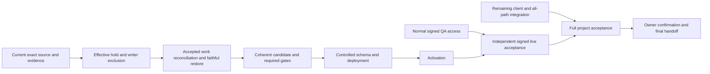
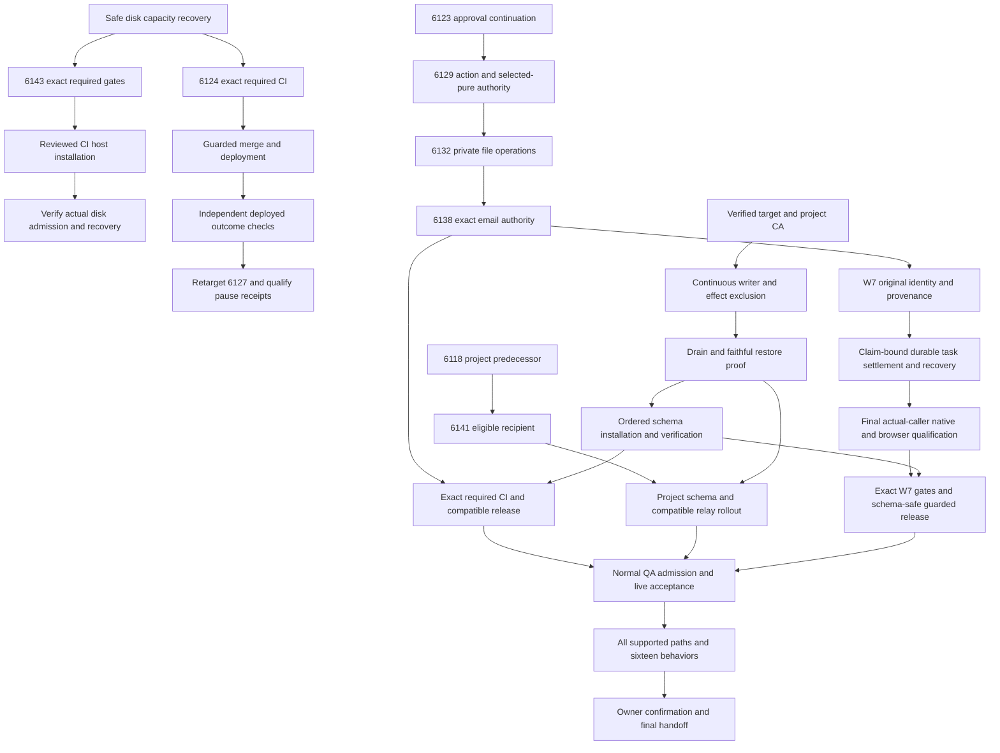

# SupraOS Release Plan Checklist

## Resumed execution — 2026-10-04 UTC

**Current checkpoint: 12:28 UTC. Execution is active until 14:14:41 UTC, when the owner requested a detailed handoff, updated plan/checklist and pause.** This section supersedes dated checkpoints below. It distinguishes source implementation, integration, tests, independent review, merge, deployment and live acceptance. No code-completion percentage is inferred from test or task counts.

### Overall goal and definition of finished

The goal is private, authorized, contextual and recoverable SupraOS agents across **33 plan nodes, 16 user behaviors and 12 supported execution surfaces**. W7 is the immediate partial delivery milestone; it is not the final wave or a replacement for the full scope.

The user behaviors include quiet suggestions, owner-voice drafts without implicit sending, visible shopping/browser work, approved calls, bounded initiative, Telegram takeover and handback, loose-end tracking, mail review and suppression, two-owner consent, unique inbound mailboxes, exact payment instruments and receipts, truthful history, relevant current and older memory, honest failure/uncertainty, quiet hours and cadence, and context-appropriate tone. iMessage remains deferred; WhatsApp remains excluded. Stripe Link configuration remains an external prerequisite.

Supported surfaces include personal chat; Telegram; mounted and legacy voice; headless execution; delegation; System Workflows; generic workflows and Routines; background Build loops; workspace plans, MC cron and organization tasks; scheduled research; Rooms; and shared/company/visiting audiences. Passing one chat path does not establish all-path acceptance.

Finished means the agreed behavior is integrated with named production callers, required gates pass on immutable source, independent review is complete, compatible schema/runtime are merged and deployed, necessary flags are activated, real authenticated browser/transport behavior is independently verified, and cancellation, failures, unknown outcomes and recovery are tested. Permissions, budgets, privacy and original operation identity must remain intact. A source helper, mocked test, synthetic database proof, deployment version or completed partial milestone alone does not satisfy that definition.

### Current release candidate

[PR 6160](https://github.com/jtobkin/suprafx-platform/pull/6160) is frozen at **c3e23f9434780edde5aecf631ae0a6a356e18513** on both `fix/w7-reviewer-release-20261003` and `fix/w7-reviewed-release-repairs-20261004`. It is open, unmerged, undeployed and unactivated. Auto-merge is off. No W7 production SQL has been installed.

**Both required CI contexts now pass:** security51/51 at10:25 and production-build7/7 at10:41. Security includes54,955 passing units (374 skipped), actual Chromium390/1440 and the previously timing-out PostgreSQL contract. Full logs and final receipt are published at private commit **1606c0136a992bd7442601c07294d3ff8cd6a30e**, `docs/agent-run/evidence/w7-c3e-ci-20261004/`; logs are deterministic gzip with raw SHA256 manifest. Security effective merge is `5f9be9ff8e7e0d4d9e2ee622f4e2e8bf60d34112`; build effective merge is `202d8b9bc06430327f7f1706b5383abe0b003639`. Both logs name main `8c2f14b378b830e993564a843db73a860c7f4715` and candidatec3e as parents. Their ephemeral commit IDs differ; original CI tree objects were already removed, so exact original tree identity was not directly observed. Local merge-tree reproduces `c35cb66f43dd264107d84524983b2493b9551939`. macOS Native Land was not run. No test budget, assertion or CI control was weakened.

**Independent partial release:** [PR6179](https://github.com/jtobkin/suprafx-platform/pull/6179), candidate **9b5b236b82e8cc9d276bc662094276d008bc3ddd**, is **merged as09f87ddf1b6e7a596df359358e558df61c2f21e4**. It contains only the dashboard owner/plan privacy repair, mounted/browser regressions and architecture entry; no W7 SQL/backend dependency. Eight mounted tests,13-file changed types, pinned secret scan and independent source review pass. Final security51/51 and build7/7 pass; real Chromium390/1440 passed in CI with synthetic auth/transport. Build effective merge18b1ad08 combines9b5 withmain7ec9. Root preserved both full logs and checked the intervening Desktop-menu change did not overlap these files. Canonical deployment09f87 was independently observed before/after public Linux Chromium390/1440 checks at11:51: ordinary sign-in, no overflow/page errors, anonymous plan401, settled screenshots visually inspected. Initial immediate screenshots were blank during entrance animation and are preserved without claiming visual PASS. Full CI and public browser evidence is portable at private commit016f9e0ff6e424d95169b82f9ab5a4232523ee04, `docs/agent-run/evidence/dashboard-owner-release-20261004/`. Its clean, idle, merged root-owned worktree was removed normally; pushed source and evidence remain. Authenticated owner-switch acceptance still requires a normal QA invitation.

**Caller integration repair:** [PR6181](https://github.com/jtobkin/suprafx-platform/pull/6181) is frozen at **0171d7ad6c775d102048c99e0e02209e1c93576f**, branch `fix/workspace-owner-scope-20261004`. Grok found the actual workspace page retained its project/plan and accepted late polling callbacks across wallet changes even after the child component was repaired. Root preserved five failing mounted cases, then keyed the page state by owner/project/workflow, disposed old polling/event responses, stopped old loop continuation and cleared delayed callbacks on unmount. Seven mounted cases,12-file changed types, pinned8.28 secret scan and independent Codex review pass. Linux Chromium renders the actual page at390/1440 with synthetic wallet/network/child seams and passes; an earlier harness-only mock failure is preserved. Final security51/51 passed12:03:27 (728s,10.2GiB peak;54,379 unit tests passed/194 skipped); build7/7 passed12:21:27 (1029s,20GiB peak within cap). Candidate0171 merged as **78902bc9af73d4b891096ee4b0cb15de38dd5081**. Build effective ec197c749981b00473970aedeb783138cfcf33ca includes main e5eb7147d0cf8166302094e189b059cb6159e5b2 plus0171; intervening subscription-limit fix did not overlap. Canonical deployment/public browser check is pending; authenticated owner-switch still needs normal QA invitation. This does not cancel already-admitted server runs or claim authenticated live owner-switch acceptance.

**Live baseline:** independent Linux Chromium at390/1440 passed on **bd3c16e3f6048b9a8de9ce44b45a97d1e4ccc870** at11:09: ordinary sign-in appears, no overflow/page errors, anonymous plan reads return401. This predates6179 and is not authenticated owner-switch acceptance. The initial old-harness attempt failed because its Playwright module was removed; the verified successor uses an existing retained module.

The latest candidate admits one demonstrated privacy repair: the mounted dashboard retained a previous owner's task state when the owner changed but the plan ID stayed the same. The component now remounts by owner/plan, drops late stream/poll callbacks and fences pending action continuation after unmount. Root independently reran eight mounted tests; changed-file types (994) and the secret gate pass. The expanded actual Chromium regression passed in Linux CI at widths 390 and 1440, including same-plan owner change, late callbacks and pending resume cancellation. It renders the actual component with synthetic auth/transport fixtures; it is not authenticated production acceptance. Local Chromium crashes before opening a page, so local browser success is not claimed.

The previous candidate **6c5497f27a5e0fef3dfade9b6e5e8d7cadad7c83** did not qualify: the unchanged PostgreSQL amendment contract exceeded its 180-second budget (213.012 seconds), and the build was stopped after security failed. Its 54,919 passing units, 374 skips and prior Chromium 390/1440 proof are preserved, but do not replace final gates. The same contract previously passed in 65.636 seconds. Shared-resource contention is a hypothesis, not a proven root cause. No test budget, assertion or CI control was weakened.

### What moved forward, and what remains open

| Capability | Implemented and integrated | Tests and independent review | Merge / deployment / live state |
| --- | --- | --- | --- |
| Operator recovery after a lost COMMIT acknowledgement | Actual guarded CLI retains original operation/target identity and observes PG errors through close | Private PG17 receipt `5a949eb0` proves UNKNOWN followed by same-operation readback, close, replay and owned cleanup; scoped operator checks pass | Included in c3e23; no production writer-fence or installation authority inferred |
| Head-review RPC | Actual orchestrator sends the declared seven arguments | Private PG17/PostgREST receipt `c207eaeeb` rejects the obsolete eighth argument and proves fixed call/replay with unchanged selected rows | Included in c3e23; authenticated production acceptance open |
| Manual edits and cron retry CAS | Authenticated PATCH uses durable manual handling; retry writes compare owner, status and version | **New private native PASS `d2425b27`: four races through actual GET route, Supabase SDK PATCH and PG17/PostgREST.** Root and verifier checked source parity, logs, original command IDs and cleanup | Included in c3e23; auth/unrelated receivers were stubbed in the fixture, so live cron and full provider execution remain open |
| Dashboard privacy and action refusal | Same-owner/plan action errors remain visible; owner/plan changes reset private state | Eight mounted tests, independent source review and actual Chromium qualification pass; authenticated live acceptance remains pending | PR6179 merged09f87 after both required CI contexts; canonical09f87 deployed and public shell/refusal browser checks pass; authenticated live acceptance open |
| Completed-task chain effects | Frozen separate commit `c8d1c44fcf7b47b1582705dd3b3003ddd1642fcc` wires original output evidence, chain/activity/BFT receivers and explicit L1 hold to settlement and cron | 26 focused tests, changed-file types (32 files), independent source review and exact secret scan pass; native stage passed; fresh native admission refused before any database fixture began because a managed deployment was active. Saved route is server-authored, not chosen by a retrying caller | Pushed branch `feat/w7-chain-task-effects-20261004`, unmerged; not admitted to c3e23 or activated |
| System Workflow pause and Memory Promotion reporting | Earlier scoped changes preserve original pause/checkpoint identity and report failed/held promotion truthfully | Historical source-bound tests retained; fresh GitHub state and public version checked at 10:16 UTC | PR 6127 merged `9fac151b`; PR 6149 merged `ef86349d`. Both are ancestors of observed web version `8c2f14b3`. Authenticated behavioral acceptance remains open |
| Production release controls | Guarded install/stop/recovery tools exist | Dated synthetic restore and private component evidence do not prove current production exclusion or recovery | Continuous all-writer fence, accepted-work accounting, current-target restore and operator authority remain unresolved |

The retry-CAS PASS receipt is **d2425b2768b39119f4799c039c77e30d21e38aad8eb9c96b416fad5c07403a51**. It covers claim/version, cancellation/version, status-only cancellation and owner-only races, requiring no stale overwrite or downstream dispatch after the comparison fails. Source hashes match c3e23; 35 packaged files were verified before and after the native run. Native command `b633e858-41ef-4629-840a-c1e965a1e4fe` and cleanup command `abfa5dde-4255-4c84-8777-bdbc63a78e0b` ended Success/0. Original 19 unrelated containers were preserved. This is a private selected-schema test, not production or signed authentication evidence.

Source parity and command/cleanup details are recorded in the published `retry-cas-native-root-review.json`, verifier audit, `receipts/native-9415fc75b0439407/receipt.json`, and `NATIVE-RESULT.md`; publication metadata alone does not establish those claims.

Its failed predecessors remain preserved: the first attempt was refused by admission before native execution; the second failed during npm installation because the derived package omitted the production PostCSS override. Cleanup receipts `c705b6e6` and `851878c3` retain the disposition. The successful successor restored the exact production override map without changing any of the 222 lock entries or product source. No failed attempt was silently relabeled or blindly resent.


**Adjustment receiver:** frozen, clean and pushed **ff88a400a7d94fa35f38270fe6c90b632e83684c**, branch `feat/w7-mc-coordinator-adjustment-effect-20261004`, adds `mc-coordinator-adjustment-{envelope,effect}.ts`, actual settlement/cron wiring and `20261004110000_mc_coordinator_adjustment_recovery{,_VERIFY,_ROLLBACK}.sql`. Its original sink is `logMcCoordinatorAdjustment`/`mc.coordinator_adjustment`, system/null actor and no activity row.18 focused tests,31-file changed types and independent source review pass. The network G11 downloader failed DNS; the official cached8.28.0 archive matched its pinned hash and the direct exact-commit scan passed. Private PG17 SQL qualification now PASS: receipt5a7cfabd6a7b2b24ac03627617ce381f36bf42801047f582498161eaeebb0bea, seven cases/four forbidden kinds/rollback disposition; native31539d14-87d3-4a87-9c98-57ae83f43818 and owned cleanup750138cf-2696-4d62-8aab-6b59a29db536 Success/0. This uses dated synthetic capture, not an installed target or live caller. An earlier SQL NULL-guard defect was preserved and narrowly fixed before the final freeze. Failed-task integration is now pushed atfa939; the next receiver is `plan_chain_log`. No new candidate is admitted to W7 until actual integration and qualification finish.

**Fixture lifecycle:** chain SQL immutable stage `80097646` completed190 archive chunks and five recorded setup/hash/owner steps, independently reviewed. Fresh admission command `fdb15229-de09-4fa3-bde3-9857b12e7325` then returned known refusal `managed_deploy_or_start_active`, before native dispatch or any Docker fixture. Its one-use claim is consumed; exact owned staging cleanup completed Success/0 with receiptf7edd347, matching all19 original full container IDs before/after. The attempt must not be blindly resent. A new attempt needs fresh stage/admission. The stage wrapper's original shell cleanup guard defect was caught before staging, preserved as source `ad2516e4`, and repaired to fail closed on a missing/wrong owner marker. Real shell negatives and independent source review pass on final dispatcher429fcda0. The historical successful retry-CAS dispatcher used the older cleanup pattern: its success remains scoped to the observed correct-owner cleanup and must not be reused as proof of wrong-owner refusal.

**Failed-task receiver:** **fa939a52490dcb7e1ecd7a0f05f234944501c93f**, branch `feat/w7-mc-task-failed-effect-20261004`, preserves original `mc.task_failed` Tier2 semantics, including unknown-agent fallback, empty project fallback, JS error truncation and no activity row. Actual automated settlement and cron are wired.19 focused tests,31-file changed types, independent source review and root pinned8.28 G11 pass. Native SQL contract source exists but remains UNRUN. A cron suite has43 passing cases and one macOS Chromium startup crash; do not relabel the whole suite as passing. The integration agent now uses a separate plan-chain branch in the same locked worktree because disk pressure ruled out another checkout; pushedfa939 remains immutable.

**Plan-chain receiver:** frozen and pushed **f9a09c98324cd93408c971f88981e6d3ee0ac408**, branch `feat/w7-mc-plan-chain-log-effect-20261004`, wires automated terminal settlement and cron to original `logMcPlanCompleted`/`logMcPlanFailed` semantics. Focused32/32,31-file types, independent source review and root pinned8.28 secret scan pass. Native contract remains UNRUN. **A subsequent Grok trailing audit found a demonstrated source blocker:** the settling task could inflate its caller-provided retry count. Root and integration confirmed it; f9a09 remains preserved and is not qualification-ready. First repair1f02 bound prior+1/error but still permitted a premature prior1→failed2 transition. Root found this remaining gap and independent review confirmed it. Final pushed repair **c83d2a0771f746dbddd416089df46bbbd78087dc**, branch `feat/w7-mc-plan-chain-log-repair-20261004`, also requires locked prior>=2 and original critical-path membership; independent source review and exact pinned8.28 secret scan pass. Native RED/GREEN and actual receiver REST remain UNRUN. Product SQL f9/1f02 is preserved in Git; earlier loose native-contract versionsa415/5e942 and manifestsbc8e/254b were overwritten before any native run and are not separately recoverable. Their review notes/hashes remain, but must not be described as preserved original files. Current final1399 contract is frozen before further edits; newly constructed RED evidence will be labeled as such. The old positive fixture1→2 was not production-reachable: real terminal exhaustion is prior2→3 because retry selection tests the prior count. Correcting that fixture preserves the original behavior; no acceptance assertion is weakened. Locked SQL stamps original nullable project, terminal task snapshot and original critical path; the receiver checks counts/status/error and claim binding. Legacy failed critical tasks with retries>=2 may end a plan while siblings remain pending; the repaired contract explicitly preserves that case and rejects forged critical paths, unexhausted/noncritical early failure, and completed-with-pending. Projectless chain logging does not wait for unrelated `plan_finished`; its separate projectless finalization limitation remains open. Earlier drafts that falsely required all tasks settled or finalization delivered are not the frozen source. Owner-manual actions do not emit this intent and remain unclaimed. Next integration is `integration_triggered`: preserve existing integrate child and >=2 completed/skipped blocking parents, bind original source claim and target, and mint deterministic identity before first append. Never retrofit identity to blindly rerun uncertain legacy work. The completion-broadcast umbrella still needs decomposition.

**Current private packets:** adjustment sourceff88 stage0d202 was consumed exactly once and completed nativePASS/owned cleanup as above. Completed-task actual receiver→PostgREST→PG17 packet is sealed at stage **ad468d3c09b500bfe64d7dcf486c085c0b9ff3f53789b0394a2346a60ed0e5d8**, token673d3cd264694357, expires14:06:55UTC.225+3+1 chunks and five Success/0 steps passed root and independent review; exact runnerc94f6b57/dispatcher746c3447/idleac5db7f7/archive35395753. Native completed PASS with receipt610284c36a114adbc5c5081177f904ab93453be6cbf021e934da778ff7262d9c, original command24fe48ec-259e-4277-8926-c89db7ecbda2 and cleanup2bc88f43-5050-4399-b4cf-fb8cfbb892bc Success/0. It proves actual c8d receiver over private REST, one retained chain row after committed finish ACK loss and zero replay inserts, malformed/conflicting/foreign-owner refusal, unsigned-system downgrade, actual service_role readback. The host slot is released. The wrapper verifies private service_role through an actual invoker RPC, internal network/no ports, foreign owner refusal, committed finish ACK loss, original readback and replay. No live cron/provider/auth claim. Unknown outcomes retain original resources and command IDs, never resend. Safe portable native receipts, full output, wrappers and source/build instructions are published at private commit **30460f3fd15d8c9f2a761ae6dd86c821ac3bd71d**, `docs/agent-run/evidence/mc-captured-native-20261004/` (27 files, normal secret scan and exact blob readback PASS). Large packet/compiled bundle publication remains withheld after35 secret-scanner findings (33 are source-manifest hash fields; two bundled-source findings independently classified as generated import aliases, not credential literals); the local staged packet remains unchanged.

**Local resource incident:** ENOSPC stopped source writes and two Grok audits. Root reclaimed1,448,185,856 bytes by byte-for-byte comparing the inactive expanded Trivy database with its retained compressed archive, then deleting only the verified duplicate cache file. Metadata, source and original evidence remain. GrokG89/G90 partial output is preserved and not counted as completed audit qualification; G89 has a bounded successor. No unmerged lane was deleted.

### Parallel ownership and the next delivery dependencies

| Lane | Current responsibility | Files/resources owned | Next proof |
| --- | --- | --- | --- |
| Root Codex | Frozen candidate, CI monitoring, composition decisions, evidence reconciliation and public documentation | Root W7 and independent dashboard release lanes, canonical plan and publication scripts | Terminal exact-candidate gates; independently checked evidence and truthful release state |
| Integration Codex | Finish automated `plan_chain_log` integration after pushed chain/adjustment/failed-task sources | Separate failed-task successor worktree; chainc8d and adjustmentff88 remain frozen/pushed | Frozen source, actual caller tests and native routing/rollback contract |
| Prerequisites Codex | Publish portable evidence and prepare bounded private qualification wrapper | Private packet/transport files; exclusive fixture-host slot only during an admitted run | Exact source/stage identity, one native invocation, original-ID readback and owned cleanup |
| Verification Codex | Independent source, stage, native and actual caller review | Review evidence; no edits to implementation-owned files | Positive/negative proof without relying on implementation assertions |
| Grok reviewers | Read-only trailing audits and bounded workhorse test design | No product edits; root persists results and dispositions | Concrete findings checked against exact code, not blanket audit approval |

Capacity is four concurrent Codex agents including root, plus up to four Grok workers through the available connector. Job history is not concurrent-worker count or acceptance count. Keep tasks on the same delivery path, use exclusive file ownership, and distinguish moving-draft review from frozen-source qualification. Grok findings are reviewed critically: useful routing and test gaps were accepted; claims contradicted by legacy behavior or newer source were rejected with reasons.

Independent paths now run in parallel:

1. **Candidate CI:** Both c3e23 contexts are complete. Dashboard PR6179 is deployed with public checks passed; observe merged workspace PR6181 canonical deployment, then independently verify live within available normal access. Admit only a demonstrated blocker repair, retain the failure, independently review and rerun affected behavior plus final required gates.
2. **Missing integration:** Qualify completed-task receivers frozen at c8d1c44. The original output serialization must survive JSONB key reordering; SQL must snapshot original consensus configuration and author only the applicable child. Failed-taskfa939 and plan-chainf9a09 are pushed; `integration_triggered` is next. For `coordinator_adjustment`: its original destination is `chain-actions.ts::logMcCoordinatorAdjustment` and hash-chain action `mc.coordinator_adjustment`, not the similarly named coordination-log helper. Preserve the original caller, saved route and deterministic recovery. Continue the remaining named durable effects and safe recovery afterward; this first receiver does not complete W7.
3. **Production prerequisites:** Obtain the supported all-writer exclusion mechanism and operator authority, reconcile accepted work, and prove current-target restoration. The existing request is unanswered. A private fixture pass or owner database URL is not that authority.
4. **Access prerequisites:** Obtain a normal QA invitation and a policy-compliant working authenticated browser. The dedicated QA wallet is recorded in the private/public historical access request. Do not bypass invite or browser policy. Existing Codex sign-in was observed, but bounded C1 probes still fail managed-policy startup before any provider request.
5. **Guarded release and live verification:** Join qualified source, schema, controls and access; perform authorized merge/install/deploy/activation; independently verify real positive, denied, failure, cancellation and uncertain-recovery journeys. Only then provide user confirmation tests.

The dependency graph retains all 33 nodes. W7's remaining scope includes additional durable effect receivers, original-run termination proof for safe active cancellation, and L1 capability verification. C1 still needs native Codex/Grok isolation proof; C2 project dispatch needs mounted Realtime/authenticated rollout; X4 scheduled uncertainty and X5 approved continuation remain uninstalled or incompletely qualified; Room cutover, JWT drain and Stripe readiness remain explicit. No missing scope is declared complete because a smaller milestone passed.

### Code structure and fresh-computer recovery

**Local absolute paths below identify this Mac only; a fresh computer should clone the named repositories and fetch the pinned branches/commits. No local worktree is required to recover pushed source.**

**Source repository:** private `jtobkin/suprafx-platform`. **Public documentation repository:** `jtobkin/supraos-workflow-plan`, branch `main`. Repository access is required for private source/evidence; the three public documents require no sign-in. Clone repositories using the new operator's own normal GitHub authentication; do not copy credentials from this machine.

For the current release, fetch PR 6160 or either named candidate branch and verify exact HEAD `c3e23f9434780edde5aecf631ae0a6a356e18513`. Read repository `AGENTS.md`, `CONTEXT.md`, build protocol, architecture atlas and delegation guidance before editing. Create an isolated worktree. The shared `/Users/joshuatobkin/suprafx-platform` checkout has unrelated staged work and must not be reset or cleaned.

| Area | Production code and evidence entry points |
| --- | --- |
| Workflow execution and recovery | `lib/vms/workflows/plan-orchestrator.ts`, `mc-*-effect.ts`, `app/api/workspace/plan/execute/route.ts`, `app/api/workspace/plan/route.ts`, `app/api/cron/mc-coordinator/route.ts` |
| Dashboard | `components/vms/workflow/ParallelDashboard.tsx`; mounted action-error and actual-browser regression tests under `tests/unit/parallel-dashboard-*` |
| W7 schema | `supabase/migrations/20261003120000_mc_task_claim_settlement.sql` and paired VERIFY/ROLLBACK; forward SHA `7af383e3`, VERIFY `4d45188d`, unchanged in c3e23 and not installed in production |
| New completed-task source | `lib/vms/workflows/mc-chain-task-{envelope,effect}.ts`; `20261004100000_mc_chain_task_recovery_cursor{,_VERIFY,_ROLLBACK}.sql`; original caller and output-evidence tests |
| Release controls | `scripts/qa/w7-operation-gate.py`, `w7-bootstrap-install.js`, `w7-proxy-hold.py`; corresponding `test-w7-*` regressions; `docs/agent-run/w7-operation-bound-release-admission.md` |
| Canonical local plan | `/Users/joshuatobkin/qa-evidence/supraos-execution-plan-20261001/plan.json`; current authority is `currentFocusRun`, `latestDeliveryCheckpoint`, `deliveryExecution`, `deliveryGraph` and task nodes. Dated observations are explicitly historical |
| Current evidence | `/Users/joshuatobkin/qa-evidence/resume-delivery-20261004/`; older native packets under `resume-delivery-20261003/{integration,prerequisites,verification}/` |
| Current local worktrees | `qa-lanes/w7-reviewed-release-repairs-20261004` (frozen c3e23); `qa-lanes/w7-chain-task-effects-20261004` (frozen/pushed c8d1c44); `qa-lanes/w7-mc-coordinator-adjustment-effect-20261004` (frozen/pushed ff88); `qa-lanes/workspace-owner-scope-20261004` (removed after merged0171/PR6181; recover from78902/main); removed merged dashboard9b5 lane recovers from PR6179/main09f87; `qa-lanes/w7-mc-task-failed-effect-20261004` (pushedfa939 andf9a09, current integration-triggered successor preparation); `qa-lanes/w7-dashboard-owner-scope-verification-20261004` (reviewed dashboard commit); private evidence lane `qa-lanes/w7-retry-cas-private-evidence-20261004` |
| Grok record | `qa-evidence/resume-delivery-20261004/grok-release-audits/dispatch-plan.json`, numbered dispatch/results and `root-dispositions-*.md`; a cut-off run is not an audit verdict |

Portable evidence lives on private branch **`docs/paused-workflow-handoff-20261002`**:

- Retry-CAS source/failed attempts: commit **138bc49f4140ede31601be2ed68ab78977233589**. Successful native evidence and independent audits: **6d3bb4f1db67c1074d94180c3e29f1269a70efa5**. Find `docs/agent-run/evidence/w7-retry-cas-override-successor-20261004/` and read its manifest, lifecycle receipts and `NATIVE-RESULT.md`. Exact archive `5595f551`, runner `527afc00`, dispatcher `a2106e6f`, idle helper `5d3158bc`; consumed stage `4489d71c` must never be reused.
- Lost-COMMIT-ACK recovery: **05fff89f811a70fa21ed4abddea62604d3e1a416**, `docs/agent-run/evidence/hostprobe-recovery-qualification-20261004/`; exact archive and 17 files were scanned and byte-verified.
- Seven-argument PostgREST qualification: **030e10f2ae56bb462f203cd4bb5f8f0c1b4d3a68**, `docs/agent-run/evidence/f5-postgrest-qualification-20261004/`. Its fresh-computer addendum is in 05fff89f. Some original fixtures were withheld after scanner findings; listed hashes/pointers do not imply those omitted files are downloadable.
- Earlier composed source/evidence: commits `8226c0be`, `a47bdd9b`, `1591670b` and the dated index below. Archive `6587` records a failed attempt, not a PASS. Restore archive `8c25` remains unpublished after scanner findings; no exception was granted.

The private fixture host is identified in the checked-in dispatcher. Reuse its reviewed resource limits, exact image/source pins, fresh admission, unique owner marker and one-use stage protocol. The completed retry-CAS run released its slot; the first chain fixture was refused before native work and its scratch was cleaned; the adjustment native run passed and owned cleanup completed. The separately reviewed receiver REST packet passed its one native invocation and owned cleanup. New runs require fresh reviewed source and stage; unknown outcomes retain the original command ID and use readback, never an automatic second dispatch. Preserve running containers belonging to other owners.

After a verified merge, only the merging agent may remove its own clean, idle, merged worktree using normal `git worktree remove`. Never force removal, prune all worktrees or delete another lane. Unmerged or dirty lanes remain preserved.

### Checklist and handoff access

- [Detailed handoff](https://github.com/jtobkin/supraos-workflow-plan/blob/main/Ship-Verified-SupraOS-Agent-Workflows.md)
- [Checklist](https://github.com/jtobkin/supraos-workflow-plan/blob/main/SupraOS-Workflow-Plan-Checklist.md)
- [Dependency plan](https://github.com/jtobkin/supraos-workflow-plan/blob/main/Delivery-Path-Release-Plan.md)

The preceding publication at public commit `e4123ff8964344120c91dbf53d9c4b40af941a49` was anonymously fetched over normal TLS and matched uploaded bytes for both exact commit and main. Each new publication must repeat that check. HTTP byte verification is not a claim of browser rendering. Current local Chromium startup is unavailable; independent Linux source fixtures and live public09f87 shell/refusal checks pass within their stated scopes; authenticated owner-switch acceptance remains pending.

---
<!-- END CURRENT 2026-10-04 CHECKPOINT -->

## Historical checkpoints — superseded by the current section above

## Resumed delivery checkpoint — 2026-10-03 UTC

Implementation is paused at the owner-requested cutoff, recorded 2026-10-03T19:43:25.337791+00:00. The final 90-minute window began at 18:13:12 UTC and ended at 19:43:12 UTC on 2026-10-03. All owned host runs are terminal with verified cleanup; no uncertain remote command remains. Only documentation publication and access verification followed the pause. This is the current checkpoint; dated material below is retained history.

### Start here on a new account or computer

The public [checklist](https://github.com/jtobkin/supraos-workflow-plan/blob/main/SupraOS-Workflow-Plan-Checklist.md), [dependency plan](https://github.com/jtobkin/supraos-workflow-plan/blob/main/Delivery-Path-Release-Plan.md) and [detailed handoff](https://github.com/jtobkin/supraos-workflow-plan/blob/main/Ship-Verified-SupraOS-Agent-Workflows.md) are the canonical navigation. They require no sign-in. The older Sites dashboard is not the authoritative latest state.

Application code is in **private** `jtobkin/suprafx-platform`. Its private documentation/evidence branch is `docs/paused-workflow-handoff-20261002`; the detailed documents and machine-readable plan live under `docs/agent-run/handoffs/`. Public documentation does not grant access to private code, CI, servers, secrets or a signed SupraOS account. Use the new account's normal repository and infrastructure permissions. Do not copy production environment files, session cookies, private keys or old database escrow into a new session.

### Goal and definition of finished

Deliver reliable SupraOS agent work across all agreed execution paths, including background runs and System Workflows. A user must be able to start useful work, see an honest durable result, approve the exact action where required, recover or cancel safely, and resume the original work without a duplicate external action or charge. Owner, project, workspace and audience boundaries must hold throughout.

The agreed scope remains **33 project nodes, 16 behaviors and 12 execution surfaces**. These are scope counts, not an estimate of code completion or remaining effort. A small deployed fix, an unactivated feature or a passing isolated fixture is progress only.

Finished means the agreed behavior is integrated into real production callers, passes the mandatory tests and independent review on immutable source, is merged and deployed through normal controls, is activated where required, and passes independent signed live acceptance with tested recovery. UI behavior requires an actual browser or Playwright check before requesting user confirmation. Positive, foreign-owner/revoked, failure, cancellation, lost acknowledgement, unknown outcome and recovery cases remain part of acceptance. Never remove tests, raise fixture budgets, bypass permissions or weaken release controls to make a run green.

The 12 surfaces are personal chat (full/fast/direct), Telegram, mounted/legacy voice, headless agent execution, delegation, coordination System Workflows, generic Workflows/Routines, Plan Graph/background Build, workspace plans/MC cron/organization tasks, scheduled research/competitors, Rooms manual/scheduled/huddle, and shared/company/visiting audiences. iMessage remains deferred; WhatsApp is excluded.

The 16 behavior families are quiet morning briefings; owner-voiced drafts without implicit sending; shopping/screenshots under grants; approved real calls; bounded initiative; same-computer takeover/handback/replay; loose-end tracking; mail retrieval/review/send/edit/snooze/ignore; two-owner consent/revocation/concurrency; unique mailbox and same-conversation inbound routing; exact payment instrument and receipt; truthful progress/history; bounded preferences/memory; honest provider/evidence/unknown stops; quiet hours/batching/cadence/urgency without duplicates; and context-appropriate tone/length.

### What was already shipped

These are earlier partial releases, not claims that all signed journeys are finished:

| Capability | Merged/deployed evidence | Remaining acceptance |
|---|---|---|
| Conversations owner-switch privacy repair, PR6158 | Merge `c7f79f2563febec1ac10befb6c33e0670cbd9ebe`; canonical deployment/public denial receipt `d30cbe2c`; unsigned deployed 390/1440 Chromium `66b344a8`; actual wallet-boundary fixture reproduced and repaired the late-owner response defect | Normal signed owner/foreign-owner switch on deployed app |
| Memory Promotion, PR6149 | Merge `ef86349dbda78e1d1e046dcd477dbe06f80f7e8a`; required security/build and actual email Chromium passed; canonical deployment/public checks `7b8bb2de` | Signed original-run promotion and owner isolation |
| Durable pause/recovery, PR6127 | Merge `9fac...`; exact-source native 14/14 and strict cleanup passed; deployment observed | Signed original-run pause/recovery |
| Competitor Watch, PR6066 | Guarded merge `fc8e...`; canonical `22d8...` deployment and public denial checks | Actual authenticated worker/card recovery |
| Other preserved partials | PR6124 System Workflow identity, PR6121 AgentOrb, PR6053 Mobile Chat, PR6146 canvas and PR6148 reason-3 server/artifact work | Each keeps its stated acceptance limits; reason-3 code deployment does not perform an L1 upgrade |

Later independent deployments have advanced serving main. The last bounded read-only image observation in this window was image `7e80809d2f1b9203cf69c155a9c36a902049d701524a88c7b159d69a70487765`, public build `8b6b3525a2d9db8b0b0409f5d0498aad4d76d523`. Re-read actual deployment state before acting; this is not the W7 candidate being live.

### Current release candidate and what blocks shipping it

[PR6160](https://github.com/jtobkin/suprafx-platform/pull/6160), remote branch `fix/w7-reviewer-release-20261003`, is frozen at **`817061098742daec71dbb4198a5fd0d65d738d17`**. The local composition branch is `fix/w7-release-blockers-root-20261003`, in `qa-lanes/w7-release-blockers-root-20261003`; do not confuse it with the remote branch. Required security passed all 51 steps and production build all 7 steps on the same reviewed composition. The security run recorded 4,404 files / 54,610 passing tests, with its existing skips visible. Passing these gates does not authorize premature schema installation.

The nearest useful release milestone is a completed workspace plan producing its durable owner journal, reviewer feedback and memory effects through real manual, automated and recovery callers, with the original claim retained across lost acknowledgements and no duplicate external attempt or charge. The schema/operator prerequisites are part of delivering that capability.

This candidate contains the inherited workflow stack, including scheduled continuation and exact-action authority. It is not a standalone four-reviewer patch. It remains unmerged, undeployed and unactivated. Auto-merge is not enabled. Do not substitute current main, cherry-pick an incomplete slice, or repeatedly restart qualification because unrelated main changes arrive. Only a demonstrated release blocker may change the candidate; retain the failure, repair narrowly, review independently and requalify affected behavior plus required final gates.

The immediate production blockers are an effective ingress hold; continuously enforced exclusion of every relevant writer; accepted-handler/effect reconciliation; a faithful protected backup and tested recovery on the actual installed target; one coherent operation-bound schema/runtime deployment and activation; and normal signed QA access. A local container census, alternate database connectivity, synthetic restore or a closed new DB gate alone does not prove these controls. Existing images do not call the new gate. Privileged database backends and external credential holders cannot be assumed excluded.

### Qualification evidence at this checkpoint

All native runs below used isolated owned containers and synthetic claims/provider responses against a dated captured schema. The relevant production source was pinned and parity checked; this does not make the fixtures live-owner acceptance.

| Proof | Result / receipt | Exact limit |
|---|---|---|
| Four reviewer destinations and durable original ledger | PASS `52b3f5ab`; saved readback `89823033` | Four authored reactions; same-claim race; lost reservation/checkpoint/reaction ACKs; legacy policy, provider uncertainty/invalid usage and House Rules denial. Fourteen loopback provider requests; no real customer/provider account |
| Five memory receivers | PASS `97db67c4` | Five memory rows and five queued attestation outbox rows; conversation source and lost-insert ACK recovery. Queued outbox is not external attestation delivery |
| Actual journal GET/reader/Conversations projection | PASS `a224e4b9`, real Chromium at390/1440 | Saved native rows and actual source; synthetic authentication/database transport/wallet and unstyled shell. Four comments visible; no overflow/errors/unexpected hosts. Not signed live or full production CSS |
| Exact817 forward/VERIFY/ROLLBACK packet | PASS `26b90838` | Full schema/owner/ACL roundtrip/reapply, direct SQL service/anon ACL checks (not HTTP anon JWT qualification), retained reviewer-history and operation-history rollback refusal. Isolated dated capture; no target installation |
| Aggregate budget and concurrent original reservations | PASS `01a01e20` | UUID+legacy aggregate0.6+0.6 is denied under cap1; two distinct originals race under cap0.000398, exactly one reserve. Dropped committed reserve ACK remains held with no provider call/resend |
| Historical admission-day accounting | PASS `52cd7edd` | Synthetic prior-day admission, actual current-clock checkpoint, dropped committed ACK, prior-day usage and unchanged current-day aggregate; replay unchanged/no extra provider. Not an elapsed midnight/hourly-window test |
| Alternate maintenance connection | PASS `7e6b14ad` | Read-only connection to template1 as existing postgres role; identity, rollback and close checked. Does not prove writer exclusion, privileged backend termination or recovery after a fence |
| Operator stop journal source | Published `f12125cc`;16 tests and independent review PASS | Actual CLI is still disabled until qualified effective hold and closed-generation proof. Three unsafe history/preexisting-stop baseline REDs retained; no production stop |

**Cron native acceptance remains open.** V1 failed on an inner packaged-file hash (`acf340b4`); v2 failed because nonroot Node could not read its runner (`5593423e`); v3 passed those setup steps but the focus helper refused the wrong synthetic original (`f6c3e215`) before any GET tick. The wrapper had selected the delivered review claim instead of the separate lost-reservation-ACK claim. Each failure and cleanup was preserved. V4 is independently source-reviewed and its local regression passes against the sealed `52b3` output/readback; it selects and validates `reserveAckLoss.claim` for both input and result, retaining the delivered claim for saved-row export. **V4 has not run natively.**

**Synthetic restore qualification failed and remains open.** The first run (`dab6246c`) stopped before dumping on an ambiguous PostgreSQL internal-char concatenation. The narrow explicit-cast successor reached successful globals/custom dump and single-transaction restore commands, then failed the unchanged original-row/catalog/ACL/role equality check (`30ced9fa`). The retained log does not identify the differing component; its cause is unknown. Receipt-first replay was not reached. Do not describe this as a passing restore or guess that it is merely ACL ordering.

The reviewed diagnostic successor retains the strict equality assertion and emits only bounded component names, before/after hashes and row counts into a fsynced journal and sealed stderr before refusing. Its local regression is2 RED against the preserved predecessor and2 GREEN against the successor; **the diagnostic successor is unrun**. It is the next restore test after fresh host admission, not an automatic retry of an uncertain operation.

Exact next-session fixture locations, relative to `qa-evidence/resume-delivery-20261003/`:

| Package | Frozen wrapper / dispatcher / archive | Next action |
|---|---|---|
| `verification/reviewer-cron-native-successor-v4/` | `d7a1e269` / `7b49f4d2` / `ca18eb32`; local regression `71b89f52` | One reviewed native run after fresh admission; preserve all prior failures; actual two GET ticks must prove no second provider attempt |
| `integration/private-memory-restore-diagnostic/` | `3c32d102` / `2e931e34` / `8c25ca50`; local regression `b432d5c1` | One diagnostic run, inspect exact differing hashes/components, then repair only a demonstrated cause; do not weaken fidelity equality |
| `integration/operator-stopped-current-image/` | `cb5ce2aa` / `d7d8a50f`; actual operator `699a7440` | Reviewed but unrun. Recheck current image/provenance and capacity; use a new window with enough time for bounded transfer, execution and readback. This tests a0a observation, not f121 live stop |

All host runs from this window have terminal outcomes and verified owned cleanup; no uncertain remote command was left running. The new-run queue closed at19:10 UTC to protect the requested pause. The operator rehearsal was not started because its existing complete transfer/readback bounds could extend beyond the window; no budget was shortened to force it in.

Earlier failures remain preserved: duplicate schema replay, duplicate active Guide name, duplicate project/run number, browser archive-list mismatch, cron inner-file mismatch, cron nonroot runner unreadability, and restore catalog type ambiguity. Repairs were narrow and reviewed; failed archives/receipts were not overwritten or called passing. The current candidate's runtime behavior did not change to accommodate these fixture repairs.

### Release stages remain separate

| Capability | Implemented / integrated | Tested / independently reviewed | Merged | Deployed | Verified live |
|---|---|---|---|---|---|
| Earlier privacy, memory promotion and pause fixes | Yes for their bounded repairs | Required gates and stated native/browser scopes passed | Yes | Yes, exact observations retained | Public/unsigned checks only where stated; signed recovery/owner acceptance still open |
| Frozen W7 candidate817 | Real manual/automated/cron callers wired; full operator release chain incomplete | Required CI and listed private native/browser scopes qualified; remaining recovery/operator cases explicit below | No | No | No |
| a0a stopped observation / f121 stop journal | Actual operator CLI mounted; f121 live stop intentionally disabled until effective hold proof | Source review and13/16 local tests respectively; current-image lifecycle rehearsal still unrun | No | No | No |
| C1 client context / C2 project command lines | Preserved source and named callers; remaining clients/transport/integration identified | Scoped evidence only, not all supported clients or installed transport | No for named pending candidates | No for named pending candidates | No full client/project acceptance |
| X4/X5 scheduled continuation | Preserved/inherited source; broader effectful paths still pending | Scoped source/native/browser evidence does not close all graphs or cutover | Held as part of coherent candidate | Uninstalled / inactive | No |

No new W7 production release is claimed by this checkpoint. Closing qualification dependencies advances readiness; it does not change any “merged”, “deployed” or “verified live” cell without its own evidence.

### Exact refs to recover

The current W7 release candidate and operator successors are separate, unmerged lines. Verify every fetched ref resolves to the listed commit before building or replaying evidence.

| Line | Local/source ref | Exact commit | What it contains |
| --- | --- | --- | --- |
| W7 release | Remote PR6160 head `fix/w7-reviewer-release-20261003`; local root composition branch `fix/w7-release-blockers-root-20261003` | `817061098742daec71dbb4198a5fd0d65d738d17` | Coherent W7 runtime, migration/VERIFY/ROLLBACK packet and named callers. Required security51/build7 passed on this frozen head; installation and signed live proof remain held. A stale local branch with the remote name may still point to earlier `390927`, so compare the fetched SHA. |
| W7 stopped observation | `feat/w7-operation-stopped-observation-20261004` | `a0a1988f23687ab2e6573e406d1d2ffb1094a443` | Operation-bound private DB credential escrow and read-only stopped-generation observation. Source-qualified, not activated. |
| W7 stop journal | `feat/w7-operation-stop-journal-20261004` | `f12125cc964ad7d6e3649c8ecd024fffdbd2330e` | Fsynced original web/cron stop journal and no-resend reconciliation in the same operator; actual live stop action stays disabled until an effective external hold can be proven. |
| Canonical C1 client isolation | `qa/project-claude-workspace-binding-20261002`; remote backup `backup/lane-20261003-1322/project-claude-workspace-binding-20261002` | `f6be94d91962c2d4b873eaad2c08f9b43290a599` | Trusted owner/session/project workspace separation in relay and Electron. Claude positive and native project proof are scoped; Codex/Grok, subscribed provider and deployed signed journey remain open. |
| Canonical C2 project commands | `release/reviewed-project-dispatch-20261002`, PR6118 | `d82464efd076c707760e0809f4aa3dccd0150bba` | Project Git command authority through producer, signed poll, execution admission, relay distribution and Electron resource paths; default off/uninstalled. |
| C2 eligible recipient successor | `feat/c2-recipient-eligible-20261003`, PR6141 | `c8d5bbaaffb59115d78bf2ca5a29ea1c3e6a0b40` | Additional canonical recipient/producer binding on C2; neither C2 branch is merged or deployed. |
| Canonical X4 scheduled uncertainty | `codex/x4-main-extraction-20261001`, historical draft PR6054 | `80e77f36f4cbdcaf580b1a8edd267adcc98f2090` | Durable original scheduled-attempt admission/recovery, default-held until schema and cutover qualification. |
| Canonical X5 approval continuation | `qa/x5-combined-acceptance-overlay-20261002`; remote `qa/workflow-authority-selected-release-20261002`, draft PR6129 | `9c3c7bd4e6c4c6ba58d2fa69424424fa84c79365` | Original approved bounded pure prefix/selected leaf and terminal Reject; broad effectful continuation and live cutover remain open. |

An older release-plan table used **local** labels C1/C2 for Competitor Watch cron/card delivery; this publication renames those rows CW1/CW2. They do **not** close canonical client C1/C2 above. The canonical IDs are defined in private `SupraOS-Workflow-Plan.json`; the release-specific labels are in the public `Delivery-Path-Release-Plan.md`.

### Production caller map

- W7 original-claim and reviewer chain: `app/api/workspace/plan/execute/route.ts` is the manual caller; `lib/vms/workflows/plan-orchestrator.ts` is automated; `app/api/cron/mc-coordinator/route.ts` is the recovery caller. `lib/vms/workflows/mc-plan-finish-intents.ts`, `mc-plan-broadcast-journal-effect.ts`, and the reviewer effect/receipt modules bind journal/reviewer work to the saved original claim. `app/api/agent-journal/route.ts` and `getJournalFeed` in `lib/vms/memory/agent-journal.ts` feed `app/vms/conversations/page.tsx`. Browser fixtures are not a live owner session.
- W7 operator: `scripts/qa/w7-operation-gate.py` is the actual CLI for read-only preparation/observation and the **disabled** journaled stop. `scripts/qa/test-w7-operation-gate.py` contains source fault tests. The private Traefik hold helper and its synthetic route fixture are in the retained release evidence; no continuously observed live hold or complete direct-writer exclusion exists yet.
- C1: `packages/supraos-relay/src/start.js`, `pty-session.js`, `project-execution-scope.js`; `electron/ipc/embedded-relay.ts`, `cli-relay-session.ts`, and `lib/supraos-build/cli-relay-worker.ts` carry client context. Preserve personal positive controls and reject unbound resumed command targets.
- C2: `app/api/vms/relay/project-workspace/consume/route.ts`, `observe/route.ts`, session Git and Land routes under `app/api/vms/relay/sessions/[id]/`, the relay Land/command producer and PUT, and Electron routing must agree on one exact owner/session/project/workspace. The C2 branch and recipient successor remain a schema-first, default-off release.
- X4: `app/api/cron/workflow-triggers/route.ts` and `lib/vms/workflows/execution-engine.ts` must retain an uncertain original scheduled attempt before another tick; review `docs/agent-run/scheduled-workflow-recovery-plan-20261001.md` with the SQL packet.
- X5: `app/api/approvals/route.ts`, `app/api/cron/workflow-triggers/route.ts`, `lib/vms/workflows/execution-engine.ts`, and `scheduled-approval-continuation.ts` bind the approved node, original run and selected leaf. Provider uncertainty cannot trigger another attempt.

Full project scope remains the original 33 nodes, 16 behaviors and 12 supported surfaces. A bounded source/native/browser PASS closes only its named part. W7 still needs continuous external hold, accepted-handler/direct-writer exclusion, faithful restore on the installed target, one coherent operation-bound schema/runtime installation, normal signed owner/foreign-owner acceptance and controlled activation. C1/C2 still need full real client/provider and deployed transport qualification. X4/X5 SQL/cutovers remain uninstalled and effectful graph cases open. Root's current checkpoint and exact required CI govern all merge decisions.


### Repository structure and local setup

Read `AGENTS.md`, then `CONTEXT.md`, `docs/AI_BUILD_PROTOCOL.md`, `docs/PLATFORM_ARCHITECTURE.md`, `docs/DOC_MAINTENANCE.md` and the delegation playbook in the exact checkout. Repository instructions can evolve after this handoff. The architecture atlas describes subsystem wiring and tables; the handoff records this release's evidence and outstanding work.

- `app/`: Next.js pages and production API/cron routes.
- `components/`: shared mounted React UI; `app/vms/conversations/page.tsx` is the reviewer/journal surface.
- `lib/vms/workflows/`: durable workflow engine, plan orchestration, admission, original effect receivers and recovery.
- `lib/vms/memory/`: journal/memory projection and reader logic.
- `packages/supraos-relay/` and `electron/`: cloud/desktop provider execution, client/project context and delivery packaging.
- `supabase/migrations/`: numbered forward/VERIFY/ROLLBACK packets; do not replay already installed packets.
- `scripts/qa/` and `scripts/ci/`: operator, native qualification and required release controls.
- `tests/unit/`: scoped source/caller/contract tests. Private native/browser packages live in the evidence locations listed below.
- `docs/agent-run/`: release plans, architecture notes, handoffs and portable evidence.

Frozen817 declares Node `>=22.11.0 <23`, has `package-lock.json` and no `packageManager` field. Use an approved Node22 environment and the exact lockfile; do not copy a different worktree's dependencies blindly. Root's changed-file type check used the existing6144MiB budget. `npm run build` can exhaust this Mac; use the repository's changed-types/scoped-test process locally and the required production build gate. A local typecheck or mock test never replaces a real browser or native acceptance check.

### Parallel execution and next dependency path

Root is the release and state owner. Use three helpers with non-overlapping owned files and one shared delivery path:

1. **Integration:** finish actual callers and narrow release-blocking repairs; every piece names its production caller, integration owner and acceptance test.
2. **Prerequisites:** close infrastructure, schema, access and release-control blockers; classify each as missing code, evidence, access or approval.
3. **Independent verification:** audit exact source and run real native/browser/live checks. The implementer does not supply the sole acceptance verdict.

The shortest remaining release path is: qualify effective hold and all-writer exclusion → reconcile accepted work and prove faithful recovery → compose the reviewed operator/runtime/schema candidate → required gates and controlled installation/deployment → activation → independent signed live owner/foreign-owner and recovery acceptance. Normal QA invitation work can proceed alongside operator work. C1/C2 client/project lines remain separate until they directly join this path; full project scope is retained.

One private fixture host is shared. Transfer/source preparation, code work and review run in parallel, but only one lane owns host mutation at a time. Every handoff requires terminal command receipts and owned cleanup or an explicit retained-unknown state. Keep the original command ID/owner scratch on uncertainty; do not resend an original effect, paid provider request, stop or restore because a response was lost. Preserve the existing 50 GiB disk / 16 GiB RAM admission floors and original container inventory.

Before transferring a fixture, check both outer archive integrity and every inner expected-file hash against the exact archived/staged bytes, source manifest and compiled inputs. Also preflight exact bind-mounted file modes for the nonroot container UID without widening permissions on private schema/config/escrow. The retained cron packaging and runner-readability failures demonstrated why an outer SHA alone is insufficient. Repair only the packaging discrepancy, independently review, then authorize one bounded replay.

Track every task separately as implemented, integrated, tested, independently reviewed, merged, deployed and verified live. At each checkpoint state the usable capability advanced, dependency closed, next blocker/owner/proof and whether work is finishing the current delivery path. Do not translate task counts into an effort percentage.

### Canonical project task inventory

These are the canonical node IDs from the machine-readable plan. After the pause, task states such as “active” mean unfinished work, not a running agent or command. A node marked complete closes only that named prerequisite, not its downstream deployed/live behavior. The release-specific dependency table uses separate local labels. Per-capability release stages and evidence remain controlling.

| ID | Task | Depends on | Current task state |
|---|---|---|---|
| P0 | Scope reconciliation and dependency plan | None | complete |
| B1 | Freeze trusted internal project execution | P0 | complete |
| C1 | Finish client context and history isolation | P0 | active |
| M1 | Complete member dashboard and read projections | P0 | complete |
| W1 | Bound shared DataPackage fallback waits | P0 | complete |
| B2 | Remove remaining private background producer inputs | B1 | review |
| M2 | Join member result and internal message readers | B1, M1 | review |
| M3 | Qualify owner-only Realtime transport | M1 | active |
| J1 | Join server, clients and actual native authority | B1, C1, M2, B2, C2 | review |
| W2 | Notification recipient authority and usable authoring | P0 | review |
| W3 | File operation namespace and destination authority | P0, W6 | review |
| W4 | Named OAuth and raw API authority | P0 | review |
| W5 | Child workflow and bot creation authority | P0 | review |
| X1 | Qualify every supported context entry | P0, X2, X3 | active |
| A1 | Finish global attention and baseline source gaps | P0 | active |
| R1 | Reconcile main, CI and exact release stack | P0 | active |
| R2 | Installed schema, profile and release packet | P0 | active |
| R3 | Writer/effect drain and faithful restore rehearsal | R2, R3B | active |
| I1 | Compose and independently qualify final source | J1, M3, W2, W3, W4, W5, X1, A1, W6, W7, X5 | active |
| D1 | Gated merge and deploy verified code | I1, R1, R2, C2S | active |
| D2 | Activate qualified workflows after compatible rollout | D1, R3 | waiting |
| P1 | Provider and real computer readiness | P0 | external |
| V1 | Stable deployed all-path and 16 behavior acceptance | D2, P1 | waiting |
| U1 | Owner confirmation and final handoff | V1 | waiting |
| W6 | Atomic usage limits for scoped capability grants | P0 | review |
| W7 | Bind workspace tool effects to original tool calls | W6 | active |
| X2 | Confirm System Workflow durable terminal and pause receipts | P0 | review |
| X3 | Refuse zero-row completion in scheduled and direct workflows | P0 | review |
| X4 | Retain uncertain scheduled workflow attempts before another tick | X3 | review |
| X5 | Qualify original scheduled approval continuation | X4, W6 | review |
| C2 | Bind project Git commands to exact workspace | C1 | active |
| R3B | Stage runtime role before candidate schema extension | R2 | active |
| C2S | Install and verify project schema before server rollout | R2, R3, C2 | waiting |

### Resume checklist and proof required

| Order / owner | Work remaining | What closes it |
|---|---|---|
| R0 — root | Read this current checkpoint, exact refs, preserved failures and manifests; inspect fresh PR/CI/deployment state and owned outstanding commands | Exact candidate/source, current host ownership and evidence availability reconciled; no blind rerun |
| R1 — integration + prerequisites | Complete effective hold observation and continuous all-writer exclusion, including web, cron, strategies, privileged DB backends and external holders | Operation-bound proof that admissions are denied after convergence, accepted work is reconciled and no relevant writer can restart or retain authority during the window |
| R2 — integration + independent verifier | Finish operator stop/reconcile and faithful target backup/restore under that hold | Tested normal, failure and unknown paths; exact original identities; protected dump/restore fidelity; no duplicate stop or lost durable receipt; held recovery remains possible |
| R3 — root + independent reviewer | Compose only required operator/schema/runtime repairs with the immutable release | Fresh composition review, no omitted caller/SQL packet, mandatory exact-candidate gates pass; failed evidence retained |
| R4 — authorized release owner | Controlled schema verification, normal guarded merge/deploy, compatible rollout and activation | Exact installed packet and serving image/source independently observed, rollback/roll-forward and hold release prerequisites satisfied |
| R5 — verifier; normal member provides QA access | Signed owner/foreign-owner, revocation, permission, failure, cancel, unknown outcome and recovery acceptance | Real deployed API/browser journeys and durable original receipts; no synthetic session substituted |
| R6 — separate C1/C2/X4/X5 owners | Complete remaining client context, project transport/schema and broader effectful workflow acceptance | Every supported production entry and required behavior independently live verified, with recovery tested |
| R7 — root | Reconcile the full 33-node/16-behavior scope and provide user confirmation tests | All required states closed by evidence; public checklist/plan/handoff current; owner testing confirms already independently verified behavior |



The fixture host, production change window and normal QA identity are distinct dependencies. More isolated test passes do not replace any of them. External approval/access requests remain pending until answered; continue only the independent work meanwhile.

### Access and external dependencies

- **Normal SupraOS QA admission:** an existing member must provide the normal invitation/session path for the dedicated QA identity and a separate foreign-owner control. The earlier request is still pending. The owner reported Claude signed into the app, but the reachable CLI was signed out; that report does not establish a usable authenticated test session. Do not invent an invitation, bypass the invite-only gate or ask anyone to paste credentials.
- **Production change/recovery authority:** existing credentials establish bounded read-only connectivity, not complete writer exclusion or power over privileged platform backends. A qualified hold/recovery mechanism and the appropriate existing platform operator are required before controlled cutover. No production fence, role change, backend termination, data restore or web/cron stop was performed by these private fixtures.
- **L1 compatibility/activation:** server code and artifact deployment for reason3 does not sign a Move package upgrade. Actual deployed-package VM compatibility, controlled platform-admin upgrade with registry preservation and live original/foreign/revoked/paused cases remain pending. The receiver stays held; no transaction was signed or submitted for this acceptance.
- **Provider/client readiness:** managed Codex context, Grok/native client paths and any still-pending external provider configuration remain explicit dependencies. The earlier Stripe Link configuration was reported waiting; do not mark it delivered without new evidence.

### Safe reconstruction commands

Use normal GitHub access and an empty directory. These commands inspect the frozen source; they do not run an installer or deploy anything:

```sh
git clone https://github.com/jtobkin/supraos-workflow-plan.git supraos-workflow-plan
git clone https://github.com/jtobkin/suprafx-platform.git suprafx-platform
cd suprafx-platform
git fetch origin refs/heads/fix/w7-reviewer-release-20261003
git rev-parse FETCH_HEAD
# Verify the printed commit is 817061098742daec71dbb4198a5fd0d65d738d17.
git worktree add --detach ../w7-817-inspection 817061098742daec71dbb4198a5fd0d65d738d17
git -C ../w7-817-inspection status --porcelain
git fetch origin refs/heads/docs/paused-workflow-handoff-20261002
```

If the remote branch has moved, inspect the documented immutable commit and reconcile the successor; do not assume a new head inherits these receipts. Create a new owned branch for any approved repair. Read local/global instructions before editing. Never delete another lane. After merging your own lane, remove its worktree only when the merge is confirmed against fresh main, its status is clean, and no process is running there; use `git worktree remove` without force.

### Preserved evidence and portability limits

The original local evidence root is `/Users/joshuatobkin/qa-evidence/resume-delivery-20261003/`; the canonical JSON is `/Users/joshuatobkin/qa-evidence/supraos-execution-plan-20261001/plan.json`. Worktrees are under `/Users/joshuatobkin/qa-lanes/`, primary repository `/Users/joshuatobkin/suprafx-platform`, verification tools `/Users/joshuatobkin/qa-tools/`. These paths are an inventory of the old computer, not files automatically available after a clone.

Portable reviewed evidence is saved in the private repository:

- [Qualified reviewer/five-memory receipts and sources](https://github.com/jtobkin/suprafx-platform/tree/3b03dc41010b58251211241bca97f904f39bbcc2/docs/agent-run/evidence/qualified-native-workflows-20261003): 37 byte-verified files, including exact original evidence and explicitly derived summaries; omitted raw inputs have hash/size/source pointers.
- [Exact packet, browser screenshots and maintenance connectivity](https://github.com/jtobkin/suprafx-platform/tree/92062601d77fac094af2fc21eb62fd875294f3d2/docs/agent-run/evidence/qualified-packet-browser-maintenance-20261003): 23 byte-verified files, including the actual 390/1440 PNGs. Directory and exact commit-range secret scans passed.
- [Final-window receipts and prepared next-run source](https://github.com/jtobkin/suprafx-platform/tree/43f0c90cbf19c6e4871e865efee1e42c40d49dd3/docs/agent-run/evidence/qualified-final-window-20261003):37 exact-byte-verified uploaded files, including budget/historical passes, cron/restore failures and the unrun cron v4/restore diagnostic wrappers, local tests and READMEs.35 payload files plus manifest/README;40 explicit local-only pointers. Directory and exact two-commit-range secret scans PASS. The metadata-only child synchronizes the completed diagnostic review; executable bytes are unchanged.

The private handoff directory also retains `Paused-W7-Assignment-Successor.patch` and `Paused-Consensus-Mode-Guard.patch`. These are historical recovery artifacts from older source, not patches to apply over817 or a fresh checkout. Current published branches and the exact source table take precedence.

Manifests distinguish exact originals, derived summaries and omitted local files. Original failed scans/logs remain retained; a clean derived upload is not a claim that its raw predecessor scan passed. Large raw captures, transport dispatchers and archives that are not uploaded require an authorized transfer or a new reviewed capture. Do not fabricate an original receipt from narrative, silently substitute a new capture, or copy credentials into GitHub.

The paused checkpoint below is historical. This update supersedes its execution status, not its preserved evidence or unfinished scope.

## Historical paused checkpoint — superseded by current update

Implementation paused at the owner-requested cutoff, **2026-10-02 19:36:59 UTC / 2026-10-03 03:36:59 Hong Kong**. Final documentation checkpoint: 2026-10-02T19:37:18.311500+00:00. The project is not complete. Resume only on a new owner instruction.

| Delivery item | Implemented | Integrated | Tested | Independently audited | Merged | Deployed | Verified live |
| --- | --- | --- | --- | --- | --- | --- | --- |
| PR6034 dispatch identity/checkpoint concurrency | Yes | Actual engine/checkpoint writers | Required gates and scoped checks passed | Yes | Yes | Yes | Public/unsigned only; authenticated acceptance open |
| PR6124 original outcome holds | Yes | Actual System Workflow callers | Scoped evidence; required CI queued | Yes | No | No | No |
| PR6127 pause receipts | Yes | Actual pause/receipt callers | Scoped evidence; predecessor release pending | Yes | No | No | No |
| PR6123 original scheduled approval | Yes | Actual scheduler/owner decisions | Repaired source qualified; required CI pending | Yes | No | No | No |
| PR6129 action/selected-pure authority | Yes | Actual API/bot/child/continuation paths | Frozen source qualified; required CI pending | Yes | No | No | No |
| PR6132 owner-private workflow storage | Yes | Engine/Storage SDK/owner Settings | Native and mounted browser pass; required CI pending | Yes | No | No | No |
| PR6138 exact email authority and recovery | Yes | Gmail/approval Settings/owner output | 152 mixed checks; final changed suite replay; 114 types | Yes; overlapping independent cases are not additive | No | No | No |
| PR6141 project recipient repair c8d5 | Yes | Actual deliverDispatch selection | 13 captured native +20 canonical; 52 types; required CI pending | Yes | No | No | No |
| W7 workflow tool original identity | Partial; settlement unresolved | 9070 caller chain and 678d pre-dispatch guard | 30 native,128 compatibility, Chat117; held Chat and82ad owner Chromium; post-dispatch2RED | Yes; release HOLD remains | No | No | No |
| PR6143 CI disk admission | Yes | Actual poller source; installed service unchanged | 73 tests,10 types; read-only real-host low-disk refusal; required gates open | Yes | No | No | No |
| Workflow/project schema operator and activation | Partial components | Actual operation still missing | Continuous exclusion and faithful restore open | Incomplete | No release claim | No | No |
| All supported execution paths and16 behaviors | Partial | Incomplete | Full acceptance matrix open | Incomplete | Partial components only | Partial components only | Unfinished |

## Immediate dependency order

1. Keep qualified PR6141 frozen. W7 now has original identity/provenance qualification; next is claim-bound durable task settlement and recovery. Preserve the2-case stale-result RED; a route reread does not close it.
2. Recover CI disk capacity safely and finish required CI on immutable product candidates. Qualify and install the reviewed PR6143 disk-admission repair in parallel; its installation is not a new product release gate. PR6143 is source-qualified, not installed; it does not free or reserve storage. Release no-new-SQL6124 when the unchanged guard allows it, independently observe deployment and test actual behavior;6127 follows its base.
3. Qualify target/CA, continuous writer/effect exclusion, drainage and faithful backup/restore for the actual workflow/project operator.
4. Install only reviewed uninstalled packets with same-target VERIFY/catalog/ACL/cache proof, then compatible web/cron/client rollout and controlled activation.
5. Use normal QA admission and actual provider configuration to independently verify positive, denied, revoked, failure and recovery paths.
6. Complete all 16 behaviors across every supported surface; then provide precise owner confirmation tests.

The timed implementation run is paused. The source and outstanding tasks above are preserved for the next session; this handoff is not the final project acceptance gate.

Latest release watch (19:20–19:22 UTC):6053 build failedENOSPC;6107 both required checks failed;6066/6121/6124 were genuinely queued.6066 has one architecture-document conflict; independent review found no directly overlapping runtime/test paths. Preserve both paragraphs, correct stale browser evidence wording, and qualify a narrow successor. No watched candidate was guard-ready. Preserve the failed evidence, resolve the demonstrated blocker, and require the normal exact-head checks; an infrastructure diagnosis is not a passing test.

Final19:32 update:6053 security passed but build remains failed;6066 both checks report the diagnosed atlas conflict;6107 remains failed;6121/6124/6141 remain queued;draft6143 has no required contexts yet. No watched head is merged or guard-ready. Deployment remains e74e3a. All source lanes are preserved; only the two ownership-confirmed abandoned inspection processes were stopped.

## External dependencies

- Authorized project-specific database CA/target provenance.
- Normal invitation sponsorship for the dedicated QA member; no permissions bypass.
- Pending Stripe/provider configuration for its full-scope capability.
- Actual native client isolation remains unqualified for Codex/Grok; the last Codex probe stopped at managed-preferences synchronization before reaching a provider.
- CI storage exhaustion: preserve infrastructure failure evidence, restore capacity without deleting running/foreign work, then rerun affected immutable candidates; keep budgets/priorities/controls unchanged.

## Scope and completion

Personal chat, Telegram, voice, delegation, background agents, projects/workspaces, scheduled research, Rooms, Routines and System Workflows remain in scope. iMessage is deferred; WhatsApp excluded. Each task tracks implementation, integration, tests, independent audit, merge, deployment and live verification separately. No percentage is inferred from task or test counts. A pause or partial release does not mean the project is finished.

## Dependency graph



Edges show prerequisites, not automatic permission to activate. Every release requires its exact source gates and relevant independent live checks. External prerequisites remain open until evidenced.

## Complete task index

This index preserves all33 dependency nodes. These are acceptance targets, not a claim that the work has shipped. Consult the stage table above and canonical source for exact evidence.

| ID | Work and completion criterion | Prerequisites |
| --- | --- | --- |
| P0 | Scope reconciliation and dependency plan: Maintain this plan as evidence arrives; scope is not reduced to the current three lanes. | None |
| B1 | Freeze trusted internal project execution: Actual claim/output authority; current source, attempt and digest binding; replay/task-closed/rollback/personal controls. Freeze exact commit and contract. No private owner context from producer or recovery. | P0 |
| C1 | Finish client context and history isolation: Qualify managed configuration, real authentication, existing resume-ID survival, Codex/Grok and deployed transport. Fix fixture types; close existing skills/config/SessionStart hook injection, not merely transcript reuse; prove Claude/Codex/Grok one-shot assignment and output identity with personal positive controls. Add server-authorized workspace context for Land/check/audit; unbound mixed-session commands must hold until producer/PUT/relay agreement and delayed/restarted cases are qualified. | P0 |
| M1 | Complete member dashboard and read projections: Audit every dashboard/client prop including digests/ideas/rules/streak, raw board callers, file paths; positive project-chat; real Chromium390/1440 and serialized HTML/RSC private sentinels. Freeze bounded checkpoint. | P0 |
| W1 | Bound shared DataPackage fallback waits: Per-caller cancellation without canceling shared bounded transport; pre-aborted no admission; two consumers one fetch/charge; actual HTTP header/body timeout; preserve warm cache and Routine authority. | P0 |
| B2 | Remove remaining private background producer inputs: Use reviewed project quality definitions and structured origin; test actual tick/recovery/template/continuation producers and changed publication. Owner-private sentinel absent in all shared prompts. | B1 |
| M2 | Join member result and internal message readers: Exact current publication/hash/task/job/input/result/accounting and completed_at binding; null summary compatibility; mutation/revocation races; actual HTTP and mounted browser positive/negative. Preserve explicit shared chat. | B1, M1 |
| M3 | Qualify owner-only Realtime transport: Actual socket with already-minted member JWT, owner positive, revoked/joined/nonjoined Room controls; apply/rollback/reapply; old broadcaster drain explicitly gates release. | M1 |
| J1 | Join server, clients and actual native authority: Real enqueue/pull/report/terminal/landing/internal claim/result; reclaimed refusal vs expired unreclaimed positive; no lost-ack replay; exact server response→both clients→classified result→member reader; actual SDK/CAS/native and browser. | B1, C1, M2, B2, C2 |
| W2 | Notification recipient authority and usable authoring: Derive all to/cc/bcc/channel recipients, current owner, stored/manual/scheduled/resume routes; complete owner authoring before enforcement; reject invalid recipients before provider attempt; native + browser proof. | P0 |
| W3 | File operation namespace and destination authority: Bind actual bucket/owner namespace, operation and resolved destination; owned read/write positive, traversal/cross-owner negative; original resumed principal; no production storage writes for testing. | P0, W6 |
| W4 | Named OAuth and raw API authority: Actual method/action/destination/current credentials and owner authoring; definite setup refusal vs attempted unknown; no retry after uncertain effect. Test real adapter boundaries with private local transports. | P0 |
| W5 | Child workflow and bot creation authority: Define creation/child graph/template/pipeline targets; preserve immutable owner and original graph on resume; deny before creation and prove allowed behavior with usable grant UI. | P0 |
| X1 | Qualify every supported context entry: Entry-by-entry current preferences, relevant bounded recall/skills/lessons, identity/audience, captured+consumed receipt, cancellation/recovery and actual entry positive/negative; no owner-equality shortcut. Include workspace execute, MC cron, org tasks and both workflow engines. | P0, X2, X3 |
| A1 | Finish global attention and baseline source gaps: Map all 16 behaviors to actual implementation; close each source gap using existing scheduler/store. Quiet hours/cadence/urgency, suppression, consent, truthful marks and task/calendar/support context; test before live provider acceptance. | P0 |
| R1 | Reconcile main, CI and exact release stack: Exact-head security/build and fresh main; diagnose full-suite failure without dismissing isolated pass; preserve dependent PR order; auto-merge only unchanged guard success. | P0 |
| R2 | Installed schema, profile and release packet: Read actual installed profile/ledger and dependencies; never replay installed migrations; reconcile source/schema/graph hashes and safe forward/rollback/reapply packet before activation. | P0 |
| R3 | Writer/effect drain and faithful restore rehearsal: Continuous REST+directPG admission closure, in-flight/unknown effect accounting and mixed-client/broadcaster drain; authorized production-copy role/grant-faithful restore/rehearsal. Never manufacture acceptance with production effects. | R2, R3B |
| I1 | Compose and independently qualify final source: Freeze exact head; joined native HTTP/CAS/browser, relevant full tests, affected types, G11/catalog/security/build. Failures preserved and fixed; no skipped required coverage. | J1, M3, W2, W3, W4, W5, X1, A1, W6, W7, X5 |
| D1 | Gated merge and deploy verified code: Guarded merge against fresh main; automatic code deployment when gates permit; stable actual deployed hash, smoke and independent browser. Disabled code deploy does not imply schema or activation. | I1, R1, R2, C2S |
| D2 | Activate qualified workflows after compatible rollout: Verified installed schema and migration ledger; qualified source/schema/graph; maintained writer/effect hold; authorized activation/cutover with rollback/recovery evidence. | D1, R3 |
| P1 | Provider and real computer readiness: Prepare/test all reversible adapters. Provider configuration/account/DNS/number/real worker and approved call/payment/mail inputs required for live journeys. Do not expose credentials or send unsolicited effects. | P0 |
| V1 | Stable deployed all-path and 16 behavior acceptance: Real Telegram same-worker takeover/handback/replay refusal, call/mail/payment receipts, owner consent, context/quiet/shelf behavior and every execution entry on stable deployed version; browser desktop/mobile; no mocked closure. | D2, P1 |
| U1 | Owner confirmation and final handoff: Only after independent success: concise specific user tests; report actual capabilities, evidence, code map, recovery instructions and any truly external unfinished scope. | V1 |
| W6 | Atomic usage limits for scoped capability grants: Concurrent one-use attempts cannot both enter provider/storage; original invocation recovery does not consume twice or replay an uncertain effect; revocation/expiry and personal compatibility controls. | P0 |
| W7 | Bind workspace tool effects to original tool calls: Thread server ToolContext identity, reserve before effect, preserve original run and unknown outcome, reject missing/forged identity, prove cap/no replay via actual transport. | W6 |
| X2 | Confirm System Workflow durable terminal and pause receipts: Terminal receipt qualification plus caller handling of uncertain outcomes; required CI, installed transport, pause/resume/node acknowledgments and deployed acceptance remain open. | P0 |
| X3 | Refuse zero-row completion in scheduled and direct workflows: Both scheduled engine and direct persisted execution refuse unconfirmed completion; no replay or terminal promotion after missing row. | P0 |
| X4 | Retain uncertain scheduled workflow attempts before another tick: Carry exact original identity and unknown status; atomically hold/recover original schedule attempt; real transport lost-ack and next-tick no-repeat proof, installed schema and deployed checks. | X3 |
| X5 | Qualify original scheduled approval continuation: Original paused run/approved node binding, unknown-provider no replay, concurrent resume/worker death fences, owner/config changes, native and browser acceptance before activation. | X4, W6 |
| C2 | Bind project Git commands to exact workspace: Authenticate owner+logical session+project+workspace identity for active and suspended commands; refuse delayed opposite-context commands, changed authority and missing sidecars; retain personal-only positive controls. | C1 |
| R3B | Stage runtime role before candidate schema extension: Exact named phase/catalog fingerprints, old/future owner clones, wrong-phase/partial schema/drift refusal, NOLOGIN and no active sessions, rollback from each phase. Still only OWNER_DB_URL scope, not REST/effects/global closure. | R2 |
| C2S | Install and verify project schema before server rollout: Same-operation writer exclusion and faithful backup/restore; exact installed schema and service-role ACL verification; compatibility and recovery proof. No open unknown effects or unaccounted admission holders. | R2, R3, C2 |

The newly reproduced task-settlement race adds a concrete acceptance requirement within W7/J1/X1: original claim identity must survive atomic settlement, and stale results cannot mutate or announce success for a newer claim. It is not removed from scope because a narrower System Workflow release is possible.
