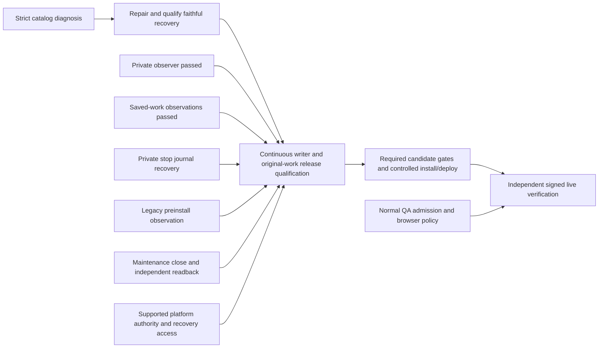
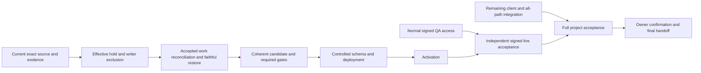
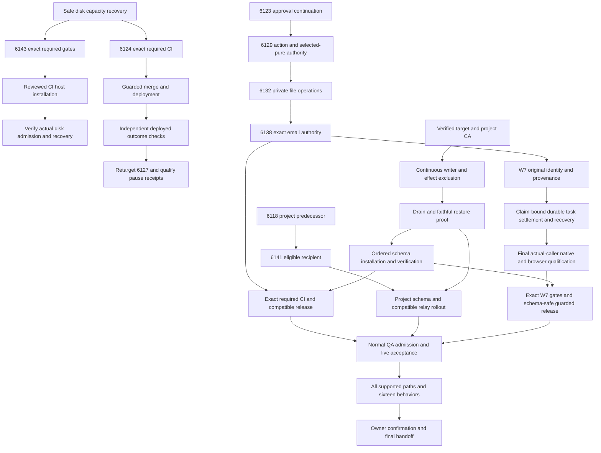

# SupraOS Release Plan Checklist

## Resumed execution — 2026-10-04 UTC

**Current checkpoint: 06:12 UTC.** The authorized eight-hour focus ends at 09:27:59 UTC. The full goal remains private, authorized, contextual, recoverable and truthful agent behavior across all 33 plan nodes, 16 behaviors and 12 supported surfaces. The immediate partial milestone is the existing W7 workflow release; this milestone does not replace the full goal.

### Release candidate and usable capability

PR [6160](https://github.com/jtobkin/suprafx-platform/pull/6160) is frozen at **b937ba4a82f408ef7394b204a0fbf1e304b8d142**. It combines the existing workspace execution, scheduled continuation and journal runtime with the guarded host installer/recovery operator. Runtime and SQL bytes remain identical to ancestor `817061098742daec71dbb4198a5fd0d65d738d17`; composition20838 imported five reviewed operator/test files from precursor `9eff703a7fe9e49af0c3c03c08f7eafa1f99169b`. Two demonstrated receipt defects were then repaired narrowly: the receipt distinguishes SQL source from exact executing operator bytes, and failed readback no longer claims commitment. Preserved failing regressions precede both independently reviewed repairs. The operator contract and architecture entry describe the composition. The branch and PR now point to b937; operator SHA starts `f0ac4935`, installer SHA starts `817fd9c9`. Auto-merge is off.

The exact new head has independent source/parity review, 35 operator tests, 15 proxy tests, 15 actual pg.Client target-routing cases and G11 evidence. Predecessor20838 required CI was queued in an active backlog. Currentb937 required CI is pending fresh observation: `box-ci/security-gates` and `box-ci/production-build`. Earlier green817 CI is historical runtime evidence, not a pass for b937. Unrelated changes do not restart this qualification.

### Progress by delivery state

| Capability or prerequisite | Implemented and integrated | Tested and independently reviewed | Merged / deployed / verified live |
| --- | --- | --- | --- |
| Original-identity workflow runtime and owner journal | Manual, automated and cron callers mounted in frozen candidate | Required817 CI and scoped native caller/reader evidence; exact b937 CI pending | No / no / no for this candidate |
| Guarded preparation, original stop, installer and closure | Actual operator CLI and companion installer mounted; terminal bind-export repair committed | Baseline20838 native d8c9 PASS and audited; repaired b937 source tests/review PASS, native COMMIT-loss successor in preparation | No / no / no |
| Legacy preinstall observation | Committed operator caller | Native `c5a466d0` PASS: baseline PREPARED, partial table/function UNKNOWN, escrow refusal and owned cleanup; audited | Private qualification only |
| Faithful synthetic restore mechanics | Strict comparison and source-bound ACL repair mounted in harness | Selected `2e2ea492` and broader `ab19bf32` native PASS; independently audited | Evidence only; no production restore |
| Production writer fence, accepted-handler accounting and target recovery | Production guard functions deliberately refuse; mechanism and producers remain missing | Private proofs do not establish authority or continuous production control | Unfinished |
| Authenticated deployed acceptance | Requires normal QA access and working browser policy | Last browser attempt denied `enterprise_policy_unavailable`; no bypass | Unfinished |

The broader restore check now covers declared schema/ownership/ACL/RLS, live columns, heap rows, sequences and large-object state, alongside original receipt continuity. It preserves the original two-field ACL failure, applies only the exact source-bound REVOKEs and requires strict final equality. This is dated October 3 captured schema with synthetic rows; it does **not** qualify current production data, every managed-platform object or whole-target recovery.

### Current dependency path and parallel ownership

1. **Implementation lane:** finish the frozen private preparation → original stop → exact forward/VERIFY → install readback → gate closure → replay chain. Baseline runner `9888699c`, dispatcher `8d5616e3`, archive `4d058a9d`, manifest `e9848d4a` produced native receipt `d8c9bf14` PASS with independent root/verifier audits, complete logs and owned cleanup. It loses a host acknowledgment after saved terminal dispatch and proves no resend. A separate native successor uses repaired b937 source plus a private PostgreSQL protocol relay to test actual COMMIT acknowledgment loss and foreign-ledger refusal; it is not yet run.
2. **Prerequisites lane:** define and review the minimum supported owner procedure for continuous writer exclusion, a tested maintenance connection, old accepted-work reconciliation and faithful current-target recovery. In parallel, design meaningful native COMMIT-loss and foreign-ledger checks against the same frozen installer. No production control is inferred from existing credentials.
3. **Independent verification lane:** track exact b937 required CI, audit the composed native receipt and review hold-lapse/oracle-negative coverage. Do not change source or cancel qualification because main advances.
4. **Root:** keep one Docker-mutating private run in the host slot, compose/review only demonstrated blocker fixes, maintain this plan and archive evidence. Once actual authority, recovery and all required candidate gates pass, perform the authorized guarded merge/install/deploy/activation.
5. **Live acceptance:** independently exercise authenticated manual, automated, cron and journal journeys, permissions, failures and recovery on the deployed release. User confirmation follows this verification gate.

The longest unresolved path is supported platform authority → continuously protected existing-work reconciliation and current-target recovery → guarded install/deploy → independent signed live acceptance. The concrete owner request remains unanswered. A static receipt, private hold marker, point-in-time connection census or successful synthetic restore cannot close it. The existing operator's two production guards still refuse; no production install or activation has occurred.

### Where to find code and evidence on a fresh computer

- Private code repository: `jtobkin/suprafx-platform`; fetch PR6160 branch `fix/w7-reviewer-release-20261003` and verify exact b937. Root composition branch `fix/w7-qualified-operator-composition-20261004` has the same b937 commit. Precursor installer branch `feat/w7-bootstrap-install-producer-20261004` is committed and pushed at9eff703. These source changes are no longer local-only.
- Operator entry point: `scripts/qa/w7-operation-gate.py`; installer: `scripts/qa/w7-bootstrap-install.js`; tests: `scripts/qa/test-w7-operation-gate.py`, `test-w7-proxy-hold.py`; hold observer: `w7-proxy-hold.py`; contract: `docs/agent-run/w7-operation-bound-release-admission.md`.
- Runtime: `lib/vms/workflows/`, including `plan-orchestrator` and `mc-*-effect` modules; actual callers `app/api/workspace/plan/execute/route.ts` and `app/api/cron/mc-coordinator/route.ts`; owner journal route, library and Conversations UI locations remain detailed below.
- SQL: `supabase/migrations/20261003120000_mc_task_claim_settlement.sql` and its `_VERIFY.sql` / `_ROLLBACK.sql` companions. Forward SHA starts7af383e3; VERIFY starts4d45188d. No installed production verdict.
- Current machine lanes: `/Users/joshuatobkin/qa-lanes/w7-qualified-operator-composition-20261004`, `w7-release-blockers-root-20261003`, `w7-bootstrap-install-producer-20261004`. Main `/Users/joshuatobkin/suprafx-platform` contains unrelated dirty work; never reset or clean it. Keep unmerged lanes and never remove peer worktrees.
- Canonical local structured plan: `/Users/joshuatobkin/qa-evidence/supraos-execution-plan-20261001/plan.json`. Root records: `qa-evidence/resume-delivery-20261004/`; lane sources and receipts: `qa-evidence/resume-delivery-20261003/{integration,prerequisites,verification}/`. These local paths do not exist automatically on a new computer.
- Newly portable selected restore evidence: private commit `bd973991bcb94ef0771f5621059e9aef445954cb`, directory `docs/agent-run/evidence/strict-restore-repair-evidence-20261004/`, 16 byte-verified files. Previous portable evidence commits616e9ff, b5154072 and f1b8c94 remain documented below. The complete compressed fixture archives/raw captures are **not embedded** and require authorized recovery from their recorded local sources. Broaderab19, legacyc5a and composed-baselined8c sources, full native logs and root audits are now portable in private commit `8226c0beadaf32cfdb6ca6dbf1e316d80f9d8632`, directory `docs/agent-run/evidence/composed-workflow-qualification-20261004/`, 32 byte-verified files with directory and exact-commit secret scans passing. The raw archives remain local-only as explicitly documented.
- Public record repository: `jtobkin/supraos-workflow-plan`, branch `main`, files `Ship-Verified-SupraOS-Agent-Workflows.md`, `SupraOS-Workflow-Plan-Checklist.md` and `Delivery-Path-Release-Plan.md`. Anonymous access was last byte-verified for prior publication ba14a5b7; this update will be verified after upload. Private source/evidence requires repository access.

Finished still means the full agreed supported behavior is deployed, activated, independently verified live and supported by tested recovery. No project percentage is inferred from acceptance counts.

---

## Earlier 05:15 checkpoint — superseded by current state above

**Current checkpoint: 05:15 UTC.** The eight-hour focus ends at09:27:59 UTC. Full scope remains33 nodes,16 behaviors and12 surfaces. The immediate partial milestone is the frozen W7 workspace completion release through manual, automated and cron callers, with durable outcomes and original-identity recovery.

### What changed and what is blocked

The strict dated synthetic restore passed: receipt `2e2ea492`, runner `c598ced9`, archive `8c25ca50`. It reproduced the original two ACL-field mismatch, checked unchanged direct grants including PG17 MAINTAIN, replayed only two exact forward REVOKEs, then required strict catalog/role/seven-selected-row equality and original receipt-first recovery. Root and independent audit checked complete log hashes, terminal successful commands and owned cleanup. This closes that synthetic failure; it does not qualify all production data or recovery.

The protected installer is mounted in the actual operator CLI and has exact SQL, transaction/VERIFY, operation-marked ledger, no-resend recovery and fresh readback logic. Tests exposed and repaired target-routing ambiguity using actual pg.Client parameters. However, root review caught a further integration blocker: oracle exports were placed in container tmpfs and extracted only after stop, when tmpfs disappears. The source-tested candidate ff283b8a/02308790 is preserved; a narrow private persistent-export repair and actual terminal-container verification are required. Hard production hold/backup/drain guards still refuse installation.

The actual legacy preinstall fixture was staged but its pinned app image was deleted by an unrelated deployment. A read-only check proved the current image `ab5b30f96105718b033811018149d4dfb2fad1ab3a1dc35a33a2b19b6e0afede`, linux/amd64, with pg available. A separate image-only successor is being reviewed. Immutable runtime817 qualification is not restarted because unrelated main advanced.

### Delivery states

| Work | Implemented / integrated | Tested / independently reviewed | Merged | Deployed | Verified live |
| --- | --- | --- | --- | --- | --- |
| Frozen817 / PR6160 workspace runtime | Mounted manual/automated/cron callers | Required CI and scoped native checks PASS; full controls incomplete | No | No | No |
| Actual stop and uncertain replay | Mounted84c CLI | Native3b9 PASS and audited | No | No | No; private synthetic hold/gate |
| Strict selected synthetic restore | Exact-source harness | Native2e2 PASS, strict assertions retained, audited cleanup | Evidence only | No production restore | No |
| Broader synthetic restore | All declared rows, columns, sequences and large objects, caller mounted | ae69 source review/local checks PASS; native pending | Evidence only | No | No |
| Legacy prepare/stop/close | bcb/b5 committed and pushed | Local/source checks PASS; actual preinstall native needs current-image successor | No | No | No |
| Protected install and schema exports | Mounted but terminal-export repair pending |33 operator/15 actual-parser checks pass on preserved candidate; actual lifecycle still unqualified | No | No | No |
| Production release and full project | Partial | Authority, continuous writer fence, accepted-handler accounting, faithful whole-target recovery and signed live acceptance remain open | No final release | No | No |

### Next dependency steps and owners

1. **Prerequisites lane:** package and qualify reviewed broader synthetic restore coverage, preserving strict ACL/catalog/row checks. Whole-target production backup/recovery remains a distinct gate.
2. **Implementation lane:** repair the terminal oracle export handoff, freeze and independently review it, then compose actual legacy prepare→original stop→exact install/VERIFY→close→fresh readback in an isolated real database/container fixture. No fabricated production receipt or authority.
3. **Independent verification lane:** qualify the reviewed image-only legacy fixture, review the composed install/recovery chain and preserve uncertain-original evidence. Source-only assertions do not establish container behavior.
4. **Root/operator:** obtain supported platform writer exclusion/recovery authority and resolve accepted-handler accounting; then compose exact release source, run required gates and perform guarded merge/install/deploy/activation. External requests remain unanswered, not granted.
5. **Independent live verification:** authenticated real browser/Playwright journeys and recovery after deployment. QA invitation and browser policy remain unresolved; last navigation was denied `enterprise_policy_unavailable`, with no bypass.

One private Docker-mutating fixture owns the host slot at a time. Source, staging and reviewed read-only work continue in parallel. No extra workstream supersedes this delivery path, and no percentage is inferred from counts.

### Code, records and fresh-computer access

Runtime: `jtobkin/suprafx-platform`, PR6160, branch `fix/w7-reviewer-release-20261003`, exact `817061098742daec71dbb4198a5fd0d65d738d17`. Main working directory is unrelated/dirty and must not be reset. Current root lane: `/Users/joshuatobkin/qa-lanes/w7-release-blockers-root-20261003`.

Operator committed sources: `feat/w7-legacy-preinstall-observation-20261004` at bcb927e and `feat/w7-operation-bootstrap-close-20261004` at `b5a81b2b3433fc5137f5845dc1a8d1fa1d5aa89d`. Installer work is uncommitted in `/Users/joshuatobkin/qa-lanes/w7-bootstrap-install-producer-20261004`; preserve it before switching computers. Production caller `scripts/qa/w7-operation-gate.py`, companion `scripts/qa/w7-bootstrap-install.js`, regression `scripts/qa/test-w7-operation-gate.py`, documentation `docs/agent-run/w7-operation-bound-release-admission.md`. Runtime and SQL locations remain documented below.

Canonical local plan: `/Users/joshuatobkin/qa-evidence/supraos-execution-plan-20261001/plan.json`. Current evidence: `qa-evidence/resume-delivery-20261004/`; lane sources/receipts: `qa-evidence/resume-delivery-20261003/{integration,prerequisites,verification}/`. New2e2 receipt is under `prerequisites/restore-diagnostic-acl-replay/receipts/memory-restore-acl-replay-1c53c1706ec65386/`. These new files are local until separately archived; do not imply a fresh computer can access local-only evidence.

Portable private evidence commits616e9ff1, b5154072 and f1b8c94f in `jtobkin/suprafx-platform` remain byte-verified and secret-scanned; path groups are listed below. Public plan repository `jtobkin/supraos-workflow-plan`, main, contains this handoff, `SupraOS-Workflow-Plan-Checklist.md` and `Delivery-Path-Release-Plan.md`. Private repo access is required for source/evidence; public documents need no sign-in. Clone/fetch exact recorded commits on a fresh machine, read repository instructions and use isolated lanes. Never infer deployed acceptance from preserved local/source test results.

---

## Earlier 04:33 checkpoint — superseded by current state above

**Current checkpoint: 04:33 UTC.** Owner-authorized focus runs 01:27:59–09:27:59 UTC. The state below supersedes earlier entries; full scope remains33 nodes,16 behaviors and12 surfaces. The current milestone is the coherent W7 workspace-plan completion release through manual, automated and cron callers, with durable outcomes and original-identity recovery. This is a partial milestone, not full project completion.

### Current evidence and delivery states

| Work | Implemented / integrated | Tested / independently reviewed | Merged | Deployed | Verified live |
| --- | --- | --- | --- | --- | --- |
| Runtime817 / PR6160 | Named workspace callers mounted | Required CI and scoped native/browser checks pass; release controls still incomplete | No | No | No |
| Current84c original-stop recovery | Actual derived CLI exercised | Native3b9b3326 PASS: exactly two disposable original stops, simulated committed cron ACK loss, saved UNKNOWN replay/no resend, owned cleanup; root audited | No | No | No; synthetic gate/private hold |
| Legacy observation bcb927e | Mounted read-only CLI, committed/pushed |23 tests and independent source review pass; captured-schema native prepared, not run | No | No | No |
| Legacy stop and bootstrap-close b5a81b2 | Mounted successor, committed clean; exact install receipt producer still missing |29 tests and independent review pass after current-hold repair; native pending | No | No | No |
| Maintenance role capability | Read-only target probe | Native45614b44 PASS: service_role selected, transaction rolled back, role restored, connection ended; root audited | Evidence tool | No product change | Not mutation/exclusion authority |
| Strict restore | Exact diagnostic complete; source-bound replay prepared | RED209c1fea is exactly two ACL representation fields; replay native not started | Evidence harness | No production operation | No |
| Whole production cutover | Incomplete | Continuous writer exclusion, accepted-handler accounting, faithful whole-target recovery and access remain open | No final coherent release | No | No |

**Restore diagnosis:** all seven selected row sets, roles and every other compared catalog class match. The two W7 admission tables have explicit owner-only source ACLs versus NULL/default ACL representation after restore. This does not by itself prove privilege loss or equivalence. Reviewed runnerc598 requires the exact original RED, equal direct rights including PG17 MAINTAIN, replay of only two uniquely pinned forward REVOKEs, and then unchanged full catalog/row/role equality and original receipt recovery. Whole-target production recovery remains separate.

The ACL replay archive is staged and hash-sealed. Admission receipt4f909 refused before native because two managed deployment/start processes were active. A bounded follow-up c2e32 at04:30 still found deployment active. No fixture launched; staged bytes are retained with expiry06:27:34 UTC. No automatic retry, process kill or weakened admission.

**Review repairs:** root found that the legacy fixture transport could discard logs after a nonSuccess SSM native invocation. Successorfb7 retains them and passes Failed/TimedOut/Cancelled recovery tests. Root and independent verification also found missing current-hold checks around bootstrap-close. Committed successor `b5a81b2b3433fc5137f5845dc1a8d1fa1d5aa89d` checks the unchanged hard hold guard before work, immediately before dispatch after preflight, and before CLOSED. Its tests prove an expired hold prevents dispatch. Failed e530 evidence remains preserved. No production stop/install/close has occurred.

### Immediate dependency path and owners

1. Prerequisites: observe an actual deployment-complete state change, re-admit the host and qualify the sealed strict ACL replay once. Then address whole-target recovery gaps; a selected-table fixture pass is insufficient.
2. Integration: mount the real exact forward/VERIFY installation-receipt producer behind the same operation, escrow, stop journals, locks and current-hold controls. Complete original-stop → protected install/VERIFY → one close dispatch → independent fresh readback. Do not fabricate an install receipt or leave a consumer without its caller.
3. Verification: qualify actual legacy CLI behavior on the dated captured schema and then the composed stop/install/close chain. Preserve terminal failures and uncertain command identities; no blind resend.
4. Root/operator: resolve supported platform writer fencing, recovery access and accepted-handler accounting, then compose the exact candidate, run final required gates, merge/install/deploy/activate with controls intact.
5. Verification: independently exercise deployed authenticated journeys and recovery. Normal QA invitation and browser-policy availability remain unresolved; last browser attempt denied `enterprise_policy_unavailable`, with no bypass.

Only Docker/container/network-mutating native fixtures own the exclusive host slot. Immutable source staging, independent review and reviewed read-only observations can overlap. Full scope and all original acceptance criteria remain unchanged. Next release blockers are faithful recovery, continuous writer/accepted-handler exclusion, the protected install/close chain, and authenticated live access. Platform authority requests remain pending; no approval is inferred.

### Portable source, evidence and current access

Runtime source remains frozen at `817061098742daec71dbb4198a5fd0d65d738d17` in `jtobkin/suprafx-platform`, PR6160. Old817 CI does not qualify later operator changes. The guarded bootstrap successor is clean and committed at b5a81b2 on local branch `feat/w7-operation-bootstrap-close-20261004`; push has not yet been verified at this checkpoint. Its code is `scripts/qa/w7-operation-gate.py`, tests `scripts/qa/test-w7-operation-gate.py`, and associated operator documentation. Its local locked lane is `/Users/joshuatobkin/qa-lanes/w7-operation-bootstrap-close-20261004`.

Portable cutover evidence is saved privately at commit `616e9ff12d3e440764a6ca96d50c5514ce74267e`, path `docs/agent-run/evidence/operator-cutover-evidence-20261004/`:31 files byte-verified; directory and exact-commit secret scans pass. It includes actual role/stop sources, receipts, preserved failure context and root reviews. Earlier portable evidence commits b5154072 and f1b8c94f below remain valid within their scope.

Current canonical JSON is `/Users/joshuatobkin/qa-evidence/supraos-execution-plan-20261001/plan.json`; its aliases refer to817/PR6160 and the12-node current dependency path. All33 full-scope nodes remain. New root evidence is `qa-evidence/resume-delivery-20261004/`; lane fixtures remain under `qa-evidence/resume-delivery-20261003/{integration,prerequisites,verification}/`.

Public checklist, dependency plan and handoff: `jtobkin/supraos-workflow-plan`, branch `main`, files `SupraOS-Workflow-Plan-Checklist.md`, `Delivery-Path-Release-Plan.md`, and `Ship-Verified-SupraOS-Agent-Workflows.md`. Private code/evidence requires repository access. A fresh computer must clone the repositories and fetch exact recorded commits; local paths alone are not portable access. Detailed source layout and setup remain below. Latest bound serving-image observation is113b82d7/build9b2b4cbb, not817; unrelated deployment does not restart immutable817 qualification.

---

## Earlier 03:50 checkpoint — superseded by the current state above

Execution resumed by the owner at **01:27:59 UTC**, with an eight-hour focus ending **09:27:59 UTC**. This section supersedes execution state in the retained paused handoff below; its scope, prior receipts and acceptance limits remain binding.

### Current milestone and dependency order

Ship the coherent W7 workspace-plan completion capability through its manual, automated and cron callers, with durable journal/reviewer/memory results and original-identity recovery. Full project scope remains 33 nodes, 16 behaviors and 12 surfaces; no task-count completion percentage is asserted.

1. **Preserve source and re-admit the environment.** Both missing worktrees were removed by the automatic disk-cleanup timer after their commits were pushed, despite remaining unmerged. Exact817 and f121 commits and branch histories survive. Both had clean status at19:28 UTC before the pause. All35 published payloads and40 local-only artifact references were verified; three missing operator files were recovered byte-for-byte from f121. Automatic peer-lane/trash deletion is now disabled; independent source review and shell syntax pass. Restored root and operator worktrees retain the recorded source. Ignored scratch-file loss cannot be ruled out by Git history.
2. **Cron v4 native qualification passed.** Receipt `f6c5b46ac86b8c008bb6f8b65e6e73638b20ff55d63ccaade169c77afdb9389d` binds frozen817 to two actual GET ticks against the same reserved lost-acknowledgement original. Both remained held, the ledger stayed reserved, and provider attempts stayed at zero. Root independently checked receipt/output/readback hashes, terminal success and owned cleanup. This is synthetic Oct3 captured-schema qualification, not installed or live cron acceptance; v1–v3 failures remain preserved.
3. **Strict restore is RED on catalog equality.** The corrected real diagnostic completed (3ebf4a3c): all seven selected row sets and roles match, but catalog fingerprints differ. Detailed runner7a1/archive8c25 retains the strict assertion. One detailed transfer ended with three unknown SSM results; all original commands were later reconciled successful and owned scratch cleaned (8ee9ded0), without native execution. A second complete transfer stopped at immediate admission (b3d39776), again before native; cleanup passed, but its cause was not sealed. A reviewed narrow transport repair now records fixed refusal reasons. A two-phase immutable staging successor is being implemented to avoid repeating archive transfer on known refusal. Admission floors, native budgets and fidelity assertions remain unchanged. This selected synthetic fixture is not a faithful whole-production restore.
4. **Operator integration and recovery proceed in parallel.** Private observer a31e68b2 passed real isolated Traefik/TLS:60 held probes,9 read/version controls and identity/route/lock refusals; root audited source/output hashes and cleanup. Exact GET301/POST308 behavior repaired the prior fixture expectation; failures remain retained. It does not prove continuous production exclusion. Current84c stop lifecycle source now preserves original stop journals and uncertain cleanup pointers; private native qualification is next. The read-only legacy preinstall slice is committed at bcb927e23e2033bd9b9723f4558fab314bddfffe with23 local tests and independent review. It rejects any of frozen817’s5 tables,8 indexes or25 functions when claiming a preinstall phase, binds the database target and uses distinct private escrow. It cannot authorize stopping or draining. Census55a75/correlation51bc3/authority8928 are audited read-only observations, not proof of active provider work or safe historical repair. A new explicit cutover dependency is an independent maintenance connection: the migration initially opens the gate, while today’s close command needs the old web container after it would be stopped. A same-operation close/readback action must be qualified before replacement starts; required service_role capability is not yet proven. Platform Owner/Admin maintenance-access request remains unanswered; no approval is inferred.
5. **Only after qualification, controlled cutover and independent signed live acceptance.** Exact candidate gates, installed schema, compatible runtime, activation and recovery must each be proven. Normal QA invitation and platform authority remain dependencies. Claude CLI is still signed out on fresh observation. The browser extension is available and lists existing SupraOS tabs, but new navigation was denied because the admin policy could not be verified (`enterprise_policy_unavailable`); no authenticated DOM was accessed or workaround attempted. This browser prerequisite is distinct from the outstanding normal QA invitation.

### Current delivery states

| Work | Implemented / integrated | Tested / audited | Merged | Deployed | Verified live |
| --- | --- | --- | --- | --- | --- |
| Frozen W7 runtime817 | Yes, within the named workspace completion scope | Required CI and scoped native/browser cases pass; recovery/release gaps remain | No | No | No |
| Two-tick cron recovery | Exact817 caller exercised | Native receipt f6c5 independently audited | Part of unmerged817 | No | No; synthetic schema/auth |
| Operator observer84c | Mounted in actual operator CLI |32 local tests, independent review, G11; private real Traefik observera31e PASS | No | No | No; finite private fixture |
| Legacy preinstall observation bcb927e | Mounted read-only CLI, distinct target-bound escrow |23 local tests, independent review; native pending | No | No | No |
| Faithful restore | Strict diagnostic and detailed successor implemented | Catalog-only RED3ebf; detailed native unrun; transport staging repair underway | Evidence-only harness | No production operation | No |
| Original-work census | Read-only source and transport prepared | Target census/correlation observations and independent receipt audits pass | Evidence-only tool | No product deployment | Not a drain proof |
| Production release controls | Partial; preinstall exclusion and drain chain incomplete | Authority and faithful target recovery remain open | No coherent final operator release | No | No |

The authoritative current JSON aliases now reference PR6160 exact817; the old6124 release execution and old dependency graph are explicitly historical. The current dependency graph distinguishes catalog diagnosis from successful repair/faithful target recovery, and includes the missing postinstall close. Dependency rounds indicate precedence, not permission to share owned files or native resources.



The next release is specifically blocked by strict restore fidelity, incomplete production writer/accepted-handler exclusion, the preinstall/maintenance-close operator chain, and signed live access. A1/A2 requests remain pending while independent source and private qualification continue.

### Ownership and current state

- Root: immutable composition, protected worktree recovery, host scheduling, evidence and public documents.
- Integration: actual operator/hold/recovery callers and their tests/docs in its isolated lane, observer84c and legacy bcb927e; next maintenance role preflight and bound bootstrap-close integration.
- Prerequisites: fresh readonly host admission, restore diagnostic, access/authority blockers and independent reviews.
- Verification: actual cron v4 qualification and independent source/browser/live acceptance.

Parallel source/review work and independently reviewed metadata-only snapshots with separate scratch are allowed concurrently. Only Docker/container/network-mutating native fixtures require the exclusive host fixture slot. Unknown command outcomes retain their original identity and are reconciled before another dispatch. No production container stop, schema change, gate bypass or activation is authorized merely by a private fixture pass.

Fresh PR readback confirms6160 remains open/unmerged at817061098742daec71dbb4198a5fd0d65d738d17, without auto-merge. Read-only host observations show25containers and no owned W7 fixture containers/networks. Ordinary unrelated deployments changed the serving image; the latest bound metadata observations used image0adef678 and build45153cbe. These are timestamped observations, not deployed W7 acceptance or current source parity.

Portable observation evidence and exact sources are saved privately at `b5154072d50d1421db31656c0ff678d0a030f409`, path `docs/agent-run/evidence/release-observations-20261004/`;37 files were byte-verified, and directory plus exact-commit secret scans passed. This includes bounded original-work/authority observations and private observer evidence, with scope limits.

Portable resumed cron evidence is saved privately at commit `f1b8c94fab10ba60fcafba6f94b0db02ea7b78f3`, path `docs/agent-run/evidence/qualified-resumed-workflows-20261004/` in `jtobkin/suprafx-platform`. Eight files were byte-verified after upload; directory and exact-commit-range secret scans passed. Raw stdout/readback remain local with recorded hashes: generic-key scanner findings on synthetic token UUID fields prevented their publication, so the unchanged scanner was passed by publishing a clearly labeled derived binding summary instead. Failed scan evidence and raw originals are preserved. This does not claim that the derived summary is the original receipt payload.

Local new-run evidence: `/Users/joshuatobkin/qa-evidence/resume-delivery-20261004/`. Prior fixture/evidence paths remain under `qa-evidence/resume-delivery-20261003/`. Canonical local JSON remains `qa-evidence/supraos-execution-plan-20261001/plan.json`. Read the detailed paused checkpoint below for exact branches, code callers, setup commands and portable private evidence links. The older worktree paths are historical unless their restoration is recorded here.

---

<!-- END CURRENT 2026-10-04 CHECKPOINT -->

## Historical checkpoints — superseded by the current section above

## Resumed delivery checkpoint — 2026-10-03 UTC

Implementation is paused at the owner-requested cutoff, recorded 2026-10-03T19:43:25.337791+00:00. The final 90-minute window began at 18:13:12 UTC and ended at 19:43:12 UTC on 2026-10-03. All owned host runs are terminal with verified cleanup; no uncertain remote command remains. Only documentation publication and access verification followed the pause. This is the current checkpoint; dated material below is retained history.

### Start here on a new account or computer

The public [checklist](https://github.com/jtobkin/supraos-workflow-plan/blob/main/SupraOS-Workflow-Plan-Checklist.md), [dependency plan](https://github.com/jtobkin/supraos-workflow-plan/blob/main/Delivery-Path-Release-Plan.md) and [detailed handoff](https://github.com/jtobkin/supraos-workflow-plan/blob/main/Ship-Verified-SupraOS-Agent-Workflows.md) are the canonical navigation. They require no sign-in. The older Sites dashboard is not the authoritative latest state.

Application code is in **private** `jtobkin/suprafx-platform`. Its private documentation/evidence branch is `docs/paused-workflow-handoff-20261002`; the detailed documents and machine-readable plan live under `docs/agent-run/handoffs/`. Public documentation does not grant access to private code, CI, servers, secrets or a signed SupraOS account. Use the new account's normal repository and infrastructure permissions. Do not copy production environment files, session cookies, private keys or old database escrow into a new session.

### Goal and definition of finished

Deliver reliable SupraOS agent work across all agreed execution paths, including background runs and System Workflows. A user must be able to start useful work, see an honest durable result, approve the exact action where required, recover or cancel safely, and resume the original work without a duplicate external action or charge. Owner, project, workspace and audience boundaries must hold throughout.

The agreed scope remains **33 project nodes, 16 behaviors and 12 execution surfaces**. These are scope counts, not an estimate of code completion or remaining effort. A small deployed fix, an unactivated feature or a passing isolated fixture is progress only.

Finished means the agreed behavior is integrated into real production callers, passes the mandatory tests and independent review on immutable source, is merged and deployed through normal controls, is activated where required, and passes independent signed live acceptance with tested recovery. UI behavior requires an actual browser or Playwright check before requesting user confirmation. Positive, foreign-owner/revoked, failure, cancellation, lost acknowledgement, unknown outcome and recovery cases remain part of acceptance. Never remove tests, raise fixture budgets, bypass permissions or weaken release controls to make a run green.

The 12 surfaces are personal chat (full/fast/direct), Telegram, mounted/legacy voice, headless agent execution, delegation, coordination System Workflows, generic Workflows/Routines, Plan Graph/background Build, workspace plans/MC cron/organization tasks, scheduled research/competitors, Rooms manual/scheduled/huddle, and shared/company/visiting audiences. iMessage remains deferred; WhatsApp is excluded.

The 16 behavior families are quiet morning briefings; owner-voiced drafts without implicit sending; shopping/screenshots under grants; approved real calls; bounded initiative; same-computer takeover/handback/replay; loose-end tracking; mail retrieval/review/send/edit/snooze/ignore; two-owner consent/revocation/concurrency; unique mailbox and same-conversation inbound routing; exact payment instrument and receipt; truthful progress/history; bounded preferences/memory; honest provider/evidence/unknown stops; quiet hours/batching/cadence/urgency without duplicates; and context-appropriate tone/length.

### What was already shipped

These are earlier partial releases, not claims that all signed journeys are finished:

| Capability | Merged/deployed evidence | Remaining acceptance |
|---|---|---|
| Conversations owner-switch privacy repair, PR6158 | Merge `c7f79f2563febec1ac10befb6c33e0670cbd9ebe`; canonical deployment/public denial receipt `d30cbe2c`; unsigned deployed 390/1440 Chromium `66b344a8`; actual wallet-boundary fixture reproduced and repaired the late-owner response defect | Normal signed owner/foreign-owner switch on deployed app |
| Memory Promotion, PR6149 | Merge `ef86349dbda78e1d1e046dcd477dbe06f80f7e8a`; required security/build and actual email Chromium passed; canonical deployment/public checks `7b8bb2de` | Signed original-run promotion and owner isolation |
| Durable pause/recovery, PR6127 | Merge `9fac...`; exact-source native 14/14 and strict cleanup passed; deployment observed | Signed original-run pause/recovery |
| Competitor Watch, PR6066 | Guarded merge `fc8e...`; canonical `22d8...` deployment and public denial checks | Actual authenticated worker/card recovery |
| Other preserved partials | PR6124 System Workflow identity, PR6121 AgentOrb, PR6053 Mobile Chat, PR6146 canvas and PR6148 reason-3 server/artifact work | Each keeps its stated acceptance limits; reason-3 code deployment does not perform an L1 upgrade |

Later independent deployments have advanced serving main. The last bounded read-only image observation in this window was image `7e80809d2f1b9203cf69c155a9c36a902049d701524a88c7b159d69a70487765`, public build `8b6b3525a2d9db8b0b0409f5d0498aad4d76d523`. Re-read actual deployment state before acting; this is not the W7 candidate being live.

### Current release candidate and what blocks shipping it

[PR6160](https://github.com/jtobkin/suprafx-platform/pull/6160), remote branch `fix/w7-reviewer-release-20261003`, is frozen at **`817061098742daec71dbb4198a5fd0d65d738d17`**. The local composition branch is `fix/w7-release-blockers-root-20261003`, in `qa-lanes/w7-release-blockers-root-20261003`; do not confuse it with the remote branch. Required security passed all 51 steps and production build all 7 steps on the same reviewed composition. The security run recorded 4,404 files / 54,610 passing tests, with its existing skips visible. Passing these gates does not authorize premature schema installation.

The nearest useful release milestone is a completed workspace plan producing its durable owner journal, reviewer feedback and memory effects through real manual, automated and recovery callers, with the original claim retained across lost acknowledgements and no duplicate external attempt or charge. The schema/operator prerequisites are part of delivering that capability.

This candidate contains the inherited workflow stack, including scheduled continuation and exact-action authority. It is not a standalone four-reviewer patch. It remains unmerged, undeployed and unactivated. Auto-merge is not enabled. Do not substitute current main, cherry-pick an incomplete slice, or repeatedly restart qualification because unrelated main changes arrive. Only a demonstrated release blocker may change the candidate; retain the failure, repair narrowly, review independently and requalify affected behavior plus required final gates.

The immediate production blockers are an effective ingress hold; continuously enforced exclusion of every relevant writer; accepted-handler/effect reconciliation; a faithful protected backup and tested recovery on the actual installed target; one coherent operation-bound schema/runtime deployment and activation; and normal signed QA access. A local container census, alternate database connectivity, synthetic restore or a closed new DB gate alone does not prove these controls. Existing images do not call the new gate. Privileged database backends and external credential holders cannot be assumed excluded.

### Qualification evidence at this checkpoint

All native runs below used isolated owned containers and synthetic claims/provider responses against a dated captured schema. The relevant production source was pinned and parity checked; this does not make the fixtures live-owner acceptance.

| Proof | Result / receipt | Exact limit |
|---|---|---|
| Four reviewer destinations and durable original ledger | PASS `52b3f5ab`; saved readback `89823033` | Four authored reactions; same-claim race; lost reservation/checkpoint/reaction ACKs; legacy policy, provider uncertainty/invalid usage and House Rules denial. Fourteen loopback provider requests; no real customer/provider account |
| Five memory receivers | PASS `97db67c4` | Five memory rows and five queued attestation outbox rows; conversation source and lost-insert ACK recovery. Queued outbox is not external attestation delivery |
| Actual journal GET/reader/Conversations projection | PASS `a224e4b9`, real Chromium at390/1440 | Saved native rows and actual source; synthetic authentication/database transport/wallet and unstyled shell. Four comments visible; no overflow/errors/unexpected hosts. Not signed live or full production CSS |
| Exact817 forward/VERIFY/ROLLBACK packet | PASS `26b90838` | Full schema/owner/ACL roundtrip/reapply, direct SQL service/anon ACL checks (not HTTP anon JWT qualification), retained reviewer-history and operation-history rollback refusal. Isolated dated capture; no target installation |
| Aggregate budget and concurrent original reservations | PASS `01a01e20` | UUID+legacy aggregate0.6+0.6 is denied under cap1; two distinct originals race under cap0.000398, exactly one reserve. Dropped committed reserve ACK remains held with no provider call/resend |
| Historical admission-day accounting | PASS `52cd7edd` | Synthetic prior-day admission, actual current-clock checkpoint, dropped committed ACK, prior-day usage and unchanged current-day aggregate; replay unchanged/no extra provider. Not an elapsed midnight/hourly-window test |
| Alternate maintenance connection | PASS `7e6b14ad` | Read-only connection to template1 as existing postgres role; identity, rollback and close checked. Does not prove writer exclusion, privileged backend termination or recovery after a fence |
| Operator stop journal source | Published `f12125cc`;16 tests and independent review PASS | Actual CLI is still disabled until qualified effective hold and closed-generation proof. Three unsafe history/preexisting-stop baseline REDs retained; no production stop |

**Cron native acceptance remains open.** V1 failed on an inner packaged-file hash (`acf340b4`); v2 failed because nonroot Node could not read its runner (`5593423e`); v3 passed those setup steps but the focus helper refused the wrong synthetic original (`f6c3e215`) before any GET tick. The wrapper had selected the delivered review claim instead of the separate lost-reservation-ACK claim. Each failure and cleanup was preserved. V4 is independently source-reviewed and its local regression passes against the sealed `52b3` output/readback; it selects and validates `reserveAckLoss.claim` for both input and result, retaining the delivered claim for saved-row export. **V4 has not run natively.**

**Synthetic restore qualification failed and remains open.** The first run (`dab6246c`) stopped before dumping on an ambiguous PostgreSQL internal-char concatenation. The narrow explicit-cast successor reached successful globals/custom dump and single-transaction restore commands, then failed the unchanged original-row/catalog/ACL/role equality check (`30ced9fa`). The retained log does not identify the differing component; its cause is unknown. Receipt-first replay was not reached. Do not describe this as a passing restore or guess that it is merely ACL ordering.

The reviewed diagnostic successor retains the strict equality assertion and emits only bounded component names, before/after hashes and row counts into a fsynced journal and sealed stderr before refusing. Its local regression is2 RED against the preserved predecessor and2 GREEN against the successor; **the diagnostic successor is unrun**. It is the next restore test after fresh host admission, not an automatic retry of an uncertain operation.

Exact next-session fixture locations, relative to `qa-evidence/resume-delivery-20261003/`:

| Package | Frozen wrapper / dispatcher / archive | Next action |
|---|---|---|
| `verification/reviewer-cron-native-successor-v4/` | `d7a1e269` / `7b49f4d2` / `ca18eb32`; local regression `71b89f52` | One reviewed native run after fresh admission; preserve all prior failures; actual two GET ticks must prove no second provider attempt |
| `integration/private-memory-restore-diagnostic/` | `3c32d102` / `2e931e34` / `8c25ca50`; local regression `b432d5c1` | One diagnostic run, inspect exact differing hashes/components, then repair only a demonstrated cause; do not weaken fidelity equality |
| `integration/operator-stopped-current-image/` | `cb5ce2aa` / `d7d8a50f`; actual operator `699a7440` | Reviewed but unrun. Recheck current image/provenance and capacity; use a new window with enough time for bounded transfer, execution and readback. This tests a0a observation, not f121 live stop |

All host runs from this window have terminal outcomes and verified owned cleanup; no uncertain remote command was left running. The new-run queue closed at19:10 UTC to protect the requested pause. The operator rehearsal was not started because its existing complete transfer/readback bounds could extend beyond the window; no budget was shortened to force it in.

Earlier failures remain preserved: duplicate schema replay, duplicate active Guide name, duplicate project/run number, browser archive-list mismatch, cron inner-file mismatch, cron nonroot runner unreadability, and restore catalog type ambiguity. Repairs were narrow and reviewed; failed archives/receipts were not overwritten or called passing. The current candidate's runtime behavior did not change to accommodate these fixture repairs.

### Release stages remain separate

| Capability | Implemented / integrated | Tested / independently reviewed | Merged | Deployed | Verified live |
|---|---|---|---|---|---|
| Earlier privacy, memory promotion and pause fixes | Yes for their bounded repairs | Required gates and stated native/browser scopes passed | Yes | Yes, exact observations retained | Public/unsigned checks only where stated; signed recovery/owner acceptance still open |
| Frozen W7 candidate817 | Real manual/automated/cron callers wired; full operator release chain incomplete | Required CI and listed private native/browser scopes qualified; remaining recovery/operator cases explicit below | No | No | No |
| a0a stopped observation / f121 stop journal | Actual operator CLI mounted; f121 live stop intentionally disabled until effective hold proof | Source review and13/16 local tests respectively; current-image lifecycle rehearsal still unrun | No | No | No |
| C1 client context / C2 project command lines | Preserved source and named callers; remaining clients/transport/integration identified | Scoped evidence only, not all supported clients or installed transport | No for named pending candidates | No for named pending candidates | No full client/project acceptance |
| X4/X5 scheduled continuation | Preserved/inherited source; broader effectful paths still pending | Scoped source/native/browser evidence does not close all graphs or cutover | Held as part of coherent candidate | Uninstalled / inactive | No |

No new W7 production release is claimed by this checkpoint. Closing qualification dependencies advances readiness; it does not change any “merged”, “deployed” or “verified live” cell without its own evidence.

### Exact refs to recover

The current W7 release candidate and operator successors are separate, unmerged lines. Verify every fetched ref resolves to the listed commit before building or replaying evidence.

| Line | Local/source ref | Exact commit | What it contains |
| --- | --- | --- | --- |
| W7 release | Remote PR6160 head `fix/w7-reviewer-release-20261003`; local root composition branch `fix/w7-release-blockers-root-20261003` | `817061098742daec71dbb4198a5fd0d65d738d17` | Coherent W7 runtime, migration/VERIFY/ROLLBACK packet and named callers. Required security51/build7 passed on this frozen head; installation and signed live proof remain held. A stale local branch with the remote name may still point to earlier `390927`, so compare the fetched SHA. |
| W7 stopped observation | `feat/w7-operation-stopped-observation-20261004` | `a0a1988f23687ab2e6573e406d1d2ffb1094a443` | Operation-bound private DB credential escrow and read-only stopped-generation observation. Source-qualified, not activated. |
| W7 stop journal | `feat/w7-operation-stop-journal-20261004` | `f12125cc964ad7d6e3649c8ecd024fffdbd2330e` | Fsynced original web/cron stop journal and no-resend reconciliation in the same operator; actual live stop action stays disabled until an effective external hold can be proven. |
| Canonical C1 client isolation | `qa/project-claude-workspace-binding-20261002`; remote backup `backup/lane-20261003-1322/project-claude-workspace-binding-20261002` | `f6be94d91962c2d4b873eaad2c08f9b43290a599` | Trusted owner/session/project workspace separation in relay and Electron. Claude positive and native project proof are scoped; Codex/Grok, subscribed provider and deployed signed journey remain open. |
| Canonical C2 project commands | `release/reviewed-project-dispatch-20261002`, PR6118 | `d82464efd076c707760e0809f4aa3dccd0150bba` | Project Git command authority through producer, signed poll, execution admission, relay distribution and Electron resource paths; default off/uninstalled. |
| C2 eligible recipient successor | `feat/c2-recipient-eligible-20261003`, PR6141 | `c8d5bbaaffb59115d78bf2ca5a29ea1c3e6a0b40` | Additional canonical recipient/producer binding on C2; neither C2 branch is merged or deployed. |
| Canonical X4 scheduled uncertainty | `codex/x4-main-extraction-20261001`, historical draft PR6054 | `80e77f36f4cbdcaf580b1a8edd267adcc98f2090` | Durable original scheduled-attempt admission/recovery, default-held until schema and cutover qualification. |
| Canonical X5 approval continuation | `qa/x5-combined-acceptance-overlay-20261002`; remote `qa/workflow-authority-selected-release-20261002`, draft PR6129 | `9c3c7bd4e6c4c6ba58d2fa69424424fa84c79365` | Original approved bounded pure prefix/selected leaf and terminal Reject; broad effectful continuation and live cutover remain open. |

An older release-plan table used **local** labels C1/C2 for Competitor Watch cron/card delivery; this publication renames those rows CW1/CW2. They do **not** close canonical client C1/C2 above. The canonical IDs are defined in private `SupraOS-Workflow-Plan.json`; the release-specific labels are in the public `Delivery-Path-Release-Plan.md`.

### Production caller map

- W7 original-claim and reviewer chain: `app/api/workspace/plan/execute/route.ts` is the manual caller; `lib/vms/workflows/plan-orchestrator.ts` is automated; `app/api/cron/mc-coordinator/route.ts` is the recovery caller. `lib/vms/workflows/mc-plan-finish-intents.ts`, `mc-plan-broadcast-journal-effect.ts`, and the reviewer effect/receipt modules bind journal/reviewer work to the saved original claim. `app/api/agent-journal/route.ts` and `getJournalFeed` in `lib/vms/memory/agent-journal.ts` feed `app/vms/conversations/page.tsx`. Browser fixtures are not a live owner session.
- W7 operator: `scripts/qa/w7-operation-gate.py` is the actual CLI for read-only preparation/observation and the **disabled** journaled stop. `scripts/qa/test-w7-operation-gate.py` contains source fault tests. The private Traefik hold helper and its synthetic route fixture are in the retained release evidence; no continuously observed live hold or complete direct-writer exclusion exists yet.
- C1: `packages/supraos-relay/src/start.js`, `pty-session.js`, `project-execution-scope.js`; `electron/ipc/embedded-relay.ts`, `cli-relay-session.ts`, and `lib/supraos-build/cli-relay-worker.ts` carry client context. Preserve personal positive controls and reject unbound resumed command targets.
- C2: `app/api/vms/relay/project-workspace/consume/route.ts`, `observe/route.ts`, session Git and Land routes under `app/api/vms/relay/sessions/[id]/`, the relay Land/command producer and PUT, and Electron routing must agree on one exact owner/session/project/workspace. The C2 branch and recipient successor remain a schema-first, default-off release.
- X4: `app/api/cron/workflow-triggers/route.ts` and `lib/vms/workflows/execution-engine.ts` must retain an uncertain original scheduled attempt before another tick; review `docs/agent-run/scheduled-workflow-recovery-plan-20261001.md` with the SQL packet.
- X5: `app/api/approvals/route.ts`, `app/api/cron/workflow-triggers/route.ts`, `lib/vms/workflows/execution-engine.ts`, and `scheduled-approval-continuation.ts` bind the approved node, original run and selected leaf. Provider uncertainty cannot trigger another attempt.

Full project scope remains the original 33 nodes, 16 behaviors and 12 supported surfaces. A bounded source/native/browser PASS closes only its named part. W7 still needs continuous external hold, accepted-handler/direct-writer exclusion, faithful restore on the installed target, one coherent operation-bound schema/runtime installation, normal signed owner/foreign-owner acceptance and controlled activation. C1/C2 still need full real client/provider and deployed transport qualification. X4/X5 SQL/cutovers remain uninstalled and effectful graph cases open. Root's current checkpoint and exact required CI govern all merge decisions.


### Repository structure and local setup

Read `AGENTS.md`, then `CONTEXT.md`, `docs/AI_BUILD_PROTOCOL.md`, `docs/PLATFORM_ARCHITECTURE.md`, `docs/DOC_MAINTENANCE.md` and the delegation playbook in the exact checkout. Repository instructions can evolve after this handoff. The architecture atlas describes subsystem wiring and tables; the handoff records this release's evidence and outstanding work.

- `app/`: Next.js pages and production API/cron routes.
- `components/`: shared mounted React UI; `app/vms/conversations/page.tsx` is the reviewer/journal surface.
- `lib/vms/workflows/`: durable workflow engine, plan orchestration, admission, original effect receivers and recovery.
- `lib/vms/memory/`: journal/memory projection and reader logic.
- `packages/supraos-relay/` and `electron/`: cloud/desktop provider execution, client/project context and delivery packaging.
- `supabase/migrations/`: numbered forward/VERIFY/ROLLBACK packets; do not replay already installed packets.
- `scripts/qa/` and `scripts/ci/`: operator, native qualification and required release controls.
- `tests/unit/`: scoped source/caller/contract tests. Private native/browser packages live in the evidence locations listed below.
- `docs/agent-run/`: release plans, architecture notes, handoffs and portable evidence.

Frozen817 declares Node `>=22.11.0 <23`, has `package-lock.json` and no `packageManager` field. Use an approved Node22 environment and the exact lockfile; do not copy a different worktree's dependencies blindly. Root's changed-file type check used the existing6144MiB budget. `npm run build` can exhaust this Mac; use the repository's changed-types/scoped-test process locally and the required production build gate. A local typecheck or mock test never replaces a real browser or native acceptance check.

### Parallel execution and next dependency path

Root is the release and state owner. Use three helpers with non-overlapping owned files and one shared delivery path:

1. **Integration:** finish actual callers and narrow release-blocking repairs; every piece names its production caller, integration owner and acceptance test.
2. **Prerequisites:** close infrastructure, schema, access and release-control blockers; classify each as missing code, evidence, access or approval.
3. **Independent verification:** audit exact source and run real native/browser/live checks. The implementer does not supply the sole acceptance verdict.

The shortest remaining release path is: qualify effective hold and all-writer exclusion → reconcile accepted work and prove faithful recovery → compose the reviewed operator/runtime/schema candidate → required gates and controlled installation/deployment → activation → independent signed live owner/foreign-owner and recovery acceptance. Normal QA invitation work can proceed alongside operator work. C1/C2 client/project lines remain separate until they directly join this path; full project scope is retained.

One private fixture host is shared. Transfer/source preparation, code work and review run in parallel, but only one lane owns host mutation at a time. Every handoff requires terminal command receipts and owned cleanup or an explicit retained-unknown state. Keep the original command ID/owner scratch on uncertainty; do not resend an original effect, paid provider request, stop or restore because a response was lost. Preserve the existing 50 GiB disk / 16 GiB RAM admission floors and original container inventory.

Before transferring a fixture, check both outer archive integrity and every inner expected-file hash against the exact archived/staged bytes, source manifest and compiled inputs. Also preflight exact bind-mounted file modes for the nonroot container UID without widening permissions on private schema/config/escrow. The retained cron packaging and runner-readability failures demonstrated why an outer SHA alone is insufficient. Repair only the packaging discrepancy, independently review, then authorize one bounded replay.

Track every task separately as implemented, integrated, tested, independently reviewed, merged, deployed and verified live. At each checkpoint state the usable capability advanced, dependency closed, next blocker/owner/proof and whether work is finishing the current delivery path. Do not translate task counts into an effort percentage.

### Canonical project task inventory

These are the canonical node IDs from the machine-readable plan. After the pause, task states such as “active” mean unfinished work, not a running agent or command. A node marked complete closes only that named prerequisite, not its downstream deployed/live behavior. The release-specific dependency table uses separate local labels. Per-capability release stages and evidence remain controlling.

| ID | Task | Depends on | Current task state |
|---|---|---|---|
| P0 | Scope reconciliation and dependency plan | None | complete |
| B1 | Freeze trusted internal project execution | P0 | complete |
| C1 | Finish client context and history isolation | P0 | active |
| M1 | Complete member dashboard and read projections | P0 | complete |
| W1 | Bound shared DataPackage fallback waits | P0 | complete |
| B2 | Remove remaining private background producer inputs | B1 | review |
| M2 | Join member result and internal message readers | B1, M1 | review |
| M3 | Qualify owner-only Realtime transport | M1 | active |
| J1 | Join server, clients and actual native authority | B1, C1, M2, B2, C2 | review |
| W2 | Notification recipient authority and usable authoring | P0 | review |
| W3 | File operation namespace and destination authority | P0, W6 | review |
| W4 | Named OAuth and raw API authority | P0 | review |
| W5 | Child workflow and bot creation authority | P0 | review |
| X1 | Qualify every supported context entry | P0, X2, X3 | active |
| A1 | Finish global attention and baseline source gaps | P0 | active |
| R1 | Reconcile main, CI and exact release stack | P0 | active |
| R2 | Installed schema, profile and release packet | P0 | active |
| R3 | Writer/effect drain and faithful restore rehearsal | R2, R3B | active |
| I1 | Compose and independently qualify final source | J1, M3, W2, W3, W4, W5, X1, A1, W6, W7, X5 | active |
| D1 | Gated merge and deploy verified code | I1, R1, R2, C2S | active |
| D2 | Activate qualified workflows after compatible rollout | D1, R3 | waiting |
| P1 | Provider and real computer readiness | P0 | external |
| V1 | Stable deployed all-path and 16 behavior acceptance | D2, P1 | waiting |
| U1 | Owner confirmation and final handoff | V1 | waiting |
| W6 | Atomic usage limits for scoped capability grants | P0 | review |
| W7 | Bind workspace tool effects to original tool calls | W6 | active |
| X2 | Confirm System Workflow durable terminal and pause receipts | P0 | review |
| X3 | Refuse zero-row completion in scheduled and direct workflows | P0 | review |
| X4 | Retain uncertain scheduled workflow attempts before another tick | X3 | review |
| X5 | Qualify original scheduled approval continuation | X4, W6 | review |
| C2 | Bind project Git commands to exact workspace | C1 | active |
| R3B | Stage runtime role before candidate schema extension | R2 | active |
| C2S | Install and verify project schema before server rollout | R2, R3, C2 | waiting |

### Resume checklist and proof required

| Order / owner | Work remaining | What closes it |
|---|---|---|
| R0 — root | Read this current checkpoint, exact refs, preserved failures and manifests; inspect fresh PR/CI/deployment state and owned outstanding commands | Exact candidate/source, current host ownership and evidence availability reconciled; no blind rerun |
| R1 — integration + prerequisites | Complete effective hold observation and continuous all-writer exclusion, including web, cron, strategies, privileged DB backends and external holders | Operation-bound proof that admissions are denied after convergence, accepted work is reconciled and no relevant writer can restart or retain authority during the window |
| R2 — integration + independent verifier | Finish operator stop/reconcile and faithful target backup/restore under that hold | Tested normal, failure and unknown paths; exact original identities; protected dump/restore fidelity; no duplicate stop or lost durable receipt; held recovery remains possible |
| R3 — root + independent reviewer | Compose only required operator/schema/runtime repairs with the immutable release | Fresh composition review, no omitted caller/SQL packet, mandatory exact-candidate gates pass; failed evidence retained |
| R4 — authorized release owner | Controlled schema verification, normal guarded merge/deploy, compatible rollout and activation | Exact installed packet and serving image/source independently observed, rollback/roll-forward and hold release prerequisites satisfied |
| R5 — verifier; normal member provides QA access | Signed owner/foreign-owner, revocation, permission, failure, cancel, unknown outcome and recovery acceptance | Real deployed API/browser journeys and durable original receipts; no synthetic session substituted |
| R6 — separate C1/C2/X4/X5 owners | Complete remaining client context, project transport/schema and broader effectful workflow acceptance | Every supported production entry and required behavior independently live verified, with recovery tested |
| R7 — root | Reconcile the full 33-node/16-behavior scope and provide user confirmation tests | All required states closed by evidence; public checklist/plan/handoff current; owner testing confirms already independently verified behavior |



The fixture host, production change window and normal QA identity are distinct dependencies. More isolated test passes do not replace any of them. External approval/access requests remain pending until answered; continue only the independent work meanwhile.

### Access and external dependencies

- **Normal SupraOS QA admission:** an existing member must provide the normal invitation/session path for the dedicated QA identity and a separate foreign-owner control. The earlier request is still pending. The owner reported Claude signed into the app, but the reachable CLI was signed out; that report does not establish a usable authenticated test session. Do not invent an invitation, bypass the invite-only gate or ask anyone to paste credentials.
- **Production change/recovery authority:** existing credentials establish bounded read-only connectivity, not complete writer exclusion or power over privileged platform backends. A qualified hold/recovery mechanism and the appropriate existing platform operator are required before controlled cutover. No production fence, role change, backend termination, data restore or web/cron stop was performed by these private fixtures.
- **L1 compatibility/activation:** server code and artifact deployment for reason3 does not sign a Move package upgrade. Actual deployed-package VM compatibility, controlled platform-admin upgrade with registry preservation and live original/foreign/revoked/paused cases remain pending. The receiver stays held; no transaction was signed or submitted for this acceptance.
- **Provider/client readiness:** managed Codex context, Grok/native client paths and any still-pending external provider configuration remain explicit dependencies. The earlier Stripe Link configuration was reported waiting; do not mark it delivered without new evidence.

### Safe reconstruction commands

Use normal GitHub access and an empty directory. These commands inspect the frozen source; they do not run an installer or deploy anything:

```sh
git clone https://github.com/jtobkin/supraos-workflow-plan.git supraos-workflow-plan
git clone https://github.com/jtobkin/suprafx-platform.git suprafx-platform
cd suprafx-platform
git fetch origin refs/heads/fix/w7-reviewer-release-20261003
git rev-parse FETCH_HEAD
# Verify the printed commit is 817061098742daec71dbb4198a5fd0d65d738d17.
git worktree add --detach ../w7-817-inspection 817061098742daec71dbb4198a5fd0d65d738d17
git -C ../w7-817-inspection status --porcelain
git fetch origin refs/heads/docs/paused-workflow-handoff-20261002
```

If the remote branch has moved, inspect the documented immutable commit and reconcile the successor; do not assume a new head inherits these receipts. Create a new owned branch for any approved repair. Read local/global instructions before editing. Never delete another lane. After merging your own lane, remove its worktree only when the merge is confirmed against fresh main, its status is clean, and no process is running there; use `git worktree remove` without force.

### Preserved evidence and portability limits

The original local evidence root is `/Users/joshuatobkin/qa-evidence/resume-delivery-20261003/`; the canonical JSON is `/Users/joshuatobkin/qa-evidence/supraos-execution-plan-20261001/plan.json`. Worktrees are under `/Users/joshuatobkin/qa-lanes/`, primary repository `/Users/joshuatobkin/suprafx-platform`, verification tools `/Users/joshuatobkin/qa-tools/`. These paths are an inventory of the old computer, not files automatically available after a clone.

Portable reviewed evidence is saved in the private repository:

- [Qualified reviewer/five-memory receipts and sources](https://github.com/jtobkin/suprafx-platform/tree/3b03dc41010b58251211241bca97f904f39bbcc2/docs/agent-run/evidence/qualified-native-workflows-20261003): 37 byte-verified files, including exact original evidence and explicitly derived summaries; omitted raw inputs have hash/size/source pointers.
- [Exact packet, browser screenshots and maintenance connectivity](https://github.com/jtobkin/suprafx-platform/tree/92062601d77fac094af2fc21eb62fd875294f3d2/docs/agent-run/evidence/qualified-packet-browser-maintenance-20261003): 23 byte-verified files, including the actual 390/1440 PNGs. Directory and exact commit-range secret scans passed.
- [Final-window receipts and prepared next-run source](https://github.com/jtobkin/suprafx-platform/tree/43f0c90cbf19c6e4871e865efee1e42c40d49dd3/docs/agent-run/evidence/qualified-final-window-20261003):37 exact-byte-verified uploaded files, including budget/historical passes, cron/restore failures and the unrun cron v4/restore diagnostic wrappers, local tests and READMEs.35 payload files plus manifest/README;40 explicit local-only pointers. Directory and exact two-commit-range secret scans PASS. The metadata-only child synchronizes the completed diagnostic review; executable bytes are unchanged.

The private handoff directory also retains `Paused-W7-Assignment-Successor.patch` and `Paused-Consensus-Mode-Guard.patch`. These are historical recovery artifacts from older source, not patches to apply over817 or a fresh checkout. Current published branches and the exact source table take precedence.

Manifests distinguish exact originals, derived summaries and omitted local files. Original failed scans/logs remain retained; a clean derived upload is not a claim that its raw predecessor scan passed. Large raw captures, transport dispatchers and archives that are not uploaded require an authorized transfer or a new reviewed capture. Do not fabricate an original receipt from narrative, silently substitute a new capture, or copy credentials into GitHub.

The paused checkpoint below is historical. This update supersedes its execution status, not its preserved evidence or unfinished scope.

## Historical paused checkpoint — superseded by current update

Implementation paused at the owner-requested cutoff, **2026-10-02 19:36:59 UTC / 2026-10-03 03:36:59 Hong Kong**. Final documentation checkpoint: 2026-10-02T19:37:18.311500+00:00. The project is not complete. Resume only on a new owner instruction.

| Delivery item | Implemented | Integrated | Tested | Independently audited | Merged | Deployed | Verified live |
| --- | --- | --- | --- | --- | --- | --- | --- |
| PR6034 dispatch identity/checkpoint concurrency | Yes | Actual engine/checkpoint writers | Required gates and scoped checks passed | Yes | Yes | Yes | Public/unsigned only; authenticated acceptance open |
| PR6124 original outcome holds | Yes | Actual System Workflow callers | Scoped evidence; required CI queued | Yes | No | No | No |
| PR6127 pause receipts | Yes | Actual pause/receipt callers | Scoped evidence; predecessor release pending | Yes | No | No | No |
| PR6123 original scheduled approval | Yes | Actual scheduler/owner decisions | Repaired source qualified; required CI pending | Yes | No | No | No |
| PR6129 action/selected-pure authority | Yes | Actual API/bot/child/continuation paths | Frozen source qualified; required CI pending | Yes | No | No | No |
| PR6132 owner-private workflow storage | Yes | Engine/Storage SDK/owner Settings | Native and mounted browser pass; required CI pending | Yes | No | No | No |
| PR6138 exact email authority and recovery | Yes | Gmail/approval Settings/owner output | 152 mixed checks; final changed suite replay; 114 types | Yes; overlapping independent cases are not additive | No | No | No |
| PR6141 project recipient repair c8d5 | Yes | Actual deliverDispatch selection | 13 captured native +20 canonical; 52 types; required CI pending | Yes | No | No | No |
| W7 workflow tool original identity | Partial; settlement unresolved | 9070 caller chain and 678d pre-dispatch guard | 30 native,128 compatibility, Chat117; held Chat and82ad owner Chromium; post-dispatch2RED | Yes; release HOLD remains | No | No | No |
| PR6143 CI disk admission | Yes | Actual poller source; installed service unchanged | 73 tests,10 types; read-only real-host low-disk refusal; required gates open | Yes | No | No | No |
| Workflow/project schema operator and activation | Partial components | Actual operation still missing | Continuous exclusion and faithful restore open | Incomplete | No release claim | No | No |
| All supported execution paths and16 behaviors | Partial | Incomplete | Full acceptance matrix open | Incomplete | Partial components only | Partial components only | Unfinished |

## Immediate dependency order

1. Keep qualified PR6141 frozen. W7 now has original identity/provenance qualification; next is claim-bound durable task settlement and recovery. Preserve the2-case stale-result RED; a route reread does not close it.
2. Recover CI disk capacity safely and finish required CI on immutable product candidates. Qualify and install the reviewed PR6143 disk-admission repair in parallel; its installation is not a new product release gate. PR6143 is source-qualified, not installed; it does not free or reserve storage. Release no-new-SQL6124 when the unchanged guard allows it, independently observe deployment and test actual behavior;6127 follows its base.
3. Qualify target/CA, continuous writer/effect exclusion, drainage and faithful backup/restore for the actual workflow/project operator.
4. Install only reviewed uninstalled packets with same-target VERIFY/catalog/ACL/cache proof, then compatible web/cron/client rollout and controlled activation.
5. Use normal QA admission and actual provider configuration to independently verify positive, denied, revoked, failure and recovery paths.
6. Complete all 16 behaviors across every supported surface; then provide precise owner confirmation tests.

The timed implementation run is paused. The source and outstanding tasks above are preserved for the next session; this handoff is not the final project acceptance gate.

Latest release watch (19:20–19:22 UTC):6053 build failedENOSPC;6107 both required checks failed;6066/6121/6124 were genuinely queued.6066 has one architecture-document conflict; independent review found no directly overlapping runtime/test paths. Preserve both paragraphs, correct stale browser evidence wording, and qualify a narrow successor. No watched candidate was guard-ready. Preserve the failed evidence, resolve the demonstrated blocker, and require the normal exact-head checks; an infrastructure diagnosis is not a passing test.

Final19:32 update:6053 security passed but build remains failed;6066 both checks report the diagnosed atlas conflict;6107 remains failed;6121/6124/6141 remain queued;draft6143 has no required contexts yet. No watched head is merged or guard-ready. Deployment remains e74e3a. All source lanes are preserved; only the two ownership-confirmed abandoned inspection processes were stopped.

## External dependencies

- Authorized project-specific database CA/target provenance.
- Normal invitation sponsorship for the dedicated QA member; no permissions bypass.
- Pending Stripe/provider configuration for its full-scope capability.
- Actual native client isolation remains unqualified for Codex/Grok; the last Codex probe stopped at managed-preferences synchronization before reaching a provider.
- CI storage exhaustion: preserve infrastructure failure evidence, restore capacity without deleting running/foreign work, then rerun affected immutable candidates; keep budgets/priorities/controls unchanged.

## Scope and completion

Personal chat, Telegram, voice, delegation, background agents, projects/workspaces, scheduled research, Rooms, Routines and System Workflows remain in scope. iMessage is deferred; WhatsApp excluded. Each task tracks implementation, integration, tests, independent audit, merge, deployment and live verification separately. No percentage is inferred from task or test counts. A pause or partial release does not mean the project is finished.

## Dependency graph



Edges show prerequisites, not automatic permission to activate. Every release requires its exact source gates and relevant independent live checks. External prerequisites remain open until evidenced.

## Complete task index

This index preserves all33 dependency nodes. These are acceptance targets, not a claim that the work has shipped. Consult the stage table above and canonical source for exact evidence.

| ID | Work and completion criterion | Prerequisites |
| --- | --- | --- |
| P0 | Scope reconciliation and dependency plan: Maintain this plan as evidence arrives; scope is not reduced to the current three lanes. | None |
| B1 | Freeze trusted internal project execution: Actual claim/output authority; current source, attempt and digest binding; replay/task-closed/rollback/personal controls. Freeze exact commit and contract. No private owner context from producer or recovery. | P0 |
| C1 | Finish client context and history isolation: Qualify managed configuration, real authentication, existing resume-ID survival, Codex/Grok and deployed transport. Fix fixture types; close existing skills/config/SessionStart hook injection, not merely transcript reuse; prove Claude/Codex/Grok one-shot assignment and output identity with personal positive controls. Add server-authorized workspace context for Land/check/audit; unbound mixed-session commands must hold until producer/PUT/relay agreement and delayed/restarted cases are qualified. | P0 |
| M1 | Complete member dashboard and read projections: Audit every dashboard/client prop including digests/ideas/rules/streak, raw board callers, file paths; positive project-chat; real Chromium390/1440 and serialized HTML/RSC private sentinels. Freeze bounded checkpoint. | P0 |
| W1 | Bound shared DataPackage fallback waits: Per-caller cancellation without canceling shared bounded transport; pre-aborted no admission; two consumers one fetch/charge; actual HTTP header/body timeout; preserve warm cache and Routine authority. | P0 |
| B2 | Remove remaining private background producer inputs: Use reviewed project quality definitions and structured origin; test actual tick/recovery/template/continuation producers and changed publication. Owner-private sentinel absent in all shared prompts. | B1 |
| M2 | Join member result and internal message readers: Exact current publication/hash/task/job/input/result/accounting and completed_at binding; null summary compatibility; mutation/revocation races; actual HTTP and mounted browser positive/negative. Preserve explicit shared chat. | B1, M1 |
| M3 | Qualify owner-only Realtime transport: Actual socket with already-minted member JWT, owner positive, revoked/joined/nonjoined Room controls; apply/rollback/reapply; old broadcaster drain explicitly gates release. | M1 |
| J1 | Join server, clients and actual native authority: Real enqueue/pull/report/terminal/landing/internal claim/result; reclaimed refusal vs expired unreclaimed positive; no lost-ack replay; exact server response→both clients→classified result→member reader; actual SDK/CAS/native and browser. | B1, C1, M2, B2, C2 |
| W2 | Notification recipient authority and usable authoring: Derive all to/cc/bcc/channel recipients, current owner, stored/manual/scheduled/resume routes; complete owner authoring before enforcement; reject invalid recipients before provider attempt; native + browser proof. | P0 |
| W3 | File operation namespace and destination authority: Bind actual bucket/owner namespace, operation and resolved destination; owned read/write positive, traversal/cross-owner negative; original resumed principal; no production storage writes for testing. | P0, W6 |
| W4 | Named OAuth and raw API authority: Actual method/action/destination/current credentials and owner authoring; definite setup refusal vs attempted unknown; no retry after uncertain effect. Test real adapter boundaries with private local transports. | P0 |
| W5 | Child workflow and bot creation authority: Define creation/child graph/template/pipeline targets; preserve immutable owner and original graph on resume; deny before creation and prove allowed behavior with usable grant UI. | P0 |
| X1 | Qualify every supported context entry: Entry-by-entry current preferences, relevant bounded recall/skills/lessons, identity/audience, captured+consumed receipt, cancellation/recovery and actual entry positive/negative; no owner-equality shortcut. Include workspace execute, MC cron, org tasks and both workflow engines. | P0, X2, X3 |
| A1 | Finish global attention and baseline source gaps: Map all 16 behaviors to actual implementation; close each source gap using existing scheduler/store. Quiet hours/cadence/urgency, suppression, consent, truthful marks and task/calendar/support context; test before live provider acceptance. | P0 |
| R1 | Reconcile main, CI and exact release stack: Exact-head security/build and fresh main; diagnose full-suite failure without dismissing isolated pass; preserve dependent PR order; auto-merge only unchanged guard success. | P0 |
| R2 | Installed schema, profile and release packet: Read actual installed profile/ledger and dependencies; never replay installed migrations; reconcile source/schema/graph hashes and safe forward/rollback/reapply packet before activation. | P0 |
| R3 | Writer/effect drain and faithful restore rehearsal: Continuous REST+directPG admission closure, in-flight/unknown effect accounting and mixed-client/broadcaster drain; authorized production-copy role/grant-faithful restore/rehearsal. Never manufacture acceptance with production effects. | R2, R3B |
| I1 | Compose and independently qualify final source: Freeze exact head; joined native HTTP/CAS/browser, relevant full tests, affected types, G11/catalog/security/build. Failures preserved and fixed; no skipped required coverage. | J1, M3, W2, W3, W4, W5, X1, A1, W6, W7, X5 |
| D1 | Gated merge and deploy verified code: Guarded merge against fresh main; automatic code deployment when gates permit; stable actual deployed hash, smoke and independent browser. Disabled code deploy does not imply schema or activation. | I1, R1, R2, C2S |
| D2 | Activate qualified workflows after compatible rollout: Verified installed schema and migration ledger; qualified source/schema/graph; maintained writer/effect hold; authorized activation/cutover with rollback/recovery evidence. | D1, R3 |
| P1 | Provider and real computer readiness: Prepare/test all reversible adapters. Provider configuration/account/DNS/number/real worker and approved call/payment/mail inputs required for live journeys. Do not expose credentials or send unsolicited effects. | P0 |
| V1 | Stable deployed all-path and 16 behavior acceptance: Real Telegram same-worker takeover/handback/replay refusal, call/mail/payment receipts, owner consent, context/quiet/shelf behavior and every execution entry on stable deployed version; browser desktop/mobile; no mocked closure. | D2, P1 |
| U1 | Owner confirmation and final handoff: Only after independent success: concise specific user tests; report actual capabilities, evidence, code map, recovery instructions and any truly external unfinished scope. | V1 |
| W6 | Atomic usage limits for scoped capability grants: Concurrent one-use attempts cannot both enter provider/storage; original invocation recovery does not consume twice or replay an uncertain effect; revocation/expiry and personal compatibility controls. | P0 |
| W7 | Bind workspace tool effects to original tool calls: Thread server ToolContext identity, reserve before effect, preserve original run and unknown outcome, reject missing/forged identity, prove cap/no replay via actual transport. | W6 |
| X2 | Confirm System Workflow durable terminal and pause receipts: Terminal receipt qualification plus caller handling of uncertain outcomes; required CI, installed transport, pause/resume/node acknowledgments and deployed acceptance remain open. | P0 |
| X3 | Refuse zero-row completion in scheduled and direct workflows: Both scheduled engine and direct persisted execution refuse unconfirmed completion; no replay or terminal promotion after missing row. | P0 |
| X4 | Retain uncertain scheduled workflow attempts before another tick: Carry exact original identity and unknown status; atomically hold/recover original schedule attempt; real transport lost-ack and next-tick no-repeat proof, installed schema and deployed checks. | X3 |
| X5 | Qualify original scheduled approval continuation: Original paused run/approved node binding, unknown-provider no replay, concurrent resume/worker death fences, owner/config changes, native and browser acceptance before activation. | X4, W6 |
| C2 | Bind project Git commands to exact workspace: Authenticate owner+logical session+project+workspace identity for active and suspended commands; refuse delayed opposite-context commands, changed authority and missing sidecars; retain personal-only positive controls. | C1 |
| R3B | Stage runtime role before candidate schema extension: Exact named phase/catalog fingerprints, old/future owner clones, wrong-phase/partial schema/drift refusal, NOLOGIN and no active sessions, rollback from each phase. Still only OWNER_DB_URL scope, not REST/effects/global closure. | R2 |
| C2S | Install and verify project schema before server rollout: Same-operation writer exclusion and faithful backup/restore; exact installed schema and service-role ACL verification; compatibility and recovery proof. No open unknown effects or unaccounted admission holders. | R2, R3, C2 |

The newly reproduced task-settlement race adds a concrete acceptance requirement within W7/J1/X1: original claim identity must survive atomic settlement, and stale results cannot mutate or announce success for a newer claim. It is not removed from scope because a narrower System Workflow release is possible.
