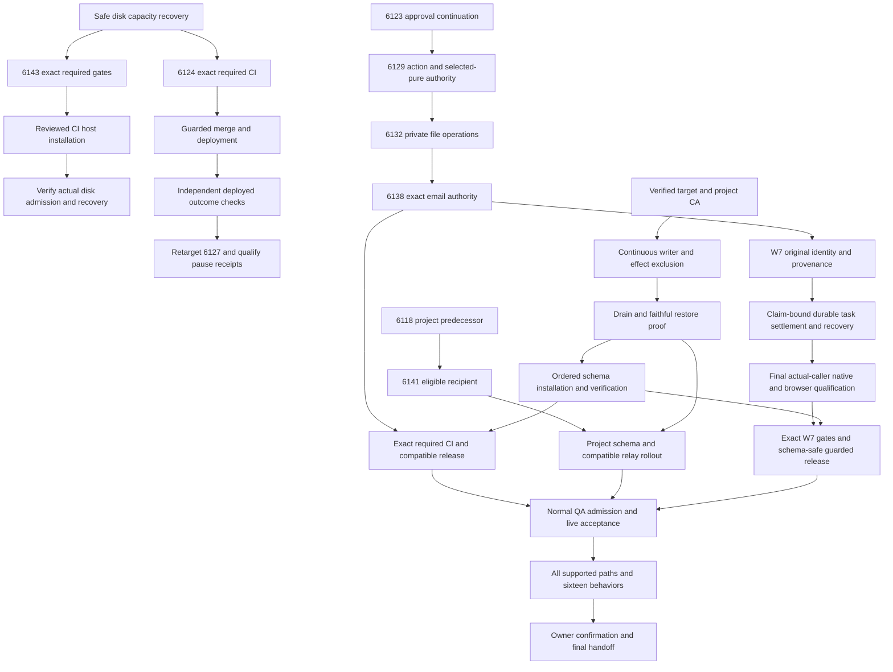

# SupraOS Release Plan Checklist

## Resumed delivery checkpoint — 2026-10-03 UTC

Execution is active again. The first partial milestone is PR6124: retain original System Workflow outcomes when completion is uncertain. Its final catalog-only successor `4db4788a2a410d826f3df280033c681973f99cdd` is published and frozen for required CI. Three lanes share the path: caller integration, release prerequisites, and independent verification. Full project scope remains unchanged.

The original candidate's held-delegation caller defect was reproduced independently: Chat lost the original workflow reference and ended with a generic stream error. A narrow repair now preserves original identity and held status through delegation, the actual Chat route, live hook, meeting card and restored consumers. Current-main composition required one test-only conflict resolution, retaining both suites. Exact successor Node22 canonical Chat157/157 and types115 pass. Independent exact-source disposable PostgreSQL/PostgREST terminal/coordinator18/18 also pass; no production records were modified. Independent Linux browser/history7/7, Telegram HTTP/browser53/53 and actual held Chat POST1/1 pass. The history fixture uses mocked auth/DB and the actual Organization adapter/card; it is not full authenticated live ChatView hydration.

Fresh read-only production inspection verified installed schema, row security, service grants and original-run uniqueness. Original CI disk failures and earlier suite failures are preserved; the normal CI service automatically superseded the old-head jobs when5588 was published. Both final contexts entered its ordinary shared queue against the same main snapshot. Final required security/build gates must pass on4db478. The preserved5588 catalog RED was repaired narrowly: four obsolete coordinator inventory anchors now represent two actual write sites. Independent catalog34/34 and direct scanner pass; unrelated writer/hazard classifications and all runtime/test/schema blobs are unchanged. No new main merge or deployment is claimed.

Authenticated live verification still needs a normal QA invitation. The user reports a signed-in Claude session; this process has abnormal account/Keychain lookups and no supported route to that session. The CLI result does not prove the user logged out. No authentication bypass is authorized. Remaining steps are required CI, guarded merge, canonical deployment/provenance and independent live acceptance with tested recovery.

See [the current delivery path, dependency rounds, owners and acceptance checks](Delivery-Path-Release-Plan.md). The paused checkpoint below is historical. This update supersedes its execution status, not its preserved evidence or unfinished scope.

Implementation paused at the owner-requested cutoff, **2026-10-02 19:36:59 UTC / 2026-10-03 03:36:59 Hong Kong**. Final documentation checkpoint: 2026-10-02T19:37:18.311500+00:00. The project is not complete. Resume only on a new owner instruction.

| Delivery item | Implemented | Integrated | Tested | Independently audited | Merged | Deployed | Verified live |
| --- | --- | --- | --- | --- | --- | --- | --- |
| PR6034 dispatch identity/checkpoint concurrency | Yes | Actual engine/checkpoint writers | Required gates and scoped checks passed | Yes | Yes | Yes | Public/unsigned only; authenticated acceptance open |
| PR6124 original outcome holds | Yes | Actual System Workflow callers | Scoped evidence; required CI queued | Yes | No | No | No |
| PR6127 pause receipts | Yes | Actual pause/receipt callers | Scoped evidence; predecessor release pending | Yes | No | No | No |
| PR6123 original scheduled approval | Yes | Actual scheduler/owner decisions | Repaired source qualified; required CI pending | Yes | No | No | No |
| PR6129 action/selected-pure authority | Yes | Actual API/bot/child/continuation paths | Frozen source qualified; required CI pending | Yes | No | No | No |
| PR6132 owner-private workflow storage | Yes | Engine/Storage SDK/owner Settings | Native and mounted browser pass; required CI pending | Yes | No | No | No |
| PR6138 exact email authority and recovery | Yes | Gmail/approval Settings/owner output | 152 mixed checks; final changed suite replay; 114 types | Yes; overlapping independent cases are not additive | No | No | No |
| PR6141 project recipient repair c8d5 | Yes | Actual deliverDispatch selection | 13 captured native +20 canonical; 52 types; required CI pending | Yes | No | No | No |
| W7 workflow tool original identity | Partial; settlement unresolved | 9070 caller chain and 678d pre-dispatch guard | 30 native,128 compatibility, Chat117; held Chat and82ad owner Chromium; post-dispatch2RED | Yes; release HOLD remains | No | No | No |
| PR6143 CI disk admission | Yes | Actual poller source; installed service unchanged | 73 tests,10 types; read-only real-host low-disk refusal; required gates open | Yes | No | No | No |
| Workflow/project schema operator and activation | Partial components | Actual operation still missing | Continuous exclusion and faithful restore open | Incomplete | No release claim | No | No |
| All supported execution paths and16 behaviors | Partial | Incomplete | Full acceptance matrix open | Incomplete | Partial components only | Partial components only | Unfinished |

## Immediate dependency order

1. Keep qualified PR6141 frozen. W7 now has original identity/provenance qualification; next is claim-bound durable task settlement and recovery. Preserve the2-case stale-result RED; a route reread does not close it.
2. Recover CI disk capacity safely and finish required CI on immutable product candidates. Qualify and install the reviewed PR6143 disk-admission repair in parallel; its installation is not a new product release gate. PR6143 is source-qualified, not installed; it does not free or reserve storage. Release no-new-SQL6124 when the unchanged guard allows it, independently observe deployment and test actual behavior;6127 follows its base.
3. Qualify target/CA, continuous writer/effect exclusion, drainage and faithful backup/restore for the actual workflow/project operator.
4. Install only reviewed uninstalled packets with same-target VERIFY/catalog/ACL/cache proof, then compatible web/cron/client rollout and controlled activation.
5. Use normal QA admission and actual provider configuration to independently verify positive, denied, revoked, failure and recovery paths.
6. Complete all 16 behaviors across every supported surface; then provide precise owner confirmation tests.

The timed implementation run is paused. The source and outstanding tasks above are preserved for the next session; this handoff is not the final project acceptance gate.

Latest release watch (19:20–19:22 UTC):6053 build failedENOSPC;6107 both required checks failed;6066/6121/6124 were genuinely queued.6066 has one architecture-document conflict; independent review found no directly overlapping runtime/test paths. Preserve both paragraphs, correct stale browser evidence wording, and qualify a narrow successor. No watched candidate was guard-ready. Preserve the failed evidence, resolve the demonstrated blocker, and require the normal exact-head checks; an infrastructure diagnosis is not a passing test.

Final19:32 update:6053 security passed but build remains failed;6066 both checks report the diagnosed atlas conflict;6107 remains failed;6121/6124/6141 remain queued;draft6143 has no required contexts yet. No watched head is merged or guard-ready. Deployment remains e74e3a. All source lanes are preserved; only the two ownership-confirmed abandoned inspection processes were stopped.

## External dependencies

- Authorized project-specific database CA/target provenance.
- Normal invitation sponsorship for the dedicated QA member; no permissions bypass.
- Pending Stripe/provider configuration for its full-scope capability.
- Actual native client isolation remains unqualified for Codex/Grok; the last Codex probe stopped at managed-preferences synchronization before reaching a provider.
- CI storage exhaustion: preserve infrastructure failure evidence, restore capacity without deleting running/foreign work, then rerun affected immutable candidates; keep budgets/priorities/controls unchanged.

## Scope and completion

Personal chat, Telegram, voice, delegation, background agents, projects/workspaces, scheduled research, Rooms, Routines and System Workflows remain in scope. iMessage is deferred; WhatsApp excluded. Each task tracks implementation, integration, tests, independent audit, merge, deployment and live verification separately. No percentage is inferred from task or test counts. A pause or partial release does not mean the project is finished.

## Dependency graph

Edges show prerequisites, not automatic permission to activate. Every release requires its exact source gates and relevant independent live checks. External prerequisites remain open until evidenced.

## Complete task index

This index preserves all33 dependency nodes. These are acceptance targets, not a claim that the work has shipped. Consult the stage table above and canonical source for exact evidence.

| ID | Work and completion criterion | Prerequisites |
| --- | --- | --- |
| P0 | Scope reconciliation and dependency plan: Maintain this plan as evidence arrives; scope is not reduced to the current three lanes. | None |
| B1 | Freeze trusted internal project execution: Actual claim/output authority; current source, attempt and digest binding; replay/task-closed/rollback/personal controls. Freeze exact commit and contract. No private owner context from producer or recovery. | P0 |
| C1 | Finish client context and history isolation: Qualify managed configuration, real authentication, existing resume-ID survival, Codex/Grok and deployed transport. Fix fixture types; close existing skills/config/SessionStart hook injection, not merely transcript reuse; prove Claude/Codex/Grok one-shot assignment and output identity with personal positive controls. Add server-authorized workspace context for Land/check/audit; unbound mixed-session commands must hold until producer/PUT/relay agreement and delayed/restarted cases are qualified. | P0 |
| M1 | Complete member dashboard and read projections: Audit every dashboard/client prop including digests/ideas/rules/streak, raw board callers, file paths; positive project-chat; real Chromium390/1440 and serialized HTML/RSC private sentinels. Freeze bounded checkpoint. | P0 |
| W1 | Bound shared DataPackage fallback waits: Per-caller cancellation without canceling shared bounded transport; pre-aborted no admission; two consumers one fetch/charge; actual HTTP header/body timeout; preserve warm cache and Routine authority. | P0 |
| B2 | Remove remaining private background producer inputs: Use reviewed project quality definitions and structured origin; test actual tick/recovery/template/continuation producers and changed publication. Owner-private sentinel absent in all shared prompts. | B1 |
| M2 | Join member result and internal message readers: Exact current publication/hash/task/job/input/result/accounting and completed_at binding; null summary compatibility; mutation/revocation races; actual HTTP and mounted browser positive/negative. Preserve explicit shared chat. | B1, M1 |
| M3 | Qualify owner-only Realtime transport: Actual socket with already-minted member JWT, owner positive, revoked/joined/nonjoined Room controls; apply/rollback/reapply; old broadcaster drain explicitly gates release. | M1 |
| J1 | Join server, clients and actual native authority: Real enqueue/pull/report/terminal/landing/internal claim/result; reclaimed refusal vs expired unreclaimed positive; no lost-ack replay; exact server response→both clients→classified result→member reader; actual SDK/CAS/native and browser. | B1, C1, M2, B2, C2 |
| W2 | Notification recipient authority and usable authoring: Derive all to/cc/bcc/channel recipients, current owner, stored/manual/scheduled/resume routes; complete owner authoring before enforcement; reject invalid recipients before provider attempt; native + browser proof. | P0 |
| W3 | File operation namespace and destination authority: Bind actual bucket/owner namespace, operation and resolved destination; owned read/write positive, traversal/cross-owner negative; original resumed principal; no production storage writes for testing. | P0, W6 |
| W4 | Named OAuth and raw API authority: Actual method/action/destination/current credentials and owner authoring; definite setup refusal vs attempted unknown; no retry after uncertain effect. Test real adapter boundaries with private local transports. | P0 |
| W5 | Child workflow and bot creation authority: Define creation/child graph/template/pipeline targets; preserve immutable owner and original graph on resume; deny before creation and prove allowed behavior with usable grant UI. | P0 |
| X1 | Qualify every supported context entry: Entry-by-entry current preferences, relevant bounded recall/skills/lessons, identity/audience, captured+consumed receipt, cancellation/recovery and actual entry positive/negative; no owner-equality shortcut. Include workspace execute, MC cron, org tasks and both workflow engines. | P0, X2, X3 |
| A1 | Finish global attention and baseline source gaps: Map all 16 behaviors to actual implementation; close each source gap using existing scheduler/store. Quiet hours/cadence/urgency, suppression, consent, truthful marks and task/calendar/support context; test before live provider acceptance. | P0 |
| R1 | Reconcile main, CI and exact release stack: Exact-head security/build and fresh main; diagnose full-suite failure without dismissing isolated pass; preserve dependent PR order; auto-merge only unchanged guard success. | P0 |
| R2 | Installed schema, profile and release packet: Read actual installed profile/ledger and dependencies; never replay installed migrations; reconcile source/schema/graph hashes and safe forward/rollback/reapply packet before activation. | P0 |
| R3 | Writer/effect drain and faithful restore rehearsal: Continuous REST+directPG admission closure, in-flight/unknown effect accounting and mixed-client/broadcaster drain; authorized production-copy role/grant-faithful restore/rehearsal. Never manufacture acceptance with production effects. | R2, R3B |
| I1 | Compose and independently qualify final source: Freeze exact head; joined native HTTP/CAS/browser, relevant full tests, affected types, G11/catalog/security/build. Failures preserved and fixed; no skipped required coverage. | J1, M3, W2, W3, W4, W5, X1, A1, W6, W7, X5 |
| D1 | Gated merge and deploy verified code: Guarded merge against fresh main; automatic code deployment when gates permit; stable actual deployed hash, smoke and independent browser. Disabled code deploy does not imply schema or activation. | I1, R1, R2, C2S |
| D2 | Activate qualified workflows after compatible rollout: Verified installed schema and migration ledger; qualified source/schema/graph; maintained writer/effect hold; authorized activation/cutover with rollback/recovery evidence. | D1, R3 |
| P1 | Provider and real computer readiness: Prepare/test all reversible adapters. Provider configuration/account/DNS/number/real worker and approved call/payment/mail inputs required for live journeys. Do not expose credentials or send unsolicited effects. | P0 |
| V1 | Stable deployed all-path and 16 behavior acceptance: Real Telegram same-worker takeover/handback/replay refusal, call/mail/payment receipts, owner consent, context/quiet/shelf behavior and every execution entry on stable deployed version; browser desktop/mobile; no mocked closure. | D2, P1 |
| U1 | Owner confirmation and final handoff: Only after independent success: concise specific user tests; report actual capabilities, evidence, code map, recovery instructions and any truly external unfinished scope. | V1 |
| W6 | Atomic usage limits for scoped capability grants: Concurrent one-use attempts cannot both enter provider/storage; original invocation recovery does not consume twice or replay an uncertain effect; revocation/expiry and personal compatibility controls. | P0 |
| W7 | Bind workspace tool effects to original tool calls: Thread server ToolContext identity, reserve before effect, preserve original run and unknown outcome, reject missing/forged identity, prove cap/no replay via actual transport. | W6 |
| X2 | Confirm System Workflow durable terminal and pause receipts: Terminal receipt qualification plus caller handling of uncertain outcomes; required CI, installed transport, pause/resume/node acknowledgments and deployed acceptance remain open. | P0 |
| X3 | Refuse zero-row completion in scheduled and direct workflows: Both scheduled engine and direct persisted execution refuse unconfirmed completion; no replay or terminal promotion after missing row. | P0 |
| X4 | Retain uncertain scheduled workflow attempts before another tick: Carry exact original identity and unknown status; atomically hold/recover original schedule attempt; real transport lost-ack and next-tick no-repeat proof, installed schema and deployed checks. | X3 |
| X5 | Qualify original scheduled approval continuation: Original paused run/approved node binding, unknown-provider no replay, concurrent resume/worker death fences, owner/config changes, native and browser acceptance before activation. | X4, W6 |
| C2 | Bind project Git commands to exact workspace: Authenticate owner+logical session+project+workspace identity for active and suspended commands; refuse delayed opposite-context commands, changed authority and missing sidecars; retain personal-only positive controls. | C1 |
| R3B | Stage runtime role before candidate schema extension: Exact named phase/catalog fingerprints, old/future owner clones, wrong-phase/partial schema/drift refusal, NOLOGIN and no active sessions, rollback from each phase. Still only OWNER_DB_URL scope, not REST/effects/global closure. | R2 |
| C2S | Install and verify project schema before server rollout: Same-operation writer exclusion and faithful backup/restore; exact installed schema and service-role ACL verification; compatibility and recovery proof. No open unknown effects or unaccounted admission holders. | R2, R3, C2 |

The newly reproduced task-settlement race adds a concrete acceptance requirement within W7/J1/X1: original claim identity must survive atomic settlement, and stale results cannot mutate or announce success for a newer claim. It is not removed from scope because a narrower System Workflow release is possible.
