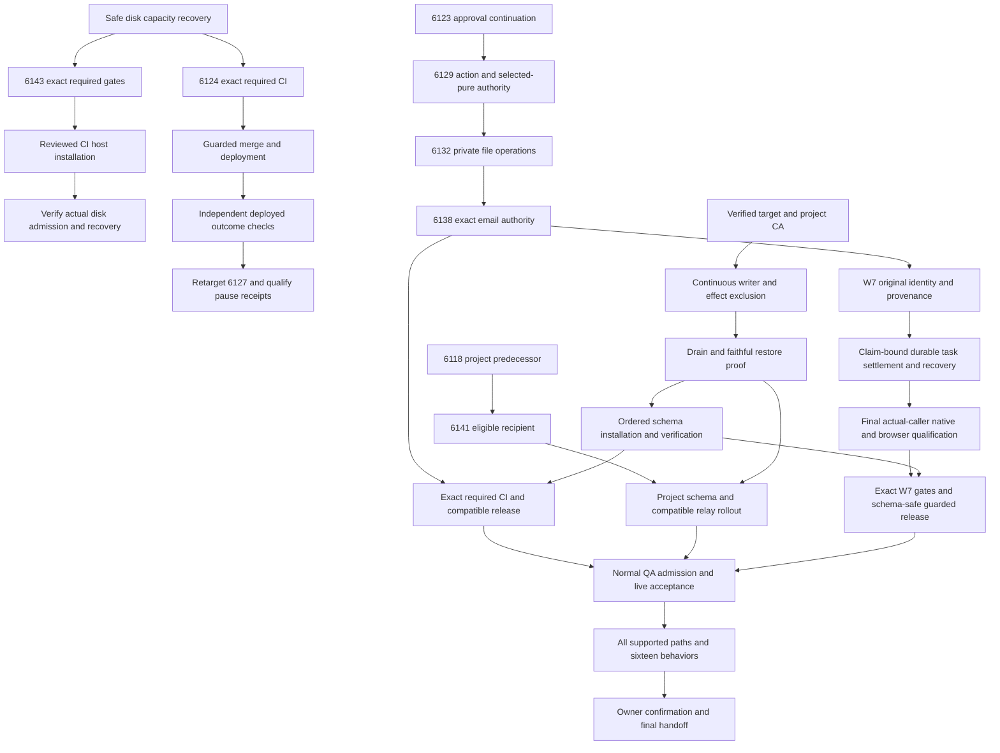

# SupraOS Release Plan Checklist

## Resumed delivery checkpoint — 2026-10-03 UTC

Public navigation: [Checklist](https://github.com/jtobkin/supraos-workflow-plan/blob/main/SupraOS-Workflow-Plan-Checklist.md) · [Dependency plan](https://github.com/jtobkin/supraos-workflow-plan/blob/main/Delivery-Path-Release-Plan.md) · [Detailed handoff](https://github.com/jtobkin/supraos-workflow-plan/blob/main/Ship-Verified-SupraOS-Agent-Workflows.md). These documents are public; application source and private evidence require repository access.

Current evidence: **13:10 UTC resumed checkpoint**. The owner explicitly resumed an eight-hour focus window **13:04:35–21:04:35 UTC**. Root and three Sol6 lanes are active under the adopted execution improvements; prior merge/deployment authorization remains subject to normal release gates. Integration owns real callers and deployment hold controls; prerequisites owns full-schema native qualification and release blockers; verification owns independent browser/native/live evidence; root owns composition, normal guarded release and this plan. Full scope remains **33 nodes, 16 behaviors and 12 surfaces**. iMessage is deferred; WhatsApp excluded. These counts are scope, not an effort or completion percentage.

### Adopted execution improvements

The [dependency plan](https://github.com/jtobkin/supraos-workflow-plan/blob/main/Delivery-Path-Release-Plan.md#execution-improvement-agreement--2026-10-03) now records the sanity-checked rules, owners, binary acceptance checks and resume rounds E1–E7. Keep both near-release candidates immutable and qualifying independently; consolidate normal QA access; run affected gate-contract regressions before full CI; qualify/reuse pinned verification tooling with fresh isolated data; classify setup/assertion/cleanup failures separately; preserve uncertain remote outcomes; maintain one current state and publish at meaningful checkpoints. No control or scope is relaxed.

Resume priorities: resolve the exact6f inventory-guard failure; finish69bd required CI; resolve normal QA admission in parallel. Then perform each ready candidate's guarded release and independent deployed journeys. The existing journal draft may finish bounded integration in spare capacity but no additional feature/receiver lane opens. Journal42 focused receiver and actual manual/automated/cron caller tests pass on the moving draft; types, coherent SQL companion pins and atlas are being finalized. Root review found the initial claim query omitted outcome while the receiver checked it; a projection-sensitive repair is in progress. Final frozen qualification, native transport and owner-reader/browser proof remain unfinished. Rollback UUID variant coverage and skipped-task wording were repaired during review; the final coherent draft has not received complete independent qualification. Four reviewer destinations stay pending.

Progress is measured as elapsed time by implementation/CI/fixture/access stage and usable capabilities verified live. No overall completion percentage is inferred from task counts. The existing33 task identities,16 behaviors and12 surfaces remain unchanged. These planning changes are documented operating rules, not installed automation.

### Released capabilities and exact evidence

| Capability | Implemented / integrated | Tested / audited | Merged | Deployed | Verified live |
|---|---|---|---|---|---|
| AgentOrb unmount cleanup, PR6121 | Yes | Required CI; independent component units10/browser390/1440 | 3c6316f221822ef9c7989efe5ddcb7de06c07885 | Exact web healthy/cron running verified05:14 | Public browser passes; admitted-owner VMSShell journey pending |
| Mobile Organization Chat, PR6053 | Yes | Required CI; actual ChatView mounted320/390/768/1200 and units7 | ef0b00b5397b5039933591a3fa7685d75cbfd57b | Exact web/cron verified05:24 | Public routes pass; authenticated deployed ChatView pending |
| Original System Workflow identity and truthful uncertain outcomes, PR6124 | Frozen4db4788a2a410d826f3df280033c681973f99cdd | Required security51/build7 on compositionaaa8419d; earlier native/caller/browser evidence retained | 4a6dd13360d56913e3dbcc323c83cdd7d25860d3 at08:05:24 | Exact web/cron4a6 image91ae verified08:19 | Public unsigned denial401 and Chromium390/1440 load smoke pass; signed original-run/permission/recovery acceptance pending invitation |
| Homepage Collective narrow-screen canvas, PR6146 | Frozendabbdaf90f54c8ee1881ddda53bbc4ba4359c143 | Preserved baseline RED, repaired actual-component320/390/768/1200; required security51/build7; independent composition review | a8cf14162e73e18d1df8bb0d2fb27ab973551ee7 at08:44:40 | Exact a8cf image4a5d verified09:01, subsequently normal descendant21ea | **PASS:** actual deployed320 Chromium on exact21ea, canvas60→304px, strokes21276→25344, no page errors; no authenticated claim |
| Reason3 contract source and public server artifacts, PR6148 | Frozen9dc78513b037bef056c7fe46a0daeaac6b6b5770 | Pinned native governance23/anchor86, baseline artifact/token-table audit; required security51/build7; independent current-main composition review | e948dcdb5bd29bb22cacd0428afd04aacc70052f at09:14:14 | Exact e948 web healthy/cron running imagef9671e7fac5eb5b370fbe9fa52ad8aad7bed5fcd7c3a0caa512a5831c2ac21ec at09:26:51 | Independent public version and all five served artifact bytes match qualified artifacts on exacte948. **No on-chain upgrade or activated W7 L1 capability.** |
| Competitor Watch natural publication recovery, PR6066 | Frozena5a91f07fc5b286e4dacde3a52e9572596f59590; existing cron/card callers | Security51/build7PASS; original native/browser provenance retained; independently reviewed clean359c composition | fc8e67f2642a40b2d58545c3254ed5c571b9c8a9 at11:28:42 | Deployed in descendant22d8c26604986bbc54df2999ad81c895ecf1bbe3; web healthy/cron running on same imagea7e720c0 at12:35 | Public version and unsigned cron401 independently PASS12:37; active-worker/card recovery acceptance pending |

At10:56:11, a subsequent canonical deployment is independently observed: web healthy and cron running at359c23dee55eb7ad4b9fe6d5321d82e4d7fad79c, imageaf924c9db2a5bcccda705f44a7a630a53c0d1b635fa4b60afeff51d1d22290bb. Earlier exact release receipts retain their original tested versions. This later deployment contains separately authored CI queue improvements; this session did not change required release controls. Public browser smoke proves loading only, not signed workflow operation. PR6146's dedicated320 receipt proves its actual canvas regression separately. Own merged, clean, idle homepage and contract worktrees were removed through normal git worktree remove; source and evidence remain retained.

### Frozen releases still pending

- **PR6149 Memory Promotion truthful outcomes:** published successor `69bd44d2bad8f6b07ca5f5882aa3f603ce4cdf9a`, branch `fix/workflow-memory-promotion-outcomes-20261003`, lane `qa-lanes/workflow-memory-promotion-outcomes-root-20261003`. Actual API `app/api/memory/workflows/run-promotion/route.ts` previously fell through failed status to success:true/HTTP200; actual `app/vms/memory/promotion/page.tsx` marked any HTTP200 complete. The repair requires confirmed completed status, preserves full original run ID, and reports lost-response uncertainty without automatic replacement. Baseline route RED → repaired8PASS; changed types13 and independent source review pass. Frozen source includes reproducible mounted-page browser fixture under `docs/agent-run/evidence/memory-promotion-outcomes-20261003/`. Independent actual-page Chromium390/1440 now passes18 repaired observations, preserving2 baseline false-success reproductions. Actual page code is mounted; wallet/auth/API are stubbed, so this is not signed deployed-owner acceptance. Parent4cce required P3C gate failed because the page rendered arbitrary backend error/detail. Full failure log SHA585db3ce4cb3429ad1f3e726f582e39b018edec6bb71961f5067be8f6d5240a6 is retained. Narrow8a successor uses safe fixed guidance, keeps original identity and no-retry behavior, removes only two resolved allowlist entries and strengthens the actual-page browser fixture with hidden-error sentinels. Root and verifier independently reviewed the repair; route8, types13 and plain-language gate pass. Exact repaired-page Linux Chromium replay now passes18 repaired observations plus2baseline expectedRED at390/1440, including full original identity, single POST/no-retry and hidden backend-error/detail sentinels. Receiptff7554935954741ff3164e3b0e9d6aae1af7fbc067674146f579ba44c100a49c is independently root-reviewed; wallet/auth/API remain stubbed. Exact8a required full unit gate failed one stale ratchet assertion:269 expected after two resolved anchors were removed,267 actual;53,915 other tests passed. Full log34b063838e7aac920dbdda3bc5b224051459916eae38a294f68295e1f830f28c is retained. Narrow69bd changes only exact expectation269→267 plus evidence README. Independent review,15 focused tests, plain-language267existing/0new, diff check and secret scan pass. Application/browser/allow-list blobs are unchanged from qualified8a. Exact69bd required security failed13:01:45 on one unchanged email-chaser browser test: an immediate button count returned0 before asynchronous rendering.53,995 other tests and4,343 other files passed; build did not run. Full log d91832105060a7d0d5955c400fb9e2a8c88d35d09c1c468b9ba2f1fe92afdf24 is retained. Tested composition670983f4 used main17fd4a85; failing test/component blobs match that main. Narrow local successor02dfbe724ad89c8a1f9adc2d4afc63816a731b83 adds one visible-Send readiness wait within the existing7s timeout before unchanged assertions. Independent source review passes; actual Linux browser verification, publication and exact required CI remain pending. Mac browser launch failed before page load, not an assertion pass. Neither candidate is merged or deployed.
- **PR6127 pause durability:** frozen `6f72840eca57045b8808823b03d1981b1f00422a`, `qa/system-workflow-pause-receipts-20261002`, targets main and is nondraft. Scoped25 plus one existing native opt-in skip, types21 and independent source/ancestry review pass. Full tree matches clean successor7d2b; seven actual pause blobs retain00cb source. Historical native log is **14/14 on Oct2 original source**, copied into the successor, not a native run of6f. Final6f native assertions now pass14/14, but the overall fixture inventory guard failed; both required security51 and build7 passed by11:14. The first colocated private attempt stopped before npm/tests because docker cp could not create a symlink inside a read-only Nix directory; no assertion executed. Receiptace6c8158a1255ac7613a2a51f89f597fbb345ba3d960feaf3a5ad302b570586 preserves the failure and cleanup. Independently reviewed evidence-only extraction/owned-cleanup successor769e8fd4 keeps source/tests/resources unchanged; its local readonly-directory/symlink/traversal/cleanup regression passes. The next attempt stopped during SSM source transfer with AWS exit254 before remote runner/npm/native tests; receipt af859d53 preserves setup failure and successful owner-marker cleanup. No native verdict. Diagnostic-only dispatcher d9d42f2d is independently reviewed: bounded monotonic polling, explicit terminal statuses, sanitized error/stage receipts, and retained scratch/logs on unknown command or incomplete readback. The final already-started attempt now reports14/14 exact6f native assertions PASS on PG17.6/PostgREST14.18/Node22, with20 source/harness hashes checked before/after. Its overall wrapper exited1 because the original running-container inventory changed. Full stdout27a734f74b358eac18cb675021081cd033986c7236326131cff6b228a42b7dd4 and stderr0acc30a5a2feac02df6038fc21c4352ddb29b33d1ad6de8789273fb220162e53 are sealed; owned cleanup completed and no fixture remains active. This is assertion PASS plus overall fixtureFAIL, not release clearance. Read-only inventory evidence shows managed web/cron/strategies recreated during the fixture window. Pre-run IDs were not retained, so exact disappeared-ID attribution remains unavailable and overall fixtureFAIL remains authoritative. Dedicated CI still has only15,486,029,824 free bytes, below its unchanged25GiB floor. Verification owns stable-environment admission and a fully qualified exact-source replay; no guard waiver or automatic retry. Fresh local exact6f native attempt also stopped before schema: macOS initdb cannot resolve UID501; all14 cases skipped, no test assertion ran. Official binaries/digests and cleanup are recorded, not presented as qualification. Native command is in `docs/agent-run/evidence/x2-pause-receipt-20261002/README.md`; unchanged CI25GiB floor currently refuses a run (last read-only free13.2GiB at10:59:30). No unowned containers or files are deleted to make room. A portable exact6f fixture contains16 independently byte-verified source files and a root-lock dependency closure. All14 tests collected with native disabled, so this is not a native pass. Colocated pinned PG17/Node22/PostgREST runtime is under review because the unchanged tests create their own Unix socket and processes.
- **PR6066 Competitor Watch — merged and deployed; signed recovery pending:** prior frozen7f18 security gate failed missing NODE_ENV in two native-test child envs; required production build7 passed. Narrow successor **a5a91f07fc5b286e4dacde3a52e9572596f59590** is published on `fix/competitor-watch-fresh-main-20261002`; two explicit test-only fields fix the type errors, with no changed production code/assertions. Changed types16 at unchanged6144MiB, G11 and independent review pass; full failed log preserved. Both exact required checks now pass51/7. Root and integration reviewed fresh359c clean composition; both merge-parent directions reconstruct treeabbd04aacb080c9ffd6200de519f6f1f0e1a55d1 from CI-logged parents. The ephemeral CI commit object had been normally removed, so this is explicitly deterministic reconstruction rather than archived-tree comparison. Normal guard mergedfc8e at11:28:42. Canonical deployment is now independently observed in descendant22d8; API ancestry confirms ahead2/behind0, matching public version. Unsigned cron refusal401 passes. Active-worker live recovery remains pending. Own merged clean idle worktree was removed normally; fetch the retained branch to inspect code. Prior actual durable-card/native/browser evidence keeps its original source scope. Other stacked draft candidates retain their prior failing/absent gate states; no unrelated candidate is cancelled or silently rebased.

At10:59:30, PR6127 security51 passed and its production build was running; PR6066 security was running and build queued. Parent PR6149 4cce security failed P3C and its dependent build was correctly not run. The reviewed narrow8a successor is now published for fresh required CI. At11:05,6127 build and6066 required checks remain pending. Shared CI free space is14,179,758,080 bytes (13.2GiB), below the unchanged25GiB native floor. This is a capacity/evidence blocker, not passing qualification. No unrelated job is cancelled and no unowned files or containers are deleted. All three prior frozen heads composed cleanly with359c at10:52; fresh composition and exact required gates are still mandatory before merge.

### W7 original effect delivery and schema qualification

Published runtime refs in **jtobkin/suprafx-platform**:

| Branch | Exact commit | Existing production integration |
|---|---|---|
| feat/w7-department-handoff-20261003 | e93747676f982baf57c009080d17d32a17e62b35 | Automated original-claim handoff/institutional retrospective and recovery |
| feat/w7-manual-retro-20261003 | f6ccfd39a3cec3f49e9a6e673b9a3e414d3bc375 | Manual terminal action retains original actor/action and retrospective receipt |
| feat/w7-plan-broadcast-global-20261003 | 4ae09b0a1d796be6646abaef74755c02c7b2479c | Existing project-summary intent to original saved project/tasks, automated/manual callers and cron |
| feat/w7-broadcast-packet-root-20261003 | abb0671739044af03e50d6cb2069529a934009f7 | Exact companion VERIFY/ROLLBACK and qualified dated-schema documentation |
| qa/w7-schema-packet-d6-20261003 | 119ef71b8e540aa8a096bbc5655d407628bd7553 | Existing operator CLI mounts read-only drain-observe; source-only, not installed |
| feat/w7-operation-hold-precondition-20261003 | afd89ce3169d787a628a85e5c5c85528f5295d8c | Runtime82b unchanged; exact private proxy fixture, PASS evidence and old/new caller census preserved; not installed |

Earlier WIP `b7345940eed17f1735e934b81555ac072a20a207` remains on `wip/w7-skill-provider-boundary-20261003`; it is preservation, not a release. Historical frozenf450 native88/SQL694 and later source evidence keep their original limits.

Current SQL SHA **c736016f742fe3d335a898a3aec7ce20bb72eae0940b2001e5404bebc80bae5c**; VERIFY **718215327c2bbe927eb3f4c12ee576f87f96dd2f9c307df566687924d731fa14**; ROLLBACK **4b4db96937fb7e9915027ed731e9c26dd12090e1ddd85d197126ee6a550385af**. Companion source0bc852 has no executable changes in documentation childabb067. Independent reduced native positive+34 refusal cases pass. **Full Sep29 captured schema** replay also passes forward/verify, pristine rollback, catalog/ACL/owner equality and reapply; receipt SHA637227a99324e28ca67b8a9b4f55fe7133301286be444e8bc57240572f83197a, capture SHAd4d4c6ff2e4309c6c26fe66f041b5856f7414fc11c00d8efde37029c61c04c43. This is a dated fixture, not current production data or schema installation.

Actual e937/f6/4ae receiver transports separately pass private PG17.6/PostgREST14.18/Node22 with original binding, lost insert/finish ACK, later-run replay and refusal evidence. Those prior fixtures used selected captured supplements; e937/f6 assert memory trigger/outbox while prior4ae does not. The full dated-capture actual4ae receiver/outbox first run restored the schema but stopped before behavioral checks because a fixture psql query parsed its formatting footer. Failed receipt4beff2be and exact original wrapper are preserved. The formatting-only -A/-t correction restored schema/forward/seed but its first3s PostgREST readiness probe timed out before the receiver. Receipt7fd5e438 preserves that second setup-inconclusive attempt. A separately reviewed readiness-only repair retried probe timeouts within the unchanged90s deadline. That bounded rerun ended before the receiver: PostgreSQL and captured forward/seed loaded; PostgREST14.18 loaded832 relations/945 RPCs, then failed to create an OS thread under unchanged1CPU/256MiB/pids128. Receipt9aa4a135 preserves this third setup-inconclusive result; owned cleanup completed. No receiver/outbox assertion ran. [PostgREST14.18 source](https://github.com/PostgREST/postgrest/blob/v14.18/postgrest.cabal#L185) confirms configurable RTS with default host-sized -N. Root and both lanes reviewed one private env addition GHCRTS=-N1; it aligns capabilities to the existing1CPU while retaining256MiB/pids128 and all timeouts/assertions. The separately authorized single rerun ended10:37:38: schema cache loaded and the prior OS-thread error did not recur, but PostgREST returned503/PGRST003 connection-pool acquisition timeouts through the unchanged90s readiness deadline. Direct PG TCP remained good. No Node receiver/outbox assertion ran. Receipt1c6d5bea777ca4f89c8058f10efcbf793317bfe0d12dd18a0b1bba1b84868a8a preserves this fourth setup-inconclusive result; owned cleanup completed and no further retry or budget change was made. One independently reviewed diagnostic has completed: actual fetch probes abort at1500ms inside the original3s outer timeout and90s readiness budget, then compare root OpenAPI and zero-row effect-intent endpoints and collect only owned process counts/aggregate DB wait categories. Root tested200/503/hanging probe behavior locally; hang aborted in1.557s. Wrapper26678441 has root plus both lane reviews. The diagnostic ended11:08:49 without reaching receiver/outbox assertions: both bounded root and zero-row probes timed out; direct PG TCP passed; owned REST had2processes/16threads/38FDs and PostgreSQL had11active/no-wait plus1idle client backends. Receiptcb53a73e334f138254985f12f3e479896a4b31a2656a594c5354a50dd0aa02de and owner cleanup are preserved. No automatic retry or receiver success is claimed. The independently reviewed actual-table-first run completed11:31:32 with PASS: exact4ae receiver created4 memories and4 captured-trigger outbox rows, including signed/unsigned lost acknowledgment, original-run replay, mixed contributors and wrong-actor/hash refusals. Receipted8ac6eedcc24e3d707505d64799601d1ac40f91202deb38704eb0a1e51f4d93 contains97 successful stages; root independently checked the receipt and source pins. Owned cleanup completed before host handoff. This closes dated full-schema receiver/outbox qualification, not current installed-target or external attestation delivery. All budgets/assertions stayed unchanged; the precise internal cause of earlier root-OpenAPI timeouts is not proved. Current production read-only catalog check finds expected memory/outbox/execution columns, service grants and memory triggers, but all four W7 tables/new RPCs remain absent. No W7 SQL is installed.

Remaining receivers include journal/department/provenance/agent copies and notification destinations. Integration owns the isolated journal lane `qa-lanes/w7-plan-broadcast-journal-20261003`, branch `feat/w7-plan-broadcast-journal-20261003`, from frozen4ae. Production callers are automated completion, signed manual completion and cron reconciliation; the owner journal GET and Conversations UI are its readers. Acceptance requires deterministic original-claim row identity, exact owner/content readback, lost-insert/finish-ACK recovery without resend, and truthful pending status for the four reviewer destinations. No fire-and-forget reviewer call counts as delivery. Prerequisites independently reviews; native and actual-reader browser checks follow source freeze. Actual f6 Memory Flow GET projection→mounted component now independently passes Chromium390/1440: one original summary, current agent/source labels, no signature sentinel, no page errors/unexpected requests. Receipt0b18293dd89b6d7853ceb8a2c1475379110b949fa61baae9b730f1e3f771323f and both screenshots are hash-verified. Auth/database are mocked and CSS/full shell are absent, so this closes scoped reader/component behavior only; production visual layout and signed HTTP/live acceptance remain pending. Rollback is pristine-only: normal gate close retains history; later rollback requires roll-forward or reviewed preimage restoration, never deleting history to enable DROP.

### Deployment prerequisites and access blockers

1. **Code/evidence — external preinstall hold:** five real admission paths are cron, project execute, workspace execute, rerun and project creation/auto_start. Existing live images do not call the new DB gate, so ingress/direct-writer exclusion and old-handler drain must precede schema install. Integration's actual file-provider helper is published at `82b30559bc323a9f9c113e03b881be8c0f36bbb0` on `feat/w7-operation-hold-precondition-20261003`, source-only in `qa-lanes/w7-operation-hold-precondition-20261003`, with exact proxy/router/file preimages, atomic no-overwrite publish, retained hold on uncertainty and hash-bound release prerequisites. The exact actual-helper/private Traefik fixture now passes independently:30 admission cases503 after propagation, repeated backend count stable, reads preserved, all30 restored200. Seven requests entered during initial propagation; receipt af1e0b46b5fbfb2b8b98cab7ebccde8de28dbae289a819ddef19c60da744b019 preserves that critical limit. Portable exact fixture and documentation are published in child6b68fe2e474cccf07b523db2c98b67a714d18b1a plus census-only afd89ce3169d787a628a85e5c5c85528f5295d8c, runtime helper unchanged. No serving hold applied. Direct writers and continuously enforced exclusion are separate mandatory proof.
2. **Evidence — old-image accepted-handler drain:** fresh serving21ea/c71b private shadow times out at45s unauthorized warmup, before the unchanged authenticated8s phase. External loopback-only profiler succeeds and points to synchronous Node/Next module loading/compilation; it does not prove a single culprit or drain. Read-only exact serving Next15.5.24 file hashes match local source: sampled next-server.js:599 is inside all-entry eager preload, and the serving compiled config sets preloadEntriesOnStart=true. This supports a startup-cost hypothesis, not proved causality. A bounded basename-only parent-stack diagnostic is independently reviewed; its earlier e948/f967 pin was preserved as stale. Read-only current compiled-host census now binds359c/af924 (8,925 JavaScript files,430 expected host matches). A separately reviewed image/hash-only repin is prepared, not run, with unchanged request budgets/resources. It remains behind existing release-blocking browser/native work and must fail if serving advances again. Failure/profiler receipts are retained. Exact serving web/cron have no configured Docker CPU/memory cap, while the private shadow retains1CPU/2GiB; its cold-start timeout is a constrained-fixture evidence gap, not proof of a serving startup defect.
3. **Code/evidence — production operator chain:** mounted read-only drain-observe returns HOLD/UNKNOWN only and explicitly cannot claim external exclusion; actual unexpected-PASS baseline RED and repaired6PASS retained. Production drain/restore/live receipt producers and faithful production backup/restore acceptance remain pending. Current operator verify_host requires the old web container to be running for every phase; it therefore cannot verify a completed stop-and-drain phase. The next operator repair must bind original stopped web/cron identities and replacement running image to the same operation, retain hold through recovery, and separately prove direct credential-holder exclusion. Safe historical named-container equality also identifies supraos-strategies as sharing the service-role key and writing feed/memory through its bot pipeline; normal start-supraos can restart it. Strategies suspension/recovery and restart blocking must be part of the same operation. Mac/Railway/external holders remain unverified; source absence of a direct W7 RPC call does not revoke their broad credential capability. Synthetic two-cluster rehearsal passes are not production acceptance. New gate only protects post-install admission.
4. **Evidence/controlled action — L1:** source/server artifact release6148 does not publish a Move upgrade. Same-compiler baseline artifacts and core token tables were audited, but actual deployed-package VM compatibility, controlled platform-admin upgrade with registry preservation, and live original reason3/foreign/revoked/paused tests remain required. Public simulation lacks a legitimate verified authenticator; invalid-auth responses are not VM compatibility evidence. No transaction signed or submitted; receiver stays held.
5. **Access — signed live QA:** dedicated normal QA invitation remains missing. User reports Claude signed into j.tobkin@supra.com, while reachable CLI reports signed out; no auth bypass, self-sponsorship or fabricated invitation. Existing member must supply a normal invite before owner/foreign-owner live acceptance can close. Independent code/CI/public checks continue.

### Execution order, evidence and new-computer continuation

Next dependency rounds: finish exact6f overall native qualification and independently qualify the narrow69bd→02df required-gate repair; full dated captured receiver/outbox qualification is now closed. Integrate the existing journal destination in its own branch with original-claim receipt recovery and explicit pending reviewer delivery; actual-helper/private Traefik and scoped Memory Flow browser are now closed with their limits above. Memory Promotion mounted browser and independent6148 public artifact-byte checks are closed. The three queued release branches composed cleanly with observed main980f at10:16; this prequalification does not replace final required CI or a fresh merge-time composition check. Exact required gates → reviewed guarded merge → canonical deployment → signed live checks where normal access exists. In parallel complete/review private actual hold and bounded old-image diagnosis, then the production operator chain. Keep new work on separate branches; a frozen candidate changes only for a demonstrated blocker with failed evidence and narrow independent repair. Do not cancel qualification as unrelated main advances.

Clone **jtobkin/suprafx-platform**, fetch the exact branch/commit above, and read its AGENTS.md, CONTEXT.md, AI_BUILD_PROTOCOL and atlas. Production code is in `app/`, `components/`, `lib/`, migrations in `supabase/`, operator/release tools in `scripts/qa/` and `scripts/ci/`, evidence/tests under `docs/agent-run/evidence/` and `tests/`. Consult the historical detailed handoff below for the full client/relay/native/server inventory and remaining33-node map; do not treat old pending statements as this checkpoint's current release state.

Workstation lanes live under `/Users/joshuatobkin/qa-lanes/`, receipts under `/Users/joshuatobkin/qa-evidence/resume-delivery-20261003/`, complete machine-readable plan at `qa-evidence/supraos-execution-plan-20261001/plan.json`. A new computer must fetch GitHub source and retrieve separately retained local receipts; those paths are not automatically available remotely. A reviewed [portable native receiver source archive](https://github.com/jtobkin/suprafx-platform/tree/f54a202a98b879a82c2eee2828a0b8ca53995615/docs/agent-run/evidence/portable-w7-native-receivers-20261003) is now saved privately on GitHub:27 exact files, four independently rebuilt bundles with identical executable text and location-only comment differences. It includes synthetic SQL/seeds/builders, exact source pins, manifests and setup limits; host dispatchers and credentials are excluded. Thirty uploaded files were byte-verified. Directory and one-commit secret scans each reported the same two reviewed nonsecret SQL enum false positives; this is explicitly not a clean scanner verdict. Native scenario receipts remain separately retained, and this archive does not claim a new native run. Public documentation lives in **jtobkin/supraos-workflow-plan/main**; private detailed copy and JSON live on **docs/paused-workflow-handoff-20261002** under `docs/agent-run/handoffs/`. Earlier preserved patch files are historical b734 recovery artifacts, not patches to apply over current successors. No credentials belong in either document.

Continuation evidence is also preserved in the private repository at [continued delivery receipts](https://github.com/jtobkin/suprafx-platform/tree/72cdf595bf4914c7dadc1820607af707504f788f/docs/agent-run/evidence/continued-delivery-20261003): full-capture independent review, deployed Competitor Watch public checks and composition, exact Memory Promotion browser review, and retained pause transfer failure. Six uploaded files were byte-verified after a clean secret scan. Their individual scope limits remain authoritative.

Private fixtures use owned containers, pinned tools, unchanged capacity floors and cleanup; original serving inventory is preserved. Browser uses official immutable Playwright1.62.1, nonroot sandbox, trusted TLS, no production mounts/environment or published ports. Shared CI25GiB and private50GiB disk/16GiB RAM floors remain unchanged. One private fixture host slot is shared; source/review/read-only release checks continue concurrently.

**Finished** means all supported paths and16 behaviors satisfy positive, denied/revoked, failure/cancellation, uncertainty and recovery acceptance on deployed/activated source, with exact required gates and independently verified live journeys. Client context isolation, original-run scheduled continuation, remaining effects and full operator chain remain in scope. A partial release, disabled feature or passing fixture does not close the project. User confirmation tests follow independent acceptance, not replace it.

The paused checkpoint below is historical. This update supersedes its execution status, not its preserved evidence or unfinished scope.

## Historical paused checkpoint — superseded by current update

Implementation paused at the owner-requested cutoff, **2026-10-02 19:36:59 UTC / 2026-10-03 03:36:59 Hong Kong**. Final documentation checkpoint: 2026-10-02T19:37:18.311500+00:00. The project is not complete. Resume only on a new owner instruction.

| Delivery item | Implemented | Integrated | Tested | Independently audited | Merged | Deployed | Verified live |
| --- | --- | --- | --- | --- | --- | --- | --- |
| PR6034 dispatch identity/checkpoint concurrency | Yes | Actual engine/checkpoint writers | Required gates and scoped checks passed | Yes | Yes | Yes | Public/unsigned only; authenticated acceptance open |
| PR6124 original outcome holds | Yes | Actual System Workflow callers | Scoped evidence; required CI queued | Yes | No | No | No |
| PR6127 pause receipts | Yes | Actual pause/receipt callers | Scoped evidence; predecessor release pending | Yes | No | No | No |
| PR6123 original scheduled approval | Yes | Actual scheduler/owner decisions | Repaired source qualified; required CI pending | Yes | No | No | No |
| PR6129 action/selected-pure authority | Yes | Actual API/bot/child/continuation paths | Frozen source qualified; required CI pending | Yes | No | No | No |
| PR6132 owner-private workflow storage | Yes | Engine/Storage SDK/owner Settings | Native and mounted browser pass; required CI pending | Yes | No | No | No |
| PR6138 exact email authority and recovery | Yes | Gmail/approval Settings/owner output | 152 mixed checks; final changed suite replay; 114 types | Yes; overlapping independent cases are not additive | No | No | No |
| PR6141 project recipient repair c8d5 | Yes | Actual deliverDispatch selection | 13 captured native +20 canonical; 52 types; required CI pending | Yes | No | No | No |
| W7 workflow tool original identity | Partial; settlement unresolved | 9070 caller chain and 678d pre-dispatch guard | 30 native,128 compatibility, Chat117; held Chat and82ad owner Chromium; post-dispatch2RED | Yes; release HOLD remains | No | No | No |
| PR6143 CI disk admission | Yes | Actual poller source; installed service unchanged | 73 tests,10 types; read-only real-host low-disk refusal; required gates open | Yes | No | No | No |
| Workflow/project schema operator and activation | Partial components | Actual operation still missing | Continuous exclusion and faithful restore open | Incomplete | No release claim | No | No |
| All supported execution paths and16 behaviors | Partial | Incomplete | Full acceptance matrix open | Incomplete | Partial components only | Partial components only | Unfinished |

## Immediate dependency order

1. Keep qualified PR6141 frozen. W7 now has original identity/provenance qualification; next is claim-bound durable task settlement and recovery. Preserve the2-case stale-result RED; a route reread does not close it.
2. Recover CI disk capacity safely and finish required CI on immutable product candidates. Qualify and install the reviewed PR6143 disk-admission repair in parallel; its installation is not a new product release gate. PR6143 is source-qualified, not installed; it does not free or reserve storage. Release no-new-SQL6124 when the unchanged guard allows it, independently observe deployment and test actual behavior;6127 follows its base.
3. Qualify target/CA, continuous writer/effect exclusion, drainage and faithful backup/restore for the actual workflow/project operator.
4. Install only reviewed uninstalled packets with same-target VERIFY/catalog/ACL/cache proof, then compatible web/cron/client rollout and controlled activation.
5. Use normal QA admission and actual provider configuration to independently verify positive, denied, revoked, failure and recovery paths.
6. Complete all 16 behaviors across every supported surface; then provide precise owner confirmation tests.

The timed implementation run is paused. The source and outstanding tasks above are preserved for the next session; this handoff is not the final project acceptance gate.

Latest release watch (19:20–19:22 UTC):6053 build failedENOSPC;6107 both required checks failed;6066/6121/6124 were genuinely queued.6066 has one architecture-document conflict; independent review found no directly overlapping runtime/test paths. Preserve both paragraphs, correct stale browser evidence wording, and qualify a narrow successor. No watched candidate was guard-ready. Preserve the failed evidence, resolve the demonstrated blocker, and require the normal exact-head checks; an infrastructure diagnosis is not a passing test.

Final19:32 update:6053 security passed but build remains failed;6066 both checks report the diagnosed atlas conflict;6107 remains failed;6121/6124/6141 remain queued;draft6143 has no required contexts yet. No watched head is merged or guard-ready. Deployment remains e74e3a. All source lanes are preserved; only the two ownership-confirmed abandoned inspection processes were stopped.

## External dependencies

- Authorized project-specific database CA/target provenance.
- Normal invitation sponsorship for the dedicated QA member; no permissions bypass.
- Pending Stripe/provider configuration for its full-scope capability.
- Actual native client isolation remains unqualified for Codex/Grok; the last Codex probe stopped at managed-preferences synchronization before reaching a provider.
- CI storage exhaustion: preserve infrastructure failure evidence, restore capacity without deleting running/foreign work, then rerun affected immutable candidates; keep budgets/priorities/controls unchanged.

## Scope and completion

Personal chat, Telegram, voice, delegation, background agents, projects/workspaces, scheduled research, Rooms, Routines and System Workflows remain in scope. iMessage is deferred; WhatsApp excluded. Each task tracks implementation, integration, tests, independent audit, merge, deployment and live verification separately. No percentage is inferred from task or test counts. A pause or partial release does not mean the project is finished.

## Dependency graph

Edges show prerequisites, not automatic permission to activate. Every release requires its exact source gates and relevant independent live checks. External prerequisites remain open until evidenced.

## Complete task index

This index preserves all33 dependency nodes. These are acceptance targets, not a claim that the work has shipped. Consult the stage table above and canonical source for exact evidence.

| ID | Work and completion criterion | Prerequisites |
| --- | --- | --- |
| P0 | Scope reconciliation and dependency plan: Maintain this plan as evidence arrives; scope is not reduced to the current three lanes. | None |
| B1 | Freeze trusted internal project execution: Actual claim/output authority; current source, attempt and digest binding; replay/task-closed/rollback/personal controls. Freeze exact commit and contract. No private owner context from producer or recovery. | P0 |
| C1 | Finish client context and history isolation: Qualify managed configuration, real authentication, existing resume-ID survival, Codex/Grok and deployed transport. Fix fixture types; close existing skills/config/SessionStart hook injection, not merely transcript reuse; prove Claude/Codex/Grok one-shot assignment and output identity with personal positive controls. Add server-authorized workspace context for Land/check/audit; unbound mixed-session commands must hold until producer/PUT/relay agreement and delayed/restarted cases are qualified. | P0 |
| M1 | Complete member dashboard and read projections: Audit every dashboard/client prop including digests/ideas/rules/streak, raw board callers, file paths; positive project-chat; real Chromium390/1440 and serialized HTML/RSC private sentinels. Freeze bounded checkpoint. | P0 |
| W1 | Bound shared DataPackage fallback waits: Per-caller cancellation without canceling shared bounded transport; pre-aborted no admission; two consumers one fetch/charge; actual HTTP header/body timeout; preserve warm cache and Routine authority. | P0 |
| B2 | Remove remaining private background producer inputs: Use reviewed project quality definitions and structured origin; test actual tick/recovery/template/continuation producers and changed publication. Owner-private sentinel absent in all shared prompts. | B1 |
| M2 | Join member result and internal message readers: Exact current publication/hash/task/job/input/result/accounting and completed_at binding; null summary compatibility; mutation/revocation races; actual HTTP and mounted browser positive/negative. Preserve explicit shared chat. | B1, M1 |
| M3 | Qualify owner-only Realtime transport: Actual socket with already-minted member JWT, owner positive, revoked/joined/nonjoined Room controls; apply/rollback/reapply; old broadcaster drain explicitly gates release. | M1 |
| J1 | Join server, clients and actual native authority: Real enqueue/pull/report/terminal/landing/internal claim/result; reclaimed refusal vs expired unreclaimed positive; no lost-ack replay; exact server response→both clients→classified result→member reader; actual SDK/CAS/native and browser. | B1, C1, M2, B2, C2 |
| W2 | Notification recipient authority and usable authoring: Derive all to/cc/bcc/channel recipients, current owner, stored/manual/scheduled/resume routes; complete owner authoring before enforcement; reject invalid recipients before provider attempt; native + browser proof. | P0 |
| W3 | File operation namespace and destination authority: Bind actual bucket/owner namespace, operation and resolved destination; owned read/write positive, traversal/cross-owner negative; original resumed principal; no production storage writes for testing. | P0, W6 |
| W4 | Named OAuth and raw API authority: Actual method/action/destination/current credentials and owner authoring; definite setup refusal vs attempted unknown; no retry after uncertain effect. Test real adapter boundaries with private local transports. | P0 |
| W5 | Child workflow and bot creation authority: Define creation/child graph/template/pipeline targets; preserve immutable owner and original graph on resume; deny before creation and prove allowed behavior with usable grant UI. | P0 |
| X1 | Qualify every supported context entry: Entry-by-entry current preferences, relevant bounded recall/skills/lessons, identity/audience, captured+consumed receipt, cancellation/recovery and actual entry positive/negative; no owner-equality shortcut. Include workspace execute, MC cron, org tasks and both workflow engines. | P0, X2, X3 |
| A1 | Finish global attention and baseline source gaps: Map all 16 behaviors to actual implementation; close each source gap using existing scheduler/store. Quiet hours/cadence/urgency, suppression, consent, truthful marks and task/calendar/support context; test before live provider acceptance. | P0 |
| R1 | Reconcile main, CI and exact release stack: Exact-head security/build and fresh main; diagnose full-suite failure without dismissing isolated pass; preserve dependent PR order; auto-merge only unchanged guard success. | P0 |
| R2 | Installed schema, profile and release packet: Read actual installed profile/ledger and dependencies; never replay installed migrations; reconcile source/schema/graph hashes and safe forward/rollback/reapply packet before activation. | P0 |
| R3 | Writer/effect drain and faithful restore rehearsal: Continuous REST+directPG admission closure, in-flight/unknown effect accounting and mixed-client/broadcaster drain; authorized production-copy role/grant-faithful restore/rehearsal. Never manufacture acceptance with production effects. | R2, R3B |
| I1 | Compose and independently qualify final source: Freeze exact head; joined native HTTP/CAS/browser, relevant full tests, affected types, G11/catalog/security/build. Failures preserved and fixed; no skipped required coverage. | J1, M3, W2, W3, W4, W5, X1, A1, W6, W7, X5 |
| D1 | Gated merge and deploy verified code: Guarded merge against fresh main; automatic code deployment when gates permit; stable actual deployed hash, smoke and independent browser. Disabled code deploy does not imply schema or activation. | I1, R1, R2, C2S |
| D2 | Activate qualified workflows after compatible rollout: Verified installed schema and migration ledger; qualified source/schema/graph; maintained writer/effect hold; authorized activation/cutover with rollback/recovery evidence. | D1, R3 |
| P1 | Provider and real computer readiness: Prepare/test all reversible adapters. Provider configuration/account/DNS/number/real worker and approved call/payment/mail inputs required for live journeys. Do not expose credentials or send unsolicited effects. | P0 |
| V1 | Stable deployed all-path and 16 behavior acceptance: Real Telegram same-worker takeover/handback/replay refusal, call/mail/payment receipts, owner consent, context/quiet/shelf behavior and every execution entry on stable deployed version; browser desktop/mobile; no mocked closure. | D2, P1 |
| U1 | Owner confirmation and final handoff: Only after independent success: concise specific user tests; report actual capabilities, evidence, code map, recovery instructions and any truly external unfinished scope. | V1 |
| W6 | Atomic usage limits for scoped capability grants: Concurrent one-use attempts cannot both enter provider/storage; original invocation recovery does not consume twice or replay an uncertain effect; revocation/expiry and personal compatibility controls. | P0 |
| W7 | Bind workspace tool effects to original tool calls: Thread server ToolContext identity, reserve before effect, preserve original run and unknown outcome, reject missing/forged identity, prove cap/no replay via actual transport. | W6 |
| X2 | Confirm System Workflow durable terminal and pause receipts: Terminal receipt qualification plus caller handling of uncertain outcomes; required CI, installed transport, pause/resume/node acknowledgments and deployed acceptance remain open. | P0 |
| X3 | Refuse zero-row completion in scheduled and direct workflows: Both scheduled engine and direct persisted execution refuse unconfirmed completion; no replay or terminal promotion after missing row. | P0 |
| X4 | Retain uncertain scheduled workflow attempts before another tick: Carry exact original identity and unknown status; atomically hold/recover original schedule attempt; real transport lost-ack and next-tick no-repeat proof, installed schema and deployed checks. | X3 |
| X5 | Qualify original scheduled approval continuation: Original paused run/approved node binding, unknown-provider no replay, concurrent resume/worker death fences, owner/config changes, native and browser acceptance before activation. | X4, W6 |
| C2 | Bind project Git commands to exact workspace: Authenticate owner+logical session+project+workspace identity for active and suspended commands; refuse delayed opposite-context commands, changed authority and missing sidecars; retain personal-only positive controls. | C1 |
| R3B | Stage runtime role before candidate schema extension: Exact named phase/catalog fingerprints, old/future owner clones, wrong-phase/partial schema/drift refusal, NOLOGIN and no active sessions, rollback from each phase. Still only OWNER_DB_URL scope, not REST/effects/global closure. | R2 |
| C2S | Install and verify project schema before server rollout: Same-operation writer exclusion and faithful backup/restore; exact installed schema and service-role ACL verification; compatibility and recovery proof. No open unknown effects or unaccounted admission holders. | R2, R3, C2 |

The newly reproduced task-settlement race adds a concrete acceptance requirement within W7/J1/X1: original claim identity must survive atomic settlement, and stale results cannot mutate or announce success for a newer claim. It is not removed from scope because a narrower System Workflow release is possible.
