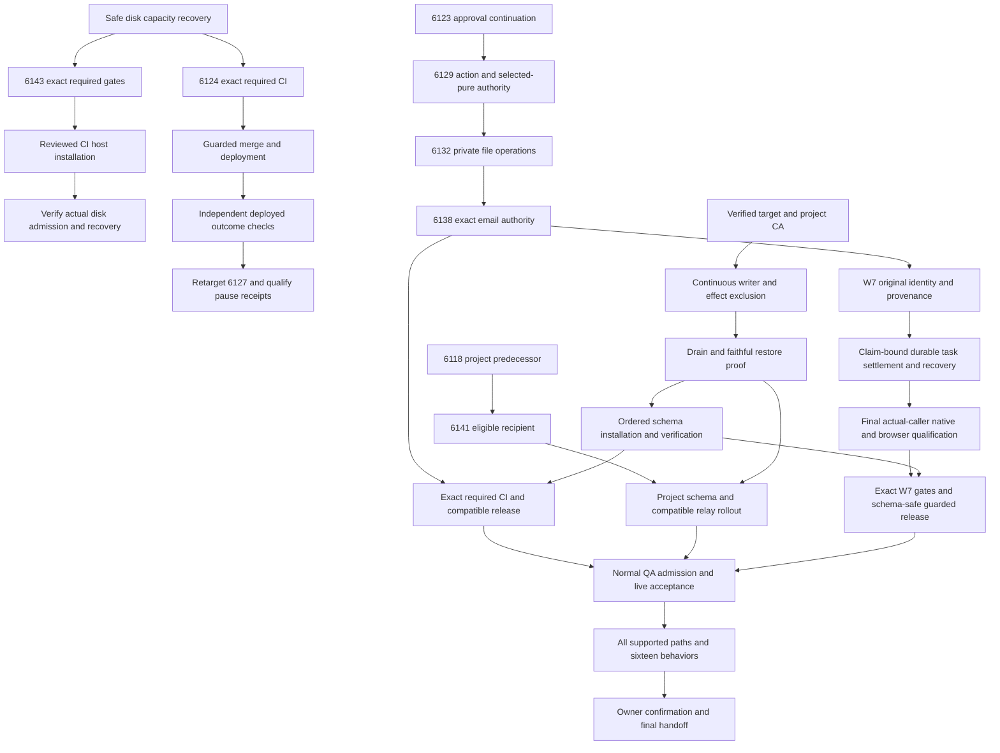

# SupraOS Release Plan Checklist

## Resumed delivery checkpoint — 2026-10-03 UTC

Execution is active again at the owner's request, with a six-hour focus window from 04:49:35 to 10:49:35 UTC. Three existing lanes own implementation and actual caller integration, release prerequisites, and independent verification. Root owns composition, guarded release, live provenance, and the newly demonstrated contract compatibility blocker. Full scope remains all 33 nodes, 16 behaviors and 12 supported surfaces; iMessage is deferred and WhatsApp excluded. A partial release does not complete the project. No code-completion percentage is asserted.

### Releases and current evidence

| Capability | Implemented / integrated | Tested / independently reviewed | Merged | Deployed | Verified live |
|---|---|---|---|---|---|
| AgentOrb unmount cleanup, PR6121 | Yes | Exact candidate required CI; independent current-main units10 and Chromium390/1440 | `3c6316f221822ef9c7989efe5ddcb7de06c07885`, normal guard, 04:58:38 UTC | Yes: web healthy and cron running at exact3c, same image `sha256:b70740b8bd8e973ca3adb9a2b86400a5d0052fdbf12b603ca8768f6561df77ee`, observed05:14:55 | Independent deployed public Chromium390/1440 passed; actual admitted-owner VMSShell avatar journey still pending |
| Mobile Organization Chat, PR6053 | Yes | Exact-head required CI; fresh post6121 composition tree `6c6f833fe4fb2111c91830660e11243e0725a371`, independent actual ChatView Chromium320/390/768/1200 and units7 | `ef0b00b5397b5039933591a3fa7685d75cbfd57b`, normal guard, 05:07:37 UTC | Yes: web healthy and cron running at exactef0b, image `sha256:9123c502992d3d52928ddc647b012ede56c2a9e4d7817be2b6d53f630864b72a`, observed05:24:06 | Public routes checked; separate homepage320 canvas RED preserved and narrow repair in progress. Authenticated deployed ChatView remains pending; mounted fixture APIs are not a live owner journey |
| Original System Workflow identity and truthful uncertain outcomes, PR6124 | Yes on frozen `4db4788a2a410d826f3df280033c681973f99cdd` | Scoped/native/browser evidence retained; final required security/build CI still queued | No | No | No; normal QA invitation remains unresolved |
| W7 original-claim effects and recovery | Intermediate destinations, chain/BFT, handoff and institutional retrospective integrated in published checkpointe937; other destinations remain pending | Prior frozen f450 native88 retained; successor SQL67 chain native8, actual-callers30 and mounted MissionControl390/1440 pass; caller/UI service boundaries are mocked | No | No; new SQL uninstalled | No |
| Operation-bound admission, drain and faithful restore | Synthetic executable guard built; real SQL/operator mounting in progress | Independent PG17 two-cluster rehearsal passes close barrier, replay, permission refusal, checked restore rejection and selected catalog/data equality | No | No | No production cutover or production backup acceptance |

The AgentOrb fix prevents callbacks surviving unmount; the chat fix keeps the thread visible and department selection usable on mobile. Both merges preserved the normal release guard. Current production deployment and each service's source/image must be checked separately; the newest Git main is not automatically live. Required PR6124 checks are not cancelled just because unrelated main advances. Its eventual CI tested-main/merge receipts must be reviewed before guard admission.

A deterministic public homepage defect was found after deployment: at320px, the Collective canvas subtracts30 from a ring radius smaller than30 and throws. Three isolated deployed browser contexts reproduced it; preserved log `verification/pr6053-320-home-repro.log` SHA39bab265. Root owns the narrow two-radius repair in `qa-lanes/homepage-mobile-gradient-root-20261003`; independent actual-component baseline RED and repaired draw-loop GREEN pass at320/390/768/1200. Exact candidate `dabbdaf90f54c8ee1881ddda53bbc4ba4359c143` is PR6146, awaiting required CI and guarded release. This does not prove authenticated Organization Chat acceptance failed, and it does not reset PR6124.

### Latest checkpoint — 07:16 UTC

- PR6124 remains frozen at4db478. Required security/build checks remain pending in the normal queue; normal FIFO queue rank improved to7/8 of26 at07:12; worker progress was observed. No qualification was cancelled, reordered or weakened. Normal authenticated QA access remains a separate acceptance blocker.
- PR6146 remains frozen at `dabbdaf90f54c8ee1881ddda53bbc4ba4359c143`. Final scoped types12 and independent actual Collective browser draw-loop checks at320/390/768/1200 pass; required CI, guarded merge, deployment and live regression remain pending.
- PR6066 conflict repair is published as `7f18e0fb9c44883e141ca6aaa5673898dfafc2c5`. Both architecture entries are retained, all seven runtime/test files match the prior candidate, independent review and G11 pass. Its ordinary successor CI is pending; this is not deployed publication recovery.
- W7 receiver checkpoint is `e93747676f982baf57c009080d17d32a17e62b35` on `feat/w7-department-handoff-20261003`. The paused-created rerun repair independently passes actual mounted Chromium390/1440, including no automatic execute after850ms and explicit resume control. Auth/API service boundaries are stubbed; no live acceptance is claimed.
- Native isolated PostgreSQL17 reproduced both delayed-close defects on old SQL604 and passed both on operation-ledger SQL333. Receipt SHA `b675f0b81f6a1fe6214a4ef50c1d4fa50756db995be96f345ccf69ddf63b7a5c`. This qualifies that synthetic gate behavior, not captured production schema, old-worker drain or installation.
- A separate native scheduler failure is preserved: SQL333 rejected an already implemented receiver kind. Narrow SQLcc39 expands the allowlist to all18 mapped receivers; isolated PostgreSQL17 service-role replay now passes all18 kinds, duplicate CAS refusal, foreign-owner refusal and unknown-kind refusal. Receipt SHA `43246e80fa98dbdc1ebb3daf1c6fe6eccf48e976a8834069686e46998a890ee8`. This is reduced synthetic schema/direct psql, not final captured-schema/PostgREST/live proof.
- Department handoff now has a named production receiver, cron recovery and actual owner-scoped Handoffs GET/UI caller. Root reproduced a GET bug where501 other-project events hid an older target-project handoff; filtering before the existing500 limit repairs it. Four scoped route tests and independent source review pass; actual PostgreSQL17/PostgREST14.18 query proof now passes: both original rows survive501 newer other-project events and the foreign-owner row is omitted; log SHA95aaed3a68b762ee18c08876f610849c8b6e8cf5bd1a74e60e04ee70c7da4935. This proves query semantics, not an authenticated deployed route.
- Actual HandoffsTab original mobile RED is retained. Responsive repairdf18 now passes independent actual Chromium390/1440: title/status visible, Unknown rather than false Completed, detail expansion and no overflow/page errors; log SHA4b102a3b. Auth and GET response are stubbed, so this is mounted component acceptance only.
- Native adversarial tests exposed two successive handoff binding defects: SQLcc39 accepted a nonexistent target/wrong project (receipt9cccced1); SQL0f5 then accepted mutated original source name/department after a legitimate positive control (receipt926c42f1). Frozen successor SQLb87 uses locked original source and saved target/dependency/project. Focused14 and types929 pass; unchanged native negative/positive replay now passes in two separate PostgreSQL17 fixture databases (receipt42b08957), including legitimate saved snapshot readback and no partial writes on refusal. Actual receiver PostgREST delivery/readback is prepared but awaits shared CI disk capacity. Failed evidence is preserved.
- Root retrospective module `44d0859c5bfb9a1bbe65b5bb60ba5ef0aacfcb14` is published on `feat/w7-plan-retro-global-root-20261003`, with22 scoped tests/types11 and independent source review. It requires delivered original plan finalization and stores one exact institutional memory with lost-ACK recovery. The receiver is now joined into e937 with actual settlement-after-finalization, fair cron recovery and SQL touch19. Root actual caller tests detect the pre-wiring source (8 failures/2 passes) and pass10/10 on e937, with changed types933 and independent review. Test-only checkpoint59da16e179 retains these checks. Native direct-role touch19 passes every mapped kind plus stale/foreign/unknown controls (receipt5f5be35b). The receiver native transport overlay is prepared and type-checked but unrun; caller tests use DB/receiver doubles. Per-agent retrospective and aggregate broadcasts remain separate pending destinations.
- Private proxy-double rehearsal passes30 held admissions, reads, accepted slow request and restore. The exact old deployed image isolated rehearsal reached private TLS/PostgREST, then timed out before the expected accepted-cron witness. A fixture boot race was repaired; an exact-image unauthorized warmup then still timed out at45 seconds without a plan read (receiptb9ae6bde). The unchanged authenticated8-second budget remains unqualified. QA-only CPU/network metadata diagnostics are being prepared; no egress or TLS bypass is allowed. No old-image drain pass, production ingress change or production backup acceptance is claimed.
- PR6148 reason3 contract repair remains frozen at `9dc78513b037bef056c7fe46a0daeaac6b6b5770`. Same pinned compiler baseline now builds: unchanged governance/anchor modules are byte-identical; cores grow17 bytes with unchanged structure/function handle tables. Native23/86 and independent token review pass. Actual VM upgrade compatibility, normal controlled upgrade and live proof remain open. The no-sign simulation failed before VM execution; no transaction was signed or submitted. L1 receiver remains held.
- Earlier observed production source was5652a761, with healthy web and running cron on identical image70d5f945; exact fresh image/compiled-host receipt SHAeeb2b734. This includes the earlier AgentOrb/Organization Chat merges but does not establish authenticated live journeys.

### W7 source, integration and recovery

The preserved WIP source is published at `b7345940eed17f1735e934b81555ac072a20a207` on `wip/w7-skill-provider-boundary-20261003` in jtobkin/suprafx-platform. It includes original skill-roster capture, actual provider/submission dispatch boundaries, atomic skill counters, fair recovery, Kanban and prior effect receivers. It is not a release. Historical SQL11c native83, provider15, owner-handler6, browser, subscription101 and types912 results retain their recorded limits.

Current integration worktree: `/Users/joshuatobkin/qa-lanes/w7-claim-settlement-successor-20261003`, branch `feat/w7-department-handoff-20261003`. Historical checkpoint `f45067a685` includes assignment receipt commit0423906 and independently reviewed fresh-BFT routing guard57ef. SQL694 (`69489f65a216775b49b10f00fc2fe03bb6c2aae5b9a7244e939f721f843cceb6`) passes native88, including concurrent and lost-ACK replay, foreign-owner refusal, exact original target, canonical identities, deleted-history refusal and reassignment identity. Actual automated settler, owner manual POST and cron sweep pass27 caller checks with explicitly mocked service boundaries. These results do not qualify later changing source.

Published successor `00d98f7922533b0eacae65f20806fc8abcf1b559` on `feat/w7-assignment-receipt-20261003` has SQL SHA `67d798d8530babf6e7afa7538a0502d80dc99a1ce694b2e2e6c381d46c6b8ae7` and assignment-chain receiver SHA `f54c7ca988f23839926e27e8b6dd780084ae788f0890ea77d947b94530da80e8`. It retains server-authored routing under config-row lock, deterministic original chain/queue identities, immutable row readback, and distinct skipped-versus-delivered evidence. Independent chain receiver/recovery native8, actual-caller30, mounted MissionControl390/1440 and types922 pass. The shared L1 helper additionally passes18 scoped tests requiring documented transaction hash and an exact matching HeartbeatAnchored event before confirmation. These tests do not establish production L1 support. Missing/malformed config is held, and later config cannot silently remap the original route. Execution-log success is not chain, consensus or L1 success.

A concrete L1 blocker was found: `submitEventAnchor` sends reason3, while both checked-in Move contracts allow only0/1/2. Root read the live public testnet module through the application host without keys, signing or DB access. Its bytecode SHA `1aefce259ef6e787dd583f48b8bf3a086ca890b7355386a80360eb4167f9b50d` exactly matches the repository compiled artifact; the package's embedded source exactly matches checked-in source SHA `ae00cf1fe9a46974da73e78967e9e44df1a22c452fbd6fe5fe473b627d35e3b2`. The assignment L1 route therefore stays held before send. Root owns isolated compatibility repair/tests in `qa-lanes/w7-high-value-anchor-reason-root-20261003`, branch `fix/w7-high-value-anchor-reason-20261003`. Pinned offline native governance23/23 and anchor86/86 pass, including revoked-Sentinel coverage, after preserved baseline rejection; independent review, compiled artifact qualification, platform-admin upgrade controls and deployed-module proof remain required. No contract transaction was sent. Shared anchor confirmation must also reject pending, failed or unbound evidence rather than treating any resolved SDK call as success.

### Operational controls and remaining blockers

Prerequisites lane `qa-lanes/w7-schema-packet-d6-20261003` owns source-only host patcha383, companion packets, and operator integration. Synthetic gate/restore commit `9b5130827a314bea2140decea8ca0820b76a88f1` was independently replayed using private PostgreSQL17.11. It waits for an admitted transaction, denies new admission, retains receipt reads, denies direct service INSERT, and refuses restore before target mutation for a tampered archive, open gate, wrong operation/generation or unresolved claim. Roles, membership, grantor, selected ACL/RLS and data match after restoration into a second scratch cluster. Independent receipt: `verification/w7-admission-restore-independent.json` SHA `16a669443f68027e36dd9c37a67a3b8de41a54ea6731de1876713520ff554376`. Earlier overstated labels and failed fixtures are preserved; they do not count as production proof.

Real operation-bound admission must cover cron, signed project execution, signed workspace/manual execution, project rerun and project creation with auto_start, not just pause cron. The latter two were found by actual caller census; the private proxy rehearsal now includes all five HTTP entry paths. Source guards and authoritative claim/manual SQL gate mounting are in progress. In-flight remote handlers and direct service writers require reconciliation/exclusion. The gate RPCs, guarded operator CLI, faithful production backup, restore timing, final schema companions and schema-first activation remain unfinished. The new DB gate cannot protect its own installation: existing live images do not call it. A separately qualified host/proxy hold and full old-worker/accepted-handler/direct-writer drain must precede backup and schema installation. The DB gate controls only post-schema/new-worker admission. If that external preinstall barrier cannot be proved, rollout holds. No production schema or host script was changed during these rehearsals.

Authenticated live access is still blocked by SupraOS's normal invite gate for the dedicated QA owner. The owner reports Claude signed in as j.tobkin@supra.com; the reachable CLI reports signed out. Those may be different sessions. No bypass or fabricated invitation is used. Independent implementation, CI qualification and public browser checks continue while normal access is pending.

### New-computer continuation and definition of finished

Start with the [updated dependency plan](https://github.com/jtobkin/supraos-workflow-plan/blob/main/Delivery-Path-Release-Plan.md), then fetch jtobkin/suprafx-platform and the exact published refs named above. Read repository AGENTS.md, CONTEXT.md, AI_BUILD_PROTOCOL and atlas before edits. Local lanes and `qa-evidence/resume-delivery-20261003/` live on the named workstation; they are not assumed present on a new computer. The private handoff branch retains Paused-W7-Assignment-Successor.patch and Paused-Consensus-Mode-Guard.patch as earlier b734-based recovery artifacts. They are historical preservation, not the current successor or release. Check hashes and `git apply --check` before using them; do not apply them over later commits. Unpublished current lanes need retrieval from the workstation until their coherent checkpoints are pushed.

Finish the current delivery path: qualify unchanged PR6124; review CI's tested composition; guarded merge; observe exact web/cron images; independently exercise real deployed owner and denied-owner journeys. In parallel finish W7 receivers and operational controls, then qualify the coherent immutable candidate and install/deploy through those controls. Full completion still requires client context isolation, scheduled original-run continuation, remaining effects and all supported execution paths and 16 behaviors, including permissions, cancellation, failure, uncertainty and tested recovery. Queued intent, disabled capability, passing isolated tests or one partial release is not completion.

The paused checkpoint below is historical. This update supersedes its execution status, not its preserved evidence or unfinished scope.

Separate manual-retrospective successor `f6ccfd39a3cec3f49e9a6e673b9a3e414d3bc375` now preserves the original human action, actor and session-attestation hash without storing the signature or signed payload. The actual POST and receiver fixtures pass56 focused cases; changed-file types pass934. Independent source review found no binding blocker. Its native valid-UUID action/receipt, original-memory replay after a later run and mounted Memory Flow acceptance remain pending. It is unmerged/undeployed and does not replace frozen automated e937.

### Delivery dependency checkpoint — 07:32 UTC

- Four release PRs6124/6146/6066/6148 remain exact-head pending required CI; no guarded merge is being bypassed. Public checklist/handoff content publication9d2a419f1b6060e980db13e038777b6480c63183 verified; current browser check waits for unchanged25GiB CI disk floor.
- Old-image diagnostic receipt59afcf650209c269 failed before accepted cron-handler admission. The QA-only preload saw six market-cache requests connect by1.415s, but no subsequent two-second resource tick or eight-second profiler sample. This suggests a synchronous main-thread stall; it does not establish the root cause. Actual8s handler budget is unchanged, no production container is instrumented, and this is not drain acceptance.
- Independent actual e937 receiver verification now has a reviewed portable isolated PG17/PostgREST14.18/Node22 route. Official PostgREST binary SHAe62299f9 matches the CI binary. The selected captured memory trigger supplement pins three functions, outbox, constraints and trigger from e937; it must prove the exact memory hash and one matching outbox intent. It is not a full captured-schema or deployed-owner test.
- Root owns companion packet in `qa-lanes/w7-final-packet-root-20261003`, published branch `feat/w7-final-packet-root-20261003` at`3044e9627934b8b8db4d5d6cac180fe4554218d9`. Forward SQL remains exacta0d. VERIFY4f22409d and ROLLBACK2b80f1aa cover22 pinned RPCs/four tables and admission history. Independent source review passed; prepared32-negative reduced rehearsal and dated full-capture rehearsal remain unrun. Any narrow repair must preserve failed evidence and rerun affected checks.
- Rollback is explicitly pristine-only: an externally held/drained deployment, exclusive gate-first locks, generation0/open seed, no admission operations and no original claim/effect/destination evidence. Normal close creates retained history, so post-close recovery requires roll-forward or reviewed preimage restoration; history is never deleted just to permit DROP. VERIFY rejects missing older operation generations. Orphan deterministic handoff, retrospective and captured memory-outbox intents also refuse rollback.

### Packet acceptance checkpoint — 07:48 UTC

Exact e937 companion packet passed a private reduced PG17 rehearsal (SSM exit0): one forward/VERIFY/pristine rollback/full schema-owner-ACL equality/reapply positive and32 atomic refusal cases with full catalog/data equality. Independent verifier reviewed the sealed receipt `prerequisites/w7-final-packet-ssm-4065f56ef2024907.json`, SHA256 `264a495378bcaa911b87d6a5364b85ac723c624de40d0ac4fee2e09cd9d1b570`. Source remains forwarda0d/VERIFY4f224/ROLLBACK2b80; companion branch3044 has documentation-only follow-upc9944b40194c98665bbe14bae50655cecab09068. Own container/bundle cleanup and original19 running inventory checks passed. This closes reduced packet rehearsal, not full captured-schema or production admission.

Automated e937 and manual f6 actual receiver transport remain unqualified: both reached private PostgreSQL/schema setup but PostgREST14.18 returnedPGRST002 before Node receivers ran. Setup failures are preserved, and a shared diagnostic is in progress. The actual Memory Flow owner/foreign/unauth route projections and compilation passed; both macOS Chromium launches failed before component mount, so browser acceptance remains pending on Linux. No product UI change is inferred from those environment failures.
Separate manual-retrospective successor `f6ccfd39a3cec3f49e9a6e673b9a3e414d3bc375` now preserves the original human action, actor and session-attestation hash without storing the signature or signed payload. The actual POST and receiver fixtures pass56 focused cases; changed-file types pass934. Independent source review found no binding blocker. Its native valid-UUID action/receipt, original-memory replay after a later run and mounted Memory Flow acceptance remain pending. It is unmerged/undeployed and does not replace frozen automated e937.

### Delivery dependency checkpoint — 07:32 UTC

- Four release PRs6124/6146/6066/6148 remain exact-head pending required CI; no guarded merge is being bypassed. Public checklist/handoff content publication9d2a419f1b6060e980db13e038777b6480c63183 verified; current browser check waits for unchanged25GiB CI disk floor.
- Old-image diagnostic receipt59afcf650209c269 failed before accepted cron-handler admission. The QA-only preload saw six market-cache requests connect by1.415s, but no subsequent two-second resource tick or eight-second profiler sample. This suggests a synchronous main-thread stall; it does not establish the root cause. Actual8s handler budget is unchanged, no production container is instrumented, and this is not drain acceptance.
- Independent actual e937 receiver verification now has a reviewed portable isolated PG17/PostgREST14.18/Node22 route. Official PostgREST binary SHAe62299f9 matches the CI binary. The selected captured memory trigger supplement pins three functions, outbox, constraints and trigger from e937; it must prove the exact memory hash and one matching outbox intent. It is not a full captured-schema or deployed-owner test.
- Root owns companion packet in `qa-lanes/w7-final-packet-root-20261003`, published branch `feat/w7-final-packet-root-20261003` at`3044e9627934b8b8db4d5d6cac180fe4554218d9`. Forward SQL remains exacta0d. VERIFY4f22409d and ROLLBACK2b80f1aa cover22 pinned RPCs/four tables and admission history. Independent source review passed; prepared32-negative reduced rehearsal and dated full-capture rehearsal remain unrun. Any narrow repair must preserve failed evidence and rerun affected checks.
- Rollback is explicitly pristine-only: an externally held/drained deployment, exclusive gate-first locks, generation0/open seed, no admission operations and no original claim/effect/destination evidence. Normal close creates retained history, so post-close recovery requires roll-forward or reviewed preimage restoration; history is never deleted just to permit DROP. VERIFY rejects missing older operation generations. Orphan deterministic handoff, retrospective and captured memory-outbox intents also refuse rollback.
Current follow-up is isolated from frozen e937: the manual owner-declared terminal retrospective must preserve human actor/session-attestation hash and original claim identity. It is not implemented acceptance yet and must not reuse agent-labelled task memory as human provenance.
Implementation paused at the owner-requested cutoff, **2026-10-02 19:36:59 UTC / 2026-10-03 03:36:59 Hong Kong**. Final documentation checkpoint: 2026-10-02T19:37:18.311500+00:00. The project is not complete. Resume only on a new owner instruction.

| Delivery item | Implemented | Integrated | Tested | Independently audited | Merged | Deployed | Verified live |
| --- | --- | --- | --- | --- | --- | --- | --- |
| PR6034 dispatch identity/checkpoint concurrency | Yes | Actual engine/checkpoint writers | Required gates and scoped checks passed | Yes | Yes | Yes | Public/unsigned only; authenticated acceptance open |
| PR6124 original outcome holds | Yes | Actual System Workflow callers | Scoped evidence; required CI queued | Yes | No | No | No |
| PR6127 pause receipts | Yes | Actual pause/receipt callers | Scoped evidence; predecessor release pending | Yes | No | No | No |
| PR6123 original scheduled approval | Yes | Actual scheduler/owner decisions | Repaired source qualified; required CI pending | Yes | No | No | No |
| PR6129 action/selected-pure authority | Yes | Actual API/bot/child/continuation paths | Frozen source qualified; required CI pending | Yes | No | No | No |
| PR6132 owner-private workflow storage | Yes | Engine/Storage SDK/owner Settings | Native and mounted browser pass; required CI pending | Yes | No | No | No |
| PR6138 exact email authority and recovery | Yes | Gmail/approval Settings/owner output | 152 mixed checks; final changed suite replay; 114 types | Yes; overlapping independent cases are not additive | No | No | No |
| PR6141 project recipient repair c8d5 | Yes | Actual deliverDispatch selection | 13 captured native +20 canonical; 52 types; required CI pending | Yes | No | No | No |
| W7 workflow tool original identity | Partial; settlement unresolved | 9070 caller chain and 678d pre-dispatch guard | 30 native,128 compatibility, Chat117; held Chat and82ad owner Chromium; post-dispatch2RED | Yes; release HOLD remains | No | No | No |
| PR6143 CI disk admission | Yes | Actual poller source; installed service unchanged | 73 tests,10 types; read-only real-host low-disk refusal; required gates open | Yes | No | No | No |
| Workflow/project schema operator and activation | Partial components | Actual operation still missing | Continuous exclusion and faithful restore open | Incomplete | No release claim | No | No |
| All supported execution paths and16 behaviors | Partial | Incomplete | Full acceptance matrix open | Incomplete | Partial components only | Partial components only | Unfinished |

## Immediate dependency order

1. Keep qualified PR6141 frozen. W7 now has original identity/provenance qualification; next is claim-bound durable task settlement and recovery. Preserve the2-case stale-result RED; a route reread does not close it.
2. Recover CI disk capacity safely and finish required CI on immutable product candidates. Qualify and install the reviewed PR6143 disk-admission repair in parallel; its installation is not a new product release gate. PR6143 is source-qualified, not installed; it does not free or reserve storage. Release no-new-SQL6124 when the unchanged guard allows it, independently observe deployment and test actual behavior;6127 follows its base.
3. Qualify target/CA, continuous writer/effect exclusion, drainage and faithful backup/restore for the actual workflow/project operator.
4. Install only reviewed uninstalled packets with same-target VERIFY/catalog/ACL/cache proof, then compatible web/cron/client rollout and controlled activation.
5. Use normal QA admission and actual provider configuration to independently verify positive, denied, revoked, failure and recovery paths.
6. Complete all 16 behaviors across every supported surface; then provide precise owner confirmation tests.

The timed implementation run is paused. The source and outstanding tasks above are preserved for the next session; this handoff is not the final project acceptance gate.

Latest release watch (19:20–19:22 UTC):6053 build failedENOSPC;6107 both required checks failed;6066/6121/6124 were genuinely queued.6066 has one architecture-document conflict; independent review found no directly overlapping runtime/test paths. Preserve both paragraphs, correct stale browser evidence wording, and qualify a narrow successor. No watched candidate was guard-ready. Preserve the failed evidence, resolve the demonstrated blocker, and require the normal exact-head checks; an infrastructure diagnosis is not a passing test.

Final19:32 update:6053 security passed but build remains failed;6066 both checks report the diagnosed atlas conflict;6107 remains failed;6121/6124/6141 remain queued;draft6143 has no required contexts yet. No watched head is merged or guard-ready. Deployment remains e74e3a. All source lanes are preserved; only the two ownership-confirmed abandoned inspection processes were stopped.

## External dependencies

- Authorized project-specific database CA/target provenance.
- Normal invitation sponsorship for the dedicated QA member; no permissions bypass.
- Pending Stripe/provider configuration for its full-scope capability.
- Actual native client isolation remains unqualified for Codex/Grok; the last Codex probe stopped at managed-preferences synchronization before reaching a provider.
- CI storage exhaustion: preserve infrastructure failure evidence, restore capacity without deleting running/foreign work, then rerun affected immutable candidates; keep budgets/priorities/controls unchanged.

## Scope and completion

Personal chat, Telegram, voice, delegation, background agents, projects/workspaces, scheduled research, Rooms, Routines and System Workflows remain in scope. iMessage is deferred; WhatsApp excluded. Each task tracks implementation, integration, tests, independent audit, merge, deployment and live verification separately. No percentage is inferred from task or test counts. A pause or partial release does not mean the project is finished.

## Dependency graph

Edges show prerequisites, not automatic permission to activate. Every release requires its exact source gates and relevant independent live checks. External prerequisites remain open until evidenced.

## Complete task index

This index preserves all33 dependency nodes. These are acceptance targets, not a claim that the work has shipped. Consult the stage table above and canonical source for exact evidence.

| ID | Work and completion criterion | Prerequisites |
| --- | --- | --- |
| P0 | Scope reconciliation and dependency plan: Maintain this plan as evidence arrives; scope is not reduced to the current three lanes. | None |
| B1 | Freeze trusted internal project execution: Actual claim/output authority; current source, attempt and digest binding; replay/task-closed/rollback/personal controls. Freeze exact commit and contract. No private owner context from producer or recovery. | P0 |
| C1 | Finish client context and history isolation: Qualify managed configuration, real authentication, existing resume-ID survival, Codex/Grok and deployed transport. Fix fixture types; close existing skills/config/SessionStart hook injection, not merely transcript reuse; prove Claude/Codex/Grok one-shot assignment and output identity with personal positive controls. Add server-authorized workspace context for Land/check/audit; unbound mixed-session commands must hold until producer/PUT/relay agreement and delayed/restarted cases are qualified. | P0 |
| M1 | Complete member dashboard and read projections: Audit every dashboard/client prop including digests/ideas/rules/streak, raw board callers, file paths; positive project-chat; real Chromium390/1440 and serialized HTML/RSC private sentinels. Freeze bounded checkpoint. | P0 |
| W1 | Bound shared DataPackage fallback waits: Per-caller cancellation without canceling shared bounded transport; pre-aborted no admission; two consumers one fetch/charge; actual HTTP header/body timeout; preserve warm cache and Routine authority. | P0 |
| B2 | Remove remaining private background producer inputs: Use reviewed project quality definitions and structured origin; test actual tick/recovery/template/continuation producers and changed publication. Owner-private sentinel absent in all shared prompts. | B1 |
| M2 | Join member result and internal message readers: Exact current publication/hash/task/job/input/result/accounting and completed_at binding; null summary compatibility; mutation/revocation races; actual HTTP and mounted browser positive/negative. Preserve explicit shared chat. | B1, M1 |
| M3 | Qualify owner-only Realtime transport: Actual socket with already-minted member JWT, owner positive, revoked/joined/nonjoined Room controls; apply/rollback/reapply; old broadcaster drain explicitly gates release. | M1 |
| J1 | Join server, clients and actual native authority: Real enqueue/pull/report/terminal/landing/internal claim/result; reclaimed refusal vs expired unreclaimed positive; no lost-ack replay; exact server response→both clients→classified result→member reader; actual SDK/CAS/native and browser. | B1, C1, M2, B2, C2 |
| W2 | Notification recipient authority and usable authoring: Derive all to/cc/bcc/channel recipients, current owner, stored/manual/scheduled/resume routes; complete owner authoring before enforcement; reject invalid recipients before provider attempt; native + browser proof. | P0 |
| W3 | File operation namespace and destination authority: Bind actual bucket/owner namespace, operation and resolved destination; owned read/write positive, traversal/cross-owner negative; original resumed principal; no production storage writes for testing. | P0, W6 |
| W4 | Named OAuth and raw API authority: Actual method/action/destination/current credentials and owner authoring; definite setup refusal vs attempted unknown; no retry after uncertain effect. Test real adapter boundaries with private local transports. | P0 |
| W5 | Child workflow and bot creation authority: Define creation/child graph/template/pipeline targets; preserve immutable owner and original graph on resume; deny before creation and prove allowed behavior with usable grant UI. | P0 |
| X1 | Qualify every supported context entry: Entry-by-entry current preferences, relevant bounded recall/skills/lessons, identity/audience, captured+consumed receipt, cancellation/recovery and actual entry positive/negative; no owner-equality shortcut. Include workspace execute, MC cron, org tasks and both workflow engines. | P0, X2, X3 |
| A1 | Finish global attention and baseline source gaps: Map all 16 behaviors to actual implementation; close each source gap using existing scheduler/store. Quiet hours/cadence/urgency, suppression, consent, truthful marks and task/calendar/support context; test before live provider acceptance. | P0 |
| R1 | Reconcile main, CI and exact release stack: Exact-head security/build and fresh main; diagnose full-suite failure without dismissing isolated pass; preserve dependent PR order; auto-merge only unchanged guard success. | P0 |
| R2 | Installed schema, profile and release packet: Read actual installed profile/ledger and dependencies; never replay installed migrations; reconcile source/schema/graph hashes and safe forward/rollback/reapply packet before activation. | P0 |
| R3 | Writer/effect drain and faithful restore rehearsal: Continuous REST+directPG admission closure, in-flight/unknown effect accounting and mixed-client/broadcaster drain; authorized production-copy role/grant-faithful restore/rehearsal. Never manufacture acceptance with production effects. | R2, R3B |
| I1 | Compose and independently qualify final source: Freeze exact head; joined native HTTP/CAS/browser, relevant full tests, affected types, G11/catalog/security/build. Failures preserved and fixed; no skipped required coverage. | J1, M3, W2, W3, W4, W5, X1, A1, W6, W7, X5 |
| D1 | Gated merge and deploy verified code: Guarded merge against fresh main; automatic code deployment when gates permit; stable actual deployed hash, smoke and independent browser. Disabled code deploy does not imply schema or activation. | I1, R1, R2, C2S |
| D2 | Activate qualified workflows after compatible rollout: Verified installed schema and migration ledger; qualified source/schema/graph; maintained writer/effect hold; authorized activation/cutover with rollback/recovery evidence. | D1, R3 |
| P1 | Provider and real computer readiness: Prepare/test all reversible adapters. Provider configuration/account/DNS/number/real worker and approved call/payment/mail inputs required for live journeys. Do not expose credentials or send unsolicited effects. | P0 |
| V1 | Stable deployed all-path and 16 behavior acceptance: Real Telegram same-worker takeover/handback/replay refusal, call/mail/payment receipts, owner consent, context/quiet/shelf behavior and every execution entry on stable deployed version; browser desktop/mobile; no mocked closure. | D2, P1 |
| U1 | Owner confirmation and final handoff: Only after independent success: concise specific user tests; report actual capabilities, evidence, code map, recovery instructions and any truly external unfinished scope. | V1 |
| W6 | Atomic usage limits for scoped capability grants: Concurrent one-use attempts cannot both enter provider/storage; original invocation recovery does not consume twice or replay an uncertain effect; revocation/expiry and personal compatibility controls. | P0 |
| W7 | Bind workspace tool effects to original tool calls: Thread server ToolContext identity, reserve before effect, preserve original run and unknown outcome, reject missing/forged identity, prove cap/no replay via actual transport. | W6 |
| X2 | Confirm System Workflow durable terminal and pause receipts: Terminal receipt qualification plus caller handling of uncertain outcomes; required CI, installed transport, pause/resume/node acknowledgments and deployed acceptance remain open. | P0 |
| X3 | Refuse zero-row completion in scheduled and direct workflows: Both scheduled engine and direct persisted execution refuse unconfirmed completion; no replay or terminal promotion after missing row. | P0 |
| X4 | Retain uncertain scheduled workflow attempts before another tick: Carry exact original identity and unknown status; atomically hold/recover original schedule attempt; real transport lost-ack and next-tick no-repeat proof, installed schema and deployed checks. | X3 |
| X5 | Qualify original scheduled approval continuation: Original paused run/approved node binding, unknown-provider no replay, concurrent resume/worker death fences, owner/config changes, native and browser acceptance before activation. | X4, W6 |
| C2 | Bind project Git commands to exact workspace: Authenticate owner+logical session+project+workspace identity for active and suspended commands; refuse delayed opposite-context commands, changed authority and missing sidecars; retain personal-only positive controls. | C1 |
| R3B | Stage runtime role before candidate schema extension: Exact named phase/catalog fingerprints, old/future owner clones, wrong-phase/partial schema/drift refusal, NOLOGIN and no active sessions, rollback from each phase. Still only OWNER_DB_URL scope, not REST/effects/global closure. | R2 |
| C2S | Install and verify project schema before server rollout: Same-operation writer exclusion and faithful backup/restore; exact installed schema and service-role ACL verification; compatibility and recovery proof. No open unknown effects or unaccounted admission holders. | R2, R3, C2 |

The newly reproduced task-settlement race adds a concrete acceptance requirement within W7/J1/X1: original claim identity must survive atomic settlement, and stale results cannot mutate or announce success for a newer claim. It is not removed from scope because a narrower System Workflow release is possible.
