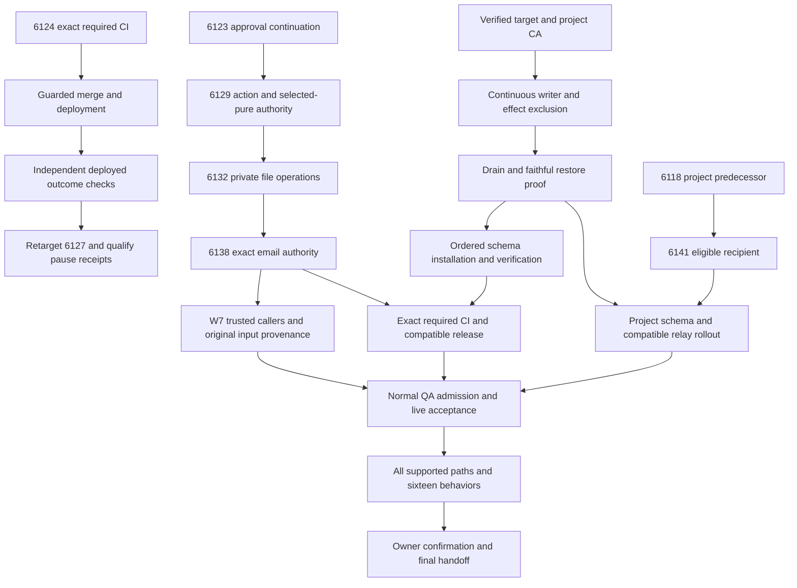

# SupraOS Release Plan Checklist

Working checkpoint: 2026-10-02 17:44 UTC. Active until the owner-requested pause at19:36:59UTC. Read the accompanying detailed handoff for scope, code locations, source hashes, evidence limits and new-computer setup.

| Delivery item | Implemented/integrated | Tested/audited | Merged | Deployed | Verified live |
| --- | --- | --- | --- | --- | --- |
| PR6034 dispatch identity/checkpoint concurrency | Yes | Required gates and scoped independent checks passed | Yes | Yes | Public/unsigned only; authenticated acceptance open |
| PR6124 original outcome holds | Yes | Scoped source evidence; required CI pending | No | No | No |
| PR6127 pause receipts | Yes | Scoped evidence, predecessor release pending | No | No | No |
| PR6123 original scheduled approval | Yes | Qualified repaired source; required CI pending | No | No | No |
| PR6129 action/selected-pure authority | Yes | Qualified frozen source; required CI pending | No | No | No |
| PR6132 owner-private workflow storage | Yes | Qualified source incl actual mounted browser; required CI pending | No | No | No |
| PR6138 exact email authority and recovery | Yes |152 mixed checks with final changed suite replay;114types;106-commit secret scan | No | No | No |
| PR6141 project recipient repair c8d5 | Yes |13 captured native +20 canonical caller;52 types; independent audit; required CI pending | No | No | No |
| W7 workflow tool original identity | Historical source; current stack integration in progress | Current227de retry RED; caller/provenance closure and successor proof pending | No | No | No |
| Workflow/project schema operator and activation | Partial existing components | Continuous exclusion, faithful restore and actual operation remain open | No release claim | No | No |
| All supported execution paths and16 behaviors | Partial | Integrated live matrix open | Partial components only | Partial components only | Unfinished |

## Immediate dependency order

1. Keep qualified PR6141 frozen. Complete W7 retained caller identity and original input/target provenance; verify actual production caller positives and retry/unknown/changed-target refusal.
2. Finish required CI on existing immutable candidates. Release no-new-SQL6124 when the unchanged guard allows it, independently observe deployment and test actual behavior;6127 follows its base.
3. Qualify target/CA, continuous writer/effect exclusion, drainage and faithful backup/restore for the actual workflow/project operator.
4. Install only reviewed uninstalled packets with same-target VERIFY/catalog/ACL/cache proof, then compatible web/cron/client rollout and controlled activation.
5. Use normal QA admission and actual provider configuration to independently verify positive, denied, revoked, failure and recovery paths.
6. Complete all16 behaviors across every supported surface; then provide precise owner confirmation tests.
7. At the requested deadline, pause implementation, update this public checklist and the detailed handoff, verify anonymous links, record unfinished originals/processes and preserve evidence.

## External dependencies

- Authorized project-specific database CA/target provenance.
- Normal invitation sponsorship for the dedicated QA member; no permissions bypass.
- Pending Stripe/provider configuration for its full-scope capability.
- Existing required CI capacity; keep current budgets, priorities and release controls unchanged.

## Scope and completion

Personal chat, Telegram, voice, delegation, background agents, projects/workspaces, scheduled research, Rooms, Routines and System Workflows remain in scope. iMessage is deferred; WhatsApp excluded. Each task tracks implementation, integration, tests, independent audit, merge, deployment and live verification separately. No percentage is inferred from task or test counts. A pause or partial release does not mean the project is finished.

## Dependency graph

Edges show prerequisites, not automatic permission to activate. Every release requires its exact source gates and relevant independent live checks. External prerequisites remain open until evidenced.
